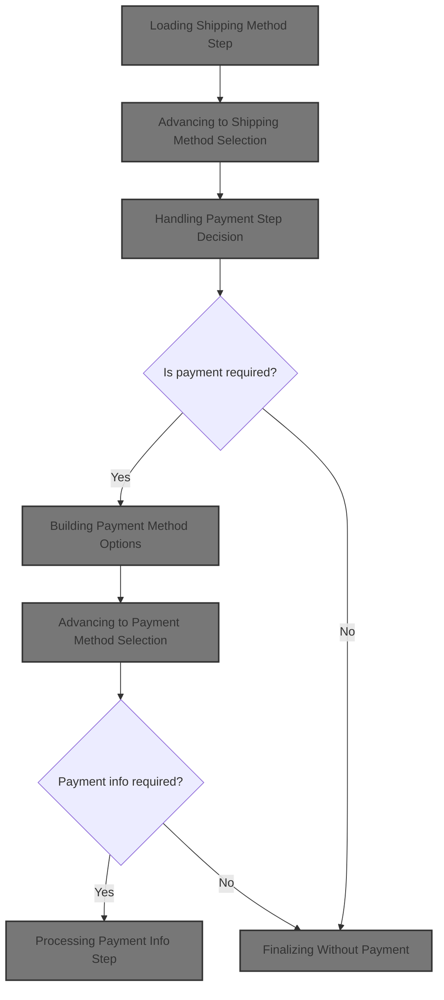
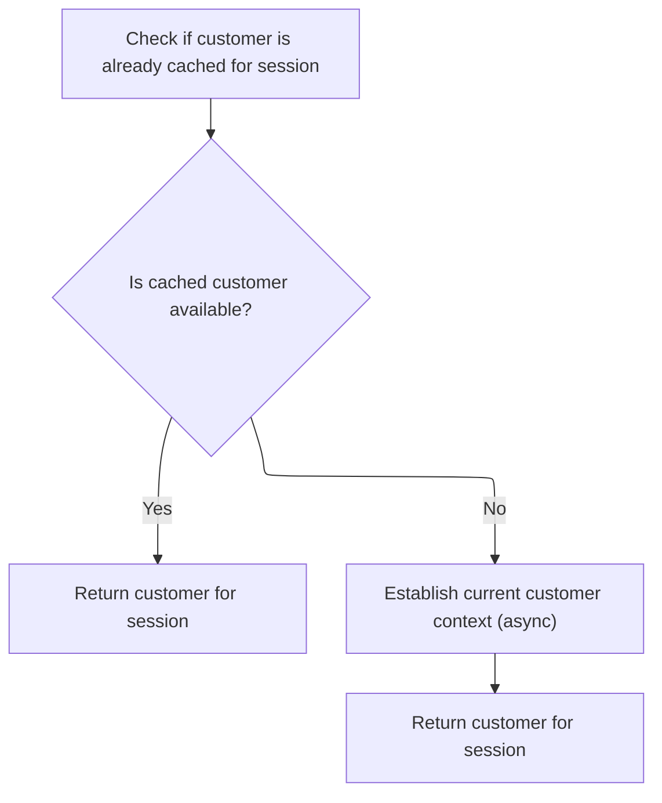
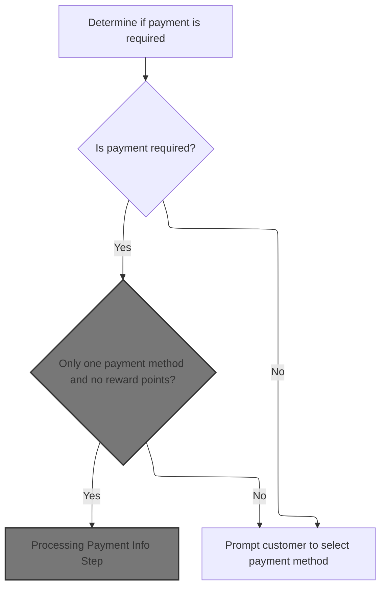
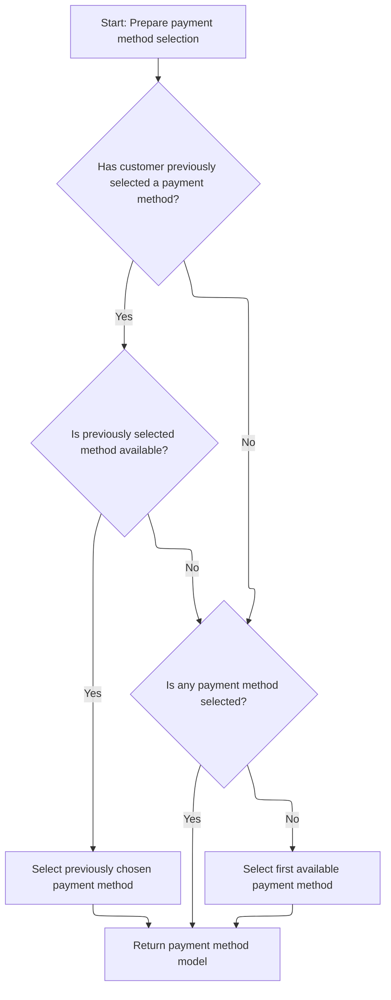

This document outlines how the checkout process advances after a customer enters their shipping address. The flow determines available shipping and payment options, automatically selects steps when only one choice exists, and guides the customer to the next relevant checkout step, considering reward points and country-specific payment methods.



# Where is this flow used?

This flow is used multiple times in the codebase as represented in the following diagram:

```mermaid
graph TD;
      f2c578c3046d746c730cf8b4343706207966fb3abf9836ee7eeedae8b285b2ae(src/…/Controllers/CheckoutController.cs::CheckoutController.OpcSaveBilling) --> 2d9d04e8b89db9d97e3b528906fa68e0c07d1e59c2e4060eb2041821bcd2effd(src/…/Controllers/CheckoutController.cs::CheckoutController.OpcLoadStepAfterShippingAddress)

0d0d38af0ddbc7382a0b1564f13552e86931aa2bcfd8bf6da10ad3e678fe6027(src/…/Controllers/CheckoutController.cs::CheckoutController.OpcSaveShipping) --> 2d9d04e8b89db9d97e3b528906fa68e0c07d1e59c2e4060eb2041821bcd2effd(src/…/Controllers/CheckoutController.cs::CheckoutController.OpcLoadStepAfterShippingAddress)


classDef mainFlowStyle color:#000000,fill:#7CB9F4
classDef rootsStyle color:#000000,fill:#00FFF4
classDef Style1 color:#000000,fill:#00FFAA
classDef Style2 color:#000000,fill:#FFFF00
classDef Style3 color:#000000,fill:#AA7CB9

%% Swimm:
%% graph TD;
%%       f2c578c3046d746c730cf8b4343706207966fb3abf9836ee7eeedae8b285b2ae(<SwmPath>[src/…/Controllers/CheckoutController.cs](src/Presentation/Nop.Web/Controllers/CheckoutController.cs)</SwmPath>::CheckoutController.OpcSaveBilling) --> 2d9d04e8b89db9d97e3b528906fa68e0c07d1e59c2e4060eb2041821bcd2effd(<SwmPath>[src/…/Controllers/CheckoutController.cs](src/Presentation/Nop.Web/Controllers/CheckoutController.cs)</SwmPath>::CheckoutController.OpcLoadStepAfterShippingAddress)
%% 
%% 0d0d38af0ddbc7382a0b1564f13552e86931aa2bcfd8bf6da10ad3e678fe6027(<SwmPath>[src/…/Controllers/CheckoutController.cs](src/Presentation/Nop.Web/Controllers/CheckoutController.cs)</SwmPath>::CheckoutController.OpcSaveShipping) --> 2d9d04e8b89db9d97e3b528906fa68e0c07d1e59c2e4060eb2041821bcd2effd(<SwmPath>[src/…/Controllers/CheckoutController.cs](src/Presentation/Nop.Web/Controllers/CheckoutController.cs)</SwmPath>::CheckoutController.OpcLoadStepAfterShippingAddress)
%% 
%% 
%% classDef mainFlowStyle color:#000000,fill:#7CB9F4
%% classDef rootsStyle color:#000000,fill:#00FFF4
%% classDef Style1 color:#000000,fill:#00FFAA
%% classDef Style2 color:#000000,fill:#FFFF00
%% classDef Style3 color:#000000,fill:#AA7CB9
```



# Loading Shipping Method Step

<SwmSnippet path="/src/Presentation/Nop.Web/Controllers/CheckoutController.cs" line="1175">

---

In <SwmToken path="src/Presentation/Nop.Web/Controllers/CheckoutController.cs" pos="1175:12:12" line-data="        protected virtual async Task&lt;JsonResult&gt; OpcLoadStepAfterShippingAddress(IList&lt;ShoppingCartItem&gt; cart)">`OpcLoadStepAfterShippingAddress`</SwmToken>, we start by preparing the shipping method model using the customer's shipping address. We check if there's only one shipping method and, if so, save it as the selected option for the customer. To get the right address and customer-specific data, we need to fetch the current customer context next.

```c#
        protected virtual async Task<JsonResult> OpcLoadStepAfterShippingAddress(IList<ShoppingCartItem> cart)
        {
            var shippingMethodModel = await _checkoutModelFactory.PrepareShippingMethodModelAsync(cart, await _customerService.GetCustomerShippingAddressAsync(await _workContext.GetCurrentCustomerAsync()));
            if (_shippingSettings.BypassShippingMethodSelectionIfOnlyOne &&
                shippingMethodModel.ShippingMethods.Count == 1)
            {
                //if we have only one shipping method, then a customer doesn't have to choose a shipping method
                await _genericAttributeService.SaveAttributeAsync(await _workContext.GetCurrentCustomerAsync(),
                    NopCustomerDefaults.SelectedShippingOptionAttribute,
                    shippingMethodModel.ShippingMethods.First().ShippingOption,
                    (await _storeContext.GetCurrentStoreAsync()).Id);

```

---

</SwmSnippet>

## Resolving Current Customer



<SwmSnippet path="/src/Presentation/Nop.Web.Framework/WebWorkContext.cs" line="199">

---

We grab the cached customer if possible, otherwise we run logic to figure out who the current customer is. This sets up the context for everything that follows.

```c#
        public virtual async Task<Customer> GetCurrentCustomerAsync()
        {
            //whether there is a cached value
            if (_cachedCustomer != null)
                return _cachedCustomer;

            await SetCurrentCustomerAsync();

            return _cachedCustomer;
        }
```

---

</SwmSnippet>

## Identifying Customer Type

```mermaid
%%{init: {"flowchart": {"defaultRenderer": "elk"}} }%%
flowchart TD
    node1["Start: Set current customer"] --> node2{"Is customer provided?"}
    click node1 openCode "src/Presentation/Nop.Web.Framework/WebWorkContext.cs:215:216"
    node2 -->|"Yes"| node3{"Is customer valid?"}
    click node2 openCode "src/Presentation/Nop.Web.Framework/WebWorkContext.cs:217:218"
    node2 -->|"No"| node4{"Is request from background task?"}
    click node3 openCode "src/Presentation/Nop.Web.Framework/WebWorkContext.cs:228:229"
    node4 -->|"Yes"| node5["Use background task customer"]
    click node4 openCode "src/Presentation/Nop.Web.Framework/WebWorkContext.cs:220:225"
    node4 -->|"No"| node6{"Is request from search engine?"}
    click node5 openCode "src/Presentation/Nop.Web.Framework/WebWorkContext.cs:225:226"
    node6 -->|"Yes"| node7["Use search engine customer"]
    click node6 openCode "src/Presentation/Nop.Web.Framework/WebWorkContext.cs:231:233"
    node6 -->|"No"| node8["Use authenticated customer"]
    click node7 openCode "src/Presentation/Nop.Web.Framework/WebWorkContext.cs:232:233"
    click node8 openCode "src/Presentation/Nop.Web.Framework/WebWorkContext.cs:238:239"
    node5 --> node9{"Is customer valid?"}
    node7 --> node9
    node8 --> node9
    node3 -->|"Valid"| node10{"Is impersonation required?"}
    node3 -->|"Not valid"| node4
    node9 -->|"Valid"| node10
    node9 -->|"Not valid"| node11{"Is guest customer available?"}
    click node9 openCode "src/Presentation/Nop.Web.Framework/WebWorkContext.cs:241:242"
    node10 -->|"Yes"| node12["Set impersonated customer"]
    click node10 openCode "src/Presentation/Nop.Web.Framework/WebWorkContext.cs:243:256"
    node10 -->|"No"| node13["Set customer"]
    click node12 openCode "src/Presentation/Nop.Web.Framework/WebWorkContext.cs:254:256"
    node12 --> node13
    node11 -->|"Yes"| node14["Set guest customer"]
    click node11 openCode "src/Presentation/Nop.Web.Framework/WebWorkContext.cs:263:270"
    node11 -->|"No"| node15["Create new guest customer"]
    click node15 openCode "src/Presentation/Nop.Web.Framework/WebWorkContext.cs:276:277"
    node14 --> node13
    node15 --> node13
    node13 --> node16["Set customer cookie and cache customer"]
    click node13 openCode "src/Presentation/Nop.Web.Framework/WebWorkContext.cs:282:287"
    click node16 openCode "src/Presentation/Nop.Web.Framework/WebWorkContext.cs:282:287"

classDef HeadingStyle fill:#777777,stroke:#333,stroke-width:2px;

%% Swimm:
%% %%{init: {"flowchart": {"defaultRenderer": "elk"}} }%%
%% flowchart TD
%%     node1["Start: Set current customer"] --> node2{"Is customer provided?"}
%%     click node1 openCode "<SwmPath>[src/…/Nop.Web.Framework/WebWorkContext.cs](src/Presentation/Nop.Web.Framework/WebWorkContext.cs)</SwmPath>:215:216"
%%     node2 -->|"Yes"| node3{"Is customer valid?"}
%%     click node2 openCode "<SwmPath>[src/…/Nop.Web.Framework/WebWorkContext.cs](src/Presentation/Nop.Web.Framework/WebWorkContext.cs)</SwmPath>:217:218"
%%     node2 -->|"No"| node4{"Is request from background task?"}
%%     click node3 openCode "<SwmPath>[src/…/Nop.Web.Framework/WebWorkContext.cs](src/Presentation/Nop.Web.Framework/WebWorkContext.cs)</SwmPath>:228:229"
%%     node4 -->|"Yes"| node5["Use background task customer"]
%%     click node4 openCode "<SwmPath>[src/…/Nop.Web.Framework/WebWorkContext.cs](src/Presentation/Nop.Web.Framework/WebWorkContext.cs)</SwmPath>:220:225"
%%     node4 -->|"No"| node6{"Is request from search engine?"}
%%     click node5 openCode "<SwmPath>[src/…/Nop.Web.Framework/WebWorkContext.cs](src/Presentation/Nop.Web.Framework/WebWorkContext.cs)</SwmPath>:225:226"
%%     node6 -->|"Yes"| node7["Use search engine customer"]
%%     click node6 openCode "<SwmPath>[src/…/Nop.Web.Framework/WebWorkContext.cs](src/Presentation/Nop.Web.Framework/WebWorkContext.cs)</SwmPath>:231:233"
%%     node6 -->|"No"| node8["Use authenticated customer"]
%%     click node7 openCode "<SwmPath>[src/…/Nop.Web.Framework/WebWorkContext.cs](src/Presentation/Nop.Web.Framework/WebWorkContext.cs)</SwmPath>:232:233"
%%     click node8 openCode "<SwmPath>[src/…/Nop.Web.Framework/WebWorkContext.cs](src/Presentation/Nop.Web.Framework/WebWorkContext.cs)</SwmPath>:238:239"
%%     node5 --> node9{"Is customer valid?"}
%%     node7 --> node9
%%     node8 --> node9
%%     node3 -->|"Valid"| node10{"Is impersonation required?"}
%%     node3 -->|"Not valid"| node4
%%     node9 -->|"Valid"| node10
%%     node9 -->|"Not valid"| node11{"Is guest customer available?"}
%%     click node9 openCode "<SwmPath>[src/…/Nop.Web.Framework/WebWorkContext.cs](src/Presentation/Nop.Web.Framework/WebWorkContext.cs)</SwmPath>:241:242"
%%     node10 -->|"Yes"| node12["Set impersonated customer"]
%%     click node10 openCode "<SwmPath>[src/…/Nop.Web.Framework/WebWorkContext.cs](src/Presentation/Nop.Web.Framework/WebWorkContext.cs)</SwmPath>:243:256"
%%     node10 -->|"No"| node13["Set customer"]
%%     click node12 openCode "<SwmPath>[src/…/Nop.Web.Framework/WebWorkContext.cs](src/Presentation/Nop.Web.Framework/WebWorkContext.cs)</SwmPath>:254:256"
%%     node12 --> node13
%%     node11 -->|"Yes"| node14["Set guest customer"]
%%     click node11 openCode "<SwmPath>[src/…/Nop.Web.Framework/WebWorkContext.cs](src/Presentation/Nop.Web.Framework/WebWorkContext.cs)</SwmPath>:263:270"
%%     node11 -->|"No"| node15["Create new guest customer"]
%%     click node15 openCode "<SwmPath>[src/…/Nop.Web.Framework/WebWorkContext.cs](src/Presentation/Nop.Web.Framework/WebWorkContext.cs)</SwmPath>:276:277"
%%     node14 --> node13
%%     node15 --> node13
%%     node13 --> node16["Set customer cookie and cache customer"]
%%     click node13 openCode "<SwmPath>[src/…/Nop.Web.Framework/WebWorkContext.cs](src/Presentation/Nop.Web.Framework/WebWorkContext.cs)</SwmPath>:282:287"
%%     click node16 openCode "<SwmPath>[src/…/Nop.Web.Framework/WebWorkContext.cs](src/Presentation/Nop.Web.Framework/WebWorkContext.cs)</SwmPath>:282:287"
%% 
%% classDef HeadingStyle fill:#777777,stroke:#333,stroke-width:2px;
```



<SwmSnippet path="/src/Presentation/Nop.Web.Framework/WebWorkContext.cs" line="215">

---

In <SwmToken path="src/Presentation/Nop.Web.Framework/WebWorkContext.cs" pos="215:9:9" line-data="        public virtual async Task SetCurrentCustomerAsync(Customer customer = null)">`SetCurrentCustomerAsync`</SwmToken>, we run through a bunch of checks to figure out what kind of customer we're dealing with: background task, search engine, authenticated user, or guest. If we hit the authenticated user branch, we need to call the authentication service next to see if there's a <SwmToken path="src/Presentation/Nop.Web.Framework/WebWorkContext.cs" pos="296:12:14" line-data="        /// Gets the current vendor (logged-in manager)">`logged-in`</SwmToken> user we can use.

```c#
        public virtual async Task SetCurrentCustomerAsync(Customer customer = null)
        {
            if (customer == null)
            {
                //check whether request is made by a background (schedule) task
                if (_httpContextAccessor.HttpContext?.Request
                    ?.Path.Equals(new PathString($"/{Services.Tasks.NopTaskDefaults.ScheduleTaskPath}"), StringComparison.InvariantCultureIgnoreCase)
                    ?? true)
                {
                    //in this case return built-in customer record for background task
                    customer = await _customerService.GetOrCreateBackgroundTaskUserAsync();
                }

                if (customer == null || customer.Deleted || !customer.Active || customer.RequireReLogin)
                {
                    //check whether request is made by a search engine, in this case return built-in customer record for search engines
                    if (_userAgentHelper.IsSearchEngine())
                        customer = await _customerService.GetOrCreateSearchEngineUserAsync();
                }

                if (customer == null || customer.Deleted || !customer.Active || customer.RequireReLogin)
                {
                    //try to get registered user
                    customer = await _authenticationService.GetAuthenticatedCustomerAsync();
                }

```

---

</SwmSnippet>

<SwmSnippet path="/src/Libraries/Nop.Services/Authentication/CookieAuthenticationService.cs" line="100">

---

<SwmToken path="src/Libraries/Nop.Services/Authentication/CookieAuthenticationService.cs" pos="100:12:12" line-data="        public virtual async Task&lt;Customer&gt; GetAuthenticatedCustomerAsync()">`GetAuthenticatedCustomerAsync`</SwmToken> tries to get a cached authenticated customer first. If not found, it authenticates the user via HTTP context, then fetches the customer by username or email depending on settings. It checks if the customer is valid and caches the result for speed.

```c#
        public virtual async Task<Customer> GetAuthenticatedCustomerAsync()
        {
            //whether there is a cached customer
            if (_cachedCustomer != null)
                return _cachedCustomer;

            //try to get authenticated user identity
            var authenticateResult = await _httpContextAccessor.HttpContext.AuthenticateAsync(NopAuthenticationDefaults.AuthenticationScheme);
            if (!authenticateResult.Succeeded)
                return null;

            Customer customer = null;
            if (_customerSettings.UsernamesEnabled)
            {
                //try to get customer by username
                var usernameClaim = authenticateResult.Principal.FindFirst(claim => claim.Type == ClaimTypes.Name
                    && claim.Issuer.Equals(NopAuthenticationDefaults.ClaimsIssuer, StringComparison.InvariantCultureIgnoreCase));
                if (usernameClaim != null)
                    customer = await _customerService.GetCustomerByUsernameAsync(usernameClaim.Value);
            }
            else
            {
                //try to get customer by email
                var emailClaim = authenticateResult.Principal.FindFirst(claim => claim.Type == ClaimTypes.Email
                    && claim.Issuer.Equals(NopAuthenticationDefaults.ClaimsIssuer, StringComparison.InvariantCultureIgnoreCase));
                if (emailClaim != null)
                    customer = await _customerService.GetCustomerByEmailAsync(emailClaim.Value);
            }

            //whether the found customer is available
            if (customer == null || !customer.Active || customer.RequireReLogin || customer.Deleted || !await _customerService.IsRegisteredAsync(customer))
                return null;

            //cache authenticated customer
            _cachedCustomer = customer;

            return _cachedCustomer;
        }
```

---

</SwmSnippet>

<SwmSnippet path="/src/Presentation/Nop.Web.Framework/WebWorkContext.cs" line="241">

---

Back in <SwmToken path="src/Presentation/Nop.Web.Framework/WebWorkContext.cs" pos="205:3:3" line-data="            await SetCurrentCustomerAsync();">`SetCurrentCustomerAsync`</SwmToken>, after getting the authenticated customer, we check for impersonation and switch context if needed. If no valid customer is found, we fall back to cookies or create a guest. Finally, we set the cookie and cache the customer for later use.

```c#
                if (customer != null && !customer.Deleted && customer.Active && !customer.RequireReLogin)
                {
                    //get impersonate user if required
                    var impersonatedCustomerId = await _genericAttributeService
                        .GetAttributeAsync<int?>(customer, NopCustomerDefaults.ImpersonatedCustomerIdAttribute);
                    if (impersonatedCustomerId.HasValue && impersonatedCustomerId.Value > 0)
                    {
                        var impersonatedCustomer = await _customerService.GetCustomerByIdAsync(impersonatedCustomerId.Value);
                        if (impersonatedCustomer != null && !impersonatedCustomer.Deleted &&
                            impersonatedCustomer.Active &&
                            !impersonatedCustomer.RequireReLogin)
                        {
                            //set impersonated customer
                            _originalCustomerIfImpersonated = customer;
                            customer = impersonatedCustomer;
                        }
                    }
                }

                if (customer == null || customer.Deleted || !customer.Active || customer.RequireReLogin)
                {
                    //get guest customer
                    var customerCookie = GetCustomerCookie();
                    if (Guid.TryParse(customerCookie, out var customerGuid))
                    {
                        //get customer from cookie (should not be registered)
                        var customerByCookie = await _customerService.GetCustomerByGuidAsync(customerGuid);
                        if (customerByCookie != null && !await _customerService.IsRegisteredAsync(customerByCookie))
                            customer = customerByCookie;
                    }
                }

                if (customer == null || customer.Deleted || !customer.Active || customer.RequireReLogin)
                {
                    //create guest if not exists
                    customer = await _customerService.InsertGuestCustomerAsync();
                }
            }

            if (!customer.Deleted && customer.Active && !customer.RequireReLogin)
            {
                //set customer cookie
                SetCustomerCookie(customer.CustomerGuid);

                //cache the found customer
                _cachedCustomer = customer;
            }
        }
```

---

</SwmSnippet>

## Advancing to Shipping Method Selection

<SwmSnippet path="/src/Presentation/Nop.Web/Controllers/CheckoutController.cs" line="1187">

---

After getting the customer context, <SwmToken path="src/Presentation/Nop.Web/Controllers/CheckoutController.cs" pos="1175:12:12" line-data="        protected virtual async Task&lt;JsonResult&gt; OpcLoadStepAfterShippingAddress(IList&lt;ShoppingCartItem&gt; cart)">`OpcLoadStepAfterShippingAddress`</SwmToken> either jumps straight to the next step if there's only one shipping method, or renders the selection UI. We call <SwmToken path="src/Presentation/Nop.Web/Controllers/CheckoutController.cs" pos="1188:5:5" line-data="                return await OpcLoadStepAfterShippingMethod(cart);">`OpcLoadStepAfterShippingMethod`</SwmToken> next to continue the checkout flow.

```c#
                //load next step
                return await OpcLoadStepAfterShippingMethod(cart);
            }

            return Json(new
            {
                update_section = new UpdateSectionJsonModel
                {
                    name = "shipping-method",
                    html = await RenderPartialViewToStringAsync("OpcShippingMethods", shippingMethodModel)
                },
                goto_section = "shipping_method"
            });
        }
```

---

</SwmSnippet>

# Handling Payment Step Decision



<SwmSnippet path="/src/Presentation/Nop.Web/Controllers/CheckoutController.cs" line="1203">

---

In <SwmToken path="src/Presentation/Nop.Web/Controllers/CheckoutController.cs" pos="1203:12:12" line-data="        protected virtual async Task&lt;JsonResult&gt; OpcLoadStepAfterShippingMethod(IList&lt;ShoppingCartItem&gt; cart)">`OpcLoadStepAfterShippingMethod`</SwmToken>, we check if payment is needed for the cart. If so, we figure out the country filter and call the model factory to get the available payment methods for the customer.

```c#
        protected virtual async Task<JsonResult> OpcLoadStepAfterShippingMethod(IList<ShoppingCartItem> cart)
        {
            //Check whether payment workflow is required
            //we ignore reward points during cart total calculation
            var isPaymentWorkflowRequired = await _orderProcessingService.IsPaymentWorkflowRequiredAsync(cart, false);
            if (isPaymentWorkflowRequired)
            {
                //filter by country
                var filterByCountryId = 0;
                if (_addressSettings.CountryEnabled)
                {
                    filterByCountryId = (await _customerService.GetCustomerBillingAddressAsync(await _workContext.GetCurrentCustomerAsync()))?.CountryId ?? 0;
                }

                //payment is required
                var paymentMethodModel = await _checkoutModelFactory.PreparePaymentMethodModelAsync(cart, filterByCountryId);

```

---

</SwmSnippet>

## Building Payment Method Options

<SwmSnippet path="/src/Presentation/Nop.Web/Factories/CheckoutModelFactory.cs" line="448">

---

In <SwmToken path="src/Presentation/Nop.Web/Factories/CheckoutModelFactory.cs" pos="448:12:12" line-data="        public virtual async Task&lt;CheckoutPaymentMethodModel&gt; PreparePaymentMethodModelAsync(IList&lt;ShoppingCartItem&gt; cart, int filterByCountryId)">`PreparePaymentMethodModelAsync`</SwmToken>, we build up the payment method options, check for reward points, filter by country, and loop through available payment plugins. For each method, we need to call the payment service to get any extra handling fees before showing them to the user.

```c#
        public virtual async Task<CheckoutPaymentMethodModel> PreparePaymentMethodModelAsync(IList<ShoppingCartItem> cart, int filterByCountryId)
        {
            var model = new CheckoutPaymentMethodModel();

            //reward points
            if (_rewardPointsSettings.Enabled && !await _shoppingCartService.ShoppingCartIsRecurringAsync(cart))
            {
                var rewardPointsBalance = await _rewardPointService.GetRewardPointsBalanceAsync((await _workContext.GetCurrentCustomerAsync()).Id, (await _storeContext.GetCurrentStoreAsync()).Id);
                rewardPointsBalance = _rewardPointService.GetReducedPointsBalance(rewardPointsBalance);

                var rewardPointsAmountBase = await _orderTotalCalculationService.ConvertRewardPointsToAmountAsync(rewardPointsBalance);
                var rewardPointsAmount = await _currencyService.ConvertFromPrimaryStoreCurrencyAsync(rewardPointsAmountBase, await _workContext.GetWorkingCurrencyAsync());
                if (rewardPointsAmount > decimal.Zero &&
                    _orderTotalCalculationService.CheckMinimumRewardPointsToUseRequirement(rewardPointsBalance))
                {
                    model.DisplayRewardPoints = true;
                    model.RewardPointsAmount = await _priceFormatter.FormatPriceAsync(rewardPointsAmount, true, false);
                    model.RewardPointsBalance = rewardPointsBalance;

                    //are points enough to pay for entire order? like if this option (to use them) was selected
                    model.RewardPointsEnoughToPayForOrder = !await _orderProcessingService.IsPaymentWorkflowRequiredAsync(cart, true);
                }
            }

            //filter by country
            var paymentMethods = await (await _paymentPluginManager
                .LoadActivePluginsAsyncAsync(await _workContext.GetCurrentCustomerAsync(), (await _storeContext.GetCurrentStoreAsync()).Id, filterByCountryId))
                .Where(pm => pm.PaymentMethodType == PaymentMethodType.Standard || pm.PaymentMethodType == PaymentMethodType.Redirection)
                .WhereAwait(async pm => !await pm.HidePaymentMethodAsync(cart))
                .ToListAsync();
            foreach (var pm in paymentMethods)
            {
                if (await _shoppingCartService.ShoppingCartIsRecurringAsync(cart) && pm.RecurringPaymentType == RecurringPaymentType.NotSupported)
                    continue;

                var pmModel = new CheckoutPaymentMethodModel.PaymentMethodModel
                {
                    Name = await _localizationService.GetLocalizedFriendlyNameAsync(pm, (await _workContext.GetWorkingLanguageAsync()).Id),
                    Description = _paymentSettings.ShowPaymentMethodDescriptions ? await pm.GetPaymentMethodDescriptionAsync() : string.Empty,
                    PaymentMethodSystemName = pm.PluginDescriptor.SystemName,
                    LogoUrl = await _paymentPluginManager.GetPluginLogoUrlAsync(pm)
                };
                //payment method additional fee
                var paymentMethodAdditionalFee = await _paymentService.GetAdditionalHandlingFeeAsync(cart, pm.PluginDescriptor.SystemName);
                var (rateBase, _) = await _taxService.GetPaymentMethodAdditionalFeeAsync(paymentMethodAdditionalFee, await _workContext.GetCurrentCustomerAsync());
                var rate = await _currencyService.ConvertFromPrimaryStoreCurrencyAsync(rateBase, await _workContext.GetWorkingCurrencyAsync());
                if (rate > decimal.Zero)
                    pmModel.Fee = await _priceFormatter.FormatPaymentMethodAdditionalFeeAsync(rate, true);

                model.PaymentMethods.Add(pmModel);
            }

```

---

</SwmSnippet>

### Calculating Payment Method Fees

See <SwmLink doc-title="Calculating and Applying Additional Handling Fees">[Calculating and Applying Additional Handling Fees](.swm%5Ccalculating-and-applying-additional-handling-fees.m9h2hil0.sw.md)</SwmLink>

### Selecting Default Payment Method



<SwmSnippet path="/src/Presentation/Nop.Web/Factories/CheckoutModelFactory.cs" line="500">

---

Back in <SwmToken path="src/Presentation/Nop.Web/Controllers/CheckoutController.cs" pos="1218:11:11" line-data="                var paymentMethodModel = await _checkoutModelFactory.PreparePaymentMethodModelAsync(cart, filterByCountryId);">`PreparePaymentMethodModelAsync`</SwmToken>, after getting the fees, we check if the user already picked a payment method. If not, we auto-select the first available one so the flow doesn't get stuck.

```c#
            //find a selected (previously) payment method
            var selectedPaymentMethodSystemName = await _genericAttributeService.GetAttributeAsync<string>(await _workContext.GetCurrentCustomerAsync(),
                NopCustomerDefaults.SelectedPaymentMethodAttribute, (await _storeContext.GetCurrentStoreAsync()).Id);
            if (!string.IsNullOrEmpty(selectedPaymentMethodSystemName))
            {
                var paymentMethodToSelect = model.PaymentMethods.ToList()
                    .Find(pm => pm.PaymentMethodSystemName.Equals(selectedPaymentMethodSystemName, StringComparison.InvariantCultureIgnoreCase));
                if (paymentMethodToSelect != null)
                    paymentMethodToSelect.Selected = true;
            }
            //if no option has been selected, let's do it for the first one
            if (model.PaymentMethods.FirstOrDefault(so => so.Selected) == null)
            {
                var paymentMethodToSelect = model.PaymentMethods.FirstOrDefault();
                if (paymentMethodToSelect != null)
                    paymentMethodToSelect.Selected = true;
            }

            return model;
        }
```

---

</SwmSnippet>

## Advancing to Payment Method Selection

<SwmSnippet path="/src/Presentation/Nop.Web/Controllers/CheckoutController.cs" line="1220">

---

After building the payment method model in <SwmToken path="src/Presentation/Nop.Web/Controllers/CheckoutController.cs" pos="1188:5:5" line-data="                return await OpcLoadStepAfterShippingMethod(cart);">`OpcLoadStepAfterShippingMethod`</SwmToken>, if there's only one method and no reward points, we save it as the user's choice and load the plugin instance. If it's active, we jump straight to <SwmToken path="src/Presentation/Nop.Web/Controllers/CheckoutController.cs" pos="1236:5:5" line-data="                    return await OpcLoadStepAfterPaymentMethod(paymentMethodInst, cart);">`OpcLoadStepAfterPaymentMethod`</SwmToken> to keep the flow moving.

```c#
                if (_paymentSettings.BypassPaymentMethodSelectionIfOnlyOne &&
                    paymentMethodModel.PaymentMethods.Count == 1 && !paymentMethodModel.DisplayRewardPoints)
                {
                    //if we have only one payment method and reward points are disabled or the current customer doesn't have any reward points
                    //so customer doesn't have to choose a payment method

                    var selectedPaymentMethodSystemName = paymentMethodModel.PaymentMethods[0].PaymentMethodSystemName;
                    await _genericAttributeService.SaveAttributeAsync(await _workContext.GetCurrentCustomerAsync(),
                        NopCustomerDefaults.SelectedPaymentMethodAttribute,
                        selectedPaymentMethodSystemName, (await _storeContext.GetCurrentStoreAsync()).Id);

                    var paymentMethodInst = await _paymentPluginManager
                        .LoadPluginBySystemNameAsync(selectedPaymentMethodSystemName, await _workContext.GetCurrentCustomerAsync(), (await _storeContext.GetCurrentStoreAsync()).Id);
                    if (!_paymentPluginManager.IsPluginActive(paymentMethodInst))
                        throw new Exception("Selected payment method can't be parsed");

                    return await OpcLoadStepAfterPaymentMethod(paymentMethodInst, cart);
                }

                //customer have to choose a payment method
                return Json(new
                {
                    update_section = new UpdateSectionJsonModel
                    {
                        name = "payment-method",
                        html = await RenderPartialViewToStringAsync("OpcPaymentMethods", paymentMethodModel)
                    },
                    goto_section = "payment_method"
                });
            }

```

---

</SwmSnippet>

## Processing Payment Info Step

<SwmSnippet path="/src/Presentation/Nop.Web/Controllers/CheckoutController.cs" line="1268">

---

In <SwmToken path="src/Presentation/Nop.Web/Controllers/CheckoutController.cs" pos="1268:12:12" line-data="        protected virtual async Task&lt;JsonResult&gt; OpcLoadStepAfterPaymentMethod(IPaymentMethod paymentMethod, IList&lt;ShoppingCartItem&gt; cart)">`OpcLoadStepAfterPaymentMethod`</SwmToken>, if the payment method doesn't need extra info, we skip that page, save a blank payment info to session, and call the model factory to prep the confirm order model for the next step.

```c#
        protected virtual async Task<JsonResult> OpcLoadStepAfterPaymentMethod(IPaymentMethod paymentMethod, IList<ShoppingCartItem> cart)
        {
            if (paymentMethod.SkipPaymentInfo ||
                (paymentMethod.PaymentMethodType == PaymentMethodType.Redirection && _paymentSettings.SkipPaymentInfoStepForRedirectionPaymentMethods))
            {
                //skip payment info page
                var paymentInfo = new ProcessPaymentRequest();

                //session save
                HttpContext.Session.Set("OrderPaymentInfo", paymentInfo);

                var confirmOrderModel = await _checkoutModelFactory.PrepareConfirmOrderModelAsync(cart);
                return Json(new
                {
                    update_section = new UpdateSectionJsonModel
                    {
                        name = "confirm-order",
                        html = await RenderPartialViewToStringAsync("OpcConfirmOrder", confirmOrderModel)
                    },
                    goto_section = "confirm_order"
                });
            }

```

---

</SwmSnippet>

### Preparing Order Confirmation

<SwmSnippet path="/src/Presentation/Nop.Web/Factories/CheckoutModelFactory.cs" line="546">

---

We prep the confirmation model and validate the order total before moving on.

```c#
        public virtual async Task<CheckoutConfirmModel> PrepareConfirmOrderModelAsync(IList<ShoppingCartItem> cart)
        {
            var model = new CheckoutConfirmModel
            {
                //terms of service
                TermsOfServiceOnOrderConfirmPage = _orderSettings.TermsOfServiceOnOrderConfirmPage,
                TermsOfServicePopup = _commonSettings.PopupForTermsOfServiceLinks
            };
            //min order amount validation
            var minOrderTotalAmountOk = await _orderProcessingService.ValidateMinOrderTotalAmountAsync(cart);
```

---

</SwmSnippet>

<SwmSnippet path="/src/Libraries/Nop.Services/Orders/OrderProcessingService.cs" line="3150">

---

<SwmToken path="src/Libraries/Nop.Services/Orders/OrderProcessingService.cs" pos="3150:12:12" line-data="        public virtual async Task&lt;bool&gt; ValidateMinOrderTotalAmountAsync(IList&lt;ShoppingCartItem&gt; cart)">`ValidateMinOrderTotalAmountAsync`</SwmToken> checks if the cart is empty or the minimum is zero, then calls the order total calculation service to get the cart's total and compare it to the minimum required.

```c#
        public virtual async Task<bool> ValidateMinOrderTotalAmountAsync(IList<ShoppingCartItem> cart)
        {
            if (cart == null)
                throw new ArgumentNullException(nameof(cart));

            if (!cart.Any() || _orderSettings.MinOrderTotalAmount <= decimal.Zero)
                return true;

            var shoppingCartTotalBase = (await _orderTotalCalculationService.GetShoppingCartTotalAsync(cart)).shoppingCartTotal;

            if (shoppingCartTotalBase.HasValue && shoppingCartTotalBase.Value < _orderSettings.MinOrderTotalAmount)
                return false;

            return true;
        }
```

---

</SwmSnippet>

<SwmSnippet path="/src/Presentation/Nop.Web/Factories/CheckoutModelFactory.cs" line="556">

---

Back in <SwmToken path="src/Presentation/Nop.Web/Controllers/CheckoutController.cs" pos="1255:11:11" line-data="            var confirmOrderModel = await _checkoutModelFactory.PrepareConfirmOrderModelAsync(cart);">`PrepareConfirmOrderModelAsync`</SwmToken>, if the cart doesn't meet the minimum, we convert the amount, format it, and set a warning in the model before returning it.

```c#
            if (!minOrderTotalAmountOk)
            {
                var minOrderTotalAmount = await _currencyService.ConvertFromPrimaryStoreCurrencyAsync(_orderSettings.MinOrderTotalAmount, await _workContext.GetWorkingCurrencyAsync());
                model.MinOrderTotalWarning = string.Format(await _localizationService.GetResourceAsync("Checkout.MinOrderTotalAmount"), await _priceFormatter.FormatPriceAsync(minOrderTotalAmount, true, false));
            }
            return model;
        }
```

---

</SwmSnippet>

### Rendering Payment Info or Confirmation

<SwmSnippet path="/src/Presentation/Nop.Web/Controllers/CheckoutController.cs" line="1291">

---

Back in <SwmToken path="src/Presentation/Nop.Web/Controllers/CheckoutController.cs" pos="1236:5:5" line-data="                    return await OpcLoadStepAfterPaymentMethod(paymentMethodInst, cart);">`OpcLoadStepAfterPaymentMethod`</SwmToken>, if payment info is needed, we call the model factory to prep the payment info model and render the UI for the user to fill out.

```c#
            //return payment info page
            var paymenInfoModel = await _checkoutModelFactory.PreparePaymentInfoModelAsync(paymentMethod);
            return Json(new
            {
                update_section = new UpdateSectionJsonModel
                {
                    name = "payment-info",
                    html = await RenderPartialViewToStringAsync("OpcPaymentInfo", paymenInfoModel)
                },
                goto_section = "payment_info"
            });
        }
```

---

</SwmSnippet>

## Finalizing Without Payment

<SwmSnippet path="/src/Presentation/Nop.Web/Controllers/CheckoutController.cs" line="1251">

---

After returning from <SwmToken path="src/Presentation/Nop.Web/Controllers/CheckoutController.cs" pos="1236:5:5" line-data="                    return await OpcLoadStepAfterPaymentMethod(paymentMethodInst, cart);">`OpcLoadStepAfterPaymentMethod`</SwmToken>, in <SwmToken path="src/Presentation/Nop.Web/Controllers/CheckoutController.cs" pos="1188:5:5" line-data="                return await OpcLoadStepAfterShippingMethod(cart);">`OpcLoadStepAfterShippingMethod`</SwmToken> we clear the payment method attribute if payment isn't needed, prep the confirmation model, and render the final confirmation UI for the user.

```c#
            //payment is not required
            await _genericAttributeService.SaveAttributeAsync<string>(await _workContext.GetCurrentCustomerAsync(),
                NopCustomerDefaults.SelectedPaymentMethodAttribute, null, (await _storeContext.GetCurrentStoreAsync()).Id);

            var confirmOrderModel = await _checkoutModelFactory.PrepareConfirmOrderModelAsync(cart);
            return Json(new
            {
                update_section = new UpdateSectionJsonModel
                {
                    name = "confirm-order",
                    html = await RenderPartialViewToStringAsync("OpcConfirmOrder", confirmOrderModel)
                },
                goto_section = "confirm_order"
            });
        }
```

---

</SwmSnippet>

&nbsp;

*This is an auto-generated document by Swimm 🌊 and has not yet been verified by a human*

<SwmMeta version="3.0.0" repo-id="Z2l0aHViJTNBJTNBbnBDb21tZXJjZUFTUERvdG5ldCUzQSUzQXVtYWxpbmdhc3dhbWk=" repo-name="npCommerceASPDotnet"><sup>Powered by [Swimm](https://app.swimm.io/)</sup></SwmMeta>
