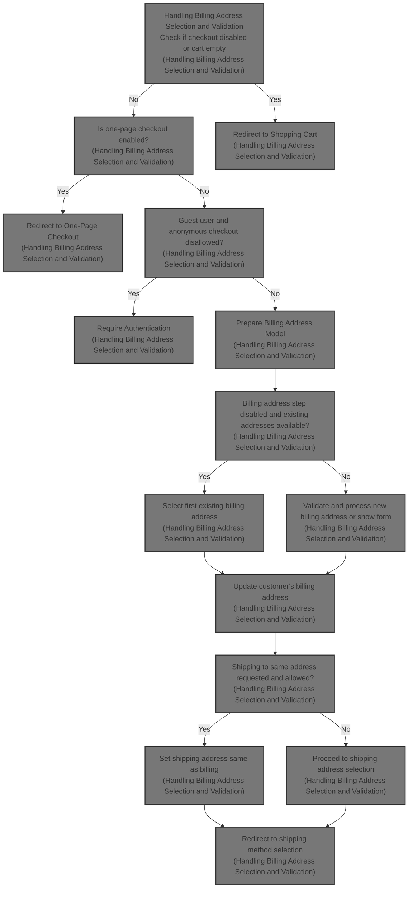

This document explains the flow of handling billing address selection and validation during checkout. It ensures users can provide or select a billing address, validates the address, and manages navigation to the next checkout step. The flow includes checks for checkout availability, cart contents, guest user authentication, and shipping address handling when shipping to the same address is requested.



# Handling Billing Address Selection and Validation

```mermaid
%%{init: {"flowchart": {"defaultRenderer": "elk"}} }%%
flowchart TD
    node1{"Is checkout disabled?"}
    click node1 openCode "src/Presentation/Nop.Web/Controllers/CheckoutController.cs:437:438"
    node1 -->|"Yes"| node2["Redirect to Shopping Cart"]
    click node2 openCode "src/Presentation/Nop.Web/Controllers/CheckoutController.cs:438:438"
    node1 -->|"No"| node3{"Is shopping cart empty?"}
    click node3 openCode "src/Presentation/Nop.Web/Controllers/CheckoutController.cs:442:443"
    node3 -->|"Yes"| node2
    node3 -->|"No"| node4{"Is one-page checkout enabled?"}
    click node4 openCode "src/Presentation/Nop.Web/Controllers/CheckoutController.cs:445:446"
    node4 -->|"Yes"| node5["Redirect to One-Page Checkout"]
    click node5 openCode "src/Presentation/Nop.Web/Controllers/CheckoutController.cs:446:446"
    node4 -->|"No"| node6{"Is user guest and anonymous checkout disallowed?"}
    click node6 openCode "src/Presentation/Nop.Web/Controllers/CheckoutController.cs:448:449"
    node6 -->|"Yes"| node7["Challenge authentication"]
    click node7 openCode "src/Presentation/Nop.Web/Controllers/CheckoutController.cs:449:449"
    node6 -->|"No"| node8["Prepare billing address model"]
    click node8 openCode "src/Presentation/Nop.Web/Controllers/CheckoutController.cs:452:452"
    node8 --> node9{"Is billing address step disabled and existing addresses available?"}
    click node9 openCode "src/Presentation/Nop.Web/Controllers/CheckoutController.cs:455:456"
    node9 -->|"Yes"| node10["Select first existing billing address"]
    click node10 openCode "src/Presentation/Nop.Web/Controllers/CheckoutController.cs:460:460"
    node9 -->|"No"| node11["Validate and process new billing address or show form"]
    click node11 openCode "src/Presentation/Nop.Web/Controllers/CheckoutController.cs:463:465"
    node11 --> node12["Show billing address view"]
    click node12 openCode "src/Presentation/Nop.Web/Controllers/CheckoutController.cs:468:468"
classDef HeadingStyle fill:#777777,stroke:#333,stroke-width:2px;

%% Swimm:
%% %%{init: {"flowchart": {"defaultRenderer": "elk"}} }%%
%% flowchart TD
%%     node1{"Is checkout disabled?"}
%%     click node1 openCode "<SwmPath>[src/…/Controllers/CheckoutController.cs](src/Presentation/Nop.Web/Controllers/CheckoutController.cs)</SwmPath>:437:438"
%%     node1 -->|"Yes"| node2["Redirect to Shopping Cart"]
%%     click node2 openCode "<SwmPath>[src/…/Controllers/CheckoutController.cs](src/Presentation/Nop.Web/Controllers/CheckoutController.cs)</SwmPath>:438:438"
%%     node1 -->|"No"| node3{"Is shopping cart empty?"}
%%     click node3 openCode "<SwmPath>[src/…/Controllers/CheckoutController.cs](src/Presentation/Nop.Web/Controllers/CheckoutController.cs)</SwmPath>:442:443"
%%     node3 -->|"Yes"| node2
%%     node3 -->|"No"| node4{"Is one-page checkout enabled?"}
%%     click node4 openCode "<SwmPath>[src/…/Controllers/CheckoutController.cs](src/Presentation/Nop.Web/Controllers/CheckoutController.cs)</SwmPath>:445:446"
%%     node4 -->|"Yes"| node5["Redirect to One-Page Checkout"]
%%     click node5 openCode "<SwmPath>[src/…/Controllers/CheckoutController.cs](src/Presentation/Nop.Web/Controllers/CheckoutController.cs)</SwmPath>:446:446"
%%     node4 -->|"No"| node6{"Is user guest and anonymous checkout disallowed?"}
%%     click node6 openCode "<SwmPath>[src/…/Controllers/CheckoutController.cs](src/Presentation/Nop.Web/Controllers/CheckoutController.cs)</SwmPath>:448:449"
%%     node6 -->|"Yes"| node7["Challenge authentication"]
%%     click node7 openCode "<SwmPath>[src/…/Controllers/CheckoutController.cs](src/Presentation/Nop.Web/Controllers/CheckoutController.cs)</SwmPath>:449:449"
%%     node6 -->|"No"| node8["Prepare billing address model"]
%%     click node8 openCode "<SwmPath>[src/…/Controllers/CheckoutController.cs](src/Presentation/Nop.Web/Controllers/CheckoutController.cs)</SwmPath>:452:452"
%%     node8 --> node9{"Is billing address step disabled and existing addresses available?"}
%%     click node9 openCode "<SwmPath>[src/…/Controllers/CheckoutController.cs](src/Presentation/Nop.Web/Controllers/CheckoutController.cs)</SwmPath>:455:456"
%%     node9 -->|"Yes"| node10["Select first existing billing address"]
%%     click node10 openCode "<SwmPath>[src/…/Controllers/CheckoutController.cs](src/Presentation/Nop.Web/Controllers/CheckoutController.cs)</SwmPath>:460:460"
%%     node9 -->|"No"| node11["Validate and process new billing address or show form"]
%%     click node11 openCode "<SwmPath>[src/…/Controllers/CheckoutController.cs](src/Presentation/Nop.Web/Controllers/CheckoutController.cs)</SwmPath>:463:465"
%%     node11 --> node12["Show billing address view"]
%%     click node12 openCode "<SwmPath>[src/…/Controllers/CheckoutController.cs](src/Presentation/Nop.Web/Controllers/CheckoutController.cs)</SwmPath>:468:468"
%% classDef HeadingStyle fill:#777777,stroke:#333,stroke-width:2px;
```



<SwmSnippet path="/src/Presentation/Nop.Web/Controllers/CheckoutController.cs" line="434">

---

Here, <SwmToken path="src/Presentation/Nop.Web/Controllers/CheckoutController.cs" pos="434:12:12" line-data="        public virtual async Task&lt;IActionResult&gt; BillingAddress(IFormCollection form)">`BillingAddress`</SwmToken> starts the checkout by validating if checkout is allowed, the cart has items, and the user can proceed. It prepares the billing address model for the view or, if billing address step is disabled but addresses exist, it picks the first address and calls <SwmToken path="src/Presentation/Nop.Web/Controllers/CheckoutController.cs" pos="460:5:5" line-data="                    return await SelectBillingAddress(model.ExistingAddresses.First().Id);">`SelectBillingAddress`</SwmToken> to set it and continue the flow automatically.

```c#
        public virtual async Task<IActionResult> BillingAddress(IFormCollection form)
        {
            //validation
            if (_orderSettings.CheckoutDisabled)
                return RedirectToRoute("ShoppingCart");

            var cart = await _shoppingCartService.GetShoppingCartAsync(await _workContext.GetCurrentCustomerAsync(), ShoppingCartType.ShoppingCart, (await _storeContext.GetCurrentStoreAsync()).Id);

            if (!cart.Any())
                return RedirectToRoute("ShoppingCart");

            if (_orderSettings.OnePageCheckoutEnabled)
                return RedirectToRoute("CheckoutOnePage");

            if (await _customerService.IsGuestAsync(await _workContext.GetCurrentCustomerAsync()) && !_orderSettings.AnonymousCheckoutAllowed)
                return Challenge();

            //model
            var model = await _checkoutModelFactory.PrepareBillingAddressModelAsync(cart, prePopulateNewAddressWithCustomerFields: true);

            //check whether "billing address" step is enabled
            if (_orderSettings.DisableBillingAddressCheckoutStep && model.ExistingAddresses.Any())
            {
                if (model.ExistingAddresses.Any())
                {
                    //choose the first one
                    return await SelectBillingAddress(model.ExistingAddresses.First().Id);
                }

                TryValidateModel(model);
                TryValidateModel(model.BillingNewAddress);
                return await NewBillingAddress(model, form);
            }

            return View(model);
        }
```

---

</SwmSnippet>

<SwmSnippet path="/src/Presentation/Nop.Web/Controllers/CheckoutController.cs" line="472">

---

<SwmToken path="src/Presentation/Nop.Web/Controllers/CheckoutController.cs" pos="472:12:12" line-data="        public virtual async Task&lt;IActionResult&gt; SelectBillingAddress(int addressId, bool shipToSameAddress = false)">`SelectBillingAddress`</SwmToken> validates checkout status again, fetches and verifies the billing address belongs to the user, updates the customer's billing address, then checks if shipping to the same address is allowed and requested. If yes, it sets shipping address accordingly, resets shipping selections, and redirects to shipping method selection; otherwise, it redirects to shipping address selection.

```c#
        public virtual async Task<IActionResult> SelectBillingAddress(int addressId, bool shipToSameAddress = false)
        {
            //validation
            if (_orderSettings.CheckoutDisabled)
                return RedirectToRoute("ShoppingCart");

            var address = await _customerService.GetCustomerAddressAsync((await _workContext.GetCurrentCustomerAsync()).Id, addressId);

            if (address == null)
                return RedirectToRoute("CheckoutBillingAddress");

            (await _workContext.GetCurrentCustomerAsync()).BillingAddressId = address.Id;
            await _customerService.UpdateCustomerAsync(await _workContext.GetCurrentCustomerAsync());

            var cart = await _shoppingCartService.GetShoppingCartAsync(await _workContext.GetCurrentCustomerAsync(), ShoppingCartType.ShoppingCart, (await _storeContext.GetCurrentStoreAsync()).Id);

            //ship to the same address?
            //by default Shipping is available if the country is not specified
            var shippingAllowed = !_addressSettings.CountryEnabled || ((await _countryService.GetCountryByAddressAsync(address))?.AllowsShipping ?? false);
            if (_shippingSettings.ShipToSameAddress && shipToSameAddress && await _shoppingCartService.ShoppingCartRequiresShippingAsync(cart) && shippingAllowed)
            {
                (await _workContext.GetCurrentCustomerAsync()).ShippingAddressId = (await _workContext.GetCurrentCustomerAsync()).BillingAddressId;
                await _customerService.UpdateCustomerAsync(await _workContext.GetCurrentCustomerAsync());
                //reset selected shipping method (in case if "pick up in store" was selected)
                await _genericAttributeService.SaveAttributeAsync<ShippingOption>(await _workContext.GetCurrentCustomerAsync(), NopCustomerDefaults.SelectedShippingOptionAttribute, null, (await _storeContext.GetCurrentStoreAsync()).Id);
                await _genericAttributeService.SaveAttributeAsync<PickupPoint>(await _workContext.GetCurrentCustomerAsync(), NopCustomerDefaults.SelectedPickupPointAttribute, null, (await _storeContext.GetCurrentStoreAsync()).Id);
                //limitation - "Ship to the same address" doesn't properly work in "pick up in store only" case (when no shipping plugins are available) 
                return RedirectToRoute("CheckoutShippingMethod");
            }

            return RedirectToRoute("CheckoutShippingAddress");
        }
```

---

</SwmSnippet>

&nbsp;

*This is an auto-generated document by Swimm 🌊 and has not yet been verified by a human*

<SwmMeta version="3.0.0" repo-id="Z2l0aHViJTNBJTNBbnBDb21tZXJjZUFTUERvdG5ldCUzQSUzQXVtYWxpbmdhc3dhbWk=" repo-name="npCommerceASPDotnet"><sup>Powered by [Swimm](https://app.swimm.io/)</sup></SwmMeta>
