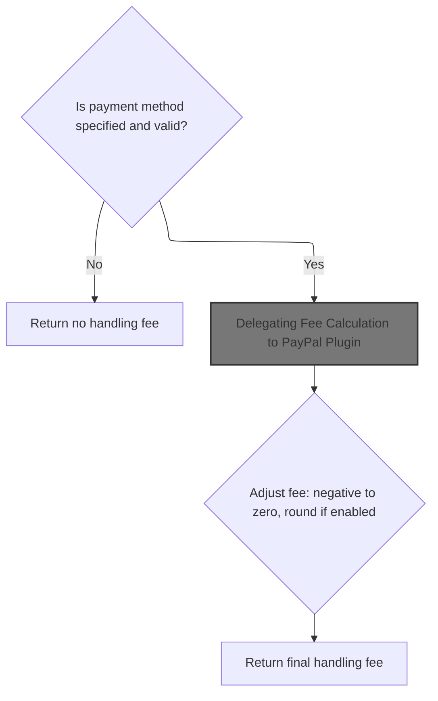
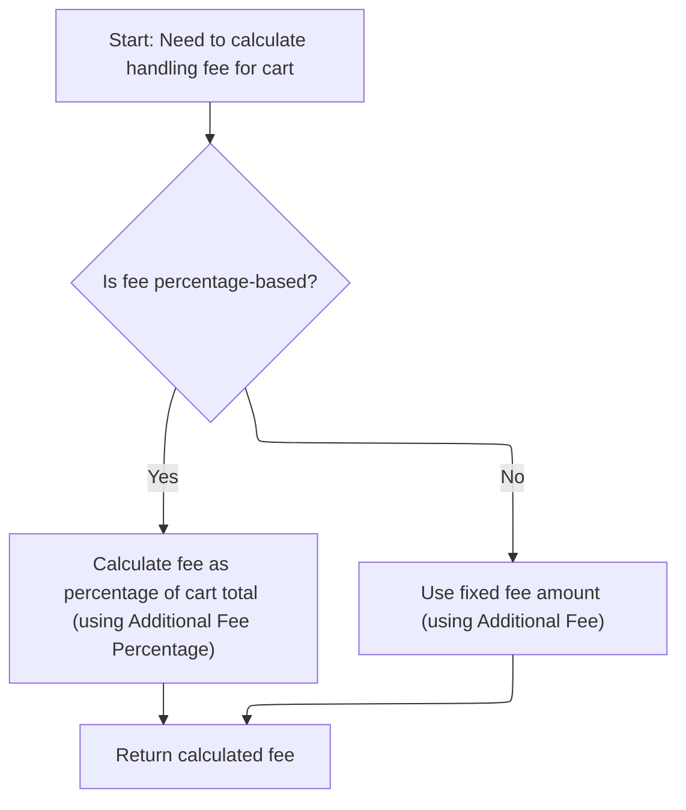
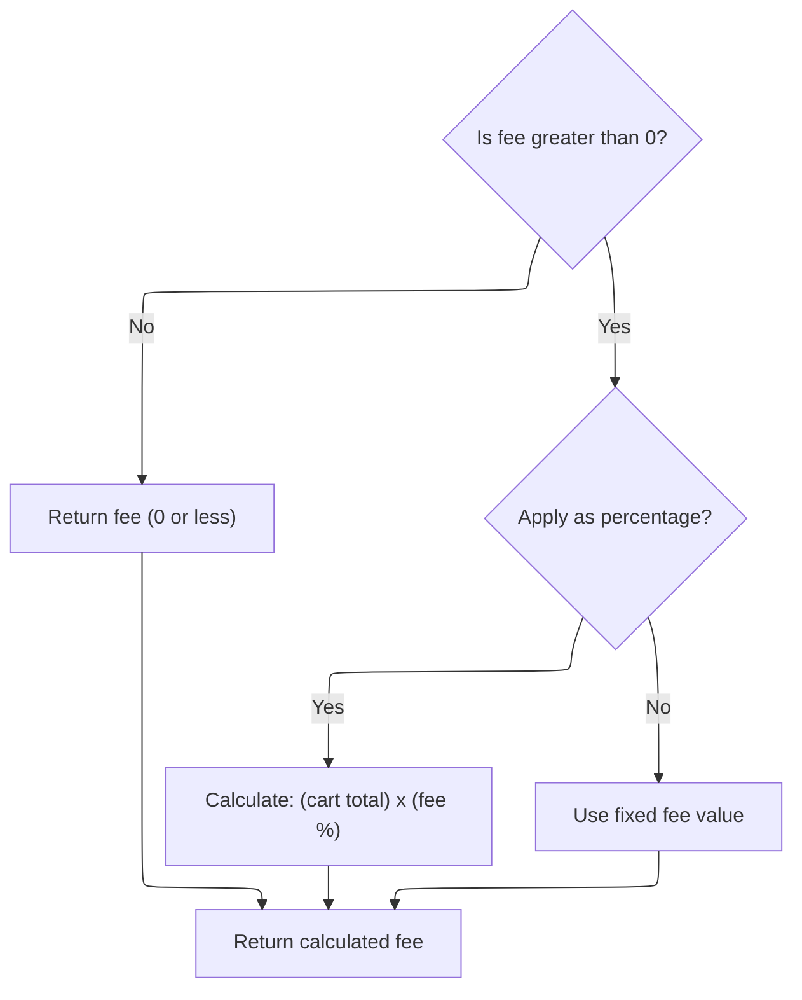
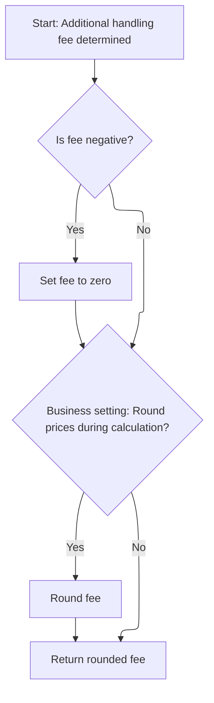

This document describes how the platform calculates and applies an additional handling fee to a customer's order during checkout. The system determines the appropriate fee—either fixed or percentage-based—using the cart total and payment settings, then integrates it into the overall order total alongside discounts, shipping, and taxes.

# Starting the Handling Fee Calculation



<SwmSnippet path="/src/Libraries/Nop.Services/Payments/PaymentService.cs" line="152">

---

In `GetAdditionalHandlingFeeAsync`, we start by validating the payment method system name and loading the corresponding payment plugin for the customer and store. We then call the plugin's `GetAdditionalHandlingFeeAsync` to let it handle the specifics of fee calculation for the selected payment method.

```c#
        public virtual async Task<decimal> GetAdditionalHandlingFeeAsync(IList<ShoppingCartItem> cart, string paymentMethodSystemName)
        {
            if (string.IsNullOrEmpty(paymentMethodSystemName))
                return decimal.Zero;

            var customer = await _customerService.GetCustomerByIdAsync(cart.FirstOrDefault()?.CustomerId ?? 0);
            var paymentMethod = await _paymentPluginManager.LoadPluginBySystemNameAsync(paymentMethodSystemName, customer, cart.FirstOrDefault()?.StoreId ?? 0);
            if (paymentMethod == null)
                return decimal.Zero;

            var result = await paymentMethod.GetAdditionalHandlingFeeAsync(cart);
```

---

</SwmSnippet>

## Delegating Fee Calculation to PayPal Plugin



<SwmSnippet path="/src/Plugins/Nop.Plugin.Payments.PayPalStandard/PayPalStandardPaymentProcessor.cs" line="430">

---

`GetAdditionalHandlingFeeAsync` in the PayPal plugin just hands off the cart and its fee settings to the payment service, which does the actual calculation based on whether the fee is fixed or percentage-based.

```c#
        public async Task<decimal> GetAdditionalHandlingFeeAsync(IList<ShoppingCartItem> cart)
        {
            return await _paymentService.CalculateAdditionalFeeAsync(cart,
                _payPalStandardPaymentSettings.AdditionalFee, _payPalStandardPaymentSettings.AdditionalFeePercentage);
        }
```

---

</SwmSnippet>

## Calculating the Fee Value



<SwmSnippet path="/src/Libraries/Nop.Services/Payments/PaymentService.cs" line="383">

---

`CalculateAdditionalFeeAsync` checks if the fee is percentage-based, and if so, gets the cart total (excluding payment fees) from the order total calculation service to compute the fee. Otherwise, it just uses the fixed fee value.

```c#
        public virtual async Task<decimal> CalculateAdditionalFeeAsync(IList<ShoppingCartItem> cart, decimal fee, bool usePercentage)
        {
            if (fee <= 0)
                return fee;

            decimal result;
            if (usePercentage)
            {
                //percentage
                var orderTotalCalculationService = EngineContext.Current.Resolve<IOrderTotalCalculationService>();
                var orderTotalWithoutPaymentFee = (await orderTotalCalculationService.GetShoppingCartTotalAsync(cart, usePaymentMethodAdditionalFee: false)).shoppingCartTotal ?? 0;
                result = (decimal)((float)orderTotalWithoutPaymentFee * (float)fee / 100f);
            }
            else
            {
                //fixed value
                result = fee;
            }

            return result;
        }
```

---

</SwmSnippet>

## Getting the Cart Total for Fee Calculation

```mermaid
%%{init: {"flowchart": {"defaultRenderer": "elk"}} }%%
flowchart TD
    node1["Calculate subtotal with discounts"] --> node2["Add shipping cost"]
    click node1 openCode "src/Libraries/Nop.Services/Orders/OrderTotalCalculationService.cs:1192:1194"
    click node2 openCode "src/Libraries/Nop.Services/Orders/OrderTotalCalculationService.cs:1197:1199"
    node2 --> node3{"Include payment method fee?"}
    node3 -->|"Yes"| node4["Add payment method fee"]
    click node4 openCode "src/Libraries/Nop.Services/Orders/OrderTotalCalculationService.cs:1203:1208"
    node3 -->|"No"| node5["Skip fee"]
    click node5 openCode "src/Libraries/Nop.Services/Orders/OrderTotalCalculationService.cs:1200:1201"
    node4 --> node6["Add tax"]
    node5 --> node6
    click node6 openCode "src/Libraries/Nop.Services/Orders/OrderTotalCalculationService.cs:1211:1211"
    node6 --> node7["Sum up order total"]
    click node7 openCode "src/Libraries/Nop.Services/Orders/OrderTotalCalculationService.cs:1214:1222"
    node7 --> node8{"Is discount greater than subtotal?"}
    click node8 openCode "src/Libraries/Nop.Services/Orders/OrderTotalCalculationService.cs:1230:1231"
    node8 -->|"Yes"| node9["Set discount to subtotal"]
    click node9 openCode "src/Libraries/Nop.Services/Orders/OrderTotalCalculationService.cs:1231:1231"
    node8 -->|"No"| node10["Apply discount"]
    click node10 openCode "src/Libraries/Nop.Services/Orders/OrderTotalCalculationService.cs:1234:1234"
    node9 --> node11["Reduce order total by discount"]
    click node11 openCode "src/Libraries/Nop.Services/Orders/OrderTotalCalculationService.cs:1234:1234"
    node10 --> node11
    node11 --> node12{"Should round prices?"}
    click node12 openCode "src/Libraries/Nop.Services/Orders/OrderTotalCalculationService.cs:1223:1224"
    node12 -->|"Yes"| node13["Round order total"]
    click node13 openCode "src/Libraries/Nop.Services/Orders/OrderTotalCalculationService.cs:1224:1224"
    node12 -->|"No"| node14["Continue"]
    click node14 openCode "src/Libraries/Nop.Services/Orders/OrderTotalCalculationService.cs:1235:1235"
    node13 --> node15["Apply gift cards"]
    click node15 openCode "src/Libraries/Nop.Services/Orders/OrderTotalCalculationService.cs:1242:1243"
    node14 --> node15
    node15 --> node16{"Should round prices?"}
    click node16 openCode "src/Libraries/Nop.Services/Orders/OrderTotalCalculationService.cs:1247:1248"
    node16 -->|"Yes"| node17["Round order total"]
    click node17 openCode "src/Libraries/Nop.Services/Orders/OrderTotalCalculationService.cs:1248:1248"
    node16 -->|"No"| node18["Continue"]
    click node18 openCode "src/Libraries/Nop.Services/Orders/OrderTotalCalculationService.cs:1249:1249"
    node17 --> node19{"Is shipping available?"}
    node18 --> node19
    click node19 openCode "src/Libraries/Nop.Services/Orders/OrderTotalCalculationService.cs:1250:1251"
    node19 -->|"No"| node20["Return error result"]
    click node20 openCode "src/Libraries/Nop.Services/Orders/OrderTotalCalculationService.cs:1253:1253"
    node19 -->|"Yes"| node21["Apply reward points"]
    click node21 openCode "src/Libraries/Nop.Services/Orders/OrderTotalCalculationService.cs:1259:1261"
    node21 --> node22{"Should round prices?"}
    click node22 openCode "src/Libraries/Nop.Services/Orders/OrderTotalCalculationService.cs:1263:1264"
    node22 -->|"Yes"| node23["Round order total"]
    click node23 openCode "src/Libraries/Nop.Services/Orders/OrderTotalCalculationService.cs:1264:1264"
    node22 -->|"No"| node24["Continue"]
    click node24 openCode "src/Libraries/Nop.Services/Orders/OrderTotalCalculationService.cs:1265:1265"
    node23 --> node25["Return final order total"]
    click node25 openCode "src/Libraries/Nop.Services/Orders/OrderTotalCalculationService.cs:1265:1266"
    node24 --> node25
classDef HeadingStyle fill:#777777,stroke:#333,stroke-width:2px;
```



<SwmSnippet path="/src/Libraries/Nop.Services/Orders/OrderTotalCalculationService.cs" line="1176">

---

In `GetShoppingCartTotalAsync`, we pull the payment method from the customer's attributes and, if needed, call back into the payment service to get the handling fee for the cart and payment method.

```c#
        public virtual async Task<(decimal? shoppingCartTotal, decimal discountAmount, List<Discount> appliedDiscounts, List<AppliedGiftCard> appliedGiftCards, int redeemedRewardPoints, decimal redeemedRewardPointsAmount)> GetShoppingCartTotalAsync(IList<ShoppingCartItem> cart,
            bool? useRewardPoints = null, bool usePaymentMethodAdditionalFee = true)
        {
            var redeemedRewardPoints = 0;
            var redeemedRewardPointsAmount = decimal.Zero;

            var customer = await _customerService.GetShoppingCartCustomerAsync(cart);

            var paymentMethodSystemName = string.Empty;
            if (customer != null)
            {
                paymentMethodSystemName = await _genericAttributeService.GetAttributeAsync<string>(customer,
                    NopCustomerDefaults.SelectedPaymentMethodAttribute, (await _storeContext.GetCurrentStoreAsync()).Id);
            }

            //subtotal without tax
            var (_, _, _, subTotalWithDiscountBase, _) = await GetShoppingCartSubTotalAsync(cart, false);
            //subtotal with discount
            var subtotalBase = subTotalWithDiscountBase;

            //shipping without tax
            var shoppingCartShipping = (await GetShoppingCartShippingTotalAsync(cart, false)).shippingTotal;

            //payment method additional fee without tax
            var paymentMethodAdditionalFeeWithoutTax = decimal.Zero;
            if (usePaymentMethodAdditionalFee && !string.IsNullOrEmpty(paymentMethodSystemName))
            {
                var paymentMethodAdditionalFee = await _paymentService.GetAdditionalHandlingFeeAsync(cart,
                    paymentMethodSystemName);
                paymentMethodAdditionalFeeWithoutTax =
                    (await _taxService.GetPaymentMethodAdditionalFeeAsync(paymentMethodAdditionalFee,
                        false, customer)).price;
            }

```

---

</SwmSnippet>

<SwmSnippet path="/src/Libraries/Nop.Services/Orders/OrderTotalCalculationService.cs" line="1210">

---

We just got the handling fee from `GetAdditionalHandlingFeeAsync` and add it to the subtotal, shipping, and tax to build up the final order total, then apply discounts, gift cards, and rounding as needed.

```c#
            //tax
            var shoppingCartTax = (await GetTaxTotalAsync(cart, usePaymentMethodAdditionalFee)).taxTotal;

            //order total
            var resultTemp = decimal.Zero;
            resultTemp += subtotalBase;
            if (shoppingCartShipping.HasValue)
            {
                resultTemp += shoppingCartShipping.Value;
            }

            resultTemp += paymentMethodAdditionalFeeWithoutTax;
            resultTemp += shoppingCartTax;
            if (_shoppingCartSettings.RoundPricesDuringCalculation)
                resultTemp = await _priceCalculationService.RoundPriceAsync(resultTemp);

            //order total discount
            var (discountAmount, appliedDiscounts) = await GetOrderTotalDiscountAsync(customer, resultTemp);

            //sub totals with discount        
            if (resultTemp < discountAmount)
                discountAmount = resultTemp;

            //reduce subtotal
            resultTemp -= discountAmount;

            if (resultTemp < decimal.Zero)
                resultTemp = decimal.Zero;
            if (_shoppingCartSettings.RoundPricesDuringCalculation)
                resultTemp = await _priceCalculationService.RoundPriceAsync(resultTemp);

            //let's apply gift cards now (gift cards that can be used)
            var appliedGiftCards = new List<AppliedGiftCard>();
            resultTemp = await AppliedGiftCardsAsync(cart, appliedGiftCards, customer, resultTemp);

            if (resultTemp < decimal.Zero)
                resultTemp = decimal.Zero;
            if (_shoppingCartSettings.RoundPricesDuringCalculation)
                resultTemp = await _priceCalculationService.RoundPriceAsync(resultTemp);

            if (!shoppingCartShipping.HasValue)
            {
                //we have errors
                return (null, discountAmount, appliedDiscounts, appliedGiftCards,redeemedRewardPoints, redeemedRewardPointsAmount);
            }

            var orderTotal = resultTemp;

            //reward points
            (redeemedRewardPoints, redeemedRewardPointsAmount) = await SetRewardPointsAsync(redeemedRewardPoints, redeemedRewardPointsAmount, useRewardPoints, customer, orderTotal);

            orderTotal -= redeemedRewardPointsAmount;

            if (_shoppingCartSettings.RoundPricesDuringCalculation)
                orderTotal = await _priceCalculationService.RoundPriceAsync(orderTotal);
            return (orderTotal, discountAmount, appliedDiscounts, appliedGiftCards, redeemedRewardPoints, redeemedRewardPointsAmount);
        }
```

---

</SwmSnippet>

## Finalizing the Handling Fee Value



<SwmSnippet path="/src/Libraries/Nop.Services/Payments/PaymentService.cs" line="163">

---

We just got the fee value back from the PayPal plugin, and in `GetAdditionalHandlingFeeAsync`, we clamp it to zero if negative and round it if the settings say so, then return the final fee.

```c#
            if (result < decimal.Zero)
                result = decimal.Zero;

            if (!_shoppingCartSettings.RoundPricesDuringCalculation)
                return result;

            var priceCalculationService = EngineContext.Current.Resolve<IPriceCalculationService>();
            result = await priceCalculationService.RoundPriceAsync(result);

            return result;
        }
```

---

</SwmSnippet>

&nbsp;

*This is an auto-generated document by Swimm 🌊 and has not yet been verified by a human*

<SwmMeta version="3.0.0" repo-id="Z2l0aHViJTNBJTNBbnBDb21tZXJjZUFTUERvdG5ldCUzQSUzQXVtYWxpbmdhc3dhbWk=" repo-name="npCommerceASPDotnet"><sup>Powered by [Swimm](https://app.swimm.io/)</sup></SwmMeta>
