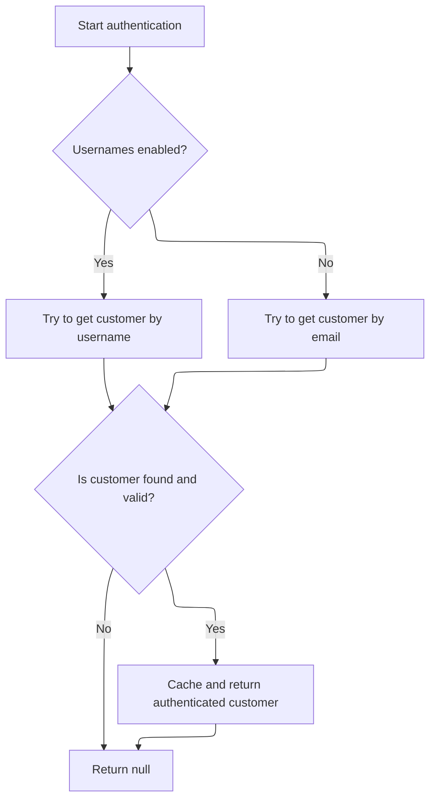
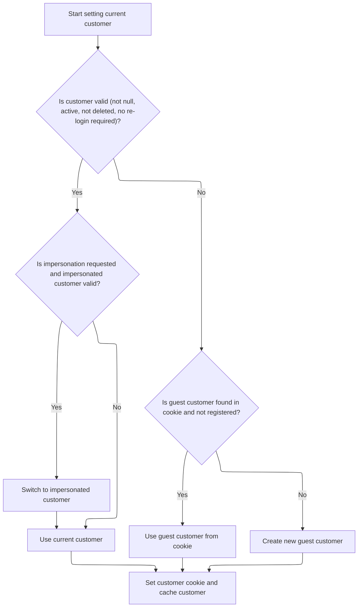

This document describes the flow of identifying and establishing the current customer interacting with the system. The flow receives the HTTP request context and optionally a customer object as input, and outputs the current customer object representing the user. It handles special cases such as background tasks and search engines, authenticates users via cookies and external providers, and manages impersonation and guest users to ensure a valid customer context is always set.

# Where is this flow used?

This flow is used multiple times in the codebase as represented in the following diagram:

(Note - these are only some of the entry points of this flow)

```mermaid
graph TD;
      47c69a1f24d8803fe79a6b061319fc2d9622b2288a83664912a88bff93dd9e06(src/…/Controllers/CatalogController.cs::CatalogController.Category) --> 13d53eb49fbb4de0c3db8dd08eb3795888f4f2de61289faafb9d0dc72893a68f(src/…/Factories/CatalogModelFactory.cs::CatalogModelFactory.PrepareCategoryModelAsync)

47c69a1f24d8803fe79a6b061319fc2d9622b2288a83664912a88bff93dd9e06(src/…/Controllers/CatalogController.cs::CatalogController.Category) --> f525e50ec21c0287e62ceb7227074c9d20674d86cf393c1d83d10b4fc76837eb(src/…/Logging/CustomerActivityService.cs::CustomerActivityService.InsertActivityAsync)

47c69a1f24d8803fe79a6b061319fc2d9622b2288a83664912a88bff93dd9e06(src/…/Controllers/CatalogController.cs::CatalogController.Category) --> 43472c8aa6e6d8ff5396b76464d044eea68746431d13ce3eb035ac7fc92ca311(src/…/Controllers/CatalogController.cs::CatalogController.CheckCategoryAvailabilityAsync)

47c69a1f24d8803fe79a6b061319fc2d9622b2288a83664912a88bff93dd9e06(src/…/Controllers/CatalogController.cs::CatalogController.Category) --> 73716d18e513aa97a81c9d53e05fec78f15fadc121b3cff4c622b848d7f5ad51(src/…/Security/PermissionService.cs::PermissionService.AuthorizeAsync)

47c69a1f24d8803fe79a6b061319fc2d9622b2288a83664912a88bff93dd9e06(src/…/Controllers/CatalogController.cs::CatalogController.Category) --> baac9bcc81ef44dba47d694d6807bdc8fe3ab78e3e82b1d9c4ba73cfbcbf07c7(src/…/Localization/LocalizationService.cs::LocalizationService.GetResourceAsync)

47c69a1f24d8803fe79a6b061319fc2d9622b2288a83664912a88bff93dd9e06(src/…/Controllers/CatalogController.cs::CatalogController.Category) --> f9ae54b01c887680cf1f40c245c87d9fdaafc202dd22a5134d34e9a7e3710386(src/…/Nop.Web.Framework/WebWorkContext.cs::WebWorkContext.GetCurrentCustomerAsync)

13d53eb49fbb4de0c3db8dd08eb3795888f4f2de61289faafb9d0dc72893a68f(src/…/Factories/CatalogModelFactory.cs::CatalogModelFactory.PrepareCategoryModelAsync) --> a5049820d37681c4a0beb7f0dcac9214a2254855dc96ef6a277387812562072c(src/…/Factories/CatalogModelFactory.cs::CatalogModelFactory.PrepareCategoryProductsModelAsync)

13d53eb49fbb4de0c3db8dd08eb3795888f4f2de61289faafb9d0dc72893a68f(src/…/Factories/CatalogModelFactory.cs::CatalogModelFactory.PrepareCategoryModelAsync) --> 1d794f1d5bd5bbebf4d9f50dc689d8c1a62bb39b5c4b15b7cade613099609d87(src/…/Catalog/CategoryService.cs::CategoryService.GetAllCategoriesByParentCategoryIdAsync)

13d53eb49fbb4de0c3db8dd08eb3795888f4f2de61289faafb9d0dc72893a68f(src/…/Factories/CatalogModelFactory.cs::CatalogModelFactory.PrepareCategoryModelAsync) --> d7e6744e096e25fa89919705440220fee87bb777872b484522230a7e33346197(src/…/Catalog/CategoryService.cs::CategoryService.GetCategoryBreadCrumbAsync)

13d53eb49fbb4de0c3db8dd08eb3795888f4f2de61289faafb9d0dc72893a68f(src/…/Factories/CatalogModelFactory.cs::CatalogModelFactory.PrepareCategoryModelAsync) --> 01da2a6c73cc9a266864955d78b7bebbb935581e1ca891d7e62a78cda13794d7(src/…/Factories/ProductModelFactory.cs::ProductModelFactory.PrepareProductOverviewModelsAsync)

13d53eb49fbb4de0c3db8dd08eb3795888f4f2de61289faafb9d0dc72893a68f(src/…/Factories/CatalogModelFactory.cs::CatalogModelFactory.PrepareCategoryModelAsync) --> e0a3b85002ddfe4e96915e00b547afaffaa95abd858a41fe71535458ed7955e8(src/…/Catalog/ProductService.cs::ProductService.GetCategoryFeaturedProductsAsync)

13d53eb49fbb4de0c3db8dd08eb3795888f4f2de61289faafb9d0dc72893a68f(src/…/Factories/CatalogModelFactory.cs::CatalogModelFactory.PrepareCategoryModelAsync) --> baac9bcc81ef44dba47d694d6807bdc8fe3ab78e3e82b1d9c4ba73cfbcbf07c7(src/…/Localization/LocalizationService.cs::LocalizationService.GetResourceAsync)

13d53eb49fbb4de0c3db8dd08eb3795888f4f2de61289faafb9d0dc72893a68f(src/…/Factories/CatalogModelFactory.cs::CatalogModelFactory.PrepareCategoryModelAsync) --> 17f99e3986bdc4e742cc2ed85c2e5a12f5d351da9fa9ebeed3296b3d8acf936b(src/…/Localization/LocalizationService.cs::LocalizationService.GetLocalizedAsync)

13d53eb49fbb4de0c3db8dd08eb3795888f4f2de61289faafb9d0dc72893a68f(src/…/Factories/CatalogModelFactory.cs::CatalogModelFactory.PrepareCategoryModelAsync) --> f0afbc535fd327fca463f4dca68fe5538836a20390d58408f33506c4676ee3f1(src/…/Seo/UrlRecordService.cs::UrlRecordService.GetSeNameAsync)

13d53eb49fbb4de0c3db8dd08eb3795888f4f2de61289faafb9d0dc72893a68f(src/…/Factories/CatalogModelFactory.cs::CatalogModelFactory.PrepareCategoryModelAsync) --> 55e38835199440710d1a4dd3845ecf28376777ce813071f48bcc57b6d6048e91(src/…/Nop.Web.Framework/WebWorkContext.cs::WebWorkContext.GetWorkingLanguageAsync)

a5049820d37681c4a0beb7f0dcac9214a2254855dc96ef6a277387812562072c(src/…/Factories/CatalogModelFactory.cs::CatalogModelFactory.PrepareCategoryProductsModelAsync) --> 4d4fc2fb22c0710869e459aaab6c9054b6c66f9502ae04a3b17c2b2061e42a07(src/…/Catalog/ManufacturerService.cs::ManufacturerService.GetManufacturersByCategoryIdAsync)

a5049820d37681c4a0beb7f0dcac9214a2254855dc96ef6a277387812562072c(src/…/Factories/CatalogModelFactory.cs::CatalogModelFactory.PrepareCategoryProductsModelAsync) --> defc376781699805d967cef7db8675238c0015a3e69fdb4017ee175f1d40d990(src/…/Catalog/SpecificationAttributeService.cs::SpecificationAttributeService.GetFiltrableSpecificationAttributeOptionsByCategoryIdAsync)

a5049820d37681c4a0beb7f0dcac9214a2254855dc96ef6a277387812562072c(src/…/Factories/CatalogModelFactory.cs::CatalogModelFactory.PrepareCategoryProductsModelAsync) --> 18d9a7aacb80b6503bb5a8e8743d1dff29bc1f55a2f856cdfe1c599de7e33eac(src/…/Catalog/CategoryService.cs::CategoryService.GetChildCategoryIdsAsync)

a5049820d37681c4a0beb7f0dcac9214a2254855dc96ef6a277387812562072c(src/…/Factories/CatalogModelFactory.cs::CatalogModelFactory.PrepareCategoryProductsModelAsync) --> ae1165b176f485819d825c072559a0b417ab698c33514556efb32f29220cc8db(src/…/Factories/CatalogModelFactory.cs::CatalogModelFactory.PrepareCatalogProductsAsync)

a5049820d37681c4a0beb7f0dcac9214a2254855dc96ef6a277387812562072c(src/…/Factories/CatalogModelFactory.cs::CatalogModelFactory.PrepareCategoryProductsModelAsync) --> 9e24eda612119f7d60a69ad6b45025fda4cf290a6d41196ae1da140c0bd89fcf(src/…/Catalog/ProductService.cs::ProductService.SearchProductsAsync)

a5049820d37681c4a0beb7f0dcac9214a2254855dc96ef6a277387812562072c(src/…/Factories/CatalogModelFactory.cs::CatalogModelFactory.PrepareCategoryProductsModelAsync) --> 99cd49042ef6a6932cfae94c9a57253eb7cf12841870ee66167dfde4674ae726(src/…/Factories/CatalogModelFactory.cs::CatalogModelFactory.PrepareViewModesAsync)

a5049820d37681c4a0beb7f0dcac9214a2254855dc96ef6a277387812562072c(src/…/Factories/CatalogModelFactory.cs::CatalogModelFactory.PrepareCategoryProductsModelAsync) --> a440787da121c23b116a6ae6bd0c2dcf0cb143579cddb065ea066d1eb917fe6e(src/…/Factories/CatalogModelFactory.cs::CatalogModelFactory.PrepareSpecificationFilterModel)

a5049820d37681c4a0beb7f0dcac9214a2254855dc96ef6a277387812562072c(src/…/Factories/CatalogModelFactory.cs::CatalogModelFactory.PrepareCategoryProductsModelAsync) --> e95e75e5d32cf88a7deaaa8e0cd17dd788992ecc37e3c11d36daace59d0384fb(src/…/Factories/CatalogModelFactory.cs::CatalogModelFactory.PrepareManufacturerFilterModel)

a5049820d37681c4a0beb7f0dcac9214a2254855dc96ef6a277387812562072c(src/…/Factories/CatalogModelFactory.cs::CatalogModelFactory.PrepareCategoryProductsModelAsync) --> bd50c5541de1d7978b87910ef73b837f85813c5cbfdcf48dcd61c0201f2ac9ed(src/…/Factories/CatalogModelFactory.cs::CatalogModelFactory.PrepareSortingOptionsAsync)

a5049820d37681c4a0beb7f0dcac9214a2254855dc96ef6a277387812562072c(src/…/Factories/CatalogModelFactory.cs::CatalogModelFactory.PrepareCategoryProductsModelAsync) --> 39113c27e8bd081bec1b9a64a5c7083295b694ae6ef7d948b38fc63b845ce3d0(src/…/Factories/CatalogModelFactory.cs::CatalogModelFactory.GetConvertedPriceRangeAsync)

a5049820d37681c4a0beb7f0dcac9214a2254855dc96ef6a277387812562072c(src/…/Factories/CatalogModelFactory.cs::CatalogModelFactory.PrepareCategoryProductsModelAsync) --> 177ef1bcbd5d148b6be5e07bddfcf6fbfb43a1f656a8f0b14a08ba2e3ee4af5e(src/…/Factories/CatalogModelFactory.cs::CatalogModelFactory.PreparePriceRangeFilterAsync)

4d4fc2fb22c0710869e459aaab6c9054b6c66f9502ae04a3b17c2b2061e42a07(src/…/Catalog/ManufacturerService.cs::ManufacturerService.GetManufacturersByCategoryIdAsync) --> 18d9a7aacb80b6503bb5a8e8743d1dff29bc1f55a2f856cdfe1c599de7e33eac(src/…/Catalog/CategoryService.cs::CategoryService.GetChildCategoryIdsAsync)

4d4fc2fb22c0710869e459aaab6c9054b6c66f9502ae04a3b17c2b2061e42a07(src/…/Catalog/ManufacturerService.cs::ManufacturerService.GetManufacturersByCategoryIdAsync) --> f9ae54b01c887680cf1f40c245c87d9fdaafc202dd22a5134d34e9a7e3710386(src/…/Nop.Web.Framework/WebWorkContext.cs::WebWorkContext.GetCurrentCustomerAsync)

18d9a7aacb80b6503bb5a8e8743d1dff29bc1f55a2f856cdfe1c599de7e33eac(src/…/Catalog/CategoryService.cs::CategoryService.GetChildCategoryIdsAsync) --> 6071fcf35020b11ecc7e30dd137f29b3ee6963cb55309a636e05188e4b97461f(src/…/Catalog/CategoryService.cs::CategoryService.GetAllCategoriesAsync)

18d9a7aacb80b6503bb5a8e8743d1dff29bc1f55a2f856cdfe1c599de7e33eac(src/…/Catalog/CategoryService.cs::CategoryService.GetChildCategoryIdsAsync) --> 18d9a7aacb80b6503bb5a8e8743d1dff29bc1f55a2f856cdfe1c599de7e33eac(src/…/Catalog/CategoryService.cs::CategoryService.GetChildCategoryIdsAsync)

18d9a7aacb80b6503bb5a8e8743d1dff29bc1f55a2f856cdfe1c599de7e33eac(src/…/Catalog/CategoryService.cs::CategoryService.GetChildCategoryIdsAsync) --> f9ae54b01c887680cf1f40c245c87d9fdaafc202dd22a5134d34e9a7e3710386(src/…/Nop.Web.Framework/WebWorkContext.cs::WebWorkContext.GetCurrentCustomerAsync)

6071fcf35020b11ecc7e30dd137f29b3ee6963cb55309a636e05188e4b97461f(src/…/Catalog/CategoryService.cs::CategoryService.GetAllCategoriesAsync) --> f9ae54b01c887680cf1f40c245c87d9fdaafc202dd22a5134d34e9a7e3710386(src/…/Nop.Web.Framework/WebWorkContext.cs::WebWorkContext.GetCurrentCustomerAsync)

6071fcf35020b11ecc7e30dd137f29b3ee6963cb55309a636e05188e4b97461f(src/…/Catalog/CategoryService.cs::CategoryService.GetAllCategoriesAsync) --> 6071fcf35020b11ecc7e30dd137f29b3ee6963cb55309a636e05188e4b97461f(src/…/Catalog/CategoryService.cs::CategoryService.GetAllCategoriesAsync)

defc376781699805d967cef7db8675238c0015a3e69fdb4017ee175f1d40d990(src/…/Catalog/SpecificationAttributeService.cs::SpecificationAttributeService.GetFiltrableSpecificationAttributeOptionsByCategoryIdAsync) --> 18d9a7aacb80b6503bb5a8e8743d1dff29bc1f55a2f856cdfe1c599de7e33eac(src/…/Catalog/CategoryService.cs::CategoryService.GetChildCategoryIdsAsync)

defc376781699805d967cef7db8675238c0015a3e69fdb4017ee175f1d40d990(src/…/Catalog/SpecificationAttributeService.cs::SpecificationAttributeService.GetFiltrableSpecificationAttributeOptionsByCategoryIdAsync) --> bedabe9e13e1c436d41a75a4a55dfc005401c7d758ff8388e358d8bcd207fd43(src/…/Catalog/SpecificationAttributeService.cs::SpecificationAttributeService.GetAvailableProductsQueryAsync)

bedabe9e13e1c436d41a75a4a55dfc005401c7d758ff8388e358d8bcd207fd43(src/…/Catalog/SpecificationAttributeService.cs::SpecificationAttributeService.GetAvailableProductsQueryAsync) --> f9ae54b01c887680cf1f40c245c87d9fdaafc202dd22a5134d34e9a7e3710386(src/…/Nop.Web.Framework/WebWorkContext.cs::WebWorkContext.GetCurrentCustomerAsync)

ae1165b176f485819d825c072559a0b417ab698c33514556efb32f29220cc8db(src/…/Factories/CatalogModelFactory.cs::CatalogModelFactory.PrepareCatalogProductsAsync) --> 01da2a6c73cc9a266864955d78b7bebbb935581e1ca891d7e62a78cda13794d7(src/…/Factories/ProductModelFactory.cs::ProductModelFactory.PrepareProductOverviewModelsAsync)

ae1165b176f485819d825c072559a0b417ab698c33514556efb32f29220cc8db(src/…/Factories/CatalogModelFactory.cs::CatalogModelFactory.PrepareCatalogProductsAsync) --> baac9bcc81ef44dba47d694d6807bdc8fe3ab78e3e82b1d9c4ba73cfbcbf07c7(src/…/Localization/LocalizationService.cs::LocalizationService.GetResourceAsync)

01da2a6c73cc9a266864955d78b7bebbb935581e1ca891d7e62a78cda13794d7(src/…/Factories/ProductModelFactory.cs::ProductModelFactory.PrepareProductOverviewModelsAsync) --> 7ac9a0a5c63dbe2576591579d63e0d5c3837328fcf5b739ef4e700a995c3d917(src/…/Factories/ProductModelFactory.cs::ProductModelFactory.PrepareProductReviewOverviewModelAsync)

01da2a6c73cc9a266864955d78b7bebbb935581e1ca891d7e62a78cda13794d7(src/…/Factories/ProductModelFactory.cs::ProductModelFactory.PrepareProductOverviewModelsAsync) --> 2255b55c217fea8726cd8b0fc1d71baa162d165a31276362371e5fbc86dd273c(src/…/Factories/ProductModelFactory.cs::ProductModelFactory.PrepareProductOverviewPriceModelAsync)

01da2a6c73cc9a266864955d78b7bebbb935581e1ca891d7e62a78cda13794d7(src/…/Factories/ProductModelFactory.cs::ProductModelFactory.PrepareProductOverviewModelsAsync) --> 044f406c436a0e0b79695f4b2b430b5c8061eb766ece0148d0a3cf8506f7ba0d(src/…/Factories/ProductModelFactory.cs::ProductModelFactory.PrepareProductOverviewPictureModelAsync)

01da2a6c73cc9a266864955d78b7bebbb935581e1ca891d7e62a78cda13794d7(src/…/Factories/ProductModelFactory.cs::ProductModelFactory.PrepareProductOverviewModelsAsync) --> 17f99e3986bdc4e742cc2ed85c2e5a12f5d351da9fa9ebeed3296b3d8acf936b(src/…/Localization/LocalizationService.cs::LocalizationService.GetLocalizedAsync)

01da2a6c73cc9a266864955d78b7bebbb935581e1ca891d7e62a78cda13794d7(src/…/Factories/ProductModelFactory.cs::ProductModelFactory.PrepareProductOverviewModelsAsync) --> 89b96ea78029748da76626bb8a8a0c23503e70fe0893b5256acff7d01fe32eb0(src/…/Factories/ProductModelFactory.cs::ProductModelFactory.PrepareProductSpecificationModelAsync)

01da2a6c73cc9a266864955d78b7bebbb935581e1ca891d7e62a78cda13794d7(src/…/Factories/ProductModelFactory.cs::ProductModelFactory.PrepareProductOverviewModelsAsync) --> f0afbc535fd327fca463f4dca68fe5538836a20390d58408f33506c4676ee3f1(src/…/Seo/UrlRecordService.cs::UrlRecordService.GetSeNameAsync)

7ac9a0a5c63dbe2576591579d63e0d5c3837328fcf5b739ef4e700a995c3d917(src/…/Factories/ProductModelFactory.cs::ProductModelFactory.PrepareProductReviewOverviewModelAsync) --> 698fdc133310c4ceb113e19487f5f2c94567902a4d3368afb67abb807f9d615f(src/…/Catalog/ProductService.cs::ProductService.CanAddReviewAsync)

7ac9a0a5c63dbe2576591579d63e0d5c3837328fcf5b739ef4e700a995c3d917(src/…/Factories/ProductModelFactory.cs::ProductModelFactory.PrepareProductReviewOverviewModelAsync) --> d4771e63232f625c2fd11effc3488e304b8ed47f5f5d1911ac34fd9122b98ed1(src/…/Catalog/ProductService.cs::ProductService.GetAllProductReviewsAsync)

698fdc133310c4ceb113e19487f5f2c94567902a4d3368afb67abb807f9d615f(src/…/Catalog/ProductService.cs::ProductService.CanAddReviewAsync) --> d4771e63232f625c2fd11effc3488e304b8ed47f5f5d1911ac34fd9122b98ed1(src/…/Catalog/ProductService.cs::ProductService.GetAllProductReviewsAsync)

698fdc133310c4ceb113e19487f5f2c94567902a4d3368afb67abb807f9d615f(src/…/Catalog/ProductService.cs::ProductService.CanAddReviewAsync) --> f9ae54b01c887680cf1f40c245c87d9fdaafc202dd22a5134d34e9a7e3710386(src/…/Nop.Web.Framework/WebWorkContext.cs::WebWorkContext.GetCurrentCustomerAsync)

d4771e63232f625c2fd11effc3488e304b8ed47f5f5d1911ac34fd9122b98ed1(src/…/Catalog/ProductService.cs::ProductService.GetAllProductReviewsAsync) --> f9ae54b01c887680cf1f40c245c87d9fdaafc202dd22a5134d34e9a7e3710386(src/…/Nop.Web.Framework/WebWorkContext.cs::WebWorkContext.GetCurrentCustomerAsync)

2255b55c217fea8726cd8b0fc1d71baa162d165a31276362371e5fbc86dd273c(src/…/Factories/ProductModelFactory.cs::ProductModelFactory.PrepareProductOverviewPriceModelAsync) --> 8a9e19a61e24d5633e913c710d1dfbbf076107b9a1c149acdc189d32d98c7785(src/…/Factories/ProductModelFactory.cs::ProductModelFactory.PrepareGroupedProductOverviewPriceModelAsync)

2255b55c217fea8726cd8b0fc1d71baa162d165a31276362371e5fbc86dd273c(src/…/Factories/ProductModelFactory.cs::ProductModelFactory.PrepareProductOverviewPriceModelAsync) --> 4cd4acfe8d9ac5a3270aedf7f92ed85ad57cfc551abbd25ea6f530adf683439b(src/…/Factories/ProductModelFactory.cs::ProductModelFactory.PrepareSimpleProductOverviewPriceModelAsync)

8a9e19a61e24d5633e913c710d1dfbbf076107b9a1c149acdc189d32d98c7785(src/…/Factories/ProductModelFactory.cs::ProductModelFactory.PrepareGroupedProductOverviewPriceModelAsync) --> 4e7ccc393e2a38a4cb94249b972cc6af6e894112a3631c8368f9e94210128c07(src/…/Catalog/ProductService.cs::ProductService.GetAssociatedProductsAsync)

8a9e19a61e24d5633e913c710d1dfbbf076107b9a1c149acdc189d32d98c7785(src/…/Factories/ProductModelFactory.cs::ProductModelFactory.PrepareGroupedProductOverviewPriceModelAsync) --> 73716d18e513aa97a81c9d53e05fec78f15fadc121b3cff4c622b848d7f5ad51(src/…/Security/PermissionService.cs::PermissionService.AuthorizeAsync)

8a9e19a61e24d5633e913c710d1dfbbf076107b9a1c149acdc189d32d98c7785(src/…/Factories/ProductModelFactory.cs::ProductModelFactory.PrepareGroupedProductOverviewPriceModelAsync) --> ce3bd3553348dd37ebb619c4222fff2c14b6e5360b9aaee8baf6d986eedf4210(src/…/Tax/TaxService.cs::TaxService.GetProductPriceAsync)

8a9e19a61e24d5633e913c710d1dfbbf076107b9a1c149acdc189d32d98c7785(src/…/Factories/ProductModelFactory.cs::ProductModelFactory.PrepareGroupedProductOverviewPriceModelAsync) --> ee0ed54ddcb5a4767791302e0cfcd67d9b8ead8971a8bb619877ee559e695574(src/…/Catalog/PriceFormatter.cs::PriceFormatter.FormatBasePriceAsync)

8a9e19a61e24d5633e913c710d1dfbbf076107b9a1c149acdc189d32d98c7785(src/…/Factories/ProductModelFactory.cs::ProductModelFactory.PrepareGroupedProductOverviewPriceModelAsync) --> baac9bcc81ef44dba47d694d6807bdc8fe3ab78e3e82b1d9c4ba73cfbcbf07c7(src/…/Localization/LocalizationService.cs::LocalizationService.GetResourceAsync)

8a9e19a61e24d5633e913c710d1dfbbf076107b9a1c149acdc189d32d98c7785(src/…/Factories/ProductModelFactory.cs::ProductModelFactory.PrepareGroupedProductOverviewPriceModelAsync) --> 58e13fc0a5f0155b025d3684eabd513d879941ab444db666d29d0fd77952094f(src/…/Catalog/PriceFormatter.cs::PriceFormatter.FormatPriceAsync)

8a9e19a61e24d5633e913c710d1dfbbf076107b9a1c149acdc189d32d98c7785(src/…/Factories/ProductModelFactory.cs::ProductModelFactory.PrepareGroupedProductOverviewPriceModelAsync) --> 6394d02ade1d8077fb2b4037135854819a08ec49242106d611d77696e36d1c9d(src/…/Nop.Web.Framework/WebWorkContext.cs::WebWorkContext.GetWorkingCurrencyAsync)

8a9e19a61e24d5633e913c710d1dfbbf076107b9a1c149acdc189d32d98c7785(src/…/Factories/ProductModelFactory.cs::ProductModelFactory.PrepareGroupedProductOverviewPriceModelAsync) --> f9ae54b01c887680cf1f40c245c87d9fdaafc202dd22a5134d34e9a7e3710386(src/…/Nop.Web.Framework/WebWorkContext.cs::WebWorkContext.GetCurrentCustomerAsync)

4e7ccc393e2a38a4cb94249b972cc6af6e894112a3631c8368f9e94210128c07(src/…/Catalog/ProductService.cs::ProductService.GetAssociatedProductsAsync) --> 2c6dbd0936938782ec914ea7f4da45c4644d6b776e3065222d6ec5767eb18e9b(src/…/Security/AclService.cs::AclService.AuthorizeAsync)

2c6dbd0936938782ec914ea7f4da45c4644d6b776e3065222d6ec5767eb18e9b(src/…/Security/AclService.cs::AclService.AuthorizeAsync) --> f9ae54b01c887680cf1f40c245c87d9fdaafc202dd22a5134d34e9a7e3710386(src/…/Nop.Web.Framework/WebWorkContext.cs::WebWorkContext.GetCurrentCustomerAsync)

2c6dbd0936938782ec914ea7f4da45c4644d6b776e3065222d6ec5767eb18e9b(src/…/Security/AclService.cs::AclService.AuthorizeAsync) --> 2c6dbd0936938782ec914ea7f4da45c4644d6b776e3065222d6ec5767eb18e9b(src/…/Security/AclService.cs::AclService.AuthorizeAsync)

73716d18e513aa97a81c9d53e05fec78f15fadc121b3cff4c622b848d7f5ad51(src/…/Security/PermissionService.cs::PermissionService.AuthorizeAsync) --> f9ae54b01c887680cf1f40c245c87d9fdaafc202dd22a5134d34e9a7e3710386(src/…/Nop.Web.Framework/WebWorkContext.cs::WebWorkContext.GetCurrentCustomerAsync)

73716d18e513aa97a81c9d53e05fec78f15fadc121b3cff4c622b848d7f5ad51(src/…/Security/PermissionService.cs::PermissionService.AuthorizeAsync) --> 73716d18e513aa97a81c9d53e05fec78f15fadc121b3cff4c622b848d7f5ad51(src/…/Security/PermissionService.cs::PermissionService.AuthorizeAsync)

ce3bd3553348dd37ebb619c4222fff2c14b6e5360b9aaee8baf6d986eedf4210(src/…/Tax/TaxService.cs::TaxService.GetProductPriceAsync) --> f9ae54b01c887680cf1f40c245c87d9fdaafc202dd22a5134d34e9a7e3710386(src/…/Nop.Web.Framework/WebWorkContext.cs::WebWorkContext.GetCurrentCustomerAsync)

ce3bd3553348dd37ebb619c4222fff2c14b6e5360b9aaee8baf6d986eedf4210(src/…/Tax/TaxService.cs::TaxService.GetProductPriceAsync) --> ce3bd3553348dd37ebb619c4222fff2c14b6e5360b9aaee8baf6d986eedf4210(src/…/Tax/TaxService.cs::TaxService.GetProductPriceAsync)

ee0ed54ddcb5a4767791302e0cfcd67d9b8ead8971a8bb619877ee559e695574(src/…/Catalog/PriceFormatter.cs::PriceFormatter.FormatBasePriceAsync) --> 58e13fc0a5f0155b025d3684eabd513d879941ab444db666d29d0fd77952094f(src/…/Catalog/PriceFormatter.cs::PriceFormatter.FormatPriceAsync)

ee0ed54ddcb5a4767791302e0cfcd67d9b8ead8971a8bb619877ee559e695574(src/…/Catalog/PriceFormatter.cs::PriceFormatter.FormatBasePriceAsync) --> baac9bcc81ef44dba47d694d6807bdc8fe3ab78e3e82b1d9c4ba73cfbcbf07c7(src/…/Localization/LocalizationService.cs::LocalizationService.GetResourceAsync)

ee0ed54ddcb5a4767791302e0cfcd67d9b8ead8971a8bb619877ee559e695574(src/…/Catalog/PriceFormatter.cs::PriceFormatter.FormatBasePriceAsync) --> 6394d02ade1d8077fb2b4037135854819a08ec49242106d611d77696e36d1c9d(src/…/Nop.Web.Framework/WebWorkContext.cs::WebWorkContext.GetWorkingCurrencyAsync)

58e13fc0a5f0155b025d3684eabd513d879941ab444db666d29d0fd77952094f(src/…/Catalog/PriceFormatter.cs::PriceFormatter.FormatPriceAsync) --> 55e38835199440710d1a4dd3845ecf28376777ce813071f48bcc57b6d6048e91(src/…/Nop.Web.Framework/WebWorkContext.cs::WebWorkContext.GetWorkingLanguageAsync)

58e13fc0a5f0155b025d3684eabd513d879941ab444db666d29d0fd77952094f(src/…/Catalog/PriceFormatter.cs::PriceFormatter.FormatPriceAsync) --> 58e13fc0a5f0155b025d3684eabd513d879941ab444db666d29d0fd77952094f(src/…/Catalog/PriceFormatter.cs::PriceFormatter.FormatPriceAsync)

58e13fc0a5f0155b025d3684eabd513d879941ab444db666d29d0fd77952094f(src/…/Catalog/PriceFormatter.cs::PriceFormatter.FormatPriceAsync) --> bcd805c821791982feb05e2b61b2f76e86104e3ff0498efdbb1f2b6c23d480a7(src/…/Nop.Web.Framework/WebWorkContext.cs::WebWorkContext.GetTaxDisplayTypeAsync)

55e38835199440710d1a4dd3845ecf28376777ce813071f48bcc57b6d6048e91(src/…/Nop.Web.Framework/WebWorkContext.cs::WebWorkContext.GetWorkingLanguageAsync) --> f9ae54b01c887680cf1f40c245c87d9fdaafc202dd22a5134d34e9a7e3710386(src/…/Nop.Web.Framework/WebWorkContext.cs::WebWorkContext.GetCurrentCustomerAsync)

bcd805c821791982feb05e2b61b2f76e86104e3ff0498efdbb1f2b6c23d480a7(src/…/Nop.Web.Framework/WebWorkContext.cs::WebWorkContext.GetTaxDisplayTypeAsync) --> f9ae54b01c887680cf1f40c245c87d9fdaafc202dd22a5134d34e9a7e3710386(src/…/Nop.Web.Framework/WebWorkContext.cs::WebWorkContext.GetCurrentCustomerAsync)

baac9bcc81ef44dba47d694d6807bdc8fe3ab78e3e82b1d9c4ba73cfbcbf07c7(src/…/Localization/LocalizationService.cs::LocalizationService.GetResourceAsync) --> 55e38835199440710d1a4dd3845ecf28376777ce813071f48bcc57b6d6048e91(src/…/Nop.Web.Framework/WebWorkContext.cs::WebWorkContext.GetWorkingLanguageAsync)

baac9bcc81ef44dba47d694d6807bdc8fe3ab78e3e82b1d9c4ba73cfbcbf07c7(src/…/Localization/LocalizationService.cs::LocalizationService.GetResourceAsync) --> baac9bcc81ef44dba47d694d6807bdc8fe3ab78e3e82b1d9c4ba73cfbcbf07c7(src/…/Localization/LocalizationService.cs::LocalizationService.GetResourceAsync)

6394d02ade1d8077fb2b4037135854819a08ec49242106d611d77696e36d1c9d(src/…/Nop.Web.Framework/WebWorkContext.cs::WebWorkContext.GetWorkingCurrencyAsync) --> 55e38835199440710d1a4dd3845ecf28376777ce813071f48bcc57b6d6048e91(src/…/Nop.Web.Framework/WebWorkContext.cs::WebWorkContext.GetWorkingLanguageAsync)

6394d02ade1d8077fb2b4037135854819a08ec49242106d611d77696e36d1c9d(src/…/Nop.Web.Framework/WebWorkContext.cs::WebWorkContext.GetWorkingCurrencyAsync) --> f9ae54b01c887680cf1f40c245c87d9fdaafc202dd22a5134d34e9a7e3710386(src/…/Nop.Web.Framework/WebWorkContext.cs::WebWorkContext.GetCurrentCustomerAsync)

58e13fc0a5f0155b025d3684eabd513d879941ab444db666d29d0fd77952094f(src/…/Catalog/PriceFormatter.cs::PriceFormatter.FormatPriceAsync) --> 6394d02ade1d8077fb2b4037135854819a08ec49242106d611d77696e36d1c9d(src/…/Nop.Web.Framework/WebWorkContext.cs::WebWorkContext.GetWorkingCurrencyAsync)

58e13fc0a5f0155b025d3684eabd513d879941ab444db666d29d0fd77952094f(src/…/Catalog/PriceFormatter.cs::PriceFormatter.FormatPriceAsync) --> 58e13fc0a5f0155b025d3684eabd513d879941ab444db666d29d0fd77952094f(src/…/Catalog/PriceFormatter.cs::PriceFormatter.FormatPriceAsync)

4cd4acfe8d9ac5a3270aedf7f92ed85ad57cfc551abbd25ea6f530adf683439b(src/…/Factories/ProductModelFactory.cs::ProductModelFactory.PrepareSimpleProductOverviewPriceModelAsync) --> 73716d18e513aa97a81c9d53e05fec78f15fadc121b3cff4c622b848d7f5ad51(src/…/Security/PermissionService.cs::PermissionService.AuthorizeAsync)

4cd4acfe8d9ac5a3270aedf7f92ed85ad57cfc551abbd25ea6f530adf683439b(src/…/Factories/ProductModelFactory.cs::ProductModelFactory.PrepareSimpleProductOverviewPriceModelAsync) --> ce3bd3553348dd37ebb619c4222fff2c14b6e5360b9aaee8baf6d986eedf4210(src/…/Tax/TaxService.cs::TaxService.GetProductPriceAsync)

4cd4acfe8d9ac5a3270aedf7f92ed85ad57cfc551abbd25ea6f530adf683439b(src/…/Factories/ProductModelFactory.cs::ProductModelFactory.PrepareSimpleProductOverviewPriceModelAsync) --> ee0ed54ddcb5a4767791302e0cfcd67d9b8ead8971a8bb619877ee559e695574(src/…/Catalog/PriceFormatter.cs::PriceFormatter.FormatBasePriceAsync)

4cd4acfe8d9ac5a3270aedf7f92ed85ad57cfc551abbd25ea6f530adf683439b(src/…/Factories/ProductModelFactory.cs::ProductModelFactory.PrepareSimpleProductOverviewPriceModelAsync) --> 6257dcc7f9aab317da7155ce0e5300ff9a4c524f350dab1b5b10015d3e5bfeb3(src/…/Catalog/PriceFormatter.cs::PriceFormatter.FormatRentalProductPeriodAsync)

4cd4acfe8d9ac5a3270aedf7f92ed85ad57cfc551abbd25ea6f530adf683439b(src/…/Factories/ProductModelFactory.cs::ProductModelFactory.PrepareSimpleProductOverviewPriceModelAsync) --> baac9bcc81ef44dba47d694d6807bdc8fe3ab78e3e82b1d9c4ba73cfbcbf07c7(src/…/Localization/LocalizationService.cs::LocalizationService.GetResourceAsync)

4cd4acfe8d9ac5a3270aedf7f92ed85ad57cfc551abbd25ea6f530adf683439b(src/…/Factories/ProductModelFactory.cs::ProductModelFactory.PrepareSimpleProductOverviewPriceModelAsync) --> 58e13fc0a5f0155b025d3684eabd513d879941ab444db666d29d0fd77952094f(src/…/Catalog/PriceFormatter.cs::PriceFormatter.FormatPriceAsync)

4cd4acfe8d9ac5a3270aedf7f92ed85ad57cfc551abbd25ea6f530adf683439b(src/…/Factories/ProductModelFactory.cs::ProductModelFactory.PrepareSimpleProductOverviewPriceModelAsync) --> 6394d02ade1d8077fb2b4037135854819a08ec49242106d611d77696e36d1c9d(src/…/Nop.Web.Framework/WebWorkContext.cs::WebWorkContext.GetWorkingCurrencyAsync)

4cd4acfe8d9ac5a3270aedf7f92ed85ad57cfc551abbd25ea6f530adf683439b(src/…/Factories/ProductModelFactory.cs::ProductModelFactory.PrepareSimpleProductOverviewPriceModelAsync) --> f9ae54b01c887680cf1f40c245c87d9fdaafc202dd22a5134d34e9a7e3710386(src/…/Nop.Web.Framework/WebWorkContext.cs::WebWorkContext.GetCurrentCustomerAsync)

6257dcc7f9aab317da7155ce0e5300ff9a4c524f350dab1b5b10015d3e5bfeb3(src/…/Catalog/PriceFormatter.cs::PriceFormatter.FormatRentalProductPeriodAsync) --> baac9bcc81ef44dba47d694d6807bdc8fe3ab78e3e82b1d9c4ba73cfbcbf07c7(src/…/Localization/LocalizationService.cs::LocalizationService.GetResourceAsync)

044f406c436a0e0b79695f4b2b430b5c8061eb766ece0148d0a3cf8506f7ba0d(src/…/Factories/ProductModelFactory.cs::ProductModelFactory.PrepareProductOverviewPictureModelAsync) --> baac9bcc81ef44dba47d694d6807bdc8fe3ab78e3e82b1d9c4ba73cfbcbf07c7(src/…/Localization/LocalizationService.cs::LocalizationService.GetResourceAsync)

044f406c436a0e0b79695f4b2b430b5c8061eb766ece0148d0a3cf8506f7ba0d(src/…/Factories/ProductModelFactory.cs::ProductModelFactory.PrepareProductOverviewPictureModelAsync) --> 17f99e3986bdc4e742cc2ed85c2e5a12f5d351da9fa9ebeed3296b3d8acf936b(src/…/Localization/LocalizationService.cs::LocalizationService.GetLocalizedAsync)

044f406c436a0e0b79695f4b2b430b5c8061eb766ece0148d0a3cf8506f7ba0d(src/…/Factories/ProductModelFactory.cs::ProductModelFactory.PrepareProductOverviewPictureModelAsync) --> 55e38835199440710d1a4dd3845ecf28376777ce813071f48bcc57b6d6048e91(src/…/Nop.Web.Framework/WebWorkContext.cs::WebWorkContext.GetWorkingLanguageAsync)

17f99e3986bdc4e742cc2ed85c2e5a12f5d351da9fa9ebeed3296b3d8acf936b(src/…/Localization/LocalizationService.cs::LocalizationService.GetLocalizedAsync) --> 55e38835199440710d1a4dd3845ecf28376777ce813071f48bcc57b6d6048e91(src/…/Nop.Web.Framework/WebWorkContext.cs::WebWorkContext.GetWorkingLanguageAsync)

89b96ea78029748da76626bb8a8a0c23503e70fe0893b5256acff7d01fe32eb0(src/…/Factories/ProductModelFactory.cs::ProductModelFactory.PrepareProductSpecificationModelAsync) --> 7cd0753694f763e30b3a2d39ef588ec82777f146497ef701eca6f17974608c61(src/…/Factories/ProductModelFactory.cs::ProductModelFactory.PrepareProductSpecificationAttributeModelAsync)

89b96ea78029748da76626bb8a8a0c23503e70fe0893b5256acff7d01fe32eb0(src/…/Factories/ProductModelFactory.cs::ProductModelFactory.PrepareProductSpecificationModelAsync) --> 17f99e3986bdc4e742cc2ed85c2e5a12f5d351da9fa9ebeed3296b3d8acf936b(src/…/Localization/LocalizationService.cs::LocalizationService.GetLocalizedAsync)

7cd0753694f763e30b3a2d39ef588ec82777f146497ef701eca6f17974608c61(src/…/Factories/ProductModelFactory.cs::ProductModelFactory.PrepareProductSpecificationAttributeModelAsync) --> 17f99e3986bdc4e742cc2ed85c2e5a12f5d351da9fa9ebeed3296b3d8acf936b(src/…/Localization/LocalizationService.cs::LocalizationService.GetLocalizedAsync)

f0afbc535fd327fca463f4dca68fe5538836a20390d58408f33506c4676ee3f1(src/…/Seo/UrlRecordService.cs::UrlRecordService.GetSeNameAsync) --> 55e38835199440710d1a4dd3845ecf28376777ce813071f48bcc57b6d6048e91(src/…/Nop.Web.Framework/WebWorkContext.cs::WebWorkContext.GetWorkingLanguageAsync)

f0afbc535fd327fca463f4dca68fe5538836a20390d58408f33506c4676ee3f1(src/…/Seo/UrlRecordService.cs::UrlRecordService.GetSeNameAsync) --> f0afbc535fd327fca463f4dca68fe5538836a20390d58408f33506c4676ee3f1(src/…/Seo/UrlRecordService.cs::UrlRecordService.GetSeNameAsync)

9e24eda612119f7d60a69ad6b45025fda4cf290a6d41196ae1da140c0bd89fcf(src/…/Catalog/ProductService.cs::ProductService.SearchProductsAsync) --> f9ae54b01c887680cf1f40c245c87d9fdaafc202dd22a5134d34e9a7e3710386(src/…/Nop.Web.Framework/WebWorkContext.cs::WebWorkContext.GetCurrentCustomerAsync)

99cd49042ef6a6932cfae94c9a57253eb7cf12841870ee66167dfde4674ae726(src/…/Factories/CatalogModelFactory.cs::CatalogModelFactory.PrepareViewModesAsync) --> baac9bcc81ef44dba47d694d6807bdc8fe3ab78e3e82b1d9c4ba73cfbcbf07c7(src/…/Localization/LocalizationService.cs::LocalizationService.GetResourceAsync)

a440787da121c23b116a6ae6bd0c2dcf0cb143579cddb065ea066d1eb917fe6e(src/…/Factories/CatalogModelFactory.cs::CatalogModelFactory.PrepareSpecificationFilterModel) --> 17f99e3986bdc4e742cc2ed85c2e5a12f5d351da9fa9ebeed3296b3d8acf936b(src/…/Localization/LocalizationService.cs::LocalizationService.GetLocalizedAsync)

a440787da121c23b116a6ae6bd0c2dcf0cb143579cddb065ea066d1eb917fe6e(src/…/Factories/CatalogModelFactory.cs::CatalogModelFactory.PrepareSpecificationFilterModel) --> 55e38835199440710d1a4dd3845ecf28376777ce813071f48bcc57b6d6048e91(src/…/Nop.Web.Framework/WebWorkContext.cs::WebWorkContext.GetWorkingLanguageAsync)

e95e75e5d32cf88a7deaaa8e0cd17dd788992ecc37e3c11d36daace59d0384fb(src/…/Factories/CatalogModelFactory.cs::CatalogModelFactory.PrepareManufacturerFilterModel) --> 17f99e3986bdc4e742cc2ed85c2e5a12f5d351da9fa9ebeed3296b3d8acf936b(src/…/Localization/LocalizationService.cs::LocalizationService.GetLocalizedAsync)

e95e75e5d32cf88a7deaaa8e0cd17dd788992ecc37e3c11d36daace59d0384fb(src/…/Factories/CatalogModelFactory.cs::CatalogModelFactory.PrepareManufacturerFilterModel) --> 55e38835199440710d1a4dd3845ecf28376777ce813071f48bcc57b6d6048e91(src/…/Nop.Web.Framework/WebWorkContext.cs::WebWorkContext.GetWorkingLanguageAsync)

bd50c5541de1d7978b87910ef73b837f85813c5cbfdcf48dcd61c0201f2ac9ed(src/…/Factories/CatalogModelFactory.cs::CatalogModelFactory.PrepareSortingOptionsAsync) --> f2f9bb3fed0582b2431f35d40a28ca2139211017a86d41be8cd56674f20c6879(src/…/Localization/LocalizationService.cs::LocalizationService.GetLocalizedEnumAsync)

f2f9bb3fed0582b2431f35d40a28ca2139211017a86d41be8cd56674f20c6879(src/…/Localization/LocalizationService.cs::LocalizationService.GetLocalizedEnumAsync) --> 55e38835199440710d1a4dd3845ecf28376777ce813071f48bcc57b6d6048e91(src/…/Nop.Web.Framework/WebWorkContext.cs::WebWorkContext.GetWorkingLanguageAsync)

39113c27e8bd081bec1b9a64a5c7083295b694ae6ef7d948b38fc63b845ce3d0(src/…/Factories/CatalogModelFactory.cs::CatalogModelFactory.GetConvertedPriceRangeAsync) --> 6394d02ade1d8077fb2b4037135854819a08ec49242106d611d77696e36d1c9d(src/…/Nop.Web.Framework/WebWorkContext.cs::WebWorkContext.GetWorkingCurrencyAsync)

177ef1bcbd5d148b6be5e07bddfcf6fbfb43a1f656a8f0b14a08ba2e3ee4af5e(src/…/Factories/CatalogModelFactory.cs::CatalogModelFactory.PreparePriceRangeFilterAsync) --> 6394d02ade1d8077fb2b4037135854819a08ec49242106d611d77696e36d1c9d(src/…/Nop.Web.Framework/WebWorkContext.cs::WebWorkContext.GetWorkingCurrencyAsync)

1d794f1d5bd5bbebf4d9f50dc689d8c1a62bb39b5c4b15b7cade613099609d87(src/…/Catalog/CategoryService.cs::CategoryService.GetAllCategoriesByParentCategoryIdAsync) --> f9ae54b01c887680cf1f40c245c87d9fdaafc202dd22a5134d34e9a7e3710386(src/…/Nop.Web.Framework/WebWorkContext.cs::WebWorkContext.GetCurrentCustomerAsync)

d7e6744e096e25fa89919705440220fee87bb777872b484522230a7e33346197(src/…/Catalog/CategoryService.cs::CategoryService.GetCategoryBreadCrumbAsync) --> f9ae54b01c887680cf1f40c245c87d9fdaafc202dd22a5134d34e9a7e3710386(src/…/Nop.Web.Framework/WebWorkContext.cs::WebWorkContext.GetCurrentCustomerAsync)

d7e6744e096e25fa89919705440220fee87bb777872b484522230a7e33346197(src/…/Catalog/CategoryService.cs::CategoryService.GetCategoryBreadCrumbAsync) --> 2c6dbd0936938782ec914ea7f4da45c4644d6b776e3065222d6ec5767eb18e9b(src/…/Security/AclService.cs::AclService.AuthorizeAsync)

d7e6744e096e25fa89919705440220fee87bb777872b484522230a7e33346197(src/…/Catalog/CategoryService.cs::CategoryService.GetCategoryBreadCrumbAsync) --> 55e38835199440710d1a4dd3845ecf28376777ce813071f48bcc57b6d6048e91(src/…/Nop.Web.Framework/WebWorkContext.cs::WebWorkContext.GetWorkingLanguageAsync)

e0a3b85002ddfe4e96915e00b547afaffaa95abd858a41fe71535458ed7955e8(src/…/Catalog/ProductService.cs::ProductService.GetCategoryFeaturedProductsAsync) --> f9ae54b01c887680cf1f40c245c87d9fdaafc202dd22a5134d34e9a7e3710386(src/…/Nop.Web.Framework/WebWorkContext.cs::WebWorkContext.GetCurrentCustomerAsync)

f525e50ec21c0287e62ceb7227074c9d20674d86cf393c1d83d10b4fc76837eb(src/…/Logging/CustomerActivityService.cs::CustomerActivityService.InsertActivityAsync) --> f9ae54b01c887680cf1f40c245c87d9fdaafc202dd22a5134d34e9a7e3710386(src/…/Nop.Web.Framework/WebWorkContext.cs::WebWorkContext.GetCurrentCustomerAsync)

f525e50ec21c0287e62ceb7227074c9d20674d86cf393c1d83d10b4fc76837eb(src/…/Logging/CustomerActivityService.cs::CustomerActivityService.InsertActivityAsync) --> f525e50ec21c0287e62ceb7227074c9d20674d86cf393c1d83d10b4fc76837eb(src/…/Logging/CustomerActivityService.cs::CustomerActivityService.InsertActivityAsync)

43472c8aa6e6d8ff5396b76464d044eea68746431d13ce3eb035ac7fc92ca311(src/…/Controllers/CatalogController.cs::CatalogController.CheckCategoryAvailabilityAsync) --> 2c6dbd0936938782ec914ea7f4da45c4644d6b776e3065222d6ec5767eb18e9b(src/…/Security/AclService.cs::AclService.AuthorizeAsync)

43472c8aa6e6d8ff5396b76464d044eea68746431d13ce3eb035ac7fc92ca311(src/…/Controllers/CatalogController.cs::CatalogController.CheckCategoryAvailabilityAsync) --> 73716d18e513aa97a81c9d53e05fec78f15fadc121b3cff4c622b848d7f5ad51(src/…/Security/PermissionService.cs::PermissionService.AuthorizeAsync)

130e4f64e6e8062b38f1e15e1ef831c240a48df6f989566799edaff51b4bf72e(src/…/Controllers/CatalogController.cs::CatalogController.Manufacturer) --> 870e20a54fe577bbaa54d39f8bf79e33c089cb9a7ec1a9b6edcf3d81a44b4210(src/…/Factories/CatalogModelFactory.cs::CatalogModelFactory.PrepareManufacturerModelAsync)

130e4f64e6e8062b38f1e15e1ef831c240a48df6f989566799edaff51b4bf72e(src/…/Controllers/CatalogController.cs::CatalogController.Manufacturer) --> f525e50ec21c0287e62ceb7227074c9d20674d86cf393c1d83d10b4fc76837eb(src/…/Logging/CustomerActivityService.cs::CustomerActivityService.InsertActivityAsync)

130e4f64e6e8062b38f1e15e1ef831c240a48df6f989566799edaff51b4bf72e(src/…/Controllers/CatalogController.cs::CatalogController.Manufacturer) --> 56e615df960d81a8e03a29d8a028170ef3a793951362b90062861bbf18225cfb(src/…/Controllers/CatalogController.cs::CatalogController.CheckManufacturerAvailabilityAsync)

130e4f64e6e8062b38f1e15e1ef831c240a48df6f989566799edaff51b4bf72e(src/…/Controllers/CatalogController.cs::CatalogController.Manufacturer) --> 73716d18e513aa97a81c9d53e05fec78f15fadc121b3cff4c622b848d7f5ad51(src/…/Security/PermissionService.cs::PermissionService.AuthorizeAsync)

130e4f64e6e8062b38f1e15e1ef831c240a48df6f989566799edaff51b4bf72e(src/…/Controllers/CatalogController.cs::CatalogController.Manufacturer) --> baac9bcc81ef44dba47d694d6807bdc8fe3ab78e3e82b1d9c4ba73cfbcbf07c7(src/…/Localization/LocalizationService.cs::LocalizationService.GetResourceAsync)

130e4f64e6e8062b38f1e15e1ef831c240a48df6f989566799edaff51b4bf72e(src/…/Controllers/CatalogController.cs::CatalogController.Manufacturer) --> f9ae54b01c887680cf1f40c245c87d9fdaafc202dd22a5134d34e9a7e3710386(src/…/Nop.Web.Framework/WebWorkContext.cs::WebWorkContext.GetCurrentCustomerAsync)

870e20a54fe577bbaa54d39f8bf79e33c089cb9a7ec1a9b6edcf3d81a44b4210(src/…/Factories/CatalogModelFactory.cs::CatalogModelFactory.PrepareManufacturerModelAsync) --> 4ce3a7b206ee3eb8f404ef039bfbc9e85fa50cd8370446ac8fa660071b09346d(src/…/Factories/CatalogModelFactory.cs::CatalogModelFactory.PrepareManufacturerProductsModelAsync)

870e20a54fe577bbaa54d39f8bf79e33c089cb9a7ec1a9b6edcf3d81a44b4210(src/…/Factories/CatalogModelFactory.cs::CatalogModelFactory.PrepareManufacturerModelAsync) --> 01da2a6c73cc9a266864955d78b7bebbb935581e1ca891d7e62a78cda13794d7(src/…/Factories/ProductModelFactory.cs::ProductModelFactory.PrepareProductOverviewModelsAsync)

870e20a54fe577bbaa54d39f8bf79e33c089cb9a7ec1a9b6edcf3d81a44b4210(src/…/Factories/CatalogModelFactory.cs::CatalogModelFactory.PrepareManufacturerModelAsync) --> 8f3e213a15f086f2b5acfe092ba8ff0b23714e0ce25e47df77b476a2e9914c11(src/…/Catalog/ProductService.cs::ProductService.GetManufacturerFeaturedProductsAsync)

870e20a54fe577bbaa54d39f8bf79e33c089cb9a7ec1a9b6edcf3d81a44b4210(src/…/Factories/CatalogModelFactory.cs::CatalogModelFactory.PrepareManufacturerModelAsync) --> 17f99e3986bdc4e742cc2ed85c2e5a12f5d351da9fa9ebeed3296b3d8acf936b(src/…/Localization/LocalizationService.cs::LocalizationService.GetLocalizedAsync)

870e20a54fe577bbaa54d39f8bf79e33c089cb9a7ec1a9b6edcf3d81a44b4210(src/…/Factories/CatalogModelFactory.cs::CatalogModelFactory.PrepareManufacturerModelAsync) --> f0afbc535fd327fca463f4dca68fe5538836a20390d58408f33506c4676ee3f1(src/…/Seo/UrlRecordService.cs::UrlRecordService.GetSeNameAsync)

4ce3a7b206ee3eb8f404ef039bfbc9e85fa50cd8370446ac8fa660071b09346d(src/…/Factories/CatalogModelFactory.cs::CatalogModelFactory.PrepareManufacturerProductsModelAsync) --> ae1165b176f485819d825c072559a0b417ab698c33514556efb32f29220cc8db(src/…/Factories/CatalogModelFactory.cs::CatalogModelFactory.PrepareCatalogProductsAsync)

4ce3a7b206ee3eb8f404ef039bfbc9e85fa50cd8370446ac8fa660071b09346d(src/…/Factories/CatalogModelFactory.cs::CatalogModelFactory.PrepareManufacturerProductsModelAsync) --> 9e24eda612119f7d60a69ad6b45025fda4cf290a6d41196ae1da140c0bd89fcf(src/…/Catalog/ProductService.cs::ProductService.SearchProductsAsync)

4ce3a7b206ee3eb8f404ef039bfbc9e85fa50cd8370446ac8fa660071b09346d(src/…/Factories/CatalogModelFactory.cs::CatalogModelFactory.PrepareManufacturerProductsModelAsync) --> 4a4b04891eebb9c4aff64008750f833ff3cf852f299d99e0f2cec523674b9d74(src/…/Catalog/SpecificationAttributeService.cs::SpecificationAttributeService.GetFiltrableSpecificationAttributeOptionsByManufacturerIdAsync)

4ce3a7b206ee3eb8f404ef039bfbc9e85fa50cd8370446ac8fa660071b09346d(src/…/Factories/CatalogModelFactory.cs::CatalogModelFactory.PrepareManufacturerProductsModelAsync) --> 99cd49042ef6a6932cfae94c9a57253eb7cf12841870ee66167dfde4674ae726(src/…/Factories/CatalogModelFactory.cs::CatalogModelFactory.PrepareViewModesAsync)

4ce3a7b206ee3eb8f404ef039bfbc9e85fa50cd8370446ac8fa660071b09346d(src/…/Factories/CatalogModelFactory.cs::CatalogModelFactory.PrepareManufacturerProductsModelAsync) --> a440787da121c23b116a6ae6bd0c2dcf0cb143579cddb065ea066d1eb917fe6e(src/…/Factories/CatalogModelFactory.cs::CatalogModelFactory.PrepareSpecificationFilterModel)

4ce3a7b206ee3eb8f404ef039bfbc9e85fa50cd8370446ac8fa660071b09346d(src/…/Factories/CatalogModelFactory.cs::CatalogModelFactory.PrepareManufacturerProductsModelAsync) --> bd50c5541de1d7978b87910ef73b837f85813c5cbfdcf48dcd61c0201f2ac9ed(src/…/Factories/CatalogModelFactory.cs::CatalogModelFactory.PrepareSortingOptionsAsync)

4ce3a7b206ee3eb8f404ef039bfbc9e85fa50cd8370446ac8fa660071b09346d(src/…/Factories/CatalogModelFactory.cs::CatalogModelFactory.PrepareManufacturerProductsModelAsync) --> 39113c27e8bd081bec1b9a64a5c7083295b694ae6ef7d948b38fc63b845ce3d0(src/…/Factories/CatalogModelFactory.cs::CatalogModelFactory.GetConvertedPriceRangeAsync)

4ce3a7b206ee3eb8f404ef039bfbc9e85fa50cd8370446ac8fa660071b09346d(src/…/Factories/CatalogModelFactory.cs::CatalogModelFactory.PrepareManufacturerProductsModelAsync) --> 177ef1bcbd5d148b6be5e07bddfcf6fbfb43a1f656a8f0b14a08ba2e3ee4af5e(src/…/Factories/CatalogModelFactory.cs::CatalogModelFactory.PreparePriceRangeFilterAsync)

4a4b04891eebb9c4aff64008750f833ff3cf852f299d99e0f2cec523674b9d74(src/…/Catalog/SpecificationAttributeService.cs::SpecificationAttributeService.GetFiltrableSpecificationAttributeOptionsByManufacturerIdAsync) --> bedabe9e13e1c436d41a75a4a55dfc005401c7d758ff8388e358d8bcd207fd43(src/…/Catalog/SpecificationAttributeService.cs::SpecificationAttributeService.GetAvailableProductsQueryAsync)

8f3e213a15f086f2b5acfe092ba8ff0b23714e0ce25e47df77b476a2e9914c11(src/…/Catalog/ProductService.cs::ProductService.GetManufacturerFeaturedProductsAsync) --> f9ae54b01c887680cf1f40c245c87d9fdaafc202dd22a5134d34e9a7e3710386(src/…/Nop.Web.Framework/WebWorkContext.cs::WebWorkContext.GetCurrentCustomerAsync)

56e615df960d81a8e03a29d8a028170ef3a793951362b90062861bbf18225cfb(src/…/Controllers/CatalogController.cs::CatalogController.CheckManufacturerAvailabilityAsync) --> 2c6dbd0936938782ec914ea7f4da45c4644d6b776e3065222d6ec5767eb18e9b(src/…/Security/AclService.cs::AclService.AuthorizeAsync)

56e615df960d81a8e03a29d8a028170ef3a793951362b90062861bbf18225cfb(src/…/Controllers/CatalogController.cs::CatalogController.CheckManufacturerAvailabilityAsync) --> 73716d18e513aa97a81c9d53e05fec78f15fadc121b3cff4c622b848d7f5ad51(src/…/Security/PermissionService.cs::PermissionService.AuthorizeAsync)

5da6fa8f57cb2cc65b84aa9d3232918eef5817b87d4e4a48ed2872257fbca056(src/…/Controllers/ProductController.cs::ProductController.ProductDetails) --> c146898f7728ddf9034eea8d7b3af162aba3e6c9e856866744c66d46572f2f1c(src/…/Factories/ProductModelFactory.cs::ProductModelFactory.PrepareProductDetailsModelAsync)

5da6fa8f57cb2cc65b84aa9d3232918eef5817b87d4e4a48ed2872257fbca056(src/…/Controllers/ProductController.cs::ProductController.ProductDetails) --> f525e50ec21c0287e62ceb7227074c9d20674d86cf393c1d83d10b4fc76837eb(src/…/Logging/CustomerActivityService.cs::CustomerActivityService.InsertActivityAsync)

5da6fa8f57cb2cc65b84aa9d3232918eef5817b87d4e4a48ed2872257fbca056(src/…/Controllers/ProductController.cs::ProductController.ProductDetails) --> 2c6dbd0936938782ec914ea7f4da45c4644d6b776e3065222d6ec5767eb18e9b(src/…/Security/AclService.cs::AclService.AuthorizeAsync)

5da6fa8f57cb2cc65b84aa9d3232918eef5817b87d4e4a48ed2872257fbca056(src/…/Controllers/ProductController.cs::ProductController.ProductDetails) --> 73716d18e513aa97a81c9d53e05fec78f15fadc121b3cff4c622b848d7f5ad51(src/…/Security/PermissionService.cs::PermissionService.AuthorizeAsync)

5da6fa8f57cb2cc65b84aa9d3232918eef5817b87d4e4a48ed2872257fbca056(src/…/Controllers/ProductController.cs::ProductController.ProductDetails) --> 19c346ab5c8f398a47456de62720b25b1e2228badb1419d09c2e3aa9e32680c7(src/…/Nop.Web.Framework/WebWorkContext.cs::WebWorkContext.GetCurrentVendorAsync)

5da6fa8f57cb2cc65b84aa9d3232918eef5817b87d4e4a48ed2872257fbca056(src/…/Controllers/ProductController.cs::ProductController.ProductDetails) --> baac9bcc81ef44dba47d694d6807bdc8fe3ab78e3e82b1d9c4ba73cfbcbf07c7(src/…/Localization/LocalizationService.cs::LocalizationService.GetResourceAsync)

5da6fa8f57cb2cc65b84aa9d3232918eef5817b87d4e4a48ed2872257fbca056(src/…/Controllers/ProductController.cs::ProductController.ProductDetails) --> f0afbc535fd327fca463f4dca68fe5538836a20390d58408f33506c4676ee3f1(src/…/Seo/UrlRecordService.cs::UrlRecordService.GetSeNameAsync)

5da6fa8f57cb2cc65b84aa9d3232918eef5817b87d4e4a48ed2872257fbca056(src/…/Controllers/ProductController.cs::ProductController.ProductDetails) --> f9ae54b01c887680cf1f40c245c87d9fdaafc202dd22a5134d34e9a7e3710386(src/…/Nop.Web.Framework/WebWorkContext.cs::WebWorkContext.GetCurrentCustomerAsync)

c146898f7728ddf9034eea8d7b3af162aba3e6c9e856866744c66d46572f2f1c(src/…/Factories/ProductModelFactory.cs::ProductModelFactory.PrepareProductDetailsModelAsync) --> f796e16c7839717337636442483f854a5ecb7596224da04c6689c17b316d823c(src/…/Factories/ProductModelFactory.cs::ProductModelFactory.PrepareProductBreadcrumbModelAsync)

c146898f7728ddf9034eea8d7b3af162aba3e6c9e856866744c66d46572f2f1c(src/…/Factories/ProductModelFactory.cs::ProductModelFactory.PrepareProductDetailsModelAsync) --> c146898f7728ddf9034eea8d7b3af162aba3e6c9e856866744c66d46572f2f1c(src/…/Factories/ProductModelFactory.cs::ProductModelFactory.PrepareProductDetailsModelAsync)

c146898f7728ddf9034eea8d7b3af162aba3e6c9e856866744c66d46572f2f1c(src/…/Factories/ProductModelFactory.cs::ProductModelFactory.PrepareProductDetailsModelAsync) --> b7bb8d4b40bbba11d903baa8ef764dc7618663aaa2056bbd643aa677f8c56a24(src/…/Factories/ProductModelFactory.cs::ProductModelFactory.PrepareProductManufacturerModelsAsync)

c146898f7728ddf9034eea8d7b3af162aba3e6c9e856866744c66d46572f2f1c(src/…/Factories/ProductModelFactory.cs::ProductModelFactory.PrepareProductDetailsModelAsync) --> 7ac9a0a5c63dbe2576591579d63e0d5c3837328fcf5b739ef4e700a995c3d917(src/…/Factories/ProductModelFactory.cs::ProductModelFactory.PrepareProductReviewOverviewModelAsync)

c146898f7728ddf9034eea8d7b3af162aba3e6c9e856866744c66d46572f2f1c(src/…/Factories/ProductModelFactory.cs::ProductModelFactory.PrepareProductDetailsModelAsync) --> 0d839e53c3df7b7cb5945323fc0b9070608f76a5966d4f0ee91432bbbf5094c3(src/…/Factories/ProductModelFactory.cs::ProductModelFactory.PrepareProductTagModelsAsync)

c146898f7728ddf9034eea8d7b3af162aba3e6c9e856866744c66d46572f2f1c(src/…/Factories/ProductModelFactory.cs::ProductModelFactory.PrepareProductDetailsModelAsync) --> 4e7ccc393e2a38a4cb94249b972cc6af6e894112a3631c8368f9e94210128c07(src/…/Catalog/ProductService.cs::ProductService.GetAssociatedProductsAsync)

c146898f7728ddf9034eea8d7b3af162aba3e6c9e856866744c66d46572f2f1c(src/…/Factories/ProductModelFactory.cs::ProductModelFactory.PrepareProductDetailsModelAsync) --> 73716d18e513aa97a81c9d53e05fec78f15fadc121b3cff4c622b848d7f5ad51(src/…/Security/PermissionService.cs::PermissionService.AuthorizeAsync)

c146898f7728ddf9034eea8d7b3af162aba3e6c9e856866744c66d46572f2f1c(src/…/Factories/ProductModelFactory.cs::ProductModelFactory.PrepareProductDetailsModelAsync) --> d5e321d0ffba4fed479ca4c3acf4dd8d026760d5096ec27ce3f0938b5cdf1fdc(src/…/Factories/ProductModelFactory.cs::ProductModelFactory.PrepareProductPriceModelAsync)

c146898f7728ddf9034eea8d7b3af162aba3e6c9e856866744c66d46572f2f1c(src/…/Factories/ProductModelFactory.cs::ProductModelFactory.PrepareProductDetailsModelAsync) --> 161c2b58c257010c7ea5b889139ea16474ab8b7b2599052f6186857abbe635c4(src/…/Factories/ProductModelFactory.cs::ProductModelFactory.PrepareProductAddToCartModelAsync)

c146898f7728ddf9034eea8d7b3af162aba3e6c9e856866744c66d46572f2f1c(src/…/Factories/ProductModelFactory.cs::ProductModelFactory.PrepareProductDetailsModelAsync) --> 97024a2cba792ca389161ba5498f240ee10b90b594164b95850fc673fdc16267(src/…/Factories/ProductModelFactory.cs::ProductModelFactory.PrepareProductAttributeModelsAsync)

c146898f7728ddf9034eea8d7b3af162aba3e6c9e856866744c66d46572f2f1c(src/…/Factories/ProductModelFactory.cs::ProductModelFactory.PrepareProductDetailsModelAsync) --> 528350bac500936d9a4446e62fce1c11e865c9a4e08b56c82068455a04b0aa1a(src/…/Factories/ProductModelFactory.cs::ProductModelFactory.PrepareProductTierPriceModelsAsync)

c146898f7728ddf9034eea8d7b3af162aba3e6c9e856866744c66d46572f2f1c(src/…/Factories/ProductModelFactory.cs::ProductModelFactory.PrepareProductDetailsModelAsync) --> 8e6cdfdf924a2b61e85701cdb96f278c84e2fb213388d846b42a7d39ed013833(src/…/Catalog/ProductService.cs::ProductService.FormatStockMessageAsync)

c146898f7728ddf9034eea8d7b3af162aba3e6c9e856866744c66d46572f2f1c(src/…/Factories/ProductModelFactory.cs::ProductModelFactory.PrepareProductDetailsModelAsync) --> 1370b8affc61e6e46fcb274c00b8adf02bca78e28b3179ab152d6ffdbd9eb058(src/…/Factories/ProductModelFactory.cs::ProductModelFactory.PrepareProductDetailsPictureModelAsync)

c146898f7728ddf9034eea8d7b3af162aba3e6c9e856866744c66d46572f2f1c(src/…/Factories/ProductModelFactory.cs::ProductModelFactory.PrepareProductDetailsModelAsync) --> 53d2fdd2d79ce9adf3e878ac903b5715f79f3d8136736057a1b5c16c7b26d6e3(src/…/Factories/ShoppingCartModelFactory.cs::ShoppingCartModelFactory.PrepareEstimateShippingModelAsync)

c146898f7728ddf9034eea8d7b3af162aba3e6c9e856866744c66d46572f2f1c(src/…/Factories/ProductModelFactory.cs::ProductModelFactory.PrepareProductDetailsModelAsync) --> 17f99e3986bdc4e742cc2ed85c2e5a12f5d351da9fa9ebeed3296b3d8acf936b(src/…/Localization/LocalizationService.cs::LocalizationService.GetLocalizedAsync)

c146898f7728ddf9034eea8d7b3af162aba3e6c9e856866744c66d46572f2f1c(src/…/Factories/ProductModelFactory.cs::ProductModelFactory.PrepareProductDetailsModelAsync) --> 89b96ea78029748da76626bb8a8a0c23503e70fe0893b5256acff7d01fe32eb0(src/…/Factories/ProductModelFactory.cs::ProductModelFactory.PrepareProductSpecificationModelAsync)

c146898f7728ddf9034eea8d7b3af162aba3e6c9e856866744c66d46572f2f1c(src/…/Factories/ProductModelFactory.cs::ProductModelFactory.PrepareProductDetailsModelAsync) --> f0afbc535fd327fca463f4dca68fe5538836a20390d58408f33506c4676ee3f1(src/…/Seo/UrlRecordService.cs::UrlRecordService.GetSeNameAsync)

c146898f7728ddf9034eea8d7b3af162aba3e6c9e856866744c66d46572f2f1c(src/…/Factories/ProductModelFactory.cs::ProductModelFactory.PrepareProductDetailsModelAsync) --> f9ae54b01c887680cf1f40c245c87d9fdaafc202dd22a5134d34e9a7e3710386(src/…/Nop.Web.Framework/WebWorkContext.cs::WebWorkContext.GetCurrentCustomerAsync)

f796e16c7839717337636442483f854a5ecb7596224da04c6689c17b316d823c(src/…/Factories/ProductModelFactory.cs::ProductModelFactory.PrepareProductBreadcrumbModelAsync) --> d7e6744e096e25fa89919705440220fee87bb777872b484522230a7e33346197(src/…/Catalog/CategoryService.cs::CategoryService.GetCategoryBreadCrumbAsync)

f796e16c7839717337636442483f854a5ecb7596224da04c6689c17b316d823c(src/…/Factories/ProductModelFactory.cs::ProductModelFactory.PrepareProductBreadcrumbModelAsync) --> 17f99e3986bdc4e742cc2ed85c2e5a12f5d351da9fa9ebeed3296b3d8acf936b(src/…/Localization/LocalizationService.cs::LocalizationService.GetLocalizedAsync)

f796e16c7839717337636442483f854a5ecb7596224da04c6689c17b316d823c(src/…/Factories/ProductModelFactory.cs::ProductModelFactory.PrepareProductBreadcrumbModelAsync) --> f0afbc535fd327fca463f4dca68fe5538836a20390d58408f33506c4676ee3f1(src/…/Seo/UrlRecordService.cs::UrlRecordService.GetSeNameAsync)

b7bb8d4b40bbba11d903baa8ef764dc7618663aaa2056bbd643aa677f8c56a24(src/…/Factories/ProductModelFactory.cs::ProductModelFactory.PrepareProductManufacturerModelsAsync) --> de11fa009b0766fb05e3f51e1ac3fa9dec3c04db59168793fa88d939ff1d41d9(src/…/Catalog/ManufacturerService.cs::ManufacturerService.GetProductManufacturersByProductIdAsync)

b7bb8d4b40bbba11d903baa8ef764dc7618663aaa2056bbd643aa677f8c56a24(src/…/Factories/ProductModelFactory.cs::ProductModelFactory.PrepareProductManufacturerModelsAsync) --> 17f99e3986bdc4e742cc2ed85c2e5a12f5d351da9fa9ebeed3296b3d8acf936b(src/…/Localization/LocalizationService.cs::LocalizationService.GetLocalizedAsync)

b7bb8d4b40bbba11d903baa8ef764dc7618663aaa2056bbd643aa677f8c56a24(src/…/Factories/ProductModelFactory.cs::ProductModelFactory.PrepareProductManufacturerModelsAsync) --> f0afbc535fd327fca463f4dca68fe5538836a20390d58408f33506c4676ee3f1(src/…/Seo/UrlRecordService.cs::UrlRecordService.GetSeNameAsync)

de11fa009b0766fb05e3f51e1ac3fa9dec3c04db59168793fa88d939ff1d41d9(src/…/Catalog/ManufacturerService.cs::ManufacturerService.GetProductManufacturersByProductIdAsync) --> f9ae54b01c887680cf1f40c245c87d9fdaafc202dd22a5134d34e9a7e3710386(src/…/Nop.Web.Framework/WebWorkContext.cs::WebWorkContext.GetCurrentCustomerAsync)

0d839e53c3df7b7cb5945323fc0b9070608f76a5966d4f0ee91432bbbf5094c3(src/…/Factories/ProductModelFactory.cs::ProductModelFactory.PrepareProductTagModelsAsync) --> 10bd1d52bda760b1903167e3b779fcdcc546f95c5b7dd62de952adaef63cdaa4(src/…/Catalog/ProductTagService.cs::ProductTagService.GetProductCountByProductTagIdAsync)

0d839e53c3df7b7cb5945323fc0b9070608f76a5966d4f0ee91432bbbf5094c3(src/…/Factories/ProductModelFactory.cs::ProductModelFactory.PrepareProductTagModelsAsync) --> 17f99e3986bdc4e742cc2ed85c2e5a12f5d351da9fa9ebeed3296b3d8acf936b(src/…/Localization/LocalizationService.cs::LocalizationService.GetLocalizedAsync)

0d839e53c3df7b7cb5945323fc0b9070608f76a5966d4f0ee91432bbbf5094c3(src/…/Factories/ProductModelFactory.cs::ProductModelFactory.PrepareProductTagModelsAsync) --> f0afbc535fd327fca463f4dca68fe5538836a20390d58408f33506c4676ee3f1(src/…/Seo/UrlRecordService.cs::UrlRecordService.GetSeNameAsync)

10bd1d52bda760b1903167e3b779fcdcc546f95c5b7dd62de952adaef63cdaa4(src/…/Catalog/ProductTagService.cs::ProductTagService.GetProductCountByProductTagIdAsync) --> 3e85553be6a8867177bec45a45d1c91926728041ffc2469f17cc52d05098a3a1(src/…/Catalog/ProductTagService.cs::ProductTagService.GetProductCountAsync)

3e85553be6a8867177bec45a45d1c91926728041ffc2469f17cc52d05098a3a1(src/…/Catalog/ProductTagService.cs::ProductTagService.GetProductCountAsync) --> f9ae54b01c887680cf1f40c245c87d9fdaafc202dd22a5134d34e9a7e3710386(src/…/Nop.Web.Framework/WebWorkContext.cs::WebWorkContext.GetCurrentCustomerAsync)

d5e321d0ffba4fed479ca4c3acf4dd8d026760d5096ec27ce3f0938b5cdf1fdc(src/…/Factories/ProductModelFactory.cs::ProductModelFactory.PrepareProductPriceModelAsync) --> 73716d18e513aa97a81c9d53e05fec78f15fadc121b3cff4c622b848d7f5ad51(src/…/Security/PermissionService.cs::PermissionService.AuthorizeAsync)

d5e321d0ffba4fed479ca4c3acf4dd8d026760d5096ec27ce3f0938b5cdf1fdc(src/…/Factories/ProductModelFactory.cs::ProductModelFactory.PrepareProductPriceModelAsync) --> ce3bd3553348dd37ebb619c4222fff2c14b6e5360b9aaee8baf6d986eedf4210(src/…/Tax/TaxService.cs::TaxService.GetProductPriceAsync)

d5e321d0ffba4fed479ca4c3acf4dd8d026760d5096ec27ce3f0938b5cdf1fdc(src/…/Factories/ProductModelFactory.cs::ProductModelFactory.PrepareProductPriceModelAsync) --> ee0ed54ddcb5a4767791302e0cfcd67d9b8ead8971a8bb619877ee559e695574(src/…/Catalog/PriceFormatter.cs::PriceFormatter.FormatBasePriceAsync)

d5e321d0ffba4fed479ca4c3acf4dd8d026760d5096ec27ce3f0938b5cdf1fdc(src/…/Factories/ProductModelFactory.cs::ProductModelFactory.PrepareProductPriceModelAsync) --> 6257dcc7f9aab317da7155ce0e5300ff9a4c524f350dab1b5b10015d3e5bfeb3(src/…/Catalog/PriceFormatter.cs::PriceFormatter.FormatRentalProductPeriodAsync)

d5e321d0ffba4fed479ca4c3acf4dd8d026760d5096ec27ce3f0938b5cdf1fdc(src/…/Factories/ProductModelFactory.cs::ProductModelFactory.PrepareProductPriceModelAsync) --> 58e13fc0a5f0155b025d3684eabd513d879941ab444db666d29d0fd77952094f(src/…/Catalog/PriceFormatter.cs::PriceFormatter.FormatPriceAsync)

d5e321d0ffba4fed479ca4c3acf4dd8d026760d5096ec27ce3f0938b5cdf1fdc(src/…/Factories/ProductModelFactory.cs::ProductModelFactory.PrepareProductPriceModelAsync) --> 6394d02ade1d8077fb2b4037135854819a08ec49242106d611d77696e36d1c9d(src/…/Nop.Web.Framework/WebWorkContext.cs::WebWorkContext.GetWorkingCurrencyAsync)

d5e321d0ffba4fed479ca4c3acf4dd8d026760d5096ec27ce3f0938b5cdf1fdc(src/…/Factories/ProductModelFactory.cs::ProductModelFactory.PrepareProductPriceModelAsync) --> f9ae54b01c887680cf1f40c245c87d9fdaafc202dd22a5134d34e9a7e3710386(src/…/Nop.Web.Framework/WebWorkContext.cs::WebWorkContext.GetCurrentCustomerAsync)

161c2b58c257010c7ea5b889139ea16474ab8b7b2599052f6186857abbe635c4(src/…/Factories/ProductModelFactory.cs::ProductModelFactory.PrepareProductAddToCartModelAsync) --> 73716d18e513aa97a81c9d53e05fec78f15fadc121b3cff4c622b848d7f5ad51(src/…/Security/PermissionService.cs::PermissionService.AuthorizeAsync)

161c2b58c257010c7ea5b889139ea16474ab8b7b2599052f6186857abbe635c4(src/…/Factories/ProductModelFactory.cs::ProductModelFactory.PrepareProductAddToCartModelAsync) --> 58e13fc0a5f0155b025d3684eabd513d879941ab444db666d29d0fd77952094f(src/…/Catalog/PriceFormatter.cs::PriceFormatter.FormatPriceAsync)

161c2b58c257010c7ea5b889139ea16474ab8b7b2599052f6186857abbe635c4(src/…/Factories/ProductModelFactory.cs::ProductModelFactory.PrepareProductAddToCartModelAsync) --> baac9bcc81ef44dba47d694d6807bdc8fe3ab78e3e82b1d9c4ba73cfbcbf07c7(src/…/Localization/LocalizationService.cs::LocalizationService.GetResourceAsync)

161c2b58c257010c7ea5b889139ea16474ab8b7b2599052f6186857abbe635c4(src/…/Factories/ProductModelFactory.cs::ProductModelFactory.PrepareProductAddToCartModelAsync) --> 6394d02ade1d8077fb2b4037135854819a08ec49242106d611d77696e36d1c9d(src/…/Nop.Web.Framework/WebWorkContext.cs::WebWorkContext.GetWorkingCurrencyAsync)

97024a2cba792ca389161ba5498f240ee10b90b594164b95850fc673fdc16267(src/…/Factories/ProductModelFactory.cs::ProductModelFactory.PrepareProductAttributeModelsAsync) --> 73716d18e513aa97a81c9d53e05fec78f15fadc121b3cff4c622b848d7f5ad51(src/…/Security/PermissionService.cs::PermissionService.AuthorizeAsync)

97024a2cba792ca389161ba5498f240ee10b90b594164b95850fc673fdc16267(src/…/Factories/ProductModelFactory.cs::ProductModelFactory.PrepareProductAttributeModelsAsync) --> ce3bd3553348dd37ebb619c4222fff2c14b6e5360b9aaee8baf6d986eedf4210(src/…/Tax/TaxService.cs::TaxService.GetProductPriceAsync)

97024a2cba792ca389161ba5498f240ee10b90b594164b95850fc673fdc16267(src/…/Factories/ProductModelFactory.cs::ProductModelFactory.PrepareProductAttributeModelsAsync) --> 58e13fc0a5f0155b025d3684eabd513d879941ab444db666d29d0fd77952094f(src/…/Catalog/PriceFormatter.cs::PriceFormatter.FormatPriceAsync)

97024a2cba792ca389161ba5498f240ee10b90b594164b95850fc673fdc16267(src/…/Factories/ProductModelFactory.cs::ProductModelFactory.PrepareProductAttributeModelsAsync) --> 17f99e3986bdc4e742cc2ed85c2e5a12f5d351da9fa9ebeed3296b3d8acf936b(src/…/Localization/LocalizationService.cs::LocalizationService.GetLocalizedAsync)

97024a2cba792ca389161ba5498f240ee10b90b594164b95850fc673fdc16267(src/…/Factories/ProductModelFactory.cs::ProductModelFactory.PrepareProductAttributeModelsAsync) --> 6394d02ade1d8077fb2b4037135854819a08ec49242106d611d77696e36d1c9d(src/…/Nop.Web.Framework/WebWorkContext.cs::WebWorkContext.GetWorkingCurrencyAsync)

97024a2cba792ca389161ba5498f240ee10b90b594164b95850fc673fdc16267(src/…/Factories/ProductModelFactory.cs::ProductModelFactory.PrepareProductAttributeModelsAsync) --> f9ae54b01c887680cf1f40c245c87d9fdaafc202dd22a5134d34e9a7e3710386(src/…/Nop.Web.Framework/WebWorkContext.cs::WebWorkContext.GetCurrentCustomerAsync)

528350bac500936d9a4446e62fce1c11e865c9a4e08b56c82068455a04b0aa1a(src/…/Factories/ProductModelFactory.cs::ProductModelFactory.PrepareProductTierPriceModelsAsync) --> ce3bd3553348dd37ebb619c4222fff2c14b6e5360b9aaee8baf6d986eedf4210(src/…/Tax/TaxService.cs::TaxService.GetProductPriceAsync)

528350bac500936d9a4446e62fce1c11e865c9a4e08b56c82068455a04b0aa1a(src/…/Factories/ProductModelFactory.cs::ProductModelFactory.PrepareProductTierPriceModelsAsync) --> 58e13fc0a5f0155b025d3684eabd513d879941ab444db666d29d0fd77952094f(src/…/Catalog/PriceFormatter.cs::PriceFormatter.FormatPriceAsync)

528350bac500936d9a4446e62fce1c11e865c9a4e08b56c82068455a04b0aa1a(src/…/Factories/ProductModelFactory.cs::ProductModelFactory.PrepareProductTierPriceModelsAsync) --> 6394d02ade1d8077fb2b4037135854819a08ec49242106d611d77696e36d1c9d(src/…/Nop.Web.Framework/WebWorkContext.cs::WebWorkContext.GetWorkingCurrencyAsync)

528350bac500936d9a4446e62fce1c11e865c9a4e08b56c82068455a04b0aa1a(src/…/Factories/ProductModelFactory.cs::ProductModelFactory.PrepareProductTierPriceModelsAsync) --> f9ae54b01c887680cf1f40c245c87d9fdaafc202dd22a5134d34e9a7e3710386(src/…/Nop.Web.Framework/WebWorkContext.cs::WebWorkContext.GetCurrentCustomerAsync)

8e6cdfdf924a2b61e85701cdb96f278c84e2fb213388d846b42a7d39ed013833(src/…/Catalog/ProductService.cs::ProductService.FormatStockMessageAsync) --> 46d0dd67a4621aef758386aa56999560131c6b2a3c510704212c6000ac23939e(src/…/Catalog/ProductService.cs::ProductService.GetStockMessageForAttributesAsync)

8e6cdfdf924a2b61e85701cdb96f278c84e2fb213388d846b42a7d39ed013833(src/…/Catalog/ProductService.cs::ProductService.FormatStockMessageAsync) --> 31eb75f75e928702960de93ba155db4c3c10f0fcbf95c52a6320156b7ab496fe(src/…/Catalog/ProductService.cs::ProductService.GetStockMessageAsync)

46d0dd67a4621aef758386aa56999560131c6b2a3c510704212c6000ac23939e(src/…/Catalog/ProductService.cs::ProductService.GetStockMessageForAttributesAsync) --> baac9bcc81ef44dba47d694d6807bdc8fe3ab78e3e82b1d9c4ba73cfbcbf07c7(src/…/Localization/LocalizationService.cs::LocalizationService.GetResourceAsync)

46d0dd67a4621aef758386aa56999560131c6b2a3c510704212c6000ac23939e(src/…/Catalog/ProductService.cs::ProductService.GetStockMessageForAttributesAsync) --> 17f99e3986bdc4e742cc2ed85c2e5a12f5d351da9fa9ebeed3296b3d8acf936b(src/…/Localization/LocalizationService.cs::LocalizationService.GetLocalizedAsync)

31eb75f75e928702960de93ba155db4c3c10f0fcbf95c52a6320156b7ab496fe(src/…/Catalog/ProductService.cs::ProductService.GetStockMessageAsync) --> baac9bcc81ef44dba47d694d6807bdc8fe3ab78e3e82b1d9c4ba73cfbcbf07c7(src/…/Localization/LocalizationService.cs::LocalizationService.GetResourceAsync)

31eb75f75e928702960de93ba155db4c3c10f0fcbf95c52a6320156b7ab496fe(src/…/Catalog/ProductService.cs::ProductService.GetStockMessageAsync) --> 17f99e3986bdc4e742cc2ed85c2e5a12f5d351da9fa9ebeed3296b3d8acf936b(src/…/Localization/LocalizationService.cs::LocalizationService.GetLocalizedAsync)

1370b8affc61e6e46fcb274c00b8adf02bca78e28b3179ab152d6ffdbd9eb058(src/…/Factories/ProductModelFactory.cs::ProductModelFactory.PrepareProductDetailsPictureModelAsync) --> baac9bcc81ef44dba47d694d6807bdc8fe3ab78e3e82b1d9c4ba73cfbcbf07c7(src/…/Localization/LocalizationService.cs::LocalizationService.GetResourceAsync)

1370b8affc61e6e46fcb274c00b8adf02bca78e28b3179ab152d6ffdbd9eb058(src/…/Factories/ProductModelFactory.cs::ProductModelFactory.PrepareProductDetailsPictureModelAsync) --> 17f99e3986bdc4e742cc2ed85c2e5a12f5d351da9fa9ebeed3296b3d8acf936b(src/…/Localization/LocalizationService.cs::LocalizationService.GetLocalizedAsync)

1370b8affc61e6e46fcb274c00b8adf02bca78e28b3179ab152d6ffdbd9eb058(src/…/Factories/ProductModelFactory.cs::ProductModelFactory.PrepareProductDetailsPictureModelAsync) --> 55e38835199440710d1a4dd3845ecf28376777ce813071f48bcc57b6d6048e91(src/…/Nop.Web.Framework/WebWorkContext.cs::WebWorkContext.GetWorkingLanguageAsync)

53d2fdd2d79ce9adf3e878ac903b5715f79f3d8136736057a1b5c16c7b26d6e3(src/…/Factories/ShoppingCartModelFactory.cs::ShoppingCartModelFactory.PrepareEstimateShippingModelAsync) --> baac9bcc81ef44dba47d694d6807bdc8fe3ab78e3e82b1d9c4ba73cfbcbf07c7(src/…/Localization/LocalizationService.cs::LocalizationService.GetResourceAsync)

53d2fdd2d79ce9adf3e878ac903b5715f79f3d8136736057a1b5c16c7b26d6e3(src/…/Factories/ShoppingCartModelFactory.cs::ShoppingCartModelFactory.PrepareEstimateShippingModelAsync) --> e7af3bf9c2e22611ac1718978e4d4101f352d233b84d4b7dadcb09f596c79f34(src/…/Directory/CountryService.cs::CountryService.GetAllCountriesForShippingAsync)

53d2fdd2d79ce9adf3e878ac903b5715f79f3d8136736057a1b5c16c7b26d6e3(src/…/Factories/ShoppingCartModelFactory.cs::ShoppingCartModelFactory.PrepareEstimateShippingModelAsync) --> 0e0cd808fe79a55d671d789c4fd20889e2c0d5450c6d22cb68f785b240979241(src/…/Directory/StateProvinceService.cs::StateProvinceService.GetStateProvincesByCountryIdAsync)

53d2fdd2d79ce9adf3e878ac903b5715f79f3d8136736057a1b5c16c7b26d6e3(src/…/Factories/ShoppingCartModelFactory.cs::ShoppingCartModelFactory.PrepareEstimateShippingModelAsync) --> 17f99e3986bdc4e742cc2ed85c2e5a12f5d351da9fa9ebeed3296b3d8acf936b(src/…/Localization/LocalizationService.cs::LocalizationService.GetLocalizedAsync)

53d2fdd2d79ce9adf3e878ac903b5715f79f3d8136736057a1b5c16c7b26d6e3(src/…/Factories/ShoppingCartModelFactory.cs::ShoppingCartModelFactory.PrepareEstimateShippingModelAsync) --> 55e38835199440710d1a4dd3845ecf28376777ce813071f48bcc57b6d6048e91(src/…/Nop.Web.Framework/WebWorkContext.cs::WebWorkContext.GetWorkingLanguageAsync)

53d2fdd2d79ce9adf3e878ac903b5715f79f3d8136736057a1b5c16c7b26d6e3(src/…/Factories/ShoppingCartModelFactory.cs::ShoppingCartModelFactory.PrepareEstimateShippingModelAsync) --> f9ae54b01c887680cf1f40c245c87d9fdaafc202dd22a5134d34e9a7e3710386(src/…/Nop.Web.Framework/WebWorkContext.cs::WebWorkContext.GetCurrentCustomerAsync)

e7af3bf9c2e22611ac1718978e4d4101f352d233b84d4b7dadcb09f596c79f34(src/…/Directory/CountryService.cs::CountryService.GetAllCountriesForShippingAsync) --> 60ec5478e2412e04027d8d7e068594f3e2bb49d23e91413d6615ff1a4c0a738c(src/…/Directory/CountryService.cs::CountryService.GetAllCountriesAsync)

60ec5478e2412e04027d8d7e068594f3e2bb49d23e91413d6615ff1a4c0a738c(src/…/Directory/CountryService.cs::CountryService.GetAllCountriesAsync) --> 17f99e3986bdc4e742cc2ed85c2e5a12f5d351da9fa9ebeed3296b3d8acf936b(src/…/Localization/LocalizationService.cs::LocalizationService.GetLocalizedAsync)

0e0cd808fe79a55d671d789c4fd20889e2c0d5450c6d22cb68f785b240979241(src/…/Directory/StateProvinceService.cs::StateProvinceService.GetStateProvincesByCountryIdAsync) --> 17f99e3986bdc4e742cc2ed85c2e5a12f5d351da9fa9ebeed3296b3d8acf936b(src/…/Localization/LocalizationService.cs::LocalizationService.GetLocalizedAsync)

19c346ab5c8f398a47456de62720b25b1e2228badb1419d09c2e3aa9e32680c7(src/…/Nop.Web.Framework/WebWorkContext.cs::WebWorkContext.GetCurrentVendorAsync) --> f9ae54b01c887680cf1f40c245c87d9fdaafc202dd22a5134d34e9a7e3710386(src/…/Nop.Web.Framework/WebWorkContext.cs::WebWorkContext.GetCurrentCustomerAsync)

0d0d38af0ddbc7382a0b1564f13552e86931aa2bcfd8bf6da10ad3e678fe6027(src/…/Controllers/CheckoutController.cs::CheckoutController.OpcSaveShipping) --> 2d9d04e8b89db9d97e3b528906fa68e0c07d1e59c2e4060eb2041821bcd2effd(src/…/Controllers/CheckoutController.cs::CheckoutController.OpcLoadStepAfterShippingAddress)

0d0d38af0ddbc7382a0b1564f13552e86931aa2bcfd8bf6da10ad3e678fe6027(src/…/Controllers/CheckoutController.cs::CheckoutController.OpcSaveShipping) --> a902294af30dbf1686c2a32d9c064c103229d84af02998e3f0d7c2d21689d4d4(src/…/Controllers/CheckoutController.cs::CheckoutController.OpcLoadStepAfterShippingMethod)

0d0d38af0ddbc7382a0b1564f13552e86931aa2bcfd8bf6da10ad3e678fe6027(src/…/Controllers/CheckoutController.cs::CheckoutController.OpcSaveShipping) --> 4494d255b06581f70a9c3a8bb28efa7a92c4844df9d001eaff3b8d9cd7318b12(src/…/Factories/CheckoutModelFactory.cs::CheckoutModelFactory.PrepareShippingAddressModelAsync)

0d0d38af0ddbc7382a0b1564f13552e86931aa2bcfd8bf6da10ad3e678fe6027(src/…/Controllers/CheckoutController.cs::CheckoutController.OpcSaveShipping) --> 673a8f898eb7f79856efaf53f3ce4128c7466231fde11a2bf69fbc7ef06ab422(src/…/Common/AddressAttributeParser.cs::AddressAttributeParser.GetAttributeWarningsAsync)

0d0d38af0ddbc7382a0b1564f13552e86931aa2bcfd8bf6da10ad3e678fe6027(src/…/Controllers/CheckoutController.cs::CheckoutController.OpcSaveShipping) --> baac9bcc81ef44dba47d694d6807bdc8fe3ab78e3e82b1d9c4ba73cfbcbf07c7(src/…/Localization/LocalizationService.cs::LocalizationService.GetResourceAsync)

0d0d38af0ddbc7382a0b1564f13552e86931aa2bcfd8bf6da10ad3e678fe6027(src/…/Controllers/CheckoutController.cs::CheckoutController.OpcSaveShipping) --> 66bd0b890d35b0c48d9c9881cd3969a139a6dd14f4ea6c8c5a357958aef1f6b3(src/…/Controllers/CheckoutController.cs::CheckoutController.SavePickupOptionAsync)

0d0d38af0ddbc7382a0b1564f13552e86931aa2bcfd8bf6da10ad3e678fe6027(src/…/Controllers/CheckoutController.cs::CheckoutController.OpcSaveShipping) --> f9ae54b01c887680cf1f40c245c87d9fdaafc202dd22a5134d34e9a7e3710386(src/…/Nop.Web.Framework/WebWorkContext.cs::WebWorkContext.GetCurrentCustomerAsync)

0d0d38af0ddbc7382a0b1564f13552e86931aa2bcfd8bf6da10ad3e678fe6027(src/…/Controllers/CheckoutController.cs::CheckoutController.OpcSaveShipping) --> 33c27fae3d61d8342872e95814586ca4cadd050dd09792ac430b268cc667544f(src/…/Controllers/CheckoutController.cs::CheckoutController.ParsePickupOptionAsync)

2d9d04e8b89db9d97e3b528906fa68e0c07d1e59c2e4060eb2041821bcd2effd(src/…/Controllers/CheckoutController.cs::CheckoutController.OpcLoadStepAfterShippingAddress) --> a902294af30dbf1686c2a32d9c064c103229d84af02998e3f0d7c2d21689d4d4(src/…/Controllers/CheckoutController.cs::CheckoutController.OpcLoadStepAfterShippingMethod)

2d9d04e8b89db9d97e3b528906fa68e0c07d1e59c2e4060eb2041821bcd2effd(src/…/Controllers/CheckoutController.cs::CheckoutController.OpcLoadStepAfterShippingAddress) --> 4b49b485fec140155a4ed6cb782fabf8a5f7005dcfdd3c692c509c4cd75b8687(src/…/Factories/CheckoutModelFactory.cs::CheckoutModelFactory.PrepareShippingMethodModelAsync)

2d9d04e8b89db9d97e3b528906fa68e0c07d1e59c2e4060eb2041821bcd2effd(src/…/Controllers/CheckoutController.cs::CheckoutController.OpcLoadStepAfterShippingAddress) --> f9ae54b01c887680cf1f40c245c87d9fdaafc202dd22a5134d34e9a7e3710386(src/…/Nop.Web.Framework/WebWorkContext.cs::WebWorkContext.GetCurrentCustomerAsync)

a902294af30dbf1686c2a32d9c064c103229d84af02998e3f0d7c2d21689d4d4(src/…/Controllers/CheckoutController.cs::CheckoutController.OpcLoadStepAfterShippingMethod) --> 89bb172f33b578d77d031fa9c1c74a69824bd6ecbcb2142fc34e735e2826483f(src/…/Factories/CheckoutModelFactory.cs::CheckoutModelFactory.PrepareConfirmOrderModelAsync)

a902294af30dbf1686c2a32d9c064c103229d84af02998e3f0d7c2d21689d4d4(src/…/Controllers/CheckoutController.cs::CheckoutController.OpcLoadStepAfterShippingMethod) --> 852fbb0a650705e9360afb3656991a3fa75a4f9a035f9dd66ac2d957dce67916(src/…/Controllers/CheckoutController.cs::CheckoutController.OpcLoadStepAfterPaymentMethod)

a902294af30dbf1686c2a32d9c064c103229d84af02998e3f0d7c2d21689d4d4(src/…/Controllers/CheckoutController.cs::CheckoutController.OpcLoadStepAfterShippingMethod) --> 0a07790821724fbbfc5a6aaa28fd12f9a846c2face0edcc56132b05533e3b061(src/…/Orders/OrderProcessingService.cs::OrderProcessingService.IsPaymentWorkflowRequiredAsync)

a902294af30dbf1686c2a32d9c064c103229d84af02998e3f0d7c2d21689d4d4(src/…/Controllers/CheckoutController.cs::CheckoutController.OpcLoadStepAfterShippingMethod) --> 982a66193a888304d2720ed84fd14014be0fa29edbb19aebd294ae877391c5b7(src/…/Factories/CheckoutModelFactory.cs::CheckoutModelFactory.PreparePaymentMethodModelAsync)

a902294af30dbf1686c2a32d9c064c103229d84af02998e3f0d7c2d21689d4d4(src/…/Controllers/CheckoutController.cs::CheckoutController.OpcLoadStepAfterShippingMethod) --> f9ae54b01c887680cf1f40c245c87d9fdaafc202dd22a5134d34e9a7e3710386(src/…/Nop.Web.Framework/WebWorkContext.cs::WebWorkContext.GetCurrentCustomerAsync)

89bb172f33b578d77d031fa9c1c74a69824bd6ecbcb2142fc34e735e2826483f(src/…/Factories/CheckoutModelFactory.cs::CheckoutModelFactory.PrepareConfirmOrderModelAsync) --> ac787ca40aea277bd6335939e26049b63772326f93d412fba8c26647f333f5d1(src/…/Orders/OrderProcessingService.cs::OrderProcessingService.ValidateMinOrderTotalAmountAsync)

89bb172f33b578d77d031fa9c1c74a69824bd6ecbcb2142fc34e735e2826483f(src/…/Factories/CheckoutModelFactory.cs::CheckoutModelFactory.PrepareConfirmOrderModelAsync) --> 58e13fc0a5f0155b025d3684eabd513d879941ab444db666d29d0fd77952094f(src/…/Catalog/PriceFormatter.cs::PriceFormatter.FormatPriceAsync)

89bb172f33b578d77d031fa9c1c74a69824bd6ecbcb2142fc34e735e2826483f(src/…/Factories/CheckoutModelFactory.cs::CheckoutModelFactory.PrepareConfirmOrderModelAsync) --> baac9bcc81ef44dba47d694d6807bdc8fe3ab78e3e82b1d9c4ba73cfbcbf07c7(src/…/Localization/LocalizationService.cs::LocalizationService.GetResourceAsync)

89bb172f33b578d77d031fa9c1c74a69824bd6ecbcb2142fc34e735e2826483f(src/…/Factories/CheckoutModelFactory.cs::CheckoutModelFactory.PrepareConfirmOrderModelAsync) --> 6394d02ade1d8077fb2b4037135854819a08ec49242106d611d77696e36d1c9d(src/…/Nop.Web.Framework/WebWorkContext.cs::WebWorkContext.GetWorkingCurrencyAsync)

ac787ca40aea277bd6335939e26049b63772326f93d412fba8c26647f333f5d1(src/…/Orders/OrderProcessingService.cs::OrderProcessingService.ValidateMinOrderTotalAmountAsync) --> a2563c9c23bab6f57c5d7b7198f8ccbe4e50fd74d71268eaac2e206977bb17ab(src/…/Orders/OrderTotalCalculationService.cs::OrderTotalCalculationService.GetShoppingCartTotalAsync)

a2563c9c23bab6f57c5d7b7198f8ccbe4e50fd74d71268eaac2e206977bb17ab(src/…/Orders/OrderTotalCalculationService.cs::OrderTotalCalculationService.GetShoppingCartTotalAsync) --> 3a3157504b604cf78e075e4260751bb658e79e6291478afb82a41cf28f1049dc(src/…/Orders/OrderTotalCalculationService.cs::OrderTotalCalculationService.SetRewardPointsAsync)

a2563c9c23bab6f57c5d7b7198f8ccbe4e50fd74d71268eaac2e206977bb17ab(src/…/Orders/OrderTotalCalculationService.cs::OrderTotalCalculationService.GetShoppingCartTotalAsync) --> 947a9523aa351ee2d343f409cc4c3c839a498a007c9be39407b3898d8e61705f(src/…/Orders/OrderTotalCalculationService.cs::OrderTotalCalculationService.GetShoppingCartShippingTotalAsync)

3a3157504b604cf78e075e4260751bb658e79e6291478afb82a41cf28f1049dc(src/…/Orders/OrderTotalCalculationService.cs::OrderTotalCalculationService.SetRewardPointsAsync) --> df4101c49e253375e04c7510fbcc1c59ba83ba08ad43a44dce9c4d61f3ef4e94(src/…/Orders/RewardPointService.cs::RewardPointService.GetRewardPointsBalanceAsync)

df4101c49e253375e04c7510fbcc1c59ba83ba08ad43a44dce9c4d61f3ef4e94(src/…/Orders/RewardPointService.cs::RewardPointService.GetRewardPointsBalanceAsync) --> 92fdce9cabe957d9b01db26f74a0d5fd9ca18de813181e8a5c3e66b78c447c3a(src/…/Orders/RewardPointService.cs::RewardPointService.GetRewardPointsQueryAsync)

92fdce9cabe957d9b01db26f74a0d5fd9ca18de813181e8a5c3e66b78c447c3a(src/…/Orders/RewardPointService.cs::RewardPointService.GetRewardPointsQueryAsync) --> 673c00e94bc4f40de9310fae7761f22739076a8b8c2671e6c32a71af5ae609a1(src/…/Orders/RewardPointService.cs::RewardPointService.UpdateRewardPointsBalanceAsync)

673c00e94bc4f40de9310fae7761f22739076a8b8c2671e6c32a71af5ae609a1(src/…/Orders/RewardPointService.cs::RewardPointService.UpdateRewardPointsBalanceAsync) --> d68c8000abf76fed1e6ec20304bda51554488264f83c694f945a8496a52f4425(src/…/Helpers/DateTimeHelper.cs::DateTimeHelper.ConvertToUserTimeAsync)

673c00e94bc4f40de9310fae7761f22739076a8b8c2671e6c32a71af5ae609a1(src/…/Orders/RewardPointService.cs::RewardPointService.UpdateRewardPointsBalanceAsync) --> baac9bcc81ef44dba47d694d6807bdc8fe3ab78e3e82b1d9c4ba73cfbcbf07c7(src/…/Localization/LocalizationService.cs::LocalizationService.GetResourceAsync)

d68c8000abf76fed1e6ec20304bda51554488264f83c694f945a8496a52f4425(src/…/Helpers/DateTimeHelper.cs::DateTimeHelper.ConvertToUserTimeAsync) --> f6468007acfa094da0f868632d0e4570bbed0589a68fa5b5f5bfbe26b2427c30(src/…/Helpers/DateTimeHelper.cs::DateTimeHelper.GetCurrentTimeZoneAsync)

f6468007acfa094da0f868632d0e4570bbed0589a68fa5b5f5bfbe26b2427c30(src/…/Helpers/DateTimeHelper.cs::DateTimeHelper.GetCurrentTimeZoneAsync) --> f9ae54b01c887680cf1f40c245c87d9fdaafc202dd22a5134d34e9a7e3710386(src/…/Nop.Web.Framework/WebWorkContext.cs::WebWorkContext.GetCurrentCustomerAsync)

947a9523aa351ee2d343f409cc4c3c839a498a007c9be39407b3898d8e61705f(src/…/Orders/OrderTotalCalculationService.cs::OrderTotalCalculationService.GetShoppingCartShippingTotalAsync) --> f9ae54b01c887680cf1f40c245c87d9fdaafc202dd22a5134d34e9a7e3710386(src/…/Nop.Web.Framework/WebWorkContext.cs::WebWorkContext.GetCurrentCustomerAsync)

852fbb0a650705e9360afb3656991a3fa75a4f9a035f9dd66ac2d957dce67916(src/…/Controllers/CheckoutController.cs::CheckoutController.OpcLoadStepAfterPaymentMethod) --> 89bb172f33b578d77d031fa9c1c74a69824bd6ecbcb2142fc34e735e2826483f(src/…/Factories/CheckoutModelFactory.cs::CheckoutModelFactory.PrepareConfirmOrderModelAsync)

0a07790821724fbbfc5a6aaa28fd12f9a846c2face0edcc56132b05533e3b061(src/…/Orders/OrderProcessingService.cs::OrderProcessingService.IsPaymentWorkflowRequiredAsync) --> a2563c9c23bab6f57c5d7b7198f8ccbe4e50fd74d71268eaac2e206977bb17ab(src/…/Orders/OrderTotalCalculationService.cs::OrderTotalCalculationService.GetShoppingCartTotalAsync)

982a66193a888304d2720ed84fd14014be0fa29edbb19aebd294ae877391c5b7(src/…/Factories/CheckoutModelFactory.cs::CheckoutModelFactory.PreparePaymentMethodModelAsync) --> 0a07790821724fbbfc5a6aaa28fd12f9a846c2face0edcc56132b05533e3b061(src/…/Orders/OrderProcessingService.cs::OrderProcessingService.IsPaymentWorkflowRequiredAsync)

982a66193a888304d2720ed84fd14014be0fa29edbb19aebd294ae877391c5b7(src/…/Factories/CheckoutModelFactory.cs::CheckoutModelFactory.PreparePaymentMethodModelAsync) --> df4101c49e253375e04c7510fbcc1c59ba83ba08ad43a44dce9c4d61f3ef4e94(src/…/Orders/RewardPointService.cs::RewardPointService.GetRewardPointsBalanceAsync)

982a66193a888304d2720ed84fd14014be0fa29edbb19aebd294ae877391c5b7(src/…/Factories/CheckoutModelFactory.cs::CheckoutModelFactory.PreparePaymentMethodModelAsync) --> 58e13fc0a5f0155b025d3684eabd513d879941ab444db666d29d0fd77952094f(src/…/Catalog/PriceFormatter.cs::PriceFormatter.FormatPriceAsync)

982a66193a888304d2720ed84fd14014be0fa29edbb19aebd294ae877391c5b7(src/…/Factories/CheckoutModelFactory.cs::CheckoutModelFactory.PreparePaymentMethodModelAsync) --> 61613deca88ce3523d31e6d452da1f90c64d5aa8b5b4729623ec1be9883894d7(src/…/Catalog/PriceFormatter.cs::PriceFormatter.FormatPaymentMethodAdditionalFeeAsync)

982a66193a888304d2720ed84fd14014be0fa29edbb19aebd294ae877391c5b7(src/…/Factories/CheckoutModelFactory.cs::CheckoutModelFactory.PreparePaymentMethodModelAsync) --> 3938da014f793bb61389f685e48af745fc9666f600634ff18fc0098e491aeb3c(src/…/Nop.Plugin.Payments.PayPalCommerce/PayPalCommercePaymentMethod.cs::PayPalCommercePaymentMethod.GetPaymentMethodDescriptionAsync)

982a66193a888304d2720ed84fd14014be0fa29edbb19aebd294ae877391c5b7(src/…/Factories/CheckoutModelFactory.cs::CheckoutModelFactory.PreparePaymentMethodModelAsync) --> 6394d02ade1d8077fb2b4037135854819a08ec49242106d611d77696e36d1c9d(src/…/Nop.Web.Framework/WebWorkContext.cs::WebWorkContext.GetWorkingCurrencyAsync)

982a66193a888304d2720ed84fd14014be0fa29edbb19aebd294ae877391c5b7(src/…/Factories/CheckoutModelFactory.cs::CheckoutModelFactory.PreparePaymentMethodModelAsync) --> 55e38835199440710d1a4dd3845ecf28376777ce813071f48bcc57b6d6048e91(src/…/Nop.Web.Framework/WebWorkContext.cs::WebWorkContext.GetWorkingLanguageAsync)

982a66193a888304d2720ed84fd14014be0fa29edbb19aebd294ae877391c5b7(src/…/Factories/CheckoutModelFactory.cs::CheckoutModelFactory.PreparePaymentMethodModelAsync) --> 6a7d529864884f549e5e4ec4cd6691b3e881bf701bdff8459f45832e2987d1ed(src/…/Tax/TaxService.cs::TaxService.GetPaymentMethodAdditionalFeeAsync)

982a66193a888304d2720ed84fd14014be0fa29edbb19aebd294ae877391c5b7(src/…/Factories/CheckoutModelFactory.cs::CheckoutModelFactory.PreparePaymentMethodModelAsync) --> f9ae54b01c887680cf1f40c245c87d9fdaafc202dd22a5134d34e9a7e3710386(src/…/Nop.Web.Framework/WebWorkContext.cs::WebWorkContext.GetCurrentCustomerAsync)

61613deca88ce3523d31e6d452da1f90c64d5aa8b5b4729623ec1be9883894d7(src/…/Catalog/PriceFormatter.cs::PriceFormatter.FormatPaymentMethodAdditionalFeeAsync) --> 55e38835199440710d1a4dd3845ecf28376777ce813071f48bcc57b6d6048e91(src/…/Nop.Web.Framework/WebWorkContext.cs::WebWorkContext.GetWorkingLanguageAsync)

61613deca88ce3523d31e6d452da1f90c64d5aa8b5b4729623ec1be9883894d7(src/…/Catalog/PriceFormatter.cs::PriceFormatter.FormatPaymentMethodAdditionalFeeAsync) --> 61613deca88ce3523d31e6d452da1f90c64d5aa8b5b4729623ec1be9883894d7(src/…/Catalog/PriceFormatter.cs::PriceFormatter.FormatPaymentMethodAdditionalFeeAsync)

61613deca88ce3523d31e6d452da1f90c64d5aa8b5b4729623ec1be9883894d7(src/…/Catalog/PriceFormatter.cs::PriceFormatter.FormatPaymentMethodAdditionalFeeAsync) --> 6394d02ade1d8077fb2b4037135854819a08ec49242106d611d77696e36d1c9d(src/…/Nop.Web.Framework/WebWorkContext.cs::WebWorkContext.GetWorkingCurrencyAsync)

61613deca88ce3523d31e6d452da1f90c64d5aa8b5b4729623ec1be9883894d7(src/…/Catalog/PriceFormatter.cs::PriceFormatter.FormatPaymentMethodAdditionalFeeAsync) --> bcd805c821791982feb05e2b61b2f76e86104e3ff0498efdbb1f2b6c23d480a7(src/…/Nop.Web.Framework/WebWorkContext.cs::WebWorkContext.GetTaxDisplayTypeAsync)

3938da014f793bb61389f685e48af745fc9666f600634ff18fc0098e491aeb3c(src/…/Nop.Plugin.Payments.PayPalCommerce/PayPalCommercePaymentMethod.cs::PayPalCommercePaymentMethod.GetPaymentMethodDescriptionAsync) --> baac9bcc81ef44dba47d694d6807bdc8fe3ab78e3e82b1d9c4ba73cfbcbf07c7(src/…/Localization/LocalizationService.cs::LocalizationService.GetResourceAsync)

6a7d529864884f549e5e4ec4cd6691b3e881bf701bdff8459f45832e2987d1ed(src/…/Tax/TaxService.cs::TaxService.GetPaymentMethodAdditionalFeeAsync) --> bcd805c821791982feb05e2b61b2f76e86104e3ff0498efdbb1f2b6c23d480a7(src/…/Nop.Web.Framework/WebWorkContext.cs::WebWorkContext.GetTaxDisplayTypeAsync)

6a7d529864884f549e5e4ec4cd6691b3e881bf701bdff8459f45832e2987d1ed(src/…/Tax/TaxService.cs::TaxService.GetPaymentMethodAdditionalFeeAsync) --> 6a7d529864884f549e5e4ec4cd6691b3e881bf701bdff8459f45832e2987d1ed(src/…/Tax/TaxService.cs::TaxService.GetPaymentMethodAdditionalFeeAsync)

4b49b485fec140155a4ed6cb782fabf8a5f7005dcfdd3c692c509c4cd75b8687(src/…/Factories/CheckoutModelFactory.cs::CheckoutModelFactory.PrepareShippingMethodModelAsync) --> d71fa1d6e8c7fd3c18ec395083488420a1a6aef2e8c3f267dd392597d343075f(src/…/Factories/CheckoutModelFactory.cs::CheckoutModelFactory.PrepareCheckoutPickupPointsModelAsync)

4b49b485fec140155a4ed6cb782fabf8a5f7005dcfdd3c692c509c4cd75b8687(src/…/Factories/CheckoutModelFactory.cs::CheckoutModelFactory.PrepareShippingMethodModelAsync) --> 0c619c4b64c2656895ac1df532c7dba11916d4be2a9b715effd81db2767a2569(src/…/Catalog/PriceFormatter.cs::PriceFormatter.FormatShippingPriceAsync)

4b49b485fec140155a4ed6cb782fabf8a5f7005dcfdd3c692c509c4cd75b8687(src/…/Factories/CheckoutModelFactory.cs::CheckoutModelFactory.PrepareShippingMethodModelAsync) --> 613818611b57d5a9557c7d1ddf4e66ba859991940c2f054e2eab6c16518f5b32(src/…/Shipping/ShippingService.cs::ShippingService.GetShippingOptionsAsync)

4b49b485fec140155a4ed6cb782fabf8a5f7005dcfdd3c692c509c4cd75b8687(src/…/Factories/CheckoutModelFactory.cs::CheckoutModelFactory.PrepareShippingMethodModelAsync) --> 6394d02ade1d8077fb2b4037135854819a08ec49242106d611d77696e36d1c9d(src/…/Nop.Web.Framework/WebWorkContext.cs::WebWorkContext.GetWorkingCurrencyAsync)

4b49b485fec140155a4ed6cb782fabf8a5f7005dcfdd3c692c509c4cd75b8687(src/…/Factories/CheckoutModelFactory.cs::CheckoutModelFactory.PrepareShippingMethodModelAsync) --> 91d427bda9122417091f312e52635b9fd521caacc823ef11cb0cf08002b7797f(src/…/Tax/TaxService.cs::TaxService.GetShippingPriceAsync)

4b49b485fec140155a4ed6cb782fabf8a5f7005dcfdd3c692c509c4cd75b8687(src/…/Factories/CheckoutModelFactory.cs::CheckoutModelFactory.PrepareShippingMethodModelAsync) --> f9ae54b01c887680cf1f40c245c87d9fdaafc202dd22a5134d34e9a7e3710386(src/…/Nop.Web.Framework/WebWorkContext.cs::WebWorkContext.GetCurrentCustomerAsync)

d71fa1d6e8c7fd3c18ec395083488420a1a6aef2e8c3f267dd392597d343075f(src/…/Factories/CheckoutModelFactory.cs::CheckoutModelFactory.PrepareCheckoutPickupPointsModelAsync) --> 0c619c4b64c2656895ac1df532c7dba11916d4be2a9b715effd81db2767a2569(src/…/Catalog/PriceFormatter.cs::PriceFormatter.FormatShippingPriceAsync)

d71fa1d6e8c7fd3c18ec395083488420a1a6aef2e8c3f267dd392597d343075f(src/…/Factories/CheckoutModelFactory.cs::CheckoutModelFactory.PrepareCheckoutPickupPointsModelAsync) --> baac9bcc81ef44dba47d694d6807bdc8fe3ab78e3e82b1d9c4ba73cfbcbf07c7(src/…/Localization/LocalizationService.cs::LocalizationService.GetResourceAsync)

d71fa1d6e8c7fd3c18ec395083488420a1a6aef2e8c3f267dd392597d343075f(src/…/Factories/CheckoutModelFactory.cs::CheckoutModelFactory.PrepareCheckoutPickupPointsModelAsync) --> 17f99e3986bdc4e742cc2ed85c2e5a12f5d351da9fa9ebeed3296b3d8acf936b(src/…/Localization/LocalizationService.cs::LocalizationService.GetLocalizedAsync)

d71fa1d6e8c7fd3c18ec395083488420a1a6aef2e8c3f267dd392597d343075f(src/…/Factories/CheckoutModelFactory.cs::CheckoutModelFactory.PrepareCheckoutPickupPointsModelAsync) --> 6394d02ade1d8077fb2b4037135854819a08ec49242106d611d77696e36d1c9d(src/…/Nop.Web.Framework/WebWorkContext.cs::WebWorkContext.GetWorkingCurrencyAsync)

d71fa1d6e8c7fd3c18ec395083488420a1a6aef2e8c3f267dd392597d343075f(src/…/Factories/CheckoutModelFactory.cs::CheckoutModelFactory.PrepareCheckoutPickupPointsModelAsync) --> 55e38835199440710d1a4dd3845ecf28376777ce813071f48bcc57b6d6048e91(src/…/Nop.Web.Framework/WebWorkContext.cs::WebWorkContext.GetWorkingLanguageAsync)

d71fa1d6e8c7fd3c18ec395083488420a1a6aef2e8c3f267dd392597d343075f(src/…/Factories/CheckoutModelFactory.cs::CheckoutModelFactory.PrepareCheckoutPickupPointsModelAsync) --> 91d427bda9122417091f312e52635b9fd521caacc823ef11cb0cf08002b7797f(src/…/Tax/TaxService.cs::TaxService.GetShippingPriceAsync)

d71fa1d6e8c7fd3c18ec395083488420a1a6aef2e8c3f267dd392597d343075f(src/…/Factories/CheckoutModelFactory.cs::CheckoutModelFactory.PrepareCheckoutPickupPointsModelAsync) --> f9ae54b01c887680cf1f40c245c87d9fdaafc202dd22a5134d34e9a7e3710386(src/…/Nop.Web.Framework/WebWorkContext.cs::WebWorkContext.GetCurrentCustomerAsync)

0c619c4b64c2656895ac1df532c7dba11916d4be2a9b715effd81db2767a2569(src/…/Catalog/PriceFormatter.cs::PriceFormatter.FormatShippingPriceAsync) --> 55e38835199440710d1a4dd3845ecf28376777ce813071f48bcc57b6d6048e91(src/…/Nop.Web.Framework/WebWorkContext.cs::WebWorkContext.GetWorkingLanguageAsync)

0c619c4b64c2656895ac1df532c7dba11916d4be2a9b715effd81db2767a2569(src/…/Catalog/PriceFormatter.cs::PriceFormatter.FormatShippingPriceAsync) --> 0c619c4b64c2656895ac1df532c7dba11916d4be2a9b715effd81db2767a2569(src/…/Catalog/PriceFormatter.cs::PriceFormatter.FormatShippingPriceAsync)

0c619c4b64c2656895ac1df532c7dba11916d4be2a9b715effd81db2767a2569(src/…/Catalog/PriceFormatter.cs::PriceFormatter.FormatShippingPriceAsync) --> 6394d02ade1d8077fb2b4037135854819a08ec49242106d611d77696e36d1c9d(src/…/Nop.Web.Framework/WebWorkContext.cs::WebWorkContext.GetWorkingCurrencyAsync)

0c619c4b64c2656895ac1df532c7dba11916d4be2a9b715effd81db2767a2569(src/…/Catalog/PriceFormatter.cs::PriceFormatter.FormatShippingPriceAsync) --> bcd805c821791982feb05e2b61b2f76e86104e3ff0498efdbb1f2b6c23d480a7(src/…/Nop.Web.Framework/WebWorkContext.cs::WebWorkContext.GetTaxDisplayTypeAsync)

91d427bda9122417091f312e52635b9fd521caacc823ef11cb0cf08002b7797f(src/…/Tax/TaxService.cs::TaxService.GetShippingPriceAsync) --> bcd805c821791982feb05e2b61b2f76e86104e3ff0498efdbb1f2b6c23d480a7(src/…/Nop.Web.Framework/WebWorkContext.cs::WebWorkContext.GetTaxDisplayTypeAsync)

91d427bda9122417091f312e52635b9fd521caacc823ef11cb0cf08002b7797f(src/…/Tax/TaxService.cs::TaxService.GetShippingPriceAsync) --> 91d427bda9122417091f312e52635b9fd521caacc823ef11cb0cf08002b7797f(src/…/Tax/TaxService.cs::TaxService.GetShippingPriceAsync)

613818611b57d5a9557c7d1ddf4e66ba859991940c2f054e2eab6c16518f5b32(src/…/Shipping/ShippingService.cs::ShippingService.GetShippingOptionsAsync) --> baac9bcc81ef44dba47d694d6807bdc8fe3ab78e3e82b1d9c4ba73cfbcbf07c7(src/…/Localization/LocalizationService.cs::LocalizationService.GetResourceAsync)

4494d255b06581f70a9c3a8bb28efa7a92c4844df9d001eaff3b8d9cd7318b12(src/…/Factories/CheckoutModelFactory.cs::CheckoutModelFactory.PrepareShippingAddressModelAsync) --> d71fa1d6e8c7fd3c18ec395083488420a1a6aef2e8c3f267dd392597d343075f(src/…/Factories/CheckoutModelFactory.cs::CheckoutModelFactory.PrepareCheckoutPickupPointsModelAsync)

4494d255b06581f70a9c3a8bb28efa7a92c4844df9d001eaff3b8d9cd7318b12(src/…/Factories/CheckoutModelFactory.cs::CheckoutModelFactory.PrepareShippingAddressModelAsync) --> 8a51c21977702e2b626e654cb1e9528f4fa363324af5cb3c506d3a6a2bed9f3c(src/…/Factories/AddressModelFactory.cs::AddressModelFactory.PrepareAddressModelAsync)

4494d255b06581f70a9c3a8bb28efa7a92c4844df9d001eaff3b8d9cd7318b12(src/…/Factories/CheckoutModelFactory.cs::CheckoutModelFactory.PrepareShippingAddressModelAsync) --> e7af3bf9c2e22611ac1718978e4d4101f352d233b84d4b7dadcb09f596c79f34(src/…/Directory/CountryService.cs::CountryService.GetAllCountriesForShippingAsync)

4494d255b06581f70a9c3a8bb28efa7a92c4844df9d001eaff3b8d9cd7318b12(src/…/Factories/CheckoutModelFactory.cs::CheckoutModelFactory.PrepareShippingAddressModelAsync) --> d2ecaad7ee40f6e238f5ba57c6c32f47c4f982746a411da16e0c1ca6819ac5ac(src/…/Common/AddressService.cs::AddressService.IsAddressValidAsync)

4494d255b06581f70a9c3a8bb28efa7a92c4844df9d001eaff3b8d9cd7318b12(src/…/Factories/CheckoutModelFactory.cs::CheckoutModelFactory.PrepareShippingAddressModelAsync) --> 55e38835199440710d1a4dd3845ecf28376777ce813071f48bcc57b6d6048e91(src/…/Nop.Web.Framework/WebWorkContext.cs::WebWorkContext.GetWorkingLanguageAsync)

4494d255b06581f70a9c3a8bb28efa7a92c4844df9d001eaff3b8d9cd7318b12(src/…/Factories/CheckoutModelFactory.cs::CheckoutModelFactory.PrepareShippingAddressModelAsync) --> f9ae54b01c887680cf1f40c245c87d9fdaafc202dd22a5134d34e9a7e3710386(src/…/Nop.Web.Framework/WebWorkContext.cs::WebWorkContext.GetCurrentCustomerAsync)

8a51c21977702e2b626e654cb1e9528f4fa363324af5cb3c506d3a6a2bed9f3c(src/…/Factories/AddressModelFactory.cs::AddressModelFactory.PrepareAddressModelAsync) --> 45c2cd7e18a0def9b28cba0465bf8f0e1b7bbc73eca3fb9e6ea02a0d0d289d0b(src/…/Common/AddressAttributeFormatter.cs::AddressAttributeFormatter.FormatAttributesAsync)

8a51c21977702e2b626e654cb1e9528f4fa363324af5cb3c506d3a6a2bed9f3c(src/…/Factories/AddressModelFactory.cs::AddressModelFactory.PrepareAddressModelAsync) --> baac9bcc81ef44dba47d694d6807bdc8fe3ab78e3e82b1d9c4ba73cfbcbf07c7(src/…/Localization/LocalizationService.cs::LocalizationService.GetResourceAsync)

8a51c21977702e2b626e654cb1e9528f4fa363324af5cb3c506d3a6a2bed9f3c(src/…/Factories/AddressModelFactory.cs::AddressModelFactory.PrepareAddressModelAsync) --> 0e0cd808fe79a55d671d789c4fd20889e2c0d5450c6d22cb68f785b240979241(src/…/Directory/StateProvinceService.cs::StateProvinceService.GetStateProvincesByCountryIdAsync)

8a51c21977702e2b626e654cb1e9528f4fa363324af5cb3c506d3a6a2bed9f3c(src/…/Factories/AddressModelFactory.cs::AddressModelFactory.PrepareAddressModelAsync) --> 17f99e3986bdc4e742cc2ed85c2e5a12f5d351da9fa9ebeed3296b3d8acf936b(src/…/Localization/LocalizationService.cs::LocalizationService.GetLocalizedAsync)

8a51c21977702e2b626e654cb1e9528f4fa363324af5cb3c506d3a6a2bed9f3c(src/…/Factories/AddressModelFactory.cs::AddressModelFactory.PrepareAddressModelAsync) --> 046fc3086a8f87ce61ca7e0f57a28af1e17c7ae98b70b2365c0d6c3bed737d24(src/…/Factories/AddressModelFactory.cs::AddressModelFactory.PrepareCustomAddressAttributesAsync)

8a51c21977702e2b626e654cb1e9528f4fa363324af5cb3c506d3a6a2bed9f3c(src/…/Factories/AddressModelFactory.cs::AddressModelFactory.PrepareAddressModelAsync) --> 55e38835199440710d1a4dd3845ecf28376777ce813071f48bcc57b6d6048e91(src/…/Nop.Web.Framework/WebWorkContext.cs::WebWorkContext.GetWorkingLanguageAsync)

45c2cd7e18a0def9b28cba0465bf8f0e1b7bbc73eca3fb9e6ea02a0d0d289d0b(src/…/Common/AddressAttributeFormatter.cs::AddressAttributeFormatter.FormatAttributesAsync) --> 55e38835199440710d1a4dd3845ecf28376777ce813071f48bcc57b6d6048e91(src/…/Nop.Web.Framework/WebWorkContext.cs::WebWorkContext.GetWorkingLanguageAsync)

45c2cd7e18a0def9b28cba0465bf8f0e1b7bbc73eca3fb9e6ea02a0d0d289d0b(src/…/Common/AddressAttributeFormatter.cs::AddressAttributeFormatter.FormatAttributesAsync) --> 17f99e3986bdc4e742cc2ed85c2e5a12f5d351da9fa9ebeed3296b3d8acf936b(src/…/Localization/LocalizationService.cs::LocalizationService.GetLocalizedAsync)

046fc3086a8f87ce61ca7e0f57a28af1e17c7ae98b70b2365c0d6c3bed737d24(src/…/Factories/AddressModelFactory.cs::AddressModelFactory.PrepareCustomAddressAttributesAsync) --> 17f99e3986bdc4e742cc2ed85c2e5a12f5d351da9fa9ebeed3296b3d8acf936b(src/…/Localization/LocalizationService.cs::LocalizationService.GetLocalizedAsync)

d2ecaad7ee40f6e238f5ba57c6c32f47c4f982746a411da16e0c1ca6819ac5ac(src/…/Common/AddressService.cs::AddressService.IsAddressValidAsync) --> 0e0cd808fe79a55d671d789c4fd20889e2c0d5450c6d22cb68f785b240979241(src/…/Directory/StateProvinceService.cs::StateProvinceService.GetStateProvincesByCountryIdAsync)

673a8f898eb7f79856efaf53f3ce4128c7466231fde11a2bf69fbc7ef06ab422(src/…/Common/AddressAttributeParser.cs::AddressAttributeParser.GetAttributeWarningsAsync) --> baac9bcc81ef44dba47d694d6807bdc8fe3ab78e3e82b1d9c4ba73cfbcbf07c7(src/…/Localization/LocalizationService.cs::LocalizationService.GetResourceAsync)

673a8f898eb7f79856efaf53f3ce4128c7466231fde11a2bf69fbc7ef06ab422(src/…/Common/AddressAttributeParser.cs::AddressAttributeParser.GetAttributeWarningsAsync) --> 17f99e3986bdc4e742cc2ed85c2e5a12f5d351da9fa9ebeed3296b3d8acf936b(src/…/Localization/LocalizationService.cs::LocalizationService.GetLocalizedAsync)

66bd0b890d35b0c48d9c9881cd3969a139a6dd14f4ea6c8c5a357958aef1f6b3(src/…/Controllers/CheckoutController.cs::CheckoutController.SavePickupOptionAsync) --> baac9bcc81ef44dba47d694d6807bdc8fe3ab78e3e82b1d9c4ba73cfbcbf07c7(src/…/Localization/LocalizationService.cs::LocalizationService.GetResourceAsync)

66bd0b890d35b0c48d9c9881cd3969a139a6dd14f4ea6c8c5a357958aef1f6b3(src/…/Controllers/CheckoutController.cs::CheckoutController.SavePickupOptionAsync) --> f9ae54b01c887680cf1f40c245c87d9fdaafc202dd22a5134d34e9a7e3710386(src/…/Nop.Web.Framework/WebWorkContext.cs::WebWorkContext.GetCurrentCustomerAsync)

33c27fae3d61d8342872e95814586ca4cadd050dd09792ac430b268cc667544f(src/…/Controllers/CheckoutController.cs::CheckoutController.ParsePickupOptionAsync) --> f9ae54b01c887680cf1f40c245c87d9fdaafc202dd22a5134d34e9a7e3710386(src/…/Nop.Web.Framework/WebWorkContext.cs::WebWorkContext.GetCurrentCustomerAsync)

b1e1152205c024fcb8397b89efc7820073a9ee344ab923bd8ba507ac40f03955(src/…/Controllers/CatalogController.cs::CatalogController.GetCategoryProducts) --> a5049820d37681c4a0beb7f0dcac9214a2254855dc96ef6a277387812562072c(src/…/Factories/CatalogModelFactory.cs::CatalogModelFactory.PrepareCategoryProductsModelAsync)

b1e1152205c024fcb8397b89efc7820073a9ee344ab923bd8ba507ac40f03955(src/…/Controllers/CatalogController.cs::CatalogController.GetCategoryProducts) --> 43472c8aa6e6d8ff5396b76464d044eea68746431d13ce3eb035ac7fc92ca311(src/…/Controllers/CatalogController.cs::CatalogController.CheckCategoryAvailabilityAsync)


classDef mainFlowStyle color:#000000,fill:#7CB9F4
classDef rootsStyle color:#000000,fill:#00FFF4
classDef Style1 color:#000000,fill:#00FFAA
classDef Style2 color:#000000,fill:#FFFF00
classDef Style3 color:#000000,fill:#AA7CB9

%% Swimm:
%% graph TD;
%%       47c69a1f24d8803fe79a6b061319fc2d9622b2288a83664912a88bff93dd9e06(<SwmPath>[src/…/Controllers/CatalogController.cs](src/Presentation/Nop.Web/Controllers/CatalogController.cs)</SwmPath>::CatalogController.Category) --> 13d53eb49fbb4de0c3db8dd08eb3795888f4f2de61289faafb9d0dc72893a68f(<SwmPath>[src/…/Factories/CatalogModelFactory.cs](src/Presentation/Nop.Web/Factories/CatalogModelFactory.cs)</SwmPath>::CatalogModelFactory.PrepareCategoryModelAsync)
%% 
%% 47c69a1f24d8803fe79a6b061319fc2d9622b2288a83664912a88bff93dd9e06(<SwmPath>[src/…/Controllers/CatalogController.cs](src/Presentation/Nop.Web/Controllers/CatalogController.cs)</SwmPath>::CatalogController.Category) --> f525e50ec21c0287e62ceb7227074c9d20674d86cf393c1d83d10b4fc76837eb(<SwmPath>[src/…/Logging/CustomerActivityService.cs](src/Libraries/Nop.Services/Logging/CustomerActivityService.cs)</SwmPath>::CustomerActivityService.InsertActivityAsync)
%% 
%% 47c69a1f24d8803fe79a6b061319fc2d9622b2288a83664912a88bff93dd9e06(<SwmPath>[src/…/Controllers/CatalogController.cs](src/Presentation/Nop.Web/Controllers/CatalogController.cs)</SwmPath>::CatalogController.Category) --> 43472c8aa6e6d8ff5396b76464d044eea68746431d13ce3eb035ac7fc92ca311(<SwmPath>[src/…/Controllers/CatalogController.cs](src/Presentation/Nop.Web/Controllers/CatalogController.cs)</SwmPath>::CatalogController.CheckCategoryAvailabilityAsync)
%% 
%% 47c69a1f24d8803fe79a6b061319fc2d9622b2288a83664912a88bff93dd9e06(<SwmPath>[src/…/Controllers/CatalogController.cs](src/Presentation/Nop.Web/Controllers/CatalogController.cs)</SwmPath>::CatalogController.Category) --> 73716d18e513aa97a81c9d53e05fec78f15fadc121b3cff4c622b848d7f5ad51(<SwmPath>[src/…/Security/PermissionService.cs](src/Libraries/Nop.Services/Security/PermissionService.cs)</SwmPath>::PermissionService.AuthorizeAsync)
%% 
%% 47c69a1f24d8803fe79a6b061319fc2d9622b2288a83664912a88bff93dd9e06(<SwmPath>[src/…/Controllers/CatalogController.cs](src/Presentation/Nop.Web/Controllers/CatalogController.cs)</SwmPath>::CatalogController.Category) --> baac9bcc81ef44dba47d694d6807bdc8fe3ab78e3e82b1d9c4ba73cfbcbf07c7(<SwmPath>[src/…/Localization/LocalizationService.cs](src/Libraries/Nop.Services/Localization/LocalizationService.cs)</SwmPath>::LocalizationService.GetResourceAsync)
%% 
%% 47c69a1f24d8803fe79a6b061319fc2d9622b2288a83664912a88bff93dd9e06(<SwmPath>[src/…/Controllers/CatalogController.cs](src/Presentation/Nop.Web/Controllers/CatalogController.cs)</SwmPath>::CatalogController.Category) --> f9ae54b01c887680cf1f40c245c87d9fdaafc202dd22a5134d34e9a7e3710386(<SwmPath>[src/…/Nop.Web.Framework/WebWorkContext.cs](src/Presentation/Nop.Web.Framework/WebWorkContext.cs)</SwmPath>::WebWorkContext.GetCurrentCustomerAsync)
%% 
%% 13d53eb49fbb4de0c3db8dd08eb3795888f4f2de61289faafb9d0dc72893a68f(<SwmPath>[src/…/Factories/CatalogModelFactory.cs](src/Presentation/Nop.Web/Factories/CatalogModelFactory.cs)</SwmPath>::CatalogModelFactory.PrepareCategoryModelAsync) --> a5049820d37681c4a0beb7f0dcac9214a2254855dc96ef6a277387812562072c(<SwmPath>[src/…/Factories/CatalogModelFactory.cs](src/Presentation/Nop.Web/Factories/CatalogModelFactory.cs)</SwmPath>::CatalogModelFactory.PrepareCategoryProductsModelAsync)
%% 
%% 13d53eb49fbb4de0c3db8dd08eb3795888f4f2de61289faafb9d0dc72893a68f(<SwmPath>[src/…/Factories/CatalogModelFactory.cs](src/Presentation/Nop.Web/Factories/CatalogModelFactory.cs)</SwmPath>::CatalogModelFactory.PrepareCategoryModelAsync) --> 1d794f1d5bd5bbebf4d9f50dc689d8c1a62bb39b5c4b15b7cade613099609d87(<SwmPath>[src/…/Catalog/CategoryService.cs](src/Libraries/Nop.Services/Catalog/CategoryService.cs)</SwmPath>::CategoryService.GetAllCategoriesByParentCategoryIdAsync)
%% 
%% 13d53eb49fbb4de0c3db8dd08eb3795888f4f2de61289faafb9d0dc72893a68f(<SwmPath>[src/…/Factories/CatalogModelFactory.cs](src/Presentation/Nop.Web/Factories/CatalogModelFactory.cs)</SwmPath>::CatalogModelFactory.PrepareCategoryModelAsync) --> d7e6744e096e25fa89919705440220fee87bb777872b484522230a7e33346197(<SwmPath>[src/…/Catalog/CategoryService.cs](src/Libraries/Nop.Services/Catalog/CategoryService.cs)</SwmPath>::CategoryService.GetCategoryBreadCrumbAsync)
%% 
%% 13d53eb49fbb4de0c3db8dd08eb3795888f4f2de61289faafb9d0dc72893a68f(<SwmPath>[src/…/Factories/CatalogModelFactory.cs](src/Presentation/Nop.Web/Factories/CatalogModelFactory.cs)</SwmPath>::CatalogModelFactory.PrepareCategoryModelAsync) --> 01da2a6c73cc9a266864955d78b7bebbb935581e1ca891d7e62a78cda13794d7(<SwmPath>[src/…/Factories/ProductModelFactory.cs](src/Presentation/Nop.Web/Areas/Admin/Factories/ProductModelFactory.cs)</SwmPath>::ProductModelFactory.PrepareProductOverviewModelsAsync)
%% 
%% 13d53eb49fbb4de0c3db8dd08eb3795888f4f2de61289faafb9d0dc72893a68f(<SwmPath>[src/…/Factories/CatalogModelFactory.cs](src/Presentation/Nop.Web/Factories/CatalogModelFactory.cs)</SwmPath>::CatalogModelFactory.PrepareCategoryModelAsync) --> e0a3b85002ddfe4e96915e00b547afaffaa95abd858a41fe71535458ed7955e8(<SwmPath>[src/…/Catalog/ProductService.cs](src/Libraries/Nop.Services/Catalog/ProductService.cs)</SwmPath>::ProductService.GetCategoryFeaturedProductsAsync)
%% 
%% 13d53eb49fbb4de0c3db8dd08eb3795888f4f2de61289faafb9d0dc72893a68f(<SwmPath>[src/…/Factories/CatalogModelFactory.cs](src/Presentation/Nop.Web/Factories/CatalogModelFactory.cs)</SwmPath>::CatalogModelFactory.PrepareCategoryModelAsync) --> baac9bcc81ef44dba47d694d6807bdc8fe3ab78e3e82b1d9c4ba73cfbcbf07c7(<SwmPath>[src/…/Localization/LocalizationService.cs](src/Libraries/Nop.Services/Localization/LocalizationService.cs)</SwmPath>::LocalizationService.GetResourceAsync)
%% 
%% 13d53eb49fbb4de0c3db8dd08eb3795888f4f2de61289faafb9d0dc72893a68f(<SwmPath>[src/…/Factories/CatalogModelFactory.cs](src/Presentation/Nop.Web/Factories/CatalogModelFactory.cs)</SwmPath>::CatalogModelFactory.PrepareCategoryModelAsync) --> 17f99e3986bdc4e742cc2ed85c2e5a12f5d351da9fa9ebeed3296b3d8acf936b(<SwmPath>[src/…/Localization/LocalizationService.cs](src/Libraries/Nop.Services/Localization/LocalizationService.cs)</SwmPath>::LocalizationService.GetLocalizedAsync)
%% 
%% 13d53eb49fbb4de0c3db8dd08eb3795888f4f2de61289faafb9d0dc72893a68f(<SwmPath>[src/…/Factories/CatalogModelFactory.cs](src/Presentation/Nop.Web/Factories/CatalogModelFactory.cs)</SwmPath>::CatalogModelFactory.PrepareCategoryModelAsync) --> f0afbc535fd327fca463f4dca68fe5538836a20390d58408f33506c4676ee3f1(<SwmPath>[src/…/Seo/UrlRecordService.cs](src/Libraries/Nop.Services/Seo/UrlRecordService.cs)</SwmPath>::UrlRecordService.GetSeNameAsync)
%% 
%% 13d53eb49fbb4de0c3db8dd08eb3795888f4f2de61289faafb9d0dc72893a68f(<SwmPath>[src/…/Factories/CatalogModelFactory.cs](src/Presentation/Nop.Web/Factories/CatalogModelFactory.cs)</SwmPath>::CatalogModelFactory.PrepareCategoryModelAsync) --> 55e38835199440710d1a4dd3845ecf28376777ce813071f48bcc57b6d6048e91(<SwmPath>[src/…/Nop.Web.Framework/WebWorkContext.cs](src/Presentation/Nop.Web.Framework/WebWorkContext.cs)</SwmPath>::WebWorkContext.GetWorkingLanguageAsync)
%% 
%% a5049820d37681c4a0beb7f0dcac9214a2254855dc96ef6a277387812562072c(<SwmPath>[src/…/Factories/CatalogModelFactory.cs](src/Presentation/Nop.Web/Factories/CatalogModelFactory.cs)</SwmPath>::CatalogModelFactory.PrepareCategoryProductsModelAsync) --> 4d4fc2fb22c0710869e459aaab6c9054b6c66f9502ae04a3b17c2b2061e42a07(<SwmPath>[src/…/Catalog/ManufacturerService.cs](src/Libraries/Nop.Services/Catalog/ManufacturerService.cs)</SwmPath>::ManufacturerService.GetManufacturersByCategoryIdAsync)
%% 
%% a5049820d37681c4a0beb7f0dcac9214a2254855dc96ef6a277387812562072c(<SwmPath>[src/…/Factories/CatalogModelFactory.cs](src/Presentation/Nop.Web/Factories/CatalogModelFactory.cs)</SwmPath>::CatalogModelFactory.PrepareCategoryProductsModelAsync) --> defc376781699805d967cef7db8675238c0015a3e69fdb4017ee175f1d40d990(<SwmPath>[src/…/Catalog/SpecificationAttributeService.cs](src/Libraries/Nop.Services/Catalog/SpecificationAttributeService.cs)</SwmPath>::SpecificationAttributeService.GetFiltrableSpecificationAttributeOptionsByCategoryIdAsync)
%% 
%% a5049820d37681c4a0beb7f0dcac9214a2254855dc96ef6a277387812562072c(<SwmPath>[src/…/Factories/CatalogModelFactory.cs](src/Presentation/Nop.Web/Factories/CatalogModelFactory.cs)</SwmPath>::CatalogModelFactory.PrepareCategoryProductsModelAsync) --> 18d9a7aacb80b6503bb5a8e8743d1dff29bc1f55a2f856cdfe1c599de7e33eac(<SwmPath>[src/…/Catalog/CategoryService.cs](src/Libraries/Nop.Services/Catalog/CategoryService.cs)</SwmPath>::CategoryService.GetChildCategoryIdsAsync)
%% 
%% a5049820d37681c4a0beb7f0dcac9214a2254855dc96ef6a277387812562072c(<SwmPath>[src/…/Factories/CatalogModelFactory.cs](src/Presentation/Nop.Web/Factories/CatalogModelFactory.cs)</SwmPath>::CatalogModelFactory.PrepareCategoryProductsModelAsync) --> ae1165b176f485819d825c072559a0b417ab698c33514556efb32f29220cc8db(<SwmPath>[src/…/Factories/CatalogModelFactory.cs](src/Presentation/Nop.Web/Factories/CatalogModelFactory.cs)</SwmPath>::CatalogModelFactory.PrepareCatalogProductsAsync)
%% 
%% a5049820d37681c4a0beb7f0dcac9214a2254855dc96ef6a277387812562072c(<SwmPath>[src/…/Factories/CatalogModelFactory.cs](src/Presentation/Nop.Web/Factories/CatalogModelFactory.cs)</SwmPath>::CatalogModelFactory.PrepareCategoryProductsModelAsync) --> 9e24eda612119f7d60a69ad6b45025fda4cf290a6d41196ae1da140c0bd89fcf(<SwmPath>[src/…/Catalog/ProductService.cs](src/Libraries/Nop.Services/Catalog/ProductService.cs)</SwmPath>::ProductService.SearchProductsAsync)
%% 
%% a5049820d37681c4a0beb7f0dcac9214a2254855dc96ef6a277387812562072c(<SwmPath>[src/…/Factories/CatalogModelFactory.cs](src/Presentation/Nop.Web/Factories/CatalogModelFactory.cs)</SwmPath>::CatalogModelFactory.PrepareCategoryProductsModelAsync) --> 99cd49042ef6a6932cfae94c9a57253eb7cf12841870ee66167dfde4674ae726(<SwmPath>[src/…/Factories/CatalogModelFactory.cs](src/Presentation/Nop.Web/Factories/CatalogModelFactory.cs)</SwmPath>::CatalogModelFactory.PrepareViewModesAsync)
%% 
%% a5049820d37681c4a0beb7f0dcac9214a2254855dc96ef6a277387812562072c(<SwmPath>[src/…/Factories/CatalogModelFactory.cs](src/Presentation/Nop.Web/Factories/CatalogModelFactory.cs)</SwmPath>::CatalogModelFactory.PrepareCategoryProductsModelAsync) --> a440787da121c23b116a6ae6bd0c2dcf0cb143579cddb065ea066d1eb917fe6e(<SwmPath>[src/…/Factories/CatalogModelFactory.cs](src/Presentation/Nop.Web/Factories/CatalogModelFactory.cs)</SwmPath>::CatalogModelFactory.PrepareSpecificationFilterModel)
%% 
%% a5049820d37681c4a0beb7f0dcac9214a2254855dc96ef6a277387812562072c(<SwmPath>[src/…/Factories/CatalogModelFactory.cs](src/Presentation/Nop.Web/Factories/CatalogModelFactory.cs)</SwmPath>::CatalogModelFactory.PrepareCategoryProductsModelAsync) --> e95e75e5d32cf88a7deaaa8e0cd17dd788992ecc37e3c11d36daace59d0384fb(<SwmPath>[src/…/Factories/CatalogModelFactory.cs](src/Presentation/Nop.Web/Factories/CatalogModelFactory.cs)</SwmPath>::CatalogModelFactory.PrepareManufacturerFilterModel)
%% 
%% a5049820d37681c4a0beb7f0dcac9214a2254855dc96ef6a277387812562072c(<SwmPath>[src/…/Factories/CatalogModelFactory.cs](src/Presentation/Nop.Web/Factories/CatalogModelFactory.cs)</SwmPath>::CatalogModelFactory.PrepareCategoryProductsModelAsync) --> bd50c5541de1d7978b87910ef73b837f85813c5cbfdcf48dcd61c0201f2ac9ed(<SwmPath>[src/…/Factories/CatalogModelFactory.cs](src/Presentation/Nop.Web/Factories/CatalogModelFactory.cs)</SwmPath>::CatalogModelFactory.PrepareSortingOptionsAsync)
%% 
%% a5049820d37681c4a0beb7f0dcac9214a2254855dc96ef6a277387812562072c(<SwmPath>[src/…/Factories/CatalogModelFactory.cs](src/Presentation/Nop.Web/Factories/CatalogModelFactory.cs)</SwmPath>::CatalogModelFactory.PrepareCategoryProductsModelAsync) --> 39113c27e8bd081bec1b9a64a5c7083295b694ae6ef7d948b38fc63b845ce3d0(<SwmPath>[src/…/Factories/CatalogModelFactory.cs](src/Presentation/Nop.Web/Factories/CatalogModelFactory.cs)</SwmPath>::CatalogModelFactory.GetConvertedPriceRangeAsync)
%% 
%% a5049820d37681c4a0beb7f0dcac9214a2254855dc96ef6a277387812562072c(<SwmPath>[src/…/Factories/CatalogModelFactory.cs](src/Presentation/Nop.Web/Factories/CatalogModelFactory.cs)</SwmPath>::CatalogModelFactory.PrepareCategoryProductsModelAsync) --> 177ef1bcbd5d148b6be5e07bddfcf6fbfb43a1f656a8f0b14a08ba2e3ee4af5e(<SwmPath>[src/…/Factories/CatalogModelFactory.cs](src/Presentation/Nop.Web/Factories/CatalogModelFactory.cs)</SwmPath>::CatalogModelFactory.PreparePriceRangeFilterAsync)
%% 
%% 4d4fc2fb22c0710869e459aaab6c9054b6c66f9502ae04a3b17c2b2061e42a07(<SwmPath>[src/…/Catalog/ManufacturerService.cs](src/Libraries/Nop.Services/Catalog/ManufacturerService.cs)</SwmPath>::ManufacturerService.GetManufacturersByCategoryIdAsync) --> 18d9a7aacb80b6503bb5a8e8743d1dff29bc1f55a2f856cdfe1c599de7e33eac(<SwmPath>[src/…/Catalog/CategoryService.cs](src/Libraries/Nop.Services/Catalog/CategoryService.cs)</SwmPath>::CategoryService.GetChildCategoryIdsAsync)
%% 
%% 4d4fc2fb22c0710869e459aaab6c9054b6c66f9502ae04a3b17c2b2061e42a07(<SwmPath>[src/…/Catalog/ManufacturerService.cs](src/Libraries/Nop.Services/Catalog/ManufacturerService.cs)</SwmPath>::ManufacturerService.GetManufacturersByCategoryIdAsync) --> f9ae54b01c887680cf1f40c245c87d9fdaafc202dd22a5134d34e9a7e3710386(<SwmPath>[src/…/Nop.Web.Framework/WebWorkContext.cs](src/Presentation/Nop.Web.Framework/WebWorkContext.cs)</SwmPath>::WebWorkContext.GetCurrentCustomerAsync)
%% 
%% 18d9a7aacb80b6503bb5a8e8743d1dff29bc1f55a2f856cdfe1c599de7e33eac(<SwmPath>[src/…/Catalog/CategoryService.cs](src/Libraries/Nop.Services/Catalog/CategoryService.cs)</SwmPath>::CategoryService.GetChildCategoryIdsAsync) --> 6071fcf35020b11ecc7e30dd137f29b3ee6963cb55309a636e05188e4b97461f(<SwmPath>[src/…/Catalog/CategoryService.cs](src/Libraries/Nop.Services/Catalog/CategoryService.cs)</SwmPath>::CategoryService.GetAllCategoriesAsync)
%% 
%% 18d9a7aacb80b6503bb5a8e8743d1dff29bc1f55a2f856cdfe1c599de7e33eac(<SwmPath>[src/…/Catalog/CategoryService.cs](src/Libraries/Nop.Services/Catalog/CategoryService.cs)</SwmPath>::CategoryService.GetChildCategoryIdsAsync) --> 18d9a7aacb80b6503bb5a8e8743d1dff29bc1f55a2f856cdfe1c599de7e33eac(<SwmPath>[src/…/Catalog/CategoryService.cs](src/Libraries/Nop.Services/Catalog/CategoryService.cs)</SwmPath>::CategoryService.GetChildCategoryIdsAsync)
%% 
%% 18d9a7aacb80b6503bb5a8e8743d1dff29bc1f55a2f856cdfe1c599de7e33eac(<SwmPath>[src/…/Catalog/CategoryService.cs](src/Libraries/Nop.Services/Catalog/CategoryService.cs)</SwmPath>::CategoryService.GetChildCategoryIdsAsync) --> f9ae54b01c887680cf1f40c245c87d9fdaafc202dd22a5134d34e9a7e3710386(<SwmPath>[src/…/Nop.Web.Framework/WebWorkContext.cs](src/Presentation/Nop.Web.Framework/WebWorkContext.cs)</SwmPath>::WebWorkContext.GetCurrentCustomerAsync)
%% 
%% 6071fcf35020b11ecc7e30dd137f29b3ee6963cb55309a636e05188e4b97461f(<SwmPath>[src/…/Catalog/CategoryService.cs](src/Libraries/Nop.Services/Catalog/CategoryService.cs)</SwmPath>::CategoryService.GetAllCategoriesAsync) --> f9ae54b01c887680cf1f40c245c87d9fdaafc202dd22a5134d34e9a7e3710386(<SwmPath>[src/…/Nop.Web.Framework/WebWorkContext.cs](src/Presentation/Nop.Web.Framework/WebWorkContext.cs)</SwmPath>::WebWorkContext.GetCurrentCustomerAsync)
%% 
%% 6071fcf35020b11ecc7e30dd137f29b3ee6963cb55309a636e05188e4b97461f(<SwmPath>[src/…/Catalog/CategoryService.cs](src/Libraries/Nop.Services/Catalog/CategoryService.cs)</SwmPath>::CategoryService.GetAllCategoriesAsync) --> 6071fcf35020b11ecc7e30dd137f29b3ee6963cb55309a636e05188e4b97461f(<SwmPath>[src/…/Catalog/CategoryService.cs](src/Libraries/Nop.Services/Catalog/CategoryService.cs)</SwmPath>::CategoryService.GetAllCategoriesAsync)
%% 
%% defc376781699805d967cef7db8675238c0015a3e69fdb4017ee175f1d40d990(<SwmPath>[src/…/Catalog/SpecificationAttributeService.cs](src/Libraries/Nop.Services/Catalog/SpecificationAttributeService.cs)</SwmPath>::SpecificationAttributeService.GetFiltrableSpecificationAttributeOptionsByCategoryIdAsync) --> 18d9a7aacb80b6503bb5a8e8743d1dff29bc1f55a2f856cdfe1c599de7e33eac(<SwmPath>[src/…/Catalog/CategoryService.cs](src/Libraries/Nop.Services/Catalog/CategoryService.cs)</SwmPath>::CategoryService.GetChildCategoryIdsAsync)
%% 
%% defc376781699805d967cef7db8675238c0015a3e69fdb4017ee175f1d40d990(<SwmPath>[src/…/Catalog/SpecificationAttributeService.cs](src/Libraries/Nop.Services/Catalog/SpecificationAttributeService.cs)</SwmPath>::SpecificationAttributeService.GetFiltrableSpecificationAttributeOptionsByCategoryIdAsync) --> bedabe9e13e1c436d41a75a4a55dfc005401c7d758ff8388e358d8bcd207fd43(<SwmPath>[src/…/Catalog/SpecificationAttributeService.cs](src/Libraries/Nop.Services/Catalog/SpecificationAttributeService.cs)</SwmPath>::SpecificationAttributeService.GetAvailableProductsQueryAsync)
%% 
%% bedabe9e13e1c436d41a75a4a55dfc005401c7d758ff8388e358d8bcd207fd43(<SwmPath>[src/…/Catalog/SpecificationAttributeService.cs](src/Libraries/Nop.Services/Catalog/SpecificationAttributeService.cs)</SwmPath>::SpecificationAttributeService.GetAvailableProductsQueryAsync) --> f9ae54b01c887680cf1f40c245c87d9fdaafc202dd22a5134d34e9a7e3710386(<SwmPath>[src/…/Nop.Web.Framework/WebWorkContext.cs](src/Presentation/Nop.Web.Framework/WebWorkContext.cs)</SwmPath>::WebWorkContext.GetCurrentCustomerAsync)
%% 
%% ae1165b176f485819d825c072559a0b417ab698c33514556efb32f29220cc8db(<SwmPath>[src/…/Factories/CatalogModelFactory.cs](src/Presentation/Nop.Web/Factories/CatalogModelFactory.cs)</SwmPath>::CatalogModelFactory.PrepareCatalogProductsAsync) --> 01da2a6c73cc9a266864955d78b7bebbb935581e1ca891d7e62a78cda13794d7(<SwmPath>[src/…/Factories/ProductModelFactory.cs](src/Presentation/Nop.Web/Areas/Admin/Factories/ProductModelFactory.cs)</SwmPath>::ProductModelFactory.PrepareProductOverviewModelsAsync)
%% 
%% ae1165b176f485819d825c072559a0b417ab698c33514556efb32f29220cc8db(<SwmPath>[src/…/Factories/CatalogModelFactory.cs](src/Presentation/Nop.Web/Factories/CatalogModelFactory.cs)</SwmPath>::CatalogModelFactory.PrepareCatalogProductsAsync) --> baac9bcc81ef44dba47d694d6807bdc8fe3ab78e3e82b1d9c4ba73cfbcbf07c7(<SwmPath>[src/…/Localization/LocalizationService.cs](src/Libraries/Nop.Services/Localization/LocalizationService.cs)</SwmPath>::LocalizationService.GetResourceAsync)
%% 
%% 01da2a6c73cc9a266864955d78b7bebbb935581e1ca891d7e62a78cda13794d7(<SwmPath>[src/…/Factories/ProductModelFactory.cs](src/Presentation/Nop.Web/Areas/Admin/Factories/ProductModelFactory.cs)</SwmPath>::ProductModelFactory.PrepareProductOverviewModelsAsync) --> 7ac9a0a5c63dbe2576591579d63e0d5c3837328fcf5b739ef4e700a995c3d917(<SwmPath>[src/…/Factories/ProductModelFactory.cs](src/Presentation/Nop.Web/Areas/Admin/Factories/ProductModelFactory.cs)</SwmPath>::ProductModelFactory.PrepareProductReviewOverviewModelAsync)
%% 
%% 01da2a6c73cc9a266864955d78b7bebbb935581e1ca891d7e62a78cda13794d7(<SwmPath>[src/…/Factories/ProductModelFactory.cs](src/Presentation/Nop.Web/Areas/Admin/Factories/ProductModelFactory.cs)</SwmPath>::ProductModelFactory.PrepareProductOverviewModelsAsync) --> 2255b55c217fea8726cd8b0fc1d71baa162d165a31276362371e5fbc86dd273c(<SwmPath>[src/…/Factories/ProductModelFactory.cs](src/Presentation/Nop.Web/Areas/Admin/Factories/ProductModelFactory.cs)</SwmPath>::ProductModelFactory.PrepareProductOverviewPriceModelAsync)
%% 
%% 01da2a6c73cc9a266864955d78b7bebbb935581e1ca891d7e62a78cda13794d7(<SwmPath>[src/…/Factories/ProductModelFactory.cs](src/Presentation/Nop.Web/Areas/Admin/Factories/ProductModelFactory.cs)</SwmPath>::ProductModelFactory.PrepareProductOverviewModelsAsync) --> 044f406c436a0e0b79695f4b2b430b5c8061eb766ece0148d0a3cf8506f7ba0d(<SwmPath>[src/…/Factories/ProductModelFactory.cs](src/Presentation/Nop.Web/Areas/Admin/Factories/ProductModelFactory.cs)</SwmPath>::ProductModelFactory.PrepareProductOverviewPictureModelAsync)
%% 
%% 01da2a6c73cc9a266864955d78b7bebbb935581e1ca891d7e62a78cda13794d7(<SwmPath>[src/…/Factories/ProductModelFactory.cs](src/Presentation/Nop.Web/Areas/Admin/Factories/ProductModelFactory.cs)</SwmPath>::ProductModelFactory.PrepareProductOverviewModelsAsync) --> 17f99e3986bdc4e742cc2ed85c2e5a12f5d351da9fa9ebeed3296b3d8acf936b(<SwmPath>[src/…/Localization/LocalizationService.cs](src/Libraries/Nop.Services/Localization/LocalizationService.cs)</SwmPath>::LocalizationService.GetLocalizedAsync)
%% 
%% 01da2a6c73cc9a266864955d78b7bebbb935581e1ca891d7e62a78cda13794d7(<SwmPath>[src/…/Factories/ProductModelFactory.cs](src/Presentation/Nop.Web/Areas/Admin/Factories/ProductModelFactory.cs)</SwmPath>::ProductModelFactory.PrepareProductOverviewModelsAsync) --> 89b96ea78029748da76626bb8a8a0c23503e70fe0893b5256acff7d01fe32eb0(<SwmPath>[src/…/Factories/ProductModelFactory.cs](src/Presentation/Nop.Web/Areas/Admin/Factories/ProductModelFactory.cs)</SwmPath>::ProductModelFactory.PrepareProductSpecificationModelAsync)
%% 
%% 01da2a6c73cc9a266864955d78b7bebbb935581e1ca891d7e62a78cda13794d7(<SwmPath>[src/…/Factories/ProductModelFactory.cs](src/Presentation/Nop.Web/Areas/Admin/Factories/ProductModelFactory.cs)</SwmPath>::ProductModelFactory.PrepareProductOverviewModelsAsync) --> f0afbc535fd327fca463f4dca68fe5538836a20390d58408f33506c4676ee3f1(<SwmPath>[src/…/Seo/UrlRecordService.cs](src/Libraries/Nop.Services/Seo/UrlRecordService.cs)</SwmPath>::UrlRecordService.GetSeNameAsync)
%% 
%% 7ac9a0a5c63dbe2576591579d63e0d5c3837328fcf5b739ef4e700a995c3d917(<SwmPath>[src/…/Factories/ProductModelFactory.cs](src/Presentation/Nop.Web/Areas/Admin/Factories/ProductModelFactory.cs)</SwmPath>::ProductModelFactory.PrepareProductReviewOverviewModelAsync) --> 698fdc133310c4ceb113e19487f5f2c94567902a4d3368afb67abb807f9d615f(<SwmPath>[src/…/Catalog/ProductService.cs](src/Libraries/Nop.Services/Catalog/ProductService.cs)</SwmPath>::ProductService.CanAddReviewAsync)
%% 
%% 7ac9a0a5c63dbe2576591579d63e0d5c3837328fcf5b739ef4e700a995c3d917(<SwmPath>[src/…/Factories/ProductModelFactory.cs](src/Presentation/Nop.Web/Areas/Admin/Factories/ProductModelFactory.cs)</SwmPath>::ProductModelFactory.PrepareProductReviewOverviewModelAsync) --> d4771e63232f625c2fd11effc3488e304b8ed47f5f5d1911ac34fd9122b98ed1(<SwmPath>[src/…/Catalog/ProductService.cs](src/Libraries/Nop.Services/Catalog/ProductService.cs)</SwmPath>::ProductService.GetAllProductReviewsAsync)
%% 
%% 698fdc133310c4ceb113e19487f5f2c94567902a4d3368afb67abb807f9d615f(<SwmPath>[src/…/Catalog/ProductService.cs](src/Libraries/Nop.Services/Catalog/ProductService.cs)</SwmPath>::ProductService.CanAddReviewAsync) --> d4771e63232f625c2fd11effc3488e304b8ed47f5f5d1911ac34fd9122b98ed1(<SwmPath>[src/…/Catalog/ProductService.cs](src/Libraries/Nop.Services/Catalog/ProductService.cs)</SwmPath>::ProductService.GetAllProductReviewsAsync)
%% 
%% 698fdc133310c4ceb113e19487f5f2c94567902a4d3368afb67abb807f9d615f(<SwmPath>[src/…/Catalog/ProductService.cs](src/Libraries/Nop.Services/Catalog/ProductService.cs)</SwmPath>::ProductService.CanAddReviewAsync) --> f9ae54b01c887680cf1f40c245c87d9fdaafc202dd22a5134d34e9a7e3710386(<SwmPath>[src/…/Nop.Web.Framework/WebWorkContext.cs](src/Presentation/Nop.Web.Framework/WebWorkContext.cs)</SwmPath>::WebWorkContext.GetCurrentCustomerAsync)
%% 
%% d4771e63232f625c2fd11effc3488e304b8ed47f5f5d1911ac34fd9122b98ed1(<SwmPath>[src/…/Catalog/ProductService.cs](src/Libraries/Nop.Services/Catalog/ProductService.cs)</SwmPath>::ProductService.GetAllProductReviewsAsync) --> f9ae54b01c887680cf1f40c245c87d9fdaafc202dd22a5134d34e9a7e3710386(<SwmPath>[src/…/Nop.Web.Framework/WebWorkContext.cs](src/Presentation/Nop.Web.Framework/WebWorkContext.cs)</SwmPath>::WebWorkContext.GetCurrentCustomerAsync)
%% 
%% 2255b55c217fea8726cd8b0fc1d71baa162d165a31276362371e5fbc86dd273c(<SwmPath>[src/…/Factories/ProductModelFactory.cs](src/Presentation/Nop.Web/Areas/Admin/Factories/ProductModelFactory.cs)</SwmPath>::ProductModelFactory.PrepareProductOverviewPriceModelAsync) --> 8a9e19a61e24d5633e913c710d1dfbbf076107b9a1c149acdc189d32d98c7785(<SwmPath>[src/…/Factories/ProductModelFactory.cs](src/Presentation/Nop.Web/Areas/Admin/Factories/ProductModelFactory.cs)</SwmPath>::ProductModelFactory.PrepareGroupedProductOverviewPriceModelAsync)
%% 
%% 2255b55c217fea8726cd8b0fc1d71baa162d165a31276362371e5fbc86dd273c(<SwmPath>[src/…/Factories/ProductModelFactory.cs](src/Presentation/Nop.Web/Areas/Admin/Factories/ProductModelFactory.cs)</SwmPath>::ProductModelFactory.PrepareProductOverviewPriceModelAsync) --> 4cd4acfe8d9ac5a3270aedf7f92ed85ad57cfc551abbd25ea6f530adf683439b(<SwmPath>[src/…/Factories/ProductModelFactory.cs](src/Presentation/Nop.Web/Areas/Admin/Factories/ProductModelFactory.cs)</SwmPath>::ProductModelFactory.PrepareSimpleProductOverviewPriceModelAsync)
%% 
%% 8a9e19a61e24d5633e913c710d1dfbbf076107b9a1c149acdc189d32d98c7785(<SwmPath>[src/…/Factories/ProductModelFactory.cs](src/Presentation/Nop.Web/Areas/Admin/Factories/ProductModelFactory.cs)</SwmPath>::ProductModelFactory.PrepareGroupedProductOverviewPriceModelAsync) --> 4e7ccc393e2a38a4cb94249b972cc6af6e894112a3631c8368f9e94210128c07(<SwmPath>[src/…/Catalog/ProductService.cs](src/Libraries/Nop.Services/Catalog/ProductService.cs)</SwmPath>::ProductService.GetAssociatedProductsAsync)
%% 
%% 8a9e19a61e24d5633e913c710d1dfbbf076107b9a1c149acdc189d32d98c7785(<SwmPath>[src/…/Factories/ProductModelFactory.cs](src/Presentation/Nop.Web/Areas/Admin/Factories/ProductModelFactory.cs)</SwmPath>::ProductModelFactory.PrepareGroupedProductOverviewPriceModelAsync) --> 73716d18e513aa97a81c9d53e05fec78f15fadc121b3cff4c622b848d7f5ad51(<SwmPath>[src/…/Security/PermissionService.cs](src/Libraries/Nop.Services/Security/PermissionService.cs)</SwmPath>::PermissionService.AuthorizeAsync)
%% 
%% 8a9e19a61e24d5633e913c710d1dfbbf076107b9a1c149acdc189d32d98c7785(<SwmPath>[src/…/Factories/ProductModelFactory.cs](src/Presentation/Nop.Web/Areas/Admin/Factories/ProductModelFactory.cs)</SwmPath>::ProductModelFactory.PrepareGroupedProductOverviewPriceModelAsync) --> ce3bd3553348dd37ebb619c4222fff2c14b6e5360b9aaee8baf6d986eedf4210(<SwmPath>[src/…/Tax/TaxService.cs](src/Libraries/Nop.Services/Tax/TaxService.cs)</SwmPath>::TaxService.GetProductPriceAsync)
%% 
%% 8a9e19a61e24d5633e913c710d1dfbbf076107b9a1c149acdc189d32d98c7785(<SwmPath>[src/…/Factories/ProductModelFactory.cs](src/Presentation/Nop.Web/Areas/Admin/Factories/ProductModelFactory.cs)</SwmPath>::ProductModelFactory.PrepareGroupedProductOverviewPriceModelAsync) --> ee0ed54ddcb5a4767791302e0cfcd67d9b8ead8971a8bb619877ee559e695574(<SwmPath>[src/…/Catalog/PriceFormatter.cs](src/Libraries/Nop.Services/Catalog/PriceFormatter.cs)</SwmPath>::PriceFormatter.FormatBasePriceAsync)
%% 
%% 8a9e19a61e24d5633e913c710d1dfbbf076107b9a1c149acdc189d32d98c7785(<SwmPath>[src/…/Factories/ProductModelFactory.cs](src/Presentation/Nop.Web/Areas/Admin/Factories/ProductModelFactory.cs)</SwmPath>::ProductModelFactory.PrepareGroupedProductOverviewPriceModelAsync) --> baac9bcc81ef44dba47d694d6807bdc8fe3ab78e3e82b1d9c4ba73cfbcbf07c7(<SwmPath>[src/…/Localization/LocalizationService.cs](src/Libraries/Nop.Services/Localization/LocalizationService.cs)</SwmPath>::LocalizationService.GetResourceAsync)
%% 
%% 8a9e19a61e24d5633e913c710d1dfbbf076107b9a1c149acdc189d32d98c7785(<SwmPath>[src/…/Factories/ProductModelFactory.cs](src/Presentation/Nop.Web/Areas/Admin/Factories/ProductModelFactory.cs)</SwmPath>::ProductModelFactory.PrepareGroupedProductOverviewPriceModelAsync) --> 58e13fc0a5f0155b025d3684eabd513d879941ab444db666d29d0fd77952094f(<SwmPath>[src/…/Catalog/PriceFormatter.cs](src/Libraries/Nop.Services/Catalog/PriceFormatter.cs)</SwmPath>::PriceFormatter.FormatPriceAsync)
%% 
%% 8a9e19a61e24d5633e913c710d1dfbbf076107b9a1c149acdc189d32d98c7785(<SwmPath>[src/…/Factories/ProductModelFactory.cs](src/Presentation/Nop.Web/Areas/Admin/Factories/ProductModelFactory.cs)</SwmPath>::ProductModelFactory.PrepareGroupedProductOverviewPriceModelAsync) --> 6394d02ade1d8077fb2b4037135854819a08ec49242106d611d77696e36d1c9d(<SwmPath>[src/…/Nop.Web.Framework/WebWorkContext.cs](src/Presentation/Nop.Web.Framework/WebWorkContext.cs)</SwmPath>::WebWorkContext.GetWorkingCurrencyAsync)
%% 
%% 8a9e19a61e24d5633e913c710d1dfbbf076107b9a1c149acdc189d32d98c7785(<SwmPath>[src/…/Factories/ProductModelFactory.cs](src/Presentation/Nop.Web/Areas/Admin/Factories/ProductModelFactory.cs)</SwmPath>::ProductModelFactory.PrepareGroupedProductOverviewPriceModelAsync) --> f9ae54b01c887680cf1f40c245c87d9fdaafc202dd22a5134d34e9a7e3710386(<SwmPath>[src/…/Nop.Web.Framework/WebWorkContext.cs](src/Presentation/Nop.Web.Framework/WebWorkContext.cs)</SwmPath>::WebWorkContext.GetCurrentCustomerAsync)
%% 
%% 4e7ccc393e2a38a4cb94249b972cc6af6e894112a3631c8368f9e94210128c07(<SwmPath>[src/…/Catalog/ProductService.cs](src/Libraries/Nop.Services/Catalog/ProductService.cs)</SwmPath>::ProductService.GetAssociatedProductsAsync) --> 2c6dbd0936938782ec914ea7f4da45c4644d6b776e3065222d6ec5767eb18e9b(<SwmPath>[src/…/Security/AclService.cs](src/Libraries/Nop.Services/Security/AclService.cs)</SwmPath>::AclService.AuthorizeAsync)
%% 
%% 2c6dbd0936938782ec914ea7f4da45c4644d6b776e3065222d6ec5767eb18e9b(<SwmPath>[src/…/Security/AclService.cs](src/Libraries/Nop.Services/Security/AclService.cs)</SwmPath>::AclService.AuthorizeAsync) --> f9ae54b01c887680cf1f40c245c87d9fdaafc202dd22a5134d34e9a7e3710386(<SwmPath>[src/…/Nop.Web.Framework/WebWorkContext.cs](src/Presentation/Nop.Web.Framework/WebWorkContext.cs)</SwmPath>::WebWorkContext.GetCurrentCustomerAsync)
%% 
%% 2c6dbd0936938782ec914ea7f4da45c4644d6b776e3065222d6ec5767eb18e9b(<SwmPath>[src/…/Security/AclService.cs](src/Libraries/Nop.Services/Security/AclService.cs)</SwmPath>::AclService.AuthorizeAsync) --> 2c6dbd0936938782ec914ea7f4da45c4644d6b776e3065222d6ec5767eb18e9b(<SwmPath>[src/…/Security/AclService.cs](src/Libraries/Nop.Services/Security/AclService.cs)</SwmPath>::AclService.AuthorizeAsync)
%% 
%% 73716d18e513aa97a81c9d53e05fec78f15fadc121b3cff4c622b848d7f5ad51(<SwmPath>[src/…/Security/PermissionService.cs](src/Libraries/Nop.Services/Security/PermissionService.cs)</SwmPath>::PermissionService.AuthorizeAsync) --> f9ae54b01c887680cf1f40c245c87d9fdaafc202dd22a5134d34e9a7e3710386(<SwmPath>[src/…/Nop.Web.Framework/WebWorkContext.cs](src/Presentation/Nop.Web.Framework/WebWorkContext.cs)</SwmPath>::WebWorkContext.GetCurrentCustomerAsync)
%% 
%% 73716d18e513aa97a81c9d53e05fec78f15fadc121b3cff4c622b848d7f5ad51(<SwmPath>[src/…/Security/PermissionService.cs](src/Libraries/Nop.Services/Security/PermissionService.cs)</SwmPath>::PermissionService.AuthorizeAsync) --> 73716d18e513aa97a81c9d53e05fec78f15fadc121b3cff4c622b848d7f5ad51(<SwmPath>[src/…/Security/PermissionService.cs](src/Libraries/Nop.Services/Security/PermissionService.cs)</SwmPath>::PermissionService.AuthorizeAsync)
%% 
%% ce3bd3553348dd37ebb619c4222fff2c14b6e5360b9aaee8baf6d986eedf4210(<SwmPath>[src/…/Tax/TaxService.cs](src/Libraries/Nop.Services/Tax/TaxService.cs)</SwmPath>::TaxService.GetProductPriceAsync) --> f9ae54b01c887680cf1f40c245c87d9fdaafc202dd22a5134d34e9a7e3710386(<SwmPath>[src/…/Nop.Web.Framework/WebWorkContext.cs](src/Presentation/Nop.Web.Framework/WebWorkContext.cs)</SwmPath>::WebWorkContext.GetCurrentCustomerAsync)
%% 
%% ce3bd3553348dd37ebb619c4222fff2c14b6e5360b9aaee8baf6d986eedf4210(<SwmPath>[src/…/Tax/TaxService.cs](src/Libraries/Nop.Services/Tax/TaxService.cs)</SwmPath>::TaxService.GetProductPriceAsync) --> ce3bd3553348dd37ebb619c4222fff2c14b6e5360b9aaee8baf6d986eedf4210(<SwmPath>[src/…/Tax/TaxService.cs](src/Libraries/Nop.Services/Tax/TaxService.cs)</SwmPath>::TaxService.GetProductPriceAsync)
%% 
%% ee0ed54ddcb5a4767791302e0cfcd67d9b8ead8971a8bb619877ee559e695574(<SwmPath>[src/…/Catalog/PriceFormatter.cs](src/Libraries/Nop.Services/Catalog/PriceFormatter.cs)</SwmPath>::PriceFormatter.FormatBasePriceAsync) --> 58e13fc0a5f0155b025d3684eabd513d879941ab444db666d29d0fd77952094f(<SwmPath>[src/…/Catalog/PriceFormatter.cs](src/Libraries/Nop.Services/Catalog/PriceFormatter.cs)</SwmPath>::PriceFormatter.FormatPriceAsync)
%% 
%% ee0ed54ddcb5a4767791302e0cfcd67d9b8ead8971a8bb619877ee559e695574(<SwmPath>[src/…/Catalog/PriceFormatter.cs](src/Libraries/Nop.Services/Catalog/PriceFormatter.cs)</SwmPath>::PriceFormatter.FormatBasePriceAsync) --> baac9bcc81ef44dba47d694d6807bdc8fe3ab78e3e82b1d9c4ba73cfbcbf07c7(<SwmPath>[src/…/Localization/LocalizationService.cs](src/Libraries/Nop.Services/Localization/LocalizationService.cs)</SwmPath>::LocalizationService.GetResourceAsync)
%% 
%% ee0ed54ddcb5a4767791302e0cfcd67d9b8ead8971a8bb619877ee559e695574(<SwmPath>[src/…/Catalog/PriceFormatter.cs](src/Libraries/Nop.Services/Catalog/PriceFormatter.cs)</SwmPath>::PriceFormatter.FormatBasePriceAsync) --> 6394d02ade1d8077fb2b4037135854819a08ec49242106d611d77696e36d1c9d(<SwmPath>[src/…/Nop.Web.Framework/WebWorkContext.cs](src/Presentation/Nop.Web.Framework/WebWorkContext.cs)</SwmPath>::WebWorkContext.GetWorkingCurrencyAsync)
%% 
%% 58e13fc0a5f0155b025d3684eabd513d879941ab444db666d29d0fd77952094f(<SwmPath>[src/…/Catalog/PriceFormatter.cs](src/Libraries/Nop.Services/Catalog/PriceFormatter.cs)</SwmPath>::PriceFormatter.FormatPriceAsync) --> 55e38835199440710d1a4dd3845ecf28376777ce813071f48bcc57b6d6048e91(<SwmPath>[src/…/Nop.Web.Framework/WebWorkContext.cs](src/Presentation/Nop.Web.Framework/WebWorkContext.cs)</SwmPath>::WebWorkContext.GetWorkingLanguageAsync)
%% 
%% 58e13fc0a5f0155b025d3684eabd513d879941ab444db666d29d0fd77952094f(<SwmPath>[src/…/Catalog/PriceFormatter.cs](src/Libraries/Nop.Services/Catalog/PriceFormatter.cs)</SwmPath>::PriceFormatter.FormatPriceAsync) --> 58e13fc0a5f0155b025d3684eabd513d879941ab444db666d29d0fd77952094f(<SwmPath>[src/…/Catalog/PriceFormatter.cs](src/Libraries/Nop.Services/Catalog/PriceFormatter.cs)</SwmPath>::PriceFormatter.FormatPriceAsync)
%% 
%% 58e13fc0a5f0155b025d3684eabd513d879941ab444db666d29d0fd77952094f(<SwmPath>[src/…/Catalog/PriceFormatter.cs](src/Libraries/Nop.Services/Catalog/PriceFormatter.cs)</SwmPath>::PriceFormatter.FormatPriceAsync) --> bcd805c821791982feb05e2b61b2f76e86104e3ff0498efdbb1f2b6c23d480a7(<SwmPath>[src/…/Nop.Web.Framework/WebWorkContext.cs](src/Presentation/Nop.Web.Framework/WebWorkContext.cs)</SwmPath>::WebWorkContext.GetTaxDisplayTypeAsync)
%% 
%% 55e38835199440710d1a4dd3845ecf28376777ce813071f48bcc57b6d6048e91(<SwmPath>[src/…/Nop.Web.Framework/WebWorkContext.cs](src/Presentation/Nop.Web.Framework/WebWorkContext.cs)</SwmPath>::WebWorkContext.GetWorkingLanguageAsync) --> f9ae54b01c887680cf1f40c245c87d9fdaafc202dd22a5134d34e9a7e3710386(<SwmPath>[src/…/Nop.Web.Framework/WebWorkContext.cs](src/Presentation/Nop.Web.Framework/WebWorkContext.cs)</SwmPath>::WebWorkContext.GetCurrentCustomerAsync)
%% 
%% bcd805c821791982feb05e2b61b2f76e86104e3ff0498efdbb1f2b6c23d480a7(<SwmPath>[src/…/Nop.Web.Framework/WebWorkContext.cs](src/Presentation/Nop.Web.Framework/WebWorkContext.cs)</SwmPath>::WebWorkContext.GetTaxDisplayTypeAsync) --> f9ae54b01c887680cf1f40c245c87d9fdaafc202dd22a5134d34e9a7e3710386(<SwmPath>[src/…/Nop.Web.Framework/WebWorkContext.cs](src/Presentation/Nop.Web.Framework/WebWorkContext.cs)</SwmPath>::WebWorkContext.GetCurrentCustomerAsync)
%% 
%% baac9bcc81ef44dba47d694d6807bdc8fe3ab78e3e82b1d9c4ba73cfbcbf07c7(<SwmPath>[src/…/Localization/LocalizationService.cs](src/Libraries/Nop.Services/Localization/LocalizationService.cs)</SwmPath>::LocalizationService.GetResourceAsync) --> 55e38835199440710d1a4dd3845ecf28376777ce813071f48bcc57b6d6048e91(<SwmPath>[src/…/Nop.Web.Framework/WebWorkContext.cs](src/Presentation/Nop.Web.Framework/WebWorkContext.cs)</SwmPath>::WebWorkContext.GetWorkingLanguageAsync)
%% 
%% baac9bcc81ef44dba47d694d6807bdc8fe3ab78e3e82b1d9c4ba73cfbcbf07c7(<SwmPath>[src/…/Localization/LocalizationService.cs](src/Libraries/Nop.Services/Localization/LocalizationService.cs)</SwmPath>::LocalizationService.GetResourceAsync) --> baac9bcc81ef44dba47d694d6807bdc8fe3ab78e3e82b1d9c4ba73cfbcbf07c7(<SwmPath>[src/…/Localization/LocalizationService.cs](src/Libraries/Nop.Services/Localization/LocalizationService.cs)</SwmPath>::LocalizationService.GetResourceAsync)
%% 
%% 6394d02ade1d8077fb2b4037135854819a08ec49242106d611d77696e36d1c9d(<SwmPath>[src/…/Nop.Web.Framework/WebWorkContext.cs](src/Presentation/Nop.Web.Framework/WebWorkContext.cs)</SwmPath>::WebWorkContext.GetWorkingCurrencyAsync) --> 55e38835199440710d1a4dd3845ecf28376777ce813071f48bcc57b6d6048e91(<SwmPath>[src/…/Nop.Web.Framework/WebWorkContext.cs](src/Presentation/Nop.Web.Framework/WebWorkContext.cs)</SwmPath>::WebWorkContext.GetWorkingLanguageAsync)
%% 
%% 6394d02ade1d8077fb2b4037135854819a08ec49242106d611d77696e36d1c9d(<SwmPath>[src/…/Nop.Web.Framework/WebWorkContext.cs](src/Presentation/Nop.Web.Framework/WebWorkContext.cs)</SwmPath>::WebWorkContext.GetWorkingCurrencyAsync) --> f9ae54b01c887680cf1f40c245c87d9fdaafc202dd22a5134d34e9a7e3710386(<SwmPath>[src/…/Nop.Web.Framework/WebWorkContext.cs](src/Presentation/Nop.Web.Framework/WebWorkContext.cs)</SwmPath>::WebWorkContext.GetCurrentCustomerAsync)
%% 
%% 58e13fc0a5f0155b025d3684eabd513d879941ab444db666d29d0fd77952094f(<SwmPath>[src/…/Catalog/PriceFormatter.cs](src/Libraries/Nop.Services/Catalog/PriceFormatter.cs)</SwmPath>::PriceFormatter.FormatPriceAsync) --> 6394d02ade1d8077fb2b4037135854819a08ec49242106d611d77696e36d1c9d(<SwmPath>[src/…/Nop.Web.Framework/WebWorkContext.cs](src/Presentation/Nop.Web.Framework/WebWorkContext.cs)</SwmPath>::WebWorkContext.GetWorkingCurrencyAsync)
%% 
%% 58e13fc0a5f0155b025d3684eabd513d879941ab444db666d29d0fd77952094f(<SwmPath>[src/…/Catalog/PriceFormatter.cs](src/Libraries/Nop.Services/Catalog/PriceFormatter.cs)</SwmPath>::PriceFormatter.FormatPriceAsync) --> 58e13fc0a5f0155b025d3684eabd513d879941ab444db666d29d0fd77952094f(<SwmPath>[src/…/Catalog/PriceFormatter.cs](src/Libraries/Nop.Services/Catalog/PriceFormatter.cs)</SwmPath>::PriceFormatter.FormatPriceAsync)
%% 
%% 4cd4acfe8d9ac5a3270aedf7f92ed85ad57cfc551abbd25ea6f530adf683439b(<SwmPath>[src/…/Factories/ProductModelFactory.cs](src/Presentation/Nop.Web/Areas/Admin/Factories/ProductModelFactory.cs)</SwmPath>::ProductModelFactory.PrepareSimpleProductOverviewPriceModelAsync) --> 73716d18e513aa97a81c9d53e05fec78f15fadc121b3cff4c622b848d7f5ad51(<SwmPath>[src/…/Security/PermissionService.cs](src/Libraries/Nop.Services/Security/PermissionService.cs)</SwmPath>::PermissionService.AuthorizeAsync)
%% 
%% 4cd4acfe8d9ac5a3270aedf7f92ed85ad57cfc551abbd25ea6f530adf683439b(<SwmPath>[src/…/Factories/ProductModelFactory.cs](src/Presentation/Nop.Web/Areas/Admin/Factories/ProductModelFactory.cs)</SwmPath>::ProductModelFactory.PrepareSimpleProductOverviewPriceModelAsync) --> ce3bd3553348dd37ebb619c4222fff2c14b6e5360b9aaee8baf6d986eedf4210(<SwmPath>[src/…/Tax/TaxService.cs](src/Libraries/Nop.Services/Tax/TaxService.cs)</SwmPath>::TaxService.GetProductPriceAsync)
%% 
%% 4cd4acfe8d9ac5a3270aedf7f92ed85ad57cfc551abbd25ea6f530adf683439b(<SwmPath>[src/…/Factories/ProductModelFactory.cs](src/Presentation/Nop.Web/Areas/Admin/Factories/ProductModelFactory.cs)</SwmPath>::ProductModelFactory.PrepareSimpleProductOverviewPriceModelAsync) --> ee0ed54ddcb5a4767791302e0cfcd67d9b8ead8971a8bb619877ee559e695574(<SwmPath>[src/…/Catalog/PriceFormatter.cs](src/Libraries/Nop.Services/Catalog/PriceFormatter.cs)</SwmPath>::PriceFormatter.FormatBasePriceAsync)
%% 
%% 4cd4acfe8d9ac5a3270aedf7f92ed85ad57cfc551abbd25ea6f530adf683439b(<SwmPath>[src/…/Factories/ProductModelFactory.cs](src/Presentation/Nop.Web/Areas/Admin/Factories/ProductModelFactory.cs)</SwmPath>::ProductModelFactory.PrepareSimpleProductOverviewPriceModelAsync) --> 6257dcc7f9aab317da7155ce0e5300ff9a4c524f350dab1b5b10015d3e5bfeb3(<SwmPath>[src/…/Catalog/PriceFormatter.cs](src/Libraries/Nop.Services/Catalog/PriceFormatter.cs)</SwmPath>::PriceFormatter.FormatRentalProductPeriodAsync)
%% 
%% 4cd4acfe8d9ac5a3270aedf7f92ed85ad57cfc551abbd25ea6f530adf683439b(<SwmPath>[src/…/Factories/ProductModelFactory.cs](src/Presentation/Nop.Web/Areas/Admin/Factories/ProductModelFactory.cs)</SwmPath>::ProductModelFactory.PrepareSimpleProductOverviewPriceModelAsync) --> baac9bcc81ef44dba47d694d6807bdc8fe3ab78e3e82b1d9c4ba73cfbcbf07c7(<SwmPath>[src/…/Localization/LocalizationService.cs](src/Libraries/Nop.Services/Localization/LocalizationService.cs)</SwmPath>::LocalizationService.GetResourceAsync)
%% 
%% 4cd4acfe8d9ac5a3270aedf7f92ed85ad57cfc551abbd25ea6f530adf683439b(<SwmPath>[src/…/Factories/ProductModelFactory.cs](src/Presentation/Nop.Web/Areas/Admin/Factories/ProductModelFactory.cs)</SwmPath>::ProductModelFactory.PrepareSimpleProductOverviewPriceModelAsync) --> 58e13fc0a5f0155b025d3684eabd513d879941ab444db666d29d0fd77952094f(<SwmPath>[src/…/Catalog/PriceFormatter.cs](src/Libraries/Nop.Services/Catalog/PriceFormatter.cs)</SwmPath>::PriceFormatter.FormatPriceAsync)
%% 
%% 4cd4acfe8d9ac5a3270aedf7f92ed85ad57cfc551abbd25ea6f530adf683439b(<SwmPath>[src/…/Factories/ProductModelFactory.cs](src/Presentation/Nop.Web/Areas/Admin/Factories/ProductModelFactory.cs)</SwmPath>::ProductModelFactory.PrepareSimpleProductOverviewPriceModelAsync) --> 6394d02ade1d8077fb2b4037135854819a08ec49242106d611d77696e36d1c9d(<SwmPath>[src/…/Nop.Web.Framework/WebWorkContext.cs](src/Presentation/Nop.Web.Framework/WebWorkContext.cs)</SwmPath>::WebWorkContext.GetWorkingCurrencyAsync)
%% 
%% 4cd4acfe8d9ac5a3270aedf7f92ed85ad57cfc551abbd25ea6f530adf683439b(<SwmPath>[src/…/Factories/ProductModelFactory.cs](src/Presentation/Nop.Web/Areas/Admin/Factories/ProductModelFactory.cs)</SwmPath>::ProductModelFactory.PrepareSimpleProductOverviewPriceModelAsync) --> f9ae54b01c887680cf1f40c245c87d9fdaafc202dd22a5134d34e9a7e3710386(<SwmPath>[src/…/Nop.Web.Framework/WebWorkContext.cs](src/Presentation/Nop.Web.Framework/WebWorkContext.cs)</SwmPath>::WebWorkContext.GetCurrentCustomerAsync)
%% 
%% 6257dcc7f9aab317da7155ce0e5300ff9a4c524f350dab1b5b10015d3e5bfeb3(<SwmPath>[src/…/Catalog/PriceFormatter.cs](src/Libraries/Nop.Services/Catalog/PriceFormatter.cs)</SwmPath>::PriceFormatter.FormatRentalProductPeriodAsync) --> baac9bcc81ef44dba47d694d6807bdc8fe3ab78e3e82b1d9c4ba73cfbcbf07c7(<SwmPath>[src/…/Localization/LocalizationService.cs](src/Libraries/Nop.Services/Localization/LocalizationService.cs)</SwmPath>::LocalizationService.GetResourceAsync)
%% 
%% 044f406c436a0e0b79695f4b2b430b5c8061eb766ece0148d0a3cf8506f7ba0d(<SwmPath>[src/…/Factories/ProductModelFactory.cs](src/Presentation/Nop.Web/Areas/Admin/Factories/ProductModelFactory.cs)</SwmPath>::ProductModelFactory.PrepareProductOverviewPictureModelAsync) --> baac9bcc81ef44dba47d694d6807bdc8fe3ab78e3e82b1d9c4ba73cfbcbf07c7(<SwmPath>[src/…/Localization/LocalizationService.cs](src/Libraries/Nop.Services/Localization/LocalizationService.cs)</SwmPath>::LocalizationService.GetResourceAsync)
%% 
%% 044f406c436a0e0b79695f4b2b430b5c8061eb766ece0148d0a3cf8506f7ba0d(<SwmPath>[src/…/Factories/ProductModelFactory.cs](src/Presentation/Nop.Web/Areas/Admin/Factories/ProductModelFactory.cs)</SwmPath>::ProductModelFactory.PrepareProductOverviewPictureModelAsync) --> 17f99e3986bdc4e742cc2ed85c2e5a12f5d351da9fa9ebeed3296b3d8acf936b(<SwmPath>[src/…/Localization/LocalizationService.cs](src/Libraries/Nop.Services/Localization/LocalizationService.cs)</SwmPath>::LocalizationService.GetLocalizedAsync)
%% 
%% 044f406c436a0e0b79695f4b2b430b5c8061eb766ece0148d0a3cf8506f7ba0d(<SwmPath>[src/…/Factories/ProductModelFactory.cs](src/Presentation/Nop.Web/Areas/Admin/Factories/ProductModelFactory.cs)</SwmPath>::ProductModelFactory.PrepareProductOverviewPictureModelAsync) --> 55e38835199440710d1a4dd3845ecf28376777ce813071f48bcc57b6d6048e91(<SwmPath>[src/…/Nop.Web.Framework/WebWorkContext.cs](src/Presentation/Nop.Web.Framework/WebWorkContext.cs)</SwmPath>::WebWorkContext.GetWorkingLanguageAsync)
%% 
%% 17f99e3986bdc4e742cc2ed85c2e5a12f5d351da9fa9ebeed3296b3d8acf936b(<SwmPath>[src/…/Localization/LocalizationService.cs](src/Libraries/Nop.Services/Localization/LocalizationService.cs)</SwmPath>::LocalizationService.GetLocalizedAsync) --> 55e38835199440710d1a4dd3845ecf28376777ce813071f48bcc57b6d6048e91(<SwmPath>[src/…/Nop.Web.Framework/WebWorkContext.cs](src/Presentation/Nop.Web.Framework/WebWorkContext.cs)</SwmPath>::WebWorkContext.GetWorkingLanguageAsync)
%% 
%% 89b96ea78029748da76626bb8a8a0c23503e70fe0893b5256acff7d01fe32eb0(<SwmPath>[src/…/Factories/ProductModelFactory.cs](src/Presentation/Nop.Web/Areas/Admin/Factories/ProductModelFactory.cs)</SwmPath>::ProductModelFactory.PrepareProductSpecificationModelAsync) --> 7cd0753694f763e30b3a2d39ef588ec82777f146497ef701eca6f17974608c61(<SwmPath>[src/…/Factories/ProductModelFactory.cs](src/Presentation/Nop.Web/Areas/Admin/Factories/ProductModelFactory.cs)</SwmPath>::ProductModelFactory.PrepareProductSpecificationAttributeModelAsync)
%% 
%% 89b96ea78029748da76626bb8a8a0c23503e70fe0893b5256acff7d01fe32eb0(<SwmPath>[src/…/Factories/ProductModelFactory.cs](src/Presentation/Nop.Web/Areas/Admin/Factories/ProductModelFactory.cs)</SwmPath>::ProductModelFactory.PrepareProductSpecificationModelAsync) --> 17f99e3986bdc4e742cc2ed85c2e5a12f5d351da9fa9ebeed3296b3d8acf936b(<SwmPath>[src/…/Localization/LocalizationService.cs](src/Libraries/Nop.Services/Localization/LocalizationService.cs)</SwmPath>::LocalizationService.GetLocalizedAsync)
%% 
%% 7cd0753694f763e30b3a2d39ef588ec82777f146497ef701eca6f17974608c61(<SwmPath>[src/…/Factories/ProductModelFactory.cs](src/Presentation/Nop.Web/Areas/Admin/Factories/ProductModelFactory.cs)</SwmPath>::ProductModelFactory.PrepareProductSpecificationAttributeModelAsync) --> 17f99e3986bdc4e742cc2ed85c2e5a12f5d351da9fa9ebeed3296b3d8acf936b(<SwmPath>[src/…/Localization/LocalizationService.cs](src/Libraries/Nop.Services/Localization/LocalizationService.cs)</SwmPath>::LocalizationService.GetLocalizedAsync)
%% 
%% f0afbc535fd327fca463f4dca68fe5538836a20390d58408f33506c4676ee3f1(<SwmPath>[src/…/Seo/UrlRecordService.cs](src/Libraries/Nop.Services/Seo/UrlRecordService.cs)</SwmPath>::UrlRecordService.GetSeNameAsync) --> 55e38835199440710d1a4dd3845ecf28376777ce813071f48bcc57b6d6048e91(<SwmPath>[src/…/Nop.Web.Framework/WebWorkContext.cs](src/Presentation/Nop.Web.Framework/WebWorkContext.cs)</SwmPath>::WebWorkContext.GetWorkingLanguageAsync)
%% 
%% f0afbc535fd327fca463f4dca68fe5538836a20390d58408f33506c4676ee3f1(<SwmPath>[src/…/Seo/UrlRecordService.cs](src/Libraries/Nop.Services/Seo/UrlRecordService.cs)</SwmPath>::UrlRecordService.GetSeNameAsync) --> f0afbc535fd327fca463f4dca68fe5538836a20390d58408f33506c4676ee3f1(<SwmPath>[src/…/Seo/UrlRecordService.cs](src/Libraries/Nop.Services/Seo/UrlRecordService.cs)</SwmPath>::UrlRecordService.GetSeNameAsync)
%% 
%% 9e24eda612119f7d60a69ad6b45025fda4cf290a6d41196ae1da140c0bd89fcf(<SwmPath>[src/…/Catalog/ProductService.cs](src/Libraries/Nop.Services/Catalog/ProductService.cs)</SwmPath>::ProductService.SearchProductsAsync) --> f9ae54b01c887680cf1f40c245c87d9fdaafc202dd22a5134d34e9a7e3710386(<SwmPath>[src/…/Nop.Web.Framework/WebWorkContext.cs](src/Presentation/Nop.Web.Framework/WebWorkContext.cs)</SwmPath>::WebWorkContext.GetCurrentCustomerAsync)
%% 
%% 99cd49042ef6a6932cfae94c9a57253eb7cf12841870ee66167dfde4674ae726(<SwmPath>[src/…/Factories/CatalogModelFactory.cs](src/Presentation/Nop.Web/Factories/CatalogModelFactory.cs)</SwmPath>::CatalogModelFactory.PrepareViewModesAsync) --> baac9bcc81ef44dba47d694d6807bdc8fe3ab78e3e82b1d9c4ba73cfbcbf07c7(<SwmPath>[src/…/Localization/LocalizationService.cs](src/Libraries/Nop.Services/Localization/LocalizationService.cs)</SwmPath>::LocalizationService.GetResourceAsync)
%% 
%% a440787da121c23b116a6ae6bd0c2dcf0cb143579cddb065ea066d1eb917fe6e(<SwmPath>[src/…/Factories/CatalogModelFactory.cs](src/Presentation/Nop.Web/Factories/CatalogModelFactory.cs)</SwmPath>::CatalogModelFactory.PrepareSpecificationFilterModel) --> 17f99e3986bdc4e742cc2ed85c2e5a12f5d351da9fa9ebeed3296b3d8acf936b(<SwmPath>[src/…/Localization/LocalizationService.cs](src/Libraries/Nop.Services/Localization/LocalizationService.cs)</SwmPath>::LocalizationService.GetLocalizedAsync)
%% 
%% a440787da121c23b116a6ae6bd0c2dcf0cb143579cddb065ea066d1eb917fe6e(<SwmPath>[src/…/Factories/CatalogModelFactory.cs](src/Presentation/Nop.Web/Factories/CatalogModelFactory.cs)</SwmPath>::CatalogModelFactory.PrepareSpecificationFilterModel) --> 55e38835199440710d1a4dd3845ecf28376777ce813071f48bcc57b6d6048e91(<SwmPath>[src/…/Nop.Web.Framework/WebWorkContext.cs](src/Presentation/Nop.Web.Framework/WebWorkContext.cs)</SwmPath>::WebWorkContext.GetWorkingLanguageAsync)
%% 
%% e95e75e5d32cf88a7deaaa8e0cd17dd788992ecc37e3c11d36daace59d0384fb(<SwmPath>[src/…/Factories/CatalogModelFactory.cs](src/Presentation/Nop.Web/Factories/CatalogModelFactory.cs)</SwmPath>::CatalogModelFactory.PrepareManufacturerFilterModel) --> 17f99e3986bdc4e742cc2ed85c2e5a12f5d351da9fa9ebeed3296b3d8acf936b(<SwmPath>[src/…/Localization/LocalizationService.cs](src/Libraries/Nop.Services/Localization/LocalizationService.cs)</SwmPath>::LocalizationService.GetLocalizedAsync)
%% 
%% e95e75e5d32cf88a7deaaa8e0cd17dd788992ecc37e3c11d36daace59d0384fb(<SwmPath>[src/…/Factories/CatalogModelFactory.cs](src/Presentation/Nop.Web/Factories/CatalogModelFactory.cs)</SwmPath>::CatalogModelFactory.PrepareManufacturerFilterModel) --> 55e38835199440710d1a4dd3845ecf28376777ce813071f48bcc57b6d6048e91(<SwmPath>[src/…/Nop.Web.Framework/WebWorkContext.cs](src/Presentation/Nop.Web.Framework/WebWorkContext.cs)</SwmPath>::WebWorkContext.GetWorkingLanguageAsync)
%% 
%% bd50c5541de1d7978b87910ef73b837f85813c5cbfdcf48dcd61c0201f2ac9ed(<SwmPath>[src/…/Factories/CatalogModelFactory.cs](src/Presentation/Nop.Web/Factories/CatalogModelFactory.cs)</SwmPath>::CatalogModelFactory.PrepareSortingOptionsAsync) --> f2f9bb3fed0582b2431f35d40a28ca2139211017a86d41be8cd56674f20c6879(<SwmPath>[src/…/Localization/LocalizationService.cs](src/Libraries/Nop.Services/Localization/LocalizationService.cs)</SwmPath>::LocalizationService.GetLocalizedEnumAsync)
%% 
%% f2f9bb3fed0582b2431f35d40a28ca2139211017a86d41be8cd56674f20c6879(<SwmPath>[src/…/Localization/LocalizationService.cs](src/Libraries/Nop.Services/Localization/LocalizationService.cs)</SwmPath>::LocalizationService.GetLocalizedEnumAsync) --> 55e38835199440710d1a4dd3845ecf28376777ce813071f48bcc57b6d6048e91(<SwmPath>[src/…/Nop.Web.Framework/WebWorkContext.cs](src/Presentation/Nop.Web.Framework/WebWorkContext.cs)</SwmPath>::WebWorkContext.GetWorkingLanguageAsync)
%% 
%% 39113c27e8bd081bec1b9a64a5c7083295b694ae6ef7d948b38fc63b845ce3d0(<SwmPath>[src/…/Factories/CatalogModelFactory.cs](src/Presentation/Nop.Web/Factories/CatalogModelFactory.cs)</SwmPath>::CatalogModelFactory.GetConvertedPriceRangeAsync) --> 6394d02ade1d8077fb2b4037135854819a08ec49242106d611d77696e36d1c9d(<SwmPath>[src/…/Nop.Web.Framework/WebWorkContext.cs](src/Presentation/Nop.Web.Framework/WebWorkContext.cs)</SwmPath>::WebWorkContext.GetWorkingCurrencyAsync)
%% 
%% 177ef1bcbd5d148b6be5e07bddfcf6fbfb43a1f656a8f0b14a08ba2e3ee4af5e(<SwmPath>[src/…/Factories/CatalogModelFactory.cs](src/Presentation/Nop.Web/Factories/CatalogModelFactory.cs)</SwmPath>::CatalogModelFactory.PreparePriceRangeFilterAsync) --> 6394d02ade1d8077fb2b4037135854819a08ec49242106d611d77696e36d1c9d(<SwmPath>[src/…/Nop.Web.Framework/WebWorkContext.cs](src/Presentation/Nop.Web.Framework/WebWorkContext.cs)</SwmPath>::WebWorkContext.GetWorkingCurrencyAsync)
%% 
%% 1d794f1d5bd5bbebf4d9f50dc689d8c1a62bb39b5c4b15b7cade613099609d87(<SwmPath>[src/…/Catalog/CategoryService.cs](src/Libraries/Nop.Services/Catalog/CategoryService.cs)</SwmPath>::CategoryService.GetAllCategoriesByParentCategoryIdAsync) --> f9ae54b01c887680cf1f40c245c87d9fdaafc202dd22a5134d34e9a7e3710386(<SwmPath>[src/…/Nop.Web.Framework/WebWorkContext.cs](src/Presentation/Nop.Web.Framework/WebWorkContext.cs)</SwmPath>::WebWorkContext.GetCurrentCustomerAsync)
%% 
%% d7e6744e096e25fa89919705440220fee87bb777872b484522230a7e33346197(<SwmPath>[src/…/Catalog/CategoryService.cs](src/Libraries/Nop.Services/Catalog/CategoryService.cs)</SwmPath>::CategoryService.GetCategoryBreadCrumbAsync) --> f9ae54b01c887680cf1f40c245c87d9fdaafc202dd22a5134d34e9a7e3710386(<SwmPath>[src/…/Nop.Web.Framework/WebWorkContext.cs](src/Presentation/Nop.Web.Framework/WebWorkContext.cs)</SwmPath>::WebWorkContext.GetCurrentCustomerAsync)
%% 
%% d7e6744e096e25fa89919705440220fee87bb777872b484522230a7e33346197(<SwmPath>[src/…/Catalog/CategoryService.cs](src/Libraries/Nop.Services/Catalog/CategoryService.cs)</SwmPath>::CategoryService.GetCategoryBreadCrumbAsync) --> 2c6dbd0936938782ec914ea7f4da45c4644d6b776e3065222d6ec5767eb18e9b(<SwmPath>[src/…/Security/AclService.cs](src/Libraries/Nop.Services/Security/AclService.cs)</SwmPath>::AclService.AuthorizeAsync)
%% 
%% d7e6744e096e25fa89919705440220fee87bb777872b484522230a7e33346197(<SwmPath>[src/…/Catalog/CategoryService.cs](src/Libraries/Nop.Services/Catalog/CategoryService.cs)</SwmPath>::CategoryService.GetCategoryBreadCrumbAsync) --> 55e38835199440710d1a4dd3845ecf28376777ce813071f48bcc57b6d6048e91(<SwmPath>[src/…/Nop.Web.Framework/WebWorkContext.cs](src/Presentation/Nop.Web.Framework/WebWorkContext.cs)</SwmPath>::WebWorkContext.GetWorkingLanguageAsync)
%% 
%% e0a3b85002ddfe4e96915e00b547afaffaa95abd858a41fe71535458ed7955e8(<SwmPath>[src/…/Catalog/ProductService.cs](src/Libraries/Nop.Services/Catalog/ProductService.cs)</SwmPath>::ProductService.GetCategoryFeaturedProductsAsync) --> f9ae54b01c887680cf1f40c245c87d9fdaafc202dd22a5134d34e9a7e3710386(<SwmPath>[src/…/Nop.Web.Framework/WebWorkContext.cs](src/Presentation/Nop.Web.Framework/WebWorkContext.cs)</SwmPath>::WebWorkContext.GetCurrentCustomerAsync)
%% 
%% f525e50ec21c0287e62ceb7227074c9d20674d86cf393c1d83d10b4fc76837eb(<SwmPath>[src/…/Logging/CustomerActivityService.cs](src/Libraries/Nop.Services/Logging/CustomerActivityService.cs)</SwmPath>::CustomerActivityService.InsertActivityAsync) --> f9ae54b01c887680cf1f40c245c87d9fdaafc202dd22a5134d34e9a7e3710386(<SwmPath>[src/…/Nop.Web.Framework/WebWorkContext.cs](src/Presentation/Nop.Web.Framework/WebWorkContext.cs)</SwmPath>::WebWorkContext.GetCurrentCustomerAsync)
%% 
%% f525e50ec21c0287e62ceb7227074c9d20674d86cf393c1d83d10b4fc76837eb(<SwmPath>[src/…/Logging/CustomerActivityService.cs](src/Libraries/Nop.Services/Logging/CustomerActivityService.cs)</SwmPath>::CustomerActivityService.InsertActivityAsync) --> f525e50ec21c0287e62ceb7227074c9d20674d86cf393c1d83d10b4fc76837eb(<SwmPath>[src/…/Logging/CustomerActivityService.cs](src/Libraries/Nop.Services/Logging/CustomerActivityService.cs)</SwmPath>::CustomerActivityService.InsertActivityAsync)
%% 
%% 43472c8aa6e6d8ff5396b76464d044eea68746431d13ce3eb035ac7fc92ca311(<SwmPath>[src/…/Controllers/CatalogController.cs](src/Presentation/Nop.Web/Controllers/CatalogController.cs)</SwmPath>::CatalogController.CheckCategoryAvailabilityAsync) --> 2c6dbd0936938782ec914ea7f4da45c4644d6b776e3065222d6ec5767eb18e9b(<SwmPath>[src/…/Security/AclService.cs](src/Libraries/Nop.Services/Security/AclService.cs)</SwmPath>::AclService.AuthorizeAsync)
%% 
%% 43472c8aa6e6d8ff5396b76464d044eea68746431d13ce3eb035ac7fc92ca311(<SwmPath>[src/…/Controllers/CatalogController.cs](src/Presentation/Nop.Web/Controllers/CatalogController.cs)</SwmPath>::CatalogController.CheckCategoryAvailabilityAsync) --> 73716d18e513aa97a81c9d53e05fec78f15fadc121b3cff4c622b848d7f5ad51(<SwmPath>[src/…/Security/PermissionService.cs](src/Libraries/Nop.Services/Security/PermissionService.cs)</SwmPath>::PermissionService.AuthorizeAsync)
%% 
%% 130e4f64e6e8062b38f1e15e1ef831c240a48df6f989566799edaff51b4bf72e(<SwmPath>[src/…/Controllers/CatalogController.cs](src/Presentation/Nop.Web/Controllers/CatalogController.cs)</SwmPath>::CatalogController.Manufacturer) --> 870e20a54fe577bbaa54d39f8bf79e33c089cb9a7ec1a9b6edcf3d81a44b4210(<SwmPath>[src/…/Factories/CatalogModelFactory.cs](src/Presentation/Nop.Web/Factories/CatalogModelFactory.cs)</SwmPath>::CatalogModelFactory.PrepareManufacturerModelAsync)
%% 
%% 130e4f64e6e8062b38f1e15e1ef831c240a48df6f989566799edaff51b4bf72e(<SwmPath>[src/…/Controllers/CatalogController.cs](src/Presentation/Nop.Web/Controllers/CatalogController.cs)</SwmPath>::CatalogController.Manufacturer) --> f525e50ec21c0287e62ceb7227074c9d20674d86cf393c1d83d10b4fc76837eb(<SwmPath>[src/…/Logging/CustomerActivityService.cs](src/Libraries/Nop.Services/Logging/CustomerActivityService.cs)</SwmPath>::CustomerActivityService.InsertActivityAsync)
%% 
%% 130e4f64e6e8062b38f1e15e1ef831c240a48df6f989566799edaff51b4bf72e(<SwmPath>[src/…/Controllers/CatalogController.cs](src/Presentation/Nop.Web/Controllers/CatalogController.cs)</SwmPath>::CatalogController.Manufacturer) --> 56e615df960d81a8e03a29d8a028170ef3a793951362b90062861bbf18225cfb(<SwmPath>[src/…/Controllers/CatalogController.cs](src/Presentation/Nop.Web/Controllers/CatalogController.cs)</SwmPath>::CatalogController.CheckManufacturerAvailabilityAsync)
%% 
%% 130e4f64e6e8062b38f1e15e1ef831c240a48df6f989566799edaff51b4bf72e(<SwmPath>[src/…/Controllers/CatalogController.cs](src/Presentation/Nop.Web/Controllers/CatalogController.cs)</SwmPath>::CatalogController.Manufacturer) --> 73716d18e513aa97a81c9d53e05fec78f15fadc121b3cff4c622b848d7f5ad51(<SwmPath>[src/…/Security/PermissionService.cs](src/Libraries/Nop.Services/Security/PermissionService.cs)</SwmPath>::PermissionService.AuthorizeAsync)
%% 
%% 130e4f64e6e8062b38f1e15e1ef831c240a48df6f989566799edaff51b4bf72e(<SwmPath>[src/…/Controllers/CatalogController.cs](src/Presentation/Nop.Web/Controllers/CatalogController.cs)</SwmPath>::CatalogController.Manufacturer) --> baac9bcc81ef44dba47d694d6807bdc8fe3ab78e3e82b1d9c4ba73cfbcbf07c7(<SwmPath>[src/…/Localization/LocalizationService.cs](src/Libraries/Nop.Services/Localization/LocalizationService.cs)</SwmPath>::LocalizationService.GetResourceAsync)
%% 
%% 130e4f64e6e8062b38f1e15e1ef831c240a48df6f989566799edaff51b4bf72e(<SwmPath>[src/…/Controllers/CatalogController.cs](src/Presentation/Nop.Web/Controllers/CatalogController.cs)</SwmPath>::CatalogController.Manufacturer) --> f9ae54b01c887680cf1f40c245c87d9fdaafc202dd22a5134d34e9a7e3710386(<SwmPath>[src/…/Nop.Web.Framework/WebWorkContext.cs](src/Presentation/Nop.Web.Framework/WebWorkContext.cs)</SwmPath>::WebWorkContext.GetCurrentCustomerAsync)
%% 
%% 870e20a54fe577bbaa54d39f8bf79e33c089cb9a7ec1a9b6edcf3d81a44b4210(<SwmPath>[src/…/Factories/CatalogModelFactory.cs](src/Presentation/Nop.Web/Factories/CatalogModelFactory.cs)</SwmPath>::CatalogModelFactory.PrepareManufacturerModelAsync) --> 4ce3a7b206ee3eb8f404ef039bfbc9e85fa50cd8370446ac8fa660071b09346d(<SwmPath>[src/…/Factories/CatalogModelFactory.cs](src/Presentation/Nop.Web/Factories/CatalogModelFactory.cs)</SwmPath>::CatalogModelFactory.PrepareManufacturerProductsModelAsync)
%% 
%% 870e20a54fe577bbaa54d39f8bf79e33c089cb9a7ec1a9b6edcf3d81a44b4210(<SwmPath>[src/…/Factories/CatalogModelFactory.cs](src/Presentation/Nop.Web/Factories/CatalogModelFactory.cs)</SwmPath>::CatalogModelFactory.PrepareManufacturerModelAsync) --> 01da2a6c73cc9a266864955d78b7bebbb935581e1ca891d7e62a78cda13794d7(<SwmPath>[src/…/Factories/ProductModelFactory.cs](src/Presentation/Nop.Web/Areas/Admin/Factories/ProductModelFactory.cs)</SwmPath>::ProductModelFactory.PrepareProductOverviewModelsAsync)
%% 
%% 870e20a54fe577bbaa54d39f8bf79e33c089cb9a7ec1a9b6edcf3d81a44b4210(<SwmPath>[src/…/Factories/CatalogModelFactory.cs](src/Presentation/Nop.Web/Factories/CatalogModelFactory.cs)</SwmPath>::CatalogModelFactory.PrepareManufacturerModelAsync) --> 8f3e213a15f086f2b5acfe092ba8ff0b23714e0ce25e47df77b476a2e9914c11(<SwmPath>[src/…/Catalog/ProductService.cs](src/Libraries/Nop.Services/Catalog/ProductService.cs)</SwmPath>::ProductService.GetManufacturerFeaturedProductsAsync)
%% 
%% 870e20a54fe577bbaa54d39f8bf79e33c089cb9a7ec1a9b6edcf3d81a44b4210(<SwmPath>[src/…/Factories/CatalogModelFactory.cs](src/Presentation/Nop.Web/Factories/CatalogModelFactory.cs)</SwmPath>::CatalogModelFactory.PrepareManufacturerModelAsync) --> 17f99e3986bdc4e742cc2ed85c2e5a12f5d351da9fa9ebeed3296b3d8acf936b(<SwmPath>[src/…/Localization/LocalizationService.cs](src/Libraries/Nop.Services/Localization/LocalizationService.cs)</SwmPath>::LocalizationService.GetLocalizedAsync)
%% 
%% 870e20a54fe577bbaa54d39f8bf79e33c089cb9a7ec1a9b6edcf3d81a44b4210(<SwmPath>[src/…/Factories/CatalogModelFactory.cs](src/Presentation/Nop.Web/Factories/CatalogModelFactory.cs)</SwmPath>::CatalogModelFactory.PrepareManufacturerModelAsync) --> f0afbc535fd327fca463f4dca68fe5538836a20390d58408f33506c4676ee3f1(<SwmPath>[src/…/Seo/UrlRecordService.cs](src/Libraries/Nop.Services/Seo/UrlRecordService.cs)</SwmPath>::UrlRecordService.GetSeNameAsync)
%% 
%% 4ce3a7b206ee3eb8f404ef039bfbc9e85fa50cd8370446ac8fa660071b09346d(<SwmPath>[src/…/Factories/CatalogModelFactory.cs](src/Presentation/Nop.Web/Factories/CatalogModelFactory.cs)</SwmPath>::CatalogModelFactory.PrepareManufacturerProductsModelAsync) --> ae1165b176f485819d825c072559a0b417ab698c33514556efb32f29220cc8db(<SwmPath>[src/…/Factories/CatalogModelFactory.cs](src/Presentation/Nop.Web/Factories/CatalogModelFactory.cs)</SwmPath>::CatalogModelFactory.PrepareCatalogProductsAsync)
%% 
%% 4ce3a7b206ee3eb8f404ef039bfbc9e85fa50cd8370446ac8fa660071b09346d(<SwmPath>[src/…/Factories/CatalogModelFactory.cs](src/Presentation/Nop.Web/Factories/CatalogModelFactory.cs)</SwmPath>::CatalogModelFactory.PrepareManufacturerProductsModelAsync) --> 9e24eda612119f7d60a69ad6b45025fda4cf290a6d41196ae1da140c0bd89fcf(<SwmPath>[src/…/Catalog/ProductService.cs](src/Libraries/Nop.Services/Catalog/ProductService.cs)</SwmPath>::ProductService.SearchProductsAsync)
%% 
%% 4ce3a7b206ee3eb8f404ef039bfbc9e85fa50cd8370446ac8fa660071b09346d(<SwmPath>[src/…/Factories/CatalogModelFactory.cs](src/Presentation/Nop.Web/Factories/CatalogModelFactory.cs)</SwmPath>::CatalogModelFactory.PrepareManufacturerProductsModelAsync) --> 4a4b04891eebb9c4aff64008750f833ff3cf852f299d99e0f2cec523674b9d74(<SwmPath>[src/…/Catalog/SpecificationAttributeService.cs](src/Libraries/Nop.Services/Catalog/SpecificationAttributeService.cs)</SwmPath>::SpecificationAttributeService.GetFiltrableSpecificationAttributeOptionsByManufacturerIdAsync)
%% 
%% 4ce3a7b206ee3eb8f404ef039bfbc9e85fa50cd8370446ac8fa660071b09346d(<SwmPath>[src/…/Factories/CatalogModelFactory.cs](src/Presentation/Nop.Web/Factories/CatalogModelFactory.cs)</SwmPath>::CatalogModelFactory.PrepareManufacturerProductsModelAsync) --> 99cd49042ef6a6932cfae94c9a57253eb7cf12841870ee66167dfde4674ae726(<SwmPath>[src/…/Factories/CatalogModelFactory.cs](src/Presentation/Nop.Web/Factories/CatalogModelFactory.cs)</SwmPath>::CatalogModelFactory.PrepareViewModesAsync)
%% 
%% 4ce3a7b206ee3eb8f404ef039bfbc9e85fa50cd8370446ac8fa660071b09346d(<SwmPath>[src/…/Factories/CatalogModelFactory.cs](src/Presentation/Nop.Web/Factories/CatalogModelFactory.cs)</SwmPath>::CatalogModelFactory.PrepareManufacturerProductsModelAsync) --> a440787da121c23b116a6ae6bd0c2dcf0cb143579cddb065ea066d1eb917fe6e(<SwmPath>[src/…/Factories/CatalogModelFactory.cs](src/Presentation/Nop.Web/Factories/CatalogModelFactory.cs)</SwmPath>::CatalogModelFactory.PrepareSpecificationFilterModel)
%% 
%% 4ce3a7b206ee3eb8f404ef039bfbc9e85fa50cd8370446ac8fa660071b09346d(<SwmPath>[src/…/Factories/CatalogModelFactory.cs](src/Presentation/Nop.Web/Factories/CatalogModelFactory.cs)</SwmPath>::CatalogModelFactory.PrepareManufacturerProductsModelAsync) --> bd50c5541de1d7978b87910ef73b837f85813c5cbfdcf48dcd61c0201f2ac9ed(<SwmPath>[src/…/Factories/CatalogModelFactory.cs](src/Presentation/Nop.Web/Factories/CatalogModelFactory.cs)</SwmPath>::CatalogModelFactory.PrepareSortingOptionsAsync)
%% 
%% 4ce3a7b206ee3eb8f404ef039bfbc9e85fa50cd8370446ac8fa660071b09346d(<SwmPath>[src/…/Factories/CatalogModelFactory.cs](src/Presentation/Nop.Web/Factories/CatalogModelFactory.cs)</SwmPath>::CatalogModelFactory.PrepareManufacturerProductsModelAsync) --> 39113c27e8bd081bec1b9a64a5c7083295b694ae6ef7d948b38fc63b845ce3d0(<SwmPath>[src/…/Factories/CatalogModelFactory.cs](src/Presentation/Nop.Web/Factories/CatalogModelFactory.cs)</SwmPath>::CatalogModelFactory.GetConvertedPriceRangeAsync)
%% 
%% 4ce3a7b206ee3eb8f404ef039bfbc9e85fa50cd8370446ac8fa660071b09346d(<SwmPath>[src/…/Factories/CatalogModelFactory.cs](src/Presentation/Nop.Web/Factories/CatalogModelFactory.cs)</SwmPath>::CatalogModelFactory.PrepareManufacturerProductsModelAsync) --> 177ef1bcbd5d148b6be5e07bddfcf6fbfb43a1f656a8f0b14a08ba2e3ee4af5e(<SwmPath>[src/…/Factories/CatalogModelFactory.cs](src/Presentation/Nop.Web/Factories/CatalogModelFactory.cs)</SwmPath>::CatalogModelFactory.PreparePriceRangeFilterAsync)
%% 
%% 4a4b04891eebb9c4aff64008750f833ff3cf852f299d99e0f2cec523674b9d74(<SwmPath>[src/…/Catalog/SpecificationAttributeService.cs](src/Libraries/Nop.Services/Catalog/SpecificationAttributeService.cs)</SwmPath>::SpecificationAttributeService.GetFiltrableSpecificationAttributeOptionsByManufacturerIdAsync) --> bedabe9e13e1c436d41a75a4a55dfc005401c7d758ff8388e358d8bcd207fd43(<SwmPath>[src/…/Catalog/SpecificationAttributeService.cs](src/Libraries/Nop.Services/Catalog/SpecificationAttributeService.cs)</SwmPath>::SpecificationAttributeService.GetAvailableProductsQueryAsync)
%% 
%% 8f3e213a15f086f2b5acfe092ba8ff0b23714e0ce25e47df77b476a2e9914c11(<SwmPath>[src/…/Catalog/ProductService.cs](src/Libraries/Nop.Services/Catalog/ProductService.cs)</SwmPath>::ProductService.GetManufacturerFeaturedProductsAsync) --> f9ae54b01c887680cf1f40c245c87d9fdaafc202dd22a5134d34e9a7e3710386(<SwmPath>[src/…/Nop.Web.Framework/WebWorkContext.cs](src/Presentation/Nop.Web.Framework/WebWorkContext.cs)</SwmPath>::WebWorkContext.GetCurrentCustomerAsync)
%% 
%% 56e615df960d81a8e03a29d8a028170ef3a793951362b90062861bbf18225cfb(<SwmPath>[src/…/Controllers/CatalogController.cs](src/Presentation/Nop.Web/Controllers/CatalogController.cs)</SwmPath>::CatalogController.CheckManufacturerAvailabilityAsync) --> 2c6dbd0936938782ec914ea7f4da45c4644d6b776e3065222d6ec5767eb18e9b(<SwmPath>[src/…/Security/AclService.cs](src/Libraries/Nop.Services/Security/AclService.cs)</SwmPath>::AclService.AuthorizeAsync)
%% 
%% 56e615df960d81a8e03a29d8a028170ef3a793951362b90062861bbf18225cfb(<SwmPath>[src/…/Controllers/CatalogController.cs](src/Presentation/Nop.Web/Controllers/CatalogController.cs)</SwmPath>::CatalogController.CheckManufacturerAvailabilityAsync) --> 73716d18e513aa97a81c9d53e05fec78f15fadc121b3cff4c622b848d7f5ad51(<SwmPath>[src/…/Security/PermissionService.cs](src/Libraries/Nop.Services/Security/PermissionService.cs)</SwmPath>::PermissionService.AuthorizeAsync)
%% 
%% 5da6fa8f57cb2cc65b84aa9d3232918eef5817b87d4e4a48ed2872257fbca056(<SwmPath>[src/…/Controllers/ProductController.cs](src/Presentation/Nop.Web/Areas/Admin/Controllers/ProductController.cs)</SwmPath>::ProductController.ProductDetails) --> c146898f7728ddf9034eea8d7b3af162aba3e6c9e856866744c66d46572f2f1c(<SwmPath>[src/…/Factories/ProductModelFactory.cs](src/Presentation/Nop.Web/Areas/Admin/Factories/ProductModelFactory.cs)</SwmPath>::ProductModelFactory.PrepareProductDetailsModelAsync)
%% 
%% 5da6fa8f57cb2cc65b84aa9d3232918eef5817b87d4e4a48ed2872257fbca056(<SwmPath>[src/…/Controllers/ProductController.cs](src/Presentation/Nop.Web/Areas/Admin/Controllers/ProductController.cs)</SwmPath>::ProductController.ProductDetails) --> f525e50ec21c0287e62ceb7227074c9d20674d86cf393c1d83d10b4fc76837eb(<SwmPath>[src/…/Logging/CustomerActivityService.cs](src/Libraries/Nop.Services/Logging/CustomerActivityService.cs)</SwmPath>::CustomerActivityService.InsertActivityAsync)
%% 
%% 5da6fa8f57cb2cc65b84aa9d3232918eef5817b87d4e4a48ed2872257fbca056(<SwmPath>[src/…/Controllers/ProductController.cs](src/Presentation/Nop.Web/Areas/Admin/Controllers/ProductController.cs)</SwmPath>::ProductController.ProductDetails) --> 2c6dbd0936938782ec914ea7f4da45c4644d6b776e3065222d6ec5767eb18e9b(<SwmPath>[src/…/Security/AclService.cs](src/Libraries/Nop.Services/Security/AclService.cs)</SwmPath>::AclService.AuthorizeAsync)
%% 
%% 5da6fa8f57cb2cc65b84aa9d3232918eef5817b87d4e4a48ed2872257fbca056(<SwmPath>[src/…/Controllers/ProductController.cs](src/Presentation/Nop.Web/Areas/Admin/Controllers/ProductController.cs)</SwmPath>::ProductController.ProductDetails) --> 73716d18e513aa97a81c9d53e05fec78f15fadc121b3cff4c622b848d7f5ad51(<SwmPath>[src/…/Security/PermissionService.cs](src/Libraries/Nop.Services/Security/PermissionService.cs)</SwmPath>::PermissionService.AuthorizeAsync)
%% 
%% 5da6fa8f57cb2cc65b84aa9d3232918eef5817b87d4e4a48ed2872257fbca056(<SwmPath>[src/…/Controllers/ProductController.cs](src/Presentation/Nop.Web/Areas/Admin/Controllers/ProductController.cs)</SwmPath>::ProductController.ProductDetails) --> 19c346ab5c8f398a47456de62720b25b1e2228badb1419d09c2e3aa9e32680c7(<SwmPath>[src/…/Nop.Web.Framework/WebWorkContext.cs](src/Presentation/Nop.Web.Framework/WebWorkContext.cs)</SwmPath>::WebWorkContext.GetCurrentVendorAsync)
%% 
%% 5da6fa8f57cb2cc65b84aa9d3232918eef5817b87d4e4a48ed2872257fbca056(<SwmPath>[src/…/Controllers/ProductController.cs](src/Presentation/Nop.Web/Areas/Admin/Controllers/ProductController.cs)</SwmPath>::ProductController.ProductDetails) --> baac9bcc81ef44dba47d694d6807bdc8fe3ab78e3e82b1d9c4ba73cfbcbf07c7(<SwmPath>[src/…/Localization/LocalizationService.cs](src/Libraries/Nop.Services/Localization/LocalizationService.cs)</SwmPath>::LocalizationService.GetResourceAsync)
%% 
%% 5da6fa8f57cb2cc65b84aa9d3232918eef5817b87d4e4a48ed2872257fbca056(<SwmPath>[src/…/Controllers/ProductController.cs](src/Presentation/Nop.Web/Areas/Admin/Controllers/ProductController.cs)</SwmPath>::ProductController.ProductDetails) --> f0afbc535fd327fca463f4dca68fe5538836a20390d58408f33506c4676ee3f1(<SwmPath>[src/…/Seo/UrlRecordService.cs](src/Libraries/Nop.Services/Seo/UrlRecordService.cs)</SwmPath>::UrlRecordService.GetSeNameAsync)
%% 
%% 5da6fa8f57cb2cc65b84aa9d3232918eef5817b87d4e4a48ed2872257fbca056(<SwmPath>[src/…/Controllers/ProductController.cs](src/Presentation/Nop.Web/Areas/Admin/Controllers/ProductController.cs)</SwmPath>::ProductController.ProductDetails) --> f9ae54b01c887680cf1f40c245c87d9fdaafc202dd22a5134d34e9a7e3710386(<SwmPath>[src/…/Nop.Web.Framework/WebWorkContext.cs](src/Presentation/Nop.Web.Framework/WebWorkContext.cs)</SwmPath>::WebWorkContext.GetCurrentCustomerAsync)
%% 
%% c146898f7728ddf9034eea8d7b3af162aba3e6c9e856866744c66d46572f2f1c(<SwmPath>[src/…/Factories/ProductModelFactory.cs](src/Presentation/Nop.Web/Areas/Admin/Factories/ProductModelFactory.cs)</SwmPath>::ProductModelFactory.PrepareProductDetailsModelAsync) --> f796e16c7839717337636442483f854a5ecb7596224da04c6689c17b316d823c(<SwmPath>[src/…/Factories/ProductModelFactory.cs](src/Presentation/Nop.Web/Areas/Admin/Factories/ProductModelFactory.cs)</SwmPath>::ProductModelFactory.PrepareProductBreadcrumbModelAsync)
%% 
%% c146898f7728ddf9034eea8d7b3af162aba3e6c9e856866744c66d46572f2f1c(<SwmPath>[src/…/Factories/ProductModelFactory.cs](src/Presentation/Nop.Web/Areas/Admin/Factories/ProductModelFactory.cs)</SwmPath>::ProductModelFactory.PrepareProductDetailsModelAsync) --> c146898f7728ddf9034eea8d7b3af162aba3e6c9e856866744c66d46572f2f1c(<SwmPath>[src/…/Factories/ProductModelFactory.cs](src/Presentation/Nop.Web/Areas/Admin/Factories/ProductModelFactory.cs)</SwmPath>::ProductModelFactory.PrepareProductDetailsModelAsync)
%% 
%% c146898f7728ddf9034eea8d7b3af162aba3e6c9e856866744c66d46572f2f1c(<SwmPath>[src/…/Factories/ProductModelFactory.cs](src/Presentation/Nop.Web/Areas/Admin/Factories/ProductModelFactory.cs)</SwmPath>::ProductModelFactory.PrepareProductDetailsModelAsync) --> b7bb8d4b40bbba11d903baa8ef764dc7618663aaa2056bbd643aa677f8c56a24(<SwmPath>[src/…/Factories/ProductModelFactory.cs](src/Presentation/Nop.Web/Areas/Admin/Factories/ProductModelFactory.cs)</SwmPath>::ProductModelFactory.PrepareProductManufacturerModelsAsync)
%% 
%% c146898f7728ddf9034eea8d7b3af162aba3e6c9e856866744c66d46572f2f1c(<SwmPath>[src/…/Factories/ProductModelFactory.cs](src/Presentation/Nop.Web/Areas/Admin/Factories/ProductModelFactory.cs)</SwmPath>::ProductModelFactory.PrepareProductDetailsModelAsync) --> 7ac9a0a5c63dbe2576591579d63e0d5c3837328fcf5b739ef4e700a995c3d917(<SwmPath>[src/…/Factories/ProductModelFactory.cs](src/Presentation/Nop.Web/Areas/Admin/Factories/ProductModelFactory.cs)</SwmPath>::ProductModelFactory.PrepareProductReviewOverviewModelAsync)
%% 
%% c146898f7728ddf9034eea8d7b3af162aba3e6c9e856866744c66d46572f2f1c(<SwmPath>[src/…/Factories/ProductModelFactory.cs](src/Presentation/Nop.Web/Areas/Admin/Factories/ProductModelFactory.cs)</SwmPath>::ProductModelFactory.PrepareProductDetailsModelAsync) --> 0d839e53c3df7b7cb5945323fc0b9070608f76a5966d4f0ee91432bbbf5094c3(<SwmPath>[src/…/Factories/ProductModelFactory.cs](src/Presentation/Nop.Web/Areas/Admin/Factories/ProductModelFactory.cs)</SwmPath>::ProductModelFactory.PrepareProductTagModelsAsync)
%% 
%% c146898f7728ddf9034eea8d7b3af162aba3e6c9e856866744c66d46572f2f1c(<SwmPath>[src/…/Factories/ProductModelFactory.cs](src/Presentation/Nop.Web/Areas/Admin/Factories/ProductModelFactory.cs)</SwmPath>::ProductModelFactory.PrepareProductDetailsModelAsync) --> 4e7ccc393e2a38a4cb94249b972cc6af6e894112a3631c8368f9e94210128c07(<SwmPath>[src/…/Catalog/ProductService.cs](src/Libraries/Nop.Services/Catalog/ProductService.cs)</SwmPath>::ProductService.GetAssociatedProductsAsync)
%% 
%% c146898f7728ddf9034eea8d7b3af162aba3e6c9e856866744c66d46572f2f1c(<SwmPath>[src/…/Factories/ProductModelFactory.cs](src/Presentation/Nop.Web/Areas/Admin/Factories/ProductModelFactory.cs)</SwmPath>::ProductModelFactory.PrepareProductDetailsModelAsync) --> 73716d18e513aa97a81c9d53e05fec78f15fadc121b3cff4c622b848d7f5ad51(<SwmPath>[src/…/Security/PermissionService.cs](src/Libraries/Nop.Services/Security/PermissionService.cs)</SwmPath>::PermissionService.AuthorizeAsync)
%% 
%% c146898f7728ddf9034eea8d7b3af162aba3e6c9e856866744c66d46572f2f1c(<SwmPath>[src/…/Factories/ProductModelFactory.cs](src/Presentation/Nop.Web/Areas/Admin/Factories/ProductModelFactory.cs)</SwmPath>::ProductModelFactory.PrepareProductDetailsModelAsync) --> d5e321d0ffba4fed479ca4c3acf4dd8d026760d5096ec27ce3f0938b5cdf1fdc(<SwmPath>[src/…/Factories/ProductModelFactory.cs](src/Presentation/Nop.Web/Areas/Admin/Factories/ProductModelFactory.cs)</SwmPath>::ProductModelFactory.PrepareProductPriceModelAsync)
%% 
%% c146898f7728ddf9034eea8d7b3af162aba3e6c9e856866744c66d46572f2f1c(<SwmPath>[src/…/Factories/ProductModelFactory.cs](src/Presentation/Nop.Web/Areas/Admin/Factories/ProductModelFactory.cs)</SwmPath>::ProductModelFactory.PrepareProductDetailsModelAsync) --> 161c2b58c257010c7ea5b889139ea16474ab8b7b2599052f6186857abbe635c4(<SwmPath>[src/…/Factories/ProductModelFactory.cs](src/Presentation/Nop.Web/Areas/Admin/Factories/ProductModelFactory.cs)</SwmPath>::ProductModelFactory.PrepareProductAddToCartModelAsync)
%% 
%% c146898f7728ddf9034eea8d7b3af162aba3e6c9e856866744c66d46572f2f1c(<SwmPath>[src/…/Factories/ProductModelFactory.cs](src/Presentation/Nop.Web/Areas/Admin/Factories/ProductModelFactory.cs)</SwmPath>::ProductModelFactory.PrepareProductDetailsModelAsync) --> 97024a2cba792ca389161ba5498f240ee10b90b594164b95850fc673fdc16267(<SwmPath>[src/…/Factories/ProductModelFactory.cs](src/Presentation/Nop.Web/Areas/Admin/Factories/ProductModelFactory.cs)</SwmPath>::ProductModelFactory.PrepareProductAttributeModelsAsync)
%% 
%% c146898f7728ddf9034eea8d7b3af162aba3e6c9e856866744c66d46572f2f1c(<SwmPath>[src/…/Factories/ProductModelFactory.cs](src/Presentation/Nop.Web/Areas/Admin/Factories/ProductModelFactory.cs)</SwmPath>::ProductModelFactory.PrepareProductDetailsModelAsync) --> 528350bac500936d9a4446e62fce1c11e865c9a4e08b56c82068455a04b0aa1a(<SwmPath>[src/…/Factories/ProductModelFactory.cs](src/Presentation/Nop.Web/Areas/Admin/Factories/ProductModelFactory.cs)</SwmPath>::ProductModelFactory.PrepareProductTierPriceModelsAsync)
%% 
%% c146898f7728ddf9034eea8d7b3af162aba3e6c9e856866744c66d46572f2f1c(<SwmPath>[src/…/Factories/ProductModelFactory.cs](src/Presentation/Nop.Web/Areas/Admin/Factories/ProductModelFactory.cs)</SwmPath>::ProductModelFactory.PrepareProductDetailsModelAsync) --> 8e6cdfdf924a2b61e85701cdb96f278c84e2fb213388d846b42a7d39ed013833(<SwmPath>[src/…/Catalog/ProductService.cs](src/Libraries/Nop.Services/Catalog/ProductService.cs)</SwmPath>::ProductService.FormatStockMessageAsync)
%% 
%% c146898f7728ddf9034eea8d7b3af162aba3e6c9e856866744c66d46572f2f1c(<SwmPath>[src/…/Factories/ProductModelFactory.cs](src/Presentation/Nop.Web/Areas/Admin/Factories/ProductModelFactory.cs)</SwmPath>::ProductModelFactory.PrepareProductDetailsModelAsync) --> 1370b8affc61e6e46fcb274c00b8adf02bca78e28b3179ab152d6ffdbd9eb058(<SwmPath>[src/…/Factories/ProductModelFactory.cs](src/Presentation/Nop.Web/Areas/Admin/Factories/ProductModelFactory.cs)</SwmPath>::ProductModelFactory.PrepareProductDetailsPictureModelAsync)
%% 
%% c146898f7728ddf9034eea8d7b3af162aba3e6c9e856866744c66d46572f2f1c(<SwmPath>[src/…/Factories/ProductModelFactory.cs](src/Presentation/Nop.Web/Areas/Admin/Factories/ProductModelFactory.cs)</SwmPath>::ProductModelFactory.PrepareProductDetailsModelAsync) --> 53d2fdd2d79ce9adf3e878ac903b5715f79f3d8136736057a1b5c16c7b26d6e3(<SwmPath>[src/…/Factories/ShoppingCartModelFactory.cs](src/Presentation/Nop.Web/Areas/Admin/Factories/ShoppingCartModelFactory.cs)</SwmPath>::ShoppingCartModelFactory.PrepareEstimateShippingModelAsync)
%% 
%% c146898f7728ddf9034eea8d7b3af162aba3e6c9e856866744c66d46572f2f1c(<SwmPath>[src/…/Factories/ProductModelFactory.cs](src/Presentation/Nop.Web/Areas/Admin/Factories/ProductModelFactory.cs)</SwmPath>::ProductModelFactory.PrepareProductDetailsModelAsync) --> 17f99e3986bdc4e742cc2ed85c2e5a12f5d351da9fa9ebeed3296b3d8acf936b(<SwmPath>[src/…/Localization/LocalizationService.cs](src/Libraries/Nop.Services/Localization/LocalizationService.cs)</SwmPath>::LocalizationService.GetLocalizedAsync)
%% 
%% c146898f7728ddf9034eea8d7b3af162aba3e6c9e856866744c66d46572f2f1c(<SwmPath>[src/…/Factories/ProductModelFactory.cs](src/Presentation/Nop.Web/Areas/Admin/Factories/ProductModelFactory.cs)</SwmPath>::ProductModelFactory.PrepareProductDetailsModelAsync) --> 89b96ea78029748da76626bb8a8a0c23503e70fe0893b5256acff7d01fe32eb0(<SwmPath>[src/…/Factories/ProductModelFactory.cs](src/Presentation/Nop.Web/Areas/Admin/Factories/ProductModelFactory.cs)</SwmPath>::ProductModelFactory.PrepareProductSpecificationModelAsync)
%% 
%% c146898f7728ddf9034eea8d7b3af162aba3e6c9e856866744c66d46572f2f1c(<SwmPath>[src/…/Factories/ProductModelFactory.cs](src/Presentation/Nop.Web/Areas/Admin/Factories/ProductModelFactory.cs)</SwmPath>::ProductModelFactory.PrepareProductDetailsModelAsync) --> f0afbc535fd327fca463f4dca68fe5538836a20390d58408f33506c4676ee3f1(<SwmPath>[src/…/Seo/UrlRecordService.cs](src/Libraries/Nop.Services/Seo/UrlRecordService.cs)</SwmPath>::UrlRecordService.GetSeNameAsync)
%% 
%% c146898f7728ddf9034eea8d7b3af162aba3e6c9e856866744c66d46572f2f1c(<SwmPath>[src/…/Factories/ProductModelFactory.cs](src/Presentation/Nop.Web/Areas/Admin/Factories/ProductModelFactory.cs)</SwmPath>::ProductModelFactory.PrepareProductDetailsModelAsync) --> f9ae54b01c887680cf1f40c245c87d9fdaafc202dd22a5134d34e9a7e3710386(<SwmPath>[src/…/Nop.Web.Framework/WebWorkContext.cs](src/Presentation/Nop.Web.Framework/WebWorkContext.cs)</SwmPath>::WebWorkContext.GetCurrentCustomerAsync)
%% 
%% f796e16c7839717337636442483f854a5ecb7596224da04c6689c17b316d823c(<SwmPath>[src/…/Factories/ProductModelFactory.cs](src/Presentation/Nop.Web/Areas/Admin/Factories/ProductModelFactory.cs)</SwmPath>::ProductModelFactory.PrepareProductBreadcrumbModelAsync) --> d7e6744e096e25fa89919705440220fee87bb777872b484522230a7e33346197(<SwmPath>[src/…/Catalog/CategoryService.cs](src/Libraries/Nop.Services/Catalog/CategoryService.cs)</SwmPath>::CategoryService.GetCategoryBreadCrumbAsync)
%% 
%% f796e16c7839717337636442483f854a5ecb7596224da04c6689c17b316d823c(<SwmPath>[src/…/Factories/ProductModelFactory.cs](src/Presentation/Nop.Web/Areas/Admin/Factories/ProductModelFactory.cs)</SwmPath>::ProductModelFactory.PrepareProductBreadcrumbModelAsync) --> 17f99e3986bdc4e742cc2ed85c2e5a12f5d351da9fa9ebeed3296b3d8acf936b(<SwmPath>[src/…/Localization/LocalizationService.cs](src/Libraries/Nop.Services/Localization/LocalizationService.cs)</SwmPath>::LocalizationService.GetLocalizedAsync)
%% 
%% f796e16c7839717337636442483f854a5ecb7596224da04c6689c17b316d823c(<SwmPath>[src/…/Factories/ProductModelFactory.cs](src/Presentation/Nop.Web/Areas/Admin/Factories/ProductModelFactory.cs)</SwmPath>::ProductModelFactory.PrepareProductBreadcrumbModelAsync) --> f0afbc535fd327fca463f4dca68fe5538836a20390d58408f33506c4676ee3f1(<SwmPath>[src/…/Seo/UrlRecordService.cs](src/Libraries/Nop.Services/Seo/UrlRecordService.cs)</SwmPath>::UrlRecordService.GetSeNameAsync)
%% 
%% b7bb8d4b40bbba11d903baa8ef764dc7618663aaa2056bbd643aa677f8c56a24(<SwmPath>[src/…/Factories/ProductModelFactory.cs](src/Presentation/Nop.Web/Areas/Admin/Factories/ProductModelFactory.cs)</SwmPath>::ProductModelFactory.PrepareProductManufacturerModelsAsync) --> de11fa009b0766fb05e3f51e1ac3fa9dec3c04db59168793fa88d939ff1d41d9(<SwmPath>[src/…/Catalog/ManufacturerService.cs](src/Libraries/Nop.Services/Catalog/ManufacturerService.cs)</SwmPath>::ManufacturerService.GetProductManufacturersByProductIdAsync)
%% 
%% b7bb8d4b40bbba11d903baa8ef764dc7618663aaa2056bbd643aa677f8c56a24(<SwmPath>[src/…/Factories/ProductModelFactory.cs](src/Presentation/Nop.Web/Areas/Admin/Factories/ProductModelFactory.cs)</SwmPath>::ProductModelFactory.PrepareProductManufacturerModelsAsync) --> 17f99e3986bdc4e742cc2ed85c2e5a12f5d351da9fa9ebeed3296b3d8acf936b(<SwmPath>[src/…/Localization/LocalizationService.cs](src/Libraries/Nop.Services/Localization/LocalizationService.cs)</SwmPath>::LocalizationService.GetLocalizedAsync)
%% 
%% b7bb8d4b40bbba11d903baa8ef764dc7618663aaa2056bbd643aa677f8c56a24(<SwmPath>[src/…/Factories/ProductModelFactory.cs](src/Presentation/Nop.Web/Areas/Admin/Factories/ProductModelFactory.cs)</SwmPath>::ProductModelFactory.PrepareProductManufacturerModelsAsync) --> f0afbc535fd327fca463f4dca68fe5538836a20390d58408f33506c4676ee3f1(<SwmPath>[src/…/Seo/UrlRecordService.cs](src/Libraries/Nop.Services/Seo/UrlRecordService.cs)</SwmPath>::UrlRecordService.GetSeNameAsync)
%% 
%% de11fa009b0766fb05e3f51e1ac3fa9dec3c04db59168793fa88d939ff1d41d9(<SwmPath>[src/…/Catalog/ManufacturerService.cs](src/Libraries/Nop.Services/Catalog/ManufacturerService.cs)</SwmPath>::ManufacturerService.GetProductManufacturersByProductIdAsync) --> f9ae54b01c887680cf1f40c245c87d9fdaafc202dd22a5134d34e9a7e3710386(<SwmPath>[src/…/Nop.Web.Framework/WebWorkContext.cs](src/Presentation/Nop.Web.Framework/WebWorkContext.cs)</SwmPath>::WebWorkContext.GetCurrentCustomerAsync)
%% 
%% 0d839e53c3df7b7cb5945323fc0b9070608f76a5966d4f0ee91432bbbf5094c3(<SwmPath>[src/…/Factories/ProductModelFactory.cs](src/Presentation/Nop.Web/Areas/Admin/Factories/ProductModelFactory.cs)</SwmPath>::ProductModelFactory.PrepareProductTagModelsAsync) --> 10bd1d52bda760b1903167e3b779fcdcc546f95c5b7dd62de952adaef63cdaa4(<SwmPath>[src/…/Catalog/ProductTagService.cs](src/Libraries/Nop.Services/Catalog/ProductTagService.cs)</SwmPath>::ProductTagService.GetProductCountByProductTagIdAsync)
%% 
%% 0d839e53c3df7b7cb5945323fc0b9070608f76a5966d4f0ee91432bbbf5094c3(<SwmPath>[src/…/Factories/ProductModelFactory.cs](src/Presentation/Nop.Web/Areas/Admin/Factories/ProductModelFactory.cs)</SwmPath>::ProductModelFactory.PrepareProductTagModelsAsync) --> 17f99e3986bdc4e742cc2ed85c2e5a12f5d351da9fa9ebeed3296b3d8acf936b(<SwmPath>[src/…/Localization/LocalizationService.cs](src/Libraries/Nop.Services/Localization/LocalizationService.cs)</SwmPath>::LocalizationService.GetLocalizedAsync)
%% 
%% 0d839e53c3df7b7cb5945323fc0b9070608f76a5966d4f0ee91432bbbf5094c3(<SwmPath>[src/…/Factories/ProductModelFactory.cs](src/Presentation/Nop.Web/Areas/Admin/Factories/ProductModelFactory.cs)</SwmPath>::ProductModelFactory.PrepareProductTagModelsAsync) --> f0afbc535fd327fca463f4dca68fe5538836a20390d58408f33506c4676ee3f1(<SwmPath>[src/…/Seo/UrlRecordService.cs](src/Libraries/Nop.Services/Seo/UrlRecordService.cs)</SwmPath>::UrlRecordService.GetSeNameAsync)
%% 
%% 10bd1d52bda760b1903167e3b779fcdcc546f95c5b7dd62de952adaef63cdaa4(<SwmPath>[src/…/Catalog/ProductTagService.cs](src/Libraries/Nop.Services/Catalog/ProductTagService.cs)</SwmPath>::ProductTagService.GetProductCountByProductTagIdAsync) --> 3e85553be6a8867177bec45a45d1c91926728041ffc2469f17cc52d05098a3a1(<SwmPath>[src/…/Catalog/ProductTagService.cs](src/Libraries/Nop.Services/Catalog/ProductTagService.cs)</SwmPath>::ProductTagService.GetProductCountAsync)
%% 
%% 3e85553be6a8867177bec45a45d1c91926728041ffc2469f17cc52d05098a3a1(<SwmPath>[src/…/Catalog/ProductTagService.cs](src/Libraries/Nop.Services/Catalog/ProductTagService.cs)</SwmPath>::ProductTagService.GetProductCountAsync) --> f9ae54b01c887680cf1f40c245c87d9fdaafc202dd22a5134d34e9a7e3710386(<SwmPath>[src/…/Nop.Web.Framework/WebWorkContext.cs](src/Presentation/Nop.Web.Framework/WebWorkContext.cs)</SwmPath>::WebWorkContext.GetCurrentCustomerAsync)
%% 
%% d5e321d0ffba4fed479ca4c3acf4dd8d026760d5096ec27ce3f0938b5cdf1fdc(<SwmPath>[src/…/Factories/ProductModelFactory.cs](src/Presentation/Nop.Web/Areas/Admin/Factories/ProductModelFactory.cs)</SwmPath>::ProductModelFactory.PrepareProductPriceModelAsync) --> 73716d18e513aa97a81c9d53e05fec78f15fadc121b3cff4c622b848d7f5ad51(<SwmPath>[src/…/Security/PermissionService.cs](src/Libraries/Nop.Services/Security/PermissionService.cs)</SwmPath>::PermissionService.AuthorizeAsync)
%% 
%% d5e321d0ffba4fed479ca4c3acf4dd8d026760d5096ec27ce3f0938b5cdf1fdc(<SwmPath>[src/…/Factories/ProductModelFactory.cs](src/Presentation/Nop.Web/Areas/Admin/Factories/ProductModelFactory.cs)</SwmPath>::ProductModelFactory.PrepareProductPriceModelAsync) --> ce3bd3553348dd37ebb619c4222fff2c14b6e5360b9aaee8baf6d986eedf4210(<SwmPath>[src/…/Tax/TaxService.cs](src/Libraries/Nop.Services/Tax/TaxService.cs)</SwmPath>::TaxService.GetProductPriceAsync)
%% 
%% d5e321d0ffba4fed479ca4c3acf4dd8d026760d5096ec27ce3f0938b5cdf1fdc(<SwmPath>[src/…/Factories/ProductModelFactory.cs](src/Presentation/Nop.Web/Areas/Admin/Factories/ProductModelFactory.cs)</SwmPath>::ProductModelFactory.PrepareProductPriceModelAsync) --> ee0ed54ddcb5a4767791302e0cfcd67d9b8ead8971a8bb619877ee559e695574(<SwmPath>[src/…/Catalog/PriceFormatter.cs](src/Libraries/Nop.Services/Catalog/PriceFormatter.cs)</SwmPath>::PriceFormatter.FormatBasePriceAsync)
%% 
%% d5e321d0ffba4fed479ca4c3acf4dd8d026760d5096ec27ce3f0938b5cdf1fdc(<SwmPath>[src/…/Factories/ProductModelFactory.cs](src/Presentation/Nop.Web/Areas/Admin/Factories/ProductModelFactory.cs)</SwmPath>::ProductModelFactory.PrepareProductPriceModelAsync) --> 6257dcc7f9aab317da7155ce0e5300ff9a4c524f350dab1b5b10015d3e5bfeb3(<SwmPath>[src/…/Catalog/PriceFormatter.cs](src/Libraries/Nop.Services/Catalog/PriceFormatter.cs)</SwmPath>::PriceFormatter.FormatRentalProductPeriodAsync)
%% 
%% d5e321d0ffba4fed479ca4c3acf4dd8d026760d5096ec27ce3f0938b5cdf1fdc(<SwmPath>[src/…/Factories/ProductModelFactory.cs](src/Presentation/Nop.Web/Areas/Admin/Factories/ProductModelFactory.cs)</SwmPath>::ProductModelFactory.PrepareProductPriceModelAsync) --> 58e13fc0a5f0155b025d3684eabd513d879941ab444db666d29d0fd77952094f(<SwmPath>[src/…/Catalog/PriceFormatter.cs](src/Libraries/Nop.Services/Catalog/PriceFormatter.cs)</SwmPath>::PriceFormatter.FormatPriceAsync)
%% 
%% d5e321d0ffba4fed479ca4c3acf4dd8d026760d5096ec27ce3f0938b5cdf1fdc(<SwmPath>[src/…/Factories/ProductModelFactory.cs](src/Presentation/Nop.Web/Areas/Admin/Factories/ProductModelFactory.cs)</SwmPath>::ProductModelFactory.PrepareProductPriceModelAsync) --> 6394d02ade1d8077fb2b4037135854819a08ec49242106d611d77696e36d1c9d(<SwmPath>[src/…/Nop.Web.Framework/WebWorkContext.cs](src/Presentation/Nop.Web.Framework/WebWorkContext.cs)</SwmPath>::WebWorkContext.GetWorkingCurrencyAsync)
%% 
%% d5e321d0ffba4fed479ca4c3acf4dd8d026760d5096ec27ce3f0938b5cdf1fdc(<SwmPath>[src/…/Factories/ProductModelFactory.cs](src/Presentation/Nop.Web/Areas/Admin/Factories/ProductModelFactory.cs)</SwmPath>::ProductModelFactory.PrepareProductPriceModelAsync) --> f9ae54b01c887680cf1f40c245c87d9fdaafc202dd22a5134d34e9a7e3710386(<SwmPath>[src/…/Nop.Web.Framework/WebWorkContext.cs](src/Presentation/Nop.Web.Framework/WebWorkContext.cs)</SwmPath>::WebWorkContext.GetCurrentCustomerAsync)
%% 
%% 161c2b58c257010c7ea5b889139ea16474ab8b7b2599052f6186857abbe635c4(<SwmPath>[src/…/Factories/ProductModelFactory.cs](src/Presentation/Nop.Web/Areas/Admin/Factories/ProductModelFactory.cs)</SwmPath>::ProductModelFactory.PrepareProductAddToCartModelAsync) --> 73716d18e513aa97a81c9d53e05fec78f15fadc121b3cff4c622b848d7f5ad51(<SwmPath>[src/…/Security/PermissionService.cs](src/Libraries/Nop.Services/Security/PermissionService.cs)</SwmPath>::PermissionService.AuthorizeAsync)
%% 
%% 161c2b58c257010c7ea5b889139ea16474ab8b7b2599052f6186857abbe635c4(<SwmPath>[src/…/Factories/ProductModelFactory.cs](src/Presentation/Nop.Web/Areas/Admin/Factories/ProductModelFactory.cs)</SwmPath>::ProductModelFactory.PrepareProductAddToCartModelAsync) --> 58e13fc0a5f0155b025d3684eabd513d879941ab444db666d29d0fd77952094f(<SwmPath>[src/…/Catalog/PriceFormatter.cs](src/Libraries/Nop.Services/Catalog/PriceFormatter.cs)</SwmPath>::PriceFormatter.FormatPriceAsync)
%% 
%% 161c2b58c257010c7ea5b889139ea16474ab8b7b2599052f6186857abbe635c4(<SwmPath>[src/…/Factories/ProductModelFactory.cs](src/Presentation/Nop.Web/Areas/Admin/Factories/ProductModelFactory.cs)</SwmPath>::ProductModelFactory.PrepareProductAddToCartModelAsync) --> baac9bcc81ef44dba47d694d6807bdc8fe3ab78e3e82b1d9c4ba73cfbcbf07c7(<SwmPath>[src/…/Localization/LocalizationService.cs](src/Libraries/Nop.Services/Localization/LocalizationService.cs)</SwmPath>::LocalizationService.GetResourceAsync)
%% 
%% 161c2b58c257010c7ea5b889139ea16474ab8b7b2599052f6186857abbe635c4(<SwmPath>[src/…/Factories/ProductModelFactory.cs](src/Presentation/Nop.Web/Areas/Admin/Factories/ProductModelFactory.cs)</SwmPath>::ProductModelFactory.PrepareProductAddToCartModelAsync) --> 6394d02ade1d8077fb2b4037135854819a08ec49242106d611d77696e36d1c9d(<SwmPath>[src/…/Nop.Web.Framework/WebWorkContext.cs](src/Presentation/Nop.Web.Framework/WebWorkContext.cs)</SwmPath>::WebWorkContext.GetWorkingCurrencyAsync)
%% 
%% 97024a2cba792ca389161ba5498f240ee10b90b594164b95850fc673fdc16267(<SwmPath>[src/…/Factories/ProductModelFactory.cs](src/Presentation/Nop.Web/Areas/Admin/Factories/ProductModelFactory.cs)</SwmPath>::ProductModelFactory.PrepareProductAttributeModelsAsync) --> 73716d18e513aa97a81c9d53e05fec78f15fadc121b3cff4c622b848d7f5ad51(<SwmPath>[src/…/Security/PermissionService.cs](src/Libraries/Nop.Services/Security/PermissionService.cs)</SwmPath>::PermissionService.AuthorizeAsync)
%% 
%% 97024a2cba792ca389161ba5498f240ee10b90b594164b95850fc673fdc16267(<SwmPath>[src/…/Factories/ProductModelFactory.cs](src/Presentation/Nop.Web/Areas/Admin/Factories/ProductModelFactory.cs)</SwmPath>::ProductModelFactory.PrepareProductAttributeModelsAsync) --> ce3bd3553348dd37ebb619c4222fff2c14b6e5360b9aaee8baf6d986eedf4210(<SwmPath>[src/…/Tax/TaxService.cs](src/Libraries/Nop.Services/Tax/TaxService.cs)</SwmPath>::TaxService.GetProductPriceAsync)
%% 
%% 97024a2cba792ca389161ba5498f240ee10b90b594164b95850fc673fdc16267(<SwmPath>[src/…/Factories/ProductModelFactory.cs](src/Presentation/Nop.Web/Areas/Admin/Factories/ProductModelFactory.cs)</SwmPath>::ProductModelFactory.PrepareProductAttributeModelsAsync) --> 58e13fc0a5f0155b025d3684eabd513d879941ab444db666d29d0fd77952094f(<SwmPath>[src/…/Catalog/PriceFormatter.cs](src/Libraries/Nop.Services/Catalog/PriceFormatter.cs)</SwmPath>::PriceFormatter.FormatPriceAsync)
%% 
%% 97024a2cba792ca389161ba5498f240ee10b90b594164b95850fc673fdc16267(<SwmPath>[src/…/Factories/ProductModelFactory.cs](src/Presentation/Nop.Web/Areas/Admin/Factories/ProductModelFactory.cs)</SwmPath>::ProductModelFactory.PrepareProductAttributeModelsAsync) --> 17f99e3986bdc4e742cc2ed85c2e5a12f5d351da9fa9ebeed3296b3d8acf936b(<SwmPath>[src/…/Localization/LocalizationService.cs](src/Libraries/Nop.Services/Localization/LocalizationService.cs)</SwmPath>::LocalizationService.GetLocalizedAsync)
%% 
%% 97024a2cba792ca389161ba5498f240ee10b90b594164b95850fc673fdc16267(<SwmPath>[src/…/Factories/ProductModelFactory.cs](src/Presentation/Nop.Web/Areas/Admin/Factories/ProductModelFactory.cs)</SwmPath>::ProductModelFactory.PrepareProductAttributeModelsAsync) --> 6394d02ade1d8077fb2b4037135854819a08ec49242106d611d77696e36d1c9d(<SwmPath>[src/…/Nop.Web.Framework/WebWorkContext.cs](src/Presentation/Nop.Web.Framework/WebWorkContext.cs)</SwmPath>::WebWorkContext.GetWorkingCurrencyAsync)
%% 
%% 97024a2cba792ca389161ba5498f240ee10b90b594164b95850fc673fdc16267(<SwmPath>[src/…/Factories/ProductModelFactory.cs](src/Presentation/Nop.Web/Areas/Admin/Factories/ProductModelFactory.cs)</SwmPath>::ProductModelFactory.PrepareProductAttributeModelsAsync) --> f9ae54b01c887680cf1f40c245c87d9fdaafc202dd22a5134d34e9a7e3710386(<SwmPath>[src/…/Nop.Web.Framework/WebWorkContext.cs](src/Presentation/Nop.Web.Framework/WebWorkContext.cs)</SwmPath>::WebWorkContext.GetCurrentCustomerAsync)
%% 
%% 528350bac500936d9a4446e62fce1c11e865c9a4e08b56c82068455a04b0aa1a(<SwmPath>[src/…/Factories/ProductModelFactory.cs](src/Presentation/Nop.Web/Areas/Admin/Factories/ProductModelFactory.cs)</SwmPath>::ProductModelFactory.PrepareProductTierPriceModelsAsync) --> ce3bd3553348dd37ebb619c4222fff2c14b6e5360b9aaee8baf6d986eedf4210(<SwmPath>[src/…/Tax/TaxService.cs](src/Libraries/Nop.Services/Tax/TaxService.cs)</SwmPath>::TaxService.GetProductPriceAsync)
%% 
%% 528350bac500936d9a4446e62fce1c11e865c9a4e08b56c82068455a04b0aa1a(<SwmPath>[src/…/Factories/ProductModelFactory.cs](src/Presentation/Nop.Web/Areas/Admin/Factories/ProductModelFactory.cs)</SwmPath>::ProductModelFactory.PrepareProductTierPriceModelsAsync) --> 58e13fc0a5f0155b025d3684eabd513d879941ab444db666d29d0fd77952094f(<SwmPath>[src/…/Catalog/PriceFormatter.cs](src/Libraries/Nop.Services/Catalog/PriceFormatter.cs)</SwmPath>::PriceFormatter.FormatPriceAsync)
%% 
%% 528350bac500936d9a4446e62fce1c11e865c9a4e08b56c82068455a04b0aa1a(<SwmPath>[src/…/Factories/ProductModelFactory.cs](src/Presentation/Nop.Web/Areas/Admin/Factories/ProductModelFactory.cs)</SwmPath>::ProductModelFactory.PrepareProductTierPriceModelsAsync) --> 6394d02ade1d8077fb2b4037135854819a08ec49242106d611d77696e36d1c9d(<SwmPath>[src/…/Nop.Web.Framework/WebWorkContext.cs](src/Presentation/Nop.Web.Framework/WebWorkContext.cs)</SwmPath>::WebWorkContext.GetWorkingCurrencyAsync)
%% 
%% 528350bac500936d9a4446e62fce1c11e865c9a4e08b56c82068455a04b0aa1a(<SwmPath>[src/…/Factories/ProductModelFactory.cs](src/Presentation/Nop.Web/Areas/Admin/Factories/ProductModelFactory.cs)</SwmPath>::ProductModelFactory.PrepareProductTierPriceModelsAsync) --> f9ae54b01c887680cf1f40c245c87d9fdaafc202dd22a5134d34e9a7e3710386(<SwmPath>[src/…/Nop.Web.Framework/WebWorkContext.cs](src/Presentation/Nop.Web.Framework/WebWorkContext.cs)</SwmPath>::WebWorkContext.GetCurrentCustomerAsync)
%% 
%% 8e6cdfdf924a2b61e85701cdb96f278c84e2fb213388d846b42a7d39ed013833(<SwmPath>[src/…/Catalog/ProductService.cs](src/Libraries/Nop.Services/Catalog/ProductService.cs)</SwmPath>::ProductService.FormatStockMessageAsync) --> 46d0dd67a4621aef758386aa56999560131c6b2a3c510704212c6000ac23939e(<SwmPath>[src/…/Catalog/ProductService.cs](src/Libraries/Nop.Services/Catalog/ProductService.cs)</SwmPath>::ProductService.GetStockMessageForAttributesAsync)
%% 
%% 8e6cdfdf924a2b61e85701cdb96f278c84e2fb213388d846b42a7d39ed013833(<SwmPath>[src/…/Catalog/ProductService.cs](src/Libraries/Nop.Services/Catalog/ProductService.cs)</SwmPath>::ProductService.FormatStockMessageAsync) --> 31eb75f75e928702960de93ba155db4c3c10f0fcbf95c52a6320156b7ab496fe(<SwmPath>[src/…/Catalog/ProductService.cs](src/Libraries/Nop.Services/Catalog/ProductService.cs)</SwmPath>::ProductService.GetStockMessageAsync)
%% 
%% 46d0dd67a4621aef758386aa56999560131c6b2a3c510704212c6000ac23939e(<SwmPath>[src/…/Catalog/ProductService.cs](src/Libraries/Nop.Services/Catalog/ProductService.cs)</SwmPath>::ProductService.GetStockMessageForAttributesAsync) --> baac9bcc81ef44dba47d694d6807bdc8fe3ab78e3e82b1d9c4ba73cfbcbf07c7(<SwmPath>[src/…/Localization/LocalizationService.cs](src/Libraries/Nop.Services/Localization/LocalizationService.cs)</SwmPath>::LocalizationService.GetResourceAsync)
%% 
%% 46d0dd67a4621aef758386aa56999560131c6b2a3c510704212c6000ac23939e(<SwmPath>[src/…/Catalog/ProductService.cs](src/Libraries/Nop.Services/Catalog/ProductService.cs)</SwmPath>::ProductService.GetStockMessageForAttributesAsync) --> 17f99e3986bdc4e742cc2ed85c2e5a12f5d351da9fa9ebeed3296b3d8acf936b(<SwmPath>[src/…/Localization/LocalizationService.cs](src/Libraries/Nop.Services/Localization/LocalizationService.cs)</SwmPath>::LocalizationService.GetLocalizedAsync)
%% 
%% 31eb75f75e928702960de93ba155db4c3c10f0fcbf95c52a6320156b7ab496fe(<SwmPath>[src/…/Catalog/ProductService.cs](src/Libraries/Nop.Services/Catalog/ProductService.cs)</SwmPath>::ProductService.GetStockMessageAsync) --> baac9bcc81ef44dba47d694d6807bdc8fe3ab78e3e82b1d9c4ba73cfbcbf07c7(<SwmPath>[src/…/Localization/LocalizationService.cs](src/Libraries/Nop.Services/Localization/LocalizationService.cs)</SwmPath>::LocalizationService.GetResourceAsync)
%% 
%% 31eb75f75e928702960de93ba155db4c3c10f0fcbf95c52a6320156b7ab496fe(<SwmPath>[src/…/Catalog/ProductService.cs](src/Libraries/Nop.Services/Catalog/ProductService.cs)</SwmPath>::ProductService.GetStockMessageAsync) --> 17f99e3986bdc4e742cc2ed85c2e5a12f5d351da9fa9ebeed3296b3d8acf936b(<SwmPath>[src/…/Localization/LocalizationService.cs](src/Libraries/Nop.Services/Localization/LocalizationService.cs)</SwmPath>::LocalizationService.GetLocalizedAsync)
%% 
%% 1370b8affc61e6e46fcb274c00b8adf02bca78e28b3179ab152d6ffdbd9eb058(<SwmPath>[src/…/Factories/ProductModelFactory.cs](src/Presentation/Nop.Web/Areas/Admin/Factories/ProductModelFactory.cs)</SwmPath>::ProductModelFactory.PrepareProductDetailsPictureModelAsync) --> baac9bcc81ef44dba47d694d6807bdc8fe3ab78e3e82b1d9c4ba73cfbcbf07c7(<SwmPath>[src/…/Localization/LocalizationService.cs](src/Libraries/Nop.Services/Localization/LocalizationService.cs)</SwmPath>::LocalizationService.GetResourceAsync)
%% 
%% 1370b8affc61e6e46fcb274c00b8adf02bca78e28b3179ab152d6ffdbd9eb058(<SwmPath>[src/…/Factories/ProductModelFactory.cs](src/Presentation/Nop.Web/Areas/Admin/Factories/ProductModelFactory.cs)</SwmPath>::ProductModelFactory.PrepareProductDetailsPictureModelAsync) --> 17f99e3986bdc4e742cc2ed85c2e5a12f5d351da9fa9ebeed3296b3d8acf936b(<SwmPath>[src/…/Localization/LocalizationService.cs](src/Libraries/Nop.Services/Localization/LocalizationService.cs)</SwmPath>::LocalizationService.GetLocalizedAsync)
%% 
%% 1370b8affc61e6e46fcb274c00b8adf02bca78e28b3179ab152d6ffdbd9eb058(<SwmPath>[src/…/Factories/ProductModelFactory.cs](src/Presentation/Nop.Web/Areas/Admin/Factories/ProductModelFactory.cs)</SwmPath>::ProductModelFactory.PrepareProductDetailsPictureModelAsync) --> 55e38835199440710d1a4dd3845ecf28376777ce813071f48bcc57b6d6048e91(<SwmPath>[src/…/Nop.Web.Framework/WebWorkContext.cs](src/Presentation/Nop.Web.Framework/WebWorkContext.cs)</SwmPath>::WebWorkContext.GetWorkingLanguageAsync)
%% 
%% 53d2fdd2d79ce9adf3e878ac903b5715f79f3d8136736057a1b5c16c7b26d6e3(<SwmPath>[src/…/Factories/ShoppingCartModelFactory.cs](src/Presentation/Nop.Web/Areas/Admin/Factories/ShoppingCartModelFactory.cs)</SwmPath>::ShoppingCartModelFactory.PrepareEstimateShippingModelAsync) --> baac9bcc81ef44dba47d694d6807bdc8fe3ab78e3e82b1d9c4ba73cfbcbf07c7(<SwmPath>[src/…/Localization/LocalizationService.cs](src/Libraries/Nop.Services/Localization/LocalizationService.cs)</SwmPath>::LocalizationService.GetResourceAsync)
%% 
%% 53d2fdd2d79ce9adf3e878ac903b5715f79f3d8136736057a1b5c16c7b26d6e3(<SwmPath>[src/…/Factories/ShoppingCartModelFactory.cs](src/Presentation/Nop.Web/Areas/Admin/Factories/ShoppingCartModelFactory.cs)</SwmPath>::ShoppingCartModelFactory.PrepareEstimateShippingModelAsync) --> e7af3bf9c2e22611ac1718978e4d4101f352d233b84d4b7dadcb09f596c79f34(<SwmPath>[src/…/Directory/CountryService.cs](src/Libraries/Nop.Services/Directory/CountryService.cs)</SwmPath>::CountryService.GetAllCountriesForShippingAsync)
%% 
%% 53d2fdd2d79ce9adf3e878ac903b5715f79f3d8136736057a1b5c16c7b26d6e3(<SwmPath>[src/…/Factories/ShoppingCartModelFactory.cs](src/Presentation/Nop.Web/Areas/Admin/Factories/ShoppingCartModelFactory.cs)</SwmPath>::ShoppingCartModelFactory.PrepareEstimateShippingModelAsync) --> 0e0cd808fe79a55d671d789c4fd20889e2c0d5450c6d22cb68f785b240979241(<SwmPath>[src/…/Directory/StateProvinceService.cs](src/Libraries/Nop.Services/Directory/StateProvinceService.cs)</SwmPath>::StateProvinceService.GetStateProvincesByCountryIdAsync)
%% 
%% 53d2fdd2d79ce9adf3e878ac903b5715f79f3d8136736057a1b5c16c7b26d6e3(<SwmPath>[src/…/Factories/ShoppingCartModelFactory.cs](src/Presentation/Nop.Web/Areas/Admin/Factories/ShoppingCartModelFactory.cs)</SwmPath>::ShoppingCartModelFactory.PrepareEstimateShippingModelAsync) --> 17f99e3986bdc4e742cc2ed85c2e5a12f5d351da9fa9ebeed3296b3d8acf936b(<SwmPath>[src/…/Localization/LocalizationService.cs](src/Libraries/Nop.Services/Localization/LocalizationService.cs)</SwmPath>::LocalizationService.GetLocalizedAsync)
%% 
%% 53d2fdd2d79ce9adf3e878ac903b5715f79f3d8136736057a1b5c16c7b26d6e3(<SwmPath>[src/…/Factories/ShoppingCartModelFactory.cs](src/Presentation/Nop.Web/Areas/Admin/Factories/ShoppingCartModelFactory.cs)</SwmPath>::ShoppingCartModelFactory.PrepareEstimateShippingModelAsync) --> 55e38835199440710d1a4dd3845ecf28376777ce813071f48bcc57b6d6048e91(<SwmPath>[src/…/Nop.Web.Framework/WebWorkContext.cs](src/Presentation/Nop.Web.Framework/WebWorkContext.cs)</SwmPath>::WebWorkContext.GetWorkingLanguageAsync)
%% 
%% 53d2fdd2d79ce9adf3e878ac903b5715f79f3d8136736057a1b5c16c7b26d6e3(<SwmPath>[src/…/Factories/ShoppingCartModelFactory.cs](src/Presentation/Nop.Web/Areas/Admin/Factories/ShoppingCartModelFactory.cs)</SwmPath>::ShoppingCartModelFactory.PrepareEstimateShippingModelAsync) --> f9ae54b01c887680cf1f40c245c87d9fdaafc202dd22a5134d34e9a7e3710386(<SwmPath>[src/…/Nop.Web.Framework/WebWorkContext.cs](src/Presentation/Nop.Web.Framework/WebWorkContext.cs)</SwmPath>::WebWorkContext.GetCurrentCustomerAsync)
%% 
%% e7af3bf9c2e22611ac1718978e4d4101f352d233b84d4b7dadcb09f596c79f34(<SwmPath>[src/…/Directory/CountryService.cs](src/Libraries/Nop.Services/Directory/CountryService.cs)</SwmPath>::CountryService.GetAllCountriesForShippingAsync) --> 60ec5478e2412e04027d8d7e068594f3e2bb49d23e91413d6615ff1a4c0a738c(<SwmPath>[src/…/Directory/CountryService.cs](src/Libraries/Nop.Services/Directory/CountryService.cs)</SwmPath>::CountryService.GetAllCountriesAsync)
%% 
%% 60ec5478e2412e04027d8d7e068594f3e2bb49d23e91413d6615ff1a4c0a738c(<SwmPath>[src/…/Directory/CountryService.cs](src/Libraries/Nop.Services/Directory/CountryService.cs)</SwmPath>::CountryService.GetAllCountriesAsync) --> 17f99e3986bdc4e742cc2ed85c2e5a12f5d351da9fa9ebeed3296b3d8acf936b(<SwmPath>[src/…/Localization/LocalizationService.cs](src/Libraries/Nop.Services/Localization/LocalizationService.cs)</SwmPath>::LocalizationService.GetLocalizedAsync)
%% 
%% 0e0cd808fe79a55d671d789c4fd20889e2c0d5450c6d22cb68f785b240979241(<SwmPath>[src/…/Directory/StateProvinceService.cs](src/Libraries/Nop.Services/Directory/StateProvinceService.cs)</SwmPath>::StateProvinceService.GetStateProvincesByCountryIdAsync) --> 17f99e3986bdc4e742cc2ed85c2e5a12f5d351da9fa9ebeed3296b3d8acf936b(<SwmPath>[src/…/Localization/LocalizationService.cs](src/Libraries/Nop.Services/Localization/LocalizationService.cs)</SwmPath>::LocalizationService.GetLocalizedAsync)
%% 
%% 19c346ab5c8f398a47456de62720b25b1e2228badb1419d09c2e3aa9e32680c7(<SwmPath>[src/…/Nop.Web.Framework/WebWorkContext.cs](src/Presentation/Nop.Web.Framework/WebWorkContext.cs)</SwmPath>::WebWorkContext.GetCurrentVendorAsync) --> f9ae54b01c887680cf1f40c245c87d9fdaafc202dd22a5134d34e9a7e3710386(<SwmPath>[src/…/Nop.Web.Framework/WebWorkContext.cs](src/Presentation/Nop.Web.Framework/WebWorkContext.cs)</SwmPath>::WebWorkContext.GetCurrentCustomerAsync)
%% 
%% 0d0d38af0ddbc7382a0b1564f13552e86931aa2bcfd8bf6da10ad3e678fe6027(<SwmPath>[src/…/Controllers/CheckoutController.cs](src/Presentation/Nop.Web/Controllers/CheckoutController.cs)</SwmPath>::CheckoutController.OpcSaveShipping) --> 2d9d04e8b89db9d97e3b528906fa68e0c07d1e59c2e4060eb2041821bcd2effd(<SwmPath>[src/…/Controllers/CheckoutController.cs](src/Presentation/Nop.Web/Controllers/CheckoutController.cs)</SwmPath>::CheckoutController.OpcLoadStepAfterShippingAddress)
%% 
%% 0d0d38af0ddbc7382a0b1564f13552e86931aa2bcfd8bf6da10ad3e678fe6027(<SwmPath>[src/…/Controllers/CheckoutController.cs](src/Presentation/Nop.Web/Controllers/CheckoutController.cs)</SwmPath>::CheckoutController.OpcSaveShipping) --> a902294af30dbf1686c2a32d9c064c103229d84af02998e3f0d7c2d21689d4d4(<SwmPath>[src/…/Controllers/CheckoutController.cs](src/Presentation/Nop.Web/Controllers/CheckoutController.cs)</SwmPath>::CheckoutController.OpcLoadStepAfterShippingMethod)
%% 
%% 0d0d38af0ddbc7382a0b1564f13552e86931aa2bcfd8bf6da10ad3e678fe6027(<SwmPath>[src/…/Controllers/CheckoutController.cs](src/Presentation/Nop.Web/Controllers/CheckoutController.cs)</SwmPath>::CheckoutController.OpcSaveShipping) --> 4494d255b06581f70a9c3a8bb28efa7a92c4844df9d001eaff3b8d9cd7318b12(<SwmPath>[src/…/Factories/CheckoutModelFactory.cs](src/Presentation/Nop.Web/Factories/CheckoutModelFactory.cs)</SwmPath>::CheckoutModelFactory.PrepareShippingAddressModelAsync)
%% 
%% 0d0d38af0ddbc7382a0b1564f13552e86931aa2bcfd8bf6da10ad3e678fe6027(<SwmPath>[src/…/Controllers/CheckoutController.cs](src/Presentation/Nop.Web/Controllers/CheckoutController.cs)</SwmPath>::CheckoutController.OpcSaveShipping) --> 673a8f898eb7f79856efaf53f3ce4128c7466231fde11a2bf69fbc7ef06ab422(<SwmPath>[src/…/Common/AddressAttributeParser.cs](src/Libraries/Nop.Services/Common/AddressAttributeParser.cs)</SwmPath>::AddressAttributeParser.GetAttributeWarningsAsync)
%% 
%% 0d0d38af0ddbc7382a0b1564f13552e86931aa2bcfd8bf6da10ad3e678fe6027(<SwmPath>[src/…/Controllers/CheckoutController.cs](src/Presentation/Nop.Web/Controllers/CheckoutController.cs)</SwmPath>::CheckoutController.OpcSaveShipping) --> baac9bcc81ef44dba47d694d6807bdc8fe3ab78e3e82b1d9c4ba73cfbcbf07c7(<SwmPath>[src/…/Localization/LocalizationService.cs](src/Libraries/Nop.Services/Localization/LocalizationService.cs)</SwmPath>::LocalizationService.GetResourceAsync)
%% 
%% 0d0d38af0ddbc7382a0b1564f13552e86931aa2bcfd8bf6da10ad3e678fe6027(<SwmPath>[src/…/Controllers/CheckoutController.cs](src/Presentation/Nop.Web/Controllers/CheckoutController.cs)</SwmPath>::CheckoutController.OpcSaveShipping) --> 66bd0b890d35b0c48d9c9881cd3969a139a6dd14f4ea6c8c5a357958aef1f6b3(<SwmPath>[src/…/Controllers/CheckoutController.cs](src/Presentation/Nop.Web/Controllers/CheckoutController.cs)</SwmPath>::CheckoutController.SavePickupOptionAsync)
%% 
%% 0d0d38af0ddbc7382a0b1564f13552e86931aa2bcfd8bf6da10ad3e678fe6027(<SwmPath>[src/…/Controllers/CheckoutController.cs](src/Presentation/Nop.Web/Controllers/CheckoutController.cs)</SwmPath>::CheckoutController.OpcSaveShipping) --> f9ae54b01c887680cf1f40c245c87d9fdaafc202dd22a5134d34e9a7e3710386(<SwmPath>[src/…/Nop.Web.Framework/WebWorkContext.cs](src/Presentation/Nop.Web.Framework/WebWorkContext.cs)</SwmPath>::WebWorkContext.GetCurrentCustomerAsync)
%% 
%% 0d0d38af0ddbc7382a0b1564f13552e86931aa2bcfd8bf6da10ad3e678fe6027(<SwmPath>[src/…/Controllers/CheckoutController.cs](src/Presentation/Nop.Web/Controllers/CheckoutController.cs)</SwmPath>::CheckoutController.OpcSaveShipping) --> 33c27fae3d61d8342872e95814586ca4cadd050dd09792ac430b268cc667544f(<SwmPath>[src/…/Controllers/CheckoutController.cs](src/Presentation/Nop.Web/Controllers/CheckoutController.cs)</SwmPath>::CheckoutController.ParsePickupOptionAsync)
%% 
%% 2d9d04e8b89db9d97e3b528906fa68e0c07d1e59c2e4060eb2041821bcd2effd(<SwmPath>[src/…/Controllers/CheckoutController.cs](src/Presentation/Nop.Web/Controllers/CheckoutController.cs)</SwmPath>::CheckoutController.OpcLoadStepAfterShippingAddress) --> a902294af30dbf1686c2a32d9c064c103229d84af02998e3f0d7c2d21689d4d4(<SwmPath>[src/…/Controllers/CheckoutController.cs](src/Presentation/Nop.Web/Controllers/CheckoutController.cs)</SwmPath>::CheckoutController.OpcLoadStepAfterShippingMethod)
%% 
%% 2d9d04e8b89db9d97e3b528906fa68e0c07d1e59c2e4060eb2041821bcd2effd(<SwmPath>[src/…/Controllers/CheckoutController.cs](src/Presentation/Nop.Web/Controllers/CheckoutController.cs)</SwmPath>::CheckoutController.OpcLoadStepAfterShippingAddress) --> 4b49b485fec140155a4ed6cb782fabf8a5f7005dcfdd3c692c509c4cd75b8687(<SwmPath>[src/…/Factories/CheckoutModelFactory.cs](src/Presentation/Nop.Web/Factories/CheckoutModelFactory.cs)</SwmPath>::CheckoutModelFactory.PrepareShippingMethodModelAsync)
%% 
%% 2d9d04e8b89db9d97e3b528906fa68e0c07d1e59c2e4060eb2041821bcd2effd(<SwmPath>[src/…/Controllers/CheckoutController.cs](src/Presentation/Nop.Web/Controllers/CheckoutController.cs)</SwmPath>::CheckoutController.OpcLoadStepAfterShippingAddress) --> f9ae54b01c887680cf1f40c245c87d9fdaafc202dd22a5134d34e9a7e3710386(<SwmPath>[src/…/Nop.Web.Framework/WebWorkContext.cs](src/Presentation/Nop.Web.Framework/WebWorkContext.cs)</SwmPath>::WebWorkContext.GetCurrentCustomerAsync)
%% 
%% a902294af30dbf1686c2a32d9c064c103229d84af02998e3f0d7c2d21689d4d4(<SwmPath>[src/…/Controllers/CheckoutController.cs](src/Presentation/Nop.Web/Controllers/CheckoutController.cs)</SwmPath>::CheckoutController.OpcLoadStepAfterShippingMethod) --> 89bb172f33b578d77d031fa9c1c74a69824bd6ecbcb2142fc34e735e2826483f(<SwmPath>[src/…/Factories/CheckoutModelFactory.cs](src/Presentation/Nop.Web/Factories/CheckoutModelFactory.cs)</SwmPath>::CheckoutModelFactory.PrepareConfirmOrderModelAsync)
%% 
%% a902294af30dbf1686c2a32d9c064c103229d84af02998e3f0d7c2d21689d4d4(<SwmPath>[src/…/Controllers/CheckoutController.cs](src/Presentation/Nop.Web/Controllers/CheckoutController.cs)</SwmPath>::CheckoutController.OpcLoadStepAfterShippingMethod) --> 852fbb0a650705e9360afb3656991a3fa75a4f9a035f9dd66ac2d957dce67916(<SwmPath>[src/…/Controllers/CheckoutController.cs](src/Presentation/Nop.Web/Controllers/CheckoutController.cs)</SwmPath>::CheckoutController.OpcLoadStepAfterPaymentMethod)
%% 
%% a902294af30dbf1686c2a32d9c064c103229d84af02998e3f0d7c2d21689d4d4(<SwmPath>[src/…/Controllers/CheckoutController.cs](src/Presentation/Nop.Web/Controllers/CheckoutController.cs)</SwmPath>::CheckoutController.OpcLoadStepAfterShippingMethod) --> 0a07790821724fbbfc5a6aaa28fd12f9a846c2face0edcc56132b05533e3b061(<SwmPath>[src/…/Orders/OrderProcessingService.cs](src/Libraries/Nop.Services/Orders/OrderProcessingService.cs)</SwmPath>::OrderProcessingService.IsPaymentWorkflowRequiredAsync)
%% 
%% a902294af30dbf1686c2a32d9c064c103229d84af02998e3f0d7c2d21689d4d4(<SwmPath>[src/…/Controllers/CheckoutController.cs](src/Presentation/Nop.Web/Controllers/CheckoutController.cs)</SwmPath>::CheckoutController.OpcLoadStepAfterShippingMethod) --> 982a66193a888304d2720ed84fd14014be0fa29edbb19aebd294ae877391c5b7(<SwmPath>[src/…/Factories/CheckoutModelFactory.cs](src/Presentation/Nop.Web/Factories/CheckoutModelFactory.cs)</SwmPath>::CheckoutModelFactory.PreparePaymentMethodModelAsync)
%% 
%% a902294af30dbf1686c2a32d9c064c103229d84af02998e3f0d7c2d21689d4d4(<SwmPath>[src/…/Controllers/CheckoutController.cs](src/Presentation/Nop.Web/Controllers/CheckoutController.cs)</SwmPath>::CheckoutController.OpcLoadStepAfterShippingMethod) --> f9ae54b01c887680cf1f40c245c87d9fdaafc202dd22a5134d34e9a7e3710386(<SwmPath>[src/…/Nop.Web.Framework/WebWorkContext.cs](src/Presentation/Nop.Web.Framework/WebWorkContext.cs)</SwmPath>::WebWorkContext.GetCurrentCustomerAsync)
%% 
%% 89bb172f33b578d77d031fa9c1c74a69824bd6ecbcb2142fc34e735e2826483f(<SwmPath>[src/…/Factories/CheckoutModelFactory.cs](src/Presentation/Nop.Web/Factories/CheckoutModelFactory.cs)</SwmPath>::CheckoutModelFactory.PrepareConfirmOrderModelAsync) --> ac787ca40aea277bd6335939e26049b63772326f93d412fba8c26647f333f5d1(<SwmPath>[src/…/Orders/OrderProcessingService.cs](src/Libraries/Nop.Services/Orders/OrderProcessingService.cs)</SwmPath>::OrderProcessingService.ValidateMinOrderTotalAmountAsync)
%% 
%% 89bb172f33b578d77d031fa9c1c74a69824bd6ecbcb2142fc34e735e2826483f(<SwmPath>[src/…/Factories/CheckoutModelFactory.cs](src/Presentation/Nop.Web/Factories/CheckoutModelFactory.cs)</SwmPath>::CheckoutModelFactory.PrepareConfirmOrderModelAsync) --> 58e13fc0a5f0155b025d3684eabd513d879941ab444db666d29d0fd77952094f(<SwmPath>[src/…/Catalog/PriceFormatter.cs](src/Libraries/Nop.Services/Catalog/PriceFormatter.cs)</SwmPath>::PriceFormatter.FormatPriceAsync)
%% 
%% 89bb172f33b578d77d031fa9c1c74a69824bd6ecbcb2142fc34e735e2826483f(<SwmPath>[src/…/Factories/CheckoutModelFactory.cs](src/Presentation/Nop.Web/Factories/CheckoutModelFactory.cs)</SwmPath>::CheckoutModelFactory.PrepareConfirmOrderModelAsync) --> baac9bcc81ef44dba47d694d6807bdc8fe3ab78e3e82b1d9c4ba73cfbcbf07c7(<SwmPath>[src/…/Localization/LocalizationService.cs](src/Libraries/Nop.Services/Localization/LocalizationService.cs)</SwmPath>::LocalizationService.GetResourceAsync)
%% 
%% 89bb172f33b578d77d031fa9c1c74a69824bd6ecbcb2142fc34e735e2826483f(<SwmPath>[src/…/Factories/CheckoutModelFactory.cs](src/Presentation/Nop.Web/Factories/CheckoutModelFactory.cs)</SwmPath>::CheckoutModelFactory.PrepareConfirmOrderModelAsync) --> 6394d02ade1d8077fb2b4037135854819a08ec49242106d611d77696e36d1c9d(<SwmPath>[src/…/Nop.Web.Framework/WebWorkContext.cs](src/Presentation/Nop.Web.Framework/WebWorkContext.cs)</SwmPath>::WebWorkContext.GetWorkingCurrencyAsync)
%% 
%% ac787ca40aea277bd6335939e26049b63772326f93d412fba8c26647f333f5d1(<SwmPath>[src/…/Orders/OrderProcessingService.cs](src/Libraries/Nop.Services/Orders/OrderProcessingService.cs)</SwmPath>::OrderProcessingService.ValidateMinOrderTotalAmountAsync) --> a2563c9c23bab6f57c5d7b7198f8ccbe4e50fd74d71268eaac2e206977bb17ab(<SwmPath>[src/…/Orders/OrderTotalCalculationService.cs](src/Libraries/Nop.Services/Orders/OrderTotalCalculationService.cs)</SwmPath>::OrderTotalCalculationService.GetShoppingCartTotalAsync)
%% 
%% a2563c9c23bab6f57c5d7b7198f8ccbe4e50fd74d71268eaac2e206977bb17ab(<SwmPath>[src/…/Orders/OrderTotalCalculationService.cs](src/Libraries/Nop.Services/Orders/OrderTotalCalculationService.cs)</SwmPath>::OrderTotalCalculationService.GetShoppingCartTotalAsync) --> 3a3157504b604cf78e075e4260751bb658e79e6291478afb82a41cf28f1049dc(<SwmPath>[src/…/Orders/OrderTotalCalculationService.cs](src/Libraries/Nop.Services/Orders/OrderTotalCalculationService.cs)</SwmPath>::OrderTotalCalculationService.SetRewardPointsAsync)
%% 
%% a2563c9c23bab6f57c5d7b7198f8ccbe4e50fd74d71268eaac2e206977bb17ab(<SwmPath>[src/…/Orders/OrderTotalCalculationService.cs](src/Libraries/Nop.Services/Orders/OrderTotalCalculationService.cs)</SwmPath>::OrderTotalCalculationService.GetShoppingCartTotalAsync) --> 947a9523aa351ee2d343f409cc4c3c839a498a007c9be39407b3898d8e61705f(<SwmPath>[src/…/Orders/OrderTotalCalculationService.cs](src/Libraries/Nop.Services/Orders/OrderTotalCalculationService.cs)</SwmPath>::OrderTotalCalculationService.GetShoppingCartShippingTotalAsync)
%% 
%% 3a3157504b604cf78e075e4260751bb658e79e6291478afb82a41cf28f1049dc(<SwmPath>[src/…/Orders/OrderTotalCalculationService.cs](src/Libraries/Nop.Services/Orders/OrderTotalCalculationService.cs)</SwmPath>::OrderTotalCalculationService.SetRewardPointsAsync) --> df4101c49e253375e04c7510fbcc1c59ba83ba08ad43a44dce9c4d61f3ef4e94(<SwmPath>[src/…/Orders/RewardPointService.cs](src/Libraries/Nop.Services/Orders/RewardPointService.cs)</SwmPath>::RewardPointService.GetRewardPointsBalanceAsync)
%% 
%% df4101c49e253375e04c7510fbcc1c59ba83ba08ad43a44dce9c4d61f3ef4e94(<SwmPath>[src/…/Orders/RewardPointService.cs](src/Libraries/Nop.Services/Orders/RewardPointService.cs)</SwmPath>::RewardPointService.GetRewardPointsBalanceAsync) --> 92fdce9cabe957d9b01db26f74a0d5fd9ca18de813181e8a5c3e66b78c447c3a(<SwmPath>[src/…/Orders/RewardPointService.cs](src/Libraries/Nop.Services/Orders/RewardPointService.cs)</SwmPath>::RewardPointService.GetRewardPointsQueryAsync)
%% 
%% 92fdce9cabe957d9b01db26f74a0d5fd9ca18de813181e8a5c3e66b78c447c3a(<SwmPath>[src/…/Orders/RewardPointService.cs](src/Libraries/Nop.Services/Orders/RewardPointService.cs)</SwmPath>::RewardPointService.GetRewardPointsQueryAsync) --> 673c00e94bc4f40de9310fae7761f22739076a8b8c2671e6c32a71af5ae609a1(<SwmPath>[src/…/Orders/RewardPointService.cs](src/Libraries/Nop.Services/Orders/RewardPointService.cs)</SwmPath>::RewardPointService.UpdateRewardPointsBalanceAsync)
%% 
%% 673c00e94bc4f40de9310fae7761f22739076a8b8c2671e6c32a71af5ae609a1(<SwmPath>[src/…/Orders/RewardPointService.cs](src/Libraries/Nop.Services/Orders/RewardPointService.cs)</SwmPath>::RewardPointService.UpdateRewardPointsBalanceAsync) --> d68c8000abf76fed1e6ec20304bda51554488264f83c694f945a8496a52f4425(<SwmPath>[src/…/Helpers/DateTimeHelper.cs](src/Libraries/Nop.Services/Helpers/DateTimeHelper.cs)</SwmPath>::DateTimeHelper.ConvertToUserTimeAsync)
%% 
%% 673c00e94bc4f40de9310fae7761f22739076a8b8c2671e6c32a71af5ae609a1(<SwmPath>[src/…/Orders/RewardPointService.cs](src/Libraries/Nop.Services/Orders/RewardPointService.cs)</SwmPath>::RewardPointService.UpdateRewardPointsBalanceAsync) --> baac9bcc81ef44dba47d694d6807bdc8fe3ab78e3e82b1d9c4ba73cfbcbf07c7(<SwmPath>[src/…/Localization/LocalizationService.cs](src/Libraries/Nop.Services/Localization/LocalizationService.cs)</SwmPath>::LocalizationService.GetResourceAsync)
%% 
%% d68c8000abf76fed1e6ec20304bda51554488264f83c694f945a8496a52f4425(<SwmPath>[src/…/Helpers/DateTimeHelper.cs](src/Libraries/Nop.Services/Helpers/DateTimeHelper.cs)</SwmPath>::DateTimeHelper.ConvertToUserTimeAsync) --> f6468007acfa094da0f868632d0e4570bbed0589a68fa5b5f5bfbe26b2427c30(<SwmPath>[src/…/Helpers/DateTimeHelper.cs](src/Libraries/Nop.Services/Helpers/DateTimeHelper.cs)</SwmPath>::DateTimeHelper.GetCurrentTimeZoneAsync)
%% 
%% f6468007acfa094da0f868632d0e4570bbed0589a68fa5b5f5bfbe26b2427c30(<SwmPath>[src/…/Helpers/DateTimeHelper.cs](src/Libraries/Nop.Services/Helpers/DateTimeHelper.cs)</SwmPath>::DateTimeHelper.GetCurrentTimeZoneAsync) --> f9ae54b01c887680cf1f40c245c87d9fdaafc202dd22a5134d34e9a7e3710386(<SwmPath>[src/…/Nop.Web.Framework/WebWorkContext.cs](src/Presentation/Nop.Web.Framework/WebWorkContext.cs)</SwmPath>::WebWorkContext.GetCurrentCustomerAsync)
%% 
%% 947a9523aa351ee2d343f409cc4c3c839a498a007c9be39407b3898d8e61705f(<SwmPath>[src/…/Orders/OrderTotalCalculationService.cs](src/Libraries/Nop.Services/Orders/OrderTotalCalculationService.cs)</SwmPath>::OrderTotalCalculationService.GetShoppingCartShippingTotalAsync) --> f9ae54b01c887680cf1f40c245c87d9fdaafc202dd22a5134d34e9a7e3710386(<SwmPath>[src/…/Nop.Web.Framework/WebWorkContext.cs](src/Presentation/Nop.Web.Framework/WebWorkContext.cs)</SwmPath>::WebWorkContext.GetCurrentCustomerAsync)
%% 
%% 852fbb0a650705e9360afb3656991a3fa75a4f9a035f9dd66ac2d957dce67916(<SwmPath>[src/…/Controllers/CheckoutController.cs](src/Presentation/Nop.Web/Controllers/CheckoutController.cs)</SwmPath>::CheckoutController.OpcLoadStepAfterPaymentMethod) --> 89bb172f33b578d77d031fa9c1c74a69824bd6ecbcb2142fc34e735e2826483f(<SwmPath>[src/…/Factories/CheckoutModelFactory.cs](src/Presentation/Nop.Web/Factories/CheckoutModelFactory.cs)</SwmPath>::CheckoutModelFactory.PrepareConfirmOrderModelAsync)
%% 
%% 0a07790821724fbbfc5a6aaa28fd12f9a846c2face0edcc56132b05533e3b061(<SwmPath>[src/…/Orders/OrderProcessingService.cs](src/Libraries/Nop.Services/Orders/OrderProcessingService.cs)</SwmPath>::OrderProcessingService.IsPaymentWorkflowRequiredAsync) --> a2563c9c23bab6f57c5d7b7198f8ccbe4e50fd74d71268eaac2e206977bb17ab(<SwmPath>[src/…/Orders/OrderTotalCalculationService.cs](src/Libraries/Nop.Services/Orders/OrderTotalCalculationService.cs)</SwmPath>::OrderTotalCalculationService.GetShoppingCartTotalAsync)
%% 
%% 982a66193a888304d2720ed84fd14014be0fa29edbb19aebd294ae877391c5b7(<SwmPath>[src/…/Factories/CheckoutModelFactory.cs](src/Presentation/Nop.Web/Factories/CheckoutModelFactory.cs)</SwmPath>::CheckoutModelFactory.PreparePaymentMethodModelAsync) --> 0a07790821724fbbfc5a6aaa28fd12f9a846c2face0edcc56132b05533e3b061(<SwmPath>[src/…/Orders/OrderProcessingService.cs](src/Libraries/Nop.Services/Orders/OrderProcessingService.cs)</SwmPath>::OrderProcessingService.IsPaymentWorkflowRequiredAsync)
%% 
%% 982a66193a888304d2720ed84fd14014be0fa29edbb19aebd294ae877391c5b7(<SwmPath>[src/…/Factories/CheckoutModelFactory.cs](src/Presentation/Nop.Web/Factories/CheckoutModelFactory.cs)</SwmPath>::CheckoutModelFactory.PreparePaymentMethodModelAsync) --> df4101c49e253375e04c7510fbcc1c59ba83ba08ad43a44dce9c4d61f3ef4e94(<SwmPath>[src/…/Orders/RewardPointService.cs](src/Libraries/Nop.Services/Orders/RewardPointService.cs)</SwmPath>::RewardPointService.GetRewardPointsBalanceAsync)
%% 
%% 982a66193a888304d2720ed84fd14014be0fa29edbb19aebd294ae877391c5b7(<SwmPath>[src/…/Factories/CheckoutModelFactory.cs](src/Presentation/Nop.Web/Factories/CheckoutModelFactory.cs)</SwmPath>::CheckoutModelFactory.PreparePaymentMethodModelAsync) --> 58e13fc0a5f0155b025d3684eabd513d879941ab444db666d29d0fd77952094f(<SwmPath>[src/…/Catalog/PriceFormatter.cs](src/Libraries/Nop.Services/Catalog/PriceFormatter.cs)</SwmPath>::PriceFormatter.FormatPriceAsync)
%% 
%% 982a66193a888304d2720ed84fd14014be0fa29edbb19aebd294ae877391c5b7(<SwmPath>[src/…/Factories/CheckoutModelFactory.cs](src/Presentation/Nop.Web/Factories/CheckoutModelFactory.cs)</SwmPath>::CheckoutModelFactory.PreparePaymentMethodModelAsync) --> 61613deca88ce3523d31e6d452da1f90c64d5aa8b5b4729623ec1be9883894d7(<SwmPath>[src/…/Catalog/PriceFormatter.cs](src/Libraries/Nop.Services/Catalog/PriceFormatter.cs)</SwmPath>::PriceFormatter.FormatPaymentMethodAdditionalFeeAsync)
%% 
%% 982a66193a888304d2720ed84fd14014be0fa29edbb19aebd294ae877391c5b7(<SwmPath>[src/…/Factories/CheckoutModelFactory.cs](src/Presentation/Nop.Web/Factories/CheckoutModelFactory.cs)</SwmPath>::CheckoutModelFactory.PreparePaymentMethodModelAsync) --> 3938da014f793bb61389f685e48af745fc9666f600634ff18fc0098e491aeb3c(<SwmPath>[src/…/Nop.Plugin.Payments.PayPalCommerce/PayPalCommercePaymentMethod.cs](src/Plugins/Nop.Plugin.Payments.PayPalCommerce/PayPalCommercePaymentMethod.cs)</SwmPath>::PayPalCommercePaymentMethod.GetPaymentMethodDescriptionAsync)
%% 
%% 982a66193a888304d2720ed84fd14014be0fa29edbb19aebd294ae877391c5b7(<SwmPath>[src/…/Factories/CheckoutModelFactory.cs](src/Presentation/Nop.Web/Factories/CheckoutModelFactory.cs)</SwmPath>::CheckoutModelFactory.PreparePaymentMethodModelAsync) --> 6394d02ade1d8077fb2b4037135854819a08ec49242106d611d77696e36d1c9d(<SwmPath>[src/…/Nop.Web.Framework/WebWorkContext.cs](src/Presentation/Nop.Web.Framework/WebWorkContext.cs)</SwmPath>::WebWorkContext.GetWorkingCurrencyAsync)
%% 
%% 982a66193a888304d2720ed84fd14014be0fa29edbb19aebd294ae877391c5b7(<SwmPath>[src/…/Factories/CheckoutModelFactory.cs](src/Presentation/Nop.Web/Factories/CheckoutModelFactory.cs)</SwmPath>::CheckoutModelFactory.PreparePaymentMethodModelAsync) --> 55e38835199440710d1a4dd3845ecf28376777ce813071f48bcc57b6d6048e91(<SwmPath>[src/…/Nop.Web.Framework/WebWorkContext.cs](src/Presentation/Nop.Web.Framework/WebWorkContext.cs)</SwmPath>::WebWorkContext.GetWorkingLanguageAsync)
%% 
%% 982a66193a888304d2720ed84fd14014be0fa29edbb19aebd294ae877391c5b7(<SwmPath>[src/…/Factories/CheckoutModelFactory.cs](src/Presentation/Nop.Web/Factories/CheckoutModelFactory.cs)</SwmPath>::CheckoutModelFactory.PreparePaymentMethodModelAsync) --> 6a7d529864884f549e5e4ec4cd6691b3e881bf701bdff8459f45832e2987d1ed(<SwmPath>[src/…/Tax/TaxService.cs](src/Libraries/Nop.Services/Tax/TaxService.cs)</SwmPath>::TaxService.GetPaymentMethodAdditionalFeeAsync)
%% 
%% 982a66193a888304d2720ed84fd14014be0fa29edbb19aebd294ae877391c5b7(<SwmPath>[src/…/Factories/CheckoutModelFactory.cs](src/Presentation/Nop.Web/Factories/CheckoutModelFactory.cs)</SwmPath>::CheckoutModelFactory.PreparePaymentMethodModelAsync) --> f9ae54b01c887680cf1f40c245c87d9fdaafc202dd22a5134d34e9a7e3710386(<SwmPath>[src/…/Nop.Web.Framework/WebWorkContext.cs](src/Presentation/Nop.Web.Framework/WebWorkContext.cs)</SwmPath>::WebWorkContext.GetCurrentCustomerAsync)
%% 
%% 61613deca88ce3523d31e6d452da1f90c64d5aa8b5b4729623ec1be9883894d7(<SwmPath>[src/…/Catalog/PriceFormatter.cs](src/Libraries/Nop.Services/Catalog/PriceFormatter.cs)</SwmPath>::PriceFormatter.FormatPaymentMethodAdditionalFeeAsync) --> 55e38835199440710d1a4dd3845ecf28376777ce813071f48bcc57b6d6048e91(<SwmPath>[src/…/Nop.Web.Framework/WebWorkContext.cs](src/Presentation/Nop.Web.Framework/WebWorkContext.cs)</SwmPath>::WebWorkContext.GetWorkingLanguageAsync)
%% 
%% 61613deca88ce3523d31e6d452da1f90c64d5aa8b5b4729623ec1be9883894d7(<SwmPath>[src/…/Catalog/PriceFormatter.cs](src/Libraries/Nop.Services/Catalog/PriceFormatter.cs)</SwmPath>::PriceFormatter.FormatPaymentMethodAdditionalFeeAsync) --> 61613deca88ce3523d31e6d452da1f90c64d5aa8b5b4729623ec1be9883894d7(<SwmPath>[src/…/Catalog/PriceFormatter.cs](src/Libraries/Nop.Services/Catalog/PriceFormatter.cs)</SwmPath>::PriceFormatter.FormatPaymentMethodAdditionalFeeAsync)
%% 
%% 61613deca88ce3523d31e6d452da1f90c64d5aa8b5b4729623ec1be9883894d7(<SwmPath>[src/…/Catalog/PriceFormatter.cs](src/Libraries/Nop.Services/Catalog/PriceFormatter.cs)</SwmPath>::PriceFormatter.FormatPaymentMethodAdditionalFeeAsync) --> 6394d02ade1d8077fb2b4037135854819a08ec49242106d611d77696e36d1c9d(<SwmPath>[src/…/Nop.Web.Framework/WebWorkContext.cs](src/Presentation/Nop.Web.Framework/WebWorkContext.cs)</SwmPath>::WebWorkContext.GetWorkingCurrencyAsync)
%% 
%% 61613deca88ce3523d31e6d452da1f90c64d5aa8b5b4729623ec1be9883894d7(<SwmPath>[src/…/Catalog/PriceFormatter.cs](src/Libraries/Nop.Services/Catalog/PriceFormatter.cs)</SwmPath>::PriceFormatter.FormatPaymentMethodAdditionalFeeAsync) --> bcd805c821791982feb05e2b61b2f76e86104e3ff0498efdbb1f2b6c23d480a7(<SwmPath>[src/…/Nop.Web.Framework/WebWorkContext.cs](src/Presentation/Nop.Web.Framework/WebWorkContext.cs)</SwmPath>::WebWorkContext.GetTaxDisplayTypeAsync)
%% 
%% 3938da014f793bb61389f685e48af745fc9666f600634ff18fc0098e491aeb3c(<SwmPath>[src/…/Nop.Plugin.Payments.PayPalCommerce/PayPalCommercePaymentMethod.cs](src/Plugins/Nop.Plugin.Payments.PayPalCommerce/PayPalCommercePaymentMethod.cs)</SwmPath>::PayPalCommercePaymentMethod.GetPaymentMethodDescriptionAsync) --> baac9bcc81ef44dba47d694d6807bdc8fe3ab78e3e82b1d9c4ba73cfbcbf07c7(<SwmPath>[src/…/Localization/LocalizationService.cs](src/Libraries/Nop.Services/Localization/LocalizationService.cs)</SwmPath>::LocalizationService.GetResourceAsync)
%% 
%% 6a7d529864884f549e5e4ec4cd6691b3e881bf701bdff8459f45832e2987d1ed(<SwmPath>[src/…/Tax/TaxService.cs](src/Libraries/Nop.Services/Tax/TaxService.cs)</SwmPath>::TaxService.GetPaymentMethodAdditionalFeeAsync) --> bcd805c821791982feb05e2b61b2f76e86104e3ff0498efdbb1f2b6c23d480a7(<SwmPath>[src/…/Nop.Web.Framework/WebWorkContext.cs](src/Presentation/Nop.Web.Framework/WebWorkContext.cs)</SwmPath>::WebWorkContext.GetTaxDisplayTypeAsync)
%% 
%% 6a7d529864884f549e5e4ec4cd6691b3e881bf701bdff8459f45832e2987d1ed(<SwmPath>[src/…/Tax/TaxService.cs](src/Libraries/Nop.Services/Tax/TaxService.cs)</SwmPath>::TaxService.GetPaymentMethodAdditionalFeeAsync) --> 6a7d529864884f549e5e4ec4cd6691b3e881bf701bdff8459f45832e2987d1ed(<SwmPath>[src/…/Tax/TaxService.cs](src/Libraries/Nop.Services/Tax/TaxService.cs)</SwmPath>::TaxService.GetPaymentMethodAdditionalFeeAsync)
%% 
%% 4b49b485fec140155a4ed6cb782fabf8a5f7005dcfdd3c692c509c4cd75b8687(<SwmPath>[src/…/Factories/CheckoutModelFactory.cs](src/Presentation/Nop.Web/Factories/CheckoutModelFactory.cs)</SwmPath>::CheckoutModelFactory.PrepareShippingMethodModelAsync) --> d71fa1d6e8c7fd3c18ec395083488420a1a6aef2e8c3f267dd392597d343075f(<SwmPath>[src/…/Factories/CheckoutModelFactory.cs](src/Presentation/Nop.Web/Factories/CheckoutModelFactory.cs)</SwmPath>::CheckoutModelFactory.PrepareCheckoutPickupPointsModelAsync)
%% 
%% 4b49b485fec140155a4ed6cb782fabf8a5f7005dcfdd3c692c509c4cd75b8687(<SwmPath>[src/…/Factories/CheckoutModelFactory.cs](src/Presentation/Nop.Web/Factories/CheckoutModelFactory.cs)</SwmPath>::CheckoutModelFactory.PrepareShippingMethodModelAsync) --> 0c619c4b64c2656895ac1df532c7dba11916d4be2a9b715effd81db2767a2569(<SwmPath>[src/…/Catalog/PriceFormatter.cs](src/Libraries/Nop.Services/Catalog/PriceFormatter.cs)</SwmPath>::PriceFormatter.FormatShippingPriceAsync)
%% 
%% 4b49b485fec140155a4ed6cb782fabf8a5f7005dcfdd3c692c509c4cd75b8687(<SwmPath>[src/…/Factories/CheckoutModelFactory.cs](src/Presentation/Nop.Web/Factories/CheckoutModelFactory.cs)</SwmPath>::CheckoutModelFactory.PrepareShippingMethodModelAsync) --> 613818611b57d5a9557c7d1ddf4e66ba859991940c2f054e2eab6c16518f5b32(<SwmPath>[src/…/Shipping/ShippingService.cs](src/Libraries/Nop.Services/Shipping/ShippingService.cs)</SwmPath>::ShippingService.GetShippingOptionsAsync)
%% 
%% 4b49b485fec140155a4ed6cb782fabf8a5f7005dcfdd3c692c509c4cd75b8687(<SwmPath>[src/…/Factories/CheckoutModelFactory.cs](src/Presentation/Nop.Web/Factories/CheckoutModelFactory.cs)</SwmPath>::CheckoutModelFactory.PrepareShippingMethodModelAsync) --> 6394d02ade1d8077fb2b4037135854819a08ec49242106d611d77696e36d1c9d(<SwmPath>[src/…/Nop.Web.Framework/WebWorkContext.cs](src/Presentation/Nop.Web.Framework/WebWorkContext.cs)</SwmPath>::WebWorkContext.GetWorkingCurrencyAsync)
%% 
%% 4b49b485fec140155a4ed6cb782fabf8a5f7005dcfdd3c692c509c4cd75b8687(<SwmPath>[src/…/Factories/CheckoutModelFactory.cs](src/Presentation/Nop.Web/Factories/CheckoutModelFactory.cs)</SwmPath>::CheckoutModelFactory.PrepareShippingMethodModelAsync) --> 91d427bda9122417091f312e52635b9fd521caacc823ef11cb0cf08002b7797f(<SwmPath>[src/…/Tax/TaxService.cs](src/Libraries/Nop.Services/Tax/TaxService.cs)</SwmPath>::TaxService.GetShippingPriceAsync)
%% 
%% 4b49b485fec140155a4ed6cb782fabf8a5f7005dcfdd3c692c509c4cd75b8687(<SwmPath>[src/…/Factories/CheckoutModelFactory.cs](src/Presentation/Nop.Web/Factories/CheckoutModelFactory.cs)</SwmPath>::CheckoutModelFactory.PrepareShippingMethodModelAsync) --> f9ae54b01c887680cf1f40c245c87d9fdaafc202dd22a5134d34e9a7e3710386(<SwmPath>[src/…/Nop.Web.Framework/WebWorkContext.cs](src/Presentation/Nop.Web.Framework/WebWorkContext.cs)</SwmPath>::WebWorkContext.GetCurrentCustomerAsync)
%% 
%% d71fa1d6e8c7fd3c18ec395083488420a1a6aef2e8c3f267dd392597d343075f(<SwmPath>[src/…/Factories/CheckoutModelFactory.cs](src/Presentation/Nop.Web/Factories/CheckoutModelFactory.cs)</SwmPath>::CheckoutModelFactory.PrepareCheckoutPickupPointsModelAsync) --> 0c619c4b64c2656895ac1df532c7dba11916d4be2a9b715effd81db2767a2569(<SwmPath>[src/…/Catalog/PriceFormatter.cs](src/Libraries/Nop.Services/Catalog/PriceFormatter.cs)</SwmPath>::PriceFormatter.FormatShippingPriceAsync)
%% 
%% d71fa1d6e8c7fd3c18ec395083488420a1a6aef2e8c3f267dd392597d343075f(<SwmPath>[src/…/Factories/CheckoutModelFactory.cs](src/Presentation/Nop.Web/Factories/CheckoutModelFactory.cs)</SwmPath>::CheckoutModelFactory.PrepareCheckoutPickupPointsModelAsync) --> baac9bcc81ef44dba47d694d6807bdc8fe3ab78e3e82b1d9c4ba73cfbcbf07c7(<SwmPath>[src/…/Localization/LocalizationService.cs](src/Libraries/Nop.Services/Localization/LocalizationService.cs)</SwmPath>::LocalizationService.GetResourceAsync)
%% 
%% d71fa1d6e8c7fd3c18ec395083488420a1a6aef2e8c3f267dd392597d343075f(<SwmPath>[src/…/Factories/CheckoutModelFactory.cs](src/Presentation/Nop.Web/Factories/CheckoutModelFactory.cs)</SwmPath>::CheckoutModelFactory.PrepareCheckoutPickupPointsModelAsync) --> 17f99e3986bdc4e742cc2ed85c2e5a12f5d351da9fa9ebeed3296b3d8acf936b(<SwmPath>[src/…/Localization/LocalizationService.cs](src/Libraries/Nop.Services/Localization/LocalizationService.cs)</SwmPath>::LocalizationService.GetLocalizedAsync)
%% 
%% d71fa1d6e8c7fd3c18ec395083488420a1a6aef2e8c3f267dd392597d343075f(<SwmPath>[src/…/Factories/CheckoutModelFactory.cs](src/Presentation/Nop.Web/Factories/CheckoutModelFactory.cs)</SwmPath>::CheckoutModelFactory.PrepareCheckoutPickupPointsModelAsync) --> 6394d02ade1d8077fb2b4037135854819a08ec49242106d611d77696e36d1c9d(<SwmPath>[src/…/Nop.Web.Framework/WebWorkContext.cs](src/Presentation/Nop.Web.Framework/WebWorkContext.cs)</SwmPath>::WebWorkContext.GetWorkingCurrencyAsync)
%% 
%% d71fa1d6e8c7fd3c18ec395083488420a1a6aef2e8c3f267dd392597d343075f(<SwmPath>[src/…/Factories/CheckoutModelFactory.cs](src/Presentation/Nop.Web/Factories/CheckoutModelFactory.cs)</SwmPath>::CheckoutModelFactory.PrepareCheckoutPickupPointsModelAsync) --> 55e38835199440710d1a4dd3845ecf28376777ce813071f48bcc57b6d6048e91(<SwmPath>[src/…/Nop.Web.Framework/WebWorkContext.cs](src/Presentation/Nop.Web.Framework/WebWorkContext.cs)</SwmPath>::WebWorkContext.GetWorkingLanguageAsync)
%% 
%% d71fa1d6e8c7fd3c18ec395083488420a1a6aef2e8c3f267dd392597d343075f(<SwmPath>[src/…/Factories/CheckoutModelFactory.cs](src/Presentation/Nop.Web/Factories/CheckoutModelFactory.cs)</SwmPath>::CheckoutModelFactory.PrepareCheckoutPickupPointsModelAsync) --> 91d427bda9122417091f312e52635b9fd521caacc823ef11cb0cf08002b7797f(<SwmPath>[src/…/Tax/TaxService.cs](src/Libraries/Nop.Services/Tax/TaxService.cs)</SwmPath>::TaxService.GetShippingPriceAsync)
%% 
%% d71fa1d6e8c7fd3c18ec395083488420a1a6aef2e8c3f267dd392597d343075f(<SwmPath>[src/…/Factories/CheckoutModelFactory.cs](src/Presentation/Nop.Web/Factories/CheckoutModelFactory.cs)</SwmPath>::CheckoutModelFactory.PrepareCheckoutPickupPointsModelAsync) --> f9ae54b01c887680cf1f40c245c87d9fdaafc202dd22a5134d34e9a7e3710386(<SwmPath>[src/…/Nop.Web.Framework/WebWorkContext.cs](src/Presentation/Nop.Web.Framework/WebWorkContext.cs)</SwmPath>::WebWorkContext.GetCurrentCustomerAsync)
%% 
%% 0c619c4b64c2656895ac1df532c7dba11916d4be2a9b715effd81db2767a2569(<SwmPath>[src/…/Catalog/PriceFormatter.cs](src/Libraries/Nop.Services/Catalog/PriceFormatter.cs)</SwmPath>::PriceFormatter.FormatShippingPriceAsync) --> 55e38835199440710d1a4dd3845ecf28376777ce813071f48bcc57b6d6048e91(<SwmPath>[src/…/Nop.Web.Framework/WebWorkContext.cs](src/Presentation/Nop.Web.Framework/WebWorkContext.cs)</SwmPath>::WebWorkContext.GetWorkingLanguageAsync)
%% 
%% 0c619c4b64c2656895ac1df532c7dba11916d4be2a9b715effd81db2767a2569(<SwmPath>[src/…/Catalog/PriceFormatter.cs](src/Libraries/Nop.Services/Catalog/PriceFormatter.cs)</SwmPath>::PriceFormatter.FormatShippingPriceAsync) --> 0c619c4b64c2656895ac1df532c7dba11916d4be2a9b715effd81db2767a2569(<SwmPath>[src/…/Catalog/PriceFormatter.cs](src/Libraries/Nop.Services/Catalog/PriceFormatter.cs)</SwmPath>::PriceFormatter.FormatShippingPriceAsync)
%% 
%% 0c619c4b64c2656895ac1df532c7dba11916d4be2a9b715effd81db2767a2569(<SwmPath>[src/…/Catalog/PriceFormatter.cs](src/Libraries/Nop.Services/Catalog/PriceFormatter.cs)</SwmPath>::PriceFormatter.FormatShippingPriceAsync) --> 6394d02ade1d8077fb2b4037135854819a08ec49242106d611d77696e36d1c9d(<SwmPath>[src/…/Nop.Web.Framework/WebWorkContext.cs](src/Presentation/Nop.Web.Framework/WebWorkContext.cs)</SwmPath>::WebWorkContext.GetWorkingCurrencyAsync)
%% 
%% 0c619c4b64c2656895ac1df532c7dba11916d4be2a9b715effd81db2767a2569(<SwmPath>[src/…/Catalog/PriceFormatter.cs](src/Libraries/Nop.Services/Catalog/PriceFormatter.cs)</SwmPath>::PriceFormatter.FormatShippingPriceAsync) --> bcd805c821791982feb05e2b61b2f76e86104e3ff0498efdbb1f2b6c23d480a7(<SwmPath>[src/…/Nop.Web.Framework/WebWorkContext.cs](src/Presentation/Nop.Web.Framework/WebWorkContext.cs)</SwmPath>::WebWorkContext.GetTaxDisplayTypeAsync)
%% 
%% 91d427bda9122417091f312e52635b9fd521caacc823ef11cb0cf08002b7797f(<SwmPath>[src/…/Tax/TaxService.cs](src/Libraries/Nop.Services/Tax/TaxService.cs)</SwmPath>::TaxService.GetShippingPriceAsync) --> bcd805c821791982feb05e2b61b2f76e86104e3ff0498efdbb1f2b6c23d480a7(<SwmPath>[src/…/Nop.Web.Framework/WebWorkContext.cs](src/Presentation/Nop.Web.Framework/WebWorkContext.cs)</SwmPath>::WebWorkContext.GetTaxDisplayTypeAsync)
%% 
%% 91d427bda9122417091f312e52635b9fd521caacc823ef11cb0cf08002b7797f(<SwmPath>[src/…/Tax/TaxService.cs](src/Libraries/Nop.Services/Tax/TaxService.cs)</SwmPath>::TaxService.GetShippingPriceAsync) --> 91d427bda9122417091f312e52635b9fd521caacc823ef11cb0cf08002b7797f(<SwmPath>[src/…/Tax/TaxService.cs](src/Libraries/Nop.Services/Tax/TaxService.cs)</SwmPath>::TaxService.GetShippingPriceAsync)
%% 
%% 613818611b57d5a9557c7d1ddf4e66ba859991940c2f054e2eab6c16518f5b32(<SwmPath>[src/…/Shipping/ShippingService.cs](src/Libraries/Nop.Services/Shipping/ShippingService.cs)</SwmPath>::ShippingService.GetShippingOptionsAsync) --> baac9bcc81ef44dba47d694d6807bdc8fe3ab78e3e82b1d9c4ba73cfbcbf07c7(<SwmPath>[src/…/Localization/LocalizationService.cs](src/Libraries/Nop.Services/Localization/LocalizationService.cs)</SwmPath>::LocalizationService.GetResourceAsync)
%% 
%% 4494d255b06581f70a9c3a8bb28efa7a92c4844df9d001eaff3b8d9cd7318b12(<SwmPath>[src/…/Factories/CheckoutModelFactory.cs](src/Presentation/Nop.Web/Factories/CheckoutModelFactory.cs)</SwmPath>::CheckoutModelFactory.PrepareShippingAddressModelAsync) --> d71fa1d6e8c7fd3c18ec395083488420a1a6aef2e8c3f267dd392597d343075f(<SwmPath>[src/…/Factories/CheckoutModelFactory.cs](src/Presentation/Nop.Web/Factories/CheckoutModelFactory.cs)</SwmPath>::CheckoutModelFactory.PrepareCheckoutPickupPointsModelAsync)
%% 
%% 4494d255b06581f70a9c3a8bb28efa7a92c4844df9d001eaff3b8d9cd7318b12(<SwmPath>[src/…/Factories/CheckoutModelFactory.cs](src/Presentation/Nop.Web/Factories/CheckoutModelFactory.cs)</SwmPath>::CheckoutModelFactory.PrepareShippingAddressModelAsync) --> 8a51c21977702e2b626e654cb1e9528f4fa363324af5cb3c506d3a6a2bed9f3c(<SwmPath>[src/…/Factories/AddressModelFactory.cs](src/Presentation/Nop.Web/Areas/Admin/Factories/AddressModelFactory.cs)</SwmPath>::AddressModelFactory.PrepareAddressModelAsync)
%% 
%% 4494d255b06581f70a9c3a8bb28efa7a92c4844df9d001eaff3b8d9cd7318b12(<SwmPath>[src/…/Factories/CheckoutModelFactory.cs](src/Presentation/Nop.Web/Factories/CheckoutModelFactory.cs)</SwmPath>::CheckoutModelFactory.PrepareShippingAddressModelAsync) --> e7af3bf9c2e22611ac1718978e4d4101f352d233b84d4b7dadcb09f596c79f34(<SwmPath>[src/…/Directory/CountryService.cs](src/Libraries/Nop.Services/Directory/CountryService.cs)</SwmPath>::CountryService.GetAllCountriesForShippingAsync)
%% 
%% 4494d255b06581f70a9c3a8bb28efa7a92c4844df9d001eaff3b8d9cd7318b12(<SwmPath>[src/…/Factories/CheckoutModelFactory.cs](src/Presentation/Nop.Web/Factories/CheckoutModelFactory.cs)</SwmPath>::CheckoutModelFactory.PrepareShippingAddressModelAsync) --> d2ecaad7ee40f6e238f5ba57c6c32f47c4f982746a411da16e0c1ca6819ac5ac(<SwmPath>[src/…/Common/AddressService.cs](src/Libraries/Nop.Services/Common/AddressService.cs)</SwmPath>::AddressService.IsAddressValidAsync)
%% 
%% 4494d255b06581f70a9c3a8bb28efa7a92c4844df9d001eaff3b8d9cd7318b12(<SwmPath>[src/…/Factories/CheckoutModelFactory.cs](src/Presentation/Nop.Web/Factories/CheckoutModelFactory.cs)</SwmPath>::CheckoutModelFactory.PrepareShippingAddressModelAsync) --> 55e38835199440710d1a4dd3845ecf28376777ce813071f48bcc57b6d6048e91(<SwmPath>[src/…/Nop.Web.Framework/WebWorkContext.cs](src/Presentation/Nop.Web.Framework/WebWorkContext.cs)</SwmPath>::WebWorkContext.GetWorkingLanguageAsync)
%% 
%% 4494d255b06581f70a9c3a8bb28efa7a92c4844df9d001eaff3b8d9cd7318b12(<SwmPath>[src/…/Factories/CheckoutModelFactory.cs](src/Presentation/Nop.Web/Factories/CheckoutModelFactory.cs)</SwmPath>::CheckoutModelFactory.PrepareShippingAddressModelAsync) --> f9ae54b01c887680cf1f40c245c87d9fdaafc202dd22a5134d34e9a7e3710386(<SwmPath>[src/…/Nop.Web.Framework/WebWorkContext.cs](src/Presentation/Nop.Web.Framework/WebWorkContext.cs)</SwmPath>::WebWorkContext.GetCurrentCustomerAsync)
%% 
%% 8a51c21977702e2b626e654cb1e9528f4fa363324af5cb3c506d3a6a2bed9f3c(<SwmPath>[src/…/Factories/AddressModelFactory.cs](src/Presentation/Nop.Web/Areas/Admin/Factories/AddressModelFactory.cs)</SwmPath>::AddressModelFactory.PrepareAddressModelAsync) --> 45c2cd7e18a0def9b28cba0465bf8f0e1b7bbc73eca3fb9e6ea02a0d0d289d0b(<SwmPath>[src/…/Common/AddressAttributeFormatter.cs](src/Libraries/Nop.Services/Common/AddressAttributeFormatter.cs)</SwmPath>::AddressAttributeFormatter.FormatAttributesAsync)
%% 
%% 8a51c21977702e2b626e654cb1e9528f4fa363324af5cb3c506d3a6a2bed9f3c(<SwmPath>[src/…/Factories/AddressModelFactory.cs](src/Presentation/Nop.Web/Areas/Admin/Factories/AddressModelFactory.cs)</SwmPath>::AddressModelFactory.PrepareAddressModelAsync) --> baac9bcc81ef44dba47d694d6807bdc8fe3ab78e3e82b1d9c4ba73cfbcbf07c7(<SwmPath>[src/…/Localization/LocalizationService.cs](src/Libraries/Nop.Services/Localization/LocalizationService.cs)</SwmPath>::LocalizationService.GetResourceAsync)
%% 
%% 8a51c21977702e2b626e654cb1e9528f4fa363324af5cb3c506d3a6a2bed9f3c(<SwmPath>[src/…/Factories/AddressModelFactory.cs](src/Presentation/Nop.Web/Areas/Admin/Factories/AddressModelFactory.cs)</SwmPath>::AddressModelFactory.PrepareAddressModelAsync) --> 0e0cd808fe79a55d671d789c4fd20889e2c0d5450c6d22cb68f785b240979241(<SwmPath>[src/…/Directory/StateProvinceService.cs](src/Libraries/Nop.Services/Directory/StateProvinceService.cs)</SwmPath>::StateProvinceService.GetStateProvincesByCountryIdAsync)
%% 
%% 8a51c21977702e2b626e654cb1e9528f4fa363324af5cb3c506d3a6a2bed9f3c(<SwmPath>[src/…/Factories/AddressModelFactory.cs](src/Presentation/Nop.Web/Areas/Admin/Factories/AddressModelFactory.cs)</SwmPath>::AddressModelFactory.PrepareAddressModelAsync) --> 17f99e3986bdc4e742cc2ed85c2e5a12f5d351da9fa9ebeed3296b3d8acf936b(<SwmPath>[src/…/Localization/LocalizationService.cs](src/Libraries/Nop.Services/Localization/LocalizationService.cs)</SwmPath>::LocalizationService.GetLocalizedAsync)
%% 
%% 8a51c21977702e2b626e654cb1e9528f4fa363324af5cb3c506d3a6a2bed9f3c(<SwmPath>[src/…/Factories/AddressModelFactory.cs](src/Presentation/Nop.Web/Areas/Admin/Factories/AddressModelFactory.cs)</SwmPath>::AddressModelFactory.PrepareAddressModelAsync) --> 046fc3086a8f87ce61ca7e0f57a28af1e17c7ae98b70b2365c0d6c3bed737d24(<SwmPath>[src/…/Factories/AddressModelFactory.cs](src/Presentation/Nop.Web/Areas/Admin/Factories/AddressModelFactory.cs)</SwmPath>::AddressModelFactory.PrepareCustomAddressAttributesAsync)
%% 
%% 8a51c21977702e2b626e654cb1e9528f4fa363324af5cb3c506d3a6a2bed9f3c(<SwmPath>[src/…/Factories/AddressModelFactory.cs](src/Presentation/Nop.Web/Areas/Admin/Factories/AddressModelFactory.cs)</SwmPath>::AddressModelFactory.PrepareAddressModelAsync) --> 55e38835199440710d1a4dd3845ecf28376777ce813071f48bcc57b6d6048e91(<SwmPath>[src/…/Nop.Web.Framework/WebWorkContext.cs](src/Presentation/Nop.Web.Framework/WebWorkContext.cs)</SwmPath>::WebWorkContext.GetWorkingLanguageAsync)
%% 
%% 45c2cd7e18a0def9b28cba0465bf8f0e1b7bbc73eca3fb9e6ea02a0d0d289d0b(<SwmPath>[src/…/Common/AddressAttributeFormatter.cs](src/Libraries/Nop.Services/Common/AddressAttributeFormatter.cs)</SwmPath>::AddressAttributeFormatter.FormatAttributesAsync) --> 55e38835199440710d1a4dd3845ecf28376777ce813071f48bcc57b6d6048e91(<SwmPath>[src/…/Nop.Web.Framework/WebWorkContext.cs](src/Presentation/Nop.Web.Framework/WebWorkContext.cs)</SwmPath>::WebWorkContext.GetWorkingLanguageAsync)
%% 
%% 45c2cd7e18a0def9b28cba0465bf8f0e1b7bbc73eca3fb9e6ea02a0d0d289d0b(<SwmPath>[src/…/Common/AddressAttributeFormatter.cs](src/Libraries/Nop.Services/Common/AddressAttributeFormatter.cs)</SwmPath>::AddressAttributeFormatter.FormatAttributesAsync) --> 17f99e3986bdc4e742cc2ed85c2e5a12f5d351da9fa9ebeed3296b3d8acf936b(<SwmPath>[src/…/Localization/LocalizationService.cs](src/Libraries/Nop.Services/Localization/LocalizationService.cs)</SwmPath>::LocalizationService.GetLocalizedAsync)
%% 
%% 046fc3086a8f87ce61ca7e0f57a28af1e17c7ae98b70b2365c0d6c3bed737d24(<SwmPath>[src/…/Factories/AddressModelFactory.cs](src/Presentation/Nop.Web/Areas/Admin/Factories/AddressModelFactory.cs)</SwmPath>::AddressModelFactory.PrepareCustomAddressAttributesAsync) --> 17f99e3986bdc4e742cc2ed85c2e5a12f5d351da9fa9ebeed3296b3d8acf936b(<SwmPath>[src/…/Localization/LocalizationService.cs](src/Libraries/Nop.Services/Localization/LocalizationService.cs)</SwmPath>::LocalizationService.GetLocalizedAsync)
%% 
%% d2ecaad7ee40f6e238f5ba57c6c32f47c4f982746a411da16e0c1ca6819ac5ac(<SwmPath>[src/…/Common/AddressService.cs](src/Libraries/Nop.Services/Common/AddressService.cs)</SwmPath>::AddressService.IsAddressValidAsync) --> 0e0cd808fe79a55d671d789c4fd20889e2c0d5450c6d22cb68f785b240979241(<SwmPath>[src/…/Directory/StateProvinceService.cs](src/Libraries/Nop.Services/Directory/StateProvinceService.cs)</SwmPath>::StateProvinceService.GetStateProvincesByCountryIdAsync)
%% 
%% 673a8f898eb7f79856efaf53f3ce4128c7466231fde11a2bf69fbc7ef06ab422(<SwmPath>[src/…/Common/AddressAttributeParser.cs](src/Libraries/Nop.Services/Common/AddressAttributeParser.cs)</SwmPath>::AddressAttributeParser.GetAttributeWarningsAsync) --> baac9bcc81ef44dba47d694d6807bdc8fe3ab78e3e82b1d9c4ba73cfbcbf07c7(<SwmPath>[src/…/Localization/LocalizationService.cs](src/Libraries/Nop.Services/Localization/LocalizationService.cs)</SwmPath>::LocalizationService.GetResourceAsync)
%% 
%% 673a8f898eb7f79856efaf53f3ce4128c7466231fde11a2bf69fbc7ef06ab422(<SwmPath>[src/…/Common/AddressAttributeParser.cs](src/Libraries/Nop.Services/Common/AddressAttributeParser.cs)</SwmPath>::AddressAttributeParser.GetAttributeWarningsAsync) --> 17f99e3986bdc4e742cc2ed85c2e5a12f5d351da9fa9ebeed3296b3d8acf936b(<SwmPath>[src/…/Localization/LocalizationService.cs](src/Libraries/Nop.Services/Localization/LocalizationService.cs)</SwmPath>::LocalizationService.GetLocalizedAsync)
%% 
%% 66bd0b890d35b0c48d9c9881cd3969a139a6dd14f4ea6c8c5a357958aef1f6b3(<SwmPath>[src/…/Controllers/CheckoutController.cs](src/Presentation/Nop.Web/Controllers/CheckoutController.cs)</SwmPath>::CheckoutController.SavePickupOptionAsync) --> baac9bcc81ef44dba47d694d6807bdc8fe3ab78e3e82b1d9c4ba73cfbcbf07c7(<SwmPath>[src/…/Localization/LocalizationService.cs](src/Libraries/Nop.Services/Localization/LocalizationService.cs)</SwmPath>::LocalizationService.GetResourceAsync)
%% 
%% 66bd0b890d35b0c48d9c9881cd3969a139a6dd14f4ea6c8c5a357958aef1f6b3(<SwmPath>[src/…/Controllers/CheckoutController.cs](src/Presentation/Nop.Web/Controllers/CheckoutController.cs)</SwmPath>::CheckoutController.SavePickupOptionAsync) --> f9ae54b01c887680cf1f40c245c87d9fdaafc202dd22a5134d34e9a7e3710386(<SwmPath>[src/…/Nop.Web.Framework/WebWorkContext.cs](src/Presentation/Nop.Web.Framework/WebWorkContext.cs)</SwmPath>::WebWorkContext.GetCurrentCustomerAsync)
%% 
%% 33c27fae3d61d8342872e95814586ca4cadd050dd09792ac430b268cc667544f(<SwmPath>[src/…/Controllers/CheckoutController.cs](src/Presentation/Nop.Web/Controllers/CheckoutController.cs)</SwmPath>::CheckoutController.ParsePickupOptionAsync) --> f9ae54b01c887680cf1f40c245c87d9fdaafc202dd22a5134d34e9a7e3710386(<SwmPath>[src/…/Nop.Web.Framework/WebWorkContext.cs](src/Presentation/Nop.Web.Framework/WebWorkContext.cs)</SwmPath>::WebWorkContext.GetCurrentCustomerAsync)
%% 
%% b1e1152205c024fcb8397b89efc7820073a9ee344ab923bd8ba507ac40f03955(<SwmPath>[src/…/Controllers/CatalogController.cs](src/Presentation/Nop.Web/Controllers/CatalogController.cs)</SwmPath>::CatalogController.GetCategoryProducts) --> a5049820d37681c4a0beb7f0dcac9214a2254855dc96ef6a277387812562072c(<SwmPath>[src/…/Factories/CatalogModelFactory.cs](src/Presentation/Nop.Web/Factories/CatalogModelFactory.cs)</SwmPath>::CatalogModelFactory.PrepareCategoryProductsModelAsync)
%% 
%% b1e1152205c024fcb8397b89efc7820073a9ee344ab923bd8ba507ac40f03955(<SwmPath>[src/…/Controllers/CatalogController.cs](src/Presentation/Nop.Web/Controllers/CatalogController.cs)</SwmPath>::CatalogController.GetCategoryProducts) --> 43472c8aa6e6d8ff5396b76464d044eea68746431d13ce3eb035ac7fc92ca311(<SwmPath>[src/…/Controllers/CatalogController.cs](src/Presentation/Nop.Web/Controllers/CatalogController.cs)</SwmPath>::CatalogController.CheckCategoryAvailabilityAsync)
%% 
%% 
%% classDef mainFlowStyle color:#000000,fill:#7CB9F4
%% classDef rootsStyle color:#000000,fill:#00FFF4
%% classDef Style1 color:#000000,fill:#00FFAA
%% classDef Style2 color:#000000,fill:#FFFF00
%% classDef Style3 color:#000000,fill:#AA7CB9
```

# Starting the customer retrieval process

This section initiates the process of identifying and retrieving the current customer in the system.

| Category       | Rule Name                    | Description                                                                                                                              |
| -------------- | ---------------------------- | ---------------------------------------------------------------------------------------------------------------------------------------- |
| Business logic | Determine and cache customer | If no cached customer exists, initiate the process to determine the current customer and cache the result.                               |
| Business logic | Return current customer      | Always return the current customer after ensuring it is cached, guaranteeing that the customer context is established before proceeding. |

<SwmSnippet path="/src/Presentation/Nop.Web.Framework/WebWorkContext.cs" line="199">

---

Here, <SwmToken path="src/Presentation/Nop.Web.Framework/WebWorkContext.cs" pos="199:12:12" line-data="        public virtual async Task&lt;Customer&gt; GetCurrentCustomerAsync()">`GetCurrentCustomerAsync`</SwmToken> checks if there's a cached customer and returns it if found. If not, it calls <SwmToken path="src/Presentation/Nop.Web.Framework/WebWorkContext.cs" pos="205:3:3" line-data="            await SetCurrentCustomerAsync();">`SetCurrentCustomerAsync`</SwmToken> to determine and cache the current customer, then returns the cached customer. This starts the process of establishing who the current customer is.

```c#
        public virtual async Task<Customer> GetCurrentCustomerAsync()
        {
            //whether there is a cached value
            if (_cachedCustomer != null)
                return _cachedCustomer;

            await SetCurrentCustomerAsync();

            return _cachedCustomer;
        }
```

---

</SwmSnippet>

# Determining and setting the current customer

This section is responsible for determining and setting the current customer based on the context of the request, including special cases like background tasks and search engines, before identifying the authenticated user.

| Category       | Rule Name                           | Description                                                                                                                                                                                                                                                                                                                                                                                               |
| -------------- | ----------------------------------- | --------------------------------------------------------------------------------------------------------------------------------------------------------------------------------------------------------------------------------------------------------------------------------------------------------------------------------------------------------------------------------------------------------- |
| Business logic | Background task customer assignment | If no customer is provided, and the request is identified as coming from a background task, assign the <SwmToken path="src/Presentation/Nop.Web.Framework/WebWorkContext.cs" pos="224:10:12" line-data="                    //in this case return built-in customer record for background task">`built-in`</SwmToken> background task customer as the current customer.                                   |
| Business logic | Search engine customer assignment   | If the customer is null, deleted, inactive, or requires re-login, and the request is identified as coming from a search engine, assign the <SwmToken path="src/Presentation/Nop.Web.Framework/WebWorkContext.cs" pos="224:10:12" line-data="                    //in this case return built-in customer record for background task">`built-in`</SwmToken> search engine customer as the current customer. |
| Business logic | Authenticated user assignment       | If the customer is still null, deleted, inactive, or requires re-login after previous checks, attempt to get the authenticated user and assign them as the current customer.                                                                                                                                                                                                                              |

<SwmSnippet path="/src/Presentation/Nop.Web.Framework/WebWorkContext.cs" line="215">

---

In <SwmToken path="src/Presentation/Nop.Web.Framework/WebWorkContext.cs" pos="215:9:9" line-data="        public virtual async Task SetCurrentCustomerAsync(Customer customer = null)">`SetCurrentCustomerAsync`</SwmToken>, if no customer is passed in, it checks if the request is from a background task or a search engine and assigns special <SwmToken path="src/Presentation/Nop.Web.Framework/WebWorkContext.cs" pos="224:10:12" line-data="                    //in this case return built-in customer record for background task">`built-in`</SwmToken> customers accordingly. If those checks fail, it moves on to get the authenticated user. This sets the stage for identifying the current customer based on request context before deeper authentication.

```c#
        public virtual async Task SetCurrentCustomerAsync(Customer customer = null)
        {
            if (customer == null)
            {
                //check whether request is made by a background (schedule) task
                if (_httpContextAccessor.HttpContext?.Request
                    ?.Path.Equals(new PathString($"/{Services.Tasks.NopTaskDefaults.ScheduleTaskPath}"), StringComparison.InvariantCultureIgnoreCase)
                    ?? true)
                {
                    //in this case return built-in customer record for background task
                    customer = await _customerService.GetOrCreateBackgroundTaskUserAsync();
                }

                if (customer == null || customer.Deleted || !customer.Active || customer.RequireReLogin)
                {
                    //check whether request is made by a search engine, in this case return built-in customer record for search engines
                    if (_userAgentHelper.IsSearchEngine())
                        customer = await _customerService.GetOrCreateSearchEngineUserAsync();
                }

                if (customer == null || customer.Deleted || !customer.Active || customer.RequireReLogin)
                {
                    //try to get registered user
                    customer = await _authenticationService.GetAuthenticatedCustomerAsync();
                }

```

---

</SwmSnippet>

## Fetching authenticated user from cookie

This section handles fetching the authenticated user from a cookie to verify the user's identity in the system.

| Category       | Rule Name                      | Description                                                                                                                     |
| -------------- | ------------------------------ | ------------------------------------------------------------------------------------------------------------------------------- |
| Business logic | Authenticate user from context | If no cached customer is found, attempt to authenticate the user using the HTTP context and a predefined authentication scheme. |

<SwmSnippet path="/src/Libraries/Nop.Services/Authentication/CookieAuthenticationService.cs" line="100">

---

In <SwmToken path="src/Libraries/Nop.Services/Authentication/CookieAuthenticationService.cs" pos="100:12:12" line-data="        public virtual async Task&lt;Customer&gt; GetAuthenticatedCustomerAsync()">`GetAuthenticatedCustomerAsync`</SwmToken>, it first returns a cached customer if available. Otherwise, it tries to authenticate the HTTP context using a specific scheme. If authentication fails, it returns null. This starts the process of verifying the user's identity.

```c#
        public virtual async Task<Customer> GetAuthenticatedCustomerAsync()
        {
            //whether there is a cached customer
            if (_cachedCustomer != null)
                return _cachedCustomer;

            //try to get authenticated user identity
            var authenticateResult = await _httpContextAccessor.HttpContext.AuthenticateAsync(NopAuthenticationDefaults.AuthenticationScheme);
            if (!authenticateResult.Succeeded)
                return null;

```

---

</SwmSnippet>

### Performing external authentication

This section handles the process of authenticating users through external authentication providers, such as social media or third-party identity services.

| Category       | Rule Name                         | Description                                                                                                                                                                        |
| -------------- | --------------------------------- | ---------------------------------------------------------------------------------------------------------------------------------------------------------------------------------- |
| Business logic | Account creation on external auth | If a user authenticates successfully via an external provider but does not have an existing account, a new user account must be created and linked to the external authentication. |
| Business logic | Multi-method login linking        | The system must link external authentication data to existing user accounts to allow users to log in using multiple authentication methods.                                        |

See <SwmLink doc-title="External user authentication flow">[External user authentication flow](.swm%5Cexternal-user-authentication-flow.cf1ine6q.sw.md)</SwmLink>

### Processing authentication claims to identify customer



<SwmSnippet path="/src/Libraries/Nop.Services/Authentication/CookieAuthenticationService.cs" line="111">

---

After returning from external authentication, <SwmToken path="src/Presentation/Nop.Web.Framework/WebWorkContext.cs" pos="238:9:9" line-data="                    customer = await _authenticationService.GetAuthenticatedCustomerAsync();">`GetAuthenticatedCustomerAsync`</SwmToken> checks if usernames are enabled. If yes, it tries to find a username claim and fetch the customer by username; otherwise, it looks for an email claim and fetches the customer by email. Then it validates the customer and caches it if valid.

```c#
            Customer customer = null;
            if (_customerSettings.UsernamesEnabled)
            {
                //try to get customer by username
                var usernameClaim = authenticateResult.Principal.FindFirst(claim => claim.Type == ClaimTypes.Name
                    && claim.Issuer.Equals(NopAuthenticationDefaults.ClaimsIssuer, StringComparison.InvariantCultureIgnoreCase));
                if (usernameClaim != null)
                    customer = await _customerService.GetCustomerByUsernameAsync(usernameClaim.Value);
            }
            else
            {
                //try to get customer by email
                var emailClaim = authenticateResult.Principal.FindFirst(claim => claim.Type == ClaimTypes.Email
                    && claim.Issuer.Equals(NopAuthenticationDefaults.ClaimsIssuer, StringComparison.InvariantCultureIgnoreCase));
                if (emailClaim != null)
                    customer = await _customerService.GetCustomerByEmailAsync(emailClaim.Value);
            }

            //whether the found customer is available
            if (customer == null || !customer.Active || customer.RequireReLogin || customer.Deleted || !await _customerService.IsRegisteredAsync(customer))
                return null;

            //cache authenticated customer
            _cachedCustomer = customer;

            return _cachedCustomer;
        }
```

---

</SwmSnippet>

## Finalizing current customer setup with impersonation and guest handling



<SwmSnippet path="/src/Presentation/Nop.Web.Framework/WebWorkContext.cs" line="241">

---

After returning from <SwmToken path="src/Presentation/Nop.Web.Framework/WebWorkContext.cs" pos="238:9:9" line-data="                    customer = await _authenticationService.GetAuthenticatedCustomerAsync();">`GetAuthenticatedCustomerAsync`</SwmToken>, <SwmToken path="src/Presentation/Nop.Web.Framework/WebWorkContext.cs" pos="205:3:3" line-data="            await SetCurrentCustomerAsync();">`SetCurrentCustomerAsync`</SwmToken> checks if the customer is impersonating another user and switches to that user if valid. If no valid customer is found, it tries to get a guest customer from a cookie or creates a new guest customer. Finally, it sets a cookie and caches the customer.

```c#
                if (customer != null && !customer.Deleted && customer.Active && !customer.RequireReLogin)
                {
                    //get impersonate user if required
                    var impersonatedCustomerId = await _genericAttributeService
                        .GetAttributeAsync<int?>(customer, NopCustomerDefaults.ImpersonatedCustomerIdAttribute);
                    if (impersonatedCustomerId.HasValue && impersonatedCustomerId.Value > 0)
                    {
                        var impersonatedCustomer = await _customerService.GetCustomerByIdAsync(impersonatedCustomerId.Value);
                        if (impersonatedCustomer != null && !impersonatedCustomer.Deleted &&
                            impersonatedCustomer.Active &&
                            !impersonatedCustomer.RequireReLogin)
                        {
                            //set impersonated customer
                            _originalCustomerIfImpersonated = customer;
                            customer = impersonatedCustomer;
                        }
                    }
                }

                if (customer == null || customer.Deleted || !customer.Active || customer.RequireReLogin)
                {
                    //get guest customer
                    var customerCookie = GetCustomerCookie();
                    if (Guid.TryParse(customerCookie, out var customerGuid))
                    {
                        //get customer from cookie (should not be registered)
                        var customerByCookie = await _customerService.GetCustomerByGuidAsync(customerGuid);
                        if (customerByCookie != null && !await _customerService.IsRegisteredAsync(customerByCookie))
                            customer = customerByCookie;
                    }
                }

                if (customer == null || customer.Deleted || !customer.Active || customer.RequireReLogin)
                {
                    //create guest if not exists
                    customer = await _customerService.InsertGuestCustomerAsync();
                }
            }

            if (!customer.Deleted && customer.Active && !customer.RequireReLogin)
            {
                //set customer cookie
                SetCustomerCookie(customer.CustomerGuid);

                //cache the found customer
                _cachedCustomer = customer;
            }
        }
```

---

</SwmSnippet>

&nbsp;

*This is an auto-generated document by Swimm 🌊 and has not yet been verified by a human*

<SwmMeta version="3.0.0" repo-id="Z2l0aHViJTNBJTNBbnBDb21tZXJjZUFTUERvdG5ldCUzQSUzQXVtYWxpbmdhc3dhbWk=" repo-name="npCommerceASPDotnet"><sup>Powered by [Swimm](https://app.swimm.io/)</sup></SwmMeta>
