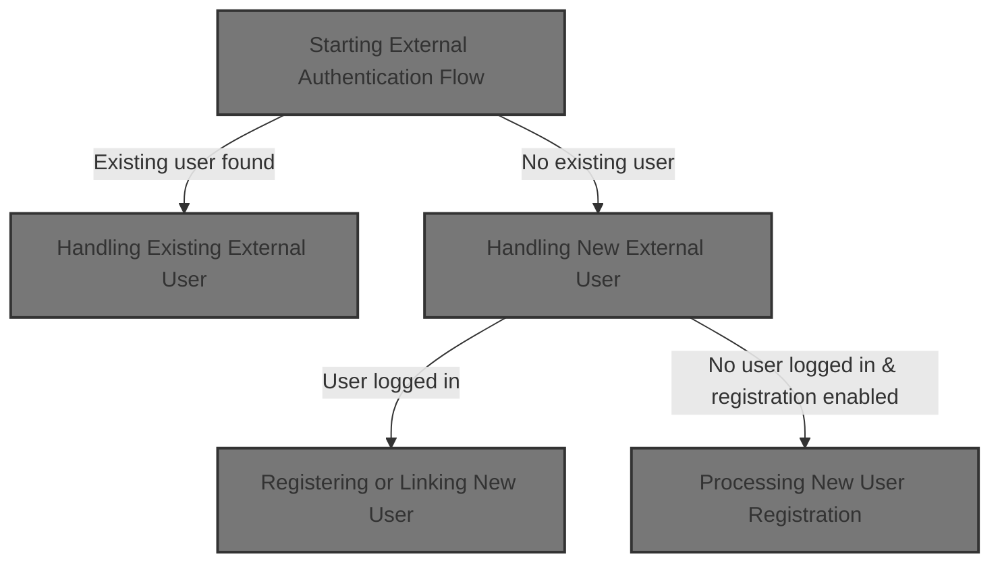
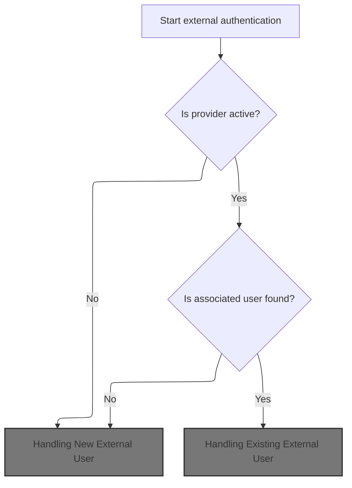
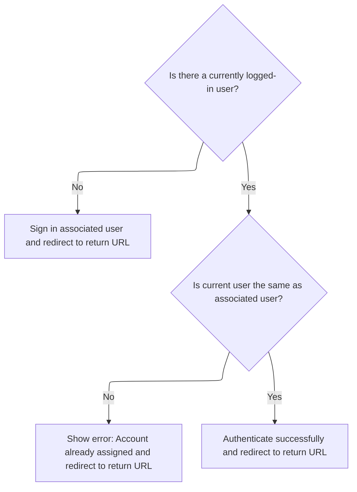
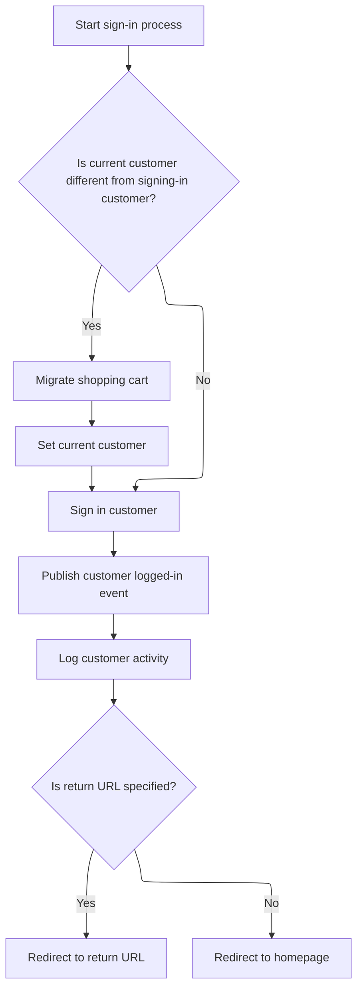
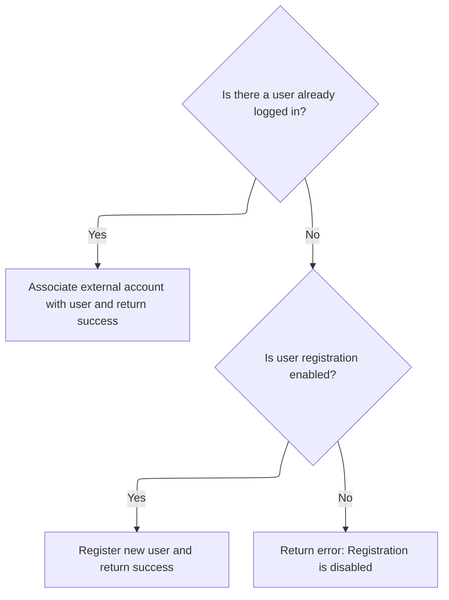

This document describes how users can sign in or register using external authentication providers. The flow starts with external authentication parameters and results in either signing in an existing user, linking an account, registering a new user, or showing a registration result.



# Starting External Authentication Flow



<SwmSnippet path="/src/Libraries/Nop.Services/Authentication/External/ExternalAuthenticationService.cs" line="248">

---

In `AuthenticateAsync`, we check if the external auth plugin is active and look up if the external parameters match an existing user. If so, we immediately move to AuthenticateExistingUserAsync to handle sign-in or error cases for that user, skipping any new user logic.

```c#
        public virtual async Task<IActionResult> AuthenticateAsync(ExternalAuthenticationParameters parameters, string returnUrl = null)
        {
            if (parameters == null)
                throw new ArgumentNullException(nameof(parameters));

            if (!await _authenticationPluginManager.IsPluginActiveAsync(parameters.ProviderSystemName, await _workContext.GetCurrentCustomerAsync(), (await _storeContext.GetCurrentStoreAsync()).Id))
                return ErrorAuthentication(new[] { "External authentication method cannot be loaded" }, returnUrl);

            //get current logged-in user
            var currentLoggedInUser = await _customerService.IsRegisteredAsync(await _workContext.GetCurrentCustomerAsync()) ? await _workContext.GetCurrentCustomerAsync() : null;

            //authenticate associated user if already exists
            var associatedUser = await GetUserByExternalAuthenticationParametersAsync(parameters);
            if (associatedUser != null)
                return await AuthenticateExistingUserAsync(associatedUser, currentLoggedInUser, returnUrl);

```

---

</SwmSnippet>

## Handling Existing External User



<SwmSnippet path="/src/Libraries/Nop.Services/Authentication/External/ExternalAuthenticationService.cs" line="86">

---

`AuthenticateExistingUserAsync` checks if anyone is logged in. If not, it signs in the user linked to the external account using SignInCustomerAsync. If someone else is logged in, it returns an error. If it's the same user, it just confirms success.

```c#
        protected virtual async Task<IActionResult> AuthenticateExistingUserAsync(Customer associatedUser, Customer currentLoggedInUser, string returnUrl)
        {
            //log in guest user
            if (currentLoggedInUser == null)
                return await _customerRegistrationService.SignInCustomerAsync(associatedUser, returnUrl);

            //account is already assigned to another user
            if (currentLoggedInUser.Id != associatedUser.Id)
                return ErrorAuthentication(new[] { await _localizationService.GetResourceAsync("Account.AssociatedExternalAuth.AccountAlreadyAssigned") }, returnUrl);

            //or the user try to log in as himself. bit weird
            return SuccessfulAuthentication(returnUrl);
        }
```

---

</SwmSnippet>

## Signing In the Customer



<SwmSnippet path="/src/Libraries/Nop.Services/Customers/CustomerRegistrationService.cs" line="415">

---

In `SignInCustomerAsync`, if the user being signed in is different from the current one, we migrate their shopping cart and update the work context to reflect the new user. Next, we need to update the context so the rest of the flow operates on the correct user.

```c#
        public virtual async Task<IActionResult> SignInCustomerAsync(Customer customer, string returnUrl, bool isPersist = false)
        {
            if ((await _workContext.GetCurrentCustomerAsync())?.Id != customer.Id)
            {
                //migrate shopping cart
                await _shoppingCartService.MigrateShoppingCartAsync(await _workContext.GetCurrentCustomerAsync(), customer, true);

                await _workContext.SetCurrentCustomerAsync(customer);
            }

```

---

</SwmSnippet>

<SwmSnippet path="/src/Libraries/Nop.Services/Customers/CustomerRegistrationService.cs" line="425">

---

After updating the user context, `SignInCustomerAsync` signs in the customer, publishes login events, logs the activity, and redirects to the appropriate page. All these actions now apply to the correct user thanks to the updated context.

```c#
            //sign in new customer
            await _authenticationService.SignInAsync(customer, isPersist);

            //raise event       
            await _eventPublisher.PublishAsync(new CustomerLoggedinEvent(customer));

            //activity log
            await _customerActivityService.InsertActivityAsync(customer, "PublicStore.Login",
                await _localizationService.GetResourceAsync("ActivityLog.PublicStore.Login"), customer);

            //redirect to the return URL if it's specified
            if (!string.IsNullOrEmpty(returnUrl))
                return new RedirectResult(returnUrl);

            return new RedirectToRouteResult("Homepage", null);
        }
```

---

</SwmSnippet>

## Handling New External User

<SwmSnippet path="/src/Libraries/Nop.Services/Authentication/External/ExternalAuthenticationService.cs" line="264">

---

After returning from `AuthenticateExistingUserAsync`, if no user was found, `AuthenticateAsync` moves on to AuthenticateNewUserAsync to handle new user association or registration.

```c#
            //or associate and authenticate new user
            return await AuthenticateNewUserAsync(currentLoggedInUser, parameters, returnUrl);
        }
```

---

</SwmSnippet>

# Registering or Linking New User



<SwmSnippet path="/src/Libraries/Nop.Services/Authentication/External/ExternalAuthenticationService.cs" line="110">

---

`AuthenticateNewUserAsync` either links the external account to the logged-in user or, if no one is logged in and registration is allowed, calls RegisterNewUserAsync to create a new user.

```c#
        protected virtual async Task<IActionResult> AuthenticateNewUserAsync(Customer currentLoggedInUser, ExternalAuthenticationParameters parameters, string returnUrl)
        {
            //associate external account with logged-in user
            if (currentLoggedInUser != null)
            {
                await AssociateExternalAccountWithUserAsync(currentLoggedInUser, parameters);

                return SuccessfulAuthentication(returnUrl);
            }

            //or try to register new user
            if (_customerSettings.UserRegistrationType != UserRegistrationType.Disabled)
                return await RegisterNewUserAsync(parameters, returnUrl);

            //registration is disabled
            return ErrorAuthentication(new[] { "Registration is disabled" }, returnUrl);
        }
```

---

</SwmSnippet>

# Processing New User Registration

```mermaid
%%{init: {"flowchart": {"defaultRenderer": "elk"}} }%%
flowchart TD
    node1["Start registration via external provider"]
    click node1 openCode "src/Libraries/Nop.Services/Authentication/External/ExternalAuthenticationService.cs:137:138"
    node1 --> node2{"Is email already registered?"}
    click node2 openCode "src/Libraries/Nop.Services/Authentication/External/ExternalAuthenticationService.cs:139:145"
    node2 -->|"Yes"| node3["Show error: Email already exists"]
    click node3 openCode "src/Libraries/Nop.Services/Authentication/External/ExternalAuthenticationService.cs:142:145"
    node2 -->|"No"| node4["Register user"]
    click node4 openCode "src/Libraries/Nop.Services/Authentication/External/ExternalAuthenticationService.cs:151:160"
    node4 --> node5{"Did registration succeed?"}
    click node5 openCode "src/Libraries/Nop.Services/Authentication/External/ExternalAuthenticationService.cs:161:162"
    node5 -->|"No"| node6["Show registration errors"]
    click node6 openCode "src/Libraries/Nop.Services/Authentication/External/ExternalAuthenticationService.cs:162:163"
    node5 -->|"Yes"| node7["Publish registration events"]
    click node7 openCode "src/Libraries/Nop.Services/Authentication/External/ExternalAuthenticationService.cs:165:168"
    node7 --> node8{"Notify store owner?"}
    click node8 openCode "src/Libraries/Nop.Services/Authentication/External/ExternalAuthenticationService.cs:171:172"
    node8 -->|"Yes"| node9["Send notification to store owner"]
    click node9 openCode "src/Libraries/Nop.Services/Authentication/External/ExternalAuthenticationService.cs:172:173"
    node8 -->|"No"| node11["Associate external account"]
    node9 --> node11["Associate external account"]
    click node11 openCode "src/Libraries/Nop.Services/Authentication/External/ExternalAuthenticationService.cs:175:176"
    node11 --> node12{"Is registration approved immediately?"}
    click node12 openCode "src/Libraries/Nop.Services/Authentication/External/ExternalAuthenticationService.cs:178:179"
    node12 -->|"Yes"| node13["Send welcome message and activate user"]
    click node13 openCode "src/Libraries/Nop.Services/Authentication/External/ExternalAuthenticationService.cs:180:183"
    node13 --> node14["Sign in user"]
    click node14 openCode "src/Libraries/Nop.Services/Authentication/External/ExternalAuthenticationService.cs:185:186"
    node12 -->|"No"| node15{"Is registration type EmailValidation?"}
    click node15 openCode "src/Libraries/Nop.Services/Authentication/External/ExternalAuthenticationService.cs:189:190"
    node15 -->|"Yes"| node16["Save activation token and send email validation"]
    click node16 openCode "src/Libraries/Nop.Services/Authentication/External/ExternalAuthenticationService.cs:192:193"
    node16 --> node17["Show registration result: Email validation required"]
    click node17 openCode "src/Libraries/Nop.Services/Authentication/External/ExternalAuthenticationService.cs:195:196"
    node15 -->|"No"| node18{"Is registration type AdminApproval?"}
    click node18 openCode "src/Libraries/Nop.Services/Authentication/External/ExternalAuthenticationService.cs:199:200"
    node18 -->|"Yes"| node19["Show registration result: Admin approval required"]
    click node19 openCode "src/Libraries/Nop.Services/Authentication/External/ExternalAuthenticationService.cs:200:201"
    node18 -->|"No"| node20["Show generic registration error"]
    click node20 openCode "src/Libraries/Nop.Services/Authentication/External/ExternalAuthenticationService.cs:202:203"

classDef HeadingStyle fill:#777777,stroke:#333,stroke-width:2px;
```



<SwmSnippet path="/src/Libraries/Nop.Services/Authentication/External/ExternalAuthenticationService.cs" line="137">

---

In `RegisterNewUserAsync`, we check for existing emails, set up the registration request, and call RegisterCustomerAsync to create the new user. This is where the actual user creation happens.

```c#
        protected virtual async Task<IActionResult> RegisterNewUserAsync(ExternalAuthenticationParameters parameters, string returnUrl)
        {
            //check whether the specified email has been already registered
            if (await _customerService.GetCustomerByEmailAsync(parameters.Email) != null)
            {
                var alreadyExistsError = string.Format(await _localizationService.GetResourceAsync("Account.AssociatedExternalAuth.EmailAlreadyExists"),
                    !string.IsNullOrEmpty(parameters.ExternalDisplayIdentifier) ? parameters.ExternalDisplayIdentifier : parameters.ExternalIdentifier);
                return ErrorAuthentication(new[] { alreadyExistsError }, returnUrl);
            }

            //registration is approved if validation isn't required
            var registrationIsApproved = _customerSettings.UserRegistrationType == UserRegistrationType.Standard ||
                (_customerSettings.UserRegistrationType == UserRegistrationType.EmailValidation && !_externalAuthenticationSettings.RequireEmailValidation);

            //create registration request
            var registrationRequest = new CustomerRegistrationRequest(await _workContext.GetCurrentCustomerAsync(),
                parameters.Email, parameters.Email,
                CommonHelper.GenerateRandomDigitCode(20),
                PasswordFormat.Hashed,
                (await _storeContext.GetCurrentStoreAsync()).Id,
                registrationIsApproved);

            //whether registration request has been completed successfully
            var registrationResult = await _customerRegistrationService.RegisterCustomerAsync(registrationRequest);
            if (!registrationResult.Success)
                return ErrorAuthentication(registrationResult.Errors, returnUrl);

            //allow to save other customer values by consuming this event
            await _eventPublisher.PublishAsync(new CustomerAutoRegisteredByExternalMethodEvent(await _workContext.GetCurrentCustomerAsync(), parameters));

            //raise customer registered event
            await _eventPublisher.PublishAsync(new CustomerRegisteredEvent(await _workContext.GetCurrentCustomerAsync()));

            //store owner notifications
            if (_customerSettings.NotifyNewCustomerRegistration)
                await _workflowMessageService.SendCustomerRegisteredNotificationMessageAsync(await _workContext.GetCurrentCustomerAsync(), _localizationSettings.DefaultAdminLanguageId);

            //associate external account with registered user
            await AssociateExternalAccountWithUserAsync(await _workContext.GetCurrentCustomerAsync(), parameters);

            //authenticate
            if (registrationIsApproved)
            {
                await _workflowMessageService.SendCustomerWelcomeMessageAsync(await _workContext.GetCurrentCustomerAsync(), (await _workContext.GetWorkingLanguageAsync()).Id);

                //raise event       
                await _eventPublisher.PublishAsync(new CustomerActivatedEvent(await _workContext.GetCurrentCustomerAsync()));

                return await _customerRegistrationService.SignInCustomerAsync(await _workContext.GetCurrentCustomerAsync(), returnUrl, true);
            }

```

---

</SwmSnippet>

<SwmSnippet path="/src/Libraries/Nop.Services/Authentication/External/ExternalAuthenticationService.cs" line="188">

---

After returning from RegisterCustomerAsync, `RegisterNewUserAsync` checks if registration needs email validation or admin approval and sends the right messages or redirects. If something fails, it returns an error.

```c#
            //registration is succeeded but isn't activated
            if (_customerSettings.UserRegistrationType == UserRegistrationType.EmailValidation)
            {
                //email validation message
                await _genericAttributeService.SaveAttributeAsync(await _workContext.GetCurrentCustomerAsync(), NopCustomerDefaults.AccountActivationTokenAttribute, Guid.NewGuid().ToString());
                await _workflowMessageService.SendCustomerEmailValidationMessageAsync(await _workContext.GetCurrentCustomerAsync(), (await _workContext.GetWorkingLanguageAsync()).Id);

                return new RedirectToRouteResult("RegisterResult", new { resultId = (int)UserRegistrationType.EmailValidation, returnUrl });
            }

            //registration is succeeded but isn't approved by admin
            if (_customerSettings.UserRegistrationType == UserRegistrationType.AdminApproval)
                return new RedirectToRouteResult("RegisterResult", new { resultId = (int)UserRegistrationType.AdminApproval, returnUrl });

            return ErrorAuthentication(new[] { "Error on registration" }, returnUrl);
        }
```

---

</SwmSnippet>

&nbsp;

*This is an auto-generated document by Swimm 🌊 and has not yet been verified by a human*

<SwmMeta version="3.0.0" repo-id="Z2l0aHViJTNBJTNBbnBDb21tZXJjZUFTUERvdG5ldCUzQSUzQXVtYWxpbmdhc3dhbWk=" repo-name="npCommerceASPDotnet"><sup>Powered by [Swimm](https://app.swimm.io/)</sup></SwmMeta>
