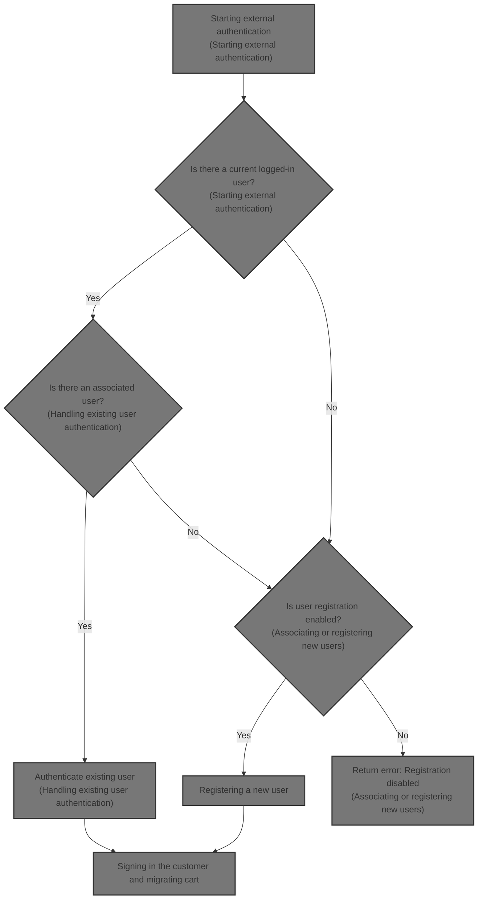
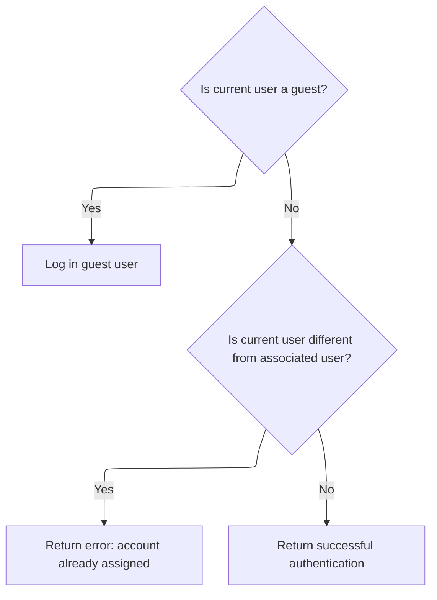
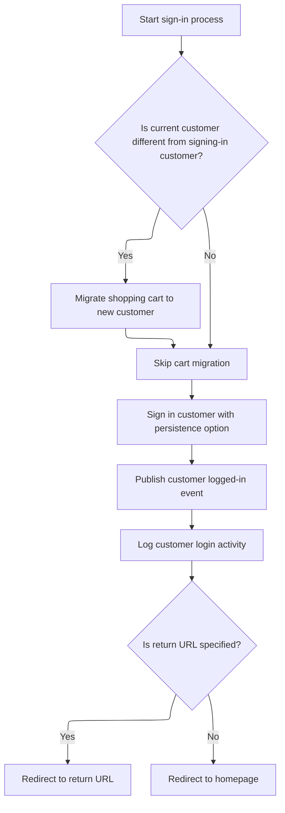
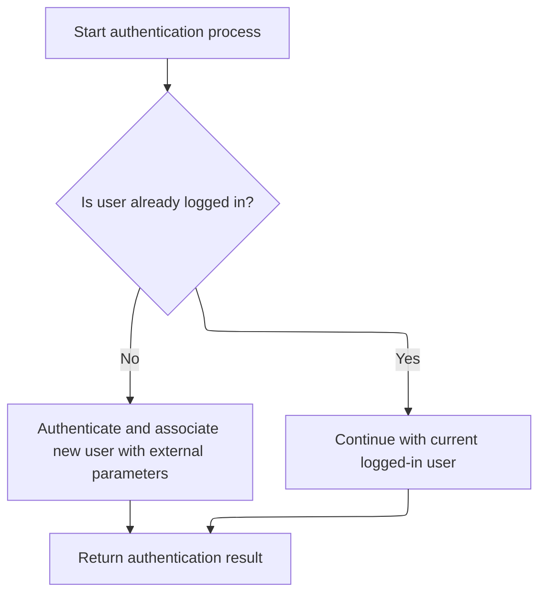
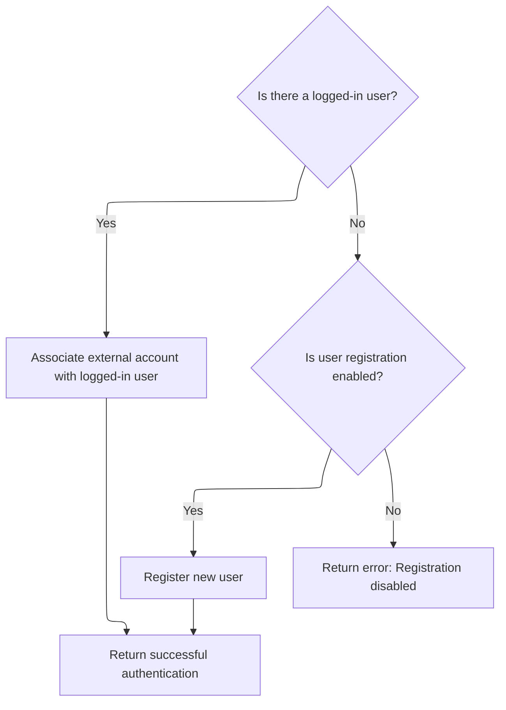
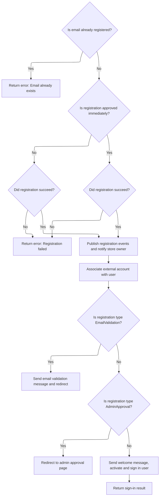

This document explains the flow of authenticating users via external authentication providers in an eCommerce platform. It manages existing user sessions, associates external accounts with logged-in users, registers new users if allowed, and signs in customers while migrating their shopping carts. The flow receives external authentication parameters and an optional return URL as input and returns an authentication result.



# Starting external authentication

This section handles the process of starting external authentication for users attempting to log in via an external provider.

| Category       | Rule Name                    | Description                                                                                                                                                     |
| -------------- | ---------------------------- | --------------------------------------------------------------------------------------------------------------------------------------------------------------- |
| Business logic | Existing User Authentication | If a user is already logged in and an associated user is found via external authentication parameters, the system must authenticate the existing user properly. |
| Business logic | New Login Handling           | If no user is currently logged in, the system should treat the authentication attempt as a new login via external authentication.                               |

<SwmSnippet path="/src/Libraries/Nop.Services/Authentication/External/ExternalAuthenticationService.cs" line="248">

---

In `AuthenticateAsync` we start by validating the parameters and checking if the external authentication plugin is active for the current store and user. Then, we get the current logged-in user and try to find an existing user linked to the external authentication parameters. If we find one, we call `AuthenticateExistingUserAsync` to handle their login or session properly.

```c#
        public virtual async Task<IActionResult> AuthenticateAsync(ExternalAuthenticationParameters parameters, string returnUrl = null)
        {
            if (parameters == null)
                throw new ArgumentNullException(nameof(parameters));

            if (!await _authenticationPluginManager.IsPluginActiveAsync(parameters.ProviderSystemName, await _workContext.GetCurrentCustomerAsync(), (await _storeContext.GetCurrentStoreAsync()).Id))
                return ErrorAuthentication(new[] { "External authentication method cannot be loaded" }, returnUrl);

            //get current logged-in user
            var currentLoggedInUser = await _customerService.IsRegisteredAsync(await _workContext.GetCurrentCustomerAsync()) ? await _workContext.GetCurrentCustomerAsync() : null;

            //authenticate associated user if already exists
            var associatedUser = await GetUserByExternalAuthenticationParametersAsync(parameters);
            if (associatedUser != null)
                return await AuthenticateExistingUserAsync(associatedUser, currentLoggedInUser, returnUrl);

```

---

</SwmSnippet>

## Handling existing user authentication



This section handles the authentication process for an existing user attempting to log in, ensuring proper user session management and account assignment validation.

| Category       | Rule Name                            | Description                                                                                                                                                                                 |
| -------------- | ------------------------------------ | ------------------------------------------------------------------------------------------------------------------------------------------------------------------------------------------- |
| Business logic | Guest user login                     | If there is no current logged-in user, the system must log in the associated user automatically.                                                                                            |
| Business logic | Account assignment conflict          | If the current logged-in user is different from the associated user attempting to authenticate, the system must return an error indicating the account is already assigned to another user. |
| Business logic | Confirm existing user authentication | If the current logged-in user is the same as the associated user, the system confirms successful authentication without additional login actions.                                           |

<SwmSnippet path="/src/Libraries/Nop.Services/Authentication/External/ExternalAuthenticationService.cs" line="86">

---

`AuthenticateExistingUserAsync` checks if there's a current logged-in user. If not, it signs in the associated user. If the current user differs from the associated user, it returns an error about account assignment. Otherwise, it confirms successful authentication.

```c#
        protected virtual async Task<IActionResult> AuthenticateExistingUserAsync(Customer associatedUser, Customer currentLoggedInUser, string returnUrl)
        {
            //log in guest user
            if (currentLoggedInUser == null)
                return await _customerRegistrationService.SignInCustomerAsync(associatedUser, returnUrl);

            //account is already assigned to another user
            if (currentLoggedInUser.Id != associatedUser.Id)
                return ErrorAuthentication(new[] { await _localizationService.GetResourceAsync("Account.AssociatedExternalAuth.AccountAlreadyAssigned") }, returnUrl);

            //or the user try to log in as himself. bit weird
            return SuccessfulAuthentication(returnUrl);
        }
```

---

</SwmSnippet>

## Signing in the customer and migrating cart



This section handles the process of signing in a customer and migrating their shopping cart if necessary.

| Category       | Rule Name                         | Description                                                                                                                                                     |
| -------------- | --------------------------------- | --------------------------------------------------------------------------------------------------------------------------------------------------------------- |
| Business logic | Cart migration on customer change | If the customer attempting to sign in is different from the current customer, the shopping cart must be migrated from the current customer to the new customer. |
| Business logic | Update current customer context   | After migrating the cart (if applicable), the system must update the current customer context to the newly signed-in customer.                                  |
| Business logic | Customer sign-in with persistence | The customer must be signed in with an option to persist the login session based on the provided persistence flag.                                              |
| Business logic | Publish login event               | A customer logged-in event must be published after a successful sign-in to notify other system components.                                                      |
| Business logic | Log login activity                | The system must log the customer's login activity for auditing and tracking purposes.                                                                           |
| Business logic | Redirect after sign-in            | If a return URL is specified, the system must redirect the customer to that URL after sign-in; otherwise, redirect to the homepage.                             |

<SwmSnippet path="/src/Libraries/Nop.Services/Customers/CustomerRegistrationService.cs" line="415">

---

In `SignInCustomerAsync` we start by checking if the current customer differs from the one to sign in. If so, we migrate the shopping cart from the current to the new customer and update the current customer context.

```c#
        public virtual async Task<IActionResult> SignInCustomerAsync(Customer customer, string returnUrl, bool isPersist = false)
        {
            if ((await _workContext.GetCurrentCustomerAsync())?.Id != customer.Id)
            {
                //migrate shopping cart
                await _shoppingCartService.MigrateShoppingCartAsync(await _workContext.GetCurrentCustomerAsync(), customer, true);

                await _workContext.SetCurrentCustomerAsync(customer);
            }

```

---

</SwmSnippet>

<SwmSnippet path="/src/Libraries/Nop.Services/Customers/CustomerRegistrationService.cs" line="425">

---

After returning from the work context update, `SignInCustomerAsync` signs in the customer, publishes a login event, logs the activity, and redirects to the return URL or homepage.

```c#
            //sign in new customer
            await _authenticationService.SignInAsync(customer, isPersist);

            //raise event       
            await _eventPublisher.PublishAsync(new CustomerLoggedinEvent(customer));

            //activity log
            await _customerActivityService.InsertActivityAsync(customer, "PublicStore.Login",
                await _localizationService.GetResourceAsync("ActivityLog.PublicStore.Login"), customer);

            //redirect to the return URL if it's specified
            if (!string.IsNullOrEmpty(returnUrl))
                return new RedirectResult(returnUrl);

            return new RedirectToRouteResult("Homepage", null);
        }
```

---

</SwmSnippet>

## Handling new or unauthenticated users



<SwmSnippet path="/src/Libraries/Nop.Services/Authentication/External/ExternalAuthenticationService.cs" line="264">

---

After returning from `AuthenticateExistingUserAsync`, `AuthenticateAsync` calls `AuthenticateNewUserAsync` to handle cases where no associated user was found, either linking or registering a new user.

```c#
            //or associate and authenticate new user
            return await AuthenticateNewUserAsync(currentLoggedInUser, parameters, returnUrl);
        }
```

---

</SwmSnippet>

# Associating or registering new users



This section handles the process of associating an external authentication account with a logged-in user or registering a new user if no user is logged in and registration is enabled.

| Category       | Rule Name                  | Description                                                                                                              |
| -------------- | -------------------------- | ------------------------------------------------------------------------------------------------------------------------ |
| Business logic | Associate external account | If there is a logged-in user, the external authentication account must be associated with this user before proceeding.   |
| Business logic | Check registration enabled | If no user is logged in, the system must check if user registration is enabled before attempting to register a new user. |
| Business logic | Register new user          | If user registration is enabled, the system should register the new user using the external authentication parameters.   |

<SwmSnippet path="/src/Libraries/Nop.Services/Authentication/External/ExternalAuthenticationService.cs" line="110">

---

`AuthenticateNewUserAsync` checks if there's a logged-in user to associate the external account with. If not, it checks registration settings and calls `RegisterNewUserAsync` to create a new account if allowed.

```c#
        protected virtual async Task<IActionResult> AuthenticateNewUserAsync(Customer currentLoggedInUser, ExternalAuthenticationParameters parameters, string returnUrl)
        {
            //associate external account with logged-in user
            if (currentLoggedInUser != null)
            {
                await AssociateExternalAccountWithUserAsync(currentLoggedInUser, parameters);

                return SuccessfulAuthentication(returnUrl);
            }

            //or try to register new user
            if (_customerSettings.UserRegistrationType != UserRegistrationType.Disabled)
                return await RegisterNewUserAsync(parameters, returnUrl);

            //registration is disabled
            return ErrorAuthentication(new[] { "Registration is disabled" }, returnUrl);
        }
```

---

</SwmSnippet>

# Registering a new user



This section handles the process of registering a new user in the nopCommerce platform, including validation of email uniqueness, registration approval, event publishing, and user notification.

| Category        | Rule Name                        | Description                                                                                                                                                                               |
| --------------- | -------------------------------- | ----------------------------------------------------------------------------------------------------------------------------------------------------------------------------------------- |
| Data validation | Unique email enforcement         | If the email provided by the user is already registered in the system, the registration process must be stopped and an error indicating that the email already exists should be returned. |
| Business logic  | Automatic registration approval  | User registration is automatically approved if the registration type is set to Standard or if it is EmailValidation but email validation is not required by settings.                     |
| Business logic  | Post-registration notifications  | Upon successful registration, the system must publish events to notify other parts of the system and optionally notify the store owner about the new registration.                        |
| Business logic  | External account association     | The external account used for registration must be associated with the newly registered user account.                                                                                     |
| Business logic  | Email validation requirement     | If the registration type requires email validation, the system must send an email validation message to the user and redirect them to a validation result page.                           |
| Business logic  | Admin approval redirection       | If the registration type requires admin approval, the user must be redirected to an admin approval page after registration.                                                               |
| Business logic  | Immediate activation and sign-in | If registration is approved immediately, the system must send a welcome message to the user, activate their account, and sign them in automatically.                                      |

<SwmSnippet path="/src/Libraries/Nop.Services/Authentication/External/ExternalAuthenticationService.cs" line="137">

---

In `RegisterNewUserAsync` we first check if the email is already registered. If not, we create a registration request and call the customer registration service to register the user.

```c#
        protected virtual async Task<IActionResult> RegisterNewUserAsync(ExternalAuthenticationParameters parameters, string returnUrl)
        {
            //check whether the specified email has been already registered
            if (await _customerService.GetCustomerByEmailAsync(parameters.Email) != null)
            {
                var alreadyExistsError = string.Format(await _localizationService.GetResourceAsync("Account.AssociatedExternalAuth.EmailAlreadyExists"),
                    !string.IsNullOrEmpty(parameters.ExternalDisplayIdentifier) ? parameters.ExternalDisplayIdentifier : parameters.ExternalIdentifier);
                return ErrorAuthentication(new[] { alreadyExistsError }, returnUrl);
            }

            //registration is approved if validation isn't required
            var registrationIsApproved = _customerSettings.UserRegistrationType == UserRegistrationType.Standard ||
                (_customerSettings.UserRegistrationType == UserRegistrationType.EmailValidation && !_externalAuthenticationSettings.RequireEmailValidation);

            //create registration request
            var registrationRequest = new CustomerRegistrationRequest(await _workContext.GetCurrentCustomerAsync(),
                parameters.Email, parameters.Email,
                CommonHelper.GenerateRandomDigitCode(20),
                PasswordFormat.Hashed,
                (await _storeContext.GetCurrentStoreAsync()).Id,
                registrationIsApproved);

            //whether registration request has been completed successfully
            var registrationResult = await _customerRegistrationService.RegisterCustomerAsync(registrationRequest);
            if (!registrationResult.Success)
                return ErrorAuthentication(registrationResult.Errors, returnUrl);

            //allow to save other customer values by consuming this event
            await _eventPublisher.PublishAsync(new CustomerAutoRegisteredByExternalMethodEvent(await _workContext.GetCurrentCustomerAsync(), parameters));

            //raise customer registered event
            await _eventPublisher.PublishAsync(new CustomerRegisteredEvent(await _workContext.GetCurrentCustomerAsync()));

            //store owner notifications
            if (_customerSettings.NotifyNewCustomerRegistration)
                await _workflowMessageService.SendCustomerRegisteredNotificationMessageAsync(await _workContext.GetCurrentCustomerAsync(), _localizationSettings.DefaultAdminLanguageId);

            //associate external account with registered user
            await AssociateExternalAccountWithUserAsync(await _workContext.GetCurrentCustomerAsync(), parameters);

            //authenticate
            if (registrationIsApproved)
            {
                await _workflowMessageService.SendCustomerWelcomeMessageAsync(await _workContext.GetCurrentCustomerAsync(), (await _workContext.GetWorkingLanguageAsync()).Id);

                //raise event       
                await _eventPublisher.PublishAsync(new CustomerActivatedEvent(await _workContext.GetCurrentCustomerAsync()));

                return await _customerRegistrationService.SignInCustomerAsync(await _workContext.GetCurrentCustomerAsync(), returnUrl, true);
            }

```

---

</SwmSnippet>

<SwmSnippet path="/src/Libraries/Nop.Services/Authentication/External/ExternalAuthenticationService.cs" line="188">

---

After returning from the registration service, `RegisterNewUserAsync` sends welcome or validation messages, raises events, and either signs in the user or redirects based on registration status.

```c#
            //registration is succeeded but isn't activated
            if (_customerSettings.UserRegistrationType == UserRegistrationType.EmailValidation)
            {
                //email validation message
                await _genericAttributeService.SaveAttributeAsync(await _workContext.GetCurrentCustomerAsync(), NopCustomerDefaults.AccountActivationTokenAttribute, Guid.NewGuid().ToString());
                await _workflowMessageService.SendCustomerEmailValidationMessageAsync(await _workContext.GetCurrentCustomerAsync(), (await _workContext.GetWorkingLanguageAsync()).Id);

                return new RedirectToRouteResult("RegisterResult", new { resultId = (int)UserRegistrationType.EmailValidation, returnUrl });
            }

            //registration is succeeded but isn't approved by admin
            if (_customerSettings.UserRegistrationType == UserRegistrationType.AdminApproval)
                return new RedirectToRouteResult("RegisterResult", new { resultId = (int)UserRegistrationType.AdminApproval, returnUrl });

            return ErrorAuthentication(new[] { "Error on registration" }, returnUrl);
        }
```

---

</SwmSnippet>

&nbsp;

*This is an auto-generated document by Swimm 🌊 and has not yet been verified by a human*

<SwmMeta version="3.0.0" repo-id="Z2l0aHViJTNBJTNBbnBDb21tZXJjZUFTUERvdG5ldCUzQSUzQXVtYWxpbmdhc3dhbWk=" repo-name="npCommerceASPDotnet"><sup>Powered by [Swimm](https://app.swimm.io/)</sup></SwmMeta>
