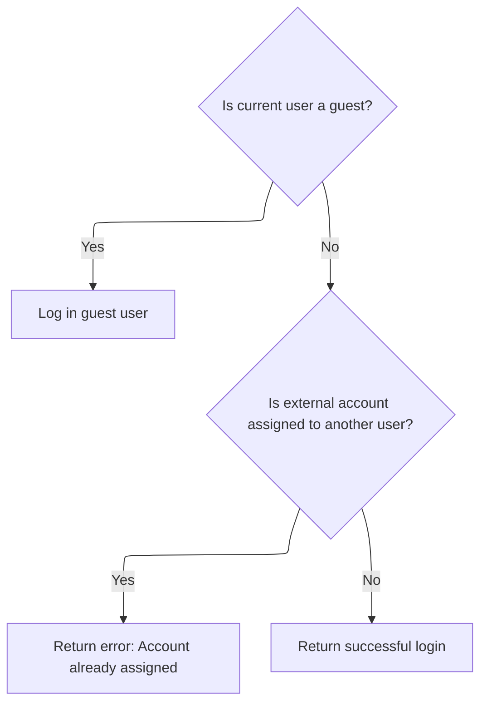
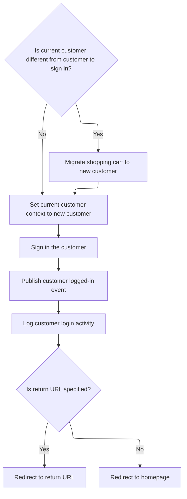
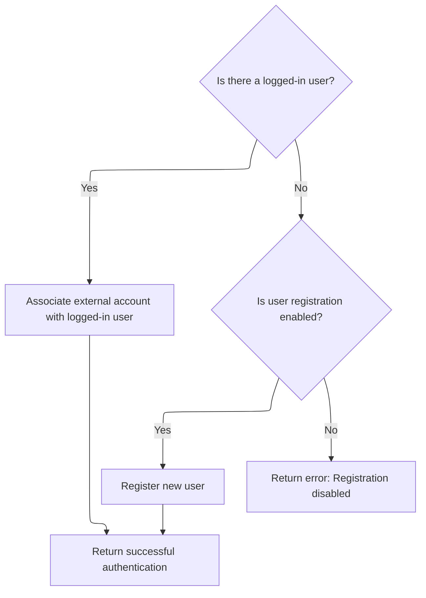
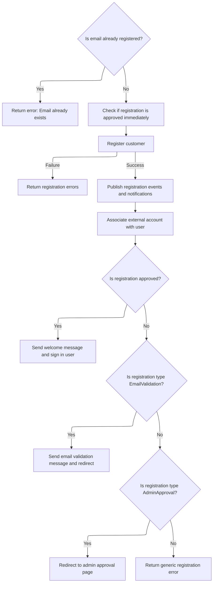

This document explains the flow of authenticating users via external authentication providers. It starts by checking for existing user associations and handles login or conflict resolution. If no association exists, it manages new user authentication by associating external accounts with logged-in users or registering new users if enabled. The flow includes signing in users with shopping cart migration and applies notifications and approval rules during registration.

# Starting external authentication and checking existing user association

This section handles the process of starting external authentication and checking if there is an existing user associated with the external credentials.

| Category        | Rule Name                 | Description                                                                                                                                               |
| --------------- | ------------------------- | --------------------------------------------------------------------------------------------------------------------------------------------------------- |
| Data validation | Plugin Activation Check   | External authentication can only proceed if the external authentication plugin is active for the current store and user.                                  |
| Data validation | Null Parameter Validation | If the external authentication parameters are null, the authentication process must not proceed and an error should be raised.                            |
| Business logic  | Current User Recognition  | If a user is already logged in, the system should recognize the current logged-in user before attempting to authenticate an external user.                |
| Business logic  | Existing User Association | If an external user association exists for the provided external authentication parameters, the system should authenticate the existing user accordingly. |

<SwmSnippet path="/src/Libraries/Nop.Services/Authentication/External/ExternalAuthenticationService.cs" line="248">

---

In `AuthenticateAsync` we start by validating the input and checking if the external auth plugin is active for the current store and user. Then, we get the current logged-in user and try to find a user linked to the external credentials. If we find one, we call `AuthenticateExistingUserAsync` to handle logging in or conflict resolution.

```c#
        public virtual async Task<IActionResult> AuthenticateAsync(ExternalAuthenticationParameters parameters, string returnUrl = null)
        {
            if (parameters == null)
                throw new ArgumentNullException(nameof(parameters));

            if (!await _authenticationPluginManager.IsPluginActiveAsync(parameters.ProviderSystemName, await _workContext.GetCurrentCustomerAsync(), (await _storeContext.GetCurrentStoreAsync()).Id))
                return ErrorAuthentication(new[] { "External authentication method cannot be loaded" }, returnUrl);

            //get current logged-in user
            var currentLoggedInUser = await _customerService.IsRegisteredAsync(await _workContext.GetCurrentCustomerAsync()) ? await _workContext.GetCurrentCustomerAsync() : null;

            //authenticate associated user if already exists
            var associatedUser = await GetUserByExternalAuthenticationParametersAsync(parameters);
            if (associatedUser != null)
                return await AuthenticateExistingUserAsync(associatedUser, currentLoggedInUser, returnUrl);

```

---

</SwmSnippet>

## Handling login or conflicts for an existing external user



This section handles the login process or conflict resolution for an existing external user attempting to authenticate.

| Category       | Rule Name                              | Description                                                                                                                                                                                         |
| -------------- | -------------------------------------- | --------------------------------------------------------------------------------------------------------------------------------------------------------------------------------------------------- |
| Business logic | Guest user login                       | If there is no current logged-in user, the system must log in the user associated with the external account.                                                                                        |
| Business logic | External account conflict              | If the current logged-in user is different from the user associated with the external account, the system must return an error indicating the external account is already assigned to another user. |
| Business logic | Successful authentication confirmation | If the current logged-in user is the same as the user associated with the external account, the system confirms successful authentication without error.                                            |

<SwmSnippet path="/src/Libraries/Nop.Services/Authentication/External/ExternalAuthenticationService.cs" line="86">

---

`AuthenticateExistingUserAsync` checks if there's a current user logged in. If not, it signs in the associated user. If the current user is different from the associated one, it returns an error to prevent conflicts. Otherwise, it confirms successful authentication.

```c#
        protected virtual async Task<IActionResult> AuthenticateExistingUserAsync(Customer associatedUser, Customer currentLoggedInUser, string returnUrl)
        {
            //log in guest user
            if (currentLoggedInUser == null)
                return await _customerRegistrationService.SignInCustomerAsync(associatedUser, returnUrl);

            //account is already assigned to another user
            if (currentLoggedInUser.Id != associatedUser.Id)
                return ErrorAuthentication(new[] { await _localizationService.GetResourceAsync("Account.AssociatedExternalAuth.AccountAlreadyAssigned") }, returnUrl);

            //or the user try to log in as himself. bit weird
            return SuccessfulAuthentication(returnUrl);
        }
```

---

</SwmSnippet>

## Migrating shopping cart and setting current user during sign-in



This section handles the process of signing in a customer, including migrating the shopping cart if the user changes, setting the current user context, signing in, publishing login events, logging activity, and redirecting appropriately.

| Category       | Rule Name                              | Description                                                                                                                                                                            |
| -------------- | -------------------------------------- | -------------------------------------------------------------------------------------------------------------------------------------------------------------------------------------- |
| Business logic | Shopping cart migration on user change | If the customer signing in is different from the current customer, migrate the shopping cart from the current customer to the new customer before setting the new customer as current. |
| Business logic | Set current customer context           | Always set the current customer context to the customer who is signing in after any necessary cart migration.                                                                          |
| Business logic | Customer sign-in                       | Sign in the customer to establish an authenticated session, optionally persisting the session based on input.                                                                          |
| Business logic | Publish login event                    | Publish a customer logged-in event immediately after sign-in to notify other system components or plugins.                                                                             |
| Business logic | Log login activity                     | Log the customer's login activity for auditing and tracking purposes.                                                                                                                  |
| Business logic | Redirect after sign-in                 | If a return URL is specified after sign-in, redirect the customer to that URL; otherwise, redirect to the homepage.                                                                    |

<SwmSnippet path="/src/Libraries/Nop.Services/Customers/CustomerRegistrationService.cs" line="415">

---

In `SignInCustomerAsync` we check if the current user is different from the one signing in. If so, we migrate the shopping cart from the current user to the new one, then set the new user as current in the context.

```c#
        public virtual async Task<IActionResult> SignInCustomerAsync(Customer customer, string returnUrl, bool isPersist = false)
        {
            if ((await _workContext.GetCurrentCustomerAsync())?.Id != customer.Id)
            {
                //migrate shopping cart
                await _shoppingCartService.MigrateShoppingCartAsync(await _workContext.GetCurrentCustomerAsync(), customer, true);

                await _workContext.SetCurrentCustomerAsync(customer);
            }

```

---

</SwmSnippet>

<SwmSnippet path="/src/Libraries/Nop.Services/Customers/CustomerRegistrationService.cs" line="425">

---

After returning from setting the current user, `SignInCustomerAsync` signs in the user, publishes login events, logs the activity, and redirects to the return URL or homepage.

```c#
            //sign in new customer
            await _authenticationService.SignInAsync(customer, isPersist);

            //raise event       
            await _eventPublisher.PublishAsync(new CustomerLoggedinEvent(customer));

            //activity log
            await _customerActivityService.InsertActivityAsync(customer, "PublicStore.Login",
                await _localizationService.GetResourceAsync("ActivityLog.PublicStore.Login"), customer);

            //redirect to the return URL if it's specified
            if (!string.IsNullOrEmpty(returnUrl))
                return new RedirectResult(returnUrl);

            return new RedirectToRouteResult("Homepage", null);
        }
```

---

</SwmSnippet>

## Handling new user authentication when no existing association is found

<SwmSnippet path="/src/Libraries/Nop.Services/Authentication/External/ExternalAuthenticationService.cs" line="264">

---

After returning from `AuthenticateExistingUserAsync`, `AuthenticateAsync` calls `AuthenticateNewUserAsync` to handle cases where no associated user exists, managing new user association or registration.

```c#
            //or associate and authenticate new user
            return await AuthenticateNewUserAsync(currentLoggedInUser, parameters, returnUrl);
        }
```

---

</SwmSnippet>

# Associating external accounts or registering new users



This section handles the process of associating external accounts with existing logged-in users or registering new users when no user is logged in.

| Category       | Rule Name                                      | Description                                                                                                                                                                      |
| -------------- | ---------------------------------------------- | -------------------------------------------------------------------------------------------------------------------------------------------------------------------------------- |
| Business logic | Associate external account with logged-in user | If there is a logged-in user, the external account must be associated with this user and the authentication should be successful.                                                |
| Business logic | Check user registration enabled                | If no user is logged in, the system must check if user registration is enabled before attempting to register a new user.                                                         |
| Business logic | Register new user on external login            | If user registration is enabled and no user is logged in, the system must register a new user using the external authentication parameters and return successful authentication. |

<SwmSnippet path="/src/Libraries/Nop.Services/Authentication/External/ExternalAuthenticationService.cs" line="110">

---

`AuthenticateNewUserAsync` checks if there's a logged-in user. If yes, it links the external account to them and returns success. Otherwise, it checks registration settings and calls `RegisterNewUserAsync` if registration is enabled.

```c#
        protected virtual async Task<IActionResult> AuthenticateNewUserAsync(Customer currentLoggedInUser, ExternalAuthenticationParameters parameters, string returnUrl)
        {
            //associate external account with logged-in user
            if (currentLoggedInUser != null)
            {
                await AssociateExternalAccountWithUserAsync(currentLoggedInUser, parameters);

                return SuccessfulAuthentication(returnUrl);
            }

            //or try to register new user
            if (_customerSettings.UserRegistrationType != UserRegistrationType.Disabled)
                return await RegisterNewUserAsync(parameters, returnUrl);

            //registration is disabled
            return ErrorAuthentication(new[] { "Registration is disabled" }, returnUrl);
        }
```

---

</SwmSnippet>

# Registering new users with validation and notifications



This section handles the registration of new users, including validation of email uniqueness, approval status determination, user creation, and sending notifications based on registration type.

| Category        | Rule Name                        | Description                                                                                                                                                                      |
| --------------- | -------------------------------- | -------------------------------------------------------------------------------------------------------------------------------------------------------------------------------- |
| Data validation | Unique email requirement         | A new user cannot register with an email address that is already associated with an existing account.                                                                            |
| Business logic  | Immediate registration approval  | Users are automatically approved upon registration if the system setting is standard registration or if email validation is not required for email validation registration type. |
| Business logic  | Notification on new registration | The system sends notifications to the store owner when a new customer registers if the notification setting is enabled.                                                          |
| Business logic  | External account association     | After successful registration, any external authentication account used is linked to the newly created user account.                                                             |
| Business logic  | Welcome message and sign-in      | If the registration is approved immediately, the user receives a welcome message and is signed in automatically.                                                                 |
| Business logic  | Email validation required        | If the registration type requires email validation, the user receives an email validation message and is redirected to a validation page.                                        |
| Business logic  | Admin approval required          | If the registration type requires admin approval, the user is redirected to a page indicating that approval is pending.                                                          |

<SwmSnippet path="/src/Libraries/Nop.Services/Authentication/External/ExternalAuthenticationService.cs" line="137">

---

In `RegisterNewUserAsync` we first check if the email is already taken. Then, we prepare a registration request with approval status based on settings and call `RegisterCustomerAsync` to create the user.

```c#
        protected virtual async Task<IActionResult> RegisterNewUserAsync(ExternalAuthenticationParameters parameters, string returnUrl)
        {
            //check whether the specified email has been already registered
            if (await _customerService.GetCustomerByEmailAsync(parameters.Email) != null)
            {
                var alreadyExistsError = string.Format(await _localizationService.GetResourceAsync("Account.AssociatedExternalAuth.EmailAlreadyExists"),
                    !string.IsNullOrEmpty(parameters.ExternalDisplayIdentifier) ? parameters.ExternalDisplayIdentifier : parameters.ExternalIdentifier);
                return ErrorAuthentication(new[] { alreadyExistsError }, returnUrl);
            }

            //registration is approved if validation isn't required
            var registrationIsApproved = _customerSettings.UserRegistrationType == UserRegistrationType.Standard ||
                (_customerSettings.UserRegistrationType == UserRegistrationType.EmailValidation && !_externalAuthenticationSettings.RequireEmailValidation);

            //create registration request
            var registrationRequest = new CustomerRegistrationRequest(await _workContext.GetCurrentCustomerAsync(),
                parameters.Email, parameters.Email,
                CommonHelper.GenerateRandomDigitCode(20),
                PasswordFormat.Hashed,
                (await _storeContext.GetCurrentStoreAsync()).Id,
                registrationIsApproved);

            //whether registration request has been completed successfully
            var registrationResult = await _customerRegistrationService.RegisterCustomerAsync(registrationRequest);
            if (!registrationResult.Success)
                return ErrorAuthentication(registrationResult.Errors, returnUrl);

            //allow to save other customer values by consuming this event
            await _eventPublisher.PublishAsync(new CustomerAutoRegisteredByExternalMethodEvent(await _workContext.GetCurrentCustomerAsync(), parameters));

            //raise customer registered event
            await _eventPublisher.PublishAsync(new CustomerRegisteredEvent(await _workContext.GetCurrentCustomerAsync()));

            //store owner notifications
            if (_customerSettings.NotifyNewCustomerRegistration)
                await _workflowMessageService.SendCustomerRegisteredNotificationMessageAsync(await _workContext.GetCurrentCustomerAsync(), _localizationSettings.DefaultAdminLanguageId);

            //associate external account with registered user
            await AssociateExternalAccountWithUserAsync(await _workContext.GetCurrentCustomerAsync(), parameters);

            //authenticate
            if (registrationIsApproved)
            {
                await _workflowMessageService.SendCustomerWelcomeMessageAsync(await _workContext.GetCurrentCustomerAsync(), (await _workContext.GetWorkingLanguageAsync()).Id);

                //raise event       
                await _eventPublisher.PublishAsync(new CustomerActivatedEvent(await _workContext.GetCurrentCustomerAsync()));

                return await _customerRegistrationService.SignInCustomerAsync(await _workContext.GetCurrentCustomerAsync(), returnUrl, true);
            }

```

---

</SwmSnippet>

<SwmSnippet path="/src/Libraries/Nop.Services/Authentication/External/ExternalAuthenticationService.cs" line="188">

---

After returning from `RegisterNewUserAsync`, we send notifications, associate the external account, and either sign in or redirect depending on registration type.

```c#
            //registration is succeeded but isn't activated
            if (_customerSettings.UserRegistrationType == UserRegistrationType.EmailValidation)
            {
                //email validation message
                await _genericAttributeService.SaveAttributeAsync(await _workContext.GetCurrentCustomerAsync(), NopCustomerDefaults.AccountActivationTokenAttribute, Guid.NewGuid().ToString());
                await _workflowMessageService.SendCustomerEmailValidationMessageAsync(await _workContext.GetCurrentCustomerAsync(), (await _workContext.GetWorkingLanguageAsync()).Id);

                return new RedirectToRouteResult("RegisterResult", new { resultId = (int)UserRegistrationType.EmailValidation, returnUrl });
            }

            //registration is succeeded but isn't approved by admin
            if (_customerSettings.UserRegistrationType == UserRegistrationType.AdminApproval)
                return new RedirectToRouteResult("RegisterResult", new { resultId = (int)UserRegistrationType.AdminApproval, returnUrl });

            return ErrorAuthentication(new[] { "Error on registration" }, returnUrl);
        }
```

---

</SwmSnippet>

&nbsp;

*This is an auto-generated document by Swimm 🌊 and has not yet been verified by a human*

<SwmMeta version="3.0.0" repo-id="Z2l0aHViJTNBJTNBbnBDb21tZXJjZUFTUERvdG5ldCUzQSUzQXVtYWxpbmdhc3dhbWk=" repo-name="npCommerceASPDotnet"><sup>Powered by [Swimm](https://app.swimm.io/)</sup></SwmMeta>
