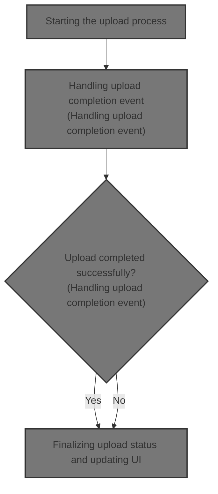
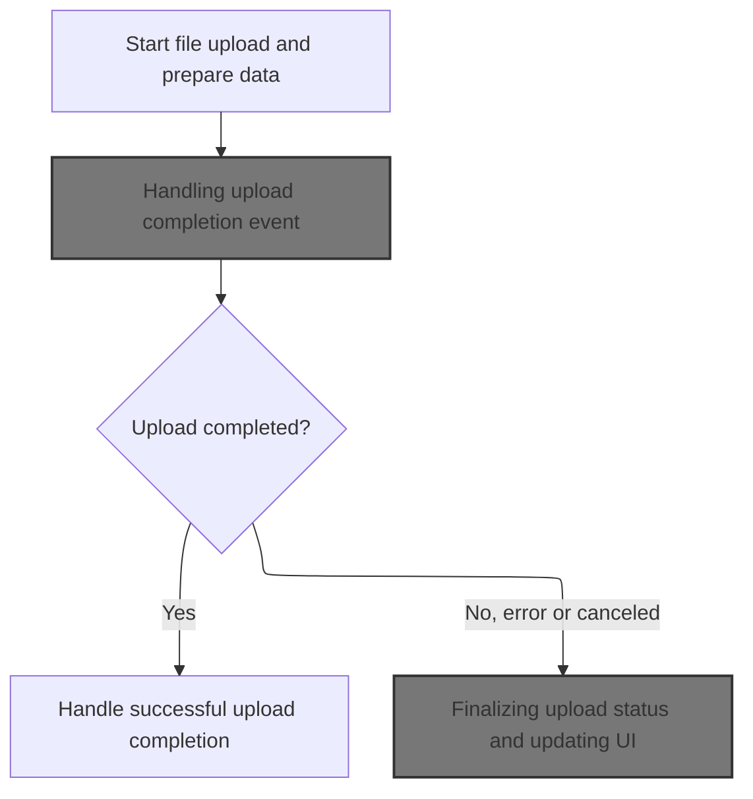
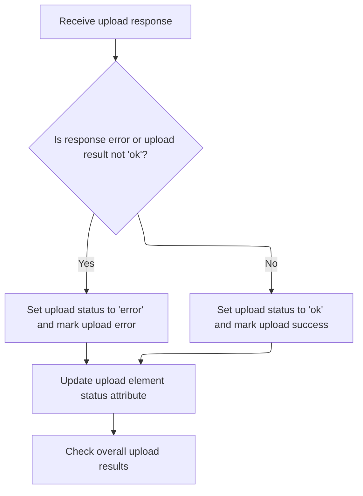
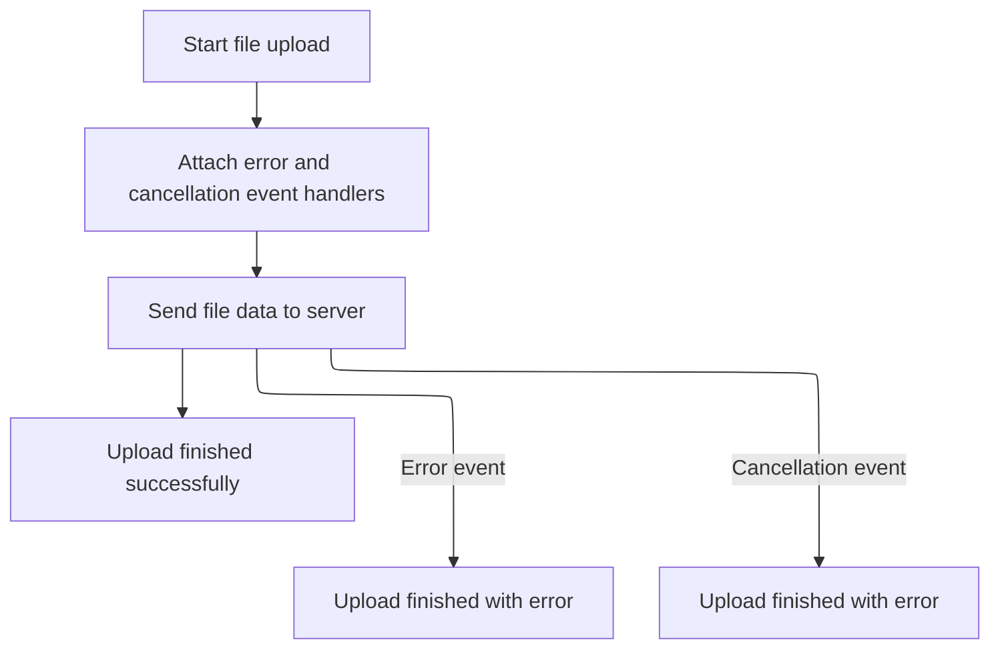

This document explains the flow of uploading files through the web interface. Users select files to upload, and the system manages the upload process by preparing the request, monitoring completion, and updating the interface based on success or failure. It also handles errors and cancellations to keep the user informed.

The main steps are:

- Preparing the upload request
- Handling upload completion
- Finalizing upload status and updating the interface
- Managing errors and cancellations



# Starting the upload process



<SwmSnippet path="/src/Presentation/Nop.Web/wwwroot/lib/Roxy_Fileman/js/main.js" line="220">

---

In `fileUpload` we start the upload by preparing the XMLHttpRequest and FormData. We get the upload element for the given index and remove its '.removeUpload' child to reset the UI state. Then we append fixed parameters to FormData to tell the server this is an AJAX upload and where to put the file. We attach event listeners for progress and completion, so when the upload finishes, `uploadComplete` is called to handle the next steps.

```javascript
function fileUpload(f, i){
  var http = new XMLHttpRequest();
  var fData = new FormData();
  var el = findUploadElement(i);
  el.find('.removeUpload').remove();
  fData.append("action", 'upload');
  fData.append("method", 'ajax');
  fData.append("d", $('#hdDir').attr('value'));
  fData.append("files[]", f);
  http.upload.addEventListener("progress", function(e){updateUploadProgress(e, i);}, false);
  http.addEventListener("load", function(e){uploadComplete(e, i);}, false);
```

---

</SwmSnippet>

## Handling upload completion event

<SwmSnippet path="/src/Presentation/Nop.Web/wwwroot/lib/Roxy_Fileman/js/main.js" line="168">

---

`uploadComplete` just forwards the event to `uploadFinished` with a success status 'ok'. This keeps the upload result handling centralized in `uploadFinished` so we don't duplicate logic.

```javascript
function uploadComplete(e, i){
  uploadFinished(e, i, 'ok');
}
```

---

</SwmSnippet>

## Finalizing upload status and updating UI



<SwmSnippet path="/src/Presentation/Nop.Web/wwwroot/lib/Roxy_Fileman/js/main.js" line="188">

---

`uploadFinished` parses the server response to check if the upload succeeded or failed. It updates the UI state by calling `setUploadError` or `setUploadSuccess` and marks the upload element with 'data-ulpoad' to track status. Then it calls `checkUploadResult` to update the overall upload progress and UI.

```javascript
function uploadFinished(e, i, res){
  var el = findUploadElement(i);
  var httpRes = null;
  try{
    httpRes = JSON.parse(e.target.responseText);
  }
  catch(ex){}
  
  if((httpRes && httpRes.res == 'error') || res != 'ok'){
    res = 'error';
    setUploadError(i);
  }
  else{
    res = 'ok';
    setUploadSuccess(i)
  }
    
  el.attr('data-ulpoad', res);
  checkUploadResult();
}
```

---

</SwmSnippet>

<SwmSnippet path="/src/Presentation/Nop.Web/wwwroot/lib/Roxy_Fileman/js/main.js" line="208">

---

`checkUploadResult` counts how many files have finished uploading and how many succeeded by checking 'data-ulpoad' attributes. When all files are done, it clears the upload list, refreshes the directory file list, and disables the upload button to update the UI.

```javascript
function checkUploadResult(){
  var all = $('#uploadFilesList .fileUpload').length;
  var completed = $('#uploadFilesList .fileUpload[data-ulpoad]').length;
  var success = $('#uploadFilesList .fileUpload[data-ulpoad="ok"]').length;
  if(completed == all){
     //$('#uploadResult').html(success + ' files uploaded; '+(all - success)+' failed');
     uploadFileList = new Array();
     var d = Directory.Parse($('#hdDir').val());
     d.ListFiles(true);
     $('#btnUpload').button('disable');
  }
}
```

---

</SwmSnippet>

## Handling upload errors and aborts



<SwmSnippet path="/src/Presentation/Nop.Web/wwwroot/lib/Roxy_Fileman/js/main.js" line="231">

---

After `uploadComplete` in `fileUpload`, we listen for 'error' events to catch upload failures. Calling `uploadError` updates the UI and state to show the failure.

```javascript
  http.addEventListener("error", function(e){uploadError(e, i);}, false);
```

---

</SwmSnippet>

<SwmSnippet path="/src/Presentation/Nop.Web/wwwroot/lib/Roxy_Fileman/js/main.js" line="171">

---

`uploadError` marks the upload as failed by calling `setUploadError` and then forwards the error status to `uploadFinished` to update the UI and finalize the upload state.

```javascript
function uploadError(e, i){
  setUploadError(i);
  uploadFinished(e, i, 'error');
}
```

---

</SwmSnippet>

<SwmSnippet path="/src/Presentation/Nop.Web/wwwroot/lib/Roxy_Fileman/js/main.js" line="232">

---

After handling errors in `fileUpload`, we listen for 'abort' events to catch user cancellations. Calling `uploadCanceled` updates the UI and state to reflect the cancellation.

```javascript
  http.addEventListener("abort", function(e){uploadCanceled(e, i);}, false);
```

---

</SwmSnippet>

<SwmSnippet path="/src/Presentation/Nop.Web/wwwroot/lib/Roxy_Fileman/js/main.js" line="185">

---

`uploadCanceled` treats the cancellation as an error by calling `uploadFinished` with 'error', so the UI updates consistently and the upload state is finalized.

```javascript
function uploadCanceled(e, i){
  uploadFinished(e, i, 'error');
}
```

---

</SwmSnippet>

<SwmSnippet path="/src/Presentation/Nop.Web/wwwroot/lib/Roxy_Fileman/js/main.js" line="233">

---

After returning from `uploadCanceled`, `fileUpload` sends the POST request to the configured upload URL. This triggers the upload process that the event listeners handle, completing the flow.

```javascript
  http.open("POST", RoxyFilemanConf.UPLOAD, true);
  http.setRequestHeader("Accept", "*/*");
  http.send(fData);
}
```

---

</SwmSnippet>

&nbsp;

*This is an auto-generated document by Swimm 🌊 and has not yet been verified by a human*

<SwmMeta version="3.0.0" repo-id="Z2l0aHViJTNBJTNBbnBDb21tZXJjZUFTUERvdG5ldCUzQSUzQXVtYWxpbmdhc3dhbWk=" repo-name="npCommerceASPDotnet"><sup>Powered by [Swimm](https://app.swimm.io/)</sup></SwmMeta>
