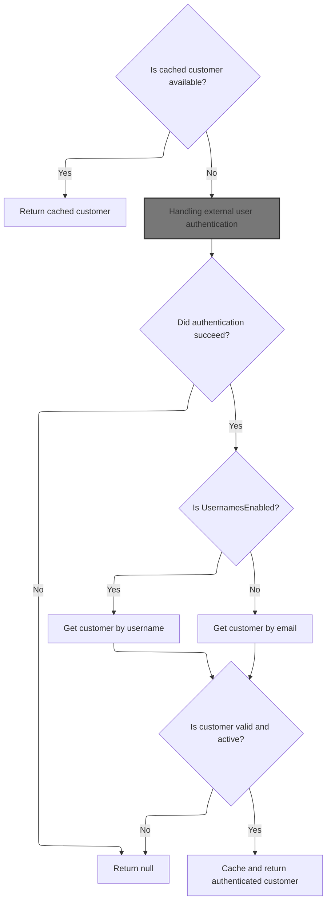
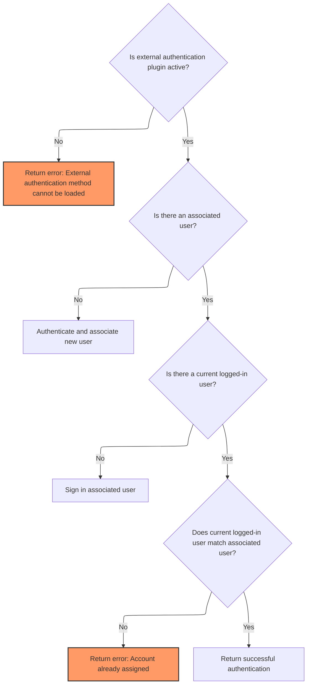
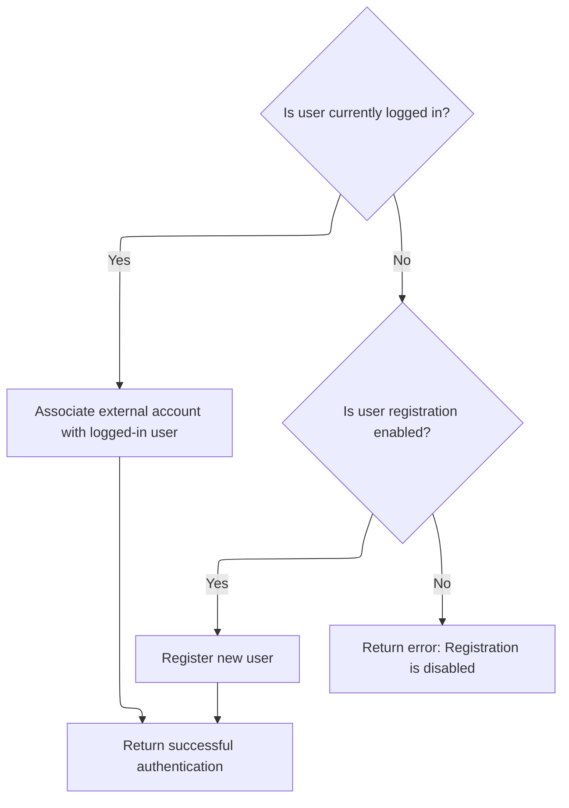
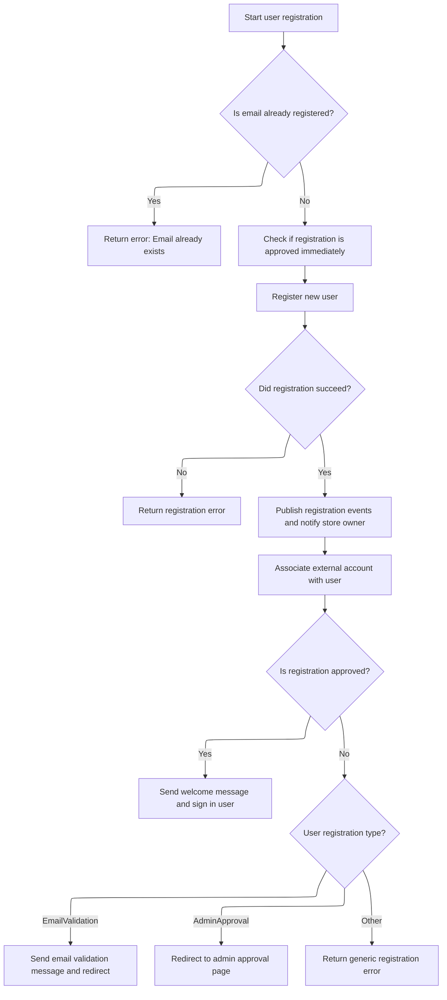
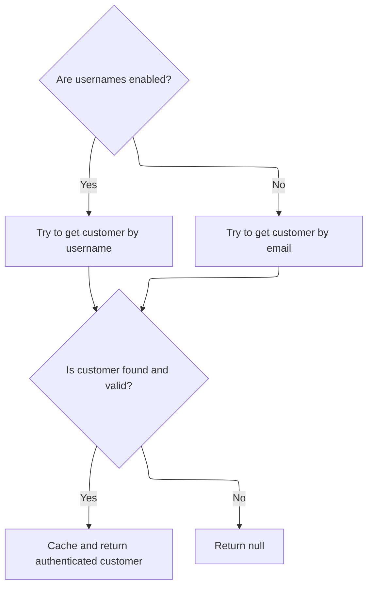

# Starting the customer authentication check



<SwmSnippet path="/src/Libraries/Nop.Services/Authentication/CookieAuthenticationService.cs" line="100">

---

We first return a cached customer if available, then authenticate the HTTP context with nopCommerce's scheme. If that fails, we return null. We rely on ExternalAuthenticationService next to handle external login details and claims.

```c#
        public virtual async Task<Customer> GetAuthenticatedCustomerAsync()
        {
            //whether there is a cached customer
            if (_cachedCustomer != null)
                return _cachedCustomer;

            //try to get authenticated user identity
            var authenticateResult = await _httpContextAccessor.HttpContext.AuthenticateAsync(NopAuthenticationDefaults.AuthenticationScheme);
            if (!authenticateResult.Succeeded)
                return null;

```

---

</SwmSnippet>

## Handling external user authentication



<SwmSnippet path="/src/Libraries/Nop.Services/Authentication/External/ExternalAuthenticationService.cs" line="248">

---

In `AuthenticateAsync`, we first validate the input parameters and check if the external authentication plugin is active for the current store and customer. Then we get the current logged-in user if any. Next, we try to find an existing user linked to the external authentication parameters. If found, we proceed to authenticate that existing user by calling `AuthenticateExistingUserAsync`.

```c#
        public virtual async Task<IActionResult> AuthenticateAsync(ExternalAuthenticationParameters parameters, string returnUrl = null)
        {
            if (parameters == null)
                throw new ArgumentNullException(nameof(parameters));

            if (!await _authenticationPluginManager.IsPluginActiveAsync(parameters.ProviderSystemName, await _workContext.GetCurrentCustomerAsync(), (await _storeContext.GetCurrentStoreAsync()).Id))
                return ErrorAuthentication(new[] { "External authentication method cannot be loaded" }, returnUrl);

            //get current logged-in user
            var currentLoggedInUser = await _customerService.IsRegisteredAsync(await _workContext.GetCurrentCustomerAsync()) ? await _workContext.GetCurrentCustomerAsync() : null;

            //authenticate associated user if already exists
            var associatedUser = await GetUserByExternalAuthenticationParametersAsync(parameters);
            if (associatedUser != null)
                return await AuthenticateExistingUserAsync(associatedUser, currentLoggedInUser, returnUrl);

```

---

</SwmSnippet>

<SwmSnippet path="/src/Libraries/Nop.Services/Authentication/External/ExternalAuthenticationService.cs" line="86">

---

We sign in the associated user if no one is logged in, error if logged-in user differs, else confirm success.

```c#
        protected virtual async Task<IActionResult> AuthenticateExistingUserAsync(Customer associatedUser, Customer currentLoggedInUser, string returnUrl)
        {
            //log in guest user
            if (currentLoggedInUser == null)
                return await _customerRegistrationService.SignInCustomerAsync(associatedUser, returnUrl);

            //account is already assigned to another user
            if (currentLoggedInUser.Id != associatedUser.Id)
                return ErrorAuthentication(new[] { await _localizationService.GetResourceAsync("Account.AssociatedExternalAuth.AccountAlreadyAssigned") }, returnUrl);

            //or the user try to log in as himself. bit weird
            return SuccessfulAuthentication(returnUrl);
        }
```

---

</SwmSnippet>

<SwmSnippet path="/src/Libraries/Nop.Services/Authentication/External/ExternalAuthenticationService.cs" line="264">

---

After handling existing users in `AuthenticateAsync`, if no associated user is found, we proceed to `AuthenticateNewUserAsync` to either link the external account to the current user or register a new user. This step covers new user scenarios and keeps the flow complete.

```c#
            //or associate and authenticate new user
            return await AuthenticateNewUserAsync(currentLoggedInUser, parameters, returnUrl);
        }
```

---

</SwmSnippet>

## Managing new user authentication and registration



<SwmSnippet path="/src/Libraries/Nop.Services/Authentication/External/ExternalAuthenticationService.cs" line="110">

---

In `AuthenticateNewUserAsync`, we either link the external account to the logged-in user or try to register a new user if registration is enabled. If registration is disabled, we return an error. This handles new user scenarios and decides the next step accordingly.

```c#
        protected virtual async Task<IActionResult> AuthenticateNewUserAsync(Customer currentLoggedInUser, ExternalAuthenticationParameters parameters, string returnUrl)
        {
            //associate external account with logged-in user
            if (currentLoggedInUser != null)
            {
                await AssociateExternalAccountWithUserAsync(currentLoggedInUser, parameters);

                return SuccessfulAuthentication(returnUrl);
            }

            //or try to register new user
            if (_customerSettings.UserRegistrationType != UserRegistrationType.Disabled)
                return await RegisterNewUserAsync(parameters, returnUrl);

            //registration is disabled
            return ErrorAuthentication(new[] { "Registration is disabled" }, returnUrl);
        }
```

---

</SwmSnippet>

## Registering a new user via external authentication



<SwmSnippet path="/src/Libraries/Nop.Services/Authentication/External/ExternalAuthenticationService.cs" line="137">

---

In `RegisterNewUserAsync`, we check if the email is already registered to avoid duplicates. Then we prepare a registration request with generated password and approval status based on settings. We call CustomerRegistrationService to create the user, then trigger events and notifications. Finally, we link the external account and sign in if approved.

```c#
        protected virtual async Task<IActionResult> RegisterNewUserAsync(ExternalAuthenticationParameters parameters, string returnUrl)
        {
            //check whether the specified email has been already registered
            if (await _customerService.GetCustomerByEmailAsync(parameters.Email) != null)
            {
                var alreadyExistsError = string.Format(await _localizationService.GetResourceAsync("Account.AssociatedExternalAuth.EmailAlreadyExists"),
                    !string.IsNullOrEmpty(parameters.ExternalDisplayIdentifier) ? parameters.ExternalDisplayIdentifier : parameters.ExternalIdentifier);
                return ErrorAuthentication(new[] { alreadyExistsError }, returnUrl);
            }

            //registration is approved if validation isn't required
            var registrationIsApproved = _customerSettings.UserRegistrationType == UserRegistrationType.Standard ||
                (_customerSettings.UserRegistrationType == UserRegistrationType.EmailValidation && !_externalAuthenticationSettings.RequireEmailValidation);

            //create registration request
            var registrationRequest = new CustomerRegistrationRequest(await _workContext.GetCurrentCustomerAsync(),
                parameters.Email, parameters.Email,
                CommonHelper.GenerateRandomDigitCode(20),
                PasswordFormat.Hashed,
                (await _storeContext.GetCurrentStoreAsync()).Id,
                registrationIsApproved);

            //whether registration request has been completed successfully
            var registrationResult = await _customerRegistrationService.RegisterCustomerAsync(registrationRequest);
            if (!registrationResult.Success)
                return ErrorAuthentication(registrationResult.Errors, returnUrl);

            //allow to save other customer values by consuming this event
            await _eventPublisher.PublishAsync(new CustomerAutoRegisteredByExternalMethodEvent(await _workContext.GetCurrentCustomerAsync(), parameters));

            //raise customer registered event
            await _eventPublisher.PublishAsync(new CustomerRegisteredEvent(await _workContext.GetCurrentCustomerAsync()));

            //store owner notifications
            if (_customerSettings.NotifyNewCustomerRegistration)
                await _workflowMessageService.SendCustomerRegisteredNotificationMessageAsync(await _workContext.GetCurrentCustomerAsync(), _localizationSettings.DefaultAdminLanguageId);

            //associate external account with registered user
            await AssociateExternalAccountWithUserAsync(await _workContext.GetCurrentCustomerAsync(), parameters);

            //authenticate
            if (registrationIsApproved)
            {
                await _workflowMessageService.SendCustomerWelcomeMessageAsync(await _workContext.GetCurrentCustomerAsync(), (await _workContext.GetWorkingLanguageAsync()).Id);

                //raise event       
                await _eventPublisher.PublishAsync(new CustomerActivatedEvent(await _workContext.GetCurrentCustomerAsync()));

                return await _customerRegistrationService.SignInCustomerAsync(await _workContext.GetCurrentCustomerAsync(), returnUrl, true);
            }

```

---

</SwmSnippet>

<SwmSnippet path="/src/Libraries/Nop.Services/Authentication/External/ExternalAuthenticationService.cs" line="188">

---

After registering a new user in `RegisterNewUserAsync`, we handle post-registration states: email validation, admin approval, or error. We send validation emails or redirect accordingly, or return an error if something went wrong.

```c#
            //registration is succeeded but isn't activated
            if (_customerSettings.UserRegistrationType == UserRegistrationType.EmailValidation)
            {
                //email validation message
                await _genericAttributeService.SaveAttributeAsync(await _workContext.GetCurrentCustomerAsync(), NopCustomerDefaults.AccountActivationTokenAttribute, Guid.NewGuid().ToString());
                await _workflowMessageService.SendCustomerEmailValidationMessageAsync(await _workContext.GetCurrentCustomerAsync(), (await _workContext.GetWorkingLanguageAsync()).Id);

                return new RedirectToRouteResult("RegisterResult", new { resultId = (int)UserRegistrationType.EmailValidation, returnUrl });
            }

            //registration is succeeded but isn't approved by admin
            if (_customerSettings.UserRegistrationType == UserRegistrationType.AdminApproval)
                return new RedirectToRouteResult("RegisterResult", new { resultId = (int)UserRegistrationType.AdminApproval, returnUrl });

            return ErrorAuthentication(new[] { "Error on registration" }, returnUrl);
        }
```

---

</SwmSnippet>

## Finalizing customer retrieval from claims



<SwmSnippet path="/src/Libraries/Nop.Services/Authentication/CookieAuthenticationService.cs" line="111">

---

Back in `GetAuthenticatedCustomerAsync`, after external authentication, we check if usernames are enabled to decide whether to get the customer by username or email claim. We verify the claim issuer matches nopCommerce's expected issuer. If the customer is inactive, deleted, or requires re-login, we return null. Otherwise, we cache and return the customer.

```c#
            Customer customer = null;
            if (_customerSettings.UsernamesEnabled)
            {
                //try to get customer by username
                var usernameClaim = authenticateResult.Principal.FindFirst(claim => claim.Type == ClaimTypes.Name
                    && claim.Issuer.Equals(NopAuthenticationDefaults.ClaimsIssuer, StringComparison.InvariantCultureIgnoreCase));
                if (usernameClaim != null)
                    customer = await _customerService.GetCustomerByUsernameAsync(usernameClaim.Value);
            }
            else
            {
                //try to get customer by email
                var emailClaim = authenticateResult.Principal.FindFirst(claim => claim.Type == ClaimTypes.Email
                    && claim.Issuer.Equals(NopAuthenticationDefaults.ClaimsIssuer, StringComparison.InvariantCultureIgnoreCase));
                if (emailClaim != null)
                    customer = await _customerService.GetCustomerByEmailAsync(emailClaim.Value);
            }

            //whether the found customer is available
            if (customer == null || !customer.Active || customer.RequireReLogin || customer.Deleted || !await _customerService.IsRegisteredAsync(customer))
                return null;

            //cache authenticated customer
            _cachedCustomer = customer;

            return _cachedCustomer;
        }
```

---

</SwmSnippet>

&nbsp;

*This is an auto-generated document by Swimm 🌊 and has not yet been verified by a human*

<SwmMeta version="3.0.0" repo-id="Z2l0aHViJTNBJTNBbnBDb21tZXJjZUFTUERvdG5ldCUzQSUzQXVtYWxpbmdhc3dhbWk=" repo-name="npCommerceASPDotnet"><sup>Powered by [Swimm](https://app.swimm.io/)</sup></SwmMeta>
