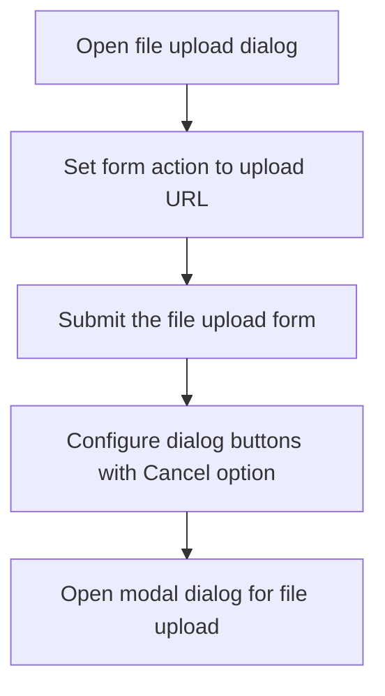

This document explains the flow of handling files dropped by the user onto the interface. It opens the upload dialog, prepares the UI, manages the file list by appending or replacing files, and allows the user to upload the files.

# Where is this flow used?

This flow is used multiple times in the codebase as represented in the following diagram:

```mermaid
graph TD;
      449a261243fe62b693d94b0fdd170df58b849320ccd6a99f95666d298afc5fdc(src/…/js/main.js::ondrop) --> 7ec8f9058462ecdf7ccc8f3e83bb3c97d8d3fbb82cc3ea8aece25bd072a69c3c(src/…/js/main.js::dropFiles):::mainFlowStyle

449a261243fe62b693d94b0fdd170df58b849320ccd6a99f95666d298afc5fdc(src/…/js/main.js::ondrop) --> 7ec8f9058462ecdf7ccc8f3e83bb3c97d8d3fbb82cc3ea8aece25bd072a69c3c(src/…/js/main.js::dropFiles):::mainFlowStyle


classDef mainFlowStyle color:#000000,fill:#7CB9F4
classDef rootsStyle color:#000000,fill:#00FFF4
classDef Style1 color:#000000,fill:#00FFAA
classDef Style2 color:#000000,fill:#FFFF00
classDef Style3 color:#000000,fill:#AA7CB9

%% Swimm:
%% graph TD;
%%       449a261243fe62b693d94b0fdd170df58b849320ccd6a99f95666d298afc5fdc(<SwmPath>[src/…/js/main.js](src/Presentation/Nop.Web/wwwroot/lib/Roxy_Fileman/js/main.js)</SwmPath>::ondrop) --> 7ec8f9058462ecdf7ccc8f3e83bb3c97d8d3fbb82cc3ea8aece25bd072a69c3c(<SwmPath>[src/…/js/main.js](src/Presentation/Nop.Web/wwwroot/lib/Roxy_Fileman/js/main.js)</SwmPath>::<SwmToken path="src/Presentation/Nop.Web/wwwroot/lib/Roxy_Fileman/js/main.js" pos="237:2:2" line-data="function dropFiles(e, append){">`dropFiles`</SwmToken>):::mainFlowStyle
%% 
%% 449a261243fe62b693d94b0fdd170df58b849320ccd6a99f95666d298afc5fdc(<SwmPath>[src/…/js/main.js](src/Presentation/Nop.Web/wwwroot/lib/Roxy_Fileman/js/main.js)</SwmPath>::ondrop) --> 7ec8f9058462ecdf7ccc8f3e83bb3c97d8d3fbb82cc3ea8aece25bd072a69c3c(<SwmPath>[src/…/js/main.js](src/Presentation/Nop.Web/wwwroot/lib/Roxy_Fileman/js/main.js)</SwmPath>::<SwmToken path="src/Presentation/Nop.Web/wwwroot/lib/Roxy_Fileman/js/main.js" pos="237:2:2" line-data="function dropFiles(e, append){">`dropFiles`</SwmToken>):::mainFlowStyle
%% 
%% 
%% classDef mainFlowStyle color:#000000,fill:#7CB9F4
%% classDef rootsStyle color:#000000,fill:#00FFF4
%% classDef Style1 color:#000000,fill:#00FFAA
%% classDef Style2 color:#000000,fill:#FFFF00
%% classDef Style3 color:#000000,fill:#AA7CB9
```



# Handling file drop events

<SwmSnippet path="/src/Presentation/Nop.Web/wwwroot/lib/Roxy_Fileman/js/main.js" line="237">

---

In <SwmToken path="src/Presentation/Nop.Web/wwwroot/lib/Roxy_Fileman/js/main.js" pos="237:2:2" line-data="function dropFiles(e, append){">`dropFiles`</SwmToken> we start by checking if the event contains files. If it does, we immediately call <SwmToken path="src/Presentation/Nop.Web/wwwroot/lib/Roxy_Fileman/js/main.js" pos="239:1:1" line-data="    addFile();">`addFile`</SwmToken> to open the file upload dialog and prepare the UI for file input. Calling <SwmToken path="src/Presentation/Nop.Web/wwwroot/lib/Roxy_Fileman/js/main.js" pos="239:1:1" line-data="    addFile();">`addFile`</SwmToken> here sets up the interface and state needed to handle the incoming files properly.

```javascript
function dropFiles(e, append){
  if(e && e.dataTransfer && e.dataTransfer.files){
    addFile();
```

---

</SwmSnippet>

## Setting up the upload interface

<SwmSnippet path="/src/Presentation/Nop.Web/wwwroot/lib/Roxy_Fileman/js/main.js" line="262">

---

In <SwmToken path="src/Presentation/Nop.Web/wwwroot/lib/Roxy_Fileman/js/main.js" pos="262:2:2" line-data="function addFile(){">`addFile`</SwmToken> we set up the upload dialog UI, clear previous results, and prepare buttons. When the user clicks upload, if files are ready, we call <SwmToken path="src/Presentation/Nop.Web/wwwroot/lib/Roxy_Fileman/js/main.js" pos="278:1:1" line-data="            fileUpload(uploadFileList[i], i);">`fileUpload`</SwmToken> for each file to start the actual upload process. Calling <SwmToken path="src/Presentation/Nop.Web/wwwroot/lib/Roxy_Fileman/js/main.js" pos="278:1:1" line-data="            fileUpload(uploadFileList[i], i);">`fileUpload`</SwmToken> here kicks off the file transfer to the server.

```javascript
function addFile(){
  clickFirstOnEnter('dlgAddFile');
  $('#uploadResult').html('');
  clearFileField();
  var dialogButtons = {};
  dialogButtons[t('Upload')] = {id:'btnUpload', text: t('Upload'), disabled:true, click:function(){
    if(!$('#fileUploads').val() && (!uploadFileList || uploadFileList.length == 0))
      alert(t('E_SelectFiles'));
    else{
      if(!RoxyFilemanConf.UPLOAD){
        alert(t('E_ActionDisabled'));
        //$('#dlgAddFile').dialog('close');
      }
      else{
        if(window.FormData && window.XMLHttpRequest && window.FileList && uploadFileList && uploadFileList.length > 0){
          for(i = 0; i < uploadFileList.length; i++){
            fileUpload(uploadFileList[i], i);
          } 
        }
        else{
```

---

</SwmSnippet>

### Uploading individual files

See <SwmLink doc-title="File upload process">[File upload process](.swm%5Cfile-upload-process.vclnt8jx.sw.md)</SwmLink>

### Fallback upload handling and dialog controls



<SwmSnippet path="/src/Presentation/Nop.Web/wwwroot/lib/Roxy_Fileman/js/main.js" line="282">

---

After calling <SwmToken path="src/Presentation/Nop.Web/wwwroot/lib/Roxy_Fileman/js/main.js" pos="278:1:1" line-data="            fileUpload(uploadFileList[i], i);">`fileUpload`</SwmToken>, <SwmToken path="src/Presentation/Nop.Web/wwwroot/lib/Roxy_Fileman/js/main.js" pos="239:1:1" line-data="    addFile();">`addFile`</SwmToken> falls back to submitting the form if advanced upload isn't supported.

```javascript
          document.forms['addfile'].action = RoxyFilemanConf.UPLOAD;
          document.forms['addfile'].submit();
        }
      }
    }
  }};
  
  dialogButtons[t('Cancel')] = function(){$('#dlgAddFile').dialog('close');};
  $('#dlgAddFile').dialog({title:t('T_AddFile'),modal:true,buttons:dialogButtons,width:400});
}
```

---

</SwmSnippet>

## Updating file list after dialog setup

<SwmSnippet path="/src/Presentation/Nop.Web/wwwroot/lib/Roxy_Fileman/js/main.js" line="240">

---

Back in <SwmToken path="src/Presentation/Nop.Web/wwwroot/lib/Roxy_Fileman/js/main.js" pos="237:2:2" line-data="function dropFiles(e, append){">`dropFiles`</SwmToken> after returning from <SwmToken path="src/Presentation/Nop.Web/wwwroot/lib/Roxy_Fileman/js/main.js" pos="239:1:1" line-data="    addFile();">`addFile`</SwmToken>, we decide whether to append new files to the existing upload list or replace it by calling <SwmToken path="src/Presentation/Nop.Web/wwwroot/lib/Roxy_Fileman/js/main.js" pos="241:1:1" line-data="      addUploadFiles(e.dataTransfer.files);">`addUploadFiles`</SwmToken> or <SwmToken path="src/Presentation/Nop.Web/wwwroot/lib/Roxy_Fileman/js/main.js" pos="243:1:1" line-data="      listUploadFiles(e.dataTransfer.files);">`listUploadFiles`</SwmToken>. Calling <SwmToken path="src/Presentation/Nop.Web/wwwroot/lib/Roxy_Fileman/js/main.js" pos="243:1:1" line-data="      listUploadFiles(e.dataTransfer.files);">`listUploadFiles`</SwmToken> initializes or updates the file list for upload management.

```javascript
    if(append)
      addUploadFiles(e.dataTransfer.files);
    else
      listUploadFiles(e.dataTransfer.files);
  }
  else
```

---

</SwmSnippet>

<SwmSnippet path="/src/Presentation/Nop.Web/wwwroot/lib/Roxy_Fileman/js/main.js" line="129">

---

<SwmToken path="src/Presentation/Nop.Web/wwwroot/lib/Roxy_Fileman/js/main.js" pos="129:2:2" line-data="function listUploadFiles(files){">`listUploadFiles`</SwmToken> checks if the browser supports the <SwmToken path="src/Presentation/Nop.Web/wwwroot/lib/Roxy_Fileman/js/main.js" pos="130:6:6" line-data="  if(!window.FileList) {">`FileList`</SwmToken> API. If not, it enables the upload button for manual file selection. If supported and files exist, it initializes the global upload list and adds the files to it via <SwmToken path="src/Presentation/Nop.Web/wwwroot/lib/Roxy_Fileman/js/main.js" pos="135:1:1" line-data="    addUploadFiles(files);">`addUploadFiles`</SwmToken>. This sets up the files for upload management.

```javascript
function listUploadFiles(files){
  if(!window.FileList) {
    $('#btnUpload').button('enable');
  }
  else if(files.length > 0) {
    uploadFileList = new Array();
    addUploadFiles(files);
  }
}
```

---

</SwmSnippet>

<SwmSnippet path="/src/Presentation/Nop.Web/wwwroot/lib/Roxy_Fileman/js/main.js" line="246">

---

After <SwmToken path="src/Presentation/Nop.Web/wwwroot/lib/Roxy_Fileman/js/main.js" pos="129:2:2" line-data="function listUploadFiles(files){">`listUploadFiles`</SwmToken> returns in <SwmToken path="src/Presentation/Nop.Web/wwwroot/lib/Roxy_Fileman/js/main.js" pos="237:2:2" line-data="function dropFiles(e, append){">`dropFiles`</SwmToken>, we call <SwmToken path="src/Presentation/Nop.Web/wwwroot/lib/Roxy_Fileman/js/main.js" pos="246:1:1" line-data="    addFile();">`addFile`</SwmToken> to open the upload dialog for user action.

```javascript
    addFile();
}
```

---

</SwmSnippet>

&nbsp;

*This is an auto-generated document by Swimm 🌊 and has not yet been verified by a human*

<SwmMeta version="3.0.0" repo-id="Z2l0aHViJTNBJTNBbnBDb21tZXJjZUFTUERvdG5ldCUzQSUzQXVtYWxpbmdhc3dhbWk=" repo-name="npCommerceASPDotnet"><sup>Powered by [Swimm](https://app.swimm.io/)</sup></SwmMeta>
