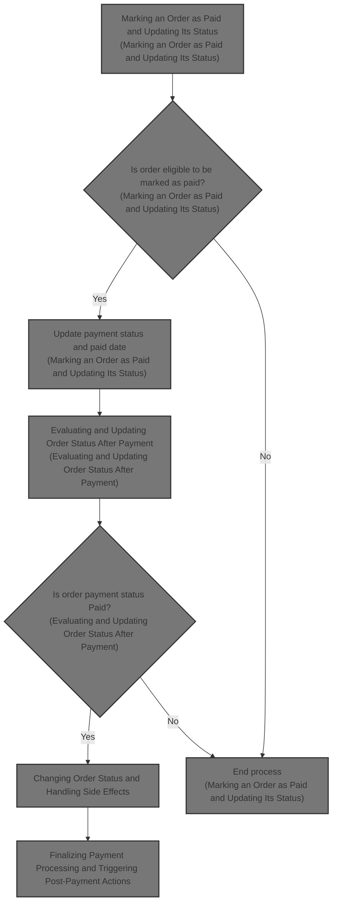
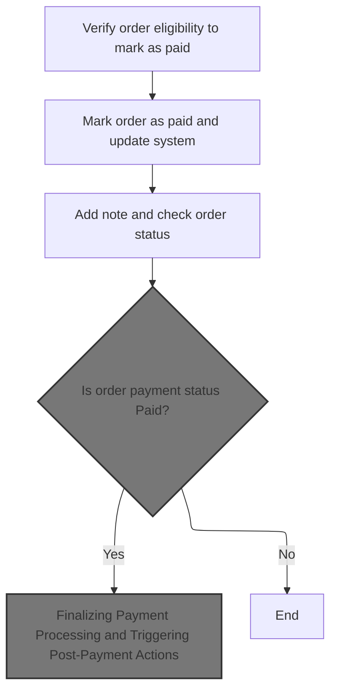
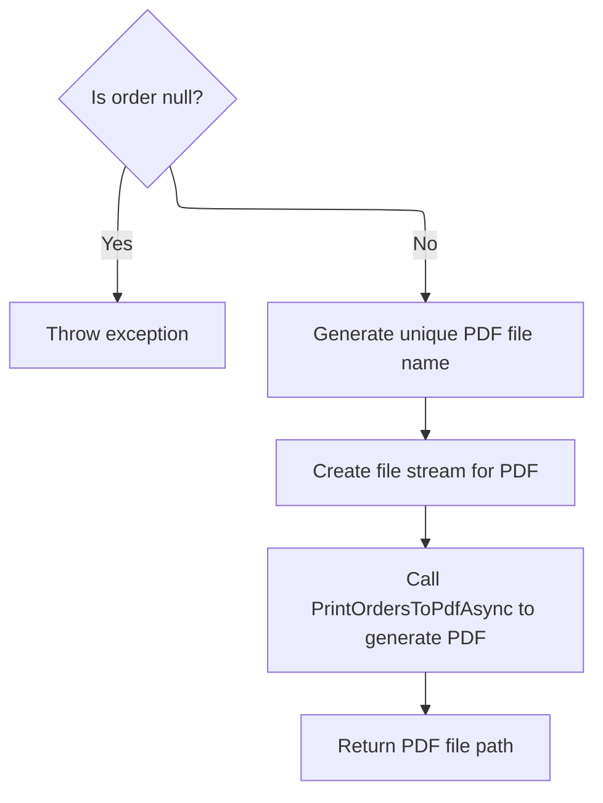
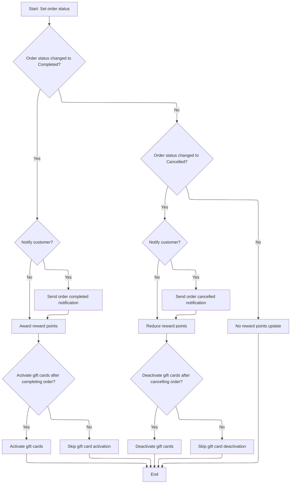

This document explains the flow of marking an order as paid within the order processing system. It verifies eligibility, updates payment status and date, adjusts order status based on conditions, handles notifications and rewards, and finalizes post-payment processes including notifications and role updates. The flow receives an order as input and outputs the updated order with all related side effects.



# Where is this flow used?

This flow is used multiple times in the codebase as represented in the following diagram:

```mermaid
graph TD;
      7796c7aea835829935e8bdcdd4be7d4b9e3d59bc0f556a7bc328e6e7d7edb20a(src/…/Services/ServiceManager.cs::ServiceManager.HandleWebhookAsync) --> 3fd7fd5bbc097de99dfd9b7c6a6f25b4ccd492e5bc79a93f589bbba2ce110ab0(src/…/Orders/OrderProcessingService.cs::OrderProcessingService.MarkOrderAsPaidAsync)

6aef5169ddac9e0333b4f3c1e1596b0e67d403cec0d3815dc6eec5d3462097b7(src/…/Controllers/PayPalCommerceWebhookController.cs::PayPalCommerceWebhookController.WebhookHandler) --> 7796c7aea835829935e8bdcdd4be7d4b9e3d59bc0f556a7bc328e6e7d7edb20a(src/…/Services/ServiceManager.cs::ServiceManager.HandleWebhookAsync)

84d5f45d5cf212b9d2f9f7497ac3bfd37f7e21f932cc39e72fd53e0ffd815b02(src/…/Controllers/PaymentPayPalStandardController.cs::PaymentPayPalStandardController.PDTHandler) --> 3fd7fd5bbc097de99dfd9b7c6a6f25b4ccd492e5bc79a93f589bbba2ce110ab0(src/…/Orders/OrderProcessingService.cs::OrderProcessingService.MarkOrderAsPaidAsync)

1bb2622fb8469ea59d392ab2df2d456a004b9cf3bacca689731cc3993f1f3c47(src/…/Controllers/PaymentPayPalStandardIpnController.cs::PaymentPayPalStandardIpnController.ProcessPaymentAsync) --> 3fd7fd5bbc097de99dfd9b7c6a6f25b4ccd492e5bc79a93f589bbba2ce110ab0(src/…/Orders/OrderProcessingService.cs::OrderProcessingService.MarkOrderAsPaidAsync)

d5d66afcee71be8d1d6c9e232b76dbca7911b95a1fe9465eb1cd7b61eaf8a3ec(src/…/Controllers/PaymentPayPalStandardIpnController.cs::PaymentPayPalStandardIpnController.IPNHandler) --> 1bb2622fb8469ea59d392ab2df2d456a004b9cf3bacca689731cc3993f1f3c47(src/…/Controllers/PaymentPayPalStandardIpnController.cs::PaymentPayPalStandardIpnController.ProcessPaymentAsync)

f39a49fa47b5f1bc92c335e7c6f962d630f284bba2bf688d430cbd54513371b6(src/…/Controllers/OrderController.cs::OrderController.MarkOrderAsPaid) --> 3fd7fd5bbc097de99dfd9b7c6a6f25b4ccd492e5bc79a93f589bbba2ce110ab0(src/…/Orders/OrderProcessingService.cs::OrderProcessingService.MarkOrderAsPaidAsync)


classDef mainFlowStyle color:#000000,fill:#7CB9F4
classDef rootsStyle color:#000000,fill:#00FFF4
classDef Style1 color:#000000,fill:#00FFAA
classDef Style2 color:#000000,fill:#FFFF00
classDef Style3 color:#000000,fill:#AA7CB9

%% Swimm:
%% graph TD;
%%       7796c7aea835829935e8bdcdd4be7d4b9e3d59bc0f556a7bc328e6e7d7edb20a(<SwmPath>[src/…/Services/ServiceManager.cs](src/Plugins/Nop.Plugin.Payments.PayPalCommerce/Services/ServiceManager.cs)</SwmPath>::ServiceManager.HandleWebhookAsync) --> 3fd7fd5bbc097de99dfd9b7c6a6f25b4ccd492e5bc79a93f589bbba2ce110ab0(<SwmPath>[src/…/Orders/OrderProcessingService.cs](src/Libraries/Nop.Services/Orders/OrderProcessingService.cs)</SwmPath>::OrderProcessingService.MarkOrderAsPaidAsync)
%% 
%% 6aef5169ddac9e0333b4f3c1e1596b0e67d403cec0d3815dc6eec5d3462097b7(<SwmPath>[src/…/Controllers/PayPalCommerceWebhookController.cs](src/Plugins/Nop.Plugin.Payments.PayPalCommerce/Controllers/PayPalCommerceWebhookController.cs)</SwmPath>::PayPalCommerceWebhookController.WebhookHandler) --> 7796c7aea835829935e8bdcdd4be7d4b9e3d59bc0f556a7bc328e6e7d7edb20a(<SwmPath>[src/…/Services/ServiceManager.cs](src/Plugins/Nop.Plugin.Payments.PayPalCommerce/Services/ServiceManager.cs)</SwmPath>::ServiceManager.HandleWebhookAsync)
%% 
%% 84d5f45d5cf212b9d2f9f7497ac3bfd37f7e21f932cc39e72fd53e0ffd815b02(<SwmPath>[src/…/Controllers/PaymentPayPalStandardController.cs](src/Plugins/Nop.Plugin.Payments.PayPalStandard/Controllers/PaymentPayPalStandardController.cs)</SwmPath>::PaymentPayPalStandardController.PDTHandler) --> 3fd7fd5bbc097de99dfd9b7c6a6f25b4ccd492e5bc79a93f589bbba2ce110ab0(<SwmPath>[src/…/Orders/OrderProcessingService.cs](src/Libraries/Nop.Services/Orders/OrderProcessingService.cs)</SwmPath>::OrderProcessingService.MarkOrderAsPaidAsync)
%% 
%% 1bb2622fb8469ea59d392ab2df2d456a004b9cf3bacca689731cc3993f1f3c47(<SwmPath>[src/…/Controllers/PaymentPayPalStandardIpnController.cs](src/Plugins/Nop.Plugin.Payments.PayPalStandard/Controllers/PaymentPayPalStandardIpnController.cs)</SwmPath>::PaymentPayPalStandardIpnController.ProcessPaymentAsync) --> 3fd7fd5bbc097de99dfd9b7c6a6f25b4ccd492e5bc79a93f589bbba2ce110ab0(<SwmPath>[src/…/Orders/OrderProcessingService.cs](src/Libraries/Nop.Services/Orders/OrderProcessingService.cs)</SwmPath>::OrderProcessingService.MarkOrderAsPaidAsync)
%% 
%% d5d66afcee71be8d1d6c9e232b76dbca7911b95a1fe9465eb1cd7b61eaf8a3ec(<SwmPath>[src/…/Controllers/PaymentPayPalStandardIpnController.cs](src/Plugins/Nop.Plugin.Payments.PayPalStandard/Controllers/PaymentPayPalStandardIpnController.cs)</SwmPath>::PaymentPayPalStandardIpnController.IPNHandler) --> 1bb2622fb8469ea59d392ab2df2d456a004b9cf3bacca689731cc3993f1f3c47(<SwmPath>[src/…/Controllers/PaymentPayPalStandardIpnController.cs](src/Plugins/Nop.Plugin.Payments.PayPalStandard/Controllers/PaymentPayPalStandardIpnController.cs)</SwmPath>::PaymentPayPalStandardIpnController.ProcessPaymentAsync)
%% 
%% f39a49fa47b5f1bc92c335e7c6f962d630f284bba2bf688d430cbd54513371b6(<SwmPath>[src/…/Controllers/OrderController.cs](src/Presentation/Nop.Web/Areas/Admin/Controllers/OrderController.cs)</SwmPath>::OrderController.MarkOrderAsPaid) --> 3fd7fd5bbc097de99dfd9b7c6a6f25b4ccd492e5bc79a93f589bbba2ce110ab0(<SwmPath>[src/…/Orders/OrderProcessingService.cs](src/Libraries/Nop.Services/Orders/OrderProcessingService.cs)</SwmPath>::OrderProcessingService.MarkOrderAsPaidAsync)
%% 
%% 
%% classDef mainFlowStyle color:#000000,fill:#7CB9F4
%% classDef rootsStyle color:#000000,fill:#00FFF4
%% classDef Style1 color:#000000,fill:#00FFAA
%% classDef Style2 color:#000000,fill:#FFFF00
%% classDef Style3 color:#000000,fill:#AA7CB9
```



# Marking an Order as Paid and Updating Its Status



<SwmSnippet path="/src/Libraries/Nop.Services/Orders/OrderProcessingService.cs" line="2512">

---

In <SwmToken path="src/Libraries/Nop.Services/Orders/OrderProcessingService.cs" pos="2512:9:9" line-data="        public virtual async Task MarkOrderAsPaidAsync(Order order)">`MarkOrderAsPaidAsync`</SwmToken>, the function first verifies if the order can be marked as paid to respect business rules. Then it updates the payment status and paid date, and calls the order service to persist these changes asynchronously. This sets the stage for the rest of the flow.

```c#
        public virtual async Task MarkOrderAsPaidAsync(Order order)
        {
            if (order == null)
                throw new ArgumentNullException(nameof(order));

            if (!CanMarkOrderAsPaid(order))
                throw new NopException("You can't mark this order as paid");

            order.PaymentStatusId = (int)PaymentStatus.Paid;
            order.PaidDateUtc = DateTime.UtcNow;
            await _orderService.UpdateOrderAsync(order);

```

---

</SwmSnippet>

<SwmSnippet path="/src/Libraries/Nop.Services/Orders/OrderService.cs" line="408">

---

<SwmToken path="src/Libraries/Nop.Services/Orders/OrderService.cs" pos="408:9:9" line-data="        public virtual async Task UpdateOrderAsync(Order order)">`UpdateOrderAsync`</SwmToken> just passes the order to the repository's async update method without extra logic. It's a simple delegation to persist changes made earlier in the flow.

```c#
        public virtual async Task UpdateOrderAsync(Order order)
        {
            await _orderRepository.UpdateAsync(order);
        }
```

---

</SwmSnippet>

<SwmSnippet path="/src/Libraries/Nop.Services/Orders/OrderProcessingService.cs" line="2524">

---

After updating the order, <SwmToken path="src/Libraries/Nop.Services/Orders/OrderProcessingService.cs" pos="2512:9:9" line-data="        public virtual async Task MarkOrderAsPaidAsync(Order order)">`MarkOrderAsPaidAsync`</SwmToken> adds a note saying the order was marked as paid. This logs the event for auditing and tracking.

```c#
            //add a note
            await AddOrderNoteAsync(order, "Order has been marked as paid");

```

---

</SwmSnippet>

<SwmSnippet path="/src/Libraries/Nop.Services/Orders/OrderProcessingService.cs" line="383">

---

<SwmToken path="src/Libraries/Nop.Services/Orders/OrderProcessingService.cs" pos="383:9:9" line-data="        protected virtual async Task AddOrderNoteAsync(Order order, string note)">`AddOrderNoteAsync`</SwmToken> creates a new order note linked to the order's ID, sets it to not display to customers, and saves it asynchronously.

```c#
        protected virtual async Task AddOrderNoteAsync(Order order, string note)
        {
            await _orderService.InsertOrderNoteAsync(new OrderNote
            {
                OrderId = order.Id,
                Note = note,
                DisplayToCustomer = false,
                CreatedOnUtc = DateTime.UtcNow
            });
        }
```

---

</SwmSnippet>

<SwmSnippet path="/src/Libraries/Nop.Services/Orders/OrderProcessingService.cs" line="2527">

---

After adding the note, <SwmToken path="src/Libraries/Nop.Services/Orders/OrderProcessingService.cs" pos="2512:9:9" line-data="        public virtual async Task MarkOrderAsPaidAsync(Order order)">`MarkOrderAsPaidAsync`</SwmToken> calls <SwmToken path="src/Libraries/Nop.Services/Orders/OrderProcessingService.cs" pos="2527:3:3" line-data="            await CheckOrderStatusAsync(order);">`CheckOrderStatusAsync`</SwmToken> to update the order status based on the new payment info.

```c#
            await CheckOrderStatusAsync(order);

```

---

</SwmSnippet>

## Evaluating and Updating Order Status After Payment

```mermaid
%%{init: {"flowchart": {"defaultRenderer": "elk"}} }%%
flowchart TD
    node1{"Is order paid but missing paid date?"}
    node1 -->|"Yes"| node2["Set paid date and update order"]
    node1 -->|"No"| node3
    node3{"Is order status Pending?"}
    node3 -->|"Yes"| node4{"Is payment Authorized or Paid?"}
    node4 -->|"Yes"| node5["Set order status to Processing"]
    node4 -->|"No"| node6
    node3 -->|"No"| node7{"Is order status Cancelled or Complete?"}
    node7 -->|"Yes"| node8["Exit function"]
    node7 -->|"No"| node6
    node6{"Is payment status Paid?"}
    node6 -->|"No"| node8
    node6 -->|"Yes"| node9{"Is shipping required?"}
    node9 -->|"No"| node10["Mark order as completed"]
    node9 -->|"Yes"| node11{"Is order complete based on shipping status and settings?"}
    node11 -->|"Yes"| node12["Set order status to Complete"]
    node11 -->|"No"| node8
    
    click node1 openCode "src/Libraries/Nop.Services/Orders/OrderProcessingService.cs:1514:1519"
    click node2 openCode "src/Libraries/Nop.Services/Orders/OrderProcessingService.cs:1516:1519"
    click node3 openCode "src/Libraries/Nop.Services/Orders/OrderProcessingService.cs:1521:1533"
    click node4 openCode "src/Libraries/Nop.Services/Orders/OrderProcessingService.cs:1524:1526"
    click node5 openCode "src/Libraries/Nop.Services/Orders/OrderProcessingService.cs:1526:1527"
    click node6 openCode "src/Libraries/Nop.Services/Orders/OrderProcessingService.cs:1540:1542"
    click node7 openCode "src/Libraries/Nop.Services/Orders/OrderProcessingService.cs:1535:1538"
    click node8 openCode "src/Libraries/Nop.Services/Orders/OrderProcessingService.cs:1537:1538"
    click node9 openCode "src/Libraries/Nop.Services/Orders/OrderProcessingService.cs:1545:1550"
    click node10 openCode "src/Libraries/Nop.Services/Orders/OrderProcessingService.cs:1547:1549"
    click node11 openCode "src/Libraries/Nop.Services/Orders/OrderProcessingService.cs:1553:1558"
    click node12 openCode "src/Libraries/Nop.Services/Orders/OrderProcessingService.cs:1561:1562"
classDef HeadingStyle fill:#777777,stroke:#333,stroke-width:2px;

%% Swimm:
%% %%{init: {"flowchart": {"defaultRenderer": "elk"}} }%%
%% flowchart TD
%%     node1{"Is order paid but missing paid date?"}
%%     node1 -->|"Yes"| node2["Set paid date and update order"]
%%     node1 -->|"No"| node3
%%     node3{"Is order status Pending?"}
%%     node3 -->|"Yes"| node4{"Is payment Authorized or Paid?"}
%%     node4 -->|"Yes"| node5["Set order status to Processing"]
%%     node4 -->|"No"| node6
%%     node3 -->|"No"| node7{"Is order status Cancelled or Complete?"}
%%     node7 -->|"Yes"| node8["Exit function"]
%%     node7 -->|"No"| node6
%%     node6{"Is payment status Paid?"}
%%     node6 -->|"No"| node8
%%     node6 -->|"Yes"| node9{"Is shipping required?"}
%%     node9 -->|"No"| node10["Mark order as completed"]
%%     node9 -->|"Yes"| node11{"Is order complete based on shipping status and settings?"}
%%     node11 -->|"Yes"| node12["Set order status to Complete"]
%%     node11 -->|"No"| node8
%%     
%%     click node1 openCode "<SwmPath>[src/…/Orders/OrderProcessingService.cs](src/Libraries/Nop.Services/Orders/OrderProcessingService.cs)</SwmPath>:1514:1519"
%%     click node2 openCode "<SwmPath>[src/…/Orders/OrderProcessingService.cs](src/Libraries/Nop.Services/Orders/OrderProcessingService.cs)</SwmPath>:1516:1519"
%%     click node3 openCode "<SwmPath>[src/…/Orders/OrderProcessingService.cs](src/Libraries/Nop.Services/Orders/OrderProcessingService.cs)</SwmPath>:1521:1533"
%%     click node4 openCode "<SwmPath>[src/…/Orders/OrderProcessingService.cs](src/Libraries/Nop.Services/Orders/OrderProcessingService.cs)</SwmPath>:1524:1526"
%%     click node5 openCode "<SwmPath>[src/…/Orders/OrderProcessingService.cs](src/Libraries/Nop.Services/Orders/OrderProcessingService.cs)</SwmPath>:1526:1527"
%%     click node6 openCode "<SwmPath>[src/…/Orders/OrderProcessingService.cs](src/Libraries/Nop.Services/Orders/OrderProcessingService.cs)</SwmPath>:1540:1542"
%%     click node7 openCode "<SwmPath>[src/…/Orders/OrderProcessingService.cs](src/Libraries/Nop.Services/Orders/OrderProcessingService.cs)</SwmPath>:1535:1538"
%%     click node8 openCode "<SwmPath>[src/…/Orders/OrderProcessingService.cs](src/Libraries/Nop.Services/Orders/OrderProcessingService.cs)</SwmPath>:1537:1538"
%%     click node9 openCode "<SwmPath>[src/…/Orders/OrderProcessingService.cs](src/Libraries/Nop.Services/Orders/OrderProcessingService.cs)</SwmPath>:1545:1550"
%%     click node10 openCode "<SwmPath>[src/…/Orders/OrderProcessingService.cs](src/Libraries/Nop.Services/Orders/OrderProcessingService.cs)</SwmPath>:1547:1549"
%%     click node11 openCode "<SwmPath>[src/…/Orders/OrderProcessingService.cs](src/Libraries/Nop.Services/Orders/OrderProcessingService.cs)</SwmPath>:1553:1558"
%%     click node12 openCode "<SwmPath>[src/…/Orders/OrderProcessingService.cs](src/Libraries/Nop.Services/Orders/OrderProcessingService.cs)</SwmPath>:1561:1562"
%% classDef HeadingStyle fill:#777777,stroke:#333,stroke-width:2px;
```



<SwmSnippet path="/src/Libraries/Nop.Services/Orders/OrderProcessingService.cs" line="1509">

---

It fixes missing paid date, moves order to Processing if payment/shipping started, skips if final, and marks Complete if conditions met.

```c#
        public virtual async Task CheckOrderStatusAsync(Order order)
        {
            if (order == null)
                throw new ArgumentNullException(nameof(order));

            if (order.PaymentStatus == PaymentStatus.Paid && !order.PaidDateUtc.HasValue)
            {
                //ensure that paid date is set
                order.PaidDateUtc = DateTime.UtcNow;
                await _orderService.UpdateOrderAsync(order);
            }

            switch (order.OrderStatus)
            {
                case OrderStatus.Pending:
                    if (order.PaymentStatus == PaymentStatus.Authorized ||
                        order.PaymentStatus == PaymentStatus.Paid)
                        await SetOrderStatusAsync(order, OrderStatus.Processing, false);

                    if (order.ShippingStatus == ShippingStatus.PartiallyShipped ||
                        order.ShippingStatus == ShippingStatus.Shipped ||
                        order.ShippingStatus == ShippingStatus.Delivered)
                        await SetOrderStatusAsync(order, OrderStatus.Processing, false);

                    break;
                //is order complete?
                case OrderStatus.Cancelled:
                case OrderStatus.Complete:
                    return;
            }

            if (order.PaymentStatus != PaymentStatus.Paid)
                return;

            bool completed;

            if (order.ShippingStatus == ShippingStatus.ShippingNotRequired)
            {
                //shipping is not required
                completed = true;
            }
            else
            {
                //shipping is required
                if (_orderSettings.CompleteOrderWhenDelivered)
                    completed = order.ShippingStatus == ShippingStatus.Delivered;
                else
                    completed = order.ShippingStatus == ShippingStatus.Shipped ||
                                order.ShippingStatus == ShippingStatus.Delivered;
            }

            if (completed) 
                await SetOrderStatusAsync(order, OrderStatus.Complete, true);
        }
```

---

</SwmSnippet>

## Changing Order Status and Handling Side Effects

<SwmSnippet path="/src/Libraries/Nop.Services/Orders/OrderProcessingService.cs" line="1061">

---

In <SwmToken path="src/Libraries/Nop.Services/Orders/OrderProcessingService.cs" pos="1061:9:9" line-data="        protected virtual async Task SetOrderStatusAsync(Order order, OrderStatus os, bool notifyCustomer)">`SetOrderStatusAsync`</SwmToken>, the function updates the order status, saves it, adds a note about the change, and if the status is Complete or Cancelled with notification enabled, it prepares to send emails, including optionally generating a PDF invoice for completion emails.

```c#
        protected virtual async Task SetOrderStatusAsync(Order order, OrderStatus os, bool notifyCustomer)
        {
            if (order == null)
                throw new ArgumentNullException(nameof(order));

            var prevOrderStatus = order.OrderStatus;
            if (prevOrderStatus == os)
                return;

            //set and save new order status
            order.OrderStatusId = (int)os;
            await _orderService.UpdateOrderAsync(order);

            //order notes, notifications
            await AddOrderNoteAsync(order, $"Order status has been changed to {await _localizationService.GetLocalizedEnumAsync(os)}");

            if (prevOrderStatus != OrderStatus.Complete &&
                os == OrderStatus.Complete
                && notifyCustomer)
            {
                //notification
                var orderCompletedAttachmentFilePath = _orderSettings.AttachPdfInvoiceToOrderCompletedEmail ?
                    await _pdfService.PrintOrderToPdfAsync(order) : null;
```

---

</SwmSnippet>

### Generating PDF Invoice for an Order



<SwmSnippet path="/src/Libraries/Nop.Services/Common/PdfService.cs" line="1217">

---

<SwmToken path="src/Libraries/Nop.Services/Common/PdfService.cs" pos="1217:12:12" line-data="        public virtual async Task&lt;string&gt; PrintOrderToPdfAsync(Order order, int languageId = 0, int vendorId = 0)">`PrintOrderToPdfAsync`</SwmToken> creates a unique file name using the order's GUID and a random code, wraps the order in a list, and calls the bulk PDF printing method to generate and save the PDF in a specific folder.

```c#
        public virtual async Task<string> PrintOrderToPdfAsync(Order order, int languageId = 0, int vendorId = 0)
        {
            if (order == null)
                throw new ArgumentNullException(nameof(order));

            var fileName = $"order_{order.OrderGuid}_{CommonHelper.GenerateRandomDigitCode(4)}.pdf";
            var filePath = _fileProvider.Combine(_fileProvider.MapPath("~/wwwroot/files/exportimport"), fileName);
            await using (var fileStream = new FileStream(filePath, FileMode.Create))
            {
                var orders = new List<Order> { order };
                await PrintOrdersToPdfAsync(fileStream, orders, languageId, vendorId);
            }

            return filePath;
        }
```

---

</SwmSnippet>

### Generating PDF for Multiple Orders with Store-Specific Settings

```mermaid
%%{init: {"flowchart": {"defaultRenderer": "elk"}} }%%
flowchart TD
    node1["Start PDF generation"] --> node2{"Is Letter page size enabled?"}
    click node1 openCode "src/Libraries/Nop.Services/Common/PdfService.cs:1241:1249"
    node2 -->|"Yes"| node3["Use Letter page size"]
    click node2 openCode "src/Libraries/Nop.Services/Common/PdfService.cs:1251:1252"
    node2 -->|"No"| node4["Use A4 page size"]
    click node4 openCode "src/Libraries/Nop.Services/Common/PdfService.cs:1249:1251"
    node3 --> node5["Start PDF document"]
    click node3 openCode "src/Libraries/Nop.Services/Common/PdfService.cs:1254:1256"
    node4 --> node5
    click node5 openCode "src/Libraries/Nop.Services/Common/PdfService.cs:1254:1257"
    node5 --> loop1

    subgraph loop1["For each order"]
        node6["Load PDF settings for order's store"]
        click node6 openCode "src/Libraries/Nop.Services/Common/PdfService.cs:1274:1275"
        node7{"Is order language available and published?"}
        click node7 openCode "src/Libraries/Nop.Services/Common/PdfService.cs:1276:1278"
        node7 -->|"Yes"| node8["Use order language"]
        click node8 openCode "src/Libraries/Nop.Services/Common/PdfService.cs:1276:1278"
        node7 -->|"No"| node9["Use default working language"]
        click node9 openCode "src/Libraries/Nop.Services/Common/PdfService.cs:1278:1279"
        node8 --> node10["Print order content"]
        click node10 openCode "src/Libraries/Nop.Services/Common/PdfService.cs:1281:1299"
        node9 --> node10
        node10 --> node11{"Is this the last order?"}
        click node11 openCode "src/Libraries/Nop.Services/Common/PdfService.cs:1301:1303"
        node11 -->|"No"| node12["Add new page"]
        click node12 openCode "src/Libraries/Nop.Services/Common/PdfService.cs:1302:1303"
        node11 -->|"Yes"| node13["Finish order processing"]
        node13 --> node14["Close PDF document"]
        click node13 openCode "src/Libraries/Nop.Services/Common/PdfService.cs:1306:1307"
        click node14 openCode "src/Libraries/Nop.Services/Common/PdfService.cs:1306:1307"
        node12 --> node6
    end
classDef HeadingStyle fill:#777777,stroke:#333,stroke-width:2px;

%% Swimm:
%% %%{init: {"flowchart": {"defaultRenderer": "elk"}} }%%
%% flowchart TD
%%     node1["Start PDF generation"] --> node2{"Is Letter page size enabled?"}
%%     click node1 openCode "<SwmPath>[src/…/Common/PdfService.cs](src/Libraries/Nop.Services/Common/PdfService.cs)</SwmPath>:1241:1249"
%%     node2 -->|"Yes"| node3["Use Letter page size"]
%%     click node2 openCode "<SwmPath>[src/…/Common/PdfService.cs](src/Libraries/Nop.Services/Common/PdfService.cs)</SwmPath>:1251:1252"
%%     node2 -->|"No"| node4["Use <SwmToken path="src/Libraries/Nop.Services/Common/PdfService.cs" pos="1249:9:9" line-data="            var pageSize = PageSize.A4;">`A4`</SwmToken> page size"]
%%     click node4 openCode "<SwmPath>[src/…/Common/PdfService.cs](src/Libraries/Nop.Services/Common/PdfService.cs)</SwmPath>:1249:1251"
%%     node3 --> node5["Start PDF document"]
%%     click node3 openCode "<SwmPath>[src/…/Common/PdfService.cs](src/Libraries/Nop.Services/Common/PdfService.cs)</SwmPath>:1254:1256"
%%     node4 --> node5
%%     click node5 openCode "<SwmPath>[src/…/Common/PdfService.cs](src/Libraries/Nop.Services/Common/PdfService.cs)</SwmPath>:1254:1257"
%%     node5 --> loop1
%% 
%%     subgraph loop1["For each order"]
%%         node6["Load PDF settings for order's store"]
%%         click node6 openCode "<SwmPath>[src/…/Common/PdfService.cs](src/Libraries/Nop.Services/Common/PdfService.cs)</SwmPath>:1274:1275"
%%         node7{"Is order language available and published?"}
%%         click node7 openCode "<SwmPath>[src/…/Common/PdfService.cs](src/Libraries/Nop.Services/Common/PdfService.cs)</SwmPath>:1276:1278"
%%         node7 -->|"Yes"| node8["Use order language"]
%%         click node8 openCode "<SwmPath>[src/…/Common/PdfService.cs](src/Libraries/Nop.Services/Common/PdfService.cs)</SwmPath>:1276:1278"
%%         node7 -->|"No"| node9["Use default working language"]
%%         click node9 openCode "<SwmPath>[src/…/Common/PdfService.cs](src/Libraries/Nop.Services/Common/PdfService.cs)</SwmPath>:1278:1279"
%%         node8 --> node10["Print order content"]
%%         click node10 openCode "<SwmPath>[src/…/Common/PdfService.cs](src/Libraries/Nop.Services/Common/PdfService.cs)</SwmPath>:1281:1299"
%%         node9 --> node10
%%         node10 --> node11{"Is this the last order?"}
%%         click node11 openCode "<SwmPath>[src/…/Common/PdfService.cs](src/Libraries/Nop.Services/Common/PdfService.cs)</SwmPath>:1301:1303"
%%         node11 -->|"No"| node12["Add new page"]
%%         click node12 openCode "<SwmPath>[src/…/Common/PdfService.cs](src/Libraries/Nop.Services/Common/PdfService.cs)</SwmPath>:1302:1303"
%%         node11 -->|"Yes"| node13["Finish order processing"]
%%         node13 --> node14["Close PDF document"]
%%         click node13 openCode "<SwmPath>[src/…/Common/PdfService.cs](src/Libraries/Nop.Services/Common/PdfService.cs)</SwmPath>:1306:1307"
%%         click node14 openCode "<SwmPath>[src/…/Common/PdfService.cs](src/Libraries/Nop.Services/Common/PdfService.cs)</SwmPath>:1306:1307"
%%         node12 --> node6
%%     end
%% classDef HeadingStyle fill:#777777,stroke:#333,stroke-width:2px;
```



<SwmSnippet path="/src/Libraries/Nop.Services/Common/PdfService.cs" line="1241">

---

In <SwmToken path="src/Libraries/Nop.Services/Common/PdfService.cs" pos="1241:9:9" line-data="        public virtual async Task PrintOrdersToPdfAsync(Stream stream, IList&lt;Order&gt; orders, int languageId = 0, int vendorId = 0)">`PrintOrdersToPdfAsync`</SwmToken>, the function loads store-specific PDF settings for each order, picks the right language, and prints all order details with proper pagination for multiple orders in one PDF.

```c#
        public virtual async Task PrintOrdersToPdfAsync(Stream stream, IList<Order> orders, int languageId = 0, int vendorId = 0)
        {
            if (stream == null)
                throw new ArgumentNullException(nameof(stream));

            if (orders == null)
                throw new ArgumentNullException(nameof(orders));

            var pageSize = PageSize.A4;

            if (_pdfSettings.LetterPageSizeEnabled) 
                pageSize = PageSize.Letter;

            var doc = new Document(pageSize);
            var pdfWriter = PdfWriter.GetInstance(doc, stream);
            doc.Open();

            //fonts
            var titleFont = GetFont();
            titleFont.SetStyle(Font.BOLD);
            titleFont.Color = BaseColor.Black;
            var font = GetFont();
            var attributesFont = GetFont();
            attributesFont.SetStyle(Font.ITALIC);

            var ordCount = orders.Count;
            var ordNum = 0;

            foreach (var order in orders)
            {
                //by default _pdfSettings contains settings for the current active store
                //and we need PdfSettings for the store which was used to place an order
                //so let's load it based on a store of the current order
                var pdfSettingsByStore = await _settingService.LoadSettingAsync<PdfSettings>(order.StoreId);

                var lang = await _languageService.GetLanguageByIdAsync(languageId == 0 ? order.CustomerLanguageId : languageId);
                if (lang == null || !lang.Published)
                    lang = await _workContext.GetWorkingLanguageAsync();

                //header
                await PrintHeaderAsync(pdfSettingsByStore, lang, order, font, titleFont, doc);

                //addresses
                await PrintAddressesAsync(vendorId, lang, titleFont, order, font, doc);

                //products
                await PrintProductsAsync(vendorId, lang, titleFont, doc, order, font, attributesFont);

                //checkout attributes
                PrintCheckoutAttributes(vendorId, order, doc, lang, font);

                //totals
                await PrintTotalsAsync(vendorId, lang, order, font, titleFont, doc);

                //order notes
                await PrintOrderNotesAsync(pdfSettingsByStore, order, lang, titleFont, doc, font);

                //footer
                PrintFooter(pdfSettingsByStore, pdfWriter, pageSize, lang, font);

                ordNum++;
                if (ordNum < ordCount) 
                    doc.NewPage();
            }
```

---

</SwmSnippet>

<SwmSnippet path="/src/Libraries/Nop.Services/Common/PdfService.cs" line="1306">

---

After printing all orders, the function closes the PDF document to finish the file properly.

```c#
            doc.Close();
        }
```

---

</SwmSnippet>

### Sending Notifications After Order Status Change



<SwmSnippet path="/src/Libraries/Nop.Services/Orders/OrderProcessingService.cs" line="1084">

---

After generating the PDF, <SwmToken path="src/Libraries/Nop.Services/Orders/OrderProcessingService.cs" pos="1061:9:9" line-data="        protected virtual async Task SetOrderStatusAsync(Order order, OrderStatus os, bool notifyCustomer)">`SetOrderStatusAsync`</SwmToken> sends the order completed email with the PDF attached if configured, then logs the queued email IDs as notes.

```c#
                var orderCompletedAttachmentFileName = _orderSettings.AttachPdfInvoiceToOrderCompletedEmail ?
                    "order.pdf" : null;
                var orderCompletedCustomerNotificationQueuedEmailIds = await _workflowMessageService
                    .SendOrderCompletedCustomerNotificationAsync(order, order.CustomerLanguageId, orderCompletedAttachmentFilePath,
                    orderCompletedAttachmentFileName);
                if (orderCompletedCustomerNotificationQueuedEmailIds.Any())
                    await AddOrderNoteAsync(order, $"\"Order completed\" email (to customer) has been queued. Queued email identifiers: {string.Join(", ", orderCompletedCustomerNotificationQueuedEmailIds)}.");
            }

```

---

</SwmSnippet>

<SwmSnippet path="/src/Libraries/Nop.Services/Messages/WorkflowMessageService.cs" line="900">

---

<SwmToken path="src/Libraries/Nop.Services/Messages/WorkflowMessageService.cs" pos="900:14:14" line-data="        public virtual async Task&lt;IList&lt;int&gt;&gt; SendOrderCompletedCustomerNotificationAsync(Order order, int languageId,">`SendOrderCompletedCustomerNotificationAsync`</SwmToken> gets the store and active language, loads message templates, prepares tokens, and sends emails asynchronously to the billing address with optional attachments.

```c#
        public virtual async Task<IList<int>> SendOrderCompletedCustomerNotificationAsync(Order order, int languageId,
            string attachmentFilePath = null, string attachmentFileName = null)
        {
            if (order == null)
                throw new ArgumentNullException(nameof(order));

            var store = await _storeService.GetStoreByIdAsync(order.StoreId) ?? await _storeContext.GetCurrentStoreAsync();
            languageId = await EnsureLanguageIsActiveAsync(languageId, store.Id);

            var messageTemplates = await GetActiveMessageTemplatesAsync(MessageTemplateSystemNames.OrderCompletedCustomerNotification, store.Id);
            if (!messageTemplates.Any())
                return new List<int>();

            //tokens
            var commonTokens = new List<Token>();
            await _messageTokenProvider.AddOrderTokensAsync(commonTokens, order, languageId);
            await _messageTokenProvider.AddCustomerTokensAsync(commonTokens, order.CustomerId);

            return await messageTemplates.SelectAwait(async messageTemplate =>
            {
                //email account
                var emailAccount = await GetEmailAccountOfMessageTemplateAsync(messageTemplate, languageId);

                var tokens = new List<Token>(commonTokens);
                await _messageTokenProvider.AddStoreTokensAsync(tokens, store, emailAccount);

                //event notification
                await _eventPublisher.MessageTokensAddedAsync(messageTemplate, tokens);

                var billingAddress = await _addressService.GetAddressByIdAsync(order.BillingAddressId);

                var toEmail = billingAddress.Email;
                var toName = $"{billingAddress.FirstName} {billingAddress.LastName}";

                return await SendNotificationAsync(messageTemplate, emailAccount, languageId, tokens, toEmail, toName,
                    attachmentFilePath, attachmentFileName);
            }).ToListAsync();
        }
```

---

</SwmSnippet>

<SwmSnippet path="/src/Libraries/Nop.Services/Orders/OrderProcessingService.cs" line="1093">

---

If the order status changes to Cancelled, <SwmToken path="src/Libraries/Nop.Services/Orders/OrderProcessingService.cs" pos="1061:9:9" line-data="        protected virtual async Task SetOrderStatusAsync(Order order, OrderStatus os, bool notifyCustomer)">`SetOrderStatusAsync`</SwmToken> sends cancellation emails to the customer and logs the queued email IDs as notes.

```c#
            if (prevOrderStatus != OrderStatus.Cancelled &&
                os == OrderStatus.Cancelled
                && notifyCustomer)
            {
                //notification
                var orderCancelledCustomerNotificationQueuedEmailIds = await _workflowMessageService.SendOrderCancelledCustomerNotificationAsync(order, order.CustomerLanguageId);
                if (orderCancelledCustomerNotificationQueuedEmailIds.Any())
                    await AddOrderNoteAsync(order, $"\"Order cancelled\" email (to customer) has been queued. Queued email identifiers: {string.Join(", ", orderCancelledCustomerNotificationQueuedEmailIds)}.");
            }

```

---

</SwmSnippet>

<SwmSnippet path="/src/Libraries/Nop.Services/Messages/WorkflowMessageService.cs" line="948">

---

<SwmToken path="src/Libraries/Nop.Services/Messages/WorkflowMessageService.cs" pos="948:14:14" line-data="        public virtual async Task&lt;IList&lt;int&gt;&gt; SendOrderCancelledCustomerNotificationAsync(Order order, int languageId)">`SendOrderCancelledCustomerNotificationAsync`</SwmToken> gets the store and active language, loads cancellation templates, prepares tokens, and sends emails asynchronously to the billing address.

```c#
        public virtual async Task<IList<int>> SendOrderCancelledCustomerNotificationAsync(Order order, int languageId)
        {
            if (order == null)
                throw new ArgumentNullException(nameof(order));

            var store = await _storeService.GetStoreByIdAsync(order.StoreId) ?? await _storeContext.GetCurrentStoreAsync();
            languageId = await EnsureLanguageIsActiveAsync(languageId, store.Id);

            var messageTemplates = await GetActiveMessageTemplatesAsync(MessageTemplateSystemNames.OrderCancelledCustomerNotification, store.Id);
            if (!messageTemplates.Any())
                return new List<int>();

            //tokens
            var commonTokens = new List<Token>();
            await _messageTokenProvider.AddOrderTokensAsync(commonTokens, order, languageId);
            await _messageTokenProvider.AddCustomerTokensAsync(commonTokens, order.CustomerId);

            return await messageTemplates.SelectAwait(async messageTemplate =>
            {
                //email account
                var emailAccount = await GetEmailAccountOfMessageTemplateAsync(messageTemplate, languageId);

                var tokens = new List<Token>(commonTokens);
                await _messageTokenProvider.AddStoreTokensAsync(tokens, store, emailAccount);

                //event notification
                await _eventPublisher.MessageTokensAddedAsync(messageTemplate, tokens);

                var billingAddress = await _addressService.GetAddressByIdAsync(order.BillingAddressId);

                var toEmail = billingAddress.Email;
                var toName = $"{billingAddress.FirstName} {billingAddress.LastName}";

                return await SendNotificationAsync(messageTemplate, emailAccount, languageId, tokens, toEmail, toName);
            }).ToListAsync();
        }
```

---

</SwmSnippet>

<SwmSnippet path="/src/Libraries/Nop.Services/Orders/OrderProcessingService.cs" line="1103">

---

After sending notifications, <SwmToken path="src/Libraries/Nop.Services/Orders/OrderProcessingService.cs" pos="1061:9:9" line-data="        protected virtual async Task SetOrderStatusAsync(Order order, OrderStatus os, bool notifyCustomer)">`SetOrderStatusAsync`</SwmToken> awards or reduces reward points and activates or deactivates gift cards based on the new order status and settings.

```c#
            //reward points
            if (order.OrderStatus == OrderStatus.Complete) 
                await AwardRewardPointsAsync(order);

            if (order.OrderStatus == OrderStatus.Cancelled) 
                await ReduceRewardPointsAsync(order);

            //gift cards activation
            if (_orderSettings.ActivateGiftCardsAfterCompletingOrder && order.OrderStatus == OrderStatus.Complete) 
                await SetActivatedValueForPurchasedGiftCardsAsync(order, true);

            //gift cards deactivation
            if (_orderSettings.DeactivateGiftCardsAfterCancellingOrder && order.OrderStatus == OrderStatus.Cancelled) 
                await SetActivatedValueForPurchasedGiftCardsAsync(order, false);
        }
```

---

</SwmSnippet>

## Finalizing Payment Processing and Triggering Post-Payment Actions

<SwmSnippet path="/src/Libraries/Nop.Services/Orders/OrderProcessingService.cs" line="2529">

---

After checking status, <SwmToken path="src/Libraries/Nop.Services/Orders/OrderProcessingService.cs" pos="2512:9:9" line-data="        public virtual async Task MarkOrderAsPaidAsync(Order order)">`MarkOrderAsPaidAsync`</SwmToken> calls <SwmToken path="src/Libraries/Nop.Services/Orders/OrderProcessingService.cs" pos="2530:3:3" line-data="                await ProcessOrderPaidAsync(order);">`ProcessOrderPaidAsync`</SwmToken> if payment is confirmed to handle post-payment tasks.

```c#
            if (order.PaymentStatus == PaymentStatus.Paid) 
                await ProcessOrderPaidAsync(order);
        }
```

---

</SwmSnippet>

# Processing Post-Payment Notifications and Role Updates

```mermaid
%%{init: {"flowchart": {"defaultRenderer": "elk"}} }%%
flowchart TD
    node1["Start processing order payment"] --> node2["Raise order paid event"]
    click node1 openCode "src/Libraries/Nop.Services/Orders/OrderProcessingService.cs:1124:1131"
    click node2 openCode "src/Libraries/Nop.Services/Orders/OrderProcessingService.cs:1130:1131"

    node2 --> node3{"Is order total > 0?"}
    click node3 openCode "src/Libraries/Nop.Services/Orders/OrderProcessingService.cs:1133:1134"

    node3 -->|"Yes"| node4["Send order paid email to customer"]
    click node4 openCode "src/Libraries/Nop.Services/Orders/OrderProcessingService.cs:1142:1146"

    node4 --> node5{"Customer email queued?"}
    click node5 openCode "src/Libraries/Nop.Services/Orders/OrderProcessingService.cs:1145:1147"

    node5 -->|"Yes"| node6["Add order note about customer email"]
    click node6 openCode "src/Libraries/Nop.Services/Orders/OrderProcessingService.cs:1146:1147"

    node5 -->|"No"| node8
    node3 -->|"No"| node8
    node6 --> node8

    node8["Send order paid email to store owner"]
    click node8 openCode "src/Libraries/Nop.Services/Orders/OrderProcessingService.cs:1148:1152"

    node8 --> node9{"Store owner email queued?"}
    click node9 openCode "src/Libraries/Nop.Services/Orders/OrderProcessingService.cs:1149:1151"

    node9 -->|"Yes"| node10["Add order note about store owner email"]
    click node10 openCode "src/Libraries/Nop.Services/Orders/OrderProcessingService.cs:1150:1151"

    node9 -->|"No"| node12
    node10 --> node12

    node12["Get vendors in order"]
    click node12 openCode "src/Libraries/Nop.Services/Orders/OrderProcessingService.cs:1152:1153"

    subgraph loop1["For each vendor in order"]
        node13["Send order paid email to vendor"]
        click node13 openCode "src/Libraries/Nop.Services/Orders/OrderProcessingService.cs:1155:1159"

        node13 --> node14{"Vendor email queued?"}
        click node14 openCode "src/Libraries/Nop.Services/Orders/OrderProcessingService.cs:1157:1159"

        node14 -->|"Yes"| node15["Add order note about vendor email"]
        click node15 openCode "src/Libraries/Nop.Services/Orders/OrderProcessingService.cs:1158:1159"

        node14 -->|"No"| node16["Continue to next vendor"]
        node15 --> node16
    end

    node16 --> node17{"Is there an affiliate?"}
    click node17 openCode "src/Libraries/Nop.Services/Orders/OrderProcessingService.cs:1161:1162"

    node17 -->|"Yes"| node18["Send order paid email to affiliate"]
    click node18 openCode "src/Libraries/Nop.Services/Orders/OrderProcessingService.cs:1163:1167"

    node18 --> node19{"Affiliate email queued?"}
    click node19 openCode "src/Libraries/Nop.Services/Orders/OrderProcessingService.cs:1165:1167"

    node19 -->|"Yes"| node20["Add order note about affiliate email"]
    click node20 openCode "src/Libraries/Nop.Services/Orders/OrderProcessingService.cs:1166:1167"

    node19 -->|"No"| node21
    node17 -->|"No"| node21
    node20 --> node21

    node21["Process customer roles with purchased product"]
    click node21 openCode "src/Libraries/Nop.Services/Orders/OrderProcessingService.cs:1171:1172"

    node21 --> node22["End processing order payment"]

classDef HeadingStyle fill:#777777,stroke:#333,stroke-width:2px;

%% Swimm:
%% %%{init: {"flowchart": {"defaultRenderer": "elk"}} }%%
%% flowchart TD
%%     node1["Start processing order payment"] --> node2["Raise order paid event"]
%%     click node1 openCode "<SwmPath>[src/…/Orders/OrderProcessingService.cs](src/Libraries/Nop.Services/Orders/OrderProcessingService.cs)</SwmPath>:1124:1131"
%%     click node2 openCode "<SwmPath>[src/…/Orders/OrderProcessingService.cs](src/Libraries/Nop.Services/Orders/OrderProcessingService.cs)</SwmPath>:1130:1131"
%% 
%%     node2 --> node3{"Is order total > 0?"}
%%     click node3 openCode "<SwmPath>[src/…/Orders/OrderProcessingService.cs](src/Libraries/Nop.Services/Orders/OrderProcessingService.cs)</SwmPath>:1133:1134"
%% 
%%     node3 -->|"Yes"| node4["Send order paid email to customer"]
%%     click node4 openCode "<SwmPath>[src/…/Orders/OrderProcessingService.cs](src/Libraries/Nop.Services/Orders/OrderProcessingService.cs)</SwmPath>:1142:1146"
%% 
%%     node4 --> node5{"Customer email queued?"}
%%     click node5 openCode "<SwmPath>[src/…/Orders/OrderProcessingService.cs](src/Libraries/Nop.Services/Orders/OrderProcessingService.cs)</SwmPath>:1145:1147"
%% 
%%     node5 -->|"Yes"| node6["Add order note about customer email"]
%%     click node6 openCode "<SwmPath>[src/…/Orders/OrderProcessingService.cs](src/Libraries/Nop.Services/Orders/OrderProcessingService.cs)</SwmPath>:1146:1147"
%% 
%%     node5 -->|"No"| node8
%%     node3 -->|"No"| node8
%%     node6 --> node8
%% 
%%     node8["Send order paid email to store owner"]
%%     click node8 openCode "<SwmPath>[src/…/Orders/OrderProcessingService.cs](src/Libraries/Nop.Services/Orders/OrderProcessingService.cs)</SwmPath>:1148:1152"
%% 
%%     node8 --> node9{"Store owner email queued?"}
%%     click node9 openCode "<SwmPath>[src/…/Orders/OrderProcessingService.cs](src/Libraries/Nop.Services/Orders/OrderProcessingService.cs)</SwmPath>:1149:1151"
%% 
%%     node9 -->|"Yes"| node10["Add order note about store owner email"]
%%     click node10 openCode "<SwmPath>[src/…/Orders/OrderProcessingService.cs](src/Libraries/Nop.Services/Orders/OrderProcessingService.cs)</SwmPath>:1150:1151"
%% 
%%     node9 -->|"No"| node12
%%     node10 --> node12
%% 
%%     node12["Get vendors in order"]
%%     click node12 openCode "<SwmPath>[src/…/Orders/OrderProcessingService.cs](src/Libraries/Nop.Services/Orders/OrderProcessingService.cs)</SwmPath>:1152:1153"
%% 
%%     subgraph loop1["For each vendor in order"]
%%         node13["Send order paid email to vendor"]
%%         click node13 openCode "<SwmPath>[src/…/Orders/OrderProcessingService.cs](src/Libraries/Nop.Services/Orders/OrderProcessingService.cs)</SwmPath>:1155:1159"
%% 
%%         node13 --> node14{"Vendor email queued?"}
%%         click node14 openCode "<SwmPath>[src/…/Orders/OrderProcessingService.cs](src/Libraries/Nop.Services/Orders/OrderProcessingService.cs)</SwmPath>:1157:1159"
%% 
%%         node14 -->|"Yes"| node15["Add order note about vendor email"]
%%         click node15 openCode "<SwmPath>[src/…/Orders/OrderProcessingService.cs](src/Libraries/Nop.Services/Orders/OrderProcessingService.cs)</SwmPath>:1158:1159"
%% 
%%         node14 -->|"No"| node16["Continue to next vendor"]
%%         node15 --> node16
%%     end
%% 
%%     node16 --> node17{"Is there an affiliate?"}
%%     click node17 openCode "<SwmPath>[src/…/Orders/OrderProcessingService.cs](src/Libraries/Nop.Services/Orders/OrderProcessingService.cs)</SwmPath>:1161:1162"
%% 
%%     node17 -->|"Yes"| node18["Send order paid email to affiliate"]
%%     click node18 openCode "<SwmPath>[src/…/Orders/OrderProcessingService.cs](src/Libraries/Nop.Services/Orders/OrderProcessingService.cs)</SwmPath>:1163:1167"
%% 
%%     node18 --> node19{"Affiliate email queued?"}
%%     click node19 openCode "<SwmPath>[src/…/Orders/OrderProcessingService.cs](src/Libraries/Nop.Services/Orders/OrderProcessingService.cs)</SwmPath>:1165:1167"
%% 
%%     node19 -->|"Yes"| node20["Add order note about affiliate email"]
%%     click node20 openCode "<SwmPath>[src/…/Orders/OrderProcessingService.cs](src/Libraries/Nop.Services/Orders/OrderProcessingService.cs)</SwmPath>:1166:1167"
%% 
%%     node19 -->|"No"| node21
%%     node17 -->|"No"| node21
%%     node20 --> node21
%% 
%%     node21["Process customer roles with purchased product"]
%%     click node21 openCode "<SwmPath>[src/…/Orders/OrderProcessingService.cs](src/Libraries/Nop.Services/Orders/OrderProcessingService.cs)</SwmPath>:1171:1172"
%% 
%%     node21 --> node22["End processing order payment"]
%% 
%% classDef HeadingStyle fill:#777777,stroke:#333,stroke-width:2px;
```



<SwmSnippet path="/src/Libraries/Nop.Services/Orders/OrderProcessingService.cs" line="1124">

---

In <SwmToken path="src/Libraries/Nop.Services/Orders/OrderProcessingService.cs" pos="1124:9:9" line-data="        protected virtual async Task ProcessOrderPaidAsync(Order order)">`ProcessOrderPaidAsync`</SwmToken>, the function publishes an order paid event, then sends various email notifications with optional PDF attachments, logging queued email IDs.

```c#
        protected virtual async Task ProcessOrderPaidAsync(Order order)
        {
            if (order == null)
                throw new ArgumentNullException(nameof(order));

            //raise event
            await _eventPublisher.PublishAsync(new OrderPaidEvent(order));

            //order paid email notification
            if (order.OrderTotal != decimal.Zero)
            {
                //we should not send it for free ($0 total) orders?
                //remove this "if" statement if you want to send it in this case

                var orderPaidAttachmentFilePath = _orderSettings.AttachPdfInvoiceToOrderPaidEmail ?
                    await _pdfService.PrintOrderToPdfAsync(order) : null;
                var orderPaidAttachmentFileName = _orderSettings.AttachPdfInvoiceToOrderPaidEmail ?
                    "order.pdf" : null;
                var orderPaidCustomerNotificationQueuedEmailIds = await _workflowMessageService.SendOrderPaidCustomerNotificationAsync(order, order.CustomerLanguageId,
                    orderPaidAttachmentFilePath, orderPaidAttachmentFileName);

```

---

</SwmSnippet>

<SwmSnippet path="/src/Libraries/Nop.Services/Messages/WorkflowMessageService.cs" line="649">

---

<SwmToken path="src/Libraries/Nop.Services/Messages/WorkflowMessageService.cs" pos="649:14:14" line-data="        public virtual async Task&lt;IList&lt;int&gt;&gt; SendOrderPaidCustomerNotificationAsync(Order order, int languageId,">`SendOrderPaidCustomerNotificationAsync`</SwmToken> prepares tokens, fetches templates, and sends personalized emails to the billing address for each template asynchronously.

```c#
        public virtual async Task<IList<int>> SendOrderPaidCustomerNotificationAsync(Order order, int languageId,
            string attachmentFilePath = null, string attachmentFileName = null)
        {
            if (order == null)
                throw new ArgumentNullException(nameof(order));

            var store = await _storeService.GetStoreByIdAsync(order.StoreId) ?? await _storeContext.GetCurrentStoreAsync();
            languageId = await EnsureLanguageIsActiveAsync(languageId, store.Id);

            var messageTemplates = await GetActiveMessageTemplatesAsync(MessageTemplateSystemNames.OrderPaidCustomerNotification, store.Id);
            if (!messageTemplates.Any())
                return new List<int>();

            //tokens
            var commonTokens = new List<Token>();
            await _messageTokenProvider.AddOrderTokensAsync(commonTokens, order, languageId);
            await _messageTokenProvider.AddCustomerTokensAsync(commonTokens, order.CustomerId);

            return await messageTemplates.SelectAwait(async messageTemplate =>
            {
                //email account
                var emailAccount = await GetEmailAccountOfMessageTemplateAsync(messageTemplate, languageId);

                var tokens = new List<Token>(commonTokens);
                await _messageTokenProvider.AddStoreTokensAsync(tokens, store, emailAccount);

                //event notification
                await _eventPublisher.MessageTokensAddedAsync(messageTemplate, tokens);

                var billingAddress = await _addressService.GetAddressByIdAsync(order.BillingAddressId);

                var toEmail = billingAddress.Email;
                var toName = $"{billingAddress.FirstName} {billingAddress.LastName}";

                return await SendNotificationAsync(messageTemplate, emailAccount, languageId, tokens, toEmail, toName,
                    attachmentFilePath, attachmentFileName);
            }).ToListAsync();
        }
```

---

</SwmSnippet>

<SwmSnippet path="/src/Libraries/Nop.Services/Orders/OrderProcessingService.cs" line="1145">

---

After sending customer emails, <SwmToken path="src/Libraries/Nop.Services/Orders/OrderProcessingService.cs" pos="1124:9:9" line-data="        protected virtual async Task ProcessOrderPaidAsync(Order order)">`ProcessOrderPaidAsync`</SwmToken> sends notifications to the store owner and logs queued email IDs as notes.

```c#
                if (orderPaidCustomerNotificationQueuedEmailIds.Any())
                    await AddOrderNoteAsync(order, $"\"Order paid\" email (to customer) has been queued. Queued email identifiers: {string.Join(", ", orderPaidCustomerNotificationQueuedEmailIds)}.");

                var orderPaidStoreOwnerNotificationQueuedEmailIds = await _workflowMessageService.SendOrderPaidStoreOwnerNotificationAsync(order, _localizationSettings.DefaultAdminLanguageId);
```

---

</SwmSnippet>

<SwmSnippet path="/src/Libraries/Nop.Services/Messages/WorkflowMessageService.cs" line="553">

---

<SwmToken path="src/Libraries/Nop.Services/Messages/WorkflowMessageService.cs" pos="553:14:14" line-data="        public virtual async Task&lt;IList&lt;int&gt;&gt; SendOrderPaidStoreOwnerNotificationAsync(Order order, int languageId)">`SendOrderPaidStoreOwnerNotificationAsync`</SwmToken> gets store and language, loads templates, prepares tokens, and sends emails to the store owner's email asynchronously.

```c#
        public virtual async Task<IList<int>> SendOrderPaidStoreOwnerNotificationAsync(Order order, int languageId)
        {
            if (order == null)
                throw new ArgumentNullException(nameof(order));

            var store = await _storeService.GetStoreByIdAsync(order.StoreId) ?? await _storeContext.GetCurrentStoreAsync();
            languageId = await EnsureLanguageIsActiveAsync(languageId, store.Id);

            var messageTemplates = await GetActiveMessageTemplatesAsync(MessageTemplateSystemNames.OrderPaidStoreOwnerNotification, store.Id);
            if (!messageTemplates.Any())
                return new List<int>();

            //tokens
            var commonTokens = new List<Token>();
            await _messageTokenProvider.AddOrderTokensAsync(commonTokens, order, languageId);
            await _messageTokenProvider.AddCustomerTokensAsync(commonTokens, order.CustomerId);

            return await messageTemplates.SelectAwait(async messageTemplate =>
            {
                //email account
                var emailAccount = await GetEmailAccountOfMessageTemplateAsync(messageTemplate, languageId);

                var tokens = new List<Token>(commonTokens);
                await _messageTokenProvider.AddStoreTokensAsync(tokens, store, emailAccount);

                //event notification
                await _eventPublisher.MessageTokensAddedAsync(messageTemplate, tokens);

                var toEmail = emailAccount.Email;
                var toName = emailAccount.DisplayName;

                return await SendNotificationAsync(messageTemplate, emailAccount, languageId, tokens, toEmail, toName);
            }).ToListAsync();
        }
```

---

</SwmSnippet>

<SwmSnippet path="/src/Libraries/Nop.Services/Orders/OrderProcessingService.cs" line="1149">

---

After notifying the store owner, <SwmToken path="src/Libraries/Nop.Services/Orders/OrderProcessingService.cs" pos="1124:9:9" line-data="        protected virtual async Task ProcessOrderPaidAsync(Order order)">`ProcessOrderPaidAsync`</SwmToken> sends emails to each vendor involved and logs queued email IDs as notes.

```c#
                if (orderPaidStoreOwnerNotificationQueuedEmailIds.Any())
                    await AddOrderNoteAsync(order, $"\"Order paid\" email (to store owner) has been queued. Queued email identifiers: {string.Join(", ", orderPaidStoreOwnerNotificationQueuedEmailIds)}.");

                var vendors = await GetVendorsInOrderAsync(order);
                foreach (var vendor in vendors)
                {
                    var orderPaidVendorNotificationQueuedEmailIds = await _workflowMessageService.SendOrderPaidVendorNotificationAsync(order, vendor, _localizationSettings.DefaultAdminLanguageId);

                    if (orderPaidVendorNotificationQueuedEmailIds.Any())
                        await AddOrderNoteAsync(order, $"\"Order paid\" email (to vendor) has been queued. Queued email identifiers: {string.Join(", ", orderPaidVendorNotificationQueuedEmailIds)}.");
                }

```

---

</SwmSnippet>

<SwmSnippet path="/src/Libraries/Nop.Services/Messages/WorkflowMessageService.cs" line="698">

---

<SwmToken path="src/Libraries/Nop.Services/Messages/WorkflowMessageService.cs" pos="698:14:14" line-data="        public virtual async Task&lt;IList&lt;int&gt;&gt; SendOrderPaidVendorNotificationAsync(Order order, Vendor vendor, int languageId)">`SendOrderPaidVendorNotificationAsync`</SwmToken> prepares tokens, fetches templates, and sends personalized emails to each vendor asynchronously.

```c#
        public virtual async Task<IList<int>> SendOrderPaidVendorNotificationAsync(Order order, Vendor vendor, int languageId)
        {
            if (order == null)
                throw new ArgumentNullException(nameof(order));

            if (vendor == null)
                throw new ArgumentNullException(nameof(vendor));

            var store = await _storeService.GetStoreByIdAsync(order.StoreId) ?? await _storeContext.GetCurrentStoreAsync();
            languageId = await EnsureLanguageIsActiveAsync(languageId, store.Id);

            var messageTemplates = await GetActiveMessageTemplatesAsync(MessageTemplateSystemNames.OrderPaidVendorNotification, store.Id);
            if (!messageTemplates.Any())
                return new List<int>();

            //tokens
            var commonTokens = new List<Token>();
            await _messageTokenProvider.AddOrderTokensAsync(commonTokens, order, languageId, vendor.Id);
            await _messageTokenProvider.AddCustomerTokensAsync(commonTokens, order.CustomerId);

            return await messageTemplates.SelectAwait(async messageTemplate =>
            {
                //email account
                var emailAccount = await GetEmailAccountOfMessageTemplateAsync(messageTemplate, languageId);

                var tokens = new List<Token>(commonTokens);
                await _messageTokenProvider.AddStoreTokensAsync(tokens, store, emailAccount);

                //event notification
                await _eventPublisher.MessageTokensAddedAsync(messageTemplate, tokens);

                var toEmail = vendor.Email;
                var toName = vendor.Name;

                return await SendNotificationAsync(messageTemplate, emailAccount, languageId, tokens, toEmail, toName);
            }).ToListAsync();
        }
```

---

</SwmSnippet>

<SwmSnippet path="/src/Libraries/Nop.Services/Orders/OrderProcessingService.cs" line="1161">

---

If the order has an affiliate, <SwmToken path="src/Libraries/Nop.Services/Orders/OrderProcessingService.cs" pos="1124:9:9" line-data="        protected virtual async Task ProcessOrderPaidAsync(Order order)">`ProcessOrderPaidAsync`</SwmToken> sends notification emails to them and logs queued email IDs as notes.

```c#
                if (order.AffiliateId != 0)
                {
                    var orderPaidAffiliateNotificationQueuedEmailIds = await _workflowMessageService.SendOrderPaidAffiliateNotificationAsync(order,
                        _localizationSettings.DefaultAdminLanguageId);
                    if (orderPaidAffiliateNotificationQueuedEmailIds.Any())
                        await AddOrderNoteAsync(order, $"\"Order paid\" email (to affiliate) has been queued. Queued email identifiers: {string.Join(", ", orderPaidAffiliateNotificationQueuedEmailIds)}.");
                }
            }

```

---

</SwmSnippet>

<SwmSnippet path="/src/Libraries/Nop.Services/Messages/WorkflowMessageService.cs" line="597">

---

<SwmToken path="src/Libraries/Nop.Services/Messages/WorkflowMessageService.cs" pos="597:14:14" line-data="        public virtual async Task&lt;IList&lt;int&gt;&gt; SendOrderPaidAffiliateNotificationAsync(Order order, int languageId)">`SendOrderPaidAffiliateNotificationAsync`</SwmToken> prepares tokens, fetches templates, and sends personalized emails to the affiliate asynchronously.

```c#
        public virtual async Task<IList<int>> SendOrderPaidAffiliateNotificationAsync(Order order, int languageId)
        {
            if (order == null)
                throw new ArgumentNullException(nameof(order));

            var affiliate = await _affiliateService.GetAffiliateByIdAsync(order.AffiliateId);

            if (affiliate == null)
                throw new ArgumentNullException(nameof(affiliate));

            var store = await _storeService.GetStoreByIdAsync(order.StoreId) ?? await _storeContext.GetCurrentStoreAsync();
            languageId = await EnsureLanguageIsActiveAsync(languageId, store.Id);

            var messageTemplates = await GetActiveMessageTemplatesAsync(MessageTemplateSystemNames.OrderPaidAffiliateNotification, store.Id);
            if (!messageTemplates.Any())
                return new List<int>();

            //tokens
            var commonTokens = new List<Token>();
            await _messageTokenProvider.AddOrderTokensAsync(commonTokens, order, languageId);
            await _messageTokenProvider.AddCustomerTokensAsync(commonTokens, order.CustomerId);

            return await messageTemplates.SelectAwait(async messageTemplate =>
            {
                //email account
                var emailAccount = await GetEmailAccountOfMessageTemplateAsync(messageTemplate, languageId);

                var tokens = new List<Token>(commonTokens);
                await _messageTokenProvider.AddStoreTokensAsync(tokens, store, emailAccount);

                //event notification
                await _eventPublisher.MessageTokensAddedAsync(messageTemplate, tokens);

                var affiliateAddress = await _addressService.GetAddressByIdAsync(affiliate.AddressId);
                var toEmail = affiliateAddress.Email;
                var toName = $"{affiliateAddress.FirstName} {affiliateAddress.LastName}";

                return await SendNotificationAsync(messageTemplate, emailAccount, languageId, tokens, toEmail, toName);
            }).ToListAsync();
        }
```

---

</SwmSnippet>

<SwmSnippet path="/src/Libraries/Nop.Services/Orders/OrderProcessingService.cs" line="1170">

---

After sending notifications, <SwmToken path="src/Libraries/Nop.Services/Orders/OrderProcessingService.cs" pos="1124:9:9" line-data="        protected virtual async Task ProcessOrderPaidAsync(Order order)">`ProcessOrderPaidAsync`</SwmToken> updates customer roles related to purchased products.

```c#
            //customer roles with "purchased with product" specified
            await ProcessCustomerRolesWithPurchasedProductSpecifiedAsync(order, true);
        }
```

---

</SwmSnippet>

&nbsp;

*This is an auto-generated document by Swimm 🌊 and has not yet been verified by a human*

<SwmMeta version="3.0.0" repo-id="Z2l0aHViJTNBJTNBbnBDb21tZXJjZUFTUERvdG5ldCUzQSUzQXVtYWxpbmdhc3dhbWk=" repo-name="npCommerceASPDotnet"><sup>Powered by [Swimm](https://app.swimm.io/)</sup></SwmMeta>
