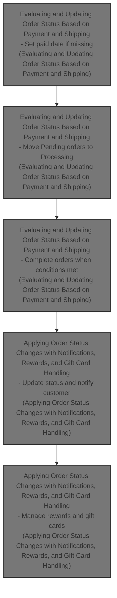

This document explains the flow of managing order status updates based on payment and shipping conditions within the order lifecycle. It receives an order as input and updates its status accordingly, applying notifications, reward points, and gift card handling as needed.

The main steps are:

- Set the paid date if missing when payment is confirmed
- Move orders from Pending to Processing based on payment or shipping progress
- Complete orders when payment is confirmed and shipping conditions are satisfied
- Apply status changes with notifications and order notes
- Handle reward points and gift card activation or deactivation



# Where is this flow used?

This flow is used multiple times in the codebase as represented in the following diagram:

(Note - these are only some of the entry points of this flow)

```mermaid
graph TD;
      4050016b4173fe19f415fdba7c31851affea85e93ef23617f54264f5789eefe4(src/…/Controllers/CheckoutController.cs::CheckoutController.ConfirmOrder) --> 279ea30ea3c3f128b61ceca4550d25ec736b049c362f70d31fe2afb614d81825(src/…/Orders/OrderProcessingService.cs::OrderProcessingService.PlaceOrderAsync)

279ea30ea3c3f128b61ceca4550d25ec736b049c362f70d31fe2afb614d81825(src/…/Orders/OrderProcessingService.cs::OrderProcessingService.PlaceOrderAsync) --> 6fc3201e59c3f3bc8f702870d292cfc5a8acba4575a8bcacef02981f0f4ee607(src/…/Orders/OrderProcessingService.cs::OrderProcessingService.CheckOrderStatusAsync)

a8d40e6ac925726e3fba2dc0cb05aa6f1779beb492a9ca82b323d2d736803be5(src/…/Controllers/CheckoutController.cs::CheckoutController.OpcConfirmOrder) --> 279ea30ea3c3f128b61ceca4550d25ec736b049c362f70d31fe2afb614d81825(src/…/Orders/OrderProcessingService.cs::OrderProcessingService.PlaceOrderAsync)

41732da589b3a15edeaed7259af50dc7796645c5ffc247b534a1a62074f33eda(src/…/Controllers/OrderController.cs::OrderController.PartiallyRefundOrderPopup) --> 99f38abbbc1cf58c749bcc6d459beee2edffb79365c40e00c75ce526beef6e08(src/…/Orders/OrderProcessingService.cs::OrderProcessingService.PartiallyRefundAsync)

41732da589b3a15edeaed7259af50dc7796645c5ffc247b534a1a62074f33eda(src/…/Controllers/OrderController.cs::OrderController.PartiallyRefundOrderPopup) --> 4b3b85e0885f49636c47132ffbe3d5ff04aee6f8640491ba2a0682928c3c90b8(src/…/Orders/OrderProcessingService.cs::OrderProcessingService.PartiallyRefundOfflineAsync)

99f38abbbc1cf58c749bcc6d459beee2edffb79365c40e00c75ce526beef6e08(src/…/Orders/OrderProcessingService.cs::OrderProcessingService.PartiallyRefundAsync) --> f956c760fb1af7e91afafdf5588903664a5174db8b4c3189534d2c01932b2b63(src/…/Orders/OrderProcessingService.cs::OrderProcessingService.RefundAsync)

99f38abbbc1cf58c749bcc6d459beee2edffb79365c40e00c75ce526beef6e08(src/…/Orders/OrderProcessingService.cs::OrderProcessingService.PartiallyRefundAsync) --> 6fc3201e59c3f3bc8f702870d292cfc5a8acba4575a8bcacef02981f0f4ee607(src/…/Orders/OrderProcessingService.cs::OrderProcessingService.CheckOrderStatusAsync)

f956c760fb1af7e91afafdf5588903664a5174db8b4c3189534d2c01932b2b63(src/…/Orders/OrderProcessingService.cs::OrderProcessingService.RefundAsync) --> 6fc3201e59c3f3bc8f702870d292cfc5a8acba4575a8bcacef02981f0f4ee607(src/…/Orders/OrderProcessingService.cs::OrderProcessingService.CheckOrderStatusAsync)

4b3b85e0885f49636c47132ffbe3d5ff04aee6f8640491ba2a0682928c3c90b8(src/…/Orders/OrderProcessingService.cs::OrderProcessingService.PartiallyRefundOfflineAsync) --> 6fc3201e59c3f3bc8f702870d292cfc5a8acba4575a8bcacef02981f0f4ee607(src/…/Orders/OrderProcessingService.cs::OrderProcessingService.CheckOrderStatusAsync)

696f273cd9d8ac825ea1c2a40e37443fa642836240b269442d8a3f9c0f2a63be(src/…/Controllers/OrderController.cs::OrderController.CaptureOrder) --> b7aa8d9c496c7371c883534bd1dfcce0844cf9f21d5123e6ca0c0405bc2cb002(src/…/Orders/OrderProcessingService.cs::OrderProcessingService.CaptureAsync)

b7aa8d9c496c7371c883534bd1dfcce0844cf9f21d5123e6ca0c0405bc2cb002(src/…/Orders/OrderProcessingService.cs::OrderProcessingService.CaptureAsync) --> 6fc3201e59c3f3bc8f702870d292cfc5a8acba4575a8bcacef02981f0f4ee607(src/…/Orders/OrderProcessingService.cs::OrderProcessingService.CheckOrderStatusAsync)

f39a49fa47b5f1bc92c335e7c6f962d630f284bba2bf688d430cbd54513371b6(src/…/Controllers/OrderController.cs::OrderController.MarkOrderAsPaid) --> 3fd7fd5bbc097de99dfd9b7c6a6f25b4ccd492e5bc79a93f589bbba2ce110ab0(src/…/Orders/OrderProcessingService.cs::OrderProcessingService.MarkOrderAsPaidAsync)

3fd7fd5bbc097de99dfd9b7c6a6f25b4ccd492e5bc79a93f589bbba2ce110ab0(src/…/Orders/OrderProcessingService.cs::OrderProcessingService.MarkOrderAsPaidAsync) --> 6fc3201e59c3f3bc8f702870d292cfc5a8acba4575a8bcacef02981f0f4ee607(src/…/Orders/OrderProcessingService.cs::OrderProcessingService.CheckOrderStatusAsync)


classDef mainFlowStyle color:#000000,fill:#7CB9F4
classDef rootsStyle color:#000000,fill:#00FFF4
classDef Style1 color:#000000,fill:#00FFAA
classDef Style2 color:#000000,fill:#FFFF00
classDef Style3 color:#000000,fill:#AA7CB9

%% Swimm:
%% graph TD;
%%       4050016b4173fe19f415fdba7c31851affea85e93ef23617f54264f5789eefe4(<SwmPath>[src/…/Controllers/CheckoutController.cs](src/Presentation/Nop.Web/Controllers/CheckoutController.cs)</SwmPath>::CheckoutController.ConfirmOrder) --> 279ea30ea3c3f128b61ceca4550d25ec736b049c362f70d31fe2afb614d81825(<SwmPath>[src/…/Orders/OrderProcessingService.cs](src/Libraries/Nop.Services/Orders/OrderProcessingService.cs)</SwmPath>::OrderProcessingService.PlaceOrderAsync)
%% 
%% 279ea30ea3c3f128b61ceca4550d25ec736b049c362f70d31fe2afb614d81825(<SwmPath>[src/…/Orders/OrderProcessingService.cs](src/Libraries/Nop.Services/Orders/OrderProcessingService.cs)</SwmPath>::OrderProcessingService.PlaceOrderAsync) --> 6fc3201e59c3f3bc8f702870d292cfc5a8acba4575a8bcacef02981f0f4ee607(<SwmPath>[src/…/Orders/OrderProcessingService.cs](src/Libraries/Nop.Services/Orders/OrderProcessingService.cs)</SwmPath>::OrderProcessingService.CheckOrderStatusAsync)
%% 
%% a8d40e6ac925726e3fba2dc0cb05aa6f1779beb492a9ca82b323d2d736803be5(<SwmPath>[src/…/Controllers/CheckoutController.cs](src/Presentation/Nop.Web/Controllers/CheckoutController.cs)</SwmPath>::CheckoutController.OpcConfirmOrder) --> 279ea30ea3c3f128b61ceca4550d25ec736b049c362f70d31fe2afb614d81825(<SwmPath>[src/…/Orders/OrderProcessingService.cs](src/Libraries/Nop.Services/Orders/OrderProcessingService.cs)</SwmPath>::OrderProcessingService.PlaceOrderAsync)
%% 
%% 41732da589b3a15edeaed7259af50dc7796645c5ffc247b534a1a62074f33eda(<SwmPath>[src/…/Controllers/OrderController.cs](src/Presentation/Nop.Web/Areas/Admin/Controllers/OrderController.cs)</SwmPath>::OrderController.PartiallyRefundOrderPopup) --> 99f38abbbc1cf58c749bcc6d459beee2edffb79365c40e00c75ce526beef6e08(<SwmPath>[src/…/Orders/OrderProcessingService.cs](src/Libraries/Nop.Services/Orders/OrderProcessingService.cs)</SwmPath>::OrderProcessingService.PartiallyRefundAsync)
%% 
%% 41732da589b3a15edeaed7259af50dc7796645c5ffc247b534a1a62074f33eda(<SwmPath>[src/…/Controllers/OrderController.cs](src/Presentation/Nop.Web/Areas/Admin/Controllers/OrderController.cs)</SwmPath>::OrderController.PartiallyRefundOrderPopup) --> 4b3b85e0885f49636c47132ffbe3d5ff04aee6f8640491ba2a0682928c3c90b8(<SwmPath>[src/…/Orders/OrderProcessingService.cs](src/Libraries/Nop.Services/Orders/OrderProcessingService.cs)</SwmPath>::OrderProcessingService.PartiallyRefundOfflineAsync)
%% 
%% 99f38abbbc1cf58c749bcc6d459beee2edffb79365c40e00c75ce526beef6e08(<SwmPath>[src/…/Orders/OrderProcessingService.cs](src/Libraries/Nop.Services/Orders/OrderProcessingService.cs)</SwmPath>::OrderProcessingService.PartiallyRefundAsync) --> f956c760fb1af7e91afafdf5588903664a5174db8b4c3189534d2c01932b2b63(<SwmPath>[src/…/Orders/OrderProcessingService.cs](src/Libraries/Nop.Services/Orders/OrderProcessingService.cs)</SwmPath>::OrderProcessingService.RefundAsync)
%% 
%% 99f38abbbc1cf58c749bcc6d459beee2edffb79365c40e00c75ce526beef6e08(<SwmPath>[src/…/Orders/OrderProcessingService.cs](src/Libraries/Nop.Services/Orders/OrderProcessingService.cs)</SwmPath>::OrderProcessingService.PartiallyRefundAsync) --> 6fc3201e59c3f3bc8f702870d292cfc5a8acba4575a8bcacef02981f0f4ee607(<SwmPath>[src/…/Orders/OrderProcessingService.cs](src/Libraries/Nop.Services/Orders/OrderProcessingService.cs)</SwmPath>::OrderProcessingService.CheckOrderStatusAsync)
%% 
%% f956c760fb1af7e91afafdf5588903664a5174db8b4c3189534d2c01932b2b63(<SwmPath>[src/…/Orders/OrderProcessingService.cs](src/Libraries/Nop.Services/Orders/OrderProcessingService.cs)</SwmPath>::OrderProcessingService.RefundAsync) --> 6fc3201e59c3f3bc8f702870d292cfc5a8acba4575a8bcacef02981f0f4ee607(<SwmPath>[src/…/Orders/OrderProcessingService.cs](src/Libraries/Nop.Services/Orders/OrderProcessingService.cs)</SwmPath>::OrderProcessingService.CheckOrderStatusAsync)
%% 
%% 4b3b85e0885f49636c47132ffbe3d5ff04aee6f8640491ba2a0682928c3c90b8(<SwmPath>[src/…/Orders/OrderProcessingService.cs](src/Libraries/Nop.Services/Orders/OrderProcessingService.cs)</SwmPath>::OrderProcessingService.PartiallyRefundOfflineAsync) --> 6fc3201e59c3f3bc8f702870d292cfc5a8acba4575a8bcacef02981f0f4ee607(<SwmPath>[src/…/Orders/OrderProcessingService.cs](src/Libraries/Nop.Services/Orders/OrderProcessingService.cs)</SwmPath>::OrderProcessingService.CheckOrderStatusAsync)
%% 
%% 696f273cd9d8ac825ea1c2a40e37443fa642836240b269442d8a3f9c0f2a63be(<SwmPath>[src/…/Controllers/OrderController.cs](src/Presentation/Nop.Web/Areas/Admin/Controllers/OrderController.cs)</SwmPath>::OrderController.CaptureOrder) --> b7aa8d9c496c7371c883534bd1dfcce0844cf9f21d5123e6ca0c0405bc2cb002(<SwmPath>[src/…/Orders/OrderProcessingService.cs](src/Libraries/Nop.Services/Orders/OrderProcessingService.cs)</SwmPath>::OrderProcessingService.CaptureAsync)
%% 
%% b7aa8d9c496c7371c883534bd1dfcce0844cf9f21d5123e6ca0c0405bc2cb002(<SwmPath>[src/…/Orders/OrderProcessingService.cs](src/Libraries/Nop.Services/Orders/OrderProcessingService.cs)</SwmPath>::OrderProcessingService.CaptureAsync) --> 6fc3201e59c3f3bc8f702870d292cfc5a8acba4575a8bcacef02981f0f4ee607(<SwmPath>[src/…/Orders/OrderProcessingService.cs](src/Libraries/Nop.Services/Orders/OrderProcessingService.cs)</SwmPath>::OrderProcessingService.CheckOrderStatusAsync)
%% 
%% f39a49fa47b5f1bc92c335e7c6f962d630f284bba2bf688d430cbd54513371b6(<SwmPath>[src/…/Controllers/OrderController.cs](src/Presentation/Nop.Web/Areas/Admin/Controllers/OrderController.cs)</SwmPath>::OrderController.MarkOrderAsPaid) --> 3fd7fd5bbc097de99dfd9b7c6a6f25b4ccd492e5bc79a93f589bbba2ce110ab0(<SwmPath>[src/…/Orders/OrderProcessingService.cs](src/Libraries/Nop.Services/Orders/OrderProcessingService.cs)</SwmPath>::OrderProcessingService.MarkOrderAsPaidAsync)
%% 
%% 3fd7fd5bbc097de99dfd9b7c6a6f25b4ccd492e5bc79a93f589bbba2ce110ab0(<SwmPath>[src/…/Orders/OrderProcessingService.cs](src/Libraries/Nop.Services/Orders/OrderProcessingService.cs)</SwmPath>::OrderProcessingService.MarkOrderAsPaidAsync) --> 6fc3201e59c3f3bc8f702870d292cfc5a8acba4575a8bcacef02981f0f4ee607(<SwmPath>[src/…/Orders/OrderProcessingService.cs](src/Libraries/Nop.Services/Orders/OrderProcessingService.cs)</SwmPath>::OrderProcessingService.CheckOrderStatusAsync)
%% 
%% 
%% classDef mainFlowStyle color:#000000,fill:#7CB9F4
%% classDef rootsStyle color:#000000,fill:#00FFF4
%% classDef Style1 color:#000000,fill:#00FFAA
%% classDef Style2 color:#000000,fill:#FFFF00
%% classDef Style3 color:#000000,fill:#AA7CB9
```



# Evaluating and Updating Order Status Based on Payment and Shipping

```mermaid
%%{init: {"flowchart": {"defaultRenderer": "elk"}} }%%
flowchart TD
    node1{"Is order paid but missing paid date?"}
    click node1 openCode "src/Libraries/Nop.Services/Orders/OrderProcessingService.cs:1514:1519"
    node1 -->|"Yes"| node2["Set paid date and update order"]
    click node2 openCode "src/Libraries/Nop.Services/Orders/OrderProcessingService.cs:1516:1519"
    node1 -->|"No"| node3
    node3{"Is order status Pending?"}
    click node3 openCode "src/Libraries/Nop.Services/Orders/OrderProcessingService.cs:1521:1533"
    node3 -->|"Yes"| node4{"Is payment Authorized or Paid?"}
    click node4 openCode "src/Libraries/Nop.Services/Orders/OrderProcessingService.cs:1524:1526"
    node4 -->|"Yes"| node5["Set order status to Processing"]
    click node5 openCode "src/Libraries/Nop.Services/Orders/OrderProcessingService.cs:1526"
    node4 -->|"No"| node6["Continue"]
    node3 -->|"No"| node7{"Is order status Cancelled or Complete?"}
    click node7 openCode "src/Libraries/Nop.Services/Orders/OrderProcessingService.cs:1535:1537"
    node7 -->|"Yes"| node8["End process"]
    node7 -->|"No"| node9
    node9{"Is payment status Paid?"}
    click node9 openCode "src/Libraries/Nop.Services/Orders/OrderProcessingService.cs:1540:1541"
    node9 -->|"No"| node8
    node9 -->|"Yes"| node10{"Is shipping required?"}
    click node10 openCode "src/Libraries/Nop.Services/Orders/OrderProcessingService.cs:1545:1550"
    node10 -->|"No"| node11["Mark order as completed"]
    click node11 openCode "src/Libraries/Nop.Services/Orders/OrderProcessingService.cs:1547:1549"
    node10 -->|"Yes"| node12{"Is CompleteOrderWhenDelivered setting enabled?"}
    click node12 openCode "src/Libraries/Nop.Services/Orders/OrderProcessingService.cs:1553:1557"
    node12 -->|"Yes"| node13{"Is shipping status Delivered?"}
    click node13 openCode "src/Libraries/Nop.Services/Orders/OrderProcessingService.cs:1554:1557"
    node13 -->|"Yes"| node11
    node13 -->|"No"| node14["Order not completed"]
    click node14 openCode "src/Libraries/Nop.Services/Orders/OrderProcessingService.cs:1557:1558"
    node12 -->|"No"| node15{"Is shipping status Shipped or Delivered?"}
    click node15 openCode "src/Libraries/Nop.Services/Orders/OrderProcessingService.cs:1556:1558"
    node15 -->|"Yes"| node11
    node15 -->|"No"| node14
    node11 --> node16["Set order status to Complete"]
    click node16 openCode "src/Libraries/Nop.Services/Orders/OrderProcessingService.cs:1560:1561"
    node16 --> node8
classDef HeadingStyle fill:#777777,stroke:#333,stroke-width:2px;

%% Swimm:
%% %%{init: {"flowchart": {"defaultRenderer": "elk"}} }%%
%% flowchart TD
%%     node1{"Is order paid but missing paid date?"}
%%     click node1 openCode "<SwmPath>[src/…/Orders/OrderProcessingService.cs](src/Libraries/Nop.Services/Orders/OrderProcessingService.cs)</SwmPath>:1514:1519"
%%     node1 -->|"Yes"| node2["Set paid date and update order"]
%%     click node2 openCode "<SwmPath>[src/…/Orders/OrderProcessingService.cs](src/Libraries/Nop.Services/Orders/OrderProcessingService.cs)</SwmPath>:1516:1519"
%%     node1 -->|"No"| node3
%%     node3{"Is order status Pending?"}
%%     click node3 openCode "<SwmPath>[src/…/Orders/OrderProcessingService.cs](src/Libraries/Nop.Services/Orders/OrderProcessingService.cs)</SwmPath>:1521:1533"
%%     node3 -->|"Yes"| node4{"Is payment Authorized or Paid?"}
%%     click node4 openCode "<SwmPath>[src/…/Orders/OrderProcessingService.cs](src/Libraries/Nop.Services/Orders/OrderProcessingService.cs)</SwmPath>:1524:1526"
%%     node4 -->|"Yes"| node5["Set order status to Processing"]
%%     click node5 openCode "<SwmPath>[src/…/Orders/OrderProcessingService.cs](src/Libraries/Nop.Services/Orders/OrderProcessingService.cs)</SwmPath>:1526"
%%     node4 -->|"No"| node6["Continue"]
%%     node3 -->|"No"| node7{"Is order status Cancelled or Complete?"}
%%     click node7 openCode "<SwmPath>[src/…/Orders/OrderProcessingService.cs](src/Libraries/Nop.Services/Orders/OrderProcessingService.cs)</SwmPath>:1535:1537"
%%     node7 -->|"Yes"| node8["End process"]
%%     node7 -->|"No"| node9
%%     node9{"Is payment status Paid?"}
%%     click node9 openCode "<SwmPath>[src/…/Orders/OrderProcessingService.cs](src/Libraries/Nop.Services/Orders/OrderProcessingService.cs)</SwmPath>:1540:1541"
%%     node9 -->|"No"| node8
%%     node9 -->|"Yes"| node10{"Is shipping required?"}
%%     click node10 openCode "<SwmPath>[src/…/Orders/OrderProcessingService.cs](src/Libraries/Nop.Services/Orders/OrderProcessingService.cs)</SwmPath>:1545:1550"
%%     node10 -->|"No"| node11["Mark order as completed"]
%%     click node11 openCode "<SwmPath>[src/…/Orders/OrderProcessingService.cs](src/Libraries/Nop.Services/Orders/OrderProcessingService.cs)</SwmPath>:1547:1549"
%%     node10 -->|"Yes"| node12{"Is <SwmToken path="src/Libraries/Nop.Services/Orders/OrderProcessingService.cs" pos="1553:6:6" line-data="                if (_orderSettings.CompleteOrderWhenDelivered)">`CompleteOrderWhenDelivered`</SwmToken> setting enabled?"}
%%     click node12 openCode "<SwmPath>[src/…/Orders/OrderProcessingService.cs](src/Libraries/Nop.Services/Orders/OrderProcessingService.cs)</SwmPath>:1553:1557"
%%     node12 -->|"Yes"| node13{"Is shipping status Delivered?"}
%%     click node13 openCode "<SwmPath>[src/…/Orders/OrderProcessingService.cs](src/Libraries/Nop.Services/Orders/OrderProcessingService.cs)</SwmPath>:1554:1557"
%%     node13 -->|"Yes"| node11
%%     node13 -->|"No"| node14["Order not completed"]
%%     click node14 openCode "<SwmPath>[src/…/Orders/OrderProcessingService.cs](src/Libraries/Nop.Services/Orders/OrderProcessingService.cs)</SwmPath>:1557:1558"
%%     node12 -->|"No"| node15{"Is shipping status Shipped or Delivered?"}
%%     click node15 openCode "<SwmPath>[src/…/Orders/OrderProcessingService.cs](src/Libraries/Nop.Services/Orders/OrderProcessingService.cs)</SwmPath>:1556:1558"
%%     node15 -->|"Yes"| node11
%%     node15 -->|"No"| node14
%%     node11 --> node16["Set order status to Complete"]
%%     click node16 openCode "<SwmPath>[src/…/Orders/OrderProcessingService.cs](src/Libraries/Nop.Services/Orders/OrderProcessingService.cs)</SwmPath>:1560:1561"
%%     node16 --> node8
%% classDef HeadingStyle fill:#777777,stroke:#333,stroke-width:2px;
```



This section evaluates and updates the order status based on payment and shipping conditions to ensure accurate order lifecycle management.

| Category       | Rule Name                           | Description                                                                                                                                                                                                                                                                                                                                                      |
| -------------- | ----------------------------------- | ---------------------------------------------------------------------------------------------------------------------------------------------------------------------------------------------------------------------------------------------------------------------------------------------------------------------------------------------------------------- |
| Business logic | Set paid date for paid orders       | If an order is marked as paid but does not have a paid date, the system must set the paid date to the current date and time.                                                                                                                                                                                                                                     |
| Business logic | Pending to Processing on payment    | If an order status is Pending and the payment status is Authorized or Paid, the order status must be updated to Processing.                                                                                                                                                                                                                                      |
| Business logic | Pending to Processing on shipping   | If an order status is Pending and the shipping status is Partially Shipped, Shipped, or Delivered, the order status must be updated to Processing.                                                                                                                                                                                                               |
| Business logic | No update for Cancelled or Complete | If an order status is Cancelled or Complete, no further status updates should be performed.                                                                                                                                                                                                                                                                      |
| Business logic | Complete only if paid               | If the payment status is not Paid, the order status should not be updated to Complete.                                                                                                                                                                                                                                                                           |
| Business logic | Complete orders without shipping    | If shipping is not required for the order, the order can be marked as Complete once payment is confirmed.                                                                                                                                                                                                                                                        |
| Business logic | Complete on delivery setting        | If shipping is required and the setting <SwmToken path="src/Libraries/Nop.Services/Orders/OrderProcessingService.cs" pos="1553:6:6" line-data="                if (_orderSettings.CompleteOrderWhenDelivered)">`CompleteOrderWhenDelivered`</SwmToken> is enabled, the order can be marked as Complete only when the shipping status is Delivered.               |
| Business logic | Complete on shipped or delivered    | If shipping is required and the setting <SwmToken path="src/Libraries/Nop.Services/Orders/OrderProcessingService.cs" pos="1553:6:6" line-data="                if (_orderSettings.CompleteOrderWhenDelivered)">`CompleteOrderWhenDelivered`</SwmToken> is disabled, the order can be marked as Complete when the shipping status is either Shipped or Delivered. |

<SwmSnippet path="/src/Libraries/Nop.Services/Orders/OrderProcessingService.cs" line="1509">

---

<SwmToken path="src/Libraries/Nop.Services/Orders/OrderProcessingService.cs" pos="1509:9:9" line-data="        public virtual async Task CheckOrderStatusAsync(Order order)">`CheckOrderStatusAsync`</SwmToken> sets the paid date if missing, moves Pending orders to Processing when payment or shipping progresses, and marks orders Complete when shipping conditions meet configured rules, using <SwmToken path="src/Libraries/Nop.Services/Orders/OrderProcessingService.cs" pos="1526:3:3" line-data="                        await SetOrderStatusAsync(order, OrderStatus.Processing, false);">`SetOrderStatusAsync`</SwmToken> to apply status changes.

```c#
        public virtual async Task CheckOrderStatusAsync(Order order)
        {
            if (order == null)
                throw new ArgumentNullException(nameof(order));

            if (order.PaymentStatus == PaymentStatus.Paid && !order.PaidDateUtc.HasValue)
            {
                //ensure that paid date is set
                order.PaidDateUtc = DateTime.UtcNow;
                await _orderService.UpdateOrderAsync(order);
            }

            switch (order.OrderStatus)
            {
                case OrderStatus.Pending:
                    if (order.PaymentStatus == PaymentStatus.Authorized ||
                        order.PaymentStatus == PaymentStatus.Paid)
                        await SetOrderStatusAsync(order, OrderStatus.Processing, false);

                    if (order.ShippingStatus == ShippingStatus.PartiallyShipped ||
                        order.ShippingStatus == ShippingStatus.Shipped ||
                        order.ShippingStatus == ShippingStatus.Delivered)
                        await SetOrderStatusAsync(order, OrderStatus.Processing, false);

                    break;
                //is order complete?
                case OrderStatus.Cancelled:
                case OrderStatus.Complete:
                    return;
            }

            if (order.PaymentStatus != PaymentStatus.Paid)
                return;

            bool completed;

            if (order.ShippingStatus == ShippingStatus.ShippingNotRequired)
            {
                //shipping is not required
                completed = true;
            }
            else
            {
                //shipping is required
                if (_orderSettings.CompleteOrderWhenDelivered)
                    completed = order.ShippingStatus == ShippingStatus.Delivered;
                else
                    completed = order.ShippingStatus == ShippingStatus.Shipped ||
                                order.ShippingStatus == ShippingStatus.Delivered;
            }

            if (completed) 
                await SetOrderStatusAsync(order, OrderStatus.Complete, true);
        }
```

---

</SwmSnippet>

# Applying Order Status Changes with Notifications, Rewards, and Gift Card Handling

```mermaid
%%{init: {"flowchart": {"defaultRenderer": "elk"}} }%%
flowchart TD
    node1["Start: Receive order and new status"] --> node2{"Is new status different from current?"}
    click node1 openCode "src/Libraries/Nop.Services/Orders/OrderProcessingService.cs:1061:1068"
    node2 -->|"No"| node3["End: No changes made"]
    click node2 openCode "src/Libraries/Nop.Services/Orders/OrderProcessingService.cs:1067:1068"
    node2 -->|"Yes"| node4["Update order status and save"]
    click node4 openCode "src/Libraries/Nop.Services/Orders/OrderProcessingService.cs:1071:1072"
    node4 --> node5["Add order note about status change"]
    click node5 openCode "src/Libraries/Nop.Services/Orders/OrderProcessingService.cs:1075:1076"
    node5 --> node6{"Is status changed to Complete and notifyCustomer?"}
    click node6 openCode "src/Libraries/Nop.Services/Orders/OrderProcessingService.cs:1077:1080"
    node6 -->|"Yes"| node7["Send order completed notification with optional PDF"]
    click node7 openCode "src/Libraries/Nop.Services/Orders/OrderProcessingService.cs:1082:1091"
    node7 --> node8["Add note about notification"]
    click node8 openCode "src/Libraries/Nop.Services/Orders/OrderProcessingService.cs:1090:1091"
    node6 -->|"No"| node8
    node8 --> node9{"Is status changed to Cancelled and notifyCustomer?"}
    click node9 openCode "src/Libraries/Nop.Services/Orders/OrderProcessingService.cs:1093:1101"
    node9 -->|"Yes"| node10["Send order cancelled notification"]
    click node10 openCode "src/Libraries/Nop.Services/Orders/OrderProcessingService.cs:1097:1101"
    node10 --> node11["Add note about notification"]
    click node11 openCode "src/Libraries/Nop.Services/Orders/OrderProcessingService.cs:1100:1101"
    node9 -->|"No"| node11
    node11 --> node12{"Is status Complete?"}
    click node12 openCode "src/Libraries/Nop.Services/Orders/OrderProcessingService.cs:1104:1105"
    node12 -->|"Yes"| node13["Award reward points"]
    click node13 openCode "src/Libraries/Nop.Services/Orders/OrderProcessingService.cs:1104:1105"
    node12 -->|"No"| node14{"Is status Cancelled?"}
    click node14 openCode "src/Libraries/Nop.Services/Orders/OrderProcessingService.cs:1107:1108"
    node14 -->|"Yes"| node15["Reduce reward points"]
    click node15 openCode "src/Libraries/Nop.Services/Orders/OrderProcessingService.cs:1107:1108"
    node14 -->|"No"| node16["Check gift card activation/deactivation"]
    node13 --> node16
    node15 --> node16
    node16 --> node17{"Activate gift cards after completing order?"}
    click node16 openCode "src/Libraries/Nop.Services/Orders/OrderProcessingService.cs:1111:1112"
    node17 -->|"Yes"| node18["Activate gift cards"]
    click node17 openCode "src/Libraries/Nop.Services/Orders/OrderProcessingService.cs:1111:1112"
    node17 -->|"No"| node19{"Deactivate gift cards after cancelling order?"}
    click node19 openCode "src/Libraries/Nop.Services/Orders/OrderProcessingService.cs:1115:1116"
    node19 -->|"Yes"| node20["Deactivate gift cards"]
    click node20 openCode "src/Libraries/Nop.Services/Orders/OrderProcessingService.cs:1115:1116"
    node19 -->|"No"| node21["End of process"]
    node18 --> node21
    node20 --> node21
classDef HeadingStyle fill:#777777,stroke:#333,stroke-width:2px;

%% Swimm:
%% %%{init: {"flowchart": {"defaultRenderer": "elk"}} }%%
%% flowchart TD
%%     node1["Start: Receive order and new status"] --> node2{"Is new status different from current?"}
%%     click node1 openCode "<SwmPath>[src/…/Orders/OrderProcessingService.cs](src/Libraries/Nop.Services/Orders/OrderProcessingService.cs)</SwmPath>:1061:1068"
%%     node2 -->|"No"| node3["End: No changes made"]
%%     click node2 openCode "<SwmPath>[src/…/Orders/OrderProcessingService.cs](src/Libraries/Nop.Services/Orders/OrderProcessingService.cs)</SwmPath>:1067:1068"
%%     node2 -->|"Yes"| node4["Update order status and save"]
%%     click node4 openCode "<SwmPath>[src/…/Orders/OrderProcessingService.cs](src/Libraries/Nop.Services/Orders/OrderProcessingService.cs)</SwmPath>:1071:1072"
%%     node4 --> node5["Add order note about status change"]
%%     click node5 openCode "<SwmPath>[src/…/Orders/OrderProcessingService.cs](src/Libraries/Nop.Services/Orders/OrderProcessingService.cs)</SwmPath>:1075:1076"
%%     node5 --> node6{"Is status changed to Complete and <SwmToken path="src/Libraries/Nop.Services/Orders/OrderProcessingService.cs" pos="1061:23:23" line-data="        protected virtual async Task SetOrderStatusAsync(Order order, OrderStatus os, bool notifyCustomer)">`notifyCustomer`</SwmToken>?"}
%%     click node6 openCode "<SwmPath>[src/…/Orders/OrderProcessingService.cs](src/Libraries/Nop.Services/Orders/OrderProcessingService.cs)</SwmPath>:1077:1080"
%%     node6 -->|"Yes"| node7["Send order completed notification with optional PDF"]
%%     click node7 openCode "<SwmPath>[src/…/Orders/OrderProcessingService.cs](src/Libraries/Nop.Services/Orders/OrderProcessingService.cs)</SwmPath>:1082:1091"
%%     node7 --> node8["Add note about notification"]
%%     click node8 openCode "<SwmPath>[src/…/Orders/OrderProcessingService.cs](src/Libraries/Nop.Services/Orders/OrderProcessingService.cs)</SwmPath>:1090:1091"
%%     node6 -->|"No"| node8
%%     node8 --> node9{"Is status changed to Cancelled and <SwmToken path="src/Libraries/Nop.Services/Orders/OrderProcessingService.cs" pos="1061:23:23" line-data="        protected virtual async Task SetOrderStatusAsync(Order order, OrderStatus os, bool notifyCustomer)">`notifyCustomer`</SwmToken>?"}
%%     click node9 openCode "<SwmPath>[src/…/Orders/OrderProcessingService.cs](src/Libraries/Nop.Services/Orders/OrderProcessingService.cs)</SwmPath>:1093:1101"
%%     node9 -->|"Yes"| node10["Send order cancelled notification"]
%%     click node10 openCode "<SwmPath>[src/…/Orders/OrderProcessingService.cs](src/Libraries/Nop.Services/Orders/OrderProcessingService.cs)</SwmPath>:1097:1101"
%%     node10 --> node11["Add note about notification"]
%%     click node11 openCode "<SwmPath>[src/…/Orders/OrderProcessingService.cs](src/Libraries/Nop.Services/Orders/OrderProcessingService.cs)</SwmPath>:1100:1101"
%%     node9 -->|"No"| node11
%%     node11 --> node12{"Is status Complete?"}
%%     click node12 openCode "<SwmPath>[src/…/Orders/OrderProcessingService.cs](src/Libraries/Nop.Services/Orders/OrderProcessingService.cs)</SwmPath>:1104:1105"
%%     node12 -->|"Yes"| node13["Award reward points"]
%%     click node13 openCode "<SwmPath>[src/…/Orders/OrderProcessingService.cs](src/Libraries/Nop.Services/Orders/OrderProcessingService.cs)</SwmPath>:1104:1105"
%%     node12 -->|"No"| node14{"Is status Cancelled?"}
%%     click node14 openCode "<SwmPath>[src/…/Orders/OrderProcessingService.cs](src/Libraries/Nop.Services/Orders/OrderProcessingService.cs)</SwmPath>:1107:1108"
%%     node14 -->|"Yes"| node15["Reduce reward points"]
%%     click node15 openCode "<SwmPath>[src/…/Orders/OrderProcessingService.cs](src/Libraries/Nop.Services/Orders/OrderProcessingService.cs)</SwmPath>:1107:1108"
%%     node14 -->|"No"| node16["Check gift card activation/deactivation"]
%%     node13 --> node16
%%     node15 --> node16
%%     node16 --> node17{"Activate gift cards after completing order?"}
%%     click node16 openCode "<SwmPath>[src/…/Orders/OrderProcessingService.cs](src/Libraries/Nop.Services/Orders/OrderProcessingService.cs)</SwmPath>:1111:1112"
%%     node17 -->|"Yes"| node18["Activate gift cards"]
%%     click node17 openCode "<SwmPath>[src/…/Orders/OrderProcessingService.cs](src/Libraries/Nop.Services/Orders/OrderProcessingService.cs)</SwmPath>:1111:1112"
%%     node17 -->|"No"| node19{"Deactivate gift cards after cancelling order?"}
%%     click node19 openCode "<SwmPath>[src/…/Orders/OrderProcessingService.cs](src/Libraries/Nop.Services/Orders/OrderProcessingService.cs)</SwmPath>:1115:1116"
%%     node19 -->|"Yes"| node20["Deactivate gift cards"]
%%     click node20 openCode "<SwmPath>[src/…/Orders/OrderProcessingService.cs](src/Libraries/Nop.Services/Orders/OrderProcessingService.cs)</SwmPath>:1115:1116"
%%     node19 -->|"No"| node21["End of process"]
%%     node18 --> node21
%%     node20 --> node21
%% classDef HeadingStyle fill:#777777,stroke:#333,stroke-width:2px;
```



This section manages the process of applying order status changes, including sending notifications, handling reward points, and managing gift card activation or deactivation.

| Category       | Rule Name                                            | Description                                                                                                                                                  |
| -------------- | ---------------------------------------------------- | ------------------------------------------------------------------------------------------------------------------------------------------------------------ |
| Business logic | Notify on order completion                           | When an order status changes to Complete and customer notifications are enabled, send a completion notification email with an optional PDF invoice attached. |
| Business logic | Notify on order cancellation                         | When an order status changes to Cancelled and customer notifications are enabled, send a cancellation notification email to the customer.                    |
| Business logic | Add order notes for status changes and notifications | Every order status change and notification sent must be recorded as an order note for audit and tracking purposes.                                           |
| Business logic | Award reward points on completion                    | When an order status changes to Complete, reward points are awarded to the customer based on the order.                                                      |
| Business logic | Reduce reward points on cancellation                 | When an order status changes to Cancelled, previously awarded reward points related to the order are reduced or revoked.                                     |
| Business logic | Activate gift cards on order completion              | If configured, gift cards purchased in the order are activated automatically when the order status changes to Complete.                                      |
| Business logic | Deactivate gift cards on order cancellation          | If configured, gift cards purchased in the order are deactivated automatically when the order status changes to Cancelled.                                   |

<SwmSnippet path="/src/Libraries/Nop.Services/Orders/OrderProcessingService.cs" line="1061">

---

In <SwmToken path="src/Libraries/Nop.Services/Orders/OrderProcessingService.cs" pos="1061:9:9" line-data="        protected virtual async Task SetOrderStatusAsync(Order order, OrderStatus os, bool notifyCustomer)">`SetOrderStatusAsync`</SwmToken>, we first check if the order status actually changes to avoid redundant work. Then we update the status and save it. We add a note about the change and, if the status changes to Complete and notifications are enabled, we generate a PDF invoice by calling PdfService.PrintOrderToPdfAsync and send a completion email with the PDF attached if configured.

```c#
        protected virtual async Task SetOrderStatusAsync(Order order, OrderStatus os, bool notifyCustomer)
        {
            if (order == null)
                throw new ArgumentNullException(nameof(order));

            var prevOrderStatus = order.OrderStatus;
            if (prevOrderStatus == os)
                return;

            //set and save new order status
            order.OrderStatusId = (int)os;
            await _orderService.UpdateOrderAsync(order);

            //order notes, notifications
            await AddOrderNoteAsync(order, $"Order status has been changed to {await _localizationService.GetLocalizedEnumAsync(os)}");

            if (prevOrderStatus != OrderStatus.Complete &&
                os == OrderStatus.Complete
                && notifyCustomer)
            {
                //notification
                var orderCompletedAttachmentFilePath = _orderSettings.AttachPdfInvoiceToOrderCompletedEmail ?
                    await _pdfService.PrintOrderToPdfAsync(order) : null;
                var orderCompletedAttachmentFileName = _orderSettings.AttachPdfInvoiceToOrderCompletedEmail ?
                    "order.pdf" : null;
                var orderCompletedCustomerNotificationQueuedEmailIds = await _workflowMessageService
                    .SendOrderCompletedCustomerNotificationAsync(order, order.CustomerLanguageId, orderCompletedAttachmentFilePath,
                    orderCompletedAttachmentFileName);
                if (orderCompletedCustomerNotificationQueuedEmailIds.Any())
                    await AddOrderNoteAsync(order, $"\"Order completed\" email (to customer) has been queued. Queued email identifiers: {string.Join(", ", orderCompletedCustomerNotificationQueuedEmailIds)}.");
            }

```

---

</SwmSnippet>

<SwmSnippet path="/src/Libraries/Nop.Services/Common/PdfService.cs" line="1217">

---

<SwmToken path="src/Libraries/Nop.Services/Common/PdfService.cs" pos="1217:12:12" line-data="        public virtual async Task&lt;string&gt; PrintOrderToPdfAsync(Order order, int languageId = 0, int vendorId = 0)">`PrintOrderToPdfAsync`</SwmToken> generates a unique file name with a random 4-digit code and saves the PDF in a specific export folder. It wraps the single order in a list to reuse the batch PDF printing method, assuming the order and file path are valid and accessible.

```c#
        public virtual async Task<string> PrintOrderToPdfAsync(Order order, int languageId = 0, int vendorId = 0)
        {
            if (order == null)
                throw new ArgumentNullException(nameof(order));

            var fileName = $"order_{order.OrderGuid}_{CommonHelper.GenerateRandomDigitCode(4)}.pdf";
            var filePath = _fileProvider.Combine(_fileProvider.MapPath("~/wwwroot/files/exportimport"), fileName);
            await using (var fileStream = new FileStream(filePath, FileMode.Create))
            {
                var orders = new List<Order> { order };
                await PrintOrdersToPdfAsync(fileStream, orders, languageId, vendorId);
            }

            return filePath;
        }
```

---

</SwmSnippet>

<SwmSnippet path="/src/Libraries/Nop.Services/Orders/OrderProcessingService.cs" line="1093">

---

After returning from <SwmToken path="src/Libraries/Nop.Services/Orders/OrderProcessingService.cs" pos="1083:5:5" line-data="                    await _pdfService.PrintOrderToPdfAsync(order) : null;">`PrintOrderToPdfAsync`</SwmToken>, <SwmToken path="src/Libraries/Nop.Services/Orders/OrderProcessingService.cs" pos="1061:9:9" line-data="        protected virtual async Task SetOrderStatusAsync(Order order, OrderStatus os, bool notifyCustomer)">`SetOrderStatusAsync`</SwmToken> continues by sending cancellation notifications if needed, then awards or reduces reward points based on the new status. It also activates or deactivates gift cards according to settings, wrapping up all side effects related to the status change.

```c#
            if (prevOrderStatus != OrderStatus.Cancelled &&
                os == OrderStatus.Cancelled
                && notifyCustomer)
            {
                //notification
                var orderCancelledCustomerNotificationQueuedEmailIds = await _workflowMessageService.SendOrderCancelledCustomerNotificationAsync(order, order.CustomerLanguageId);
                if (orderCancelledCustomerNotificationQueuedEmailIds.Any())
                    await AddOrderNoteAsync(order, $"\"Order cancelled\" email (to customer) has been queued. Queued email identifiers: {string.Join(", ", orderCancelledCustomerNotificationQueuedEmailIds)}.");
            }

            //reward points
            if (order.OrderStatus == OrderStatus.Complete) 
                await AwardRewardPointsAsync(order);

            if (order.OrderStatus == OrderStatus.Cancelled) 
                await ReduceRewardPointsAsync(order);

            //gift cards activation
            if (_orderSettings.ActivateGiftCardsAfterCompletingOrder && order.OrderStatus == OrderStatus.Complete) 
                await SetActivatedValueForPurchasedGiftCardsAsync(order, true);

            //gift cards deactivation
            if (_orderSettings.DeactivateGiftCardsAfterCancellingOrder && order.OrderStatus == OrderStatus.Cancelled) 
                await SetActivatedValueForPurchasedGiftCardsAsync(order, false);
        }
```

---

</SwmSnippet>

&nbsp;

*This is an auto-generated document by Swimm 🌊 and has not yet been verified by a human*

<SwmMeta version="3.0.0" repo-id="Z2l0aHViJTNBJTNBbnBDb21tZXJjZUFTUERvdG5ldCUzQSUzQXVtYWxpbmdhc3dhbWk=" repo-name="npCommerceASPDotnet"><sup>Powered by [Swimm](https://app.swimm.io/)</sup></SwmMeta>
