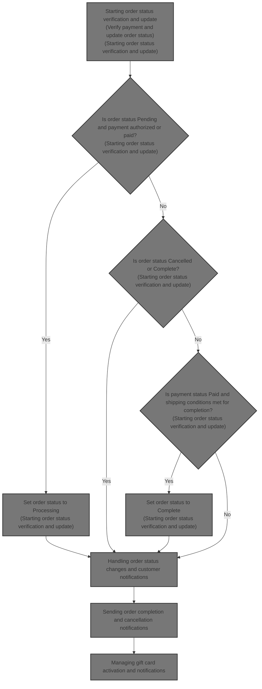
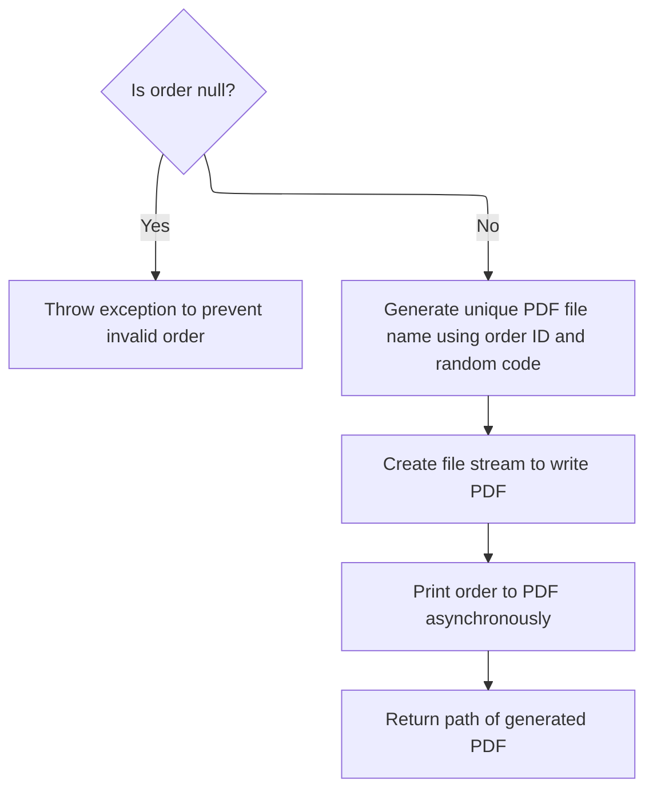
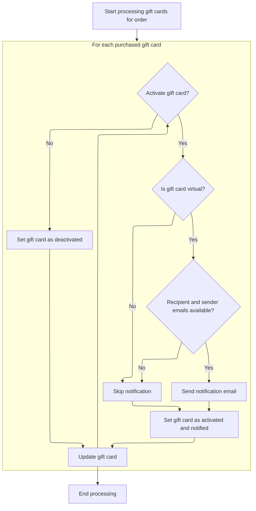

This document describes the flow of verifying and updating order statuses based on payment and shipping conditions, managing customer notifications, generating PDF invoices, and handling gift card activation. The flow receives an order as input and updates its status accordingly, sending notifications and generating invoices as needed.



# Where is this flow used?

This flow is used multiple times in the codebase as represented in the following diagram:

(Note - these are only some of the entry points of this flow)

```mermaid
graph TD;
      4050016b4173fe19f415fdba7c31851affea85e93ef23617f54264f5789eefe4(src/…/Controllers/CheckoutController.cs::CheckoutController.ConfirmOrder) --> 279ea30ea3c3f128b61ceca4550d25ec736b049c362f70d31fe2afb614d81825(src/…/Orders/OrderProcessingService.cs::OrderProcessingService.PlaceOrderAsync)

279ea30ea3c3f128b61ceca4550d25ec736b049c362f70d31fe2afb614d81825(src/…/Orders/OrderProcessingService.cs::OrderProcessingService.PlaceOrderAsync) --> 6fc3201e59c3f3bc8f702870d292cfc5a8acba4575a8bcacef02981f0f4ee607(src/…/Orders/OrderProcessingService.cs::OrderProcessingService.CheckOrderStatusAsync)

a8d40e6ac925726e3fba2dc0cb05aa6f1779beb492a9ca82b323d2d736803be5(src/…/Controllers/CheckoutController.cs::CheckoutController.OpcConfirmOrder) --> 279ea30ea3c3f128b61ceca4550d25ec736b049c362f70d31fe2afb614d81825(src/…/Orders/OrderProcessingService.cs::OrderProcessingService.PlaceOrderAsync)

41732da589b3a15edeaed7259af50dc7796645c5ffc247b534a1a62074f33eda(src/…/Controllers/OrderController.cs::OrderController.PartiallyRefundOrderPopup) --> 99f38abbbc1cf58c749bcc6d459beee2edffb79365c40e00c75ce526beef6e08(src/…/Orders/OrderProcessingService.cs::OrderProcessingService.PartiallyRefundAsync)

41732da589b3a15edeaed7259af50dc7796645c5ffc247b534a1a62074f33eda(src/…/Controllers/OrderController.cs::OrderController.PartiallyRefundOrderPopup) --> 4b3b85e0885f49636c47132ffbe3d5ff04aee6f8640491ba2a0682928c3c90b8(src/…/Orders/OrderProcessingService.cs::OrderProcessingService.PartiallyRefundOfflineAsync)

99f38abbbc1cf58c749bcc6d459beee2edffb79365c40e00c75ce526beef6e08(src/…/Orders/OrderProcessingService.cs::OrderProcessingService.PartiallyRefundAsync) --> f956c760fb1af7e91afafdf5588903664a5174db8b4c3189534d2c01932b2b63(src/…/Orders/OrderProcessingService.cs::OrderProcessingService.RefundAsync)

99f38abbbc1cf58c749bcc6d459beee2edffb79365c40e00c75ce526beef6e08(src/…/Orders/OrderProcessingService.cs::OrderProcessingService.PartiallyRefundAsync) --> 6fc3201e59c3f3bc8f702870d292cfc5a8acba4575a8bcacef02981f0f4ee607(src/…/Orders/OrderProcessingService.cs::OrderProcessingService.CheckOrderStatusAsync)

f956c760fb1af7e91afafdf5588903664a5174db8b4c3189534d2c01932b2b63(src/…/Orders/OrderProcessingService.cs::OrderProcessingService.RefundAsync) --> 6fc3201e59c3f3bc8f702870d292cfc5a8acba4575a8bcacef02981f0f4ee607(src/…/Orders/OrderProcessingService.cs::OrderProcessingService.CheckOrderStatusAsync)

4b3b85e0885f49636c47132ffbe3d5ff04aee6f8640491ba2a0682928c3c90b8(src/…/Orders/OrderProcessingService.cs::OrderProcessingService.PartiallyRefundOfflineAsync) --> 6fc3201e59c3f3bc8f702870d292cfc5a8acba4575a8bcacef02981f0f4ee607(src/…/Orders/OrderProcessingService.cs::OrderProcessingService.CheckOrderStatusAsync)

696f273cd9d8ac825ea1c2a40e37443fa642836240b269442d8a3f9c0f2a63be(src/…/Controllers/OrderController.cs::OrderController.CaptureOrder) --> b7aa8d9c496c7371c883534bd1dfcce0844cf9f21d5123e6ca0c0405bc2cb002(src/…/Orders/OrderProcessingService.cs::OrderProcessingService.CaptureAsync)

b7aa8d9c496c7371c883534bd1dfcce0844cf9f21d5123e6ca0c0405bc2cb002(src/…/Orders/OrderProcessingService.cs::OrderProcessingService.CaptureAsync) --> 6fc3201e59c3f3bc8f702870d292cfc5a8acba4575a8bcacef02981f0f4ee607(src/…/Orders/OrderProcessingService.cs::OrderProcessingService.CheckOrderStatusAsync)

f39a49fa47b5f1bc92c335e7c6f962d630f284bba2bf688d430cbd54513371b6(src/…/Controllers/OrderController.cs::OrderController.MarkOrderAsPaid) --> 3fd7fd5bbc097de99dfd9b7c6a6f25b4ccd492e5bc79a93f589bbba2ce110ab0(src/…/Orders/OrderProcessingService.cs::OrderProcessingService.MarkOrderAsPaidAsync)

3fd7fd5bbc097de99dfd9b7c6a6f25b4ccd492e5bc79a93f589bbba2ce110ab0(src/…/Orders/OrderProcessingService.cs::OrderProcessingService.MarkOrderAsPaidAsync) --> 6fc3201e59c3f3bc8f702870d292cfc5a8acba4575a8bcacef02981f0f4ee607(src/…/Orders/OrderProcessingService.cs::OrderProcessingService.CheckOrderStatusAsync)


classDef mainFlowStyle color:#000000,fill:#7CB9F4
classDef rootsStyle color:#000000,fill:#00FFF4
classDef Style1 color:#000000,fill:#00FFAA
classDef Style2 color:#000000,fill:#FFFF00
classDef Style3 color:#000000,fill:#AA7CB9

%% Swimm:
%% graph TD;
%%       4050016b4173fe19f415fdba7c31851affea85e93ef23617f54264f5789eefe4(<SwmPath>[src/…/Controllers/CheckoutController.cs](src/Presentation/Nop.Web/Controllers/CheckoutController.cs)</SwmPath>::CheckoutController.ConfirmOrder) --> 279ea30ea3c3f128b61ceca4550d25ec736b049c362f70d31fe2afb614d81825(<SwmPath>[src/…/Orders/OrderProcessingService.cs](src/Libraries/Nop.Services/Orders/OrderProcessingService.cs)</SwmPath>::OrderProcessingService.PlaceOrderAsync)
%% 
%% 279ea30ea3c3f128b61ceca4550d25ec736b049c362f70d31fe2afb614d81825(<SwmPath>[src/…/Orders/OrderProcessingService.cs](src/Libraries/Nop.Services/Orders/OrderProcessingService.cs)</SwmPath>::OrderProcessingService.PlaceOrderAsync) --> 6fc3201e59c3f3bc8f702870d292cfc5a8acba4575a8bcacef02981f0f4ee607(<SwmPath>[src/…/Orders/OrderProcessingService.cs](src/Libraries/Nop.Services/Orders/OrderProcessingService.cs)</SwmPath>::OrderProcessingService.CheckOrderStatusAsync)
%% 
%% a8d40e6ac925726e3fba2dc0cb05aa6f1779beb492a9ca82b323d2d736803be5(<SwmPath>[src/…/Controllers/CheckoutController.cs](src/Presentation/Nop.Web/Controllers/CheckoutController.cs)</SwmPath>::CheckoutController.OpcConfirmOrder) --> 279ea30ea3c3f128b61ceca4550d25ec736b049c362f70d31fe2afb614d81825(<SwmPath>[src/…/Orders/OrderProcessingService.cs](src/Libraries/Nop.Services/Orders/OrderProcessingService.cs)</SwmPath>::OrderProcessingService.PlaceOrderAsync)
%% 
%% 41732da589b3a15edeaed7259af50dc7796645c5ffc247b534a1a62074f33eda(<SwmPath>[src/…/Controllers/OrderController.cs](src/Presentation/Nop.Web/Areas/Admin/Controllers/OrderController.cs)</SwmPath>::OrderController.PartiallyRefundOrderPopup) --> 99f38abbbc1cf58c749bcc6d459beee2edffb79365c40e00c75ce526beef6e08(<SwmPath>[src/…/Orders/OrderProcessingService.cs](src/Libraries/Nop.Services/Orders/OrderProcessingService.cs)</SwmPath>::OrderProcessingService.PartiallyRefundAsync)
%% 
%% 41732da589b3a15edeaed7259af50dc7796645c5ffc247b534a1a62074f33eda(<SwmPath>[src/…/Controllers/OrderController.cs](src/Presentation/Nop.Web/Areas/Admin/Controllers/OrderController.cs)</SwmPath>::OrderController.PartiallyRefundOrderPopup) --> 4b3b85e0885f49636c47132ffbe3d5ff04aee6f8640491ba2a0682928c3c90b8(<SwmPath>[src/…/Orders/OrderProcessingService.cs](src/Libraries/Nop.Services/Orders/OrderProcessingService.cs)</SwmPath>::OrderProcessingService.PartiallyRefundOfflineAsync)
%% 
%% 99f38abbbc1cf58c749bcc6d459beee2edffb79365c40e00c75ce526beef6e08(<SwmPath>[src/…/Orders/OrderProcessingService.cs](src/Libraries/Nop.Services/Orders/OrderProcessingService.cs)</SwmPath>::OrderProcessingService.PartiallyRefundAsync) --> f956c760fb1af7e91afafdf5588903664a5174db8b4c3189534d2c01932b2b63(<SwmPath>[src/…/Orders/OrderProcessingService.cs](src/Libraries/Nop.Services/Orders/OrderProcessingService.cs)</SwmPath>::OrderProcessingService.RefundAsync)
%% 
%% 99f38abbbc1cf58c749bcc6d459beee2edffb79365c40e00c75ce526beef6e08(<SwmPath>[src/…/Orders/OrderProcessingService.cs](src/Libraries/Nop.Services/Orders/OrderProcessingService.cs)</SwmPath>::OrderProcessingService.PartiallyRefundAsync) --> 6fc3201e59c3f3bc8f702870d292cfc5a8acba4575a8bcacef02981f0f4ee607(<SwmPath>[src/…/Orders/OrderProcessingService.cs](src/Libraries/Nop.Services/Orders/OrderProcessingService.cs)</SwmPath>::OrderProcessingService.CheckOrderStatusAsync)
%% 
%% f956c760fb1af7e91afafdf5588903664a5174db8b4c3189534d2c01932b2b63(<SwmPath>[src/…/Orders/OrderProcessingService.cs](src/Libraries/Nop.Services/Orders/OrderProcessingService.cs)</SwmPath>::OrderProcessingService.RefundAsync) --> 6fc3201e59c3f3bc8f702870d292cfc5a8acba4575a8bcacef02981f0f4ee607(<SwmPath>[src/…/Orders/OrderProcessingService.cs](src/Libraries/Nop.Services/Orders/OrderProcessingService.cs)</SwmPath>::OrderProcessingService.CheckOrderStatusAsync)
%% 
%% 4b3b85e0885f49636c47132ffbe3d5ff04aee6f8640491ba2a0682928c3c90b8(<SwmPath>[src/…/Orders/OrderProcessingService.cs](src/Libraries/Nop.Services/Orders/OrderProcessingService.cs)</SwmPath>::OrderProcessingService.PartiallyRefundOfflineAsync) --> 6fc3201e59c3f3bc8f702870d292cfc5a8acba4575a8bcacef02981f0f4ee607(<SwmPath>[src/…/Orders/OrderProcessingService.cs](src/Libraries/Nop.Services/Orders/OrderProcessingService.cs)</SwmPath>::OrderProcessingService.CheckOrderStatusAsync)
%% 
%% 696f273cd9d8ac825ea1c2a40e37443fa642836240b269442d8a3f9c0f2a63be(<SwmPath>[src/…/Controllers/OrderController.cs](src/Presentation/Nop.Web/Areas/Admin/Controllers/OrderController.cs)</SwmPath>::OrderController.CaptureOrder) --> b7aa8d9c496c7371c883534bd1dfcce0844cf9f21d5123e6ca0c0405bc2cb002(<SwmPath>[src/…/Orders/OrderProcessingService.cs](src/Libraries/Nop.Services/Orders/OrderProcessingService.cs)</SwmPath>::OrderProcessingService.CaptureAsync)
%% 
%% b7aa8d9c496c7371c883534bd1dfcce0844cf9f21d5123e6ca0c0405bc2cb002(<SwmPath>[src/…/Orders/OrderProcessingService.cs](src/Libraries/Nop.Services/Orders/OrderProcessingService.cs)</SwmPath>::OrderProcessingService.CaptureAsync) --> 6fc3201e59c3f3bc8f702870d292cfc5a8acba4575a8bcacef02981f0f4ee607(<SwmPath>[src/…/Orders/OrderProcessingService.cs](src/Libraries/Nop.Services/Orders/OrderProcessingService.cs)</SwmPath>::OrderProcessingService.CheckOrderStatusAsync)
%% 
%% f39a49fa47b5f1bc92c335e7c6f962d630f284bba2bf688d430cbd54513371b6(<SwmPath>[src/…/Controllers/OrderController.cs](src/Presentation/Nop.Web/Areas/Admin/Controllers/OrderController.cs)</SwmPath>::OrderController.MarkOrderAsPaid) --> 3fd7fd5bbc097de99dfd9b7c6a6f25b4ccd492e5bc79a93f589bbba2ce110ab0(<SwmPath>[src/…/Orders/OrderProcessingService.cs](src/Libraries/Nop.Services/Orders/OrderProcessingService.cs)</SwmPath>::OrderProcessingService.MarkOrderAsPaidAsync)
%% 
%% 3fd7fd5bbc097de99dfd9b7c6a6f25b4ccd492e5bc79a93f589bbba2ce110ab0(<SwmPath>[src/…/Orders/OrderProcessingService.cs](src/Libraries/Nop.Services/Orders/OrderProcessingService.cs)</SwmPath>::OrderProcessingService.MarkOrderAsPaidAsync) --> 6fc3201e59c3f3bc8f702870d292cfc5a8acba4575a8bcacef02981f0f4ee607(<SwmPath>[src/…/Orders/OrderProcessingService.cs](src/Libraries/Nop.Services/Orders/OrderProcessingService.cs)</SwmPath>::OrderProcessingService.CheckOrderStatusAsync)
%% 
%% 
%% classDef mainFlowStyle color:#000000,fill:#7CB9F4
%% classDef rootsStyle color:#000000,fill:#00FFF4
%% classDef Style1 color:#000000,fill:#00FFAA
%% classDef Style2 color:#000000,fill:#FFFF00
%% classDef Style3 color:#000000,fill:#AA7CB9
```



# Starting order status verification and update

```mermaid
%%{init: {"flowchart": {"defaultRenderer": "elk"}} }%%
flowchart TD
    node1{"Is order paid but missing paid date?"}
    node1 -->|"Yes"| node2["Set paid date to now"]
    node2 --> node3["Update order in system"]
    node1 -->|"No"| node3

    node3 --> node4{"Is order status Pending?"}
    node4 -->|"Yes"| node5{"Is payment authorized or paid?"}
    node5 -->|"Yes"| node6["Set order status to Processing"]
    node6 --> node7
    node5 -->|"No"| node7

    node4 -->|"No"| node8{"Is order status Cancelled or Complete?"}
    node8 -->|"Yes"| node9["Exit function"]
    node8 -->|"No"| node7

    node7 --> node10{"Is payment status Paid?"}
    node10 -->|"No"| node9
    node10 -->|"Yes"| node11{"Is shipping required?"}

    node11 -->|"No"| node12["Mark order as completed"]
    node11 -->|"Yes"| node13{"Complete order when delivered?"}

    node13 -->|"Yes"| node14{"Is shipping status Delivered?"}
    node14 -->|"Yes"| node12
    node14 -->|"No"| node15["Not completed"]

    node13 -->|"No"| node16{"Is shipping status Shipped or Delivered?"}
    node16 -->|"Yes"| node12
    node16 -->|"No"| node15

    node12 --> node17["Set order status to Complete"]
    node17 --> node9
    node15 --> node9

    click node1 openCode "src/Libraries/Nop.Services/Orders/OrderProcessingService.cs:1514:1519"
    click node2 openCode "src/Libraries/Nop.Services/Orders/OrderProcessingService.cs:1516:1518"
    click node3 openCode "src/Libraries/Nop.Services/Orders/OrderProcessingService.cs:1518:1519"
    click node4 openCode "src/Libraries/Nop.Services/Orders/OrderProcessingService.cs:1521:1533"
    click node5 openCode "src/Libraries/Nop.Services/Orders/OrderProcessingService.cs:1524:1526"
    click node6 openCode "src/Libraries/Nop.Services/Orders/OrderProcessingService.cs:1526:1531"
    click node8 openCode "src/Libraries/Nop.Services/Orders/OrderProcessingService.cs:1534:1538"
    click node10 openCode "src/Libraries/Nop.Services/Orders/OrderProcessingService.cs:1540:1542"
    click node11 openCode "src/Libraries/Nop.Services/Orders/OrderProcessingService.cs:1545:1551"
    click node12 openCode "src/Libraries/Nop.Services/Orders/OrderProcessingService.cs:1547:1549"
    click node13 openCode "src/Libraries/Nop.Services/Orders/OrderProcessingService.cs:1552:1558"
    click node14 openCode "src/Libraries/Nop.Services/Orders/OrderProcessingService.cs:1554:1556"
    click node16 openCode "src/Libraries/Nop.Services/Orders/OrderProcessingService.cs:1556:1558"
    click node17 openCode "src/Libraries/Nop.Services/Orders/OrderProcessingService.cs:1560:1562"
classDef HeadingStyle fill:#777777,stroke:#333,stroke-width:2px;

%% Swimm:
%% %%{init: {"flowchart": {"defaultRenderer": "elk"}} }%%
%% flowchart TD
%%     node1{"Is order paid but missing paid date?"}
%%     node1 -->|"Yes"| node2["Set paid date to now"]
%%     node2 --> node3["Update order in system"]
%%     node1 -->|"No"| node3
%% 
%%     node3 --> node4{"Is order status Pending?"}
%%     node4 -->|"Yes"| node5{"Is payment authorized or paid?"}
%%     node5 -->|"Yes"| node6["Set order status to Processing"]
%%     node6 --> node7
%%     node5 -->|"No"| node7
%% 
%%     node4 -->|"No"| node8{"Is order status Cancelled or Complete?"}
%%     node8 -->|"Yes"| node9["Exit function"]
%%     node8 -->|"No"| node7
%% 
%%     node7 --> node10{"Is payment status Paid?"}
%%     node10 -->|"No"| node9
%%     node10 -->|"Yes"| node11{"Is shipping required?"}
%% 
%%     node11 -->|"No"| node12["Mark order as completed"]
%%     node11 -->|"Yes"| node13{"Complete order when delivered?"}
%% 
%%     node13 -->|"Yes"| node14{"Is shipping status Delivered?"}
%%     node14 -->|"Yes"| node12
%%     node14 -->|"No"| node15["Not completed"]
%% 
%%     node13 -->|"No"| node16{"Is shipping status Shipped or Delivered?"}
%%     node16 -->|"Yes"| node12
%%     node16 -->|"No"| node15
%% 
%%     node12 --> node17["Set order status to Complete"]
%%     node17 --> node9
%%     node15 --> node9
%% 
%%     click node1 openCode "<SwmPath>[src/…/Orders/OrderProcessingService.cs](src/Libraries/Nop.Services/Orders/OrderProcessingService.cs)</SwmPath>:1514:1519"
%%     click node2 openCode "<SwmPath>[src/…/Orders/OrderProcessingService.cs](src/Libraries/Nop.Services/Orders/OrderProcessingService.cs)</SwmPath>:1516:1518"
%%     click node3 openCode "<SwmPath>[src/…/Orders/OrderProcessingService.cs](src/Libraries/Nop.Services/Orders/OrderProcessingService.cs)</SwmPath>:1518:1519"
%%     click node4 openCode "<SwmPath>[src/…/Orders/OrderProcessingService.cs](src/Libraries/Nop.Services/Orders/OrderProcessingService.cs)</SwmPath>:1521:1533"
%%     click node5 openCode "<SwmPath>[src/…/Orders/OrderProcessingService.cs](src/Libraries/Nop.Services/Orders/OrderProcessingService.cs)</SwmPath>:1524:1526"
%%     click node6 openCode "<SwmPath>[src/…/Orders/OrderProcessingService.cs](src/Libraries/Nop.Services/Orders/OrderProcessingService.cs)</SwmPath>:1526:1531"
%%     click node8 openCode "<SwmPath>[src/…/Orders/OrderProcessingService.cs](src/Libraries/Nop.Services/Orders/OrderProcessingService.cs)</SwmPath>:1534:1538"
%%     click node10 openCode "<SwmPath>[src/…/Orders/OrderProcessingService.cs](src/Libraries/Nop.Services/Orders/OrderProcessingService.cs)</SwmPath>:1540:1542"
%%     click node11 openCode "<SwmPath>[src/…/Orders/OrderProcessingService.cs](src/Libraries/Nop.Services/Orders/OrderProcessingService.cs)</SwmPath>:1545:1551"
%%     click node12 openCode "<SwmPath>[src/…/Orders/OrderProcessingService.cs](src/Libraries/Nop.Services/Orders/OrderProcessingService.cs)</SwmPath>:1547:1549"
%%     click node13 openCode "<SwmPath>[src/…/Orders/OrderProcessingService.cs](src/Libraries/Nop.Services/Orders/OrderProcessingService.cs)</SwmPath>:1552:1558"
%%     click node14 openCode "<SwmPath>[src/…/Orders/OrderProcessingService.cs](src/Libraries/Nop.Services/Orders/OrderProcessingService.cs)</SwmPath>:1554:1556"
%%     click node16 openCode "<SwmPath>[src/…/Orders/OrderProcessingService.cs](src/Libraries/Nop.Services/Orders/OrderProcessingService.cs)</SwmPath>:1556:1558"
%%     click node17 openCode "<SwmPath>[src/…/Orders/OrderProcessingService.cs](src/Libraries/Nop.Services/Orders/OrderProcessingService.cs)</SwmPath>:1560:1562"
%% classDef HeadingStyle fill:#777777,stroke:#333,stroke-width:2px;
```



This section verifies and updates the order status based on payment and shipping conditions to ensure accurate order lifecycle management.

| Category       | Rule Name                                            | Description                                                                                                                                                                                                                                                                                                                                                                                                                                          |
| -------------- | ---------------------------------------------------- | ---------------------------------------------------------------------------------------------------------------------------------------------------------------------------------------------------------------------------------------------------------------------------------------------------------------------------------------------------------------------------------------------------------------------------------------------------- |
| Business logic | Set paid date on payment                             | If an order is marked as paid but does not have a paid date, the system must set the paid date to the current date and time to ensure payment confirmation is recorded.                                                                                                                                                                                                                                                                              |
| Business logic | Pending to Processing on payment                     | If the order status is Pending and the payment status is Authorized or Paid, the order status must be updated to Processing to reflect that the order is actively being handled.                                                                                                                                                                                                                                                                     |
| Business logic | Pending to Processing on shipping                    | If the order status is Pending and the shipping status is Partially Shipped, Shipped, or Delivered, the order status must be updated to Processing to indicate active fulfillment.                                                                                                                                                                                                                                                                   |
| Business logic | No update on Cancelled or Complete                   | If the order status is Cancelled or Complete, no further status updates should be performed to preserve the finality of these states.                                                                                                                                                                                                                                                                                                                |
| Business logic | Complete only if paid                                | If the payment status is not Paid, the order status should not be updated to Complete, ensuring only fully paid orders can be completed.                                                                                                                                                                                                                                                                                                             |
| Business logic | Complete if no shipping required                     | If shipping is not required for the order, the order can be marked as Complete immediately after payment is confirmed.                                                                                                                                                                                                                                                                                                                               |
| Business logic | Complete order based on shipping status and settings | If shipping is required, the order completion depends on the system setting <SwmToken path="src/Libraries/Nop.Services/Orders/OrderProcessingService.cs" pos="1553:6:6" line-data="                if (_orderSettings.CompleteOrderWhenDelivered)">`CompleteOrderWhenDelivered`</SwmToken>. If true, the order is completed only when shipping status is Delivered; if false, completion occurs when shipping status is either Shipped or Delivered. |

<SwmSnippet path="/src/Libraries/Nop.Services/Orders/OrderProcessingService.cs" line="1509">

---

We first ensure the paid date is set when payment is confirmed, then update the order to keep data consistent before further status checks.

```c#
        public virtual async Task CheckOrderStatusAsync(Order order)
        {
            if (order == null)
                throw new ArgumentNullException(nameof(order));

            if (order.PaymentStatus == PaymentStatus.Paid && !order.PaidDateUtc.HasValue)
            {
                //ensure that paid date is set
                order.PaidDateUtc = DateTime.UtcNow;
                await _orderService.UpdateOrderAsync(order);
            }

```

---

</SwmSnippet>

<SwmSnippet path="/src/Libraries/Nop.Services/Orders/OrderService.cs" line="408">

---

<SwmToken path="src/Libraries/Nop.Services/Orders/OrderService.cs" pos="408:9:9" line-data="        public virtual async Task UpdateOrderAsync(Order order)">`UpdateOrderAsync`</SwmToken> just calls the repository's async update method with the order. It doesn't add any extra logic or validation, just passes the order along to be saved.

```c#
        public virtual async Task UpdateOrderAsync(Order order)
        {
            await _orderRepository.UpdateAsync(order);
        }
```

---

</SwmSnippet>

<SwmSnippet path="/src/Libraries/Nop.Services/Orders/OrderProcessingService.cs" line="1521">

---

We update the order status based on payment and shipping states, using settings to decide when to mark complete, and delegate status changes to <SwmToken path="src/Libraries/Nop.Services/Orders/OrderProcessingService.cs" pos="1526:3:3" line-data="                        await SetOrderStatusAsync(order, OrderStatus.Processing, false);">`SetOrderStatusAsync`</SwmToken>.

```c#
            switch (order.OrderStatus)
            {
                case OrderStatus.Pending:
                    if (order.PaymentStatus == PaymentStatus.Authorized ||
                        order.PaymentStatus == PaymentStatus.Paid)
                        await SetOrderStatusAsync(order, OrderStatus.Processing, false);

                    if (order.ShippingStatus == ShippingStatus.PartiallyShipped ||
                        order.ShippingStatus == ShippingStatus.Shipped ||
                        order.ShippingStatus == ShippingStatus.Delivered)
                        await SetOrderStatusAsync(order, OrderStatus.Processing, false);

                    break;
                //is order complete?
                case OrderStatus.Cancelled:
                case OrderStatus.Complete:
                    return;
            }

            if (order.PaymentStatus != PaymentStatus.Paid)
                return;

            bool completed;

            if (order.ShippingStatus == ShippingStatus.ShippingNotRequired)
            {
                //shipping is not required
                completed = true;
            }
            else
            {
                //shipping is required
                if (_orderSettings.CompleteOrderWhenDelivered)
                    completed = order.ShippingStatus == ShippingStatus.Delivered;
                else
                    completed = order.ShippingStatus == ShippingStatus.Shipped ||
                                order.ShippingStatus == ShippingStatus.Delivered;
            }

            if (completed) 
                await SetOrderStatusAsync(order, OrderStatus.Complete, true);
        }
```

---

</SwmSnippet>

# Handling order status changes and customer notifications

This section handles changes to the order status and manages customer notifications accordingly.

| Category       | Rule Name               | Description                                                                                                                |
| -------------- | ----------------------- | -------------------------------------------------------------------------------------------------------------------------- |
| Business logic | Order status note       | Add an order note every time the order status changes, describing the new status.                                          |
| Business logic | Completion notification | When the order status changes to Complete and customer notifications are enabled, send a completion email to the customer. |
| Business logic | PDF invoice attachment  | Attach a PDF invoice to the completion email if the system setting for attaching PDF invoices is enabled.                  |

<SwmSnippet path="/src/Libraries/Nop.Services/Orders/OrderProcessingService.cs" line="1061">

---

In <SwmToken path="src/Libraries/Nop.Services/Orders/OrderProcessingService.cs" pos="1061:9:9" line-data="        protected virtual async Task SetOrderStatusAsync(Order order, OrderStatus os, bool notifyCustomer)">`SetOrderStatusAsync`</SwmToken> we first check if the new status differs from the current one. If yes, we update the status and save it. Then we add an order note about the status change. If the status changes to Complete and notifications are enabled, we prepare to send a completion email, optionally attaching a PDF invoice by calling <SwmToken path="src/Libraries/Nop.Services/Orders/OrderProcessingService.cs" pos="1083:5:5" line-data="                    await _pdfService.PrintOrderToPdfAsync(order) : null;">`PrintOrderToPdfAsync`</SwmToken>.

```c#
        protected virtual async Task SetOrderStatusAsync(Order order, OrderStatus os, bool notifyCustomer)
        {
            if (order == null)
                throw new ArgumentNullException(nameof(order));

            var prevOrderStatus = order.OrderStatus;
            if (prevOrderStatus == os)
                return;

            //set and save new order status
            order.OrderStatusId = (int)os;
            await _orderService.UpdateOrderAsync(order);

            //order notes, notifications
            await AddOrderNoteAsync(order, $"Order status has been changed to {await _localizationService.GetLocalizedEnumAsync(os)}");

            if (prevOrderStatus != OrderStatus.Complete &&
                os == OrderStatus.Complete
                && notifyCustomer)
            {
                //notification
                var orderCompletedAttachmentFilePath = _orderSettings.AttachPdfInvoiceToOrderCompletedEmail ?
                    await _pdfService.PrintOrderToPdfAsync(order) : null;
```

---

</SwmSnippet>

## Generating PDF invoice for a single order



This section describes the process of generating a PDF invoice for a single order in the <SwmToken path="src/Libraries/Nop.Services/Orders/OrderProcessingService.cs" pos="1000:11:11" line-data="                // https://github.com/nopSolutions/nopCommerce/issues/5595">`nopCommerce`</SwmToken> platform.

| Category       | Rule Name                   | Description                                                                                                                                                                                                              |
| -------------- | --------------------------- | ------------------------------------------------------------------------------------------------------------------------------------------------------------------------------------------------------------------------ |
| Business logic | Unique PDF file naming      | The PDF file name must be unique and include the order's GUID and a random 4-digit code to avoid file name collisions.                                                                                                   |
| Business logic | Designated storage location | The generated PDF invoice must be saved in the designated export/import directory under <SwmPath>[src/…/wwwroot/files/](src/Presentation/Nop.Web/wwwroot/files/)</SwmPath> to ensure consistent file storage and access. |
| Business logic | Return PDF file path        | The system must return the full file path of the generated PDF invoice after successful creation.                                                                                                                        |

<SwmSnippet path="/src/Libraries/Nop.Services/Common/PdfService.cs" line="1217">

---

<SwmToken path="src/Libraries/Nop.Services/Common/PdfService.cs" pos="1217:12:12" line-data="        public virtual async Task&lt;string&gt; PrintOrderToPdfAsync(Order order, int languageId = 0, int vendorId = 0)">`PrintOrderToPdfAsync`</SwmToken> wraps the single order in a list and calls the batch PDF generator. It creates a unique file name using the order's GUID and a random code, then uses <SwmToken path="src/Libraries/Nop.Services/Common/PdfService.cs" pos="1223:7:7" line-data="            var filePath = _fileProvider.Combine(_fileProvider.MapPath(&quot;~/wwwroot/files/exportimport&quot;), fileName);">`_fileProvider`</SwmToken> to resolve the file path and save the PDF.

```c#
        public virtual async Task<string> PrintOrderToPdfAsync(Order order, int languageId = 0, int vendorId = 0)
        {
            if (order == null)
                throw new ArgumentNullException(nameof(order));

            var fileName = $"order_{order.OrderGuid}_{CommonHelper.GenerateRandomDigitCode(4)}.pdf";
            var filePath = _fileProvider.Combine(_fileProvider.MapPath("~/wwwroot/files/exportimport"), fileName);
            await using (var fileStream = new FileStream(filePath, FileMode.Create))
            {
                var orders = new List<Order> { order };
                await PrintOrdersToPdfAsync(fileStream, orders, languageId, vendorId);
            }

            return filePath;
        }
```

---

</SwmSnippet>

## Composing multi-order PDF with store-specific settings and modular sections

```mermaid
%%{init: {"flowchart": {"defaultRenderer": "elk"}} }%%
flowchart TD
    node1{"Is Letter page size enabled?"}
    click node1 openCode "src/Libraries/Nop.Services/Common/PdfService.cs:1251:1252"
    node1 -->|"Yes"| node2["Set page size to Letter"]
    click node2 openCode "src/Libraries/Nop.Services/Common/PdfService.cs:1252:1253"
    node1 -->|"No"| node3["Set page size to A4"]
    click node3 openCode "src/Libraries/Nop.Services/Common/PdfService.cs:1249:1250"
    node2 --> node4["Open PDF document"]
    node3 --> node4
    click node4 openCode "src/Libraries/Nop.Services/Common/PdfService.cs:1254:1256"

    subgraph loop1["For each order in orders"]
        node4 --> node5["Load PDF settings for order's store"]
        click node5 openCode "src/Libraries/Nop.Services/Common/PdfService.cs:1274:1275"
        node5 --> node6{"Is languageId 0 or language unpublished?"}
        click node6 openCode "src/Libraries/Nop.Services/Common/PdfService.cs:1276:1278"
        node6 -->|"Yes"| node7["Use customer's language"]
        click node7 openCode "src/Libraries/Nop.Services/Common/PdfService.cs:1278:1279"
        node6 -->|"No"| node8["Use provided languageId"]
        click node8 openCode "src/Libraries/Nop.Services/Common/PdfService.cs:1276:1277"
        node7 --> node9["Print header"]
        node8 --> node9
        click node9 openCode "src/Libraries/Nop.Services/Common/PdfService.cs:1281:1282"
        node9 --> node10["Print addresses"]
        click node10 openCode "src/Libraries/Nop.Services/Common/PdfService.cs:1283:1284"
        node10 --> node11["Print products"]
        click node11 openCode "src/Libraries/Nop.Services/Common/PdfService.cs:1286:1287"
        node11 --> node12["Print checkout attributes"]
        click node12 openCode "src/Libraries/Nop.Services/Common/PdfService.cs:1289:1290"
        node12 --> node13["Print totals"]
        click node13 openCode "src/Libraries/Nop.Services/Common/PdfService.cs:1292:1293"
        node13 --> node14["Print order notes"]
        click node14 openCode "src/Libraries/Nop.Services/Common/PdfService.cs:1295:1296"
        node14 --> node15["Print footer"]
        click node15 openCode "src/Libraries/Nop.Services/Common/PdfService.cs:1298:1299"
        node15 --> node16{"Is current order last?"}
        click node16 openCode "src/Libraries/Nop.Services/Common/PdfService.cs:1302:1303"
        node16 -->|"No"| node17["Add new page"]
        click node17 openCode "src/Libraries/Nop.Services/Common/PdfService.cs:1303:1304"
        node16 -->|"Yes"| node18["End order processing"]
        node17 --> node4
    end

    node18 --> node19["Close PDF document"]
    click node19 openCode "src/Libraries/Nop.Services/Common/PdfService.cs:1306:1307"
classDef HeadingStyle fill:#777777,stroke:#333,stroke-width:2px;

%% Swimm:
%% %%{init: {"flowchart": {"defaultRenderer": "elk"}} }%%
%% flowchart TD
%%     node1{"Is Letter page size enabled?"}
%%     click node1 openCode "<SwmPath>[src/…/Common/PdfService.cs](src/Libraries/Nop.Services/Common/PdfService.cs)</SwmPath>:1251:1252"
%%     node1 -->|"Yes"| node2["Set page size to Letter"]
%%     click node2 openCode "<SwmPath>[src/…/Common/PdfService.cs](src/Libraries/Nop.Services/Common/PdfService.cs)</SwmPath>:1252:1253"
%%     node1 -->|"No"| node3["Set page size to <SwmToken path="src/Libraries/Nop.Services/Common/PdfService.cs" pos="1249:9:9" line-data="            var pageSize = PageSize.A4;">`A4`</SwmToken>"]
%%     click node3 openCode "<SwmPath>[src/…/Common/PdfService.cs](src/Libraries/Nop.Services/Common/PdfService.cs)</SwmPath>:1249:1250"
%%     node2 --> node4["Open PDF document"]
%%     node3 --> node4
%%     click node4 openCode "<SwmPath>[src/…/Common/PdfService.cs](src/Libraries/Nop.Services/Common/PdfService.cs)</SwmPath>:1254:1256"
%% 
%%     subgraph loop1["For each order in orders"]
%%         node4 --> node5["Load PDF settings for order's store"]
%%         click node5 openCode "<SwmPath>[src/…/Common/PdfService.cs](src/Libraries/Nop.Services/Common/PdfService.cs)</SwmPath>:1274:1275"
%%         node5 --> node6{"Is <SwmToken path="src/Libraries/Nop.Services/Common/PdfService.cs" pos="1217:21:21" line-data="        public virtual async Task&lt;string&gt; PrintOrderToPdfAsync(Order order, int languageId = 0, int vendorId = 0)">`languageId`</SwmToken> 0 or language unpublished?"}
%%         click node6 openCode "<SwmPath>[src/…/Common/PdfService.cs](src/Libraries/Nop.Services/Common/PdfService.cs)</SwmPath>:1276:1278"
%%         node6 -->|"Yes"| node7["Use customer's language"]
%%         click node7 openCode "<SwmPath>[src/…/Common/PdfService.cs](src/Libraries/Nop.Services/Common/PdfService.cs)</SwmPath>:1278:1279"
%%         node6 -->|"No"| node8["Use provided <SwmToken path="src/Libraries/Nop.Services/Common/PdfService.cs" pos="1217:21:21" line-data="        public virtual async Task&lt;string&gt; PrintOrderToPdfAsync(Order order, int languageId = 0, int vendorId = 0)">`languageId`</SwmToken>"]
%%         click node8 openCode "<SwmPath>[src/…/Common/PdfService.cs](src/Libraries/Nop.Services/Common/PdfService.cs)</SwmPath>:1276:1277"
%%         node7 --> node9["Print header"]
%%         node8 --> node9
%%         click node9 openCode "<SwmPath>[src/…/Common/PdfService.cs](src/Libraries/Nop.Services/Common/PdfService.cs)</SwmPath>:1281:1282"
%%         node9 --> node10["Print addresses"]
%%         click node10 openCode "<SwmPath>[src/…/Common/PdfService.cs](src/Libraries/Nop.Services/Common/PdfService.cs)</SwmPath>:1283:1284"
%%         node10 --> node11["Print products"]
%%         click node11 openCode "<SwmPath>[src/…/Common/PdfService.cs](src/Libraries/Nop.Services/Common/PdfService.cs)</SwmPath>:1286:1287"
%%         node11 --> node12["Print checkout attributes"]
%%         click node12 openCode "<SwmPath>[src/…/Common/PdfService.cs](src/Libraries/Nop.Services/Common/PdfService.cs)</SwmPath>:1289:1290"
%%         node12 --> node13["Print totals"]
%%         click node13 openCode "<SwmPath>[src/…/Common/PdfService.cs](src/Libraries/Nop.Services/Common/PdfService.cs)</SwmPath>:1292:1293"
%%         node13 --> node14["Print order notes"]
%%         click node14 openCode "<SwmPath>[src/…/Common/PdfService.cs](src/Libraries/Nop.Services/Common/PdfService.cs)</SwmPath>:1295:1296"
%%         node14 --> node15["Print footer"]
%%         click node15 openCode "<SwmPath>[src/…/Common/PdfService.cs](src/Libraries/Nop.Services/Common/PdfService.cs)</SwmPath>:1298:1299"
%%         node15 --> node16{"Is current order last?"}
%%         click node16 openCode "<SwmPath>[src/…/Common/PdfService.cs](src/Libraries/Nop.Services/Common/PdfService.cs)</SwmPath>:1302:1303"
%%         node16 -->|"No"| node17["Add new page"]
%%         click node17 openCode "<SwmPath>[src/…/Common/PdfService.cs](src/Libraries/Nop.Services/Common/PdfService.cs)</SwmPath>:1303:1304"
%%         node16 -->|"Yes"| node18["End order processing"]
%%         node17 --> node4
%%     end
%% 
%%     node18 --> node19["Close PDF document"]
%%     click node19 openCode "<SwmPath>[src/…/Common/PdfService.cs](src/Libraries/Nop.Services/Common/PdfService.cs)</SwmPath>:1306:1307"
%% classDef HeadingStyle fill:#777777,stroke:#333,stroke-width:2px;
```



This section handles composing a multi-order PDF document with store-specific settings and modular sections for each order.

| Category       | Rule Name                      | Description                                                                                                                                                                                                                                                            |
| -------------- | ------------------------------ | ---------------------------------------------------------------------------------------------------------------------------------------------------------------------------------------------------------------------------------------------------------------------- |
| Business logic | Page size selection            | The PDF page size must be set based on the store's setting, using Letter size if enabled, otherwise defaulting to <SwmToken path="src/Libraries/Nop.Services/Common/PdfService.cs" pos="1249:9:9" line-data="            var pageSize = PageSize.A4;">`A4`</SwmToken>. |
| Business logic | Store-specific PDF settings    | For each order, the PDF settings must be loaded based on the store that placed the order to ensure store-specific customization.                                                                                                                                       |
| Business logic | Language selection             | The language used for the PDF content must be the provided language ID if valid and published; otherwise, it defaults to the customer's language or the system's working language.                                                                                     |
| Business logic | Modular section order          | Each order's PDF must include modular sections in the following order: header, addresses, products, checkout attributes, totals, order notes, and footer.                                                                                                              |
| Business logic | Page separation between orders | A new page must be added between orders in the PDF to keep each order visually separate, except after the last order.                                                                                                                                                  |
| Technical step | PDF document lifecycle         | The PDF document must be properly opened before writing content and closed after all orders have been processed to ensure a valid PDF file.                                                                                                                            |

<SwmSnippet path="/src/Libraries/Nop.Services/Common/PdfService.cs" line="1241">

---

<SwmToken path="src/Libraries/Nop.Services/Common/PdfService.cs" pos="1241:9:9" line-data="        public virtual async Task PrintOrdersToPdfAsync(Stream stream, IList&lt;Order&gt; orders, int languageId = 0, int vendorId = 0)">`PrintOrdersToPdfAsync`</SwmToken> loads PDF settings for each order's store, picks the right language, and calls modular methods to print headers, addresses, products, and more. It adds new pages between orders to keep them separate in the PDF.

```c#
        public virtual async Task PrintOrdersToPdfAsync(Stream stream, IList<Order> orders, int languageId = 0, int vendorId = 0)
        {
            if (stream == null)
                throw new ArgumentNullException(nameof(stream));

            if (orders == null)
                throw new ArgumentNullException(nameof(orders));

            var pageSize = PageSize.A4;

            if (_pdfSettings.LetterPageSizeEnabled) 
                pageSize = PageSize.Letter;

            var doc = new Document(pageSize);
            var pdfWriter = PdfWriter.GetInstance(doc, stream);
            doc.Open();

            //fonts
            var titleFont = GetFont();
            titleFont.SetStyle(Font.BOLD);
            titleFont.Color = BaseColor.Black;
            var font = GetFont();
            var attributesFont = GetFont();
            attributesFont.SetStyle(Font.ITALIC);

            var ordCount = orders.Count;
            var ordNum = 0;

            foreach (var order in orders)
            {
                //by default _pdfSettings contains settings for the current active store
                //and we need PdfSettings for the store which was used to place an order
                //so let's load it based on a store of the current order
                var pdfSettingsByStore = await _settingService.LoadSettingAsync<PdfSettings>(order.StoreId);

                var lang = await _languageService.GetLanguageByIdAsync(languageId == 0 ? order.CustomerLanguageId : languageId);
                if (lang == null || !lang.Published)
                    lang = await _workContext.GetWorkingLanguageAsync();

                //header
                await PrintHeaderAsync(pdfSettingsByStore, lang, order, font, titleFont, doc);

                //addresses
                await PrintAddressesAsync(vendorId, lang, titleFont, order, font, doc);

```

---

</SwmSnippet>

<SwmSnippet path="/src/Libraries/Nop.Services/Common/PdfService.cs" line="927">

---

<SwmToken path="src/Libraries/Nop.Services/Common/PdfService.cs" pos="927:9:9" line-data="        protected virtual async Task PrintAddressesAsync(int vendorId, Language lang, Font titleFont, Order order, Font font, Document doc)">`PrintAddressesAsync`</SwmToken> creates a two-column table with no borders, sets text direction based on language, and fills columns by calling billing and shipping print methods. It adds the table and a blank paragraph to the PDF for spacing.

```c#
        protected virtual async Task PrintAddressesAsync(int vendorId, Language lang, Font titleFont, Order order, Font font, Document doc)
        {
            var addressTable = new PdfPTable(2) { RunDirection = GetDirection(lang) };
            addressTable.DefaultCell.Border = Rectangle.NO_BORDER;
            addressTable.WidthPercentage = 100f;
            addressTable.SetWidths(new[] { 50, 50 });

            //billing info
            await PrintBillingInfoAsync(vendorId, lang, titleFont, order, font, addressTable);

            //shipping info
            await PrintShippingInfoAsync(lang, order, titleFont, font, addressTable);

            doc.Add(addressTable);
            doc.Add(new Paragraph(" "));
        }
```

---

</SwmSnippet>

<SwmSnippet path="/src/Libraries/Nop.Services/Common/PdfService.cs" line="1286">

---

After printing addresses, the function prints products, checkout attributes, totals, order notes, and footer using separate methods. It adds a new page between orders except after the last one, then closes the document.

```c#
                //products
                await PrintProductsAsync(vendorId, lang, titleFont, doc, order, font, attributesFont);

                //checkout attributes
                PrintCheckoutAttributes(vendorId, order, doc, lang, font);

                //totals
                await PrintTotalsAsync(vendorId, lang, order, font, titleFont, doc);

                //order notes
                await PrintOrderNotesAsync(pdfSettingsByStore, order, lang, titleFont, doc, font);

                //footer
                PrintFooter(pdfSettingsByStore, pdfWriter, pageSize, lang, font);

                ordNum++;
                if (ordNum < ordCount) 
                    doc.NewPage();
            }

            doc.Close();
        }
```

---

</SwmSnippet>

## Sending order completion and cancellation notifications

```mermaid
%%{init: {"flowchart": {"defaultRenderer": "elk"}} }%%
flowchart TD
    node1["Start SetOrderStatusAsync"]
    node1 --> node2{"Order status changed to Completed?"}
    node2 -->|"Yes"| node3{"Notify customer?"}
    node3 -->|"Yes"| node4["Send order completed notification with PDF attachment if enabled"]
    node4 --> node5["Add order note about queued email"]
    node3 -->|"No"| node5
    node2 -->|"No"| node6{"Order status changed to Cancelled?"}
    node6 -->|"Yes"| node7{"Notify customer?"}
    node7 -->|"Yes"| node8["Send order cancelled notification"]
    node8 --> node9["Add order note about queued email"]
    node7 -->|"No"| node9
    node6 -->|"No"| node9
    node5 --> node10{"Order status is Completed?"}
    node9 --> node10
    node10 -->|"Yes"| node11["Award reward points"]
    node10 -->|"No"| node12{"Order status is Cancelled?"}
    node12 -->|"Yes"| node13["Reduce reward points"]
    node12 -->|"No"| node14["Continue"]
    node11 --> node15{"Activate gift cards after completing order?"}
    node13 --> node15
    node14 --> node15
    node15 -->|"Yes"| node16["Activate gift cards"]
    node15 -->|"No"| node17{"Deactivate gift cards after cancelling order?"}
    node16 --> node17
    node17 -->|"Yes"| node18["Deactivate gift cards"]
    node17 -->|"No"| node19["Continue"]
    node18 --> node19
    node19 --> node20["End"]
classDef HeadingStyle fill:#777777,stroke:#333,stroke-width:2px;

%% Swimm:
%% %%{init: {"flowchart": {"defaultRenderer": "elk"}} }%%
%% flowchart TD
%%     node1["Start <SwmToken path="src/Libraries/Nop.Services/Orders/OrderProcessingService.cs" pos="1061:9:9" line-data="        protected virtual async Task SetOrderStatusAsync(Order order, OrderStatus os, bool notifyCustomer)">`SetOrderStatusAsync`</SwmToken>"]
%%     node1 --> node2{"Order status changed to Completed?"}
%%     node2 -->|"Yes"| node3{"Notify customer?"}
%%     node3 -->|"Yes"| node4["Send order completed notification with PDF attachment if enabled"]
%%     node4 --> node5["Add order note about queued email"]
%%     node3 -->|"No"| node5
%%     node2 -->|"No"| node6{"Order status changed to Cancelled?"}
%%     node6 -->|"Yes"| node7{"Notify customer?"}
%%     node7 -->|"Yes"| node8["Send order cancelled notification"]
%%     node8 --> node9["Add order note about queued email"]
%%     node7 -->|"No"| node9
%%     node6 -->|"No"| node9
%%     node5 --> node10{"Order status is Completed?"}
%%     node9 --> node10
%%     node10 -->|"Yes"| node11["Award reward points"]
%%     node10 -->|"No"| node12{"Order status is Cancelled?"}
%%     node12 -->|"Yes"| node13["Reduce reward points"]
%%     node12 -->|"No"| node14["Continue"]
%%     node11 --> node15{"Activate gift cards after completing order?"}
%%     node13 --> node15
%%     node14 --> node15
%%     node15 -->|"Yes"| node16["Activate gift cards"]
%%     node15 -->|"No"| node17{"Deactivate gift cards after cancelling order?"}
%%     node16 --> node17
%%     node17 -->|"Yes"| node18["Deactivate gift cards"]
%%     node17 -->|"No"| node19["Continue"]
%%     node18 --> node19
%%     node19 --> node20["End"]
%% classDef HeadingStyle fill:#777777,stroke:#333,stroke-width:2px;
```



<SwmSnippet path="/src/Libraries/Nop.Services/Orders/OrderProcessingService.cs" line="1084">

---

After generating the PDF, the function sends the order completed email with the PDF attached if configured. It logs the queued email IDs as an order note for tracking.

```c#
                var orderCompletedAttachmentFileName = _orderSettings.AttachPdfInvoiceToOrderCompletedEmail ?
                    "order.pdf" : null;
                var orderCompletedCustomerNotificationQueuedEmailIds = await _workflowMessageService
                    .SendOrderCompletedCustomerNotificationAsync(order, order.CustomerLanguageId, orderCompletedAttachmentFilePath,
                    orderCompletedAttachmentFileName);
                if (orderCompletedCustomerNotificationQueuedEmailIds.Any())
                    await AddOrderNoteAsync(order, $"\"Order completed\" email (to customer) has been queued. Queued email identifiers: {string.Join(", ", orderCompletedCustomerNotificationQueuedEmailIds)}.");
            }

```

---

</SwmSnippet>

<SwmSnippet path="/src/Libraries/Nop.Services/Messages/WorkflowMessageService.cs" line="900">

---

It sends personalized order completion emails using active templates and tokens

```c#
        public virtual async Task<IList<int>> SendOrderCompletedCustomerNotificationAsync(Order order, int languageId,
            string attachmentFilePath = null, string attachmentFileName = null)
        {
            if (order == null)
                throw new ArgumentNullException(nameof(order));

            var store = await _storeService.GetStoreByIdAsync(order.StoreId) ?? await _storeContext.GetCurrentStoreAsync();
            languageId = await EnsureLanguageIsActiveAsync(languageId, store.Id);

            var messageTemplates = await GetActiveMessageTemplatesAsync(MessageTemplateSystemNames.OrderCompletedCustomerNotification, store.Id);
            if (!messageTemplates.Any())
                return new List<int>();

            //tokens
            var commonTokens = new List<Token>();
            await _messageTokenProvider.AddOrderTokensAsync(commonTokens, order, languageId);
            await _messageTokenProvider.AddCustomerTokensAsync(commonTokens, order.CustomerId);

            return await messageTemplates.SelectAwait(async messageTemplate =>
            {
                //email account
                var emailAccount = await GetEmailAccountOfMessageTemplateAsync(messageTemplate, languageId);

                var tokens = new List<Token>(commonTokens);
                await _messageTokenProvider.AddStoreTokensAsync(tokens, store, emailAccount);

                //event notification
                await _eventPublisher.MessageTokensAddedAsync(messageTemplate, tokens);

                var billingAddress = await _addressService.GetAddressByIdAsync(order.BillingAddressId);

                var toEmail = billingAddress.Email;
                var toName = $"{billingAddress.FirstName} {billingAddress.LastName}";

                return await SendNotificationAsync(messageTemplate, emailAccount, languageId, tokens, toEmail, toName,
                    attachmentFilePath, attachmentFileName);
            }).ToListAsync();
        }
```

---

</SwmSnippet>

<SwmSnippet path="/src/Libraries/Nop.Services/Orders/OrderProcessingService.cs" line="1093">

---

If the order status changes to Cancelled and notifications are enabled, the function sends cancellation emails and logs the queued email IDs as order notes.

```c#
            if (prevOrderStatus != OrderStatus.Cancelled &&
                os == OrderStatus.Cancelled
                && notifyCustomer)
            {
                //notification
                var orderCancelledCustomerNotificationQueuedEmailIds = await _workflowMessageService.SendOrderCancelledCustomerNotificationAsync(order, order.CustomerLanguageId);
                if (orderCancelledCustomerNotificationQueuedEmailIds.Any())
                    await AddOrderNoteAsync(order, $"\"Order cancelled\" email (to customer) has been queued. Queued email identifiers: {string.Join(", ", orderCancelledCustomerNotificationQueuedEmailIds)}.");
            }

```

---

</SwmSnippet>

<SwmSnippet path="/src/Libraries/Nop.Services/Messages/WorkflowMessageService.cs" line="948">

---

<SwmToken path="src/Libraries/Nop.Services/Messages/WorkflowMessageService.cs" pos="948:14:14" line-data="        public virtual async Task&lt;IList&lt;int&gt;&gt; SendOrderCancelledCustomerNotificationAsync(Order order, int languageId)">`SendOrderCancelledCustomerNotificationAsync`</SwmToken> fetches the store and active language, gets active cancellation templates, prepares tokens with order and customer info, then sends emails to the billing address for each template.

```c#
        public virtual async Task<IList<int>> SendOrderCancelledCustomerNotificationAsync(Order order, int languageId)
        {
            if (order == null)
                throw new ArgumentNullException(nameof(order));

            var store = await _storeService.GetStoreByIdAsync(order.StoreId) ?? await _storeContext.GetCurrentStoreAsync();
            languageId = await EnsureLanguageIsActiveAsync(languageId, store.Id);

            var messageTemplates = await GetActiveMessageTemplatesAsync(MessageTemplateSystemNames.OrderCancelledCustomerNotification, store.Id);
            if (!messageTemplates.Any())
                return new List<int>();

            //tokens
            var commonTokens = new List<Token>();
            await _messageTokenProvider.AddOrderTokensAsync(commonTokens, order, languageId);
            await _messageTokenProvider.AddCustomerTokensAsync(commonTokens, order.CustomerId);

            return await messageTemplates.SelectAwait(async messageTemplate =>
            {
                //email account
                var emailAccount = await GetEmailAccountOfMessageTemplateAsync(messageTemplate, languageId);

                var tokens = new List<Token>(commonTokens);
                await _messageTokenProvider.AddStoreTokensAsync(tokens, store, emailAccount);

                //event notification
                await _eventPublisher.MessageTokensAddedAsync(messageTemplate, tokens);

                var billingAddress = await _addressService.GetAddressByIdAsync(order.BillingAddressId);

                var toEmail = billingAddress.Email;
                var toName = $"{billingAddress.FirstName} {billingAddress.LastName}";

                return await SendNotificationAsync(messageTemplate, emailAccount, languageId, tokens, toEmail, toName);
            }).ToListAsync();
        }
```

---

</SwmSnippet>

<SwmSnippet path="/src/Libraries/Nop.Services/Orders/OrderProcessingService.cs" line="1103">

---

After notifications, the function awards or reduces reward points based on order status. It also activates or deactivates gift cards per settings by calling <SwmToken path="src/Libraries/Nop.Services/Orders/OrderProcessingService.cs" pos="1112:3:3" line-data="                await SetActivatedValueForPurchasedGiftCardsAsync(order, true);">`SetActivatedValueForPurchasedGiftCardsAsync`</SwmToken>.

```c#
            //reward points
            if (order.OrderStatus == OrderStatus.Complete) 
                await AwardRewardPointsAsync(order);

            if (order.OrderStatus == OrderStatus.Cancelled) 
                await ReduceRewardPointsAsync(order);

            //gift cards activation
            if (_orderSettings.ActivateGiftCardsAfterCompletingOrder && order.OrderStatus == OrderStatus.Complete) 
                await SetActivatedValueForPurchasedGiftCardsAsync(order, true);

            //gift cards deactivation
            if (_orderSettings.DeactivateGiftCardsAfterCancellingOrder && order.OrderStatus == OrderStatus.Cancelled) 
                await SetActivatedValueForPurchasedGiftCardsAsync(order, false);
        }
```

---

</SwmSnippet>

# Managing gift card activation and notifications



This section manages the activation and notification process for purchased gift cards in an order, including sending notification emails for virtual gift cards with valid recipient and sender emails.

| Category        | Rule Name                               | Description                                                                                                                           |
| --------------- | --------------------------------------- | ------------------------------------------------------------------------------------------------------------------------------------- |
| Data validation | Skip notification if emails missing     | If either recipient or sender email is missing for a virtual gift card, no notification email is sent upon activation.                |
| Business logic  | Notify virtual gift card recipients     | Virtual gift cards with both recipient and sender emails provided must trigger a notification email to the recipient upon activation. |
| Business logic  | No notification for physical gift cards | Physical (non-virtual) gift cards do not trigger notification emails regardless of email availability.                                |
| Business logic  | Deactivate without notification         | Deactivating a gift card sets its activation status to false and does not send any notification emails.                               |

<SwmSnippet path="/src/Libraries/Nop.Services/Orders/OrderProcessingService.cs" line="1016">

---

In <SwmToken path="src/Libraries/Nop.Services/Orders/OrderProcessingService.cs" pos="1016:9:9" line-data="        protected virtual async Task SetActivatedValueForPurchasedGiftCardsAsync(Order order, bool activate)">`SetActivatedValueForPurchasedGiftCardsAsync`</SwmToken> we get gift cards that aren't in the desired activation state. For virtual cards with valid emails, we send notification emails. Then we update activation flags and save changes.

```c#
        protected virtual async Task SetActivatedValueForPurchasedGiftCardsAsync(Order order, bool activate)
        {
            var giftCards = await _giftCardService.GetAllGiftCardsAsync(order.Id, isGiftCardActivated: !activate);
            foreach (var gc in giftCards)
            {
                if (activate)
                {
                    //activate
                    var isRecipientNotified = gc.IsRecipientNotified;
                    if (gc.GiftCardType == GiftCardType.Virtual)
                    {
                        //send email for virtual gift card
                        if (!string.IsNullOrEmpty(gc.RecipientEmail) &&
                            !string.IsNullOrEmpty(gc.SenderEmail))
                        {
                            var customerLang = await _languageService.GetLanguageByIdAsync(order.CustomerLanguageId) ??
                                               (await _languageService.GetAllLanguagesAsync()).FirstOrDefault();
                            if (customerLang == null)
                                throw new Exception("No languages could be loaded");
                            var queuedEmailIds = await _workflowMessageService.SendGiftCardNotificationAsync(gc, customerLang.Id);
                            if (queuedEmailIds.Any())
                                isRecipientNotified = true;
                        }
                    }

```

---

</SwmSnippet>

<SwmSnippet path="/src/Libraries/Nop.Services/Messages/WorkflowMessageService.cs" line="1895">

---

It sends personalized gift card emails using active templates and tokens

```c#
        public virtual async Task<IList<int>> SendGiftCardNotificationAsync(GiftCard giftCard, int languageId)
        {
            if (giftCard == null)
                throw new ArgumentNullException(nameof(giftCard));

            var order = await _orderService.GetOrderByOrderItemAsync(giftCard.PurchasedWithOrderItemId ?? 0);

            var store = order != null ? await _storeService.GetStoreByIdAsync(order.StoreId) ?? await _storeContext.GetCurrentStoreAsync() : await _storeContext.GetCurrentStoreAsync();

            languageId = await EnsureLanguageIsActiveAsync(languageId, store.Id);

            var messageTemplates = await GetActiveMessageTemplatesAsync(MessageTemplateSystemNames.GiftCardNotification, store.Id);
            if (!messageTemplates.Any())
                return new List<int>();

            //tokens
            var commonTokens = new List<Token>();
            await _messageTokenProvider.AddGiftCardTokensAsync(commonTokens, giftCard);

            return await messageTemplates.SelectAwait(async messageTemplate =>
            {
                //email account
                var emailAccount = await GetEmailAccountOfMessageTemplateAsync(messageTemplate, languageId);

                var tokens = new List<Token>(commonTokens);
                await _messageTokenProvider.AddStoreTokensAsync(tokens, store, emailAccount);

                //event notification
                await _eventPublisher.MessageTokensAddedAsync(messageTemplate, tokens);

                var toEmail = giftCard.RecipientEmail;
                var toName = giftCard.RecipientName;

                return await SendNotificationAsync(messageTemplate, emailAccount, languageId, tokens, toEmail, toName);
            }).ToListAsync();
        }
```

---

</SwmSnippet>

<SwmSnippet path="/src/Libraries/Nop.Services/Orders/OrderProcessingService.cs" line="1041">

---

After sending notifications, the function sets the activation flag on each gift card and updates the database. It marks recipients notified if emails were sent during activation.

```c#
                    gc.IsGiftCardActivated = true;
                    gc.IsRecipientNotified = isRecipientNotified;
                    await _giftCardService.UpdateGiftCardAsync(gc);
                }
                else
                {
                    //deactivate
                    gc.IsGiftCardActivated = false;
                    await _giftCardService.UpdateGiftCardAsync(gc);
                }
            }
        }
```

---

</SwmSnippet>

&nbsp;

*This is an auto-generated document by Swimm 🌊 and has not yet been verified by a human*

<SwmMeta version="3.0.0" repo-id="Z2l0aHViJTNBJTNBbnBDb21tZXJjZUFTUERvdG5ldCUzQSUzQXVtYWxpbmdhc3dhbWk=" repo-name="npCommerceASPDotnet"><sup>Powered by [Swimm](https://app.swimm.io/)</sup></SwmMeta>
