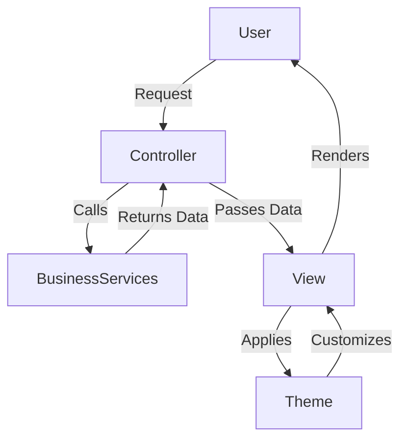

# Overview of the Presentation Layer

The Presentation Layer in nopCommerce is responsible for managing the user interface and user experience. It controls how data is displayed to users and facilitates user interactions through web pages and views, serving as the bridge between users and the platform's underlying business logic.

# Implementation with [ASP.NET](http://ASP.NET) Core MVC

This layer is implemented using [ASP.NET](http://ASP.NET) Core MVC, which provides essential features such as routing, controllers, views, and model binding. These components enable the dynamic retrieval and presentation of data, as well as efficient handling of user inputs, ensuring a responsive and interactive user interface.

# Extensibility through Themes and Plugins

To support customization and modularity, the Presentation Layer allows extensibility via themes and plugins. Developers can modify the platform's appearance and behavior without changing the core codebase, which simplifies updates and maintenance while enabling tailored user experiences.

# Cross-Platform Compatibility

Leveraging [ASP.NET](http://ASP.NET) Core ensures that the Presentation Layer is cross-platform compatible. This design choice allows nopCommerce to run consistently across different operating systems, providing a uniform user experience regardless of the deployment environment.

# Data Flow in the Presentation Layer

When a user interacts with the storefront, the Presentation Layer processes requests through controllers that communicate with business services to retrieve necessary data. The retrieved data is then passed to views, which render the dynamic content users see. Themes can be applied at this stage to alter the visual style without impacting the underlying logic.

&nbsp;

*This is an auto-generated document by Swimm 🌊 and has not yet been verified by a human*

<SwmMeta version="3.0.0" repo-id="Z2l0aHViJTNBJTNBbnBDb21tZXJjZUFTUERvdG5ldCUzQSUzQXVtYWxpbmdhc3dhbWk=" repo-name="npCommerceASPDotnet">Powered by [Swimm](https://app.swimm.io/)</SwmMeta>
