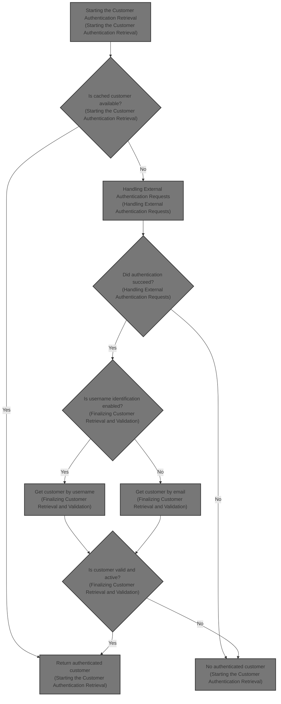
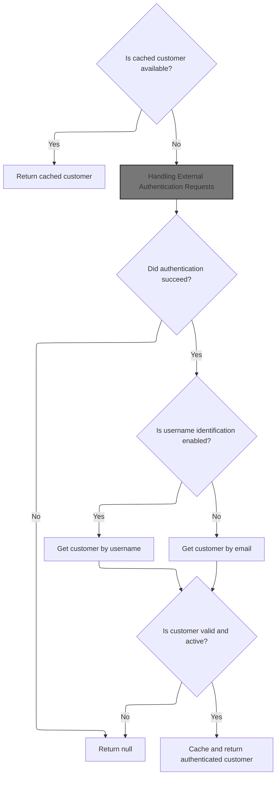
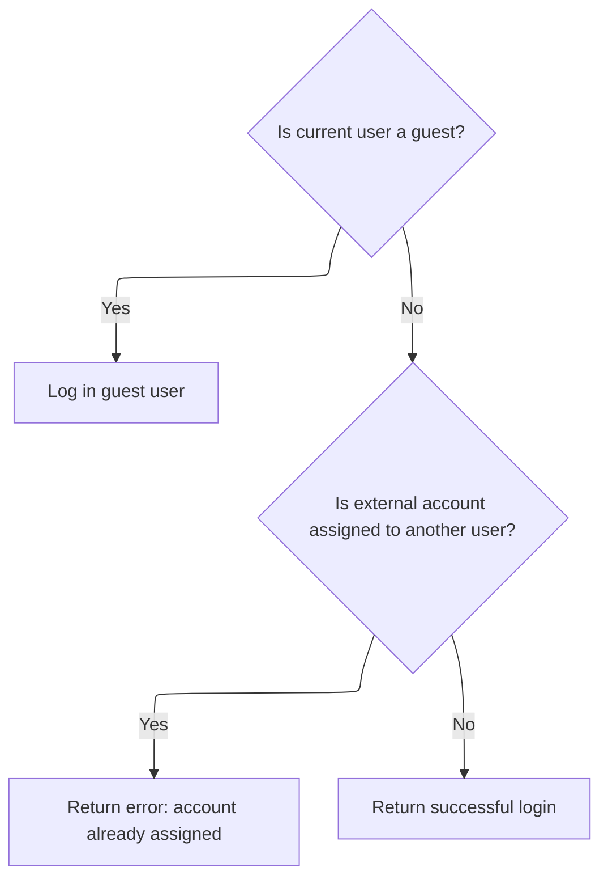
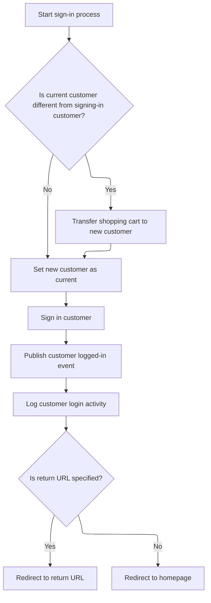
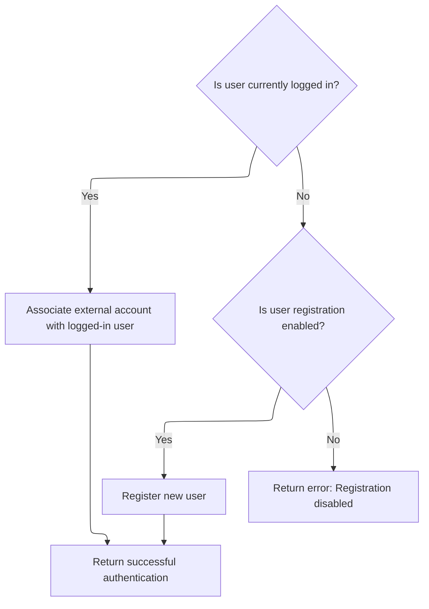
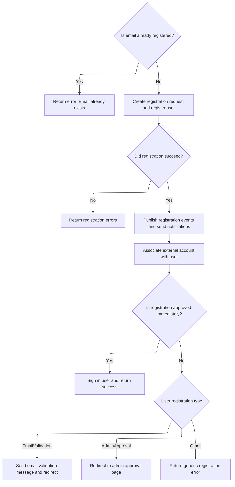
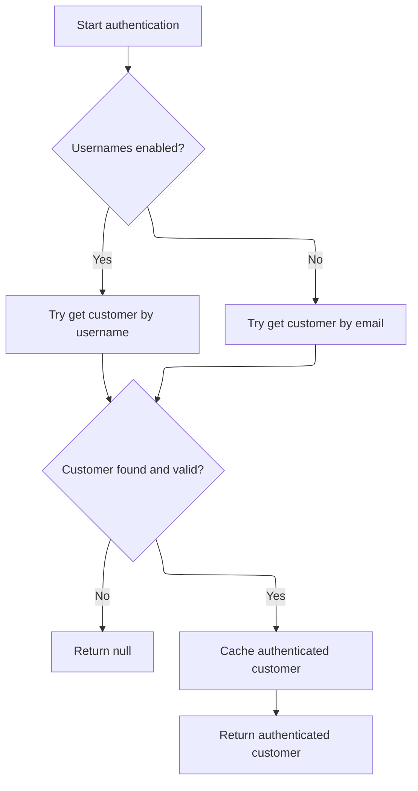

This document describes the flow of identifying and retrieving the authenticated customer based on the current HTTP context. It covers checking existing authentication, handling external authentication methods, and validating the customer to ensure they are active and registered before returning the customer object for use in the system.



# Starting the Customer Authentication Retrieval



<SwmSnippet path="/src/Libraries/Nop.Services/Authentication/CookieAuthenticationService.cs" line="100">

---

Here we start by checking if we already have a cached customer to avoid redundant work. Then, we authenticate the HTTP context using the configured scheme. If that fails, we bail out early. This sets the stage for fetching the customer details, which we do next by calling external authentication services to handle more complex scenarios.

```c#
        public virtual async Task<Customer> GetAuthenticatedCustomerAsync()
        {
            //whether there is a cached customer
            if (_cachedCustomer != null)
                return _cachedCustomer;

            //try to get authenticated user identity
            var authenticateResult = await _httpContextAccessor.HttpContext.AuthenticateAsync(NopAuthenticationDefaults.AuthenticationScheme);
            if (!authenticateResult.Succeeded)
                return null;

```

---

</SwmSnippet>

## Handling External Authentication Requests

<SwmSnippet path="/src/Libraries/Nop.Services/Authentication/External/ExternalAuthenticationService.cs" line="248">

---

In `AuthenticateAsync` we first verify the external authentication plugin is active for the current store and user. If not, we return an error. Then, we check if there's a logged-in user and try to find an associated user for the external credentials. If found, we proceed to authenticate that user.

```c#
        public virtual async Task<IActionResult> AuthenticateAsync(ExternalAuthenticationParameters parameters, string returnUrl = null)
        {
            if (parameters == null)
                throw new ArgumentNullException(nameof(parameters));

            if (!await _authenticationPluginManager.IsPluginActiveAsync(parameters.ProviderSystemName, await _workContext.GetCurrentCustomerAsync(), (await _storeContext.GetCurrentStoreAsync()).Id))
                return ErrorAuthentication(new[] { "External authentication method cannot be loaded" }, returnUrl);

            //get current logged-in user
            var currentLoggedInUser = await _customerService.IsRegisteredAsync(await _workContext.GetCurrentCustomerAsync()) ? await _workContext.GetCurrentCustomerAsync() : null;

            //authenticate associated user if already exists
            var associatedUser = await GetUserByExternalAuthenticationParametersAsync(parameters);
            if (associatedUser != null)
                return await AuthenticateExistingUserAsync(associatedUser, currentLoggedInUser, returnUrl);

```

---

</SwmSnippet>

### Authenticating an Existing External User



<SwmSnippet path="/src/Libraries/Nop.Services/Authentication/External/ExternalAuthenticationService.cs" line="86">

---

`AuthenticateExistingUserAsync` handles three cases: no logged-in user, so it signs in the associated user; logged-in user differs from associated user, so it returns an error; or the user tries to log in as themselves, so it just confirms success.

```c#
        protected virtual async Task<IActionResult> AuthenticateExistingUserAsync(Customer associatedUser, Customer currentLoggedInUser, string returnUrl)
        {
            //log in guest user
            if (currentLoggedInUser == null)
                return await _customerRegistrationService.SignInCustomerAsync(associatedUser, returnUrl);

            //account is already assigned to another user
            if (currentLoggedInUser.Id != associatedUser.Id)
                return ErrorAuthentication(new[] { await _localizationService.GetResourceAsync("Account.AssociatedExternalAuth.AccountAlreadyAssigned") }, returnUrl);

            //or the user try to log in as himself. bit weird
            return SuccessfulAuthentication(returnUrl);
        }
```

---

</SwmSnippet>

### Signing In the Customer and Migrating Cart



<SwmSnippet path="/src/Libraries/Nop.Services/Customers/CustomerRegistrationService.cs" line="415">

---

In `SignInCustomerAsync` we check if the current customer differs from the one signing in. If so, we migrate their shopping cart to the new customer and update the current customer context.

```c#
        public virtual async Task<IActionResult> SignInCustomerAsync(Customer customer, string returnUrl, bool isPersist = false)
        {
            if ((await _workContext.GetCurrentCustomerAsync())?.Id != customer.Id)
            {
                //migrate shopping cart
                await _shoppingCartService.MigrateShoppingCartAsync(await _workContext.GetCurrentCustomerAsync(), customer, true);

                await _workContext.SetCurrentCustomerAsync(customer);
            }

```

---

</SwmSnippet>

<SwmSnippet path="/src/Libraries/Nop.Services/Customers/CustomerRegistrationService.cs" line="425">

---

After updating the current customer, `SignInCustomerAsync` signs in the user, triggers login events and activity logs, then redirects to the return URL or homepage.

```c#
            //sign in new customer
            await _authenticationService.SignInAsync(customer, isPersist);

            //raise event       
            await _eventPublisher.PublishAsync(new CustomerLoggedinEvent(customer));

            //activity log
            await _customerActivityService.InsertActivityAsync(customer, "PublicStore.Login",
                await _localizationService.GetResourceAsync("ActivityLog.PublicStore.Login"), customer);

            //redirect to the return URL if it's specified
            if (!string.IsNullOrEmpty(returnUrl))
                return new RedirectResult(returnUrl);

            return new RedirectToRouteResult("Homepage", null);
        }
```

---

</SwmSnippet>

### Handling New External User Authentication

<SwmSnippet path="/src/Libraries/Nop.Services/Authentication/External/ExternalAuthenticationService.cs" line="264">

---

After trying to authenticate an existing user, the flow moves to `AuthenticateNewUserAsync` to handle new user association or registration.

```c#
            //or associate and authenticate new user
            return await AuthenticateNewUserAsync(currentLoggedInUser, parameters, returnUrl);
        }
```

---

</SwmSnippet>

## Associating or Registering New External Users



<SwmSnippet path="/src/Libraries/Nop.Services/Authentication/External/ExternalAuthenticationService.cs" line="110">

---

`AuthenticateNewUserAsync` checks if there's a logged-in user to associate the external account with. If not, it tries to register a new user unless registration is disabled, returning errors accordingly.

```c#
        protected virtual async Task<IActionResult> AuthenticateNewUserAsync(Customer currentLoggedInUser, ExternalAuthenticationParameters parameters, string returnUrl)
        {
            //associate external account with logged-in user
            if (currentLoggedInUser != null)
            {
                await AssociateExternalAccountWithUserAsync(currentLoggedInUser, parameters);

                return SuccessfulAuthentication(returnUrl);
            }

            //or try to register new user
            if (_customerSettings.UserRegistrationType != UserRegistrationType.Disabled)
                return await RegisterNewUserAsync(parameters, returnUrl);

            //registration is disabled
            return ErrorAuthentication(new[] { "Registration is disabled" }, returnUrl);
        }
```

---

</SwmSnippet>

## Registering a New User via External Authentication



<SwmSnippet path="/src/Libraries/Nop.Services/Authentication/External/ExternalAuthenticationService.cs" line="137">

---

In `RegisterNewUserAsync` we first check if the email is already registered to avoid duplicates. Then, we create a registration request and call the customer registration service to register the user. After that, we trigger events and notifications, and associate the external account with the new user.

```c#
        protected virtual async Task<IActionResult> RegisterNewUserAsync(ExternalAuthenticationParameters parameters, string returnUrl)
        {
            //check whether the specified email has been already registered
            if (await _customerService.GetCustomerByEmailAsync(parameters.Email) != null)
            {
                var alreadyExistsError = string.Format(await _localizationService.GetResourceAsync("Account.AssociatedExternalAuth.EmailAlreadyExists"),
                    !string.IsNullOrEmpty(parameters.ExternalDisplayIdentifier) ? parameters.ExternalDisplayIdentifier : parameters.ExternalIdentifier);
                return ErrorAuthentication(new[] { alreadyExistsError }, returnUrl);
            }

            //registration is approved if validation isn't required
            var registrationIsApproved = _customerSettings.UserRegistrationType == UserRegistrationType.Standard ||
                (_customerSettings.UserRegistrationType == UserRegistrationType.EmailValidation && !_externalAuthenticationSettings.RequireEmailValidation);

            //create registration request
            var registrationRequest = new CustomerRegistrationRequest(await _workContext.GetCurrentCustomerAsync(),
                parameters.Email, parameters.Email,
                CommonHelper.GenerateRandomDigitCode(20),
                PasswordFormat.Hashed,
                (await _storeContext.GetCurrentStoreAsync()).Id,
                registrationIsApproved);

            //whether registration request has been completed successfully
            var registrationResult = await _customerRegistrationService.RegisterCustomerAsync(registrationRequest);
            if (!registrationResult.Success)
                return ErrorAuthentication(registrationResult.Errors, returnUrl);

            //allow to save other customer values by consuming this event
            await _eventPublisher.PublishAsync(new CustomerAutoRegisteredByExternalMethodEvent(await _workContext.GetCurrentCustomerAsync(), parameters));

            //raise customer registered event
            await _eventPublisher.PublishAsync(new CustomerRegisteredEvent(await _workContext.GetCurrentCustomerAsync()));

            //store owner notifications
            if (_customerSettings.NotifyNewCustomerRegistration)
                await _workflowMessageService.SendCustomerRegisteredNotificationMessageAsync(await _workContext.GetCurrentCustomerAsync(), _localizationSettings.DefaultAdminLanguageId);

            //associate external account with registered user
            await AssociateExternalAccountWithUserAsync(await _workContext.GetCurrentCustomerAsync(), parameters);

            //authenticate
            if (registrationIsApproved)
            {
                await _workflowMessageService.SendCustomerWelcomeMessageAsync(await _workContext.GetCurrentCustomerAsync(), (await _workContext.GetWorkingLanguageAsync()).Id);

                //raise event       
                await _eventPublisher.PublishAsync(new CustomerActivatedEvent(await _workContext.GetCurrentCustomerAsync()));

                return await _customerRegistrationService.SignInCustomerAsync(await _workContext.GetCurrentCustomerAsync(), returnUrl, true);
            }

```

---

</SwmSnippet>

<SwmSnippet path="/src/Libraries/Nop.Services/Authentication/External/ExternalAuthenticationService.cs" line="188">

---

After registering the user, `RegisterNewUserAsync` handles cases where registration requires email validation or admin approval by sending emails and redirecting accordingly. If registration fails, it returns an error.

```c#
            //registration is succeeded but isn't activated
            if (_customerSettings.UserRegistrationType == UserRegistrationType.EmailValidation)
            {
                //email validation message
                await _genericAttributeService.SaveAttributeAsync(await _workContext.GetCurrentCustomerAsync(), NopCustomerDefaults.AccountActivationTokenAttribute, Guid.NewGuid().ToString());
                await _workflowMessageService.SendCustomerEmailValidationMessageAsync(await _workContext.GetCurrentCustomerAsync(), (await _workContext.GetWorkingLanguageAsync()).Id);

                return new RedirectToRouteResult("RegisterResult", new { resultId = (int)UserRegistrationType.EmailValidation, returnUrl });
            }

            //registration is succeeded but isn't approved by admin
            if (_customerSettings.UserRegistrationType == UserRegistrationType.AdminApproval)
                return new RedirectToRouteResult("RegisterResult", new { resultId = (int)UserRegistrationType.AdminApproval, returnUrl });

            return ErrorAuthentication(new[] { "Error on registration" }, returnUrl);
        }
```

---

</SwmSnippet>

## Finalizing Customer Retrieval and Validation



<SwmSnippet path="/src/Libraries/Nop.Services/Authentication/CookieAuthenticationService.cs" line="111">

---

We pick username or email based on settings, validate the customer, cache if valid, or return null.

```c#
            Customer customer = null;
            if (_customerSettings.UsernamesEnabled)
            {
                //try to get customer by username
                var usernameClaim = authenticateResult.Principal.FindFirst(claim => claim.Type == ClaimTypes.Name
                    && claim.Issuer.Equals(NopAuthenticationDefaults.ClaimsIssuer, StringComparison.InvariantCultureIgnoreCase));
                if (usernameClaim != null)
                    customer = await _customerService.GetCustomerByUsernameAsync(usernameClaim.Value);
            }
            else
            {
                //try to get customer by email
                var emailClaim = authenticateResult.Principal.FindFirst(claim => claim.Type == ClaimTypes.Email
                    && claim.Issuer.Equals(NopAuthenticationDefaults.ClaimsIssuer, StringComparison.InvariantCultureIgnoreCase));
                if (emailClaim != null)
                    customer = await _customerService.GetCustomerByEmailAsync(emailClaim.Value);
            }

            //whether the found customer is available
            if (customer == null || !customer.Active || customer.RequireReLogin || customer.Deleted || !await _customerService.IsRegisteredAsync(customer))
                return null;

            //cache authenticated customer
            _cachedCustomer = customer;

            return _cachedCustomer;
        }
```

---

</SwmSnippet>

&nbsp;

*This is an auto-generated document by Swimm 🌊 and has not yet been verified by a human*

<SwmMeta version="3.0.0" repo-id="Z2l0aHViJTNBJTNBbnBDb21tZXJjZUFTUERvdG5ldCUzQSUzQXVtYWxpbmdhc3dhbWk=" repo-name="npCommerceASPDotnet"><sup>Powered by [Swimm](https://app.swimm.io/)</sup></SwmMeta>
