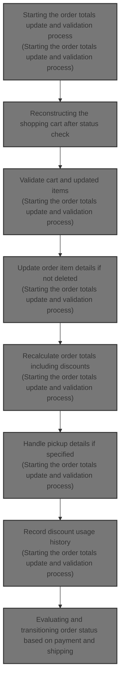
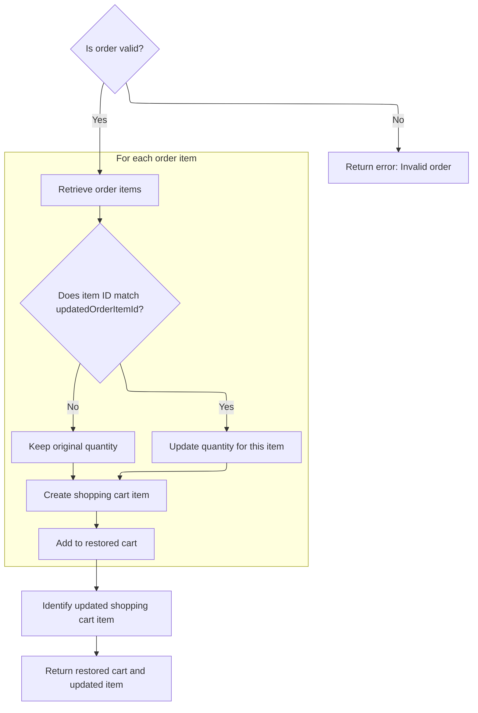

This document describes the flow of updating and validating order totals during order editing in an eCommerce platform. It ensures the shopping cart is restored and validated, order item details are updated, discounts and gift cards are applied, pickup details are handled, and the order status is updated accordingly.



# Where is this flow used?

This flow is used multiple times in the codebase as represented in the following diagram:

```mermaid
graph TD;
      cbf1c8d677ba32d1195d1382cda77077b1b1edcde337d949944101fe0fd08185(src/…/Controllers/OrderController.cs::OrderController.EditOrderItem) --> bc8679213db91d5df50bf032f598e0357efdb15feec4d05efa33bb4e2ca9bdcb(src/…/Orders/OrderProcessingService.cs::OrderProcessingService.UpdateOrderTotalsAsync)

a54f6e9976c9b90a9c97f787f70f900167660befed58d85a1f7bef78974a24fa(src/…/Controllers/OrderController.cs::OrderController.DeleteOrderItem) --> bc8679213db91d5df50bf032f598e0357efdb15feec4d05efa33bb4e2ca9bdcb(src/…/Orders/OrderProcessingService.cs::OrderProcessingService.UpdateOrderTotalsAsync)

b49809f332c1cea0cc5f6cc4f2851b7a52a5e7d156f1720f3c8874ab5a9560cb(src/…/Controllers/OrderController.cs::OrderController.AddProductToOrderDetails) --> bc8679213db91d5df50bf032f598e0357efdb15feec4d05efa33bb4e2ca9bdcb(src/…/Orders/OrderProcessingService.cs::OrderProcessingService.UpdateOrderTotalsAsync)


classDef mainFlowStyle color:#000000,fill:#7CB9F4
classDef rootsStyle color:#000000,fill:#00FFF4
classDef Style1 color:#000000,fill:#00FFAA
classDef Style2 color:#000000,fill:#FFFF00
classDef Style3 color:#000000,fill:#AA7CB9

%% Swimm:
%% graph TD;
%%       cbf1c8d677ba32d1195d1382cda77077b1b1edcde337d949944101fe0fd08185(<SwmPath>[src/…/Controllers/OrderController.cs](src/Presentation/Nop.Web/Areas/Admin/Controllers/OrderController.cs)</SwmPath>::OrderController.EditOrderItem) --> bc8679213db91d5df50bf032f598e0357efdb15feec4d05efa33bb4e2ca9bdcb(<SwmPath>[src/…/Orders/OrderProcessingService.cs](src/Libraries/Nop.Services/Orders/OrderProcessingService.cs)</SwmPath>::OrderProcessingService.UpdateOrderTotalsAsync)
%% 
%% a54f6e9976c9b90a9c97f787f70f900167660befed58d85a1f7bef78974a24fa(<SwmPath>[src/…/Controllers/OrderController.cs](src/Presentation/Nop.Web/Areas/Admin/Controllers/OrderController.cs)</SwmPath>::OrderController.DeleteOrderItem) --> bc8679213db91d5df50bf032f598e0357efdb15feec4d05efa33bb4e2ca9bdcb(<SwmPath>[src/…/Orders/OrderProcessingService.cs](src/Libraries/Nop.Services/Orders/OrderProcessingService.cs)</SwmPath>::OrderProcessingService.UpdateOrderTotalsAsync)
%% 
%% b49809f332c1cea0cc5f6cc4f2851b7a52a5e7d156f1720f3c8874ab5a9560cb(<SwmPath>[src/…/Controllers/OrderController.cs](src/Presentation/Nop.Web/Areas/Admin/Controllers/OrderController.cs)</SwmPath>::OrderController.AddProductToOrderDetails) --> bc8679213db91d5df50bf032f598e0357efdb15feec4d05efa33bb4e2ca9bdcb(<SwmPath>[src/…/Orders/OrderProcessingService.cs](src/Libraries/Nop.Services/Orders/OrderProcessingService.cs)</SwmPath>::OrderProcessingService.UpdateOrderTotalsAsync)
%% 
%% 
%% classDef mainFlowStyle color:#000000,fill:#7CB9F4
%% classDef rootsStyle color:#000000,fill:#00FFF4
%% classDef Style1 color:#000000,fill:#00FFAA
%% classDef Style2 color:#000000,fill:#FFFF00
%% classDef Style3 color:#000000,fill:#AA7CB9
```



# Starting the order totals update and validation process

This section handles updating and validating order totals during order editing, including restoring the cart, validating items, applying discounts and gift cards, updating pickup details, and checking order status.

| Category        | Rule Name                     | Description                                                                                                                                                   |
| --------------- | ----------------------------- | ------------------------------------------------------------------------------------------------------------------------------------------------------------- |
| Data validation | Collect cart warnings         | All shopping cart warnings must be collected and presented to ensure the order is valid and no issues exist with the items.                                   |
| Data validation | Validate updated order item   | If an order item is not deleted, detailed validation warnings for that item must be collected based on product, quantity, attributes, and rental dates.       |
| Business logic  | Auto-update toggle            | If the system setting to auto-update order totals on editing is disabled, the update process should not proceed.                                              |
| Business logic  | Restore cart from order items | The shopping cart must be restored from the current order items before any validation or update occurs.                                                       |
| Business logic  | Update order item details     | The order item details such as weight, original product cost, attribute description, and gift cards must be updated to reflect the current state of the item. |
| Business logic  | Recalculate order totals      | Order totals must be recalculated after all item and cart updates to ensure pricing accuracy.                                                                 |
| Business logic  | Update pickup details         | If a pickup point is specified, the order must be marked as pickup in store, and the pickup address and shipping method details must be updated accordingly.  |
| Business logic  | Record discount usage history | Discount usage history must be recorded for all applied discounts that have not been previously recorded for the order and customer.                          |
| Business logic  | Check and update order status | After updating order details and discounts, the order status must be checked and updated to reflect the current state of the order.                           |
| Technical step  | Persist updated order         | The updated order must be saved after all changes to ensure data consistency.                                                                                 |

<SwmSnippet path="/src/Libraries/Nop.Services/Orders/OrderProcessingService.cs" line="1653">

---

In <SwmToken path="src/Libraries/Nop.Services/Orders/OrderProcessingService.cs" pos="1653:9:9" line-data="        public virtual async Task UpdateOrderTotalsAsync(UpdateOrderParameters updateOrderParameters)">`UpdateOrderTotalsAsync`</SwmToken>, we restore and validate the cart, update item and pickup details, handle discounts and gift cards, update the order, and check its status to keep everything consistent.

```c#
        public virtual async Task UpdateOrderTotalsAsync(UpdateOrderParameters updateOrderParameters)
        {
            if (!_orderSettings.AutoUpdateOrderTotalsOnEditingOrder)
                return;

            var updatedOrder = updateOrderParameters.UpdatedOrder;
            var updatedOrderItem = updateOrderParameters.UpdatedOrderItem;

            //restore shopping cart from order items
            var (restoredCart, updatedShoppingCartItem) = await restoreShoppingCartAsync(updatedOrder, updatedOrderItem.Id);

            var itemDeleted = updatedShoppingCartItem is null;

            //validate shopping cart for warnings
            updateOrderParameters.Warnings.AddRange(await _shoppingCartService.GetShoppingCartWarningsAsync(restoredCart, string.Empty, false));

            var customer = await _customerService.GetCustomerByIdAsync(updatedOrder.CustomerId);

            if (!itemDeleted)
            {
                var product = await _productService.GetProductByIdAsync(updatedShoppingCartItem.ProductId);

                updateOrderParameters.Warnings.AddRange(await _shoppingCartService.GetShoppingCartItemWarningsAsync(customer, updatedShoppingCartItem.ShoppingCartType,
                    product, updatedOrder.StoreId, updatedShoppingCartItem.AttributesXml, updatedShoppingCartItem.CustomerEnteredPrice,
                    updatedShoppingCartItem.RentalStartDateUtc, updatedShoppingCartItem.RentalEndDateUtc, updatedShoppingCartItem.Quantity, false, updatedShoppingCartItem.Id));

                updatedOrderItem.ItemWeight = await _shippingService.GetShoppingCartItemWeightAsync(updatedShoppingCartItem);
                updatedOrderItem.OriginalProductCost = await _priceCalculationService.GetProductCostAsync(product, updatedShoppingCartItem.AttributesXml);
                updatedOrderItem.AttributeDescription = await _productAttributeFormatter.FormatAttributesAsync(product,
                    updatedShoppingCartItem.AttributesXml, customer);

                //gift cards
                await AddGiftCardsAsync(product, updatedShoppingCartItem.AttributesXml, updatedShoppingCartItem.Quantity, updatedOrderItem, updatedOrderItem.UnitPriceExclTax);
            }

            await _orderTotalCalculationService.UpdateOrderTotalsAsync(updateOrderParameters, restoredCart);

            if (updateOrderParameters.PickupPoint != null)
            {
                updatedOrder.PickupInStore = true;

                var pickupAddress = new Address
                {
                    Address1 = updateOrderParameters.PickupPoint.Address,
                    City = updateOrderParameters.PickupPoint.City,
                    County = updateOrderParameters.PickupPoint.County,
                    CountryId = (await _countryService.GetCountryByTwoLetterIsoCodeAsync(updateOrderParameters.PickupPoint.CountryCode))?.Id,
                    ZipPostalCode = updateOrderParameters.PickupPoint.ZipPostalCode,
                    CreatedOnUtc = DateTime.UtcNow
                };

                await _addressService.InsertAddressAsync(pickupAddress);

                updatedOrder.PickupAddressId = pickupAddress.Id;
                var shippingMethod = !string.IsNullOrEmpty(updateOrderParameters.PickupPoint.Name) ?
                    string.Format(await _localizationService.GetResourceAsync("Checkout.PickupPoints.Name"), updateOrderParameters.PickupPoint.Name) :
                    await _localizationService.GetResourceAsync("Checkout.PickupPoints.NullName");
                updatedOrder.ShippingMethod = shippingMethod;
                updatedOrder.ShippingRateComputationMethodSystemName = updateOrderParameters.PickupPoint.ProviderSystemName;
            }

            await _orderService.UpdateOrderAsync(updatedOrder);

            //discount usage history
            var discountUsageHistoryForOrder = await _discountService.GetAllDiscountUsageHistoryAsync(null, customer.Id, updatedOrder.Id);
            foreach (var discount in updateOrderParameters.AppliedDiscounts)
            {
                if (discountUsageHistoryForOrder.Any(history => history.DiscountId == discount.Id))
                    continue;

                var d = await _discountService.GetDiscountByIdAsync(discount.Id);
                if (d != null)
                {
                    await _discountService.InsertDiscountUsageHistoryAsync(new DiscountUsageHistory
                    {
                        DiscountId = d.Id,
                        OrderId = updatedOrder.Id,
                        CreatedOnUtc = DateTime.UtcNow
                    });
                }
            }
```

---

</SwmSnippet>

<SwmSnippet path="/src/Libraries/Nop.Services/Orders/OrderProcessingService.cs" line="1735">

---

After updating order details and discounts, we call <SwmToken path="src/Libraries/Nop.Services/Orders/OrderProcessingService.cs" pos="1735:3:3" line-data="            await CheckOrderStatusAsync(updatedOrder);">`CheckOrderStatusAsync`</SwmToken> to update the order status accordingly.

```c#
            await CheckOrderStatusAsync(updatedOrder);

```

---

</SwmSnippet>

## Evaluating and transitioning order status based on payment and shipping

```mermaid
%%{init: {"flowchart": {"defaultRenderer": "elk"}} }%%
flowchart TD
    node1["Start checking order status"] --> node2{"Order is paid but missing paid date?"}
    click node1 openCode "src/Libraries/Nop.Services/Orders/OrderProcessingService.cs:1510:1514"
    node2 -->|"Yes"| node3["Set paid date"]
    click node2 openCode "src/Libraries/Nop.Services/Orders/OrderProcessingService.cs:1514:1519"
    node2 -->|"No"| node4
    node3 --> node4
    node4{"Order status is Pending?"}
    click node4 openCode "src/Libraries/Nop.Services/Orders/OrderProcessingService.cs:1521:1534"
    node4 -->|"Yes"| node5{"Payment authorized or paid?"}
    click node5 openCode "src/Libraries/Nop.Services/Orders/OrderProcessingService.cs:1524:1527"
    node5 -->|"Yes"| node6["Set status to Processing"]
    click node6 openCode "src/Libraries/Nop.Services/Orders/OrderProcessingService.cs:1526:1531"
    node5 -->|"No"| node7
    node4 -->|"No"| node8{"Order status Cancelled or Complete?"}
    click node8 openCode "src/Libraries/Nop.Services/Orders/OrderProcessingService.cs:1534:1538"
    node8 -->|"Yes"| node9["Exit"]
    node8 -->|"No"| node7
    node7{"Payment status is Paid?"}
    click node7 openCode "src/Libraries/Nop.Services/Orders/OrderProcessingService.cs:1540:1542"
    node7 -->|"No"| node9
    node7 -->|"Yes"| node10{"Shipping not required?"}
    click node10 openCode "src/Libraries/Nop.Services/Orders/OrderProcessingService.cs:1545:1550"
    node10 -->|"Yes"| node11["Mark order Complete"]
    click node11 openCode "src/Libraries/Nop.Services/Orders/OrderProcessingService.cs:1560:1562"
    node10 -->|"No"| node12{"Complete order only when delivered?"}
    click node12 openCode "src/Libraries/Nop.Services/Orders/OrderProcessingService.cs:1553:1558"
    node12 -->|"Yes"| node13{"Shipping status Delivered?"}
    click node13 openCode "src/Libraries/Nop.Services/Orders/OrderProcessingService.cs:1554:1559"
    node13 -->|"Yes"| node11
    node13 -->|"No"| node9
    node12 -->|"No"| node14{"Shipping status Shipped or Delivered?"}
    click node14 openCode "src/Libraries/Nop.Services/Orders/OrderProcessingService.cs:1556:1559"
    node14 -->|"Yes"| node11
    node14 -->|"No"| node9
    node11 --> node9
classDef HeadingStyle fill:#777777,stroke:#333,stroke-width:2px;

%% Swimm:
%% %%{init: {"flowchart": {"defaultRenderer": "elk"}} }%%
%% flowchart TD
%%     node1["Start checking order status"] --> node2{"Order is paid but missing paid date?"}
%%     click node1 openCode "<SwmPath>[src/…/Orders/OrderProcessingService.cs](src/Libraries/Nop.Services/Orders/OrderProcessingService.cs)</SwmPath>:1510:1514"
%%     node2 -->|"Yes"| node3["Set paid date"]
%%     click node2 openCode "<SwmPath>[src/…/Orders/OrderProcessingService.cs](src/Libraries/Nop.Services/Orders/OrderProcessingService.cs)</SwmPath>:1514:1519"
%%     node2 -->|"No"| node4
%%     node3 --> node4
%%     node4{"Order status is Pending?"}
%%     click node4 openCode "<SwmPath>[src/…/Orders/OrderProcessingService.cs](src/Libraries/Nop.Services/Orders/OrderProcessingService.cs)</SwmPath>:1521:1534"
%%     node4 -->|"Yes"| node5{"Payment authorized or paid?"}
%%     click node5 openCode "<SwmPath>[src/…/Orders/OrderProcessingService.cs](src/Libraries/Nop.Services/Orders/OrderProcessingService.cs)</SwmPath>:1524:1527"
%%     node5 -->|"Yes"| node6["Set status to Processing"]
%%     click node6 openCode "<SwmPath>[src/…/Orders/OrderProcessingService.cs](src/Libraries/Nop.Services/Orders/OrderProcessingService.cs)</SwmPath>:1526:1531"
%%     node5 -->|"No"| node7
%%     node4 -->|"No"| node8{"Order status Cancelled or Complete?"}
%%     click node8 openCode "<SwmPath>[src/…/Orders/OrderProcessingService.cs](src/Libraries/Nop.Services/Orders/OrderProcessingService.cs)</SwmPath>:1534:1538"
%%     node8 -->|"Yes"| node9["Exit"]
%%     node8 -->|"No"| node7
%%     node7{"Payment status is Paid?"}
%%     click node7 openCode "<SwmPath>[src/…/Orders/OrderProcessingService.cs](src/Libraries/Nop.Services/Orders/OrderProcessingService.cs)</SwmPath>:1540:1542"
%%     node7 -->|"No"| node9
%%     node7 -->|"Yes"| node10{"Shipping not required?"}
%%     click node10 openCode "<SwmPath>[src/…/Orders/OrderProcessingService.cs](src/Libraries/Nop.Services/Orders/OrderProcessingService.cs)</SwmPath>:1545:1550"
%%     node10 -->|"Yes"| node11["Mark order Complete"]
%%     click node11 openCode "<SwmPath>[src/…/Orders/OrderProcessingService.cs](src/Libraries/Nop.Services/Orders/OrderProcessingService.cs)</SwmPath>:1560:1562"
%%     node10 -->|"No"| node12{"Complete order only when delivered?"}
%%     click node12 openCode "<SwmPath>[src/…/Orders/OrderProcessingService.cs](src/Libraries/Nop.Services/Orders/OrderProcessingService.cs)</SwmPath>:1553:1558"
%%     node12 -->|"Yes"| node13{"Shipping status Delivered?"}
%%     click node13 openCode "<SwmPath>[src/…/Orders/OrderProcessingService.cs](src/Libraries/Nop.Services/Orders/OrderProcessingService.cs)</SwmPath>:1554:1559"
%%     node13 -->|"Yes"| node11
%%     node13 -->|"No"| node9
%%     node12 -->|"No"| node14{"Shipping status Shipped or Delivered?"}
%%     click node14 openCode "<SwmPath>[src/…/Orders/OrderProcessingService.cs](src/Libraries/Nop.Services/Orders/OrderProcessingService.cs)</SwmPath>:1556:1559"
%%     node14 -->|"Yes"| node11
%%     node14 -->|"No"| node9
%%     node11 --> node9
%% classDef HeadingStyle fill:#777777,stroke:#333,stroke-width:2px;
```



This section manages the evaluation and transition of order status based on payment and shipping conditions, ensuring accurate order lifecycle management and customer notifications.

| Category       | Rule Name                                      | Description                                                                                                                                                                                                                                                                  |
| -------------- | ---------------------------------------------- | ---------------------------------------------------------------------------------------------------------------------------------------------------------------------------------------------------------------------------------------------------------------------------- |
| Business logic | Set paid date on payment                       | If an order is marked as paid but does not have a paid date, the system must set the paid date to the current UTC time.                                                                                                                                                      |
| Business logic | Pending to Processing on payment               | If an order is in Pending status and payment is authorized or paid, the order status must transition to Processing.                                                                                                                                                          |
| Business logic | Pending to Processing on shipping              | If an order is in Pending status and the shipping status is Partially Shipped, Shipped, or Delivered, the order status must transition to Processing.                                                                                                                        |
| Business logic | No changes on Cancelled or Complete            | If an order is Cancelled or Complete, no further status changes should be made.                                                                                                                                                                                              |
| Business logic | Complete only if paid                          | If the payment status is not Paid, the order status should not be changed to Complete.                                                                                                                                                                                       |
| Business logic | Complete if no shipping required               | If shipping is not required for the order and payment is paid, the order should be marked as Complete.                                                                                                                                                                       |
| Business logic | Complete based on shipping status and settings | If shipping is required, the order completion depends on shipping status and settings: if configured to complete only when delivered, the order completes only when shipping status is Delivered; otherwise, completion occurs when shipping status is Shipped or Delivered. |
| Business logic | Add order status change note                   | When the order status changes, a note must be added recording the new status.                                                                                                                                                                                                |
| Business logic | Notify customer on completion                  | When an order status changes to Complete and notification is enabled, an email with optional PDF invoice attachment must be sent to the customer.                                                                                                                            |
| Business logic | Notify customer on cancellation                | When an order status changes to Cancelled and notification is enabled, an email must be sent to the customer.                                                                                                                                                                |
| Business logic | Award reward points on completion              | When an order is marked Complete, reward points must be awarded to the customer.                                                                                                                                                                                             |
| Business logic | Reduce reward points on cancellation           | When an order is marked Cancelled, reward points previously awarded must be reduced accordingly.                                                                                                                                                                             |
| Business logic | Activate gift cards on completion              | If the setting to activate gift cards after completing an order is enabled, gift cards purchased in the order must be activated upon order completion.                                                                                                                       |
| Business logic | Deactivate gift cards on cancellation          | If the setting to deactivate gift cards after cancelling an order is enabled, gift cards purchased in the order must be deactivated upon order cancellation.                                                                                                                 |

<SwmSnippet path="/src/Libraries/Nop.Services/Orders/OrderProcessingService.cs" line="1509">

---

<SwmToken path="src/Libraries/Nop.Services/Orders/OrderProcessingService.cs" pos="1509:9:9" line-data="        public virtual async Task CheckOrderStatusAsync(Order order)">`CheckOrderStatusAsync`</SwmToken> updates the order status based on payment and shipping states, using settings to decide when to mark it complete, and calls <SwmToken path="src/Libraries/Nop.Services/Orders/OrderProcessingService.cs" pos="1526:3:3" line-data="                        await SetOrderStatusAsync(order, OrderStatus.Processing, false);">`SetOrderStatusAsync`</SwmToken> to apply changes.

```c#
        public virtual async Task CheckOrderStatusAsync(Order order)
        {
            if (order == null)
                throw new ArgumentNullException(nameof(order));

            if (order.PaymentStatus == PaymentStatus.Paid && !order.PaidDateUtc.HasValue)
            {
                //ensure that paid date is set
                order.PaidDateUtc = DateTime.UtcNow;
                await _orderService.UpdateOrderAsync(order);
            }

            switch (order.OrderStatus)
            {
                case OrderStatus.Pending:
                    if (order.PaymentStatus == PaymentStatus.Authorized ||
                        order.PaymentStatus == PaymentStatus.Paid)
                        await SetOrderStatusAsync(order, OrderStatus.Processing, false);

                    if (order.ShippingStatus == ShippingStatus.PartiallyShipped ||
                        order.ShippingStatus == ShippingStatus.Shipped ||
                        order.ShippingStatus == ShippingStatus.Delivered)
                        await SetOrderStatusAsync(order, OrderStatus.Processing, false);

                    break;
                //is order complete?
                case OrderStatus.Cancelled:
                case OrderStatus.Complete:
                    return;
            }

            if (order.PaymentStatus != PaymentStatus.Paid)
                return;

            bool completed;

            if (order.ShippingStatus == ShippingStatus.ShippingNotRequired)
            {
                //shipping is not required
                completed = true;
            }
            else
            {
                //shipping is required
                if (_orderSettings.CompleteOrderWhenDelivered)
                    completed = order.ShippingStatus == ShippingStatus.Delivered;
                else
                    completed = order.ShippingStatus == ShippingStatus.Shipped ||
                                order.ShippingStatus == ShippingStatus.Delivered;
            }

            if (completed) 
                await SetOrderStatusAsync(order, OrderStatus.Complete, true);
        }
```

---

</SwmSnippet>

<SwmSnippet path="/src/Libraries/Nop.Services/Orders/OrderProcessingService.cs" line="1061">

---

<SwmToken path="src/Libraries/Nop.Services/Orders/OrderProcessingService.cs" pos="1061:9:9" line-data="        protected virtual async Task SetOrderStatusAsync(Order order, OrderStatus os, bool notifyCustomer)">`SetOrderStatusAsync`</SwmToken> updates the order status and saves it. It adds notes about the change, sends emails for completed or cancelled orders, manages reward points, and activates or deactivates gift cards based on settings. It skips work if the status is unchanged.

```c#
        protected virtual async Task SetOrderStatusAsync(Order order, OrderStatus os, bool notifyCustomer)
        {
            if (order == null)
                throw new ArgumentNullException(nameof(order));

            var prevOrderStatus = order.OrderStatus;
            if (prevOrderStatus == os)
                return;

            //set and save new order status
            order.OrderStatusId = (int)os;
            await _orderService.UpdateOrderAsync(order);

            //order notes, notifications
            await AddOrderNoteAsync(order, $"Order status has been changed to {await _localizationService.GetLocalizedEnumAsync(os)}");

            if (prevOrderStatus != OrderStatus.Complete &&
                os == OrderStatus.Complete
                && notifyCustomer)
            {
                //notification
                var orderCompletedAttachmentFilePath = _orderSettings.AttachPdfInvoiceToOrderCompletedEmail ?
                    await _pdfService.PrintOrderToPdfAsync(order) : null;
                var orderCompletedAttachmentFileName = _orderSettings.AttachPdfInvoiceToOrderCompletedEmail ?
                    "order.pdf" : null;
                var orderCompletedCustomerNotificationQueuedEmailIds = await _workflowMessageService
                    .SendOrderCompletedCustomerNotificationAsync(order, order.CustomerLanguageId, orderCompletedAttachmentFilePath,
                    orderCompletedAttachmentFileName);
                if (orderCompletedCustomerNotificationQueuedEmailIds.Any())
                    await AddOrderNoteAsync(order, $"\"Order completed\" email (to customer) has been queued. Queued email identifiers: {string.Join(", ", orderCompletedCustomerNotificationQueuedEmailIds)}.");
            }

            if (prevOrderStatus != OrderStatus.Cancelled &&
                os == OrderStatus.Cancelled
                && notifyCustomer)
            {
                //notification
                var orderCancelledCustomerNotificationQueuedEmailIds = await _workflowMessageService.SendOrderCancelledCustomerNotificationAsync(order, order.CustomerLanguageId);
                if (orderCancelledCustomerNotificationQueuedEmailIds.Any())
                    await AddOrderNoteAsync(order, $"\"Order cancelled\" email (to customer) has been queued. Queued email identifiers: {string.Join(", ", orderCancelledCustomerNotificationQueuedEmailIds)}.");
            }

            //reward points
            if (order.OrderStatus == OrderStatus.Complete) 
                await AwardRewardPointsAsync(order);

            if (order.OrderStatus == OrderStatus.Cancelled) 
                await ReduceRewardPointsAsync(order);

            //gift cards activation
            if (_orderSettings.ActivateGiftCardsAfterCompletingOrder && order.OrderStatus == OrderStatus.Complete) 
                await SetActivatedValueForPurchasedGiftCardsAsync(order, true);

            //gift cards deactivation
            if (_orderSettings.DeactivateGiftCardsAfterCancellingOrder && order.OrderStatus == OrderStatus.Cancelled) 
                await SetActivatedValueForPurchasedGiftCardsAsync(order, false);
        }
```

---

</SwmSnippet>

## Reconstructing the shopping cart after status check



<SwmSnippet path="/src/Libraries/Nop.Services/Orders/OrderProcessingService.cs" line="1737">

---

After returning from <SwmToken path="src/Libraries/Nop.Services/Orders/OrderProcessingService.cs" pos="1509:9:9" line-data="        public virtual async Task CheckOrderStatusAsync(Order order)">`CheckOrderStatusAsync`</SwmToken> in <SwmToken path="src/Libraries/Nop.Services/Orders/OrderProcessingService.cs" pos="1653:9:9" line-data="        public virtual async Task UpdateOrderTotalsAsync(UpdateOrderParameters updateOrderParameters)">`UpdateOrderTotalsAsync`</SwmToken>, we define a nested function to rebuild the shopping cart from order items. It sets the updated quantity for the changed item and returns the cart and updated item for further use.

```c#
            async Task<(List<ShoppingCartItem> restoredCart, ShoppingCartItem updatedShoppingCartItem)> restoreShoppingCartAsync(Order order, int updatedOrderItemId)
            {
                if (order is null)
                    throw new ArgumentNullException(nameof(order));

                var cart = (await _orderService.GetOrderItemsAsync(order.Id)).Select(item => new ShoppingCartItem
                {
                    Id = item.Id,
                    AttributesXml = item.AttributesXml,
                    CustomerId = order.CustomerId,
                    ProductId = item.ProductId,
                    Quantity = item.Id == updatedOrderItemId ? updateOrderParameters.Quantity : item.Quantity,
                    RentalEndDateUtc = item.RentalEndDateUtc,
                    RentalStartDateUtc = item.RentalStartDateUtc,
                    ShoppingCartType = ShoppingCartType.ShoppingCart,
                    StoreId = order.StoreId
                }).ToList();

                //get shopping cart item which has been updated
                var cartItem = cart.FirstOrDefault(shoppingCartItem => shoppingCartItem.Id == updatedOrderItemId);

                return (cart, cartItem);
            }
        }
```

---

</SwmSnippet>

&nbsp;

*This is an auto-generated document by Swimm 🌊 and has not yet been verified by a human*

<SwmMeta version="3.0.0" repo-id="Z2l0aHViJTNBJTNBbnBDb21tZXJjZUFTUERvdG5ldCUzQSUzQXVtYWxpbmdhc3dhbWk=" repo-name="npCommerceASPDotnet"><sup>Powered by [Swimm](https://app.swimm.io/)</sup></SwmMeta>
