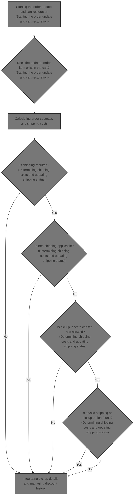

This document explains the flow of updating order totals after changes to order items in an eCommerce platform. It ensures the order reflects accurate costs, taxes, discounts, and shipping details after modifications.

The main steps include:

- Validating updated order items
- Calculating subtotals and shipping costs
- Finalizing tax and total amounts
- Updating order status and discount usage



# Where is this flow used?

This flow is used multiple times in the codebase as represented in the following diagram:

```mermaid
graph TD;
      cbf1c8d677ba32d1195d1382cda77077b1b1edcde337d949944101fe0fd08185(src/…/Controllers/OrderController.cs::OrderController.EditOrderItem) --> bc8679213db91d5df50bf032f598e0357efdb15feec4d05efa33bb4e2ca9bdcb(src/…/Orders/OrderProcessingService.cs::OrderProcessingService.UpdateOrderTotalsAsync)

a54f6e9976c9b90a9c97f787f70f900167660befed58d85a1f7bef78974a24fa(src/…/Controllers/OrderController.cs::OrderController.DeleteOrderItem) --> bc8679213db91d5df50bf032f598e0357efdb15feec4d05efa33bb4e2ca9bdcb(src/…/Orders/OrderProcessingService.cs::OrderProcessingService.UpdateOrderTotalsAsync)

b49809f332c1cea0cc5f6cc4f2851b7a52a5e7d156f1720f3c8874ab5a9560cb(src/…/Controllers/OrderController.cs::OrderController.AddProductToOrderDetails) --> bc8679213db91d5df50bf032f598e0357efdb15feec4d05efa33bb4e2ca9bdcb(src/…/Orders/OrderProcessingService.cs::OrderProcessingService.UpdateOrderTotalsAsync)


classDef mainFlowStyle color:#000000,fill:#7CB9F4
classDef rootsStyle color:#000000,fill:#00FFF4
classDef Style1 color:#000000,fill:#00FFAA
classDef Style2 color:#000000,fill:#FFFF00
classDef Style3 color:#000000,fill:#AA7CB9

%% Swimm:
%% graph TD;
%%       cbf1c8d677ba32d1195d1382cda77077b1b1edcde337d949944101fe0fd08185(<SwmPath>[src/…/Controllers/OrderController.cs](src/Presentation/Nop.Web/Areas/Admin/Controllers/OrderController.cs)</SwmPath>::OrderController.EditOrderItem) --> bc8679213db91d5df50bf032f598e0357efdb15feec4d05efa33bb4e2ca9bdcb(<SwmPath>[src/…/Orders/OrderProcessingService.cs](src/Libraries/Nop.Services/Orders/OrderProcessingService.cs)</SwmPath>::OrderProcessingService.UpdateOrderTotalsAsync)
%% 
%% a54f6e9976c9b90a9c97f787f70f900167660befed58d85a1f7bef78974a24fa(<SwmPath>[src/…/Controllers/OrderController.cs](src/Presentation/Nop.Web/Areas/Admin/Controllers/OrderController.cs)</SwmPath>::OrderController.DeleteOrderItem) --> bc8679213db91d5df50bf032f598e0357efdb15feec4d05efa33bb4e2ca9bdcb(<SwmPath>[src/…/Orders/OrderProcessingService.cs](src/Libraries/Nop.Services/Orders/OrderProcessingService.cs)</SwmPath>::OrderProcessingService.UpdateOrderTotalsAsync)
%% 
%% b49809f332c1cea0cc5f6cc4f2851b7a52a5e7d156f1720f3c8874ab5a9560cb(<SwmPath>[src/…/Controllers/OrderController.cs](src/Presentation/Nop.Web/Areas/Admin/Controllers/OrderController.cs)</SwmPath>::OrderController.AddProductToOrderDetails) --> bc8679213db91d5df50bf032f598e0357efdb15feec4d05efa33bb4e2ca9bdcb(<SwmPath>[src/…/Orders/OrderProcessingService.cs](src/Libraries/Nop.Services/Orders/OrderProcessingService.cs)</SwmPath>::OrderProcessingService.UpdateOrderTotalsAsync)
%% 
%% 
%% classDef mainFlowStyle color:#000000,fill:#7CB9F4
%% classDef rootsStyle color:#000000,fill:#00FFF4
%% classDef Style1 color:#000000,fill:#00FFAA
%% classDef Style2 color:#000000,fill:#FFFF00
%% classDef Style3 color:#000000,fill:#AA7CB9
```



# Starting the order update and cart restoration

This section handles updating order totals by restoring the shopping cart from order items, validating the cart, updating item details if the item still exists, and recalculating order totals.

| Category        | Rule Name            | Description                                                                                                                                                    |
| --------------- | -------------------- | -------------------------------------------------------------------------------------------------------------------------------------------------------------- |
| Data validation | Item existence check | If the updated order item no longer exists in the restored cart, no item-specific updates should be applied.                                                   |
| Data validation | Cart validation      | The shopping cart must be validated for warnings after restoration and before recalculating totals, and all warnings must be collected.                        |
| Business logic  | Auto-update toggle   | Order totals should only be updated if the system setting for auto-updating order totals on editing is enabled.                                                |
| Business logic  | Cart restoration     | The shopping cart must be restored from the current order items before any updates or validations are performed.                                               |
| Business logic  | Item detail update   | If the updated item exists, its weight, original product cost, attribute description, and gift card details must be updated to reflect the latest information. |
| Business logic  | Totals recalculation | Order totals must be recalculated using the updated shopping cart and order information after all validations and updates are complete.                        |

<SwmSnippet path="/src/Libraries/Nop.Services/Orders/OrderProcessingService.cs" line="1653">

---

In <SwmToken path="src/Libraries/Nop.Services/Orders/OrderProcessingService.cs" pos="1653:9:9" line-data="        public virtual async Task UpdateOrderTotalsAsync(UpdateOrderParameters updateOrderParameters)">`UpdateOrderTotalsAsync`</SwmToken> we start by restoring the shopping cart from the order items and validating it for warnings. Then, if the updated item still exists, we update its details like weight, cost, and attributes, and handle gift cards. Finally, we call the order total calculation service to recalculate totals based on this updated cart and order info.

```c#
        public virtual async Task UpdateOrderTotalsAsync(UpdateOrderParameters updateOrderParameters)
        {
            if (!_orderSettings.AutoUpdateOrderTotalsOnEditingOrder)
                return;

            var updatedOrder = updateOrderParameters.UpdatedOrder;
            var updatedOrderItem = updateOrderParameters.UpdatedOrderItem;

            //restore shopping cart from order items
            var (restoredCart, updatedShoppingCartItem) = await restoreShoppingCartAsync(updatedOrder, updatedOrderItem.Id);

            var itemDeleted = updatedShoppingCartItem is null;

            //validate shopping cart for warnings
            updateOrderParameters.Warnings.AddRange(await _shoppingCartService.GetShoppingCartWarningsAsync(restoredCart, string.Empty, false));

            var customer = await _customerService.GetCustomerByIdAsync(updatedOrder.CustomerId);

            if (!itemDeleted)
            {
                var product = await _productService.GetProductByIdAsync(updatedShoppingCartItem.ProductId);

                updateOrderParameters.Warnings.AddRange(await _shoppingCartService.GetShoppingCartItemWarningsAsync(customer, updatedShoppingCartItem.ShoppingCartType,
                    product, updatedOrder.StoreId, updatedShoppingCartItem.AttributesXml, updatedShoppingCartItem.CustomerEnteredPrice,
                    updatedShoppingCartItem.RentalStartDateUtc, updatedShoppingCartItem.RentalEndDateUtc, updatedShoppingCartItem.Quantity, false, updatedShoppingCartItem.Id));

                updatedOrderItem.ItemWeight = await _shippingService.GetShoppingCartItemWeightAsync(updatedShoppingCartItem);
                updatedOrderItem.OriginalProductCost = await _priceCalculationService.GetProductCostAsync(product, updatedShoppingCartItem.AttributesXml);
                updatedOrderItem.AttributeDescription = await _productAttributeFormatter.FormatAttributesAsync(product,
                    updatedShoppingCartItem.AttributesXml, customer);

                //gift cards
                await AddGiftCardsAsync(product, updatedShoppingCartItem.AttributesXml, updatedShoppingCartItem.Quantity, updatedOrderItem, updatedOrderItem.UnitPriceExclTax);
            }

            await _orderTotalCalculationService.UpdateOrderTotalsAsync(updateOrderParameters, restoredCart);

```

---

</SwmSnippet>

## Calculating order subtotals and shipping costs

This section handles the calculation of order subtotals and shipping costs in the eCommerce platform.

| Category       | Rule Name                           | Description                                                                                                     |
| -------------- | ----------------------------------- | --------------------------------------------------------------------------------------------------------------- |
| Business logic | Subtotal includes tax and discounts | The order subtotal must include applicable taxes and discounts before calculating shipping costs.               |
| Business logic | Shipping cost based on subtotal     | Shipping costs are calculated based on the order subtotal including taxes.                                      |
| Business logic | Accurate tax calculation            | Tax rates applied to the subtotal and shipping must be accurately calculated and reflected in the order totals. |
| Business logic | Discounts reduce subtotal           | Discounts applied to the order must reduce the subtotal before shipping costs are added.                        |

<SwmSnippet path="/src/Libraries/Nop.Services/Orders/OrderTotalCalculationService.cs" line="939">

---

In <SwmToken path="src/Libraries/Nop.Services/Orders/OrderTotalCalculationService.cs" pos="939:9:9" line-data="        public virtual async Task UpdateOrderTotalsAsync(UpdateOrderParameters updateOrderParameters, IList&lt;ShoppingCartItem&gt; restoredCart)">`UpdateOrderTotalsAsync`</SwmToken> of the total calculation service, we start by calculating the order subtotal including tax, discounts, and tax rates. Then we move on to calculating shipping costs based on the subtotal.

```c#
        public virtual async Task UpdateOrderTotalsAsync(UpdateOrderParameters updateOrderParameters, IList<ShoppingCartItem> restoredCart)
        {
            //sub total
            var (subTotalExclTax, subTotalInclTax, subTotalTaxRates, discountAmountExclTax) = await UpdateSubTotalAsync(updateOrderParameters, restoredCart);

            //shipping
            var (shippingTotalExclTax, shippingTotalInclTax, shippingTaxRate) = await UpdateShippingAsync(updateOrderParameters, restoredCart, subTotalInclTax, subTotalExclTax);

```

---

</SwmSnippet>

### Determining shipping costs and updating shipping status

```mermaid
%%{init: {"flowchart": {"defaultRenderer": "elk"}} }%%
flowchart TD
    node1{"Does the cart require shipping?"}
    click node1 openCode "src/Libraries/Nop.Services/Orders/OrderTotalCalculationService.cs:406:407"
    node1 -->|"No"| node2["Set shipping status to 'Shipping Not Required'"]
    click node2 openCode "src/Libraries/Nop.Services/Orders/OrderTotalCalculationService.cs:539:539"
    node1 -->|"Yes"| node3{"Is free shipping applicable?"}
    click node3 openCode "src/Libraries/Nop.Services/Orders/OrderTotalCalculationService.cs:408:409"
    node3 -->|"Yes"| node4["Set shipping total to zero"]
    click node4 openCode "src/Libraries/Nop.Services/Orders/OrderTotalCalculationService.cs:408:409"
    node3 -->|"No"| node5{"Is pickup in store chosen?"}
    click node5 openCode "src/Libraries/Nop.Services/Orders/OrderTotalCalculationService.cs:414:415"
    node5 -->|"Yes"| node6{"Is pickup in store allowed?"}
    click node6 openCode "src/Libraries/Nop.Services/Orders/OrderTotalCalculationService.cs:417:418"
    node6 -->|"Yes"| node7{"Is valid pickup point found?"}
    click node7 openCode "src/Libraries/Nop.Services/Orders/OrderTotalCalculationService.cs:419:427"
    node7 -->|"Yes"| node8["Set shipping total to pickup fee"]
    click node8 openCode "src/Libraries/Nop.Services/Orders/OrderTotalCalculationService.cs:427:427"
    node7 -->|"No"| node9["Add warning: Shipping method could not be loaded"]
    click node9 openCode "src/Libraries/Nop.Services/Orders/OrderTotalCalculationService.cs:429:430"
    node6 -->|"No"| node10["Add warning: Pickup in store not available"]
    click node10 openCode "src/Libraries/Nop.Services/Orders/OrderTotalCalculationService.cs:435:436"
    node5 -->|"No"| node11{"Is valid shipping option found?"}
    click node11 openCode "src/Libraries/Nop.Services/Orders/OrderTotalCalculationService.cs:441:448"
    node11 -->|"Yes"| node12["Set shipping total to shipping option rate"]
    click node12 openCode "src/Libraries/Nop.Services/Orders/OrderTotalCalculationService.cs:448:448"
    node11 -->|"No"| node13["Add warning: Shipping method could not be loaded"]
    click node13 openCode "src/Libraries/Nop.Services/Orders/OrderTotalCalculationService.cs:450:451"
    node8 --> node14["Add additional shipping charges"]
    click node14 openCode "src/Libraries/Nop.Services/Orders/OrderTotalCalculationService.cs:508:508"
    node12 --> node14
    node4 --> node14
    node14 --> node15["Apply shipping discounts"]
    click node15 openCode "src/Libraries/Nop.Services/Orders/OrderTotalCalculationService.cs:511:512"
    subgraph loop1["For each shipping discount"]
        node15 --> node16["Add discount if not already applied"]
        click node16 openCode "src/Libraries/Nop.Services/Orders/OrderTotalCalculationService.cs:533:535"
        node16 --> node15
    end
    node15 --> node17{"Is shipping total < 0?"}
    click node17 openCode "src/Libraries/Nop.Services/Orders/OrderTotalCalculationService.cs:513:515"
    node17 -->|"Yes"| node18["Set shipping total to zero"]
    click node18 openCode "src/Libraries/Nop.Services/Orders/OrderTotalCalculationService.cs:513:515"
    node17 -->|"No"| node19["Continue"]
    node19 --> node20["Calculate shipping total excl. tax"]
    click node20 openCode "src/Libraries/Nop.Services/Orders/OrderTotalCalculationService.cs:516:516"
    node20 --> node21["Calculate shipping total incl. tax and tax rate"]
    click node21 openCode "src/Libraries/Nop.Services/Orders/OrderTotalCalculationService.cs:517:518"
    node21 --> node22{"Update shipping status"}
    click node22 openCode "src/Libraries/Nop.Services/Orders/OrderTotalCalculationService.cs:527:531"
    node22 --> node23["Return shipping totals and tax rate"]
    click node23 openCode "src/Libraries/Nop.Services/Orders/OrderTotalCalculationService.cs:544:544"
classDef HeadingStyle fill:#777777,stroke:#333,stroke-width:2px;

%% Swimm:
%% %%{init: {"flowchart": {"defaultRenderer": "elk"}} }%%
%% flowchart TD
%%     node1{"Does the cart require shipping?"}
%%     click node1 openCode "<SwmPath>[src/…/Orders/OrderTotalCalculationService.cs](src/Libraries/Nop.Services/Orders/OrderTotalCalculationService.cs)</SwmPath>:406:407"
%%     node1 -->|"No"| node2["Set shipping status to 'Shipping Not Required'"]
%%     click node2 openCode "<SwmPath>[src/…/Orders/OrderTotalCalculationService.cs](src/Libraries/Nop.Services/Orders/OrderTotalCalculationService.cs)</SwmPath>:539:539"
%%     node1 -->|"Yes"| node3{"Is free shipping applicable?"}
%%     click node3 openCode "<SwmPath>[src/…/Orders/OrderTotalCalculationService.cs](src/Libraries/Nop.Services/Orders/OrderTotalCalculationService.cs)</SwmPath>:408:409"
%%     node3 -->|"Yes"| node4["Set shipping total to zero"]
%%     click node4 openCode "<SwmPath>[src/…/Orders/OrderTotalCalculationService.cs](src/Libraries/Nop.Services/Orders/OrderTotalCalculationService.cs)</SwmPath>:408:409"
%%     node3 -->|"No"| node5{"Is pickup in store chosen?"}
%%     click node5 openCode "<SwmPath>[src/…/Orders/OrderTotalCalculationService.cs](src/Libraries/Nop.Services/Orders/OrderTotalCalculationService.cs)</SwmPath>:414:415"
%%     node5 -->|"Yes"| node6{"Is pickup in store allowed?"}
%%     click node6 openCode "<SwmPath>[src/…/Orders/OrderTotalCalculationService.cs](src/Libraries/Nop.Services/Orders/OrderTotalCalculationService.cs)</SwmPath>:417:418"
%%     node6 -->|"Yes"| node7{"Is valid pickup point found?"}
%%     click node7 openCode "<SwmPath>[src/…/Orders/OrderTotalCalculationService.cs](src/Libraries/Nop.Services/Orders/OrderTotalCalculationService.cs)</SwmPath>:419:427"
%%     node7 -->|"Yes"| node8["Set shipping total to pickup fee"]
%%     click node8 openCode "<SwmPath>[src/…/Orders/OrderTotalCalculationService.cs](src/Libraries/Nop.Services/Orders/OrderTotalCalculationService.cs)</SwmPath>:427:427"
%%     node7 -->|"No"| node9["Add warning: Shipping method could not be loaded"]
%%     click node9 openCode "<SwmPath>[src/…/Orders/OrderTotalCalculationService.cs](src/Libraries/Nop.Services/Orders/OrderTotalCalculationService.cs)</SwmPath>:429:430"
%%     node6 -->|"No"| node10["Add warning: Pickup in store not available"]
%%     click node10 openCode "<SwmPath>[src/…/Orders/OrderTotalCalculationService.cs](src/Libraries/Nop.Services/Orders/OrderTotalCalculationService.cs)</SwmPath>:435:436"
%%     node5 -->|"No"| node11{"Is valid shipping option found?"}
%%     click node11 openCode "<SwmPath>[src/…/Orders/OrderTotalCalculationService.cs](src/Libraries/Nop.Services/Orders/OrderTotalCalculationService.cs)</SwmPath>:441:448"
%%     node11 -->|"Yes"| node12["Set shipping total to shipping option rate"]
%%     click node12 openCode "<SwmPath>[src/…/Orders/OrderTotalCalculationService.cs](src/Libraries/Nop.Services/Orders/OrderTotalCalculationService.cs)</SwmPath>:448:448"
%%     node11 -->|"No"| node13["Add warning: Shipping method could not be loaded"]
%%     click node13 openCode "<SwmPath>[src/…/Orders/OrderTotalCalculationService.cs](src/Libraries/Nop.Services/Orders/OrderTotalCalculationService.cs)</SwmPath>:450:451"
%%     node8 --> node14["Add additional shipping charges"]
%%     click node14 openCode "<SwmPath>[src/…/Orders/OrderTotalCalculationService.cs](src/Libraries/Nop.Services/Orders/OrderTotalCalculationService.cs)</SwmPath>:508:508"
%%     node12 --> node14
%%     node4 --> node14
%%     node14 --> node15["Apply shipping discounts"]
%%     click node15 openCode "<SwmPath>[src/…/Orders/OrderTotalCalculationService.cs](src/Libraries/Nop.Services/Orders/OrderTotalCalculationService.cs)</SwmPath>:511:512"
%%     subgraph loop1["For each shipping discount"]
%%         node15 --> node16["Add discount if not already applied"]
%%         click node16 openCode "<SwmPath>[src/…/Orders/OrderTotalCalculationService.cs](src/Libraries/Nop.Services/Orders/OrderTotalCalculationService.cs)</SwmPath>:533:535"
%%         node16 --> node15
%%     end
%%     node15 --> node17{"Is shipping total < 0?"}
%%     click node17 openCode "<SwmPath>[src/…/Orders/OrderTotalCalculationService.cs](src/Libraries/Nop.Services/Orders/OrderTotalCalculationService.cs)</SwmPath>:513:515"
%%     node17 -->|"Yes"| node18["Set shipping total to zero"]
%%     click node18 openCode "<SwmPath>[src/…/Orders/OrderTotalCalculationService.cs](src/Libraries/Nop.Services/Orders/OrderTotalCalculationService.cs)</SwmPath>:513:515"
%%     node17 -->|"No"| node19["Continue"]
%%     node19 --> node20["Calculate shipping total excl. tax"]
%%     click node20 openCode "<SwmPath>[src/…/Orders/OrderTotalCalculationService.cs](src/Libraries/Nop.Services/Orders/OrderTotalCalculationService.cs)</SwmPath>:516:516"
%%     node20 --> node21["Calculate shipping total incl. tax and tax rate"]
%%     click node21 openCode "<SwmPath>[src/…/Orders/OrderTotalCalculationService.cs](src/Libraries/Nop.Services/Orders/OrderTotalCalculationService.cs)</SwmPath>:517:518"
%%     node21 --> node22{"Update shipping status"}
%%     click node22 openCode "<SwmPath>[src/…/Orders/OrderTotalCalculationService.cs](src/Libraries/Nop.Services/Orders/OrderTotalCalculationService.cs)</SwmPath>:527:531"
%%     node22 --> node23["Return shipping totals and tax rate"]
%%     click node23 openCode "<SwmPath>[src/…/Orders/OrderTotalCalculationService.cs](src/Libraries/Nop.Services/Orders/OrderTotalCalculationService.cs)</SwmPath>:544:544"
%% classDef HeadingStyle fill:#777777,stroke:#333,stroke-width:2px;
```



This section determines shipping costs and updates the shipping status of an order based on the cart's shipping requirements, free shipping eligibility, chosen shipping or pickup options, additional charges, discounts, and tax calculations.

| Category       | Rule Name                             | Description                                                                                                                                                                                                           |
| -------------- | ------------------------------------- | --------------------------------------------------------------------------------------------------------------------------------------------------------------------------------------------------------------------- |
| Business logic | No shipping required                  | If the shopping cart does not require shipping, the shipping status must be set to 'Shipping Not Required' and no shipping costs are applied.                                                                         |
| Business logic | Free shipping eligibility             | If free shipping conditions are met based on the subtotal (including or excluding tax depending on settings), the shipping total must be set to zero.                                                                 |
| Business logic | Pickup in store fee                   | If the customer chooses pickup in store and it is allowed, the shipping total is set to the pickup fee of the selected valid pickup point; if no valid pickup point is found, a warning is added.                     |
| Business logic | Shipping option fee                   | If shipping to address is chosen, the shipping total is set to the rate of the selected valid shipping option; if no valid option is found, a warning is added.                                                       |
| Business logic | Additional shipping charges           | Additional shipping charges from the shopping cart must be added to the shipping total before discounts and taxes are applied.                                                                                        |
| Business logic | Shipping discounts application        | Shipping discounts applicable to the customer and shipping total must be applied, reducing the shipping total but never allowing it to go below zero.                                                                 |
| Business logic | Shipping tax calculation and rounding | Shipping totals must be calculated both excluding and including tax, using the customer's tax settings, and rounded if configured to do so.                                                                           |
| Business logic | Shipping status update                | The shipping status of the order must be updated based on current status and shipping requirements: if shipping was not required or not yet shipped, set to 'Not Yet Shipped'; otherwise, set to 'Partially Shipped'. |
| Business logic | Explicit no shipping status           | If no shipping is required, the shipping status must be explicitly set to 'Shipping Not Required' and shipping totals set to zero.                                                                                    |

<SwmSnippet path="/src/Libraries/Nop.Services/Orders/OrderTotalCalculationService.cs" line="396">

---

In <SwmToken path="src/Libraries/Nop.Services/Orders/OrderTotalCalculationService.cs" pos="396:26:26" line-data="        protected virtual async Task&lt;(decimal shippingTotal, decimal shippingTotalInclTax, decimal shippingTaxRate)&gt; UpdateShippingAsync(UpdateOrderParameters updateOrderParameters, IList&lt;ShoppingCartItem&gt; restoredCart,">`UpdateShippingAsync`</SwmToken> we calculate shipping costs by checking if shipping is needed and if free shipping applies. We then get the chosen shipping or pickup option and calculate the cost, add extra charges, apply discounts, calculate taxes, round prices if needed, and update the order's shipping status and applied discounts.

```c#
        protected virtual async Task<(decimal shippingTotal, decimal shippingTotalInclTax, decimal shippingTaxRate)> UpdateShippingAsync(UpdateOrderParameters updateOrderParameters, IList<ShoppingCartItem> restoredCart,
            decimal subTotalInclTax, decimal subTotalExclTax)
        {
            var shippingTotalExclTax = decimal.Zero;
            var shippingTotalInclTax = decimal.Zero;
            var shippingTaxRate = decimal.Zero;

            var updatedOrder = updateOrderParameters.UpdatedOrder;
            var customer = await _customerService.GetCustomerByIdAsync(updatedOrder.CustomerId);

            if (await _shoppingCartService.ShoppingCartRequiresShippingAsync(restoredCart))
            {
                if (!await IsFreeShippingAsync(restoredCart, _shippingSettings.FreeShippingOverXIncludingTax ? subTotalInclTax : subTotalExclTax))
                {
                    var shippingTotal = decimal.Zero;
                    if (!string.IsNullOrEmpty(updatedOrder.ShippingRateComputationMethodSystemName))
                    {
                        //in the updated order were shipping items
                        if (updatedOrder.PickupInStore)
                        {
                            //customer chose pickup in store method, try to get chosen pickup point
                            if (_shippingSettings.AllowPickupInStore)
                            {
                                var pickupPointsResponse = await _shippingService.GetPickupPointsAsync(updatedOrder.BillingAddressId, customer,
                                    updatedOrder.ShippingRateComputationMethodSystemName, (await _storeContext.GetCurrentStoreAsync()).Id);
                                if (pickupPointsResponse.Success)
                                {
                                    var selectedPickupPoint =
                                        pickupPointsResponse.PickupPoints.FirstOrDefault(point =>
                                            updatedOrder.ShippingMethod.Contains(point.Name));
                                    if (selectedPickupPoint != null)
                                        shippingTotal = selectedPickupPoint.PickupFee;
                                    else
                                        updateOrderParameters.Warnings.Add(
                                            $"Shipping method {updatedOrder.ShippingMethod} could not be loaded");
                                }
                                else
                                    updateOrderParameters.Warnings.AddRange(pickupPointsResponse.Errors);
                            }
                            else
                                updateOrderParameters.Warnings.Add("Pick up in store is not available");
                        }
                        else
                        {
                            //customer chose shipping to address, try to get chosen shipping option
                            var shippingAddress = await _addressService.GetAddressByIdAsync(updatedOrder.ShippingAddressId ?? 0);
                            var shippingOptionsResponse = await _shippingService.GetShippingOptionsAsync(restoredCart, shippingAddress, customer, updatedOrder.ShippingRateComputationMethodSystemName, (await _storeContext.GetCurrentStoreAsync()).Id);
                            if (shippingOptionsResponse.Success)
                            {
                                var shippingOption = shippingOptionsResponse.ShippingOptions.FirstOrDefault(option =>
                                    updatedOrder.ShippingMethod.Contains(option.Name));
                                if (shippingOption != null)
                                    shippingTotal = shippingOption.Rate;
                                else
                                    updateOrderParameters.Warnings.Add(
                                        $"Shipping method {updatedOrder.ShippingMethod} could not be loaded");
                            }
                            else
                                updateOrderParameters.Warnings.AddRange(shippingOptionsResponse.Errors);
                        }
                    }
                    else
                    {
                        //before updating order was without shipping
                        if (_shippingSettings.AllowPickupInStore)
                        {
                            //try to get the cheapest pickup point
                            var pickupPointsResponse = await _shippingService.GetPickupPointsAsync(updatedOrder.BillingAddressId, await _workContext.GetCurrentCustomerAsync(), storeId: (await _storeContext.GetCurrentStoreAsync()).Id);
                            if (pickupPointsResponse.Success)
                            {
                                updateOrderParameters.PickupPoint = pickupPointsResponse.PickupPoints
                                    .OrderBy(point => point.PickupFee).First();
                                shippingTotal = updateOrderParameters.PickupPoint.PickupFee;
                            }
                            else
                                updateOrderParameters.Warnings.AddRange(pickupPointsResponse.Errors);
                        }
                        else
                            updateOrderParameters.Warnings.Add("Pick up in store is not available");

                        if (updateOrderParameters.PickupPoint == null)
                        {
                            //or try to get the cheapest shipping option for the shipping to the customer address 
                            var shippingRateComputationMethods = await _shippingPluginManager.LoadActivePluginsAsync();
                            if (shippingRateComputationMethods.Any())
                            {
                                var customerShippingAddress = await _customerService.GetCustomerShippingAddressAsync(customer);

                                var shippingOptionsResponse = await _shippingService.GetShippingOptionsAsync(restoredCart, customerShippingAddress, await _workContext.GetCurrentCustomerAsync(), storeId: (await _storeContext.GetCurrentStoreAsync()).Id);
                                if (shippingOptionsResponse.Success)
                                {
                                    var shippingOption = shippingOptionsResponse.ShippingOptions.OrderBy(option => option.Rate)
                                        .First();
                                    updatedOrder.ShippingRateComputationMethodSystemName =
                                        shippingOption.ShippingRateComputationMethodSystemName;
                                    updatedOrder.ShippingMethod = shippingOption.Name;

                                    var updatedShippingAddress = _addressService.CloneAddress(customerShippingAddress);
                                    await _addressService.InsertAddressAsync(updatedShippingAddress);
                                    updatedOrder.ShippingAddressId = updatedShippingAddress.Id;

                                    shippingTotal = shippingOption.Rate;
                                }
                                else
                                    updateOrderParameters.Warnings.AddRange(shippingOptionsResponse.Errors);
                            }
                            else
                                updateOrderParameters.Warnings.Add("Shipping rate computation method could not be loaded");
                        }
                    }

                    //additional shipping charge
                    shippingTotal += await GetShoppingCartAdditionalShippingChargeAsync(restoredCart);

                    //shipping discounts
                    var (shippingDiscount, shippingTotalDiscounts) = await GetShippingDiscountAsync(customer, shippingTotal);
                    shippingTotal -= shippingDiscount;
                    if (shippingTotal < decimal.Zero)
                        shippingTotal = decimal.Zero;

                    shippingTotalExclTax = (await _taxService.GetShippingPriceAsync(shippingTotal, false, customer)).price;
                    (shippingTotalInclTax, shippingTaxRate) = await _taxService.GetShippingPriceAsync(shippingTotal, true, customer);

                    //rounding
                    if (_shoppingCartSettings.RoundPricesDuringCalculation)
                    {
                        shippingTotalExclTax = await _priceCalculationService.RoundPriceAsync(shippingTotalExclTax);
                        shippingTotalInclTax = await _priceCalculationService.RoundPriceAsync(shippingTotalInclTax);
                    }

                    //change shipping status
                    if (updatedOrder.ShippingStatus == ShippingStatus.ShippingNotRequired ||
                        updatedOrder.ShippingStatus == ShippingStatus.NotYetShipped)
                        updatedOrder.ShippingStatus = ShippingStatus.NotYetShipped;
                    else
                        updatedOrder.ShippingStatus = ShippingStatus.PartiallyShipped;

                    foreach (var discount in shippingTotalDiscounts)
                        if (!_discountService.ContainsDiscount(updateOrderParameters.AppliedDiscounts, discount))
                            updateOrderParameters.AppliedDiscounts.Add(discount);
```

---

</SwmSnippet>

<SwmSnippet path="/src/Libraries/Nop.Services/Orders/OrderTotalCalculationService.cs" line="535">

---

At the end of <SwmToken path="src/Libraries/Nop.Services/Orders/OrderTotalCalculationService.cs" pos="396:26:26" line-data="        protected virtual async Task&lt;(decimal shippingTotal, decimal shippingTotalInclTax, decimal shippingTaxRate)&gt; UpdateShippingAsync(UpdateOrderParameters updateOrderParameters, IList&lt;ShoppingCartItem&gt; restoredCart,">`UpdateShippingAsync`</SwmToken> we update the order's shipping status and set the shipping cost fields. Then we return the shipping totals and tax rate for further calculations.

```c#
                            updateOrderParameters.AppliedDiscounts.Add(discount);
                }
            }
            else
                updatedOrder.ShippingStatus = ShippingStatus.ShippingNotRequired;

            updatedOrder.OrderShippingExclTax = shippingTotalExclTax;
            updatedOrder.OrderShippingInclTax = shippingTotalInclTax;

            return (shippingTotalExclTax, shippingTotalInclTax, shippingTaxRate);
        }
```

---

</SwmSnippet>

### Finalizing tax and total calculations

<SwmSnippet path="/src/Libraries/Nop.Services/Orders/OrderTotalCalculationService.cs" line="947">

---

After returning from <SwmToken path="src/Libraries/Nop.Services/Orders/OrderTotalCalculationService.cs" pos="396:26:26" line-data="        protected virtual async Task&lt;(decimal shippingTotal, decimal shippingTotalInclTax, decimal shippingTaxRate)&gt; UpdateShippingAsync(UpdateOrderParameters updateOrderParameters, IList&lt;ShoppingCartItem&gt; restoredCart,">`UpdateShippingAsync`</SwmToken>, we update tax totals and then calculate the final order total including discounts and taxes.

```c#
            //tax rates
            var taxTotal = await UpdateTaxRatesAsync(subTotalTaxRates, shippingTotalInclTax, shippingTotalExclTax, shippingTaxRate, updateOrderParameters.UpdatedOrder);

            //total
            await UpdateTotalAsync(updateOrderParameters, subTotalExclTax, discountAmountExclTax, shippingTotalExclTax, taxTotal);
        }
```

---

</SwmSnippet>

## Integrating pickup details and managing discount history

```mermaid
%%{init: {"flowchart": {"defaultRenderer": "elk"}} }%%
flowchart TD
    node1["Start updating order totals"] --> node2{"Is PickupPoint specified?"}
    click node1 openCode "src/Libraries/Nop.Services/Orders/OrderProcessingService.cs:1690:1691"
    node2 -->|"Yes"| node3["Set pickup in store flag and create pickup address"]
    click node2 openCode "src/Libraries/Nop.Services/Orders/OrderProcessingService.cs:1690:1702"
    node3 --> node4["Set shipping method based on pickup point"]
    click node3 openCode "src/Libraries/Nop.Services/Orders/OrderProcessingService.cs:1706:1712"
    node2 -->|"No"| node5["Skip pickup details"]
    node4 --> node6["Update order record"]
    click node4 openCode "src/Libraries/Nop.Services/Orders/OrderProcessingService.cs:1714:1714"
    node5 --> node6
    node6 --> node7["Retrieve discount usage history"]
    click node6 openCode "src/Libraries/Nop.Services/Orders/OrderProcessingService.cs:1717:1718"
    node7 --> loop1
    subgraph loop1["For each applied discount"]
        node7 --> node8{"Is discount already recorded in usage history?"}
        click node7 openCode "src/Libraries/Nop.Services/Orders/OrderProcessingService.cs:1720:1721"
        node8 -->|"No"| node9["Insert discount usage history record"]
        click node9 openCode "src/Libraries/Nop.Services/Orders/OrderProcessingService.cs:1723:1732"
        node8 -->|"Yes"| node10["Continue to next discount"]
    end
    node10 --> node11["Check and update order status"]
    click node11 openCode "src/Libraries/Nop.Services/Orders/OrderProcessingService.cs:1735:1735"
    node11 --> node12["Finish updating order totals"]

classDef HeadingStyle fill:#777777,stroke:#333,stroke-width:2px;

%% Swimm:
%% %%{init: {"flowchart": {"defaultRenderer": "elk"}} }%%
%% flowchart TD
%%     node1["Start updating order totals"] --> node2{"Is <SwmToken path="src/Libraries/Nop.Services/Orders/OrderProcessingService.cs" pos="1690:6:6" line-data="            if (updateOrderParameters.PickupPoint != null)">`PickupPoint`</SwmToken> specified?"}
%%     click node1 openCode "<SwmPath>[src/…/Orders/OrderProcessingService.cs](src/Libraries/Nop.Services/Orders/OrderProcessingService.cs)</SwmPath>:1690:1691"
%%     node2 -->|"Yes"| node3["Set pickup in store flag and create pickup address"]
%%     click node2 openCode "<SwmPath>[src/…/Orders/OrderProcessingService.cs](src/Libraries/Nop.Services/Orders/OrderProcessingService.cs)</SwmPath>:1690:1702"
%%     node3 --> node4["Set shipping method based on pickup point"]
%%     click node3 openCode "<SwmPath>[src/…/Orders/OrderProcessingService.cs](src/Libraries/Nop.Services/Orders/OrderProcessingService.cs)</SwmPath>:1706:1712"
%%     node2 -->|"No"| node5["Skip pickup details"]
%%     node4 --> node6["Update order record"]
%%     click node4 openCode "<SwmPath>[src/…/Orders/OrderProcessingService.cs](src/Libraries/Nop.Services/Orders/OrderProcessingService.cs)</SwmPath>:1714:1714"
%%     node5 --> node6
%%     node6 --> node7["Retrieve discount usage history"]
%%     click node6 openCode "<SwmPath>[src/…/Orders/OrderProcessingService.cs](src/Libraries/Nop.Services/Orders/OrderProcessingService.cs)</SwmPath>:1717:1718"
%%     node7 --> loop1
%%     subgraph loop1["For each applied discount"]
%%         node7 --> node8{"Is discount already recorded in usage history?"}
%%         click node7 openCode "<SwmPath>[src/…/Orders/OrderProcessingService.cs](src/Libraries/Nop.Services/Orders/OrderProcessingService.cs)</SwmPath>:1720:1721"
%%         node8 -->|"No"| node9["Insert discount usage history record"]
%%         click node9 openCode "<SwmPath>[src/…/Orders/OrderProcessingService.cs](src/Libraries/Nop.Services/Orders/OrderProcessingService.cs)</SwmPath>:1723:1732"
%%         node8 -->|"Yes"| node10["Continue to next discount"]
%%     end
%%     node10 --> node11["Check and update order status"]
%%     click node11 openCode "<SwmPath>[src/…/Orders/OrderProcessingService.cs](src/Libraries/Nop.Services/Orders/OrderProcessingService.cs)</SwmPath>:1735:1735"
%%     node11 --> node12["Finish updating order totals"]
%% 
%% classDef HeadingStyle fill:#777777,stroke:#333,stroke-width:2px;
```



<SwmSnippet path="/src/Libraries/Nop.Services/Orders/OrderProcessingService.cs" line="1690">

---

After returning from the total calculation service in <SwmToken path="src/Libraries/Nop.Services/Orders/OrderProcessingService.cs" pos="1653:9:9" line-data="        public virtual async Task UpdateOrderTotalsAsync(UpdateOrderParameters updateOrderParameters)">`UpdateOrderTotalsAsync`</SwmToken>, we handle pickup point details by creating and saving a pickup address and updating the order's shipping info. Then we update discount usage history for any new discounts applied.

```c#
            if (updateOrderParameters.PickupPoint != null)
            {
                updatedOrder.PickupInStore = true;

                var pickupAddress = new Address
                {
                    Address1 = updateOrderParameters.PickupPoint.Address,
                    City = updateOrderParameters.PickupPoint.City,
                    County = updateOrderParameters.PickupPoint.County,
                    CountryId = (await _countryService.GetCountryByTwoLetterIsoCodeAsync(updateOrderParameters.PickupPoint.CountryCode))?.Id,
                    ZipPostalCode = updateOrderParameters.PickupPoint.ZipPostalCode,
                    CreatedOnUtc = DateTime.UtcNow
                };

                await _addressService.InsertAddressAsync(pickupAddress);

                updatedOrder.PickupAddressId = pickupAddress.Id;
                var shippingMethod = !string.IsNullOrEmpty(updateOrderParameters.PickupPoint.Name) ?
                    string.Format(await _localizationService.GetResourceAsync("Checkout.PickupPoints.Name"), updateOrderParameters.PickupPoint.Name) :
                    await _localizationService.GetResourceAsync("Checkout.PickupPoints.NullName");
                updatedOrder.ShippingMethod = shippingMethod;
                updatedOrder.ShippingRateComputationMethodSystemName = updateOrderParameters.PickupPoint.ProviderSystemName;
            }

            await _orderService.UpdateOrderAsync(updatedOrder);

            //discount usage history
            var discountUsageHistoryForOrder = await _discountService.GetAllDiscountUsageHistoryAsync(null, customer.Id, updatedOrder.Id);
            foreach (var discount in updateOrderParameters.AppliedDiscounts)
            {
                if (discountUsageHistoryForOrder.Any(history => history.DiscountId == discount.Id))
                    continue;

                var d = await _discountService.GetDiscountByIdAsync(discount.Id);
                if (d != null)
                {
                    await _discountService.InsertDiscountUsageHistoryAsync(new DiscountUsageHistory
                    {
                        DiscountId = d.Id,
                        OrderId = updatedOrder.Id,
                        CreatedOnUtc = DateTime.UtcNow
                    });
                }
            }
```

---

</SwmSnippet>

<SwmSnippet path="/src/Libraries/Nop.Services/Orders/OrderProcessingService.cs" line="1735">

---

At the end of <SwmToken path="src/Libraries/Nop.Services/Orders/OrderProcessingService.cs" pos="1653:9:9" line-data="        public virtual async Task UpdateOrderTotalsAsync(UpdateOrderParameters updateOrderParameters)">`UpdateOrderTotalsAsync`</SwmToken>, we finalize by saving the updated order, managing discount usage history, handling pickup points, and checking order status. The nested <SwmToken path="src/Libraries/Nop.Services/Orders/OrderProcessingService.cs" pos="1737:20:20" line-data="            async Task&lt;(List&lt;ShoppingCartItem&gt; restoredCart, ShoppingCartItem updatedShoppingCartItem)&gt; restoreShoppingCartAsync(Order order, int updatedOrderItemId)">`restoreShoppingCartAsync`</SwmToken> rebuilds the cart from order items for validation and recalculation.

```c#
            await CheckOrderStatusAsync(updatedOrder);

            async Task<(List<ShoppingCartItem> restoredCart, ShoppingCartItem updatedShoppingCartItem)> restoreShoppingCartAsync(Order order, int updatedOrderItemId)
            {
                if (order is null)
                    throw new ArgumentNullException(nameof(order));

                var cart = (await _orderService.GetOrderItemsAsync(order.Id)).Select(item => new ShoppingCartItem
                {
                    Id = item.Id,
                    AttributesXml = item.AttributesXml,
                    CustomerId = order.CustomerId,
                    ProductId = item.ProductId,
                    Quantity = item.Id == updatedOrderItemId ? updateOrderParameters.Quantity : item.Quantity,
                    RentalEndDateUtc = item.RentalEndDateUtc,
                    RentalStartDateUtc = item.RentalStartDateUtc,
                    ShoppingCartType = ShoppingCartType.ShoppingCart,
                    StoreId = order.StoreId
                }).ToList();

                //get shopping cart item which has been updated
                var cartItem = cart.FirstOrDefault(shoppingCartItem => shoppingCartItem.Id == updatedOrderItemId);

                return (cart, cartItem);
            }
        }
```

---

</SwmSnippet>

&nbsp;

*This is an auto-generated document by Swimm 🌊 and has not yet been verified by a human*

<SwmMeta version="3.0.0" repo-id="Z2l0aHViJTNBJTNBbnBDb21tZXJjZUFTUERvdG5ldCUzQSUzQXVtYWxpbmdhc3dhbWk=" repo-name="npCommerceASPDotnet"><sup>Powered by [Swimm](https://app.swimm.io/)</sup></SwmMeta>
