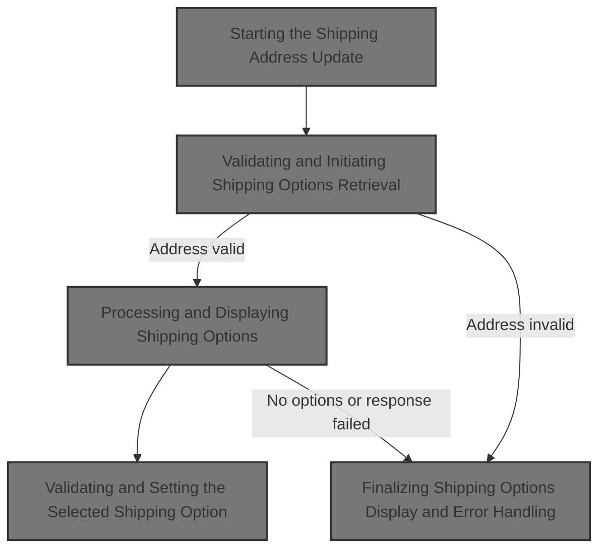
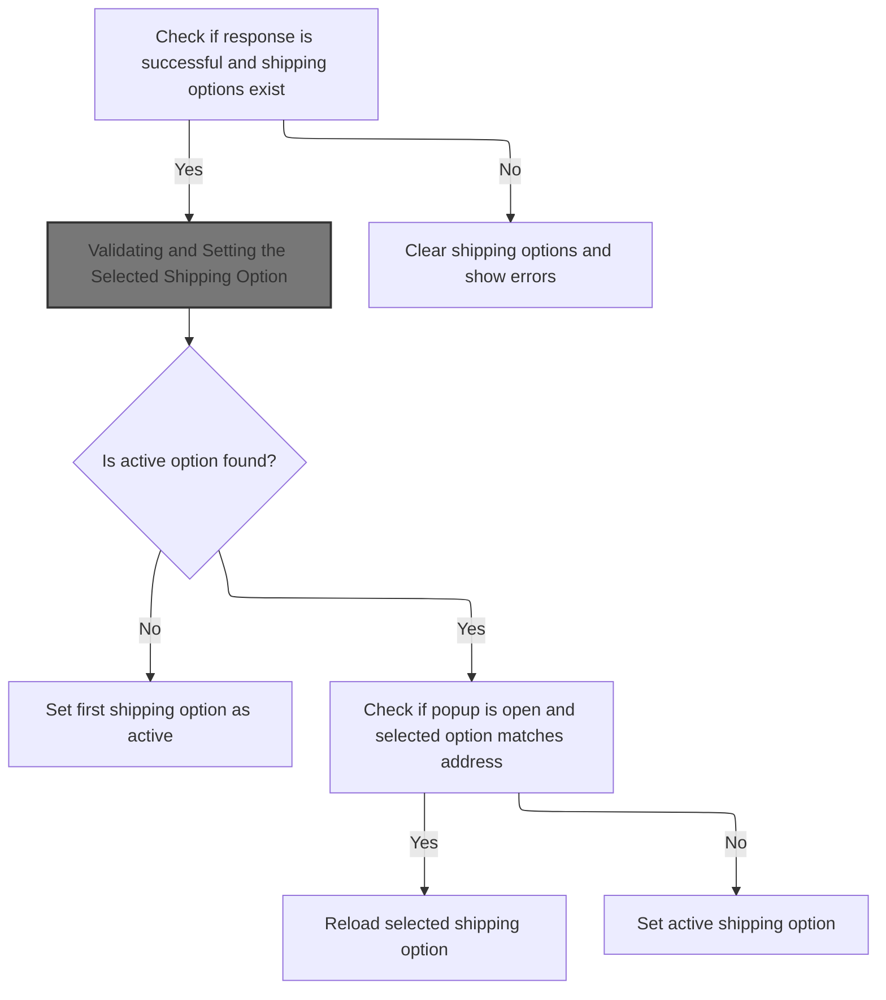
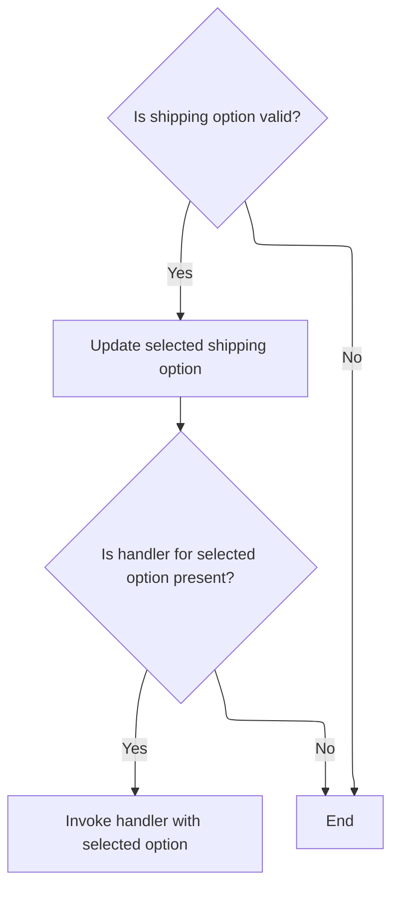
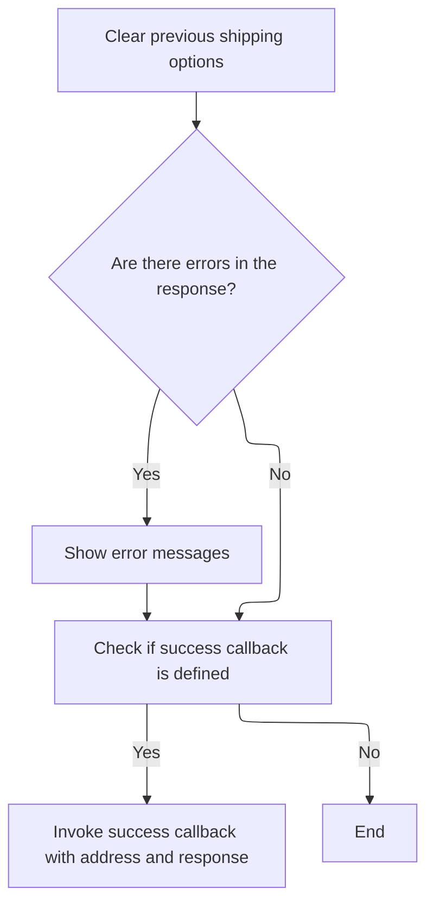
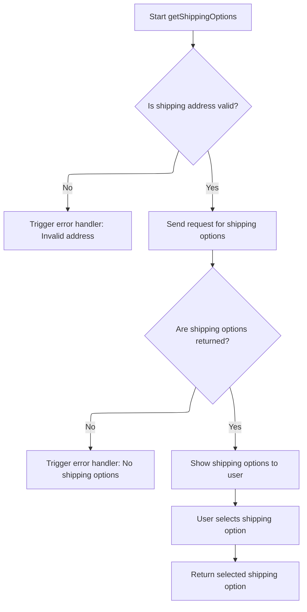

This document describes the flow that updates shipping options when the shipping address changes. It clears previous options, validates the new address, requests updated shipping options, and updates the UI to reflect the available choices.



# Where is this flow used?

This flow is used multiple times in the codebase as represented in the following diagram:

```mermaid
graph TD;
      84fb5b805948b72da2e2bae6afc067e720a45af804cf933d68f376a855b8825a(src/…/js/public.estimateshipping.popup.js::createEstimateShippingPopUp) --> 6a17ed3fb6b1ac3237c5e8329f5648d9ab32ecb499f75f70fdb47ee62c700092(src/…/js/public.estimateshipping.popup.js::addressChangedHandler):::mainFlowStyle

3b2e85b181e075f546a334c4a8f6e733616f432018b39242be0206b8b2e60064(src/…/js/public.estimateshipping.popup.js::init) --> 6a17ed3fb6b1ac3237c5e8329f5648d9ab32ecb499f75f70fdb47ee62c700092(src/…/js/public.estimateshipping.popup.js::addressChangedHandler):::mainFlowStyle


classDef mainFlowStyle color:#000000,fill:#7CB9F4
classDef rootsStyle color:#000000,fill:#00FFF4
classDef Style1 color:#000000,fill:#00FFAA
classDef Style2 color:#000000,fill:#FFFF00
classDef Style3 color:#000000,fill:#AA7CB9

%% Swimm:
%% graph TD;
%%       84fb5b805948b72da2e2bae6afc067e720a45af804cf933d68f376a855b8825a(<SwmPath>[src/…/js/public.estimateshipping.popup.js](src/Presentation/Nop.Web/wwwroot/js/public.estimateshipping.popup.js)</SwmPath>::<SwmToken path="src/Presentation/Nop.Web/wwwroot/js/public.estimateshipping.popup.js" pos="1:3:3" line-data="function createEstimateShippingPopUp(settings) {">`createEstimateShippingPopUp`</SwmToken>) --> 6a17ed3fb6b1ac3237c5e8329f5648d9ab32ecb499f75f70fdb47ee62c700092(<SwmPath>[src/…/js/public.estimateshipping.popup.js](src/Presentation/Nop.Web/wwwroot/js/public.estimateshipping.popup.js)</SwmPath>::<SwmToken path="src/Presentation/Nop.Web/wwwroot/js/public.estimateshipping.popup.js" pos="55:3:3" line-data="      var addressChangedHandler = function () {">`addressChangedHandler`</SwmToken>):::mainFlowStyle
%% 
%% 3b2e85b181e075f546a334c4a8f6e733616f432018b39242be0206b8b2e60064(<SwmPath>[src/…/js/public.estimateshipping.popup.js](src/Presentation/Nop.Web/wwwroot/js/public.estimateshipping.popup.js)</SwmPath>::init) --> 6a17ed3fb6b1ac3237c5e8329f5648d9ab32ecb499f75f70fdb47ee62c700092(<SwmPath>[src/…/js/public.estimateshipping.popup.js](src/Presentation/Nop.Web/wwwroot/js/public.estimateshipping.popup.js)</SwmPath>::<SwmToken path="src/Presentation/Nop.Web/wwwroot/js/public.estimateshipping.popup.js" pos="55:3:3" line-data="      var addressChangedHandler = function () {">`addressChangedHandler`</SwmToken>):::mainFlowStyle
%% 
%% 
%% classDef mainFlowStyle color:#000000,fill:#7CB9F4
%% classDef rootsStyle color:#000000,fill:#00FFF4
%% classDef Style1 color:#000000,fill:#00FFAA
%% classDef Style2 color:#000000,fill:#FFFF00
%% classDef Style3 color:#000000,fill:#AA7CB9
```



# Starting the Shipping Address Update

<SwmSnippet path="/src/Presentation/Nop.Web/wwwroot/js/public.estimateshipping.popup.js" line="55">

---

<SwmToken path="src/Presentation/Nop.Web/wwwroot/js/public.estimateshipping.popup.js" pos="55:3:3" line-data="      var addressChangedHandler = function () {">`addressChangedHandler`</SwmToken> clears previous shipping options, fetches the current shipping address, and triggers fetching new shipping options based on that address. Calling <SwmToken path="src/Presentation/Nop.Web/wwwroot/js/public.estimateshipping.popup.js" pos="58:3:3" line-data="        self.getShippingOptions(address);">`getShippingOptions`</SwmToken> next is necessary to update the available shipping options according to the new address.

```javascript
      var addressChangedHandler = function () {
        self.clearShippingOptions();
        var address = self.getShippingAddress();
        self.getShippingOptions(address);
      };
```

---

</SwmSnippet>

# Validating and Initiating Shipping Options Retrieval

<SwmSnippet path="/src/Presentation/Nop.Web/wwwroot/js/public.estimateshipping.popup.js" line="77">

---

<SwmToken path="src/Presentation/Nop.Web/wwwroot/js/public.estimateshipping.popup.js" pos="77:1:1" line-data="    getShippingOptions: function (address) {">`getShippingOptions`</SwmToken> validates the address first to avoid fetching options for invalid addresses.

```javascript
    getShippingOptions: function (address) {
      if (!this.validateAddress(address))
        return;

```

---

</SwmSnippet>

<SwmSnippet path="/src/Presentation/Nop.Web/wwwroot/js/public.estimateshipping.popup.js" line="295">

---

<SwmToken path="src/Presentation/Nop.Web/wwwroot/js/public.estimateshipping.popup.js" pos="295:1:1" line-data="    validateAddress: function (address) {">`validateAddress`</SwmToken> checks required fields on the address using settings to decide which fields are mandatory and localized messages for errors. It clears old errors, collects new ones if fields like country, city, or postal code are missing, then shows errors if any exist. It assumes the address has specific properties and uses settings to tailor validation.

```javascript
    validateAddress: function (address) {
      this.clearErrorMessage();

      var errors = [];
      var localizedData = this.settings.localizedData;

      if (!(address.countryName && address.countryId > 0))
        errors.push(localizedData.countryErrorMessage);

      if (this.settings.useCity && !address.city)
        errors.push(localizedData.cityErrorMessage);

      if (!this.settings.useCity && !address.zipPostalCode)
        errors.push(localizedData.zipPostalCodeErrorMessage);

      if (errors.length > 0)
        this.showErrorMessage(errors);

      return errors.length === 0;
    }
```

---

</SwmSnippet>

<SwmSnippet path="/src/Presentation/Nop.Web/wwwroot/js/public.estimateshipping.popup.js" line="81">

---

After returning from <SwmToken path="src/Presentation/Nop.Web/wwwroot/js/public.estimateshipping.popup.js" pos="78:7:7" line-data="      if (!this.validateAddress(address))">`validateAddress`</SwmToken> in <SwmToken path="src/Presentation/Nop.Web/wwwroot/js/public.estimateshipping.popup.js" pos="58:3:3" line-data="        self.getShippingOptions(address);">`getShippingOptions`</SwmToken>, the function sets a loading state, triggers a load handler if present, cancels any ongoing request, then makes an AJAX call to fetch shipping options. On success, it calls <SwmToken path="src/Presentation/Nop.Web/wwwroot/js/public.estimateshipping.popup.js" pos="101:3:3" line-data="              self.successHandler(address, response);">`successHandler`</SwmToken> to process and display the options.

```javascript
      var self = this;

      self.setLoadWaiting();

      if (self.settings.handlers.load)
        self.settings.handlers.load();

      clearTimeout(self.params.delayTimer);
      self.params.delayTimer = setTimeout(function () {
        if (self.params.jqXHR && self.params.jqXHR.readyState !== 4)
          self.params.jqXHR.abort();

        var url = self.settings.urlFactory(address);
        if (url) {
          self.params.jqXHR = $.ajax({
            cache: false,
            url: url,
            data: $(self.settings.form).serialize(),
            type: 'POST',
            success: function (response) {
              self.successHandler(address, response);
            },
            error: function (jqXHR, textStatus, errorThrown) {
```

---

</SwmSnippet>

## Processing and Displaying Shipping Options



<SwmSnippet path="/src/Presentation/Nop.Web/wwwroot/js/public.estimateshipping.popup.js" line="120">

---

In <SwmToken path="src/Presentation/Nop.Web/wwwroot/js/public.estimateshipping.popup.js" pos="120:1:1" line-data="    successHandler: function (address, response) {">`successHandler`</SwmToken>, the function clears existing shipping options UI, checks if the response is successful, then iterates over shipping options to find the active one and adds each option to the UI by calling <SwmToken path="src/Presentation/Nop.Web/wwwroot/js/public.estimateshipping.popup.js" pos="144:3:3" line-data="            self.addShippingOption(option.Name, option.DeliveryDateFormat, option.Price);">`addShippingOption`</SwmToken>. This populates the UI with new options.

```javascript
    successHandler: function (address, response) {
      $('.shipping-options-body', $(this.settings.contentEl)).empty();

      if (response.Success) {
        var activeOption;

        var options = response.ShippingOptions;
        if (options && options.length > 0) {
          var self = this;
          var selectedShippingOption = this.params.selectedShippingOption;

          $.each(options, function (i, option) {
            // try select the shipping option with the same provider and address
            if (option.Selected ||
              (selectedShippingOption &&
                selectedShippingOption.provider === option.Name &&
                self.addressesAreEqual(selectedShippingOption.address, address))) {
              activeOption = {
                provider: option.Name,
                price: option.Price,
                address: address,
                deliveryDate: option.DeliveryDateFormat
              };
            }
            self.addShippingOption(option.Name, option.DeliveryDateFormat, option.Price);
          });

```

---

</SwmSnippet>

<SwmSnippet path="/src/Presentation/Nop.Web/wwwroot/js/public.estimateshipping.popup.js" line="206">

---

<SwmToken path="src/Presentation/Nop.Web/wwwroot/js/public.estimateshipping.popup.js" pos="206:1:1" line-data="    addShippingOption: function (name, deliveryDate, price) {">`addShippingOption`</SwmToken> creates a UI row for a shipping option using <SwmToken path="src/Presentation/Nop.Web/wwwroot/js/public.estimateshipping.popup.js" pos="213:57:61" line-data="          .append($(&#39;&lt;input/&gt;&#39;).addClass(&#39;estimate-shipping-radio&#39;).attr({ &#39;type&#39;: &#39;radio&#39;, &#39;name&#39;: &#39;shipping-option&#39; + &#39;-&#39; + this.settings.contentEl }))">`this.settings.contentEl`</SwmToken> to scope elements. It shows name, price, and delivery date (or '-' if missing). It adds a click handler to select the option and update UI classes for active state, then appends it to the container.

```javascript
    addShippingOption: function (name, deliveryDate, price) {
      if (!name || !price) return;

      var shippingOption = $('<div/>').addClass('estimate-shipping-row shipping-option');

      shippingOption
        .append($('<div/>').addClass('estimate-shipping-row-item-radio')
          .append($('<input/>').addClass('estimate-shipping-radio').attr({ 'type': 'radio', 'name': 'shipping-option' + '-' + this.settings.contentEl }))
          .append($('<label/>')))
        .append($('<div/>').addClass('estimate-shipping-row-item shipping-item').text(name))
        .append($('<div/>').addClass('estimate-shipping-row-item shipping-item').text(deliveryDate ? deliveryDate : '-'))
        .append($('<div/>').addClass('estimate-shipping-row-item shipping-item').text(price));

      var self = this;

      shippingOption.on('click', function () {
        $('input[name="shipping-option' + '-' + self.settings.contentEl + '"]', $(this)).prop('checked', true);
        $('.shipping-option.active', $(self.settings.contentEl)).removeClass('active');
        $(this).addClass('active');
      });

      $('.shipping-options-body', $(this.settings.contentEl)).append(shippingOption);
    },
```

---

</SwmSnippet>

<SwmSnippet path="/src/Presentation/Nop.Web/wwwroot/js/public.estimateshipping.popup.js" line="147">

---

After adding shipping options in <SwmToken path="src/Presentation/Nop.Web/wwwroot/js/public.estimateshipping.popup.js" pos="101:3:3" line-data="              self.successHandler(address, response);">`successHandler`</SwmToken>, the code picks a default active option if none matched earlier, then calls <SwmToken path="src/Presentation/Nop.Web/wwwroot/js/public.estimateshipping.popup.js" pos="159:3:3" line-data="            this.selectShippingOption(activeOption);">`selectShippingOption`</SwmToken> to update the selected option state and UI accordingly.

```javascript
          // select the first option
          if (!activeOption) {
            activeOption = {
              provider: options[0].Name,
              price: options[0].Price,
              deliveryDate: options[0].DeliveryDateFormat,
              address: address
            };
          }

          // if we have the already selected shipping options with the same address, reload it
          if (!$.magnificPopup.instance.isOpen && selectedShippingOption && this.addressesAreEqual(selectedShippingOption.address, address))
            this.selectShippingOption(activeOption);

          this.setActiveShippingOption(activeOption);
        } else {
          this.clearShippingOptions();
        }
      } else {
        this.params.displayErrors = true;
        this.clearErrorMessage();
```

---

</SwmSnippet>

### Validating and Setting the Selected Shipping Option



<SwmSnippet path="/src/Presentation/Nop.Web/wwwroot/js/public.estimateshipping.popup.js" line="198">

---

<SwmToken path="src/Presentation/Nop.Web/wwwroot/js/public.estimateshipping.popup.js" pos="198:1:1" line-data="    selectShippingOption: function (option) {">`selectShippingOption`</SwmToken> validates the option's address before setting it as selected.

```javascript
    selectShippingOption: function (option) {
      if (option && option.provider && option.price && this.validateAddress(option.address))
        this.params.selectedShippingOption = option;

```

---

</SwmSnippet>

<SwmSnippet path="/src/Presentation/Nop.Web/wwwroot/js/public.estimateshipping.popup.js" line="202">

---

After validating and setting the selected option in <SwmToken path="src/Presentation/Nop.Web/wwwroot/js/public.estimateshipping.popup.js" pos="159:3:3" line-data="            this.selectShippingOption(activeOption);">`selectShippingOption`</SwmToken>, the function calls a handler if defined to notify other parts of the system about the selection, enabling custom reactions.

```javascript
      if (this.settings.handlers.selectedOption)
        this.settings.handlers.selectedOption(option);
    },
```

---

</SwmSnippet>

### Finalizing Shipping Options Display and Error Handling



<SwmSnippet path="/src/Presentation/Nop.Web/wwwroot/js/public.estimateshipping.popup.js" line="168">

---

After returning from <SwmToken path="src/Presentation/Nop.Web/wwwroot/js/public.estimateshipping.popup.js" pos="159:3:3" line-data="            this.selectShippingOption(activeOption);">`selectShippingOption`</SwmToken> in <SwmToken path="src/Presentation/Nop.Web/wwwroot/js/public.estimateshipping.popup.js" pos="101:3:3" line-data="              self.successHandler(address, response);">`successHandler`</SwmToken>, the function clears shipping options and shows errors if the response failed, then calls a success handler if defined to finalize the flow.

```javascript
        this.clearShippingOptions();
        this.showErrorMessage(response.Errors);
      }

      if (this.settings.handlers.success)
        this.settings.handlers.success(address, response);
    },
```

---

</SwmSnippet>

## Completing the Shipping Options Request with Error Handling



<SwmSnippet path="/src/Presentation/Nop.Web/wwwroot/js/public.estimateshipping.popup.js" line="104">

---

After returning from <SwmToken path="src/Presentation/Nop.Web/wwwroot/js/public.estimateshipping.popup.js" pos="101:3:3" line-data="              self.successHandler(address, response);">`successHandler`</SwmToken> in <SwmToken path="src/Presentation/Nop.Web/wwwroot/js/public.estimateshipping.popup.js" pos="58:3:3" line-data="        self.getShippingOptions(address);">`getShippingOptions`</SwmToken>, the function defines error and complete handlers for the AJAX request. Calling <SwmToken path="src/Presentation/Nop.Web/wwwroot/js/public.estimateshipping.popup.js" pos="104:3:3" line-data="              self.errorHandler(jqXHR, textStatus, errorThrown);">`errorHandler`</SwmToken> on failure manages cleanup and error display.

```javascript
              self.errorHandler(jqXHR, textStatus, errorThrown);
            },
            complete: function (jqXHR, textStatus) {
              if (self.settings.handlers.complete)
                self.settings.handlers.complete(jqXHR, textStatus);
            }
          });
        }
      }, self.settings.requestDelay);
    },
```

---

</SwmSnippet>

<SwmSnippet path="/src/Presentation/Nop.Web/wwwroot/js/public.estimateshipping.popup.js" line="176">

---

<SwmToken path="src/Presentation/Nop.Web/wwwroot/js/public.estimateshipping.popup.js" pos="176:1:1" line-data="    errorHandler: function (jqXHR, textStatus, errorThrown) {">`errorHandler`</SwmToken> ignores aborted requests, clears shipping options on errors, and calls an error handler if defined to manage UI and state cleanup.

```javascript
    errorHandler: function (jqXHR, textStatus, errorThrown) {
      if (textStatus === 'abort') return;

      this.clearShippingOptions();

      if (this.settings.handlers.error)
        this.settings.handlers.error(jqXHR, textStatus, errorThrown);
    },
```

---

</SwmSnippet>

&nbsp;

*This is an auto-generated document by Swimm 🌊 and has not yet been verified by a human*

<SwmMeta version="3.0.0" repo-id="Z2l0aHViJTNBJTNBbnBDb21tZXJjZUFTUERvdG5ldCUzQSUzQXVtYWxpbmdhc3dhbWk=" repo-name="npCommerceASPDotnet"><sup>Powered by [Swimm](https://app.swimm.io/)</sup></SwmMeta>
