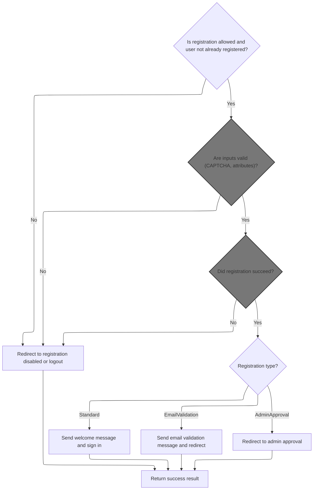
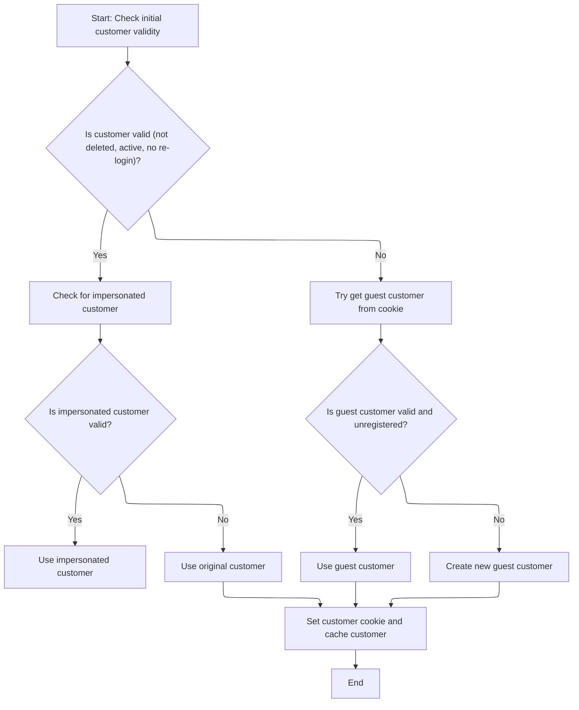

This document describes the registration flow for new users in the eCommerce platform. It covers checking registration availability, setting the user context, validating inputs and consents, saving user data, and handling post-registration actions such as sign-in, email validation, or admin approval.

# Starting the registration process



<SwmSnippet path="/src/Presentation/Nop.Web/Controllers/CustomerController.cs" line="766">

---

Here we start the registration process by checking if registration is allowed and if the current user is already registered. If so, we sign them out and raise a logout event. Then, we proceed to get the current customer context to continue the flow.

```c#
        public virtual async Task<IActionResult> Register(RegisterModel model, string returnUrl, bool captchaValid, IFormCollection form)
        {
            //check whether registration is allowed
            if (_customerSettings.UserRegistrationType == UserRegistrationType.Disabled)
                return RedirectToRoute("RegisterResult", new { resultId = (int)UserRegistrationType.Disabled, returnUrl });

            if (await _customerService.IsRegisteredAsync(await _workContext.GetCurrentCustomerAsync()))
            {
                //Already registered customer. 
                await _authenticationService.SignOutAsync();

                //raise logged out event       
                await _eventPublisher.PublishAsync(new CustomerLoggedOutEvent(await _workContext.GetCurrentCustomerAsync()));

```

---

</SwmSnippet>

## Retrieving the current customer context

<SwmSnippet path="/src/Presentation/Nop.Web.Framework/WebWorkContext.cs" line="199">

---

We return the cached customer or resolve and cache it if missing.

```c#
        public virtual async Task<Customer> GetCurrentCustomerAsync()
        {
            //whether there is a cached value
            if (_cachedCustomer != null)
                return _cachedCustomer;

            await SetCurrentCustomerAsync();

            return _cachedCustomer;
        }
```

---

</SwmSnippet>

## Determining and setting the current customer context

<SwmSnippet path="/src/Presentation/Nop.Web.Framework/WebWorkContext.cs" line="215">

---

In <SwmToken path="src/Presentation/Nop.Web.Framework/WebWorkContext.cs" pos="215:9:9" line-data="        public virtual async Task SetCurrentCustomerAsync(Customer customer = null)">`SetCurrentCustomerAsync`</SwmToken> we determine the current customer by checking if the request is from a background task or search engine, then fallback to authenticated user or guest. This sets the context correctly for different request types.

```c#
        public virtual async Task SetCurrentCustomerAsync(Customer customer = null)
        {
            if (customer == null)
            {
                //check whether request is made by a background (schedule) task
                if (_httpContextAccessor.HttpContext?.Request
                    ?.Path.Equals(new PathString($"/{Services.Tasks.NopTaskDefaults.ScheduleTaskPath}"), StringComparison.InvariantCultureIgnoreCase)
                    ?? true)
                {
                    //in this case return built-in customer record for background task
                    customer = await _customerService.GetOrCreateBackgroundTaskUserAsync();
                }

                if (customer == null || customer.Deleted || !customer.Active || customer.RequireReLogin)
                {
                    //check whether request is made by a search engine, in this case return built-in customer record for search engines
                    if (_userAgentHelper.IsSearchEngine())
                        customer = await _customerService.GetOrCreateSearchEngineUserAsync();
                }

                if (customer == null || customer.Deleted || !customer.Active || customer.RequireReLogin)
                {
                    //try to get registered user
                    customer = await _authenticationService.GetAuthenticatedCustomerAsync();
                }

```

---

</SwmSnippet>

### Authenticating the customer via cookies

See <SwmLink doc-title="Retrieving the Authenticated Customer">[Retrieving the Authenticated Customer](.swm%5Cretrieving-the-authenticated-customer.b2wbhncz.sw.md)</SwmLink>

### Handling impersonation and guest customer identification



<SwmSnippet path="/src/Presentation/Nop.Web.Framework/WebWorkContext.cs" line="241">

---

After returning from `CookieAuthenticationService.GetAuthenticatedCustomerAsync`, <SwmToken path="src/Presentation/Nop.Web/Controllers/CustomerController.cs" pos="781:5:5" line-data="                await _workContext.SetCurrentCustomerAsync(await _customerService.InsertGuestCustomerAsync());">`SetCurrentCustomerAsync`</SwmToken> checks for impersonation, guest cookies, and creates a guest if needed. It then sets a cookie and caches the customer for consistent context.

```c#
                if (customer != null && !customer.Deleted && customer.Active && !customer.RequireReLogin)
                {
                    //get impersonate user if required
                    var impersonatedCustomerId = await _genericAttributeService
                        .GetAttributeAsync<int?>(customer, NopCustomerDefaults.ImpersonatedCustomerIdAttribute);
                    if (impersonatedCustomerId.HasValue && impersonatedCustomerId.Value > 0)
                    {
                        var impersonatedCustomer = await _customerService.GetCustomerByIdAsync(impersonatedCustomerId.Value);
                        if (impersonatedCustomer != null && !impersonatedCustomer.Deleted &&
                            impersonatedCustomer.Active &&
                            !impersonatedCustomer.RequireReLogin)
                        {
                            //set impersonated customer
                            _originalCustomerIfImpersonated = customer;
                            customer = impersonatedCustomer;
                        }
                    }
                }

                if (customer == null || customer.Deleted || !customer.Active || customer.RequireReLogin)
                {
                    //get guest customer
                    var customerCookie = GetCustomerCookie();
                    if (Guid.TryParse(customerCookie, out var customerGuid))
                    {
                        //get customer from cookie (should not be registered)
                        var customerByCookie = await _customerService.GetCustomerByGuidAsync(customerGuid);
                        if (customerByCookie != null && !await _customerService.IsRegisteredAsync(customerByCookie))
                            customer = customerByCookie;
                    }
                }

                if (customer == null || customer.Deleted || !customer.Active || customer.RequireReLogin)
                {
                    //create guest if not exists
                    customer = await _customerService.InsertGuestCustomerAsync();
                }
            }

            if (!customer.Deleted && customer.Active && !customer.RequireReLogin)
            {
                //set customer cookie
                SetCustomerCookie(customer.CustomerGuid);

                //cache the found customer
                _cachedCustomer = customer;
            }
        }
```

---

</SwmSnippet>

## Continuing registration after customer context is set

```mermaid
%%{init: {"flowchart": {"defaultRenderer": "elk"}} }%%
flowchart TD
    node1["Create guest customer and set current customer"]
    click node1 openCode "src/Presentation/Nop.Web/Controllers/CustomerController.cs:780:783"
    node1 --> node2["Parse customer attributes"]
    click node2 openCode "src/Presentation/Nop.Web/Controllers/CustomerController.cs:787:789"

    subgraph loop1["For each customer attribute warning"]
        node2 --> node3["Handle attribute warning"]
        click node3 openCode "src/Presentation/Nop.Web/Controllers/CustomerController.cs:789:792"
        node3 --> node2
    end

    node2 --> node4{"Is CAPTCHA valid?"}
    click node4 openCode "src/Presentation/Nop.Web/Controllers/CustomerController.cs:794:798"
    node4 -->|"No"| node5["Add CAPTCHA error"]
    click node5 openCode "src/Presentation/Nop.Web/Controllers/CustomerController.cs:796:798"
    node4 -->|"Yes"| node6{"GDPR enabled and required consents provided?"}
    click node6 openCode "src/Presentation/Nop.Web/Controllers/CustomerController.cs:801:807"

    subgraph loop2["For each GDPR consent"]
        node6 --> node7["Log consent agree or disagree"]
        click node7 openCode "src/Presentation/Nop.Web/Controllers/CustomerController.cs:937:952"
        node7 --> node6
    end

    node6 --> node8{"Is model state valid?"}
    click node8 openCode "src/Presentation/Nop.Web/Controllers/CustomerController.cs:809:810"
    node8 -->|"No"| node9["Redisplay registration form with errors"]
    click node9 openCode "src/Presentation/Nop.Web/Controllers/CustomerController.cs:1041:1044"
    node8 -->|"Yes"| node10["Register customer"]
    click node10 openCode "src/Presentation/Nop.Web/Controllers/CustomerController.cs:814:823"
    node10 --> node11{"Registration success?"}
    click node11 openCode "src/Presentation/Nop.Web/Controllers/CustomerController.cs:823:824"
    node11 -->|"No"| node9
    node11 -->|"Yes"| node12["Save customer attributes and newsletter subscription"]
    click node12 openCode "src/Presentation/Nop.Web/Controllers/CustomerController.cs:825:922"
    node12 --> node13["Insert default address if valid"]
    click node13 openCode "src/Presentation/Nop.Web/Controllers/CustomerController.cs:959:998"
    node13 --> node14["Send notifications and publish events"]
    click node14 openCode "src/Presentation/Nop.Web/Controllers/CustomerController.cs:1001:1007"
    node14 --> node15{"User registration type"}
    click node15 openCode "src/Presentation/Nop.Web/Controllers/CustomerController.cs:1008:1033"
    node15 -->|EmailValidation| node16["Send email validation message and redirect"]
    click node16 openCode "src/Presentation/Nop.Web/Controllers/CustomerController.cs:1011:1016"
    node15 -->|AdminApproval| node17["Redirect to admin approval page"]
    click node17 openCode "src/Presentation/Nop.Web/Controllers/CustomerController.cs:1018:1020"
    node15 -->|"Standard"| node18["Send welcome message, sign in customer, redirect"]
    click node18 openCode "src/Presentation/Nop.Web/Controllers/CustomerController.cs:1022:1030"
    node15 -->|"Other"| node19["Redirect to homepage"]
    click node19 openCode "src/Presentation/Nop.Web/Controllers/CustomerController.cs:1031:1033"
classDef HeadingStyle fill:#777777,stroke:#333,stroke-width:2px;

%% Swimm:
%% %%{init: {"flowchart": {"defaultRenderer": "elk"}} }%%
%% flowchart TD
%%     node1["Create guest customer and set current customer"]
%%     click node1 openCode "<SwmPath>[src/…/Controllers/CustomerController.cs](src/Presentation/Nop.Web/Controllers/CustomerController.cs)</SwmPath>:780:783"
%%     node1 --> node2["Parse customer attributes"]
%%     click node2 openCode "<SwmPath>[src/…/Controllers/CustomerController.cs](src/Presentation/Nop.Web/Controllers/CustomerController.cs)</SwmPath>:787:789"
%% 
%%     subgraph loop1["For each customer attribute warning"]
%%         node2 --> node3["Handle attribute warning"]
%%         click node3 openCode "<SwmPath>[src/…/Controllers/CustomerController.cs](src/Presentation/Nop.Web/Controllers/CustomerController.cs)</SwmPath>:789:792"
%%         node3 --> node2
%%     end
%% 
%%     node2 --> node4{"Is CAPTCHA valid?"}
%%     click node4 openCode "<SwmPath>[src/…/Controllers/CustomerController.cs](src/Presentation/Nop.Web/Controllers/CustomerController.cs)</SwmPath>:794:798"
%%     node4 -->|"No"| node5["Add CAPTCHA error"]
%%     click node5 openCode "<SwmPath>[src/…/Controllers/CustomerController.cs](src/Presentation/Nop.Web/Controllers/CustomerController.cs)</SwmPath>:796:798"
%%     node4 -->|"Yes"| node6{"GDPR enabled and required consents provided?"}
%%     click node6 openCode "<SwmPath>[src/…/Controllers/CustomerController.cs](src/Presentation/Nop.Web/Controllers/CustomerController.cs)</SwmPath>:801:807"
%% 
%%     subgraph loop2["For each GDPR consent"]
%%         node6 --> node7["Log consent agree or disagree"]
%%         click node7 openCode "<SwmPath>[src/…/Controllers/CustomerController.cs](src/Presentation/Nop.Web/Controllers/CustomerController.cs)</SwmPath>:937:952"
%%         node7 --> node6
%%     end
%% 
%%     node6 --> node8{"Is model state valid?"}
%%     click node8 openCode "<SwmPath>[src/…/Controllers/CustomerController.cs](src/Presentation/Nop.Web/Controllers/CustomerController.cs)</SwmPath>:809:810"
%%     node8 -->|"No"| node9["Redisplay registration form with errors"]
%%     click node9 openCode "<SwmPath>[src/…/Controllers/CustomerController.cs](src/Presentation/Nop.Web/Controllers/CustomerController.cs)</SwmPath>:1041:1044"
%%     node8 -->|"Yes"| node10["Register customer"]
%%     click node10 openCode "<SwmPath>[src/…/Controllers/CustomerController.cs](src/Presentation/Nop.Web/Controllers/CustomerController.cs)</SwmPath>:814:823"
%%     node10 --> node11{"Registration success?"}
%%     click node11 openCode "<SwmPath>[src/…/Controllers/CustomerController.cs](src/Presentation/Nop.Web/Controllers/CustomerController.cs)</SwmPath>:823:824"
%%     node11 -->|"No"| node9
%%     node11 -->|"Yes"| node12["Save customer attributes and newsletter subscription"]
%%     click node12 openCode "<SwmPath>[src/…/Controllers/CustomerController.cs](src/Presentation/Nop.Web/Controllers/CustomerController.cs)</SwmPath>:825:922"
%%     node12 --> node13["Insert default address if valid"]
%%     click node13 openCode "<SwmPath>[src/…/Controllers/CustomerController.cs](src/Presentation/Nop.Web/Controllers/CustomerController.cs)</SwmPath>:959:998"
%%     node13 --> node14["Send notifications and publish events"]
%%     click node14 openCode "<SwmPath>[src/…/Controllers/CustomerController.cs](src/Presentation/Nop.Web/Controllers/CustomerController.cs)</SwmPath>:1001:1007"
%%     node14 --> node15{"User registration type"}
%%     click node15 openCode "<SwmPath>[src/…/Controllers/CustomerController.cs](src/Presentation/Nop.Web/Controllers/CustomerController.cs)</SwmPath>:1008:1033"
%%     node15 -->|<SwmToken path="src/Presentation/Nop.Web/Controllers/CustomerController.cs" pos="879:15:15" line-data="                        var isNewsletterActive = _customerSettings.UserRegistrationType != UserRegistrationType.EmailValidation;">`EmailValidation`</SwmToken>| node16["Send email validation message and redirect"]
%%     click node16 openCode "<SwmPath>[src/…/Controllers/CustomerController.cs](src/Presentation/Nop.Web/Controllers/CustomerController.cs)</SwmPath>:1011:1016"
%%     node15 -->|<SwmToken path="src/Presentation/Nop.Web/Controllers/CustomerController.cs" pos="1018:5:5" line-data="                        case UserRegistrationType.AdminApproval:">`AdminApproval`</SwmToken>| node17["Redirect to admin approval page"]
%%     click node17 openCode "<SwmPath>[src/…/Controllers/CustomerController.cs](src/Presentation/Nop.Web/Controllers/CustomerController.cs)</SwmPath>:1018:1020"
%%     node15 -->|"Standard"| node18["Send welcome message, sign in customer, redirect"]
%%     click node18 openCode "<SwmPath>[src/…/Controllers/CustomerController.cs](src/Presentation/Nop.Web/Controllers/CustomerController.cs)</SwmPath>:1022:1030"
%%     node15 -->|"Other"| node19["Redirect to homepage"]
%%     click node19 openCode "<SwmPath>[src/…/Controllers/CustomerController.cs](src/Presentation/Nop.Web/Controllers/CustomerController.cs)</SwmPath>:1031:1033"
%% classDef HeadingStyle fill:#777777,stroke:#333,stroke-width:2px;
```



<SwmSnippet path="/src/Presentation/Nop.Web/Controllers/CustomerController.cs" line="780">

---

We insert and set a guest customer to ensure valid context for registration.

```c#
                //Save a new record
                await _workContext.SetCurrentCustomerAsync(await _customerService.InsertGuestCustomerAsync());
            }
```

---

</SwmSnippet>

<SwmSnippet path="/src/Presentation/Nop.Web/Controllers/CustomerController.cs" line="783">

---

Back in `CustomerController.Register`, after setting the current customer, we get it again to have the updated customer object for the next steps.

```c#
            var customer = await _workContext.GetCurrentCustomerAsync();
```

---

</SwmSnippet>

<SwmSnippet path="/src/Presentation/Nop.Web/Controllers/CustomerController.cs" line="784">

---

In `CustomerController.Register` after getting the current customer, we handle GDPR consents validation, VAT number saving and validation, and newsletter subscription management based on form data and settings.

```c#
            customer.RegisteredInStoreId = (await _storeContext.GetCurrentStoreAsync()).Id;

            //custom customer attributes
            var customerAttributesXml = await ParseCustomCustomerAttributesAsync(form);
            var customerAttributeWarnings = await _customerAttributeParser.GetAttributeWarningsAsync(customerAttributesXml);
            foreach (var error in customerAttributeWarnings)
            {
                ModelState.AddModelError("", error);
            }

            //validate CAPTCHA
            if (_captchaSettings.Enabled && _captchaSettings.ShowOnRegistrationPage && !captchaValid)
            {
                ModelState.AddModelError("", await _localizationService.GetResourceAsync("Common.WrongCaptchaMessage"));
            }

            //GDPR
            if (_gdprSettings.GdprEnabled)
            {
                var consents = (await _gdprService
                    .GetAllConsentsAsync()).Where(consent => consent.DisplayDuringRegistration && consent.IsRequired).ToList();

                ValidateRequiredConsents(consents, form);
            }

            if (ModelState.IsValid)
            {
                var customerUserName = model.Username?.Trim();
                var customerEmail = model.Email?.Trim();

                var isApproved = _customerSettings.UserRegistrationType == UserRegistrationType.Standard;
                var registrationRequest = new CustomerRegistrationRequest(customer,
                    customerEmail,
                    _customerSettings.UsernamesEnabled ? customerUserName : customerEmail,
                    model.Password,
                    _customerSettings.DefaultPasswordFormat,
                    (await _storeContext.GetCurrentStoreAsync()).Id,
                    isApproved);
                var registrationResult = await _customerRegistrationService.RegisterCustomerAsync(registrationRequest);
                if (registrationResult.Success)
                {
                    //properties
                    if (_dateTimeSettings.AllowCustomersToSetTimeZone)
                    {
                        await _genericAttributeService.SaveAttributeAsync(customer, NopCustomerDefaults.TimeZoneIdAttribute, model.TimeZoneId);
                    }
                    //VAT number
                    if (_taxSettings.EuVatEnabled)
                    {
                        await _genericAttributeService.SaveAttributeAsync(customer, NopCustomerDefaults.VatNumberAttribute, model.VatNumber);

                        var (vatNumberStatus, _, vatAddress) = await _taxService.GetVatNumberStatusAsync(model.VatNumber);
                        await _genericAttributeService.SaveAttributeAsync(customer, NopCustomerDefaults.VatNumberStatusIdAttribute, (int)vatNumberStatus);
                        //send VAT number admin notification
                        if (!string.IsNullOrEmpty(model.VatNumber) && _taxSettings.EuVatEmailAdminWhenNewVatSubmitted)
                            await _workflowMessageService.SendNewVatSubmittedStoreOwnerNotificationAsync(customer, model.VatNumber, vatAddress, _localizationSettings.DefaultAdminLanguageId);
                    }

                    //form fields
                    if (_customerSettings.GenderEnabled)
                        await _genericAttributeService.SaveAttributeAsync(customer, NopCustomerDefaults.GenderAttribute, model.Gender);
                    if (_customerSettings.FirstNameEnabled)
                        await _genericAttributeService.SaveAttributeAsync(customer, NopCustomerDefaults.FirstNameAttribute, model.FirstName);
                    if (_customerSettings.LastNameEnabled)
                        await _genericAttributeService.SaveAttributeAsync(customer, NopCustomerDefaults.LastNameAttribute, model.LastName);
                    if (_customerSettings.DateOfBirthEnabled)
                    {
                        var dateOfBirth = model.ParseDateOfBirth();
                        await _genericAttributeService.SaveAttributeAsync(customer, NopCustomerDefaults.DateOfBirthAttribute, dateOfBirth);
                    }
                    if (_customerSettings.CompanyEnabled)
                        await _genericAttributeService.SaveAttributeAsync(customer, NopCustomerDefaults.CompanyAttribute, model.Company);
                    if (_customerSettings.StreetAddressEnabled)
                        await _genericAttributeService.SaveAttributeAsync(customer, NopCustomerDefaults.StreetAddressAttribute, model.StreetAddress);
                    if (_customerSettings.StreetAddress2Enabled)
                        await _genericAttributeService.SaveAttributeAsync(customer, NopCustomerDefaults.StreetAddress2Attribute, model.StreetAddress2);
                    if (_customerSettings.ZipPostalCodeEnabled)
                        await _genericAttributeService.SaveAttributeAsync(customer, NopCustomerDefaults.ZipPostalCodeAttribute, model.ZipPostalCode);
                    if (_customerSettings.CityEnabled)
                        await _genericAttributeService.SaveAttributeAsync(customer, NopCustomerDefaults.CityAttribute, model.City);
                    if (_customerSettings.CountyEnabled)
                        await _genericAttributeService.SaveAttributeAsync(customer, NopCustomerDefaults.CountyAttribute, model.County);
                    if (_customerSettings.CountryEnabled)
                        await _genericAttributeService.SaveAttributeAsync(customer, NopCustomerDefaults.CountryIdAttribute, model.CountryId);
                    if (_customerSettings.CountryEnabled && _customerSettings.StateProvinceEnabled)
                        await _genericAttributeService.SaveAttributeAsync(customer, NopCustomerDefaults.StateProvinceIdAttribute,
                            model.StateProvinceId);
                    if (_customerSettings.PhoneEnabled)
                        await _genericAttributeService.SaveAttributeAsync(customer, NopCustomerDefaults.PhoneAttribute, model.Phone);
                    if (_customerSettings.FaxEnabled)
                        await _genericAttributeService.SaveAttributeAsync(customer, NopCustomerDefaults.FaxAttribute, model.Fax);

                    //newsletter
                    if (_customerSettings.NewsletterEnabled)
                    {
                        var isNewsletterActive = _customerSettings.UserRegistrationType != UserRegistrationType.EmailValidation;

                        //save newsletter value
                        var newsletter = await _newsLetterSubscriptionService.GetNewsLetterSubscriptionByEmailAndStoreIdAsync(customerEmail, (await _storeContext.GetCurrentStoreAsync()).Id);
                        if (newsletter != null)
                        {
                            if (model.Newsletter)
                            {
                                newsletter.Active = isNewsletterActive;
                                await _newsLetterSubscriptionService.UpdateNewsLetterSubscriptionAsync(newsletter);

                                //GDPR
                                if (_gdprSettings.GdprEnabled && _gdprSettings.LogNewsletterConsent)
                                {
                                    await _gdprService.InsertLogAsync(customer, 0, GdprRequestType.ConsentAgree, await _localizationService.GetResourceAsync("Gdpr.Consent.Newsletter"));
                                }
                            }
                            //else
                            //{
                            //When registering, not checking the newsletter check box should not take an existing email address off of the subscription list.
                            //_newsLetterSubscriptionService.DeleteNewsLetterSubscription(newsletter);
                            //}
                        }
                        else
                        {
                            if (model.Newsletter)
                            {
                                await _newsLetterSubscriptionService.InsertNewsLetterSubscriptionAsync(new NewsLetterSubscription
                                {
                                    NewsLetterSubscriptionGuid = Guid.NewGuid(),
                                    Email = customerEmail,
                                    Active = isNewsletterActive,
                                    StoreId = (await _storeContext.GetCurrentStoreAsync()).Id,
                                    CreatedOnUtc = DateTime.UtcNow
                                });

                                //GDPR
                                if (_gdprSettings.GdprEnabled && _gdprSettings.LogNewsletterConsent)
                                {
                                    await _gdprService.InsertLogAsync(customer, 0, GdprRequestType.ConsentAgree, await _localizationService.GetResourceAsync("Gdpr.Consent.Newsletter"));
                                }
                            }
                        }
                    }

                    if (_customerSettings.AcceptPrivacyPolicyEnabled)
                    {
                        //privacy policy is required
                        //GDPR
                        if (_gdprSettings.GdprEnabled && _gdprSettings.LogPrivacyPolicyConsent)
                        {
                            await _gdprService.InsertLogAsync(customer, 0, GdprRequestType.ConsentAgree, await _localizationService.GetResourceAsync("Gdpr.Consent.PrivacyPolicy"));
                        }
                    }

                    //GDPR
                    if (_gdprSettings.GdprEnabled)
                    {
                        var consents = (await _gdprService.GetAllConsentsAsync()).Where(consent => consent.DisplayDuringRegistration).ToList();
                        foreach (var consent in consents)
                        {
                            var controlId = $"consent{consent.Id}";
                            var cbConsent = form[controlId];
                            if (!StringValues.IsNullOrEmpty(cbConsent) && cbConsent.ToString().Equals("on"))
                            {
                                //agree
                                await _gdprService.InsertLogAsync(customer, consent.Id, GdprRequestType.ConsentAgree, consent.Message);
                            }
                            else
                            {
                                //disagree
                                await _gdprService.InsertLogAsync(customer, consent.Id, GdprRequestType.ConsentDisagree, consent.Message);
                            }
                        }
```

---

</SwmSnippet>

<SwmSnippet path="/src/Presentation/Nop.Web/Controllers/CustomerController.cs" line="955">

---

Finally in `CustomerController.Register` we save customer attributes, create and validate a default address, then branch the registration flow based on <SwmToken path="src/Presentation/Nop.Web/Controllers/CustomerController.cs" pos="1008:6:6" line-data="                    switch (_customerSettings.UserRegistrationType)">`UserRegistrationType`</SwmToken> to send emails, redirect, or sign in the customer.

```c#
                    //save customer attributes
                    await _genericAttributeService.SaveAttributeAsync(customer, NopCustomerDefaults.CustomCustomerAttributes, customerAttributesXml);

                    //insert default address (if possible)
                    var defaultAddress = new Address
                    {
                        FirstName = await _genericAttributeService.GetAttributeAsync<string>(customer, NopCustomerDefaults.FirstNameAttribute),
                        LastName = await _genericAttributeService.GetAttributeAsync<string>(customer, NopCustomerDefaults.LastNameAttribute),
                        Email = customer.Email,
                        Company = await _genericAttributeService.GetAttributeAsync<string>(customer, NopCustomerDefaults.CompanyAttribute),
                        CountryId = await _genericAttributeService.GetAttributeAsync<int>(customer, NopCustomerDefaults.CountryIdAttribute) > 0
                            ? (int?)await _genericAttributeService.GetAttributeAsync<int>(customer, NopCustomerDefaults.CountryIdAttribute)
                            : null,
                        StateProvinceId = await _genericAttributeService.GetAttributeAsync<int>(customer, NopCustomerDefaults.StateProvinceIdAttribute) > 0
                            ? (int?)await _genericAttributeService.GetAttributeAsync<int>(customer, NopCustomerDefaults.StateProvinceIdAttribute)
                            : null,
                        County = await _genericAttributeService.GetAttributeAsync<string>(customer, NopCustomerDefaults.CountyAttribute),
                        City = await _genericAttributeService.GetAttributeAsync<string>(customer, NopCustomerDefaults.CityAttribute),
                        Address1 = await _genericAttributeService.GetAttributeAsync<string>(customer, NopCustomerDefaults.StreetAddressAttribute),
                        Address2 = await _genericAttributeService.GetAttributeAsync<string>(customer, NopCustomerDefaults.StreetAddress2Attribute),
                        ZipPostalCode = await _genericAttributeService.GetAttributeAsync<string>(customer, NopCustomerDefaults.ZipPostalCodeAttribute),
                        PhoneNumber = await _genericAttributeService.GetAttributeAsync<string>(customer, NopCustomerDefaults.PhoneAttribute),
                        FaxNumber = await _genericAttributeService.GetAttributeAsync<string>(customer, NopCustomerDefaults.FaxAttribute),
                        CreatedOnUtc = customer.CreatedOnUtc
                    };
                    if (await _addressService.IsAddressValidAsync(defaultAddress))
                    {
                        //some validation
                        if (defaultAddress.CountryId == 0)
                            defaultAddress.CountryId = null;
                        if (defaultAddress.StateProvinceId == 0)
                            defaultAddress.StateProvinceId = null;
                        //set default address
                        //customer.Addresses.Add(defaultAddress);

                        await _addressService.InsertAddressAsync(defaultAddress);

                        await _customerService.InsertCustomerAddressAsync(customer, defaultAddress);

                        customer.BillingAddressId = defaultAddress.Id;
                        customer.ShippingAddressId = defaultAddress.Id;

                        await _customerService.UpdateCustomerAsync(customer);
                    }

                    //notifications
                    if (_customerSettings.NotifyNewCustomerRegistration)
                        await _workflowMessageService.SendCustomerRegisteredNotificationMessageAsync(customer,
                            _localizationSettings.DefaultAdminLanguageId);

                    //raise event       
                    await _eventPublisher.PublishAsync(new CustomerRegisteredEvent(customer));

                    switch (_customerSettings.UserRegistrationType)
                    {
                        case UserRegistrationType.EmailValidation:
                            //email validation message
                            await _genericAttributeService.SaveAttributeAsync(customer, NopCustomerDefaults.AccountActivationTokenAttribute, Guid.NewGuid().ToString());
                            await _workflowMessageService.SendCustomerEmailValidationMessageAsync(customer, (await _workContext.GetWorkingLanguageAsync()).Id);

                            //result
                            return RedirectToRoute("RegisterResult", new { resultId = (int)UserRegistrationType.EmailValidation, returnUrl });

                        case UserRegistrationType.AdminApproval:
                            return RedirectToRoute("RegisterResult", new { resultId = (int)UserRegistrationType.AdminApproval, returnUrl });

                        case UserRegistrationType.Standard:
                            //send customer welcome message
                            await _workflowMessageService.SendCustomerWelcomeMessageAsync(customer, (await _workContext.GetWorkingLanguageAsync()).Id);

                            //raise event       
                            await _eventPublisher.PublishAsync(new CustomerActivatedEvent(customer));

                            returnUrl = Url.RouteUrl("RegisterResult", new { resultId = (int)UserRegistrationType.Standard, returnUrl });
                            return await _customerRegistrationService.SignInCustomerAsync(customer, returnUrl, true);

                        default:
                            return RedirectToRoute("Homepage");
                    }
                }

                //errors
                foreach (var error in registrationResult.Errors)
                    ModelState.AddModelError("", error);
            }

            //If we got this far, something failed, redisplay form
            model = await _customerModelFactory.PrepareRegisterModelAsync(model, true, customerAttributesXml);

            return View(model);
        }
```

---

</SwmSnippet>

&nbsp;

*This is an auto-generated document by Swimm 🌊 and has not yet been verified by a human*

<SwmMeta version="3.0.0" repo-id="Z2l0aHViJTNBJTNBbnBDb21tZXJjZUFTUERvdG5ldCUzQSUzQXVtYWxpbmdhc3dhbWk=" repo-name="npCommerceASPDotnet"><sup>Powered by [Swimm](https://app.swimm.io/)</sup></SwmMeta>
